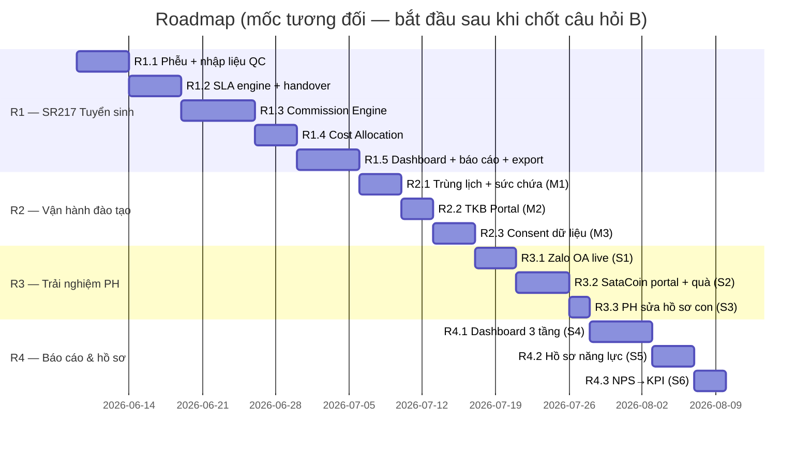

# Roadmap triển khai theo Release

> 📂 **KẾ HOẠCH CHI TIẾT THEO PHASE (kèm test Playwright + quy trình task→test→check):** xem thư mục [`phases/`](phases/README.md) — mỗi phase A0→R7 có file riêng với danh sách task, test case bắt buộc, exit criteria.
>
> ⚠️ **SUPERSEDED (2026-06-05):** Roadmap CHỐT hiện tại nằm ở `Document/2-architecture-design/15-final-architecture-blueprint.md` §9 (A0 → R1 CRM Messenger/Marketing/Commission → R2 SIS/Finance → R3 LMS → R4 Portal → R5 HR). Khác biệt chính so với file này: **Zalo OA/ZNS + SataCoin quà + payment gateway lùi về backlog sau core**; commission nằm trong R1; thêm Ads Insights sync + Messenger inbox. File này giữ làm tham chiếu chi tiết task R2-cũ (trùng lịch/TKB/consent — nay phân bổ vào R3/R4 mới).

> **Input:** 2 gap analysis + user stories (`2-ba-phan-tich/`).
> **Điều kiện khởi động:** khách trả lời `1-pm-tiep-nhan/03-cau-hoi-xac-nhan-khach-hang.md` (tối thiểu nhóm B trước R1).
> Ước lượng theo 1 dev chính (mô hình hiện tại) — chạy tuần tự, mỗi release verify + demo trước khi sang release sau.

---

## ✅ CẬP NHẬT 2026-06-12 — Roadmap SAU CORE (A0→R5 đã đóng 2026-06-10)

> Core A0→R5 hoàn thành 2026-06-10 (build PASS, Vitest 308). Hai phase tiếp theo — **không phá thứ tự đã đóng A0–R5**:

| Phase | Nội dung | Nguồn yêu cầu | Điều kiện tiên quyết | Trạng thái |
|---|---|---|---|---|
| **R6 — Flexibility & Hardening** | Settings động (SystemSetting/CenterSetting), commission/shift/category cấu hình, đóng lỗ B1–B4, **vá C1 (scopedDb rộng + ESLint error) + C2 (bật RBAC_V2) + C3 (webhook fail-closed)**, hardening vận hành | BA #04 (`2-ba-phan-tich/04-ba-r6-flexibility-hardening.md`, BASELINE 11/06 + cập nhật 12/06) | A0→R5 done ✅ · prod migrate (TBD-3) | 🟡 BA baseline — kế hoạch phase bung từ BA #04 (chưa lập ticket) |
| **R7 — LMS v3.1** (tách **R7a** lõi vận hành / **R7b** nội dung đào tạo) | SRS LMS v3.1 chốt cuối 12/06: LeadChild + lớp trải nghiệm N buổi, convert có điều kiện thanh toán, thanh toán 2 tầng + nhắc nợ X ngày, snapshot chương trình, SCORM, import Word, học bù **liên cơ sở**, học bạ phát hành, đánh giá GV + khảo sát (form builder 4 loại), báo cáo | Phiếu #04 + BA #05/#06 (duyệt 12/06) | **R6 vá C1–C3 xong (gate R7-00)** · prod migrate (TBD-3) | 🟢 **Kế hoạch DUYỆT 12/06/2026** ([phases/R7-lms-v3.1.md](phases/R7-lms-v3.1.md)) — khởi động từ R7-00 |

> Quyết định nền: QĐ-O1…O10 + XĐ-8 phương án 2 (TGĐ 12/06) — xem `2-ba-phan-tich/05-gap-analysis-lms-v3.1.md` mục 0–1. Satacoin tiếp tục **PENDING** (chỉ schema cấu hình điểm, cuối R7b).

---

## Tổng quan

## A0 — Architecture Foundation (≈ 3 tuần) — ĐỀ XUẤT CHÈN TRƯỚC R1 ⚠️ chờ duyệt

> Chi tiết BẢN CHỐT: `Document/2-architecture-design/15-final-architecture-blueprint.md` (hợp nhất Doc 13 + proposal CEO + review Doc 14). Lý do chèn trước: Commission/SLA/Cost-Allocation cần phân biệt **Hội sở (HO) vs Trung tâm** và scope dữ liệu enforced — xây trên nền role-enum hiện tại sẽ phải đập sửa ngay sau đó.

| PR (chốt 2026-06-06 — chi tiết: Doc 15 "A0 PR breakdown") | Nội dung |
|---|---|
| PR-A0-01 | `OrgUnit` schema (ROOT/HO/CENTER/CAMPUS/PARTNER/FRANCHISE) + seed **ROOT/HO/CS1/CS2 độc lập ngang hàng** (HO ≠ CS2 dù cùng address) + unique code + no cycle + soft delete |
| PR-A0-02 | `RoleDef + Permission + UserOrgRole` (multi-role/multi-org, effectiveFrom/To/status, ALLOW thắng nếu ≥1 role cho phép) + UI admin cấp quyền |
| PR-A0-03 | `ActorResolver + can() v2` (HO role cross-center theo chức năng; không DENY override) |
| PR-A0-04 | `scopedDb` (CS1 ⛔ CS2; HO thấy tất cả theo chức năng role) |
| PR-A0-05 | Common login `satarobo.vn/login` + redirect staff→admin / parent→hocvien |
| PR-A0-06 | `AuditLog` hợp nhất (log role/org/permission changes; export audit phải audit lại) |
| PR-A0-07 | `DomainEvent` outbox + dispatcher (retry, idempotency) |
| PR-A0-08 | `EmployeeOrgAssignment` foundation (assignmentType 5 loại, allocationPercent, effectivity — KHÔNG tự cấp quyền) |

Phương án B (nếu SR217 quá gấp): R1.1–R1.2 chạy trên nền cũ song song A0, chấp nhận refactor nhỏ khi merge.

## R1 — SR217 Compliance (≈ 5–6 tuần) — ƯU TIÊN CAO NHẤT

| Sprint | Nội dung | Epic/US | Điều kiện |
|---|---|---|---|
| R1.1 | **Messenger webhook → `PageInboundEvent` (L1 realtime)** + `AdsDailyStat` (chi phí + L1 kênh nhập tay) + trang nhập/import QC + timestamps phễu trên Lead (`qualifiedAt/handedAt/receivedConfirmedAt/assignedAt/firstContactAt`, `commissionSource`, `adminId`) + flow xác nhận tiếp nhận | SR-A (US-SRA-0,1,2) | **FB page token + App Review** (xin ngay từ đầu) |
| R1.2 | SLA engine (cron 15' + StaffNotification + email — theo Doc 15 §5.4: phản hồi **5'**, bàn giao 4h, phân công 30', liên hệ 3h, lead im 2 ngày), màn hình "lead quá hạn" | SR-A (US-SRA-3) | B9 |
| R1.3 | `CommissionPeriod/Item/RateConfig` + job tính 4 tầng + duyệt + trang "hoa hồng của tôi" + audit + clawback | SR-B (US-SRB-1,2,3) | **B1–B5 đã chốt** |
| R1.4 | `CostAllocationPeriod/Line` + job CPL/CPA + duyệt kế toán + alert ngày 05 | SR-C (US-SRC-1) | B6 |
| R1.5 | Dashboard funnel L1/L2/L3 + CPL/CPA + DS theo Sale; nộp báo cáo tuần/tháng + alert; export Excel 3 format | SR-C (US-SRC-2,3) | **B7 file mẫu** |

**Definition of Done R1:** chạy song song 1 tháng với 3 file Excel — số liệu khớp 100%; Kế toán xác nhận bảng hoa hồng + phân bổ tháng đầu; nghiệm thu theo mục 6 của gap analysis SR217.

## R2 — Vận hành đào tạo (≈ 2 tuần)

R2.1 `lib/classes/conflict.ts` + tích hợp 3 server actions (US-M1-1) → R2.2 `/portal/lich-hoc` (US-M2-1) → R2.3 `StudentConsent` + enforce media + UI portal (US-M3-1).

## R3 — Trải nghiệm phụ huynh (≈ 2.5 tuần)

R3.1 Zalo live (cần C4: token + ZNS template duyệt — **xin trước 2 tuần** vì Zalo duyệt lâu) → R3.2 RewardItem/Redemption + portal SataCoin → R3.3 whitelist field PH sửa.

## R4 — Báo cáo & hồ sơ (≈ 2.5 tuần)

R4.1 Dashboard 3 tầng (tái dùng component R1.5) → R4.2 trang + PDF hồ sơ năng lực → R4.3 báo cáo NPS theo nhân sự (cần C8).

## Backlog COULD (xếp lịch sau R4, theo phản hồi vận hành)

Xếp lớp tự động (cần C3 phỏng vấn giáo vụ) · thi giám sát mức 1 · share học bạ · MISA sync (cần C5) · cổng thanh toán (cần C6) · PWA + push · access log đọc.

## Track R&D (song song, không chiếm sprint dev)

Chỉ còn: **marketplace khóa học** · **multi-tenant đóng gói cho đối tác** — mỗi chủ đề 1 doc nghiên cứu khi khách kích hoạt. (Mọi hạng mục AI + NFT/blockchain đã bị khách loại khỏi scope 2026-06-05; nhu cầu dự báo làm rule-based trong backlog thường.)

## Quản trị rủi ro release

| Rủi ro | Phòng ngừa |
|---|---|
| **Facebook App Review** (quyền `pages_messaging`/webhook messages) kéo dài → L1 realtime chậm | Nộp review ngay tuần đầu R1.1; trong lúc chờ: L1 chạy bằng nhập/import file QC (đường nhập tay là fallback vĩnh viễn cho kênh không có webhook) |
| Khách chậm trả lời nhóm B → R1.3 đứng | R1.1–R1.2 không phụ thuộc B — khởi động trước; chốt B muộn nhất khi R1.2 xong |
| File Excel mẫu (B7) đến muộn | Export để cuối R1.5; dashboard không chờ |
| Zalo ZNS duyệt template lâu | Nộp template ngay khi vào R2 (trước R3.1 ~2 tuần) |
| Số liệu tháng song song lệch Excel | Lệch = bug hoặc khác định nghĩa → log đối chiếu từng lead, họp chốt với kế toán |
| Hoa hồng sai → tranh chấp | Không trả theo bảng auto cho tới khi 1 kỳ khớp thủ công 100%; audit log đầy đủ |

## Nhịp làm việc (theo quy ước repo)

- Mỗi sprint item = chuỗi commit nhỏ push thẳng `main` (workflow Phase A), verify `pnpm typecheck && lint && build` + smoke trước khi báo PASS.
- Mỗi release kết thúc: demo cho khách + cập nhật `Document/` (doc 3/7/8/9 nếu schema/API/flow đổi).
