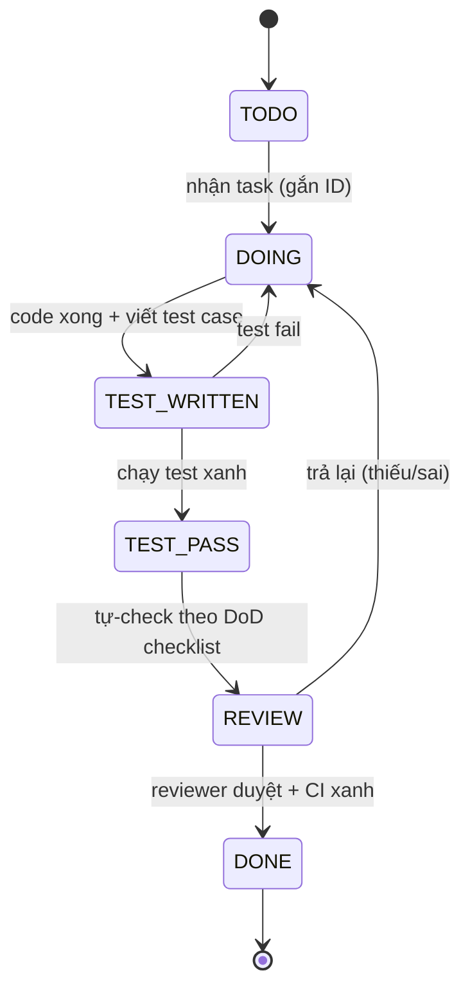

# Quy trình thực hiện theo Phase — Task → Testing → Check

> **Nguồn chốt:** Doc 15 v2 (`2-architecture-design/15-final-architecture-blueprint.md`).
> **Mục đích:** chuẩn hóa cách làm từng task để **không miss task** — mỗi task có vòng đời rõ ràng, mỗi phase có bộ test riêng (Playwright + Vitest), không task nào được "đóng" nếu thiếu test pass.
> **Áp dụng cho:** A0 → R1 → R2 → R3 → R4 → R5.

---

## 1. Nguyên tắc nền

1. **Không có task nào "xong" nếu chưa có test pass.** Định nghĩa "Done" = code + test viết + test xanh + check-list duyệt.
2. **Test viết TRƯỚC hoặc CÙNG task**, không để dồn cuối phase.
3. **Mỗi phase có 1 thư mục test riêng** + 1 lệnh chạy riêng → biết ngay phase nào fail.
4. **Mỗi task có ID truy vết** (vd `A0-01-T3`) xuất hiện ở: kế hoạch → commit message → test case (`test.describe`) → bảng check. Truy ID là ra hết.
5. **Một PR = một nhóm task có thể test độc lập.** Không gộp nhiều PR vào 1 lần merge.

## 2. Vòng đời 1 task (state machine)



**Quy tắc chuyển trạng thái:**
- `DOING → TEST_WRITTEN`: phải có ít nhất các test case bắt buộc của task (xem từng phase).
- `TEST_PASS → REVIEW`: `pnpm typecheck && pnpm lint && pnpm build` + test của phase đều xanh.
- `REVIEW → DONE`: reviewer tick đủ DoD checklist (mục 4) + CI xanh.

## 3. Quy trình chi tiết cho MỖI task

```
B1. NHẬN TASK
    - Đọc task ID + spec trong file phase tương ứng.
    - Xác nhận phụ thuộc (task này cần task nào DONE trước?).

B2. LÀM (DOING)
    - Code theo CLAUDE.md (server-first, Zod, assertCan, audit, migration tên rõ).
    - Tuân Doc 15: scopedDb, can() v2, module boundary, event cho side-effect.

B3. VIẾT TEST (TEST_WRITTEN)
    - Tạo/ cập nhật file test trong thư mục phase: tests/<phase>/<feature>.spec.ts
    - test.describe('[<task-id>] <mô tả>') để truy vết.
    - Viết ĐỦ "test case bắt buộc" liệt kê trong file phase (không bớt).

B4. CHẠY TEST (TEST_PASS)
    - pnpm test:unit (Vitest — logic thuần)  +  pnpm test:e2e:<phase> (Playwright — flow/quyền)
    - Đỏ → quay lại B2.

B5. TỰ-CHECK (REVIEW)
    - Đối chiếu DoD checklist mục 4. Thiếu mục nào → quay lại B2/B3.

B6. CHECK TASK (DONE)
    - Reviewer (hoặc người thứ 2) tick bảng check trong file phase.
    - CI xanh trên commit. Đánh dấu task DONE + ghi ngày.
```

## 4. Definition of Done (DoD) — checklist BẮT BUỘC mỗi task

```
[ ] Code chạy đúng spec task (theo file phase)
[ ] Tuân Doc 15: scopedDb cho đọc nghiệp vụ / can() đầu server action / event cho side-effect không-atomic
[ ] Có test case BẮT BUỘC của task, đặt tên có [task-id]
[ ] pnpm typecheck PASS
[ ] pnpm lint PASS (gồm rule boundary nếu phase đã bật)
[ ] pnpm build PASS
[ ] Test phase liên quan PASS (Vitest + Playwright)
[ ] Mutation nhạy cảm có ghi AuditLog (nếu áp dụng)
[ ] Không secret trong diff; migration đặt tên rõ (nếu có schema change)
[ ] Cập nhật bảng check + traceability trong file phase
```

## 5. Tổ chức test (Playwright + Vitest)

### 5.1 Phân loại — dùng công cụ nào

| Loại logic | Công cụ | Vì sao |
|---|---|---|
| Hàm thuần (can(), scope resolver, công thức hoa hồng, CPL/CPA, SLA, attendance summary) | **Vitest unit** | Nhanh, inject `now`, không cần browser |
| Luồng qua HTTP + quyền + UI + cách ly cơ sở | **Playwright e2e** | Đúng yêu cầu: viết case test theo từng phase, chạy thật trên app |
| Transaction nhiều bảng (convert lead, confirm payment) | **Playwright (qua API/UI) + Vitest cho nhánh logic** | Kiểm tra rollback + dữ liệu thật |

> Yêu cầu của chủ dự án: **mỗi phase có test bằng Playwright**. Vitest dùng kèm cho hàm thuần (đã có sẵn hạ tầng trong repo — Doc 12). Mỗi file phase liệt kê rõ case nào Playwright, case nào Vitest.

### 5.2 Cấu trúc thư mục test

```
tests/
├── e2e/                       # Playwright (đã có)
│   ├── _helpers/
│   │   ├── auth.ts            # loginAs(role, orgUnit) — tạo session test
│   │   ├── seed.ts            # seedOrg(), seedUser(), resetDb() cho test
│   │   └── fixtures.ts        # actor/org fixtures dùng lại
│   ├── a0/                    # Phase A0
│   │   ├── orgunit.spec.ts
│   │   ├── rbac.spec.ts
│   │   ├── scoped-db.spec.ts
│   │   ├── login-redirect.spec.ts
│   │   ├── audit.spec.ts
│   │   └── domain-event.spec.ts
│   ├── r1/  r2/  r3/  r4/  r5/   # các phase sau
│   └── smoke.spec.ts          # smoke hiện có
└── (lib/**/*.test.ts)         # Vitest unit (đã có)
```

### 5.3 Lệnh chạy test theo phase (thêm vào package.json — task của A0-00)

```jsonc
// scripts (đề xuất)
"test:e2e:a0": "playwright test tests/e2e/a0",
"test:e2e:r1": "playwright test tests/e2e/r1",
"test:e2e:r2": "playwright test tests/e2e/r2",
"test:e2e:r3": "playwright test tests/e2e/r3",
"test:e2e:r4": "playwright test tests/e2e/r4",
"test:e2e:r5": "playwright test tests/e2e/r5",
"test:phase": "pnpm test:unit -- --run && playwright test"   // chạy toàn bộ trước khi đóng phase
```

### 5.4 Quy ước viết Playwright case (chống miss + truy vết)

```ts
// tests/e2e/a0/scoped-db.spec.ts
import { test, expect } from "@playwright/test";
import { loginAs, seedOrg } from "../_helpers";

test.describe("[A0-04] scopedDb — cách ly dữ liệu cơ sở", () => {
  test.beforeEach(async () => { await seedOrg(["HO", "CS1", "CS2"]); });

  test("[A0-04-C1] CENTER_MANAGER@CS1 KHÔNG thấy dữ liệu CS2", async ({ page }) => {
    await loginAs(page, { role: "CENTER_MANAGER", orgUnit: "CS1" });
    await page.goto("/admin/orders");
    await expect(page.getByText("CS2-ONLY-ORDER")).toHaveCount(0);
  });
  // ... các case bắt buộc khác của A0-04
});
```

- `describe` mang **task ID**; mỗi `test` mang **case ID** (`[A0-04-C1]`).
- Case ID khớp 1-1 với cột "Test case bắt buộc" trong file phase → grep ID là biết case nào còn thiếu.

## 5b. CHUẨN THIẾT KẾ TEST (senior) — phủ TỐI ĐA, không chỉ "bắt buộc"

> Test case bắt buộc (B) = cổng tối thiểu để task được nghiệm thu. Nhưng tester phải viết **toàn bộ case hợp lý** theo 12 nhóm dưới. Mỗi task-ticket liệt kê đầy đủ; case bắt buộc đánh dấu `(B)`, case mở rộng đánh dấu `(E)`.

### 12 nhóm test (taxonomy)

| Nhóm | Ký hiệu | Phải hỏi gì khi viết |
|---|---|---|
| Functional / Happy path | **T1** | Đúng input → đúng output, mọi nhánh chính |
| Negative / Validation | **T2** | Thiếu field, sai kiểu, sai enum, vượt schema, input rỗng/null |
| Boundary / Equivalence | **T3** | min/max, off-by-one, đúng-ngưỡng (=), ngay-trước/ngay-sau ngưỡng, ngày biên |
| Permission / RBAC | **T4** | Từng role × allow/deny × scope; role hết hạn; multi-role ALLOW-wins |
| Data isolation (multi-center) | **T5** | Lộ chéo qua: list · get-by-id · search · export · aggregate/đếm · đi qua quan hệ (join) |
| Concurrency / Idempotency / Race | **T6** | Double-submit, gọi song song, retry, replay cùng key, đếm tuần tự (Counter) |
| State / Lifecycle | **T7** | Chuyển trạng thái hợp lệ & **không hợp lệ**; effective date; soft-delete |
| Error / Resilience | **T8** | DB lỗi giữa chừng → rollback; provider down/timeout; partial failure |
| Audit / Traceability | **T9** | Có ghi log? đúng actor/old/new? reason bắt buộc? immutable? |
| Security | **T10** | IDOR/đổi id, injection, open-redirect, verify signature, secret không lộ, mask PII |
| Non-functional | **T11** | p95 trang, pagination bắt buộc, payload/upload size, N+1 query |
| Regression / Backward-compat | **T12** | Tính năng cũ còn chạy trong giai đoạn 2-phase; matrix cũ vs can() v2 |

### Quy tắc độ phủ tối thiểu (senior)

- Mọi **AC** (acceptance criteria) phải có **≥1 case T1** map tới.
- Mọi **field validate** phải có case T2 (thiếu + sai) và T3 (biên) nếu có ngưỡng.
- Mọi task chạm dữ liệu có `centerId` **bắt buộc** đủ 6 góc T5 (list/get/search/export/aggregate/relation).
- Mọi action ghi tiền/quyền/trạng thái **bắt buộc** T9 (audit) + T7 (lifecycle).
- Mọi endpoint nhận id từ user **bắt buộc** T10-IDOR.
- Mọi webhook/payment **bắt buộc** T6 (idempotent) + T10 (signature).

### Template 1 test case (trong ticket)

```
| Case ID | Nhóm | B/E | Tiền điều kiện | Bước | Kết quả mong đợi | Tool |
| A0-04-T5-03 | T5 | B | seed CS1+CS2, login CM@CS1 | GET /admin/orders/{idCS2} | 404 (không lộ) | Playwright |
```

## 5c. TEMPLATE TASK-TICKET (đủ để giao việc thực tế)

Mỗi task = 1 file ticket trong `phases/<phase>/<task-id>-*.md`, gồm 11 mục:

```
[Header] ID · Title · PR · Ưu tiên · Ước lượng · Phụ thuộc · Trạng thái · Feature flag
1. Mục tiêu & bối cảnh        — vì sao, giải vấn đề P nào
2. Phạm vi (In / Out)         — làm gì, KHÔNG làm gì trong task
3. Thiết kế kỹ thuật          — model/field chính xác, contract API/action, thuật toán, validation rules
4. Acceptance Criteria (AC)   — Given/When/Then, đánh số AC1..n (đo được)
5. Files dự kiến              — đường dẫn file tạo/sửa
6. Edge cases & xử lý lỗi     — liệt kê tình huống lạ + cách xử
7. Rollback / Feature flag    — tắt được không, fallback gì
8. Test plan (T1–T12)         — bảng case ĐẦY ĐỦ, map AC, đánh dấu B/E
9. Test data                  — seed/fixtures cần
10. RTM (AC ↔ Case ↔ File)    — ma trận truy vết
11. DoD                       — checklist đóng task
```

> Ticket chi tiết A0: xem `phases/A0/` (mỗi task 1 file). R1–R5 sẽ bung theo cùng template khi tới phase (tránh spec sớm phần phụ thuộc quyết định/dữ liệu chưa có — đúng nguyên tắc Doc 15).

## 6. CHỐNG MISS TASK — 3 lớp bảo vệ

### Lớp 1 — Bảng task có cột trạng thái (trong mỗi file phase)
Mỗi phase có bảng: `Task ID | Mô tả | Phụ thuộc | Test case bắt buộc | Trạng thái | Người làm | Ngày DONE`.
Quy tắc: **không có dòng nào để trống cột "Test case bắt buộc"**; trạng thái chỉ lên DONE khi test case tương ứng tồn tại + xanh.

### Lớp 2 — Traceability matrix (cuối mỗi file phase)
Bảng map **Task ID ↔ Test case ID ↔ file test ↔ DoD item**. Sau khi code xong:
```
grep -r "\[A0-" tests/e2e/a0   # liệt kê mọi case đã viết
```
So sánh với cột "Test case bắt buộc" → thiếu case nào lộ ngay.

### Lớp 3 — Exit Criteria của phase (cổng đóng phase)
Phase chỉ "đóng" khi:
```
[ ] 100% task trong bảng = DONE
[ ] pnpm test:phase xanh toàn bộ
[ ] Mọi "Test case bắt buộc" đều có case tương ứng trong code (đối chiếu traceability)
[ ] DoD tổng của phase (trong file phase) tick đủ
[ ] Demo được các kịch bản nghiệm thu (Doc 15 §10 DoD)
```
Thiếu 1 ô → phase chưa đóng, không sang phase sau.

## 7. CI gate (mỗi PR)

```
quality:   typecheck + lint (+ lint:boundaries từ A0-07) + build
unit:      pnpm test:unit --run
e2e-phase: playwright test tests/e2e/<phase đang làm>
```
PR đỏ bất kỳ job nào → không merge.

## 8. Bản đồ file phase

| Phase | File | Khi nào |
|---|---|---|
| A0 — Foundation | [A0-foundation.md](A0-foundation.md) | NGAY (đã đủ điều kiện) |
| R1 — CRM Messenger + Marketing | [R1-crm-messenger.md](R1-crm-messenger.md) | sau A0 |
| R2 — SIS + Finance | [R2-sis-finance.md](R2-sis-finance.md) | sau R1 |
| R3 — LMS offline | [R3-lms-offline.md](R3-lms-offline.md) | sau R2 |
| R4 — Portal phụ huynh | [R4-portal.md](R4-portal.md) | sau R3 |
| R5 — HR nhân viên | [R5-hr.md](R5-hr.md) | sau R4 |

> File A0 chi tiết nhất (làm ngay). R1–R5 có khung task + test case bắt buộc; sẽ **bổ sung chi tiết khi gần tới** (tránh spec mục phụ thuộc dữ liệu/quyết định chưa chốt — đúng nguyên tắc Doc 15).
