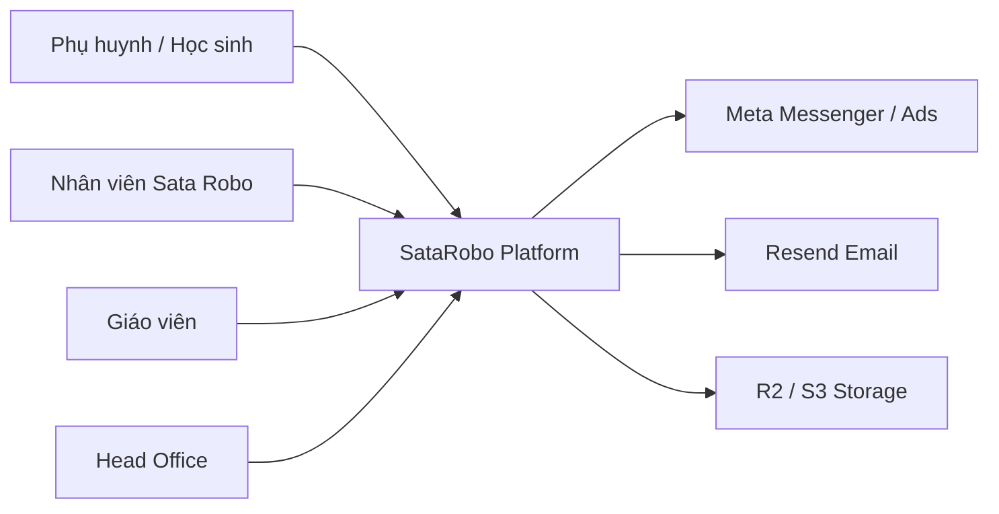
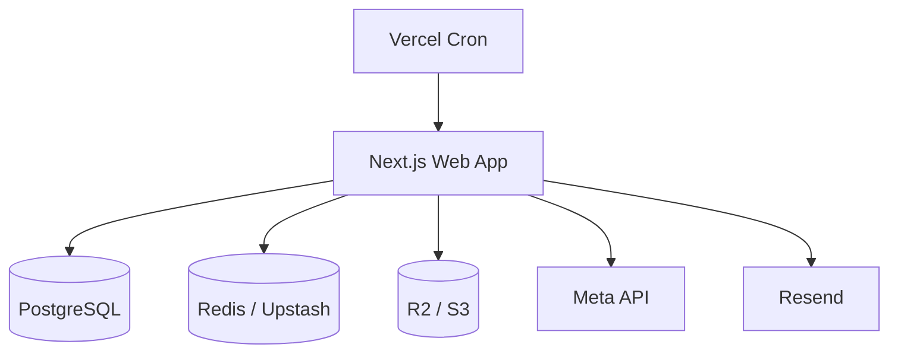
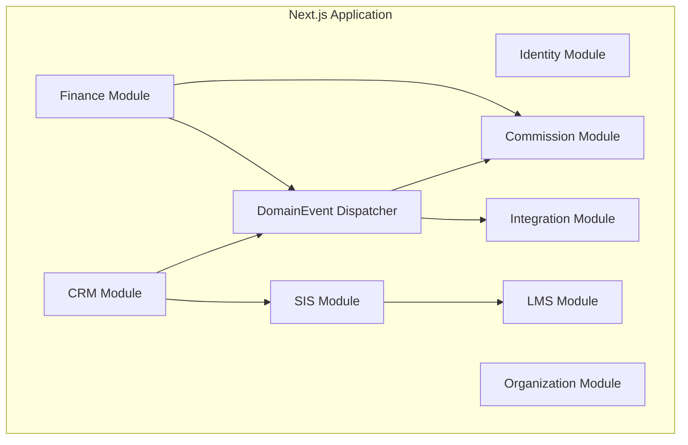

# Review 2 File Final — Các điểm còn thiếu và cách bổ sung chính xác

## 0. Mục tiêu tài liệu

Tài liệu này review 2 file final:

1. `15-final-architecture-blueprint.md`
2. `satarobo-final-project-blueprint-v1.md`

Mục tiêu không phải viết lại toàn bộ blueprint, mà chỉ ra chính xác các phần còn thiếu để hai file đủ mạnh hơn ở cấp:

```txt
CTO Review
Enterprise Architecture
System Design
Technical Governance
Production Readiness
```

---

# 1. Đánh giá tổng quan

Hai file final hiện tại đã rất tốt ở các phần:

```txt
Modular Monolith
OrgUnit HO/CS1/CS2
Dynamic RBAC/ABAC Scope
DomainEvent Outbox
Finance Transaction Safety
CRM Messenger-first
SR217 Lead Funnel
LMS Offline
Portal phụ huynh/học sinh
AuditLog hợp nhất
Privacy-first cho dữ liệu trẻ em
```

Tuy nhiên, hai tài liệu vẫn thiếu một số lớp kiến trúc nền tảng để hệ thống có thể phát triển ổn định trong 2–5 năm.

Những phần còn thiếu chủ yếu nằm ở:

```txt
Architecture documentation
Domain boundary
Database scaling
Governance
Observability
Security operation
Feature rollout
Testing strategy
Cost/capacity planning
```

---

# 2. Điểm thiếu số 1 — Chưa có C4 Model đầy đủ

## Hiện trạng trong 2 file final

File final đã có kiến trúc tổng thể dạng:

```txt
Frontend Layer
Gateway Layer
Application Modules
Event Layer
Data Layer
```

Đây là tốt, nhưng vẫn là sơ đồ tổng quan nội bộ.

Hiện chưa có bộ C4 Model gồm:

```txt
Level 1 — System Context
Level 2 — Container Diagram
Level 3 — Component Diagram
Level 4 — Code/Module Diagram nếu cần
Deployment Diagram
```

## Vì sao đây là thiếu sót?

Khi team mở rộng, mỗi nhóm sẽ nhìn hệ thống theo góc khác nhau:

```txt
CEO/PM cần biết hệ thống kết nối với ai
Dev cần biết code nằm ở đâu
DevOps cần biết deploy thế nào
Tester cần biết luồng nào cần test
Nhân sự mới cần onboarding nhanh
```

Nếu chỉ có sơ đồ module nội bộ, người mới sẽ khó hiểu:

```txt
Facebook Messenger nằm ngoài hay trong hệ thống?
Resend là service nào?
R2 dùng cho media nào?
PostgreSQL chứa dữ liệu gì?
admin.satarobo.vn và hocvien.satarobo.vn dùng chung app hay tách app?
```

## Nên bổ sung

### 2.1. C4 Level 1 — System Context



### 2.2. C4 Level 2 — Container



### 2.3. C4 Level 3 — Component



## Kết luận

Không cần thay thế sơ đồ hiện tại. Chỉ cần thêm một section mới:

```txt
Architecture Views / C4 Model
```

---

# 3. Điểm thiếu số 2 — Chưa có Bounded Context rõ theo DDD

## Hiện trạng

Hai file đã chia module:

```txt
identity
organization
crm
sis
lms
attendance
finance
commission
notification
reporting
integration
audit/shared
```

Đây là đúng hướng.

Nhưng tài liệu chưa định nghĩa rõ:

```txt
Bounded Context
Aggregate Root
Entity ownership
Domain Event ownership
Cross-module dependency rule theo nghiệp vụ
```

## Vì sao đây là thiếu sót?

Nếu không định nghĩa ownership, sau này rất dễ bị tình trạng:

```txt
CRM sửa Student trực tiếp
Finance sửa Enrollment trực tiếp
LMS sửa Parent trực tiếp
Reporting query lung tung vào mọi bảng
```

Khi đó Modular Monolith vẫn sẽ biến thành monolith rối.

## Nên bổ sung bảng Bounded Context

| Bounded Context | Sở hữu chính | Không được làm |
|---|---|---|
| Identity | User, Session, RoleDef, Permission, UserOrgRole | Không chứa logic học viên/lớp/học phí |
| Organization | OrgUnit, Center, Room, Campus | Không xử lý doanh thu/lead |
| CRM | Lead, MessengerConversation, Handover, SLA | Không tự tạo Student/Invoice ngoài transaction service |
| SIS | Student, ParentProfile, Enrollment, StudentStatus | Không tính tiền/hoa hồng |
| LMS | Curriculum, Lesson, Assignment, Quiz, Submission | Không quản lý công nợ |
| Attendance | Attendance, MakeupNeed | Không tự gửi external notification trực tiếp |
| Finance | Invoice, Payment, Debt, Refund | Không tính commission trực tiếp nếu đã có Commission Context |
| Commission | CommissionPeriod, CommissionItem, RateConfig | Không sửa Invoice/Payment |
| Engagement | Notification, EmailQueue, Media, SataCoin nội bộ | Không gọi provider ngoài trực tiếp |
| Integration | Meta, Resend, Zalo, MISA, Storage adapter | Không chứa business rule CRM/SIS/Finance |
| Reporting | Report snapshot, dashboard aggregate | Không là source of truth |

## Quy tắc ownership cần ghi rõ

```txt
Một module chỉ được ghi dữ liệu nó sở hữu.
Module khác muốn thay đổi trạng thái phải gọi public API của owner module.
Không import repository/private service của module khác.
Reporting được đọc nhiều nhưng không được ghi ngược vào domain source-of-truth.
```

## Ví dụ cụ thể

### Lead convert đúng

```txt
CRM lead.converted
→ Application service mở transaction
→ SIS public API tạo Student/Parent/Enrollment
→ Finance public API tạo Invoice/Payment
→ AuditLog
→ DomainEvent lead.converted
```

### Lead convert sai

```txt
CRM repository tự insert Student
CRM repository tự insert Invoice
CRM gọi Resend trực tiếp
```

---

# 4. Điểm thiếu số 3 — Chưa có Aggregate Root và Transaction Boundary

## Hiện trạng

File final đã nói:

```txt
Finance atomic
Invoice, payment, enrollment phải đi transaction
```

Đây là quyết định đúng.

Nhưng chưa chỉ rõ aggregate nào là biên transaction.

## Vì sao đây là thiếu sót?

Nếu không chỉ rõ aggregate root, developer sẽ không biết:

```txt
Khi update Enrollment có cần update Invoice không?
Khi refund Payment có cần update Commission không?
Khi đổi lớp có ảnh hưởng Attendance không?
```

## Nên bổ sung

| Use case | Aggregate root | Transaction boundary |
|---|---|---|
| Convert lead to enrollment | LeadConversion | Lead + Parent + Student + Enrollment + Invoice + Payment nếu có |
| Confirm payment | Invoice/Payment | Invoice + Payment + Debt + AuditLog + DomainEvent |
| Create class session | Class | ClassSession + ScheduleConflictCheck |
| Mark attendance | ClassSession | Attendance + MakeupNeed nếu vắng |
| Upload session media | ClassSessionMedia | Media + MediaStudentTag + Consent check |
| Confirm commission period | CommissionPeriod | Period + Items + AuditLog |
| Confirm cost allocation | CostAllocationPeriod | Period + Lines + AuditLog |

## Quy tắc

```txt
Dữ liệu tiền/kho/enrollment phải trong transaction.
Notification/report/external sync đi event sau commit.
Handler event phải idempotent.
```

---

# 5. Điểm thiếu số 4 — Chưa có Dependency Governance đủ chặt

## Hiện trạng

Tài liệu có nói:

```txt
app/** không import db trực tiếp
module A không import sâu module B
mọi external API đi qua modules/integration
```

Đây là đúng, nhưng chưa đủ vì mới là nguyên tắc.

## Thiếu gì?

Chưa có cách enforce bằng CI.

Nếu không enforce, sau vài tháng code sẽ dễ bị:

```txt
modules/crm import modules/finance/repository.ts
app/admin import prisma trực tiếp
modules/lms gọi Resend trực tiếp
```

## Nên bổ sung

### Tool đề xuất

```txt
eslint-plugin-boundaries
dependency-cruiser
custom ESLint no-restricted-imports
```

### Rule mẫu

```txt
app/** không được import "@/lib/db"
app/** chỉ được import "@/modules/*" public API
modules/* không được import modules/*/repository
modules/* không được import modules/*/internal
modules/* không được gọi fetch external URL trực tiếp
chỉ modules/integration được gọi external provider
```

### CI check

```txt
pnpm lint:boundaries
pnpm depcruise
pnpm test:permissions
pnpm test:events
```

## Kết luận

Nên thêm section:

```txt
Architecture Governance & CI Enforcement
```

---

# 6. Điểm thiếu số 5 — Chưa có Feature Flag Strategy

## Hiện trạng

File architecture có nhắc rollback bằng cờ tắt:

```txt
can() fallback
dispatcher tắt được
scopedDb bypass flag
```

Đây mới là rollback flag kỹ thuật.

Nhưng chưa có hệ thống Feature Flag chính thức.

## Vì sao cần?

Các module như:

```txt
RBAC v2
Portal v2
Commission engine
Messenger inbox
Cost allocation
Attendance v2
```

không nên bật toàn hệ thống một lần.

Cần rollout theo:

```txt
role
orgUnit
center
user
environment
percentage
```

## Nên bổ sung model

```txt
FeatureFlag
- id
- key
- description
- enabled
- rolloutType: GLOBAL / ORG_UNIT / USER / PERCENTAGE
- configJson
- createdAt
- updatedAt

FeatureFlagAssignment
- flagId
- orgUnitId nullable
- userId nullable
- enabled
```

## Ví dụ flag

```txt
rbac_v2_enabled
scoped_db_enforced
messenger_inbox_enabled
commission_v2_enabled
portal_child_profile_enabled
```

## Lợi ích

```txt
Giảm rủi ro release
Dễ rollback từng center
Dễ test với CS1 trước rồi mới mở CS2
Không phải deploy lại khi bật/tắt tính năng
```

---

# 7. Điểm thiếu số 6 — Chưa có Database Scaling và Data Lifecycle

## Hiện trạng

Tài liệu đã chốt:

```txt
PostgreSQL
Multi-file Prisma
Không tách Postgres schema vật lý
AuditLog hợp nhất
```

Đây là hợp lý cho phase hiện tại.

Nhưng chưa có chiến lược khi dữ liệu lớn.

## Những bảng có nguy cơ phình nhanh

```txt
AuditLog
DomainEvent
MessengerMessage
EmailQueue
Notification
Attendance
ClassSessionMedia
MediaStudentTag
Payment/Audit finance
```

## Rủi ro

Sau 1–2 năm, hệ thống có thể gặp:

```txt
Dashboard chậm
Query audit chậm
Backup/restore lâu
Migration chậm
Chi phí database tăng
Index phình to
```

## Nên bổ sung Data Lifecycle

| Nhóm dữ liệu | Chiến lược |
|---|---|
| AuditLog | Partition theo tháng/quý, giữ nóng 12–18 tháng |
| DomainEvent | Xóa/archive event DONE sau 90–180 ngày |
| MessengerMessage | Giữ nóng 12 tháng, archive tin cũ |
| Media | File nằm R2, DB chỉ lưu metadata |
| Report snapshot | Precompute theo ngày/tháng |
| Notification/EmailLog | Archive sau 6–12 tháng |
| Attendance | Giữ lâu nhưng index theo student/class/date |

## Partition đề xuất

```txt
AuditLog partition by createdAt monthly
DomainEvent partition by createdAt monthly
MessengerMessage partition by createdAt monthly
```

## Index bắt buộc nên định nghĩa

```txt
Lead(centerId, status, createdAt)
Lead(assignedSaleId, status, nextActionAt)
Lead(phone)
Student(centerId, fullName)
Enrollment(studentId, status)
Invoice(centerId, status, dueDate)
Payment(invoiceId, paidAt)
Attendance(classSessionId, studentId)
AuditLog(entityType, entityId, createdAt)
DomainEvent(status, createdAt, type)
```

---

# 8. Điểm thiếu số 7 — AuditLog đúng nhưng chưa có Audit Scaling/Policy

## Hiện trạng

Tài liệu đã có AuditLog hợp nhất và danh sách nghiệp vụ bắt buộc audit.

Đây là rất tốt.

## Thiếu gì?

Chưa có:

```txt
Retention policy
Partition policy
Sensitive field masking
Audit viewer permission
Audit export policy
Tamper resistance
```

## Vấn đề

AuditLog thường chứa dữ liệu nhạy cảm:

```txt
SĐT phụ huynh
Email
Thông tin thanh toán
Thông tin học viên
Nội dung thay đổi quyền
```

Nếu audit viewer không kiểm soát tốt, chính AuditLog lại trở thành nơi leak dữ liệu.

## Nên bổ sung

```txt
AuditLog không lưu plain sensitive data nếu không cần.
SĐT/email trong oldValues/newValues nên mask khi hiển thị.
Chỉ SUPER_ADMIN/HO_MANAGER/role audit được xem audit đầy đủ.
Center chỉ xem audit trong scope center.
Export audit phải có reason và được audit lại.
AuditLog không được sửa/xóa qua UI.
```

## Model bổ sung nếu cần

```txt
AuditExportLog
- id
- actorId
- filterJson
- reason
- exportedAt
- fileUrl
```

---

# 9. Điểm thiếu số 8 — Chưa có Search Strategy

## Hiện trạng

Tài liệu có nhiều nơi cần search:

```txt
Lead
Student
Parent
Class
Invoice
Messenger conversation
```

Nhưng chưa có chiến lược search.

## Vì sao cần?

Khi dữ liệu lớn, tìm kiếm đơn giản bằng `contains` sẽ chậm và sai.

Ví dụ:

```txt
Nguyễn Văn An
Nguyen Van An
nguyen van a
SĐT 090...
```

## Nên bổ sung theo phase

### Phase core

Dùng PostgreSQL:

```txt
ILIKE cho dữ liệu nhỏ
Normalized phone
Unaccent full-text search cho tên
Index trigram nếu cần
```

### Phase scale

Dùng search engine riêng:

```txt
Meilisearch
Typesense
OpenSearch
```

## Search object nên hỗ trợ

```txt
Lead search: phone, parentName, childName, source, status
Student search: name, parent phone, center, class
Invoice search: invoiceCode, parent phone, status
Messenger search: sender name, phone, conversation status
```

---

# 10. Điểm thiếu số 9 — Chưa có Observability/SLO

## Hiện trạng

Tài liệu có AuditLog và Dashboard nghiệp vụ.

Nhưng AuditLog không thay thế được observability kỹ thuật.

## Thiếu các thành phần

```txt
Application logs
Error tracking
Metrics
Tracing
Cron monitoring
Event dispatcher monitoring
Webhook delivery monitoring
SLO/SLA kỹ thuật
Alerting
```

## Vì sao cần?

Nếu Messenger webhook lỗi, cần biết ngay:

```txt
Webhook fail bao nhiêu lần?
DomainEvent pending bao lâu?
Email queue có bị kẹt không?
Cron có chạy đúng không?
Meta API rate limit chưa?
```

## Nên bổ sung SLO

| Thành phần | SLO đề xuất |
|---|---|
| Login | 99.5% monthly availability |
| Messenger webhook | 99% processing success |
| DomainEvent dispatcher | 95% event xử lý dưới 5 phút |
| Email activation | 95% gửi dưới 2 phút |
| Admin page | p95 response < 1.5s |
| Portal page | p95 response < 2s |
| Database backup | daily backup, restore test monthly |

## Metrics cần có

```txt
domain_event_pending_count
domain_event_failed_count
messenger_webhook_failed_count
email_queue_pending_count
login_failed_count
permission_denied_count
slow_query_count
cron_last_success_at
```

---

# 11. Điểm thiếu số 10 — Chưa có API Contract và Error Model

## Hiện trạng

Tài liệu nói module/service/repository và event, nhưng chưa chuẩn hóa API contract.

## Vì sao cần?

Khi dev build nhiều module, nếu không có chuẩn lỗi, response sẽ loạn:

```txt
400 chỗ này
422 chỗ kia
message tiếng Việt/tiếng Anh lẫn lộn
permission denied không đồng nhất
validation không đồng nhất
```

## Nên bổ sung chuẩn response

### Success

```ts
{
  "ok": true,
  "data": {},
  "meta": {}
}
```

### Error

```ts
{
  "ok": false,
  "error": {
    "code": "LEAD_PHONE_REQUIRED",
    "message": "Vui lòng nhập số điện thoại phụ huynh.",
    "field": "phone",
    "requestId": "req_xxx"
  }
}
```

## Error code nhóm chính

```txt
AUTH_REQUIRED
PERMISSION_DENIED
VALIDATION_ERROR
NOT_FOUND
CONFLICT
RATE_LIMITED
EXTERNAL_PROVIDER_FAILED
BUSINESS_RULE_VIOLATION
```

## Idempotency

Các API quan trọng nên hỗ trợ idempotency:

```txt
convert lead
confirm payment
create invoice
process webhook
send activation email
```

---

# 12. Điểm thiếu số 11 — Chưa có Security Operation Plan

## Hiện trạng

Tài liệu đã có privacy-first, không thu sinh trắc học, không expose studentId, không leak PII.

Đây là rất tốt.

## Thiếu gì?

Chưa có kế hoạch vận hành bảo mật:

```txt
Data classification
Encryption policy
Secret rotation
Access review
Session policy
Password policy
Rate limiting policy
Export data policy
Data deletion/retention
Incident response
```

## Nên bổ sung data classification

| Level | Dữ liệu |
|---|---|
| Public | Nội dung website, khóa học public |
| Internal | Lớp, lịch học, báo cáo tổng hợp |
| Confidential | SĐT/email phụ huynh, học phí, invoice |
| Restricted | Quyền user, audit log, payment, token provider |

## Quy tắc

```txt
Restricted data không xuất Excel trừ role được phép.
Export có watermark/user/time.
File export tự hết hạn sau X ngày.
Secret provider nằm trong env, không commit.
Webhook secret phải verify signature.
Session timeout cho staff ngắn hơn parent.
```

---

# 13. Điểm thiếu số 12 — Chưa có Backup, Restore, DR Plan

## Hiện trạng

Hai file nói rõ kiến trúc và roadmap, nhưng chưa có kế hoạch backup/restore.

## Vì sao cần?

Dữ liệu của hệ thống gồm:

```txt
Học viên
Học phí
Điểm danh
Bài tập
Media
Thông tin phụ huynh
Lead
Hoa hồng
```

Nếu mất dữ liệu, ảnh hưởng trực tiếp vận hành.

## Nên bổ sung

```txt
RPO: mất tối đa 24h dữ liệu với backup ngày
RTO: khôi phục dịch vụ trong 4–8h
Backup PostgreSQL hằng ngày
Backup R2 metadata và object lifecycle
Restore test mỗi tháng
Migration rollback plan
Staging restore từ bản backup đã mask PII
```

## Runbook cần có

```txt
DB restore
Rollback migration
Disable dispatcher
Replay failed events
Rotate webhook secret
Revoke compromised user session
```

---

# 14. Điểm thiếu số 13 — Chưa có Testing Strategy đầy đủ

## Hiện trạng

Tài liệu có Definition of Done và yêu cầu test một số phần.

Nhưng chưa có test pyramid rõ.

## Nên bổ sung

### Unit test

```txt
can()
scope resolver
commission formula
cost allocation formula
lead status transition
attendance summary
```

### Integration test

```txt
convertLeadToEnrollment transaction
confirmPayment transaction
DomainEvent dispatcher retry
Messenger webhook verify signature
scopedDb không leak center
```

### E2E test

```txt
Sale Admin tạo LEADS_2
Center Manager nhận lead
Sale chốt LEADS_3
Parent login portal
Teacher điểm danh
HO xem dashboard toàn hệ thống
CS1 không xem được CS2
```

### Migration test

```txt
Seed HO/CS1/CS2
Backfill UserOrgRole từ User.centerId
Permission v1/v2 diff trong 1 tuần
Drop legacy sau khi so khớp
```

---

# 15. Điểm thiếu số 14 — Chưa có Cost & Capacity Planning

## Hiện trạng

Tài liệu chốt công nghệ:

```txt
Next.js/Vercel
PostgreSQL
Redis/Upstash
R2/S3
Resend
Meta API
```

Nhưng chưa có dự toán chi phí triển khai/vận hành theo quy mô.

## Vì sao cần?

Để CEO/PM ra quyết định, cần biết:

```txt
MVP tốn bao nhiêu/tháng?
Khi có 5 cơ sở thì tốn bao nhiêu?
Khi media tăng thì chi phí storage ra sao?
Khi gửi email/OTP nhiều thì chi phí tăng thế nào?
```

## Nên bổ sung 3 mức capacity

| Mức | Quy mô | Kiến trúc |
|---|---|---|
| S0 MVP | 2 center, < 50 staff, < 5k học viên | Vercel + Supabase/Railway Postgres + R2 |
| S1 Growth | 5–10 center, 20k học viên | Postgres managed cao hơn, Redis, background cron ổn định |
| S2 Scale | 20+ center, 100k học viên | Read replica, partition, search engine, dedicated worker |

## Nhóm chi phí cần theo dõi

```txt
Hosting
Database
Storage media
Email/SMS
Meta API/ads data
Logging/monitoring
Backup
Domain/CDN
```

---

# 16. Điểm thiếu số 15 — Chưa có Data Migration Plan đủ chi tiết

## Hiện trạng

Tài liệu có nói:

```txt
Additive trước
Destructive sau
can() v2 chạy song song
legacy fallback
```

Đây là đúng.

Nhưng chưa đủ chi tiết ở mức migration script.

## Nên bổ sung migration checklist

```txt
1. Tạo OrgUnit HO/CS1/CS2
2. Map Center hiện tại sang OrgUnit
3. Tạo RoleDef tương ứng enum cũ
4. Backfill UserOrgRole từ User.role/User.centerId
5. Seed RolePermission từ permissions.ts
6. Chạy permission diff log 7 ngày
7. Chuyển JWT sang userId/sessionVersion
8. Bật can() v2 bằng feature flag cho internal admin
9. Bật scopedDb cho module CRM trước
10. Drop legacy field sau 2–3 tuần ổn định
```

## Rủi ro cần ghi rõ

```txt
User có nhiều roles cũ map sai sang UserOrgRole
CenterId null không biết thuộc HO hay portal
Permission grant DENY/ALLOW xung đột RolePermission
JWT cũ còn sống sau khi đổi session shape
```

---

# 17. Điểm thiếu số 16 — Chưa có Reporting Data Model rõ

## Hiện trạng

Tài liệu có yêu cầu dashboard:

```txt
CRM funnel
Marketing Ads
Finance
LMS quality
Attendance
SLA
```

Nhưng chưa nói dashboard query trực tiếp source-of-truth hay dùng snapshot.

## Vấn đề

Nếu dashboard query trực tiếp nhiều bảng lớn:

```txt
Lead
Order
Payment
Attendance
ClassSession
MessengerMessage
AdsDailyStat
```

sẽ chậm.

## Nên bổ sung mô hình reporting

```txt
DailyMetricSnapshot
FunnelDailyStat
RevenueDailyStat
AttendanceDailyStat
SlaDailyStat
MarketingDailyStat
```

## Quy tắc

```txt
Dashboard realtime nhỏ: query live.
Dashboard tháng/quý/năm: dùng snapshot/pre-aggregate.
Export Excel lớn: chạy background job.
```

---

# 18. Điểm thiếu số 17 — Chưa có Webhook Reliability Plan

## Hiện trạng

Tài liệu chọn Messenger-first CRM, Meta Messenger Webhook là luồng chính.

## Thiếu gì?

Chưa có reliability plan cho webhook:

```txt
Verify signature
Deduplicate event
Retry-safe processing
WebhookDelivery log
Dead-letter state
Manual replay
Rate limit
Ordering issue
```

## Nên bổ sung

```txt
WebhookDelivery
- id
- provider
- externalEventId
- payloadHash
- status
- attempts
- receivedAt
- processedAt
- lastError
```

## Quy tắc

```txt
Webhook phải idempotent.
Cùng externalEventId không tạo trùng MessengerMessage/Lead.
Nếu provider gửi lại, hệ thống nhận an toàn.
Webhook fail không làm mất payload.
Có màn hình admin để replay webhook failed.
```

---

# 19. Điểm thiếu số 18 — Chưa có File/Media Governance

## Hiện trạng

Tài liệu có media lớp học, tag học sinh, consent, R2/S3.

## Thiếu gì?

Chưa có quy tắc vận hành file:

```txt
File size limit
Video duration limit
Allowed MIME types
Virus scan nếu cần
Image resize/thumbnail
Signed URL expiry
Watermark nếu download
Retention policy
```

## Đề xuất

```txt
Ảnh: jpg/png/webp, max 10MB
Video: mp4/mov, max 200MB hoặc theo quota
Thumbnail tạo tự động
R2 object key không chứa tên học sinh
Private bucket, truy cập qua signed URL
Signed URL hết hạn 5–15 phút
Media bị revoke consent không hiển thị portal
```

---

# 20. Điểm thiếu số 19 — Chưa có Environment & Deployment Strategy

## Hiện trạng

Tài liệu có Next.js/Vercel nhưng chưa định nghĩa môi trường.

## Nên bổ sung

```txt
local
dev
staging
production
preview per PR
```

## Quy tắc

```txt
Migration chạy staging trước production.
Production migration phải có backup trước.
Preview không dùng production PII.
Seed data tách riêng dev/staging/prod.
Cron chỉ bật ở production/staging có kiểm soát.
Webhook staging dùng app/page riêng nếu có.
```

---

# 21. Điểm thiếu số 20 — Chưa có Performance Budget

## Hiện trạng

Chưa có chuẩn hiệu năng.

## Nên bổ sung

| Hạng mục | Mục tiêu |
|---|---|
| Admin list page | p95 < 1.5s |
| Portal page | p95 < 2s |
| Search lead/student | p95 < 1s với filter chuẩn |
| Export Excel | async nếu > 5.000 dòng |
| Dashboard tháng | p95 < 3s nếu dùng snapshot |
| Upload media | dùng direct upload/presigned URL |

## Quy tắc

```txt
Không render bảng > 1000 row một lần.
List page bắt buộc pagination.
Export lớn đi background job.
Media upload không đi qua server nếu file lớn.
```

---

# 22. Bảng ưu tiên bổ sung

| Ưu tiên | Phần thiếu | Nên làm khi nào |
|---|---|---|
| P0 | C4 Model | Trước khi code A0 sâu |
| P0 | Bounded Context + ownership | Trước khi tách modules |
| P0 | Dependency CI enforcement | Ngay trong A0 |
| P0 | Migration plan chi tiết | Trước A0.1 |
| P0 | Testing strategy RBAC/scope | Ngay trong A0 |
| P1 | Feature flag strategy | Trong A0 |
| P1 | Observability/SLO | Trước R1 Messenger live |
| P1 | Webhook reliability | Trước R1 Messenger webhook |
| P1 | Audit retention/partition | Trước khi AuditLog chạy lâu |
| P1 | Database index/partition baseline | Trước R2/R3 |
| P2 | Search strategy | Khi lead/student tăng |
| P2 | Reporting snapshot | Trước dashboard tháng/quý |
| P2 | Cost/capacity plan | Trước khi mở rộng 5+ center |
| P2 | DR/backup runbook | Trước production chính thức |
| P2 | Media governance | Trước khi portal media chạy thật |

---

# 23. Section nên thêm vào 2 file final

## Thêm vào `15-final-architecture-blueprint.md`

Nên thêm các section:

```txt
§9 — C4 Architecture Views
§10 — Bounded Context & Ownership
§11 — Architecture Governance & CI Rules
§12 — Database Scaling & Data Lifecycle
§13 — Observability, SLO & Runbook
§14 — Feature Flag & Rollout Strategy
```

## Thêm vào `satarobo-final-project-blueprint-v1.md`

Nên thêm các section:

```txt
27. C4 Model cho PM/Dev
28. Domain Ownership Matrix
29. Production Readiness Checklist
30. Security & Data Governance
31. Testing Strategy
32. Cost & Capacity Plan
33. Migration Checklist
```

---

# 24. Kết luận CTO Review

Hai file final hiện tại đã đạt mức:

```txt
Business Blueprint tốt
Architecture Direction đúng
Roadmap rõ
Scope core hợp lý
Privacy-first phù hợp dữ liệu trẻ em
```

Nhưng để triển khai dài hạn, cần bổ sung lớp:

```txt
C4 Model
DDD / Bounded Context
CI Dependency Governance
Feature Flag
Database Scaling
Audit Retention
Observability
API Contract
Security Operation
Backup/DR
Testing Strategy
Cost/Capacity
Migration Checklist
```

Nếu bổ sung các phần này, bộ tài liệu sẽ chuyển từ mức:

```txt
Dùng được để build MVP/core
```

lên mức:

```txt
Dùng được để quản trị kiến trúc hệ thống trong 2–5 năm
```

Đánh giá cuối:

```txt
Hiện tại: 8.8/10
Sau khi bổ sung các section trên: 9.5/10
```
