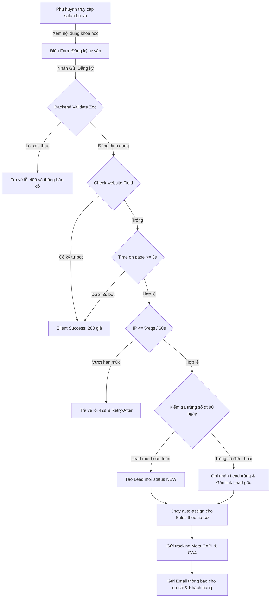
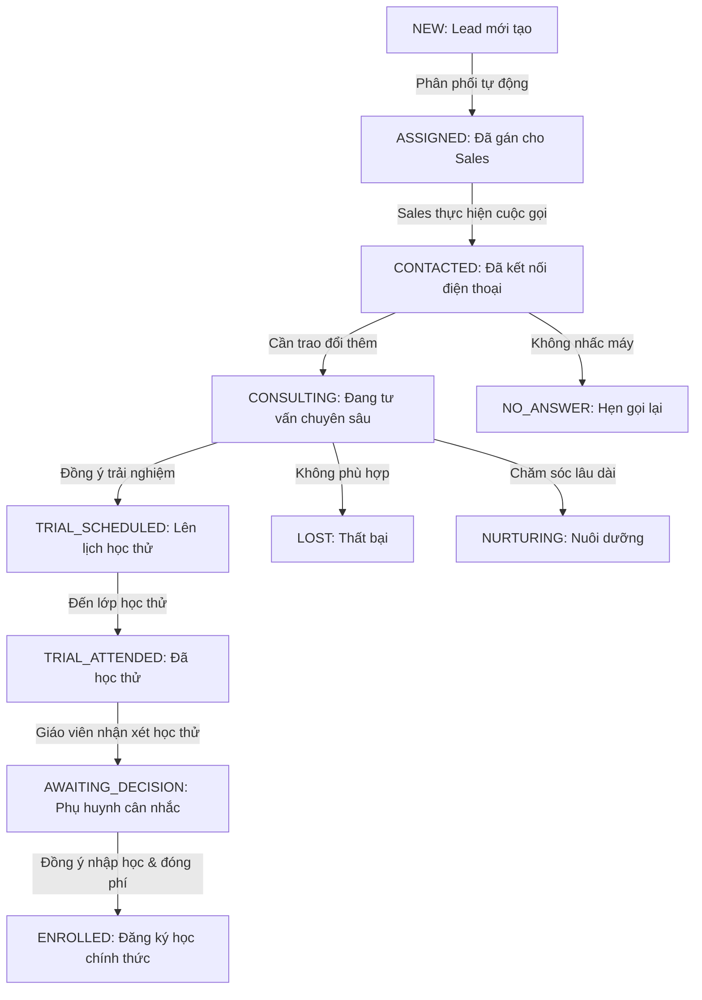
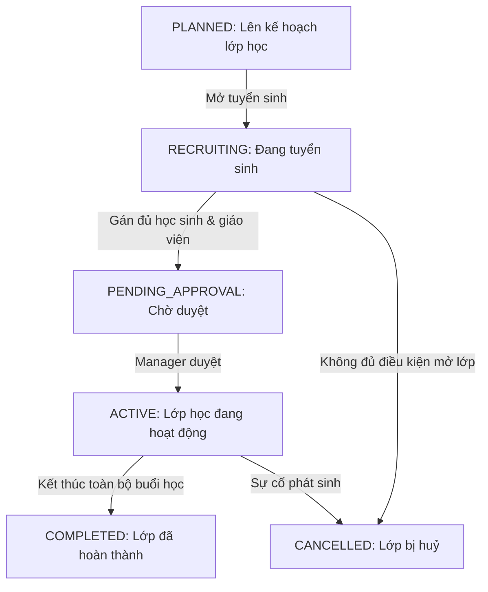
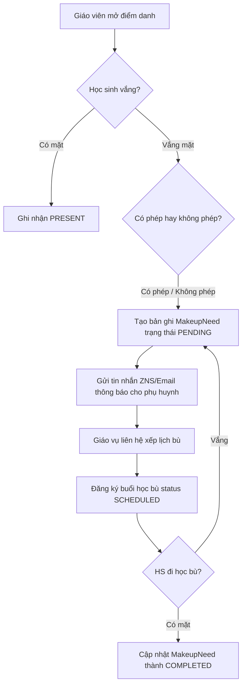
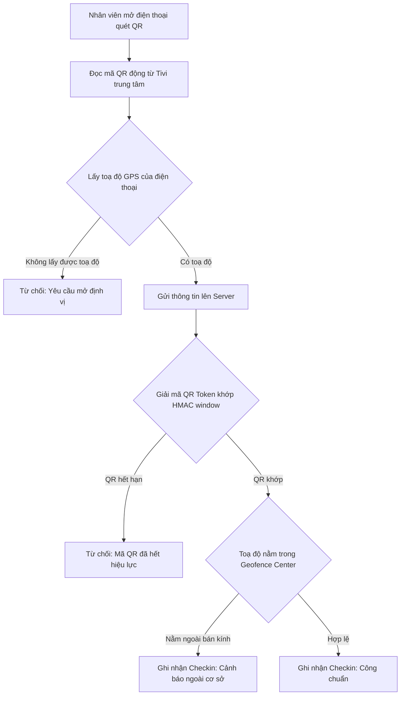

# Sata Robo VN — User Flow & Journey Map

Tài liệu này mô tả các hành trình trải nghiệm người dùng (User Journeys) chính của các đối tượng tương tác với hệ thống Sata Robo VN qua các lưu đồ trực quan.

---

## 1. Luồng phụ huynh đăng ký tư vấn (Lead Capture Flow)

Đây là hành trình bắt đầu của một khách hàng từ lúc tiếp cận thương hiệu đến khi thông tin của họ được phân tích và phân phối cho Sales.



---

## 2. Luồng Phễu tư vấn CRM (CRM Lead Pipeline)

Quy trình Sales chăm sóc và chuyển đổi trạng thái của lead từ khi tiếp nhận đến khi chốt đơn nhập học.



---

## 3. Luồng Đăng nhập & Xác thực Phân quyền (Auth & RBAC Flow)

```mermaid
graph TD
    Login[Truy cập /login] -->|Nhập email + password| Authjs[Auth.js Credentials Provider]
    Authjs -->|Truy vấn DB lấy hash| Bcrypt{Bcrypt Verify Password}
    
    Bcrypt -->|Sai mật khẩu| Failed[Báo lỗi sai tài khoản / mật khẩu]
    Bcrypt -->|Khớp mật khẩu| CheckStatus{Tài khoản Active?}
    
    CheckStatus -->|Disabled| Inactive[Báo lỗi tài khoản bị khoá]
    CheckStatus -->|Active| LoadPermissions[Đọc Roles + Grants từ DB]
    
    LoadPermissions --> GenerateJWT[Tạo mã token JWT chứa Role/Grants]
    GenerateJWT --> Cookie[Lưu HTTP-only Cookie bảo mật]
    Cookie --> Redirect{Phân hướng dựa trên Role}
    
    Redirect -->|PARENT| Portal[/portal - Cổng phụ huynh]
    Redirect -->|Nhân viên khác| Admin[/admin/dashboard]
```

---

## 4. Luồng Vòng đời Lớp học (Class Lifecycle Flow)

Quy trình quản lý từ lúc lập kế hoạch mở lớp, tuyển sinh đến khi hoàn thành hoặc huỷ lớp.



### Luồng nghiệp vụ trong mỗi buổi học (Class Session Workflow)
Mỗi buổi học diễn ra đều phải hoàn thành checklist vận hành nghiêm ngặt của giáo viên và giáo vụ:
1.  **Chuẩn bị**: Giáo vụ chuẩn bị vệ sinh phòng học, dụng cụ, kiểm kê các bộ kit robot (`ZMRoboKit`).
2.  **Khởi động**: Giáo viên điểm danh học viên (`markAttendance`).
3.  **Giảng dạy**: Thực hiện dạy theo bài học thuộc giáo trình (`Curriculum`).
4.  **Đánh giá & Nhận xét**: Giáo viên viết đánh giá nhận xét buổi học cho từng học viên.
5.  **Thu hoạch**: Chụp ảnh hoạt động lớp, giao bài tập về nhà và nộp báo cáo kết thúc buổi học.

---

## 5. Luồng Điểm danh & Học bù (Attendance & Makeup Flow)



---

## 6. Luồng Chấm công Nhân sự bằng QR code (QR Check-in Flow)

Quy trình nhân viên thực hiện chấm công tại cơ sở thông qua QR động để tránh gian lận.


