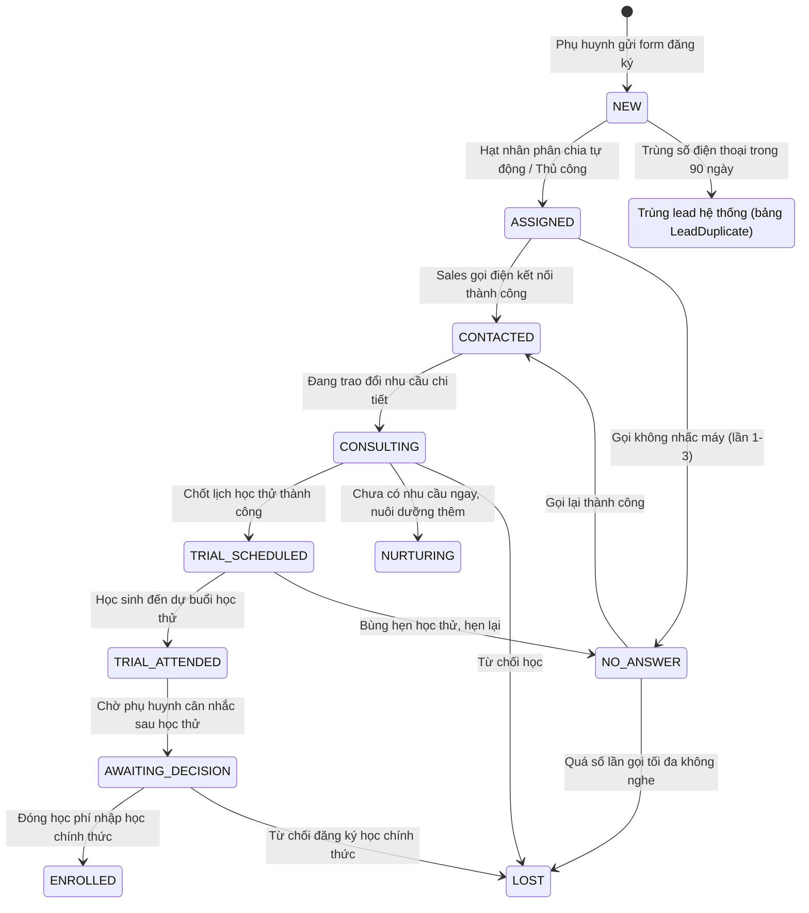
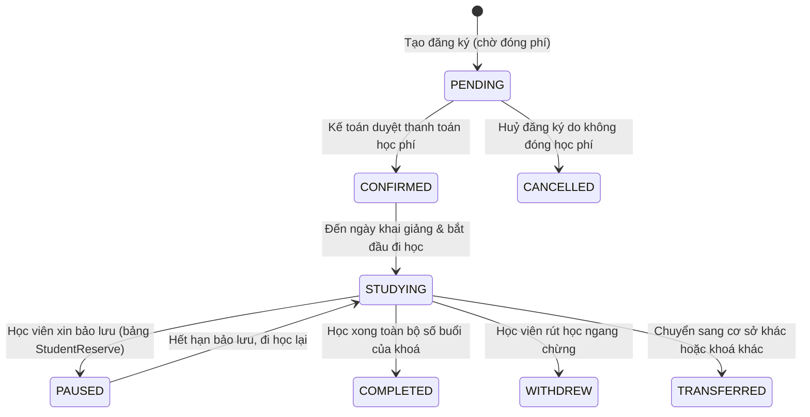
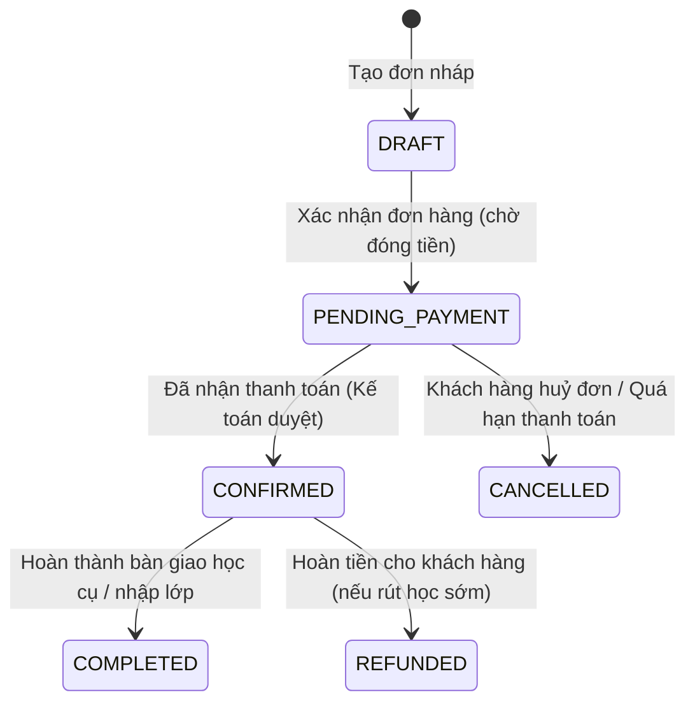
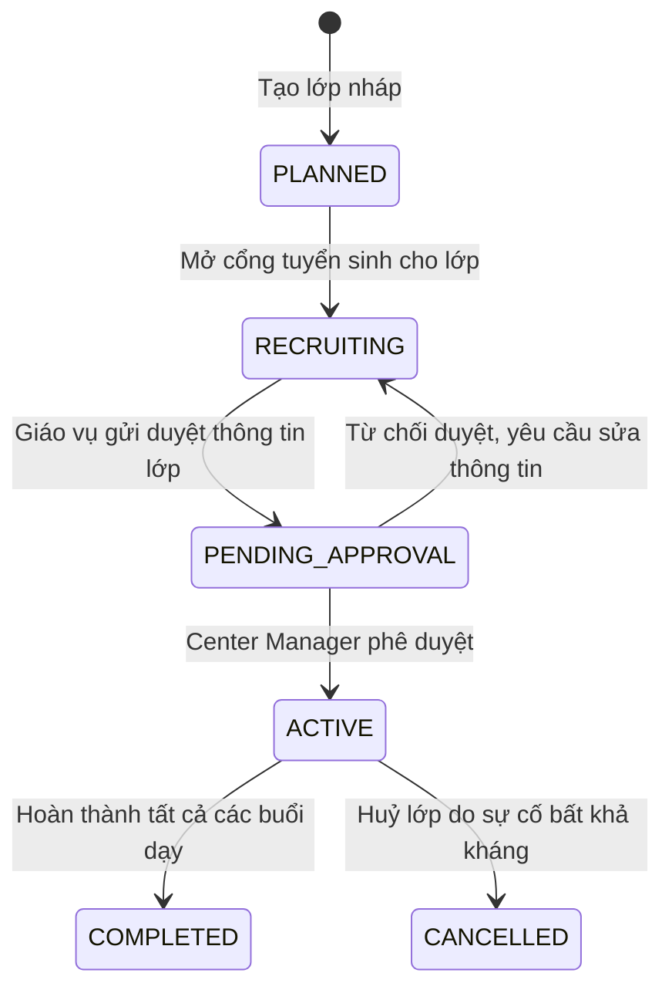

# Sata Robo VN — Business Logic & State Machines

Tài liệu này đặc tả các máy trạng thái (State Machines) và cây quyết định (Decision Trees) điều khiển logic nghiệp vụ cốt lõi của hệ thống Sata Robo VN.

---

## 1. Máy Trạng thái Lead (Lead Status State Machine)

Quản lý vòng đời của khách hàng tiềm năng trong phễu CRM Pipeline.



---

## 2. Máy Trạng thái Đăng ký Khoá học (Enrollment Status State Machine)

Theo dõi quá trình học tập của một học viên đối với một khoá học cụ thể.



### Các mốc thời gian ghi nhận (Timestamps):
Để theo dõi hiệu quả và phân tích vận hành, hệ thống ghi nhận chính xác các mốc thời gian:
*   `enrolledAt`: Thời điểm tạo đăng ký ban đầu (`PENDING`).
*   `confirmedAt`: Thời điểm kế toán duyệt thanh toán chuyển sang (`CONFIRMED`).
*   `startedAt`: Thời điểm học viên đi học buổi đầu tiên (`STUDYING`).
*   `endedAt`: Thời điểm hoàn thành khoá học (`COMPLETED`) hoặc rút học (`WITHDREW`).

---

## 3. Máy Trạng thái Đơn hàng (Order Status State Machine)



*   **Sub-states đối với Trả góp (Installments)**:
    *   `OrderInstallment` hỗ trợ tối đa 2 đợt đóng học phí. Trạng thái mỗi đợt bao gồm: `PENDING` (chưa đóng) -> `PAID` (đã đóng).
    *   Đơn hàng chuyển sang `CONFIRMED` khi đợt 1 được đóng. Đơn hàng chuyển sang `COMPLETED` khi toàn bộ các đợt trả góp được cập nhật sang `PAID`.

---

## 4. Máy Trạng thái Duyệt Lớp học (Class Status Approval Workflow)



---

## 5. Cây Quyết định Phân chia Lead Tự động (Lead Auto-Assignment Decision Tree)

Khi có một lead mới được tạo từ trang web, hệ thống áp dụng thuật toán quyết định phân bổ Sales phụ trách:

```
[ Lead mới được tạo ]
         │
         ▼
[ Xác định CenterId ] ──► (Nếu không có, mặc định chọn Center chính)
         │
         ▼
[ Đọc cấu hình LeadAssignmentConfig của Center ]
         │
         ├──► Mode = MANUAL ──────► [ Giữ nguyên Lead ở trạng thái NEW để giáo vụ tự chia ]
         │
         ├──► Mode = ROUND_ROBIN ──► [ Tìm danh sách Sales đang Active thuộc Center ]
         │                                      │
         │                                      ▼
         │                           [ Gán cho Sales có thời gian tiếp nhận lead gần nhất xa nhất ]
         │
         └──► Mode = CLOSE_RATE ───► [ Tính tỷ lệ chốt đơn thành công của từng Sales trong 30 ngày ]
                                                │
                                                ▼
                                     [ Gán cho Sales có tỷ lệ chốt đơn (Conversion Rate) cao nhất ]
```

---

## 6. Logic Phát hiện Rủi ro Học viên (Student Risk Alert Logic)

Hệ thống tự động chạy tác vụ nền kiểm tra và tạo cảnh báo rủi ro học viên nghỉ học hoặc rời bỏ trung tâm (`StudentRiskAlert`):

1.  **Cảnh báo Nghỉ học liên tiếp (CONSECUTIVE_ABSENCE)**:
    *   *Điều kiện:* Học viên vắng mặt liên tiếp từ 2 buổi học trở lên không phép hoặc có phép nhưng không sắp xếp học bù trong vòng 7 ngày.
    *   *Hành động:* Tạo cảnh báo rủi ro mức độ `HIGH`, phân công Sales phụ trách tạo nhiệm vụ chăm sóc (`StudentCareTask`) để liên hệ phụ huynh.
2.  **Tỷ lệ nghỉ học cao (HIGH_ABSENCE)**:
    *   *Điều kiện:* Tỷ lệ nghỉ học của học viên vượt quá 25% tổng số buổi đã diễn ra của khoá học.
    *   *Hành động:* Tạo cảnh báo mức độ `MEDIUM`.
3.  **Hết hạn khoá học không tái ký (NEARING_END_NO_RENEWAL)**:
    *   *Điều kiện:* Số buổi học còn lại của gói đăng ký hiện tại dưới 3 buổi và chưa ghi nhận bất kỳ đơn hàng đăng ký gói tiếp theo nào.
    *   *Hành động:* Tạo cảnh báo mức độ `HIGH` để Sales thực hiện tư vấn tái đăng ký.
4.  **Nợ phí quá hạn (OVERDUE_PAYMENT)**:
    *   *Điều kiện:* Đợt trả góp học phí thứ 2 đã quá hạn thanh toán (`dueDate`) quá 5 ngày.
    *   *Hành động:* Tạo cảnh báo mức độ `MEDIUM` gửi thông tin cho Kế toán và Sales.

---

## 7. Quy tắc Giải quyết Quyền hạn (Permission Resolution Order)

Hệ thống phân quyền động kết hợp phân quyền theo vai trò (RBAC) và phân quyền ghi đè theo từng người dùng (User Permission Grants). Thứ tự ưu tiên giải quyết quyền hạn đối với một hành động (`action`) như sau:

```
[ Kiểm tra quyền thực hiện ACTION của USER ]
                     │
                     ▼
       { Vai trò có phải SUPER_ADMIN? } ──► YES ──► [ Cho phép thực hiện (Bypass) ]
                     │
                     ▼ NO
   { Có cấu hình ghi đè DENY trong UserPermissionGrant? } ──► YES ──► [ Chặn (Deny) ]
                     │
                     ▼ NO
  { Có cấu hình ghi đè ALLOW trong UserPermissionGrant? } ──► YES ──► [ Cho phép (Allow) ]
                     │
                     ▼ NO
       { Quyền nằm trong Matrix mặc định của Role? } ──► YES ──► [ Cho phép (Allow) ]
                     │
                     ▼ NO
                [ Chặn (Deny) ]
```

*   **Hỗ trợ đa vai trò (Multi-role)**: Nếu một người dùng được gán nhiều vai trò trong mảng `roles[]`, quyền hạn mặc định của họ sẽ là phép hội (Union) tất cả các quyền của các vai trò đó. Chỉ cần một vai trò cho phép và không bị ghi đè `DENY` cụ thể, hành động sẽ được chấp nhận.

---

## 8. Logic Xác thực Mã giảm giá (Voucher Validation Logic)

Khi áp dụng mã Voucher vào đơn hàng, hệ thống kiểm tra tuần tự các điều kiện sau:
1.  **Sự tồn tại**: Mã voucher phải tồn tại trong DB và thuộc trạng thái đang kích hoạt (`isActive = true`).
2.  **Thời gian hiệu lực**: Thời gian hiện tại phải nằm trong khoảng `validFrom <= thời gian hiện tại <= validUntil`.
3.  **Giới hạn số lượng**: Số lượng voucher đã sử dụng (`usedQuantity`) phải nhỏ hơn tổng số lượng phát hành (`totalQuantity`).
4.  **Giới hạn trên mỗi người dùng**: Số điện thoại mua hàng phải chưa sử dụng voucher này vượt quá giới hạn cấu hình (`limitPerUser`).
5.  **Giá trị đơn tối thiểu**: Tổng số tiền đơn hàng phải lớn hơn hoặc bằng giá trị đơn tối thiểu yêu cầu (`minOrderValue`).
6.  **Tính toán chiết khấu**:
    *   Nếu loại chiết khấu là `PERCENT`: Số tiền giảm = `tổng đơn * percentage / 100`. Nếu số tiền giảm vượt quá giá trị giảm tối đa (`maxDiscount`), số tiền giảm sẽ được ghim bằng đúng `maxDiscount`.
    *   Nếu loại chiết khấu là `FIXED`: Số tiền giảm = `fixedAmount` cố định.
