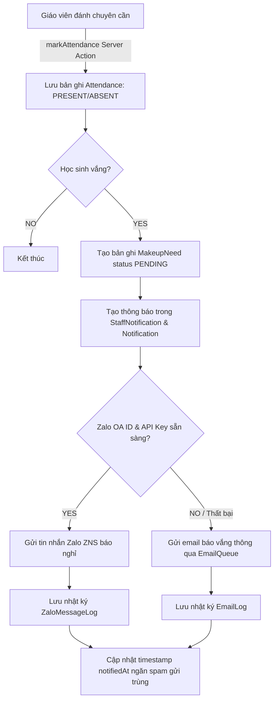
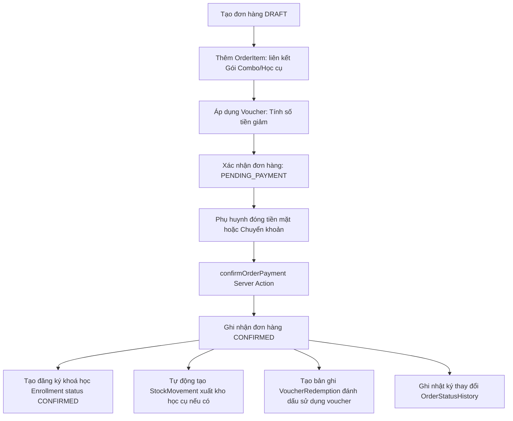
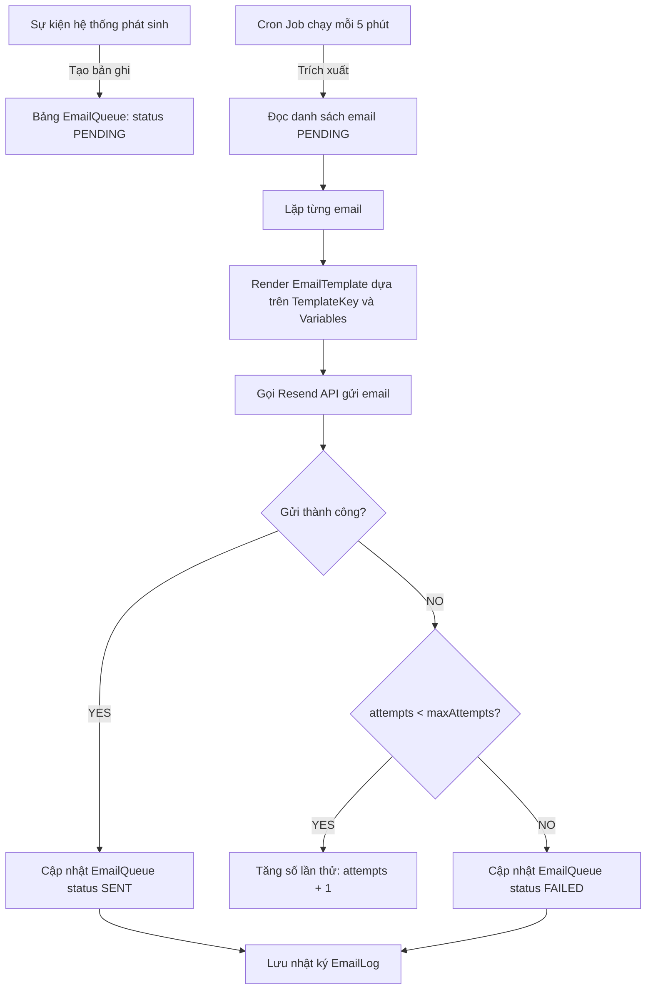
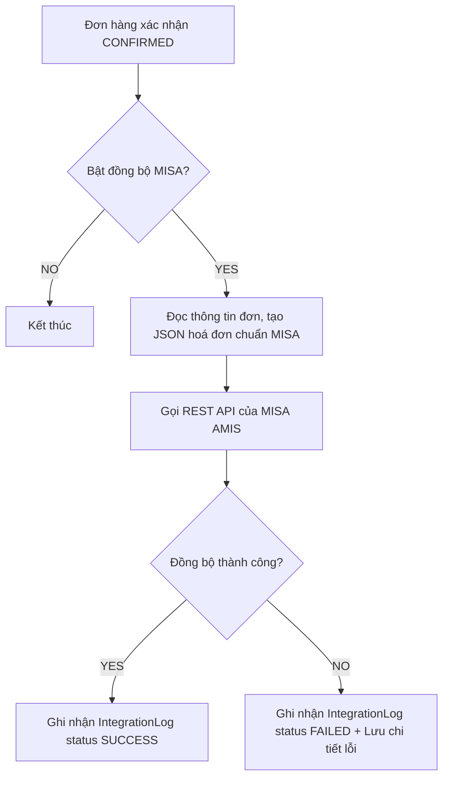

# Sata Robo VN — Data Flow Diagram Spec

Tài liệu này mô tả chi tiết đường đi của dữ liệu (Data Flows) giữa các phân hệ ứng dụng, cơ sở dữ liệu và các dịch vụ tích hợp bên thứ ba.

---

## 1. Dòng dữ liệu Thu thập Lead (Lead Ingestion Data Path)

Dữ liệu lead từ nhiều nguồn khác nhau được chuẩn hoá trước khi ghi nhận vào cơ sở dữ liệu và kích hoạt các cổng theo dõi.

```mermaid
graph LR
    %% Nguồn Lead
    WebForm[Website Form] -->|JSON| APIleads[/api/leads]
    FBWebhook[Facebook Webhook] -->|JSON Payload| APIwebhooks[/api/public/webhook/*]
    GGForm[Google Form Webhook] -->|JSON Payload| APIwebhooks
    Manual[Nhân viên tạo tay] -->|Server Action| CRM[CRM Module]

    %% Xử lý & Ghi nhận
    APIleads -->|Validation Zod| Sanitizer[Lọc dữ liệu & Bẫy Bot]
    APIwebhooks -->|Validation Zod| Sanitizer
    CRM -->|Validation Zod| Dedup[Đối soát Trùng điện thoại 90 ngày]
    
    Sanitizer --> Dedup
    Dedup -->|Ghi nhận| DB[(Database Lead Record)]
    
    %% Kích hoạt phụ
    DB -->|Trigger| AutoAssign[Phân phối Sales]
    DB -->|Trigger| MetaCAPI[Gửi Meta CAPI & GA4 Server Event]
    DB -->|Trigger| EmailNotification[Email báo cơ sở mới tiếp nhận lead]
```

---

## 2. Dòng dữ liệu Điểm danh & Thông báo (Attendance & Notification Flow)

Đường đi của dữ liệu khi giáo viên đánh giá chuyên cần của lớp học thực tế và đồng bộ thông báo cho phụ huynh.



---

## 3. Dòng dữ liệu Đơn hàng, Thanh toán & Kích hoạt học tập (Order to Enrollment Path)

Quy trình quản lý dòng tài chính và đồng bộ trực tiếp với trạng thái học tập của học viên.



---

## 4. Quy trình xử lý Email bất đồng bộ (Email Queue Processing Pipeline)

Để đảm bảo hiệu năng và không làm nghẽn các yêu cầu của người dùng, việc gửi email được tách riêng thành hàng đợi bất đồng bộ.



---

## 5. Dòng dữ liệu Hoạt động Audit Log (Audit Trail Pipeline)

Nhật ký ghi nhận hành vi thay đổi dữ liệu đảm bảo tính bất biến (Immutable) để phục vụ kiểm toán nội bộ.

```
[ Thực hiện Server Action thay đổi dữ liệu ]
                     │
                     ▼
       [ Đọc bản ghi hiện tại trong DB ]
                     │
                     ▼
         [ Thực thi câu lệnh UPDATE ]
                     │
                     ▼
[ Tính toán sự khác biệt (Diff: oldValues vs newValues) ]
                     │
                     ▼
[ Ghi đè thông tin changedByName snapshot từ Session ]
                     │
                     ▼
  [ Tạo bản ghi Audit Log chuyên biệt (ví dụ: LeadAuditLog) ]
                     │
                     ▼
  [ Dữ liệu được lưu trữ dạng APPEND-ONLY, cấm sửa/xoá ]
```

---

## 6. Luồng dữ liệu Tải lên Tệp tin (R2 Storage Upload Path)

```
[ Trình duyệt Client ] ────── 1. Yêu cầu Upload URL ─────► [ Serverless Endpoint /api/admin/upload-url ]
                                                                                │
                                                                       2. Tạo Presigned URL
                                                                                │
[ Trình duyệt Client ] ◄─── 3. Trả về Upload URL & CDN URL ─────────────────────┘
         │
  4. Upload file nhị phân trực tiếp
         │
         ▼
[ Cloudflare R2 Storage ]
         │
  5. Upload thành công
         │
         ▼
[ Trình duyệt Client ] ────── 6. Gửi CDN URL lưu vào thực thể ──► [ Serverless Action ] ──► [ Lưu DB ]
```
---

## 7. Dòng dữ liệu Đồng bộ MISA AMIS (MISA Integration - Skeleton)

Khi đơn hàng được xác nhận thanh toán thành công, hệ thống thực hiện đồng bộ hoá dữ liệu sang hệ thống kế toán doanh nghiệp MISA:


