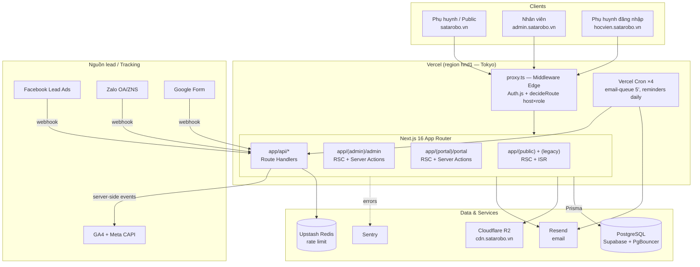

# Doc 2 — System Architecture Document

> **Ai đọc:** Dev, DevOps, Tech Lead.
> 🔄 **ĐỒNG BỘ DOC 15 (2026-06-06):** doc này mô tả kiến trúc **HIỆN TRẠNG**. Kiến trúc ĐÍCH (modular monolith, OrgUnit ROOT/HO/CS1/CS2 độc lập, RBAC động không HO_MANAGER, scopedDb, DomainEvent outbox, login chung) = **Doc 15** — khi xung đột, Doc 15 thắng.
> **Cập nhật:** 2026-06-06 · Sinh tự động từ quét codebase.

---

## 1. Kiến trúc tổng thể

**Lựa chọn: Monolith Next.js 16 (App Router) deploy serverless trên Vercel.**
Một codebase phục vụ 3 site qua **host-based routing** (middleware), không tách microservice.

## 2. Host-based routing (điểm đặc thù nhất)

`proxy.ts` (middleware, chạy Edge) bọc `auth()` rồi gọi `decideRoute()` từ `lib/auth/route-policy.ts`:

| Host | Staff (7 role) | PARENT | Anonymous |
|---|---|---|---|
| `satarobo.vn` | ✅ | ✅ | ✅ |
| `admin.satarobo.vn` | ✅ rewrite `/X` → `/admin/X` (clean URL) | ❌ → redirect portal | ❌ → `/login` |
| `hocvien.satarobo.vn` | ❌ → redirect admin | ✅ rewrite `/X` → `/portal/X` | ❌ → `/login` |
| `*.vercel.app` (prod) | redirect 308 về host canonical | | |
| localhost | path-based `/admin/*`, `/portal/*`, gate PARENT | | |

- Sửa rule host×role: **chỉ sửa `decideRoute()` + `route-policy.test.ts`**, không sửa proxy.ts.
- Admin host trả `X-Robots-Tag: noindex, nofollow, noarchive`.
- `sanitizeCallbackUrl()` chống open-redirect.

## 3. Danh sách component chính

| Component | Vị trí | Vai trò |
|---|---|---|
| Middleware | `proxy.ts` | Host routing, auth gate sớm, canonical redirect |
| Route policy | `lib/auth/route-policy.ts` | Pure function quyết định route (unit-tested) |
| Auth | `lib/auth.ts`, `lib/auth/permissions.ts` | Auth.js v5, RBAC 8 role × 140+ action, grants |
| DB client | `lib/db.ts` | Prisma singleton (PgBouncer pooled) |
| Server Actions | `app/**/actions.ts` (~20 module) | Toàn bộ mutations admin/portal |
| API routes | `app/api/*` (~30 route) | Webhooks, import Excel, upload, report PDF, cron |
| Storage | `lib/storage/` | R2 client lazy + upload-config (mime/size theo category) |
| Email | `lib/email/` | Resend client, render template `{{var}}`, queue, triggers |
| Audit | `lib/audit/log.ts` | Helper ghi 8 loại audit log |
| Rate limit | `lib/rate-limit.ts` | Upstash → in-memory fallback |
| SEO | `lib/seo/jsonld.ts`, `app/sitemap.ts`, `app/robots.ts` | JSON-LD 9 helper, sitemap động |
| PDF | `lib/pdf/` | Certificate / transcript / progress-report (@react-pdf) |
| Design system | `components/design-system/` (39) | Building blocks dùng chung |

## 4. Render strategy

| Khu vực | Chiến lược |
|---|---|
| Public list (`/tin-tuc`, `/khoa-hoc`) | RSC + ISR `revalidate = 60` |
| Public detail (`[slug]`) | RSC + ISR `revalidate = 300` + `generateStaticParams` |
| Admin | RSC dynamic (per-request, có auth) + Server Actions + `revalidatePath` |
| Portal | RSC dynamic, context "con đang chọn" qua cookie ký |
| API | Route handlers Node runtime; middleware Edge runtime |

## 5. Lý do chọn kiến trúc monolith

1. **Team nhỏ** (~vài dev) — microservice chỉ thêm chi phí vận hành.
2. **Domain liên kết chặt** (Lead ↔ Student ↔ Class ↔ Order) — chung schema Prisma, transaction dễ.
3. **Vercel serverless** đã tự scale theo request; DB là bottleneck thực tế → giải bằng PgBouncer + index.
4. **Tách miền bằng route group + ESLint** thay vì tách service: `(public)/(admin)/(portal)` + rule chặn cross-import UI lib.

## 6. Cách scale khi traffic tăng

| Tầng | Hiện tại | Khi tăng |
|---|---|---|
| Web | Vercel serverless auto-scale | Không cần thay đổi |
| Public pages | ISR (60/300s) | Tăng ISR, thêm `unstable_cache`/tag |
| DB | Supabase + PgBouncer (transaction pooler 6543) | Nâng tier, read-replica cho dashboard, review index (đã có index theo query path) |
| Admin liveness check | 1 DB query/request (chấp nhận với ~10 staff) | Cache session-liveness vào Redis nếu staff > 100 |
| Static/media | R2 + CDN `cdn.satarobo.vn` | Đã offload sẵn, upload đi thẳng browser→R2 (presigned) |
| Email | Queue + cron 5 phút | Tăng tần suất cron / batch size |
| Rate limit | Upstash Redis global | Đã serverless-safe |

## 7. Background processing

Không có worker riêng — dùng **Vercel Cron** gọi API route (auth bằng `CRON_SECRET`):

| Cron | Lịch | Việc |
|---|---|---|
| `/api/cron/email-queue` | `*/5 * * * *` | Gửi EmailQueue PENDING → SENT/FAILED (retry, maxAttempts) |
| `/api/cron/class-reminder` | `0 1 * * *` | Nhắc lịch học |
| `/api/cron/renewal-reminder` | `0 2 * * *` | Nhắc gia hạn (sắp hết buổi) |
| `/api/cron/debt-reminder` | `0 3 * * *` | Nhắc công nợ (OrderInstallment PENDING quá hạn) |

Pattern ghi nhận sự kiện ngoài: webhook → lưu `WebhookDelivery` (idempotent theo `source+externalId`) → xử lý → cập nhật status.

## 8. Quy ước cấu trúc thư mục (FROZEN)

Xem `CLAUDE.md` mục "Project structure". Tóm tắt: route groups `app/(public|admin|portal|auth|legacy)`, components chia theo site (`ui/ magic/ motion/ charts/ admin/ public/ design-system/...`), lib chia theo domain (`auth/ storage/ email/ audit/ validators/ seo/ pdf/`).
