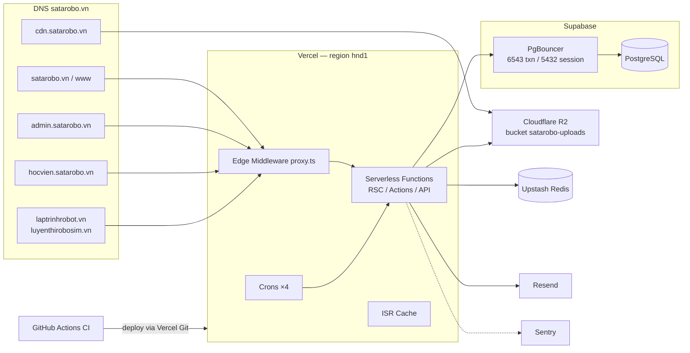

# Doc 4 — Infrastructure Document

> **Ai đọc:** DevOps, Backend Lead.
> 🔄 **ĐỒNG BỘ DOC 15 (2026-06-06):** bổ sung chốt vận hành — Backup **Supabase, RPO 24h / RTO 4–8h, restore test monthly** (Doc 15 §13.9) · môi trường local/dev/staging/prod/preview + quy tắc migration staging-trước (Doc 15 §13.8) · feature flag env→DB (Doc 15 §13.1) · observability/SLO/runbook (Doc 15 §13.4). Khi xung đột, Doc 15 thắng.
> **Cập nhật:** 2026-06-06 · Sinh tự động từ quét codebase.

---

## 1. Sơ đồ hạ tầng



- **Hosting:** Vercel serverless (không VPS/K8s). `vercel.json`: `"regions": ["hnd1"]` (gần VN nhất).
- **Build:** `prisma generate && next build` (output mặc định SSR, không static export).

## 2. CDN & Storage

| Hạng mục | Giá trị |
|---|---|
| Bucket | Cloudflare R2 `satarobo-uploads` (S3-compatible) |
| Public URL | `https://cdn.satarobo.vn` (`R2_PUBLIC_URL`) |
| Client | `lib/storage/r2-client.ts` — lazy init `S3Client` (endpoint `https://{ACCOUNT_ID}.r2.cloudflarestorage.com`, region `auto`) |
| Upload flow | Browser xin presigned PUT URL (expires 300s, chỉ sign Content-Type) → PUT thẳng R2 → server không nhận file |
| Categories | image 10MB / document 20MB / video 500MB / audio 50MB / archive 1GB (SCORM) — whitelist MIME + extension trong `lib/storage/upload-config.ts` |
| Folder | `uploads/<category>/<yyyy-mm>/<safe-name>-<uuid8>.<ext>` |
| `next/image` remote patterns | cdn.satarobo.vn, images.unsplash.com, *.r2.cloudflarestorage.com, img.youtube.com |

## 3. CI/CD pipeline

**File:** `.github/workflows/ci.yml` — trigger push/PR vào `main`, `develop`; concurrency cancel run cũ.

```
quality (15')                 unit-tests              e2e (PR + main)
├─ Postgres 16 service        ├─ pnpm install         ├─ Postgres 16 service
├─ pnpm install --frozen      └─ vitest --run         ├─ migrate deploy + db:seed
├─ prisma generate                                    ├─ playwright install chromium
├─ prisma migrate deploy                              ├─ pnpm build && start
├─ pnpm typecheck                                     ├─ playwright test
├─ pnpm lint                                          └─ upload report (7d, on fail)
└─ pnpm build
        └────────── needs ──────────┴────────── needs ──────────┘
```

- Node 22 + pnpm 11 + cache. CI env: `CI_DATABASE_URL=postgresql://ci:ci@localhost:5432/ci_test`, dummy `NEXTAUTH_SECRET`.
- **Deploy:** Vercel Git integration (push `main` → production; PR → preview `*.vercel.app`, middleware redirect preview prod về host canonical).
- **Workflow Phase A:** commit + push thẳng `main`, không branch/PR (theo memory `feedback_push_main_workflow`).
- Husky/lint-staged: có trong devDependencies nhưng **chưa cấu hình hook** — verify bằng `pnpm typecheck && pnpm lint && pnpm build` trước khi báo PASS.

## 4. Environment variables (tên + mục đích — KHÔNG ghi giá trị thật vào doc)

> Nguồn: `.env.example`. Quản lý secrets: Vercel Project Env (prod/preview) + `.env.local` (dev, gitignored). **Hook chặn `git add .env*`** (trừ `.env.example`).

| Nhóm | Biến | Mục đích |
|---|---|---|
| **Database** | `DATABASE_URL` | Pooled (pgbouncer :6543) — runtime queries |
| | `DIRECT_URL` | Session pooler :5432 — migrations |
| **Auth** | `NEXTAUTH_URL`, `NEXTAUTH_SECRET` | Auth.js v5 (secret: `openssl rand -base64 32`) |
| **Tracking** | `NEXT_PUBLIC_META_PIXEL_ID`, `META_CAPI_TOKEN` | Meta Pixel client + Conversions API server |
| | `NEXT_PUBLIC_GA4_ID`, `GA4_API_SECRET` | GA4 client + Measurement Protocol |
| **Email** | `RESEND_API_KEY`, `RESEND_FROM_EMAIL`, `RESEND_REPLY_TO`, `EMAIL_FROM` | Resend (thiếu key → no-op, log warn) |
| **Storage** | `R2_ACCOUNT_ID`, `R2_ACCESS_KEY_ID`, `R2_SECRET_ACCESS_KEY`, `R2_BUCKET_NAME`, `R2_PUBLIC_URL` | Cloudflare R2 |
| **Zalo** | `ZALO_OA_ID`, `ZALO_OA_ACCESS_TOKEN`, `ZALO_LIVE`, `ZALO_ZNS_TEMPLATE_ATTENDANCE`, `ZALO_ZNS_TEMPLATE_DEBT` | Zalo OA/ZNS (`ZALO_LIVE=false` = stub) |
| **Webhooks** | `WEBHOOK_FACEBOOK_VERIFY_TOKEN`, `WEBHOOK_FACEBOOK_SECRET`, `WEBHOOK_ZALO_SECRET`, `WEBHOOK_GOOGLE_FORM_SECRET` | Verify nguồn lead (rỗng = stub mode — **phải set trước go-live**) |
| **Rate limit** | `UPSTASH_REDIS_REST_URL`, `UPSTASH_REDIS_REST_TOKEN` (fallback `KV_*`) | Thiếu → in-memory |
| **Sentry** | `SENTRY_DSN`, `NEXT_PUBLIC_SENTRY_DSN`, `SENTRY_ORG`, `SENTRY_PROJECT`, `SENTRY_AUTH_TOKEN` | Thiếu DSN → SDK no-op |
| **Cron** | `CRON_SECRET` | Bearer auth cho `/api/cron/*` |
| **App** | `NEXT_PUBLIC_APP_URL`, `NODE_ENV` | Canonical URL |

## 5. Cron jobs (vercel.json)

| Path | Schedule | Việc |
|---|---|---|
| `/api/cron/email-queue` | `*/5 * * * *` | Drain EmailQueue |
| `/api/cron/class-reminder` | `0 1 * * *` (UTC) | Nhắc lịch học |
| `/api/cron/renewal-reminder` | `0 2 * * *` | Nhắc gia hạn |
| `/api/cron/debt-reminder` | `0 3 * * *` | Nhắc công nợ |

Auth: header `Authorization: Bearer {CRON_SECRET}` (hoặc session staff có `emails:view` cho chạy tay).

## 6. Monitoring — Sentry

| File | Runtime | Cấu hình |
|---|---|---|
| `sentry.server.config.ts` | Node | traces 0.1 prod / 1.0 dev · `sendDefaultPii: false` · `beforeSend` strip cookies + auth headers · httpIntegration |
| `sentry.edge.config.ts` | Edge (middleware) | traces 0.05 prod |
| `instrumentation.ts` | — | register theo `NEXT_RUNTIME`, export `onRequestError` |
| `next.config.ts` | — | `tunnelRoute: "/monitoring"` (né ad-blocker), upload source maps rồi xóa |

## 7. Backup & recovery strategy

| Hạng mục | Cơ chế |
|---|---|
| Database | Supabase automated daily backups (+ PITR tùy tier). Khôi phục qua Supabase dashboard |
| Schema | 47 migrations trong git = nguồn rebuild schema |
| Data seed | Seed scripts idempotent cho dữ liệu khung |
| Media | R2 bucket — versioning/lifecycle cấu hình phía Cloudflare |
| Code | GitHub (`main` = production) |
| Audit | 8 bảng `*AuditLog` lưu old/new values — khôi phục logic nghiệp vụ từng record |

⚠️ Quy tắc: không `prisma migrate reset` / không xóa prod data; cleanup test data dùng `scripts/cleanup-zztest.ts` (mặc định DRY-RUN, `--apply` mới chạy thật).

## 8. Scripts vận hành (`scripts/`)

| Script | Mục đích |
|---|---|
| `cleanup-zztest.ts` | Dọn data test `ZZTEST_*` (DRY-RUN mặc định) |
| `backfill-teacher-roles.ts` | Backfill `roles[]` cho GV |
| `upload-course-images.ts`, `upload-hoc-cu-images.ts` | Upload ảnh khóa → R2 + update DB |
| `seed-{course-packages,news,job-postings}.ts` | Seed nội dung |
| `close-legacy-jobs.ts` | Đóng job postings cũ |
| `build-templates.ts` | Build file Excel mẫu import (`templates/mau-*.xlsx`) |
