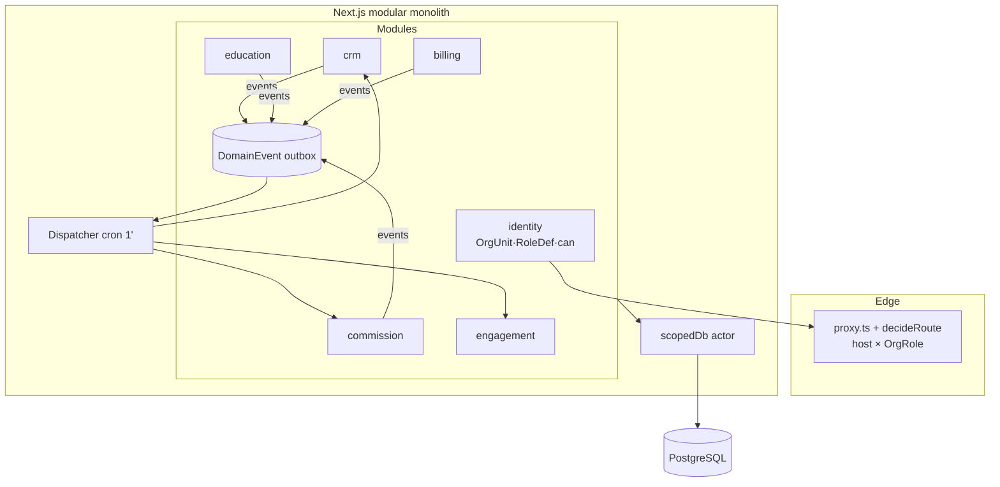

# Doc 13 — Architecture Redesign Proposal

> ⚠️ **SUPERSEDED — chỉ là tham chiếu lịch sử.** Bản chốt: Doc 15 v2. Lưu ý khác biệt quan trọng đã chốt lại (Doc 15 §11 OI-1, 2026-06-06): cấu trúc cây trong file này (HO là root, Center là con của HO, "quyền HO cascade xuống children") **đã bị thay** — cấu trúc chốt là **ROOT SataRobo → HO, CS1, CS2 độc lập ngang hàng**; HO role có scope cross-center **theo chức năng của role** (không qua quan hệ cha-con). Không dùng file này làm spec.

> **Ai đọc:** Tech Lead, Backend Dev, PM/CEO (phần 1 & 5).
> **Mục đích:** đối chiếu kiến trúc hiện tại (Doc 2–6) với 2 yêu cầu mới (`0-yeucau/`: SR.QD.217 + QL HV & LMS) → chỉ ra **vấn đề cấu trúc** → đề xuất **thiết kế lại để mở rộng & linh hoạt**: mô hình tổ chức **Hội sở (HO — Head Office) → Trung tâm**, role động thêm được không cần deploy, thêm module/model mới không đụng core, và gỡ các **dependency/coupling** hiện có.
> **Nguyên tắc:** KHÔNG big-bang rewrite. Mọi thay đổi theo 2-phase migration (pattern repo đã dùng), hệ thống chạy liên tục.
> **Cập nhật:** 2026-06-05.

---

## PHẦN 1 — VẤN ĐỀ CỦA REPO HIỆN TẠI (đối chiếu 2 yêu cầu)

### P1 — Role là enum Prisma hardcode → không có khái niệm Hội sở (HO)

**Hiện trạng** (`prisma/schema.prisma` + `lib/auth/permissions.ts`):
- `enum Role { SUPER_ADMIN, CENTER_MANAGER, HR, SALES_CSM, TEACHER, MARKETING, ACCOUNTANT, PARENT }` — **thêm/đổi role = migration + sửa code + redeploy**. Bằng chứng tech debt: rename `MANAGER→CENTER_MANAGER`, `SALES→SALES_CSM` đã phải làm migration + **legacy shim trong JWT callback** vẫn đang gánh token cũ.
- `User.centerId` nullable là cách duy nhất biểu diễn "thuộc cơ sở" — **không có thực thể tổ chức cấp trên Center**.

**Va chạm với yêu cầu:**
- SR217 phân biệt rõ **"Kế toán Hội sở"** (phân bổ chi phí toàn hệ thống) vs **"QL Trung tâm"** — hiện `ACCOUNTANT` không phân biệt được làm ở HO hay ở 1 center.
- SR217 ghi *"nhượng quyền N trung tâm, mỗi TT là entity độc lập hạch toán riêng"* — cần cây tổ chức (HO → Region? → Center) chứ không phải 1 FK phẳng.
- Khách muốn **thêm role mới theo nhu cầu vận hành** (vd "QC Marketing", "Giáo vụ", "Trưởng vùng") — hiện mỗi lần thêm là một vòng dev.

### P2 — Permission matrix hardcode trong TypeScript

**Hiện trạng:** ~140 action × 8 role nằm cứng trong `lib/auth/permissions.ts`. `UserPermissionGrant` (per-user ALLOW/DENY) đã DB-driven, nhưng **ma trận role thì không** → nghịch lý: chỉnh quyền 1 người làm được qua UI, chỉnh quyền cả role phải sửa code.

**Va chạm:** SR217 thêm ~8 action mới (`commission:*`, `cost-allocation:*`, `ads-stats:*`…) → lại sửa file trung tâm; mỗi module tương lai cũng vậy → file này thành **god-file** mọi PR đụng vào.

### P3 — Data scope theo center là ad-hoc, không enforced

**Hiện trạng:** mỗi query tự nhớ filter `where: { centerId }` — không có lớp chung. Doc 11 ghi nhận "Center scope (query filter)" là **convention, không phải guarantee**.

**Va chạm:** SR217 "hạch toán riêng từng TT" + hoa hồng tiền bạc → 1 query quên filter = **QL trung tâm A thấy doanh số/hoa hồng trung tâm B** (rủi ro tranh chấp khách đã cảnh báo). Số bảng có `centerId` đã ~30 và sẽ tăng (Commission, CostAllocation, PageInboundEvent…).

### P4 — Side effects gọi inline → coupling dây chuyền (vấn đề dependency lớn nhất)

**Hiện trạng** (Doc 9, 10): các action "kéo theo" hệ quả bằng **gọi trực tiếp trong cùng function**:

```
createLead → dedup + auto-assign + email notify + Meta CAPI + GA4   (1 action gọi 5 hệ)
markAttendance → MakeupNeed + notify PH + RiskAlert scan + SataCoin EARN
confirmOrder → Enrollment + ProductMovement + Voucher + EmailQueue + MISA log
```

**Hệ quả:**
1. **Thêm consumer mới = sửa action gốc** (vi phạm open/closed). SR217 cần thêm: lead chuyển trạng thái → cập nhật funnel stats, commission tạm tính, SLA timer — nếu tiếp tục inline, `leads/actions.ts` phình thành nồi lẩu.
2. Test khó: muốn test dedup phải mock email + CAPI.
3. Lỗi 1 nhánh phụ (CAPI timeout) từng phải catch riêng từng chỗ — không có cơ chế retry thống nhất (trừ EmailQueue là ngoại lệ tốt duy nhất).

### P5 — Business logic phân tán giữa `app/**/actions.ts` và `lib/`

**Hiện trạng:** ~20 file actions chứa lẫn lộn: auth check (đúng chỗ) + validate (đúng chỗ) + **business rules + orchestration** (sai chỗ — nên ở `lib/`). Một phần logic đã pure trong `lib/` (assign-strategy, schedule, absence — có unit test), phần còn lại nằm trong action không test được.

**Va chạm:** Commission engine là logic tiền bạc cần coverage 100% — bắt buộc tách pure; nhưng nếu không có **quy ước module rõ**, dev sau lại nhét vào actions.

### P6 — 138 models / 1 schema phẳng, không có module boundary

**Hiện trạng:** 29 domain (Doc 3) nhưng schema + `lib/` không nhóm theo domain; ai cũng import `db` và đụng bảng của domain khác trực tiếp (vd code media đọc thẳng bảng Enrollment). ESLint mới chặn **UI cross-import**, chưa chặn **domain cross-import**.

**Va chạm:** khách muốn "có thể thêm các model" dễ — hiện thêm 1 module nghĩa là: schema (1 file 4000+ dòng), validators, actions, permissions god-file, sidebar, … không có template; và không gì ngăn module mới gọi thẳng ruột module cũ → nợ coupling tăng theo cấp số.

### P7 — Hạ tầng lặp lại: 8+ bảng AuditLog gần giống nhau, adapter mỗi nơi một kiểu

- Audit: `UserAuditLog`, `LeadAuditLog`, `ClassAuditLog`, `StudentAuditLog`, `PaymentMethodAuditLog`, `VoucherAuditLog`, `ProductAuditLog`, `PermissionGrantAuditLog`… — mỗi module mới lại copy 1 bảng + 1 đoạn code. SR217 cần audit Commission + CostAllocation → sắp thành 10+.
- Notification: email (queue chuẩn) / Zalo (`ZaloMessageLog` riêng) / StaffNotification (riêng) / push (chưa có) — **không có interface chung**; SLA engine sắp phải gọi 3 kiểu API khác nhau.

### P8 — Session JWT chứa cả role/grants → đổi quyền không hiệu lực ngay

**Hiện trạng:** JWT mang `role, roles[], grants[], tokenVersion`; phải **bump tokenVersion + DB liveness check mỗi request admin** để vá. Khi role/permission chuyển sang DB-driven (P1, P2), nhét ma trận vào token càng không khả thi.

### Tóm tắt mức độ ảnh hưởng

| Vấn đề | Chặn SR217 | Chặn QL HV & LMS | Chặn "mở rộng linh hoạt" |
|---|---|---|---|
| P1 Role enum / không có HO | 🔴 trực tiếp (Kế toán Hội sở, QC role) | 🟡 | 🔴 |
| P2 Matrix hardcode | 🟡 | 🟡 | 🔴 |
| P3 Scope ad-hoc | 🔴 (tiền, hoa hồng) | 🟡 | 🔴 |
| P4 Side effects inline | 🔴 (funnel/SLA/commission consumers) | 🟡 | 🔴 |
| P5 Logic trong actions | 🟡 | 🟡 | 🟡 |
| P6 Không module boundary | 🟡 | 🟡 | 🔴 |
| P7 Hạ tầng lặp | 🟡 | 🟡 | 🟡 |
| P8 Session phình | 🟡 | — | 🟡 |

---

## PHẦN 2 — THIẾT KẾ ĐÍCH (TARGET ARCHITECTURE)

> Giữ **monolith Next.js trên Vercel** (đúng với team size + Doc 2 §5) — nâng cấp thành **MODULAR monolith**: ranh giới module trong code + dữ liệu tổ chức/quyền chuyển sang DB-driven + giao tiếp chéo module qua **domain events**.

### 2.1 Mô hình tổ chức: OrgUnit tree (HO → Center)

> Giả định: "HO" = **Head Office (Hội sở)** — đúng ngữ cảnh SR217 ("Kế toán Hội sở"). Nếu ý anh khác, báo lại để chỉnh.

```prisma
model OrgUnit {
  id        String      @id @default(cuid())
  type      OrgUnitType // HEAD_OFFICE | REGION | CENTER  (thêm type mới = thêm enum value, tree không đổi)
  code      String      @unique        // HO, MB, CS1...
  name      String
  parentId  String?                    // HO là root (null)
  parent    OrgUnit?    @relation("tree", fields: [parentId], references: [id])
  children  OrgUnit[]   @relation("tree")
  centerId  String?     @unique        // Phase A: link 1-1 sang Center hiện hữu (compat)
  isActive  Boolean     @default(true)
}
```

- **Phase A:** `Center` giữ nguyên, mỗi Center có 1 OrgUnit bọc ngoài + 1 OrgUnit `HEAD_OFFICE` root. Mọi FK `centerId` hiện tại **không đổi**.
- Tương lai: thêm `REGION` (Trưởng vùng) chỉ là chèn node giữa cây — không migration dữ liệu nghiệp vụ.

### 2.2 Role động (DB-driven RBAC) — giải P1 + P2

```prisma
model RoleDef {                        // thay enum Role
  id          String  @id @default(cuid())
  code        String  @unique          // CENTER_MANAGER, QC_MARKETING, GIAO_VU...
  name        String                   // tên hiển thị tiếng Việt
  isSystem    Boolean @default(false)  // role hệ thống không cho xóa (SUPER_ADMIN, PARENT)
  permissions RolePermission[]
}
model RolePermission {
  roleId String
  action String                        // 'commission:approve' — validate bằng ACTION_REGISTRY
  @@id([roleId, action])
}
model UserOrgRole {                    // thay User.role + User.roles[] + User.centerId
  userId    String
  orgUnitId String                     // quyền GẮN VỚI vị trí trong cây
  roleId    String
  @@id([userId, orgUnitId, roleId])
}
```

**Resolution `can(user, action, scope?)`:**
1. `SUPER_ADMIN` (role system @ HO) → true.
2. `UserPermissionGrant` DENY → false; ALLOW → true (giữ nguyên cơ chế 5.3).
3. Có `RolePermission(action)` tại OrgUnit **là tổ tiên hoặc chính** scope đang hỏi → true. (Quyền ở HO **cascade** xuống mọi center; quyền ở Center chỉ center đó.)

**Ví dụ giải đúng SR217:** "Kế toán Hội sở" = `ACCOUNTANT @ HO` → thấy cost-allocation toàn hệ thống; "Kế toán cơ sở" = `ACCOUNTANT @ CS1` → chỉ CS1. "QC Marketing" = **tạo role mới qua UI admin** (`/admin/roles`), gán permission `ads-stats:edit`, không cần dev.

**Code còn lại trong repo:** `ACTION_REGISTRY` (danh sách action hợp lệ — vẫn là code vì gắn với feature) + seed role mặc định. Ma trận role×action → DB, chỉnh qua UI có audit.

### 2.3 Data-scope enforced — giải P3

```typescript
// lib/db-scope.ts — Prisma Client Extension
const SCOPED_MODELS = ['lead','order','class','student', ...]   // bảng có centerId
export function scopedDb(actor: Actor) {
  return db.$extends({ query: { $allModels: { findMany/findFirst/count/aggregate(...) {
    if (SCOPED_MODELS.includes(model) && !actor.isHeadOffice)
      args.where = { AND: [args.where ?? {}, { centerId: { in: actor.visibleCenterIds } }] }
    return query(args)
  }}}})
}
```

- `actor.visibleCenterIds` = các center thuộc subtree OrgUnit user có role.
- Server actions/RSC **bắt buộc dùng `scopedDb(actor)`** thay `db` cho đọc dữ liệu nghiệp vụ (ESLint rule chặn import `@/lib/db` trực tiếp trong `app/(admin)`, whitelist module hạ tầng).
- HO bypass tự nhiên (subtree = toàn cây). Hết lỗi "quên filter".

### 2.4 Domain events qua Outbox — giải P4 (dependency lớn nhất)

Nhân rộng pattern **EmailQueue** (đã chứng minh chạy tốt trên serverless) thành cơ chế chung:

```prisma
model DomainEvent {
  id          String   @id @default(cuid())
  type        String        // 'lead.qualified' | 'lead.handed' | 'order.confirmed' | 'attendance.marked'...
  aggregateId String
  payload     Json
  centerId    String?
  occurredAt  DateTime @default(now())
  processedAt DateTime?
  attempts    Int      @default(0)
  error       String?
  @@index([processedAt, occurredAt])
  @@index([type, aggregateId])
}
```

```
Action (transaction):  ghi nghiệp vụ + ghi DomainEvent  → commit → trả về ngay
Dispatcher (cron 1'):  đọc event chưa xử lý → chạy các handler đăng ký theo type
                       (handlers: idempotent, retry theo attempts, lỗi không chặn handler khác)
```

```typescript
// modules/crm/events.ts — đăng ký handler KHÔNG sửa action gốc
on('order.confirmed', activateEnrollment)      // billing
on('order.confirmed', recordProductSale)       // inventory
on('order.confirmed', enqueueReceiptEmail)     // engagement
on('order.confirmed', updateCommissionStats)   // commission (MỚI — chỉ thêm 1 dòng)
on('attendance.marked', createMakeupNeed)
on('attendance.marked', scanRiskAlert)
on('attendance.marked', earnSataCoin)
```

- **Đồng bộ vs bất đồng bộ:** hệ quả cần ngay trong cùng transaction (trừ kho khi xuất hàng) giữ inline; hệ quả "thông báo/thống kê/tích điểm" → event. Quy tắc: *inline chỉ khi cần atomic, còn lại event.*
- SLA engine (SR217) = consumer của `lead.*` events + cron quét — không đụng actions lead.
- Meta CAPI/GA4/Zalo/MISA → handler có retry, hết catch rải rác.

### 2.5 Modular monolith — giải P5 + P6

```
modules/
├── identity/        # User, RoleDef, UserOrgRole, OrgUnit, session, can()
├── crm/             # Lead, Trial, PageInboundEvent, AdsDailyStat, SLA
├── commission/      # CommissionPeriod/Item/RateConfig, CostAllocation   (MỚI - SR217)
├── education/       # Course, Curriculum, Class, Session, Enrollment, Attendance
├── lms/             # Question, Exam, Assignment, Document
├── student-care/    # RiskAlert, CareTask, Reserve, Transfer, Survey
├── billing/         # Order, Payment, Voucher, Installment
├── inventory/       # Item, Stock, Product
├── engagement/      # Notification, Email, Zalo, SataCoin, Media
├── hr/              # Employee, Shift, Checkin, Honor, Job
└── shared/          # audit, events(outbox), storage, pdf, excel, validators-core
```

Mỗi module: `index.ts` (public API — facade duy nhất) · `models.prisma` (ghép bằng `prismaSchemaFolder` — Prisma 5 hỗ trợ multi-file schema qua preview/`schema` folder) · `actions.ts` (mỏng: auth+validate+gọi service) · `service.ts` (pure logic — unit test) · `events.ts` (handlers đăng ký) · `permissions.ts` (đăng ký actions vào ACTION_REGISTRY).

**Enforce bằng ESLint** (mở rộng cơ chế đã có cho UI):
```
modules/A KHÔNG được import modules/B/** — chỉ được import modules/B (index public API)
app/** KHÔNG import db trực tiếp — đi qua module
```

**Template thêm module mới** (trả lời "có thể thêm các model"): checklist 7 bước (schema → service → actions → permissions register → events → UI → doc) — thêm module không sửa file nào của module khác ngoài đăng ký sidebar.

### 2.6 Hạ tầng dùng chung — giải P7

1. **Audit hợp nhất:** bảng `AuditLog(entityType, entityId, action, oldValues, newValues, actorId, actorName, centerId, metadata)` — module mới dùng ngay, không tạo bảng. 8 bảng cũ giữ nguyên (đọc), ghi mới vào bảng chung (2-phase; viewer đọc UNION trong giai đoạn chuyển).
2. **Notifier interface:** `notify(recipient, template, payload, channels: ['bell','email','zalo','push'])` — router chọn kênh theo config + consent; mỗi kênh 1 adapter; SLA/commission/reminder gọi 1 API duy nhất.

### 2.7 Session gọn — giải P8

JWT chỉ còn `{ userId, sessionVersion }`. Mỗi request: resolve `Actor { userId, orgRoles[], permissions(set), visibleCenterIds }` từ DB qua **per-request cache** (React `cache()`) — admin layout đang query DB mỗi request rồi (liveness), nên **không tăng** số query; đổi quyền/role **hiệu lực ngay**, bỏ legacy shim và grants-in-token.

### 2.8 Sơ đồ đích



---

## PHẦN 3 — MAP 2 YÊU CẦU LÊN KIẾN TRÚC MỚI

| Yêu cầu | Trên kiến trúc cũ | Trên kiến trúc mới |
|---|---|---|
| Kế toán Hội sở vs kế toán TT | Không biểu diễn được | `ACCOUNTANT @ HO` vs `@ CS1` — tự nhiên |
| Thêm role QC Marketing, Giáo vụ… | Migration + sửa permissions.ts + deploy | Tạo qua UI `/admin/roles` + gán action |
| Hoa hồng 4 tầng | Tính từ query chéo 4 domain trong 1 job | Module `commission` consume events `order.confirmed`/`order.refunded` → stats sẵn, job cuối tháng chỉ tổng hợp + chốt |
| SLA alerts | Cron quét + nhét logic vào actions lead | Consumer các event `lead.*` + Notifier 1 API |
| Hạch toán riêng từng TT / nhượng quyền | Filter tay từng query | `scopedDb` enforced theo OrgUnit subtree |
| Dashboard đa tầng (hệ thống/cơ sở/lớp) | Mỗi dashboard tự viết scope | Scope đến từ OrgUnit subtree — cùng 1 query chạy cho mọi tầng |
| Thêm model/module (RewardItem, StudentConsent, PageInboundEvent…) | Sửa schema khổng lồ + god-files | Theo module template, không đụng module khác |
| Multi-tenant đóng gói (R&D 9.2) | Gần như viết lại | OrgUnit tree + scopedDb là 80% nền móng (tenant = subtree) |

## PHẦN 4 — KẾ HOẠCH MIGRATION (không big-bang)

> Chèn **Release A0 — Architecture Foundation** TRƯỚC R1 trong roadmap (`0-yeucau/3-ke-hoach-trien-khai/01-roadmap-release.md`), vì Commission/SLA xây trên nền cũ sẽ phải đập sửa lại ngay.

| Phase | Nội dung | Thời lượng | Rủi ro |
|---|---|---|---|
| **A0.1** | `OrgUnit` + `RoleDef/RolePermission/UserOrgRole` + seed từ enum hiện tại (script idempotent); `can()` v2 đọc DB (per-request cache) nhưng **fallback matrix cũ** khi bảng trống — chạy song song, so khớp log | 4–5 ngày | Thấp — additive |
| **A0.2** | Session gọn (`userId + sessionVersion`) + Actor resolver; gỡ legacy shim MANAGER/SALES | 2–3 ngày | Trung bình — test kỹ login 3 host (route-policy.test mở rộng) |
| **A0.3** | `scopedDb` extension + ESLint rule + chuyển dần module CRM/billing sang scopedDb (các module khác chuyển dần theo release) | 3–4 ngày | Thấp |
| **A0.4** | `DomainEvent` outbox + dispatcher cron + chuyển 2 luồng nhiều consumer nhất (`order.confirmed`, `attendance.marked`) sang event; UI `/admin/roles` | 4–5 ngày | Trung bình — handler phải idempotent |
| **A0.5** | Khung `modules/` + ESLint boundary + di chuyển code **chỉ khi chạm vào** (boy-scout rule — không mass-move); `AuditLog` hợp nhất cho bảng mới; Notifier interface | 2–3 ngày khung, còn lại rải theo release | Thấp |
| **Sau R1 ổn định** | Phase B/C: drop `User.role/roles/centerId` (sau 2–3 tuần prod ổn), gộp viewer audit | — | Theo 2-phase pattern |

**Tổng A0 ≈ 3 tuần.** R1 (SR217) sau đó xây thẳng trên nền mới: `commission` + `crm` là 2 module modular đầu tiên — vừa làm feature vừa làm mẫu chuẩn cho team.

**Definition of Done A0:**
1. Tạo role mới + gán quyền qua UI, user dùng được ngay không deploy.
2. `ACCOUNTANT @ HO` thấy toàn hệ thống; `@ CS1` chỉ thấy CS1 (test tự động).
3. 1 query cố tình bỏ filter center trong module đã chuyển → vẫn bị scope chặn (test).
4. Thêm 1 consumer mới cho `order.confirmed` = 1 dòng đăng ký, không sửa action.
5. `pnpm typecheck && lint && build && test` xanh; route-policy + permissions tests mở rộng cover OrgUnit.

## PHẦN 5 — QUYẾT ĐỊNH & ĐÁNH ĐỔI (ADR tóm tắt)

| # | Quyết định | Lý do | Đánh đổi chấp nhận |
|---|---|---|---|
| 1 | Giữ monolith, KHÔNG microservices | Team nhỏ, domain liên kết chặt, Vercel serverless đã scale web tier | Scale DB vẫn là giới hạn chung (như hiện tại) |
| 2 | Role/permission sang DB | Thêm role không cần deploy; HO model | +1 lớp cache; UI quản trị phải làm chuẩn (audit đầy đủ) |
| 3 | Outbox + cron thay message broker | Đúng với Vercel serverless, pattern EmailQueue đã chứng minh | Độ trễ consumer ≤ ~1 phút (chấp nhận được cho mọi flow hiện tại) |
| 4 | Events chỉ cho side-effects không-atomic | Giữ consistency nghiệp vụ tiền/kho trong transaction | Dev phải phân loại đúng (quy tắc trong template module) |
| 5 | Di chuyển code vào `modules/` dần (boy-scout) | Tránh big-bang, blame/history git còn đọc được | Giai đoạn chuyển tiếp tồn tại 2 kiểu cấu trúc (chấp nhận, có ESLint dẫn đường) |
| 6 | OrgUnit tree ngay từ đầu (thay vì cờ `isHeadOffice`) | REGION/multi-tenant sau này không phải làm lại | Hơi over-engineer cho hiện tại 1 cấp — đổi lấy đường mở rộng đã được khách nêu rõ (nhượng quyền) |

## PHẦN 6 — VIỆC CẦN CHỐT VỚI ANH (PM/CEO)

1. **"HO" = Head Office (Hội sở)?** — toàn bộ thiết kế 2.1/2.2 dựa trên giả định này.
2. Duyệt chèn **A0 (~3 tuần) trước R1** — đổi lại R1 nhanh hơn và không phải sửa lại commission về sau. Nếu cần SR217 gấp hơn: phương án B = làm R1.1–R1.2 trên nền cũ song song A0, chấp nhận refactor nhỏ khi merge.
3. Danh sách role khởi điểm theo mô hình HO (đề xuất): HO: `SUPER_ADMIN, ACCOUNTANT_HO, QC_MARKETING, HR` · Center: `CENTER_MANAGER, SALES_CSM, TEACHER, ACCOUNTANT_CENTER, GIAO_VU?` · `PARENT` (portal). Anh xác nhận/bổ sung.
4. Ai được quyền tạo/sửa role + gán quyền? (đề xuất: chỉ SUPER_ADMIN, mọi thay đổi audit + cần lý do).
