# Doc 15 — SataRobo FINAL Project Blueprint (v2 — BẢN THỐNG NHẤT)

> **Vai trò:** tài liệu CHỐT DUY NHẤT cho toàn bộ hệ thống satarobo-vn — hợp nhất: Doc 15 v1 (blueprint kỹ thuật trước/sau + sơ đồ) + `15-satarobo-final-project-blueprint-v1.md` (CEO chốt nghiệp vụ 05/06/2026) + Doc 13/14.
> Tài liệu này **thay thế các bản yêu cầu rời rạc trước đó**. Requirement đã loại bỏ KHÔNG đưa lại vào core. Khi xung đột với tài liệu khác → **file này thắng**.
> **Phạm vi:** `satarobo.vn` · `admin.satarobo.vn` · `hocvien.satarobo.vn`.
> **Cập nhật:** 2026-06-05.

---

## §0 — QUYẾT ĐỊNH CHIẾN LƯỢC ĐÃ CHỐT

| # | Nhóm | Quyết định cuối |
|---|---|---|
| Q1 | Kiến trúc | **Modular Monolith** trên Next.js/Vercel — không microservice |
| Q2 | Tổ chức | `OrgUnit` tree — **ROOT SataRobo** → **HO, CS1, CS2 là các OrgUnit ĐỘC LẬP ngang hàng dưới ROOT** (types: ROOT/HO/CENTER/CAMPUS/PARTNER/FRANCHISE — OI-11). CS1 = 211 Nguyễn Hữu Thọ; CS2 = 114 Hoàng Diệu. HO hiện làm việc tại 114 Hoàng Diệu (**trùng địa điểm CS2 nhưng KHÔNG thuộc/không gộp vào CS2**) — sau này HO có thể đổi địa điểm hoặc làm tại CS khác |
| Q3 | Phân quyền | **Dynamic RBAC** (`RoleDef/RolePermission/UserOrgRole` — có `effectiveFrom/effectiveTo/status`) + **Scope 6 mức** (GLOBAL/CENTER/CLASS/OWN/CHILDREN/ASSIGNED) + per-user grant ALLOW (5.3). **Conflict: ALLOW thắng nếu ≥1 role cho phép — KHÔNG dùng DENY override giai đoạn này** (DENY thiết kế phase sau — OI-7) |
| Q4 | Event | **DomainEvent outbox + cron dispatcher** — không message broker. **Tiền/invoice/payment/enrollment đi TRANSACTION, không đi event async** |
| Q5 | Schema | **Multi-file Prisma** (`prisma/schema/*.prisma`) — không tách Postgres schema vật lý |
| Q6 | Tenant | Hoãn `tenantId` — bảng mới có `orgUnitId`; backfill khi có đối tác SaaS thật |
| Q7 | Audit | **AuditLog hợp nhất 1 bảng** cho dữ liệu mới; 8 bảng cũ đọc-only |
| Q8 | Integration | Mọi external call qua `modules/integration` (Meta Messenger/Ads, Resend, R2; sau: SMS, Zalo, MISA, VNPay) |
| Q9 | Login | **Cổng login chung `satarobo.vn/login`** → tự nhận role redirect: staff (`hovaten@satarobo.vn`) → admin; parent (phone/email) → hocvien |
| Q10 | Portal | `hocvien.satarobo.vn` = phụ huynh + học sinh chung 1 tài khoản — **site phụ huynh + site từng con**; route đẹp **KHÔNG lộ `studentId`** (active profile trong signed cookie). KHÔNG student login riêng, ~~KHÔNG teacher domain riêng~~ **[ĐẢO 04/07/2026 — phiếu BGĐ câu 7: LÀM site giáo viên riêng `giaovien.satarobo.vn` (L5, route group `app/(teacher)/teacher/`, 2-phase flag `TEACHER_SITE_ENABLED`)]** |
| Q11 | Lead | **Messenger Ads qua Page HO là kênh CHÍNH** (webhook → conversation → L1); phụ: GForm, landing, web form, import, giới thiệu |
| Q12 | Khóa học | Core = **offline Sata 1–8 + Combo Sata 1&2**. Online course **trỏ Sataworld** — không build video LMS |
| Q13 | OTP/Activation | KHÔNG mật khẩu mặc định. Core: activation qua **Resend email**, parent tự đặt mật khẩu; OTP provider abstraction để cắm SMS/Zalo sau |
| Q14 | Payment | Core: ghi nhận thanh toán **thủ công + kế toán xác nhận** — không cổng online |
| Q15 | Roadmap | **A0 → R1 (CRM Messenger + Marketing + Commission) → R2 (SIS/Finance) → R3 (LMS offline) → R4 (Portal) → R5 (HR)** → backlog |

### Đã LOẠI khỏi core (không đưa lại)

| Nhóm | Mục loại bỏ | Thay thế |
|---|---|---|
| Pháp lý dữ liệu trẻ em | AI camera/face recognition, phân tích sức khỏe, sinh trắc học, geofencing/IoT/định vị **học sinh** | Điểm danh thủ công bởi GV/admin + PH báo vắng + lịch sử chỉnh sửa. Geofence CHỈ cho nhân viên (R5) |
| Quá xa MVP | Web3/NFT/IPFS, SataCoin blockchain, Learn2Earn, Marketplace, SaaS/White-label/Franchise billing | Chứng chỉ PDF + mã tra cứu; điểm thưởng/badge nội bộ (backlog) |
| AI (toàn bộ) | AI Tutor/CRM Assistant/Reporting/Learning path/Prediction | Rule-based: `nextCourseId`, RiskAlert, Class Health Score |
| Sai quyết định cũ | FB Lead Form là main flow → **Messenger**; student login riêng → profile trong tài khoản PH; ~~teacher domain riêng → admin theo role~~ **[ĐẢO 04/07/2026 — phiếu BGĐ câu 7 duyệt lại: site GV riêng `giaovien.satarobo.vn`]**; route có studentId → active profile; `User.centerId` → OrgUnit |

### Backlog phase sau (thứ tự đề xuất)

`1. Zalo OA/ZNS → 2. Payment gateway → 3. MISA AMIS → 4. Flutter app + push → 5. AI assistant/reporting → 6. Franchise/SaaS`

### Wording chuẩn scope core

> Phạm vi phase core tập trung vận hành trung tâm đào tạo offline: CRM tuyển sinh từ Messenger Ads theo LEADS_1/2/3, phân quyền HO/CS1/CS2, quản lý học viên/phụ huynh, LMS offline, học phí/công nợ, báo cáo, portal phụ huynh + học sinh. Sinh trắc học trẻ em, AI camera, định vị học sinh, blockchain/NFT, marketplace, app mobile, MISA/Zalo/VNPay live, AI prediction **không thuộc core** — chỉ xem xét sau khi core hoàn thiện và có đánh giá pháp lý/kỹ thuật riêng.

---

## §1 — PHÂN TÍCH **TRƯỚC** UPDATE (AS-IS) — vì sao phải đổi

### 1.1 Kiến trúc hiện tại

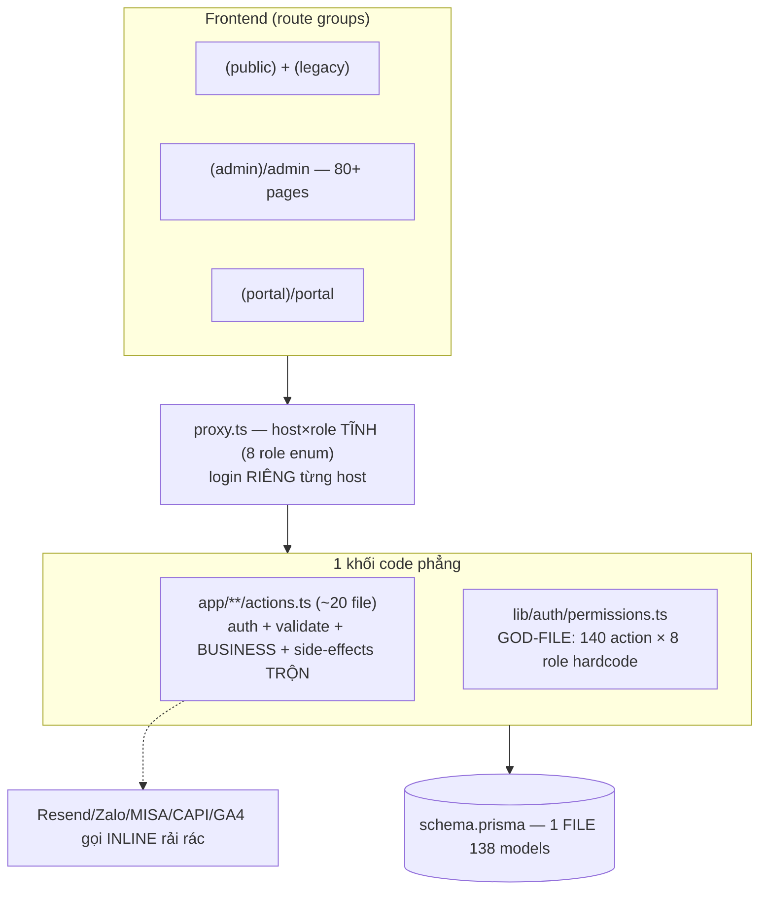

### 1.2 Sơ đồ coupling hiện tại

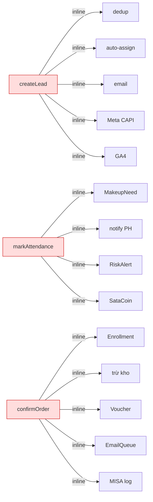

### 1.3 ERD identity hiện tại

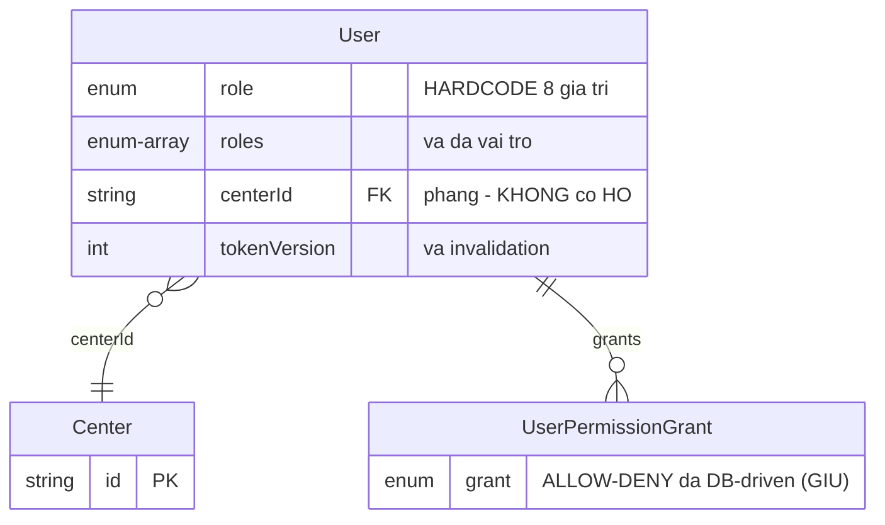

### 1.4 Tổng hợp vấn đề (P1–P8 + lỗ hổng đã vá bằng Q-quyết định)

| Vấn đề | Hệ quả | Giải bằng |
|---|---|---|
| P1 Role enum, không có HO | Không biểu diễn "Kế toán Hội sở"; thêm role = deploy | Q2 + Q3 |
| P2 Matrix hardcode god-file | Module mới nào cũng sửa 1 file | Q3 (RolePermission DB) |
| P3 Scope center ad-hoc | Nguy cơ CS1 thấy doanh số CS2 | `scopedDb` (§6.3) |
| P4 Side-effects inline | Thêm consumer = mổ action gốc | Q4 (outbox) |
| P5 Logic trong actions | Commission không unit-test được | Module template (§6.2) |
| P6 1 schema 138 models | Thêm model khó | Q5 (multi-file) |
| P7 8 bảng audit lặp + 3 kiểu notify | Copy-paste tăng dần | Q7 + Notifier |
| P8 JWT chứa role/grants | Đổi quyền không hiệu lực ngay | Session gọn (§6.4) |
| Login riêng từng host | Trải nghiệm rời rạc, không đúng Q9 | Login chung (§3) |
| Luồng tiền nếu đi event (lỗi C1 đã chặn) | Lệch sổ | Q4 transaction rule |

---

## §2 — TỔ CHỨC & PHÂN QUYỀN (SAU UPDATE)

### 2.1 Cây tổ chức thực tế

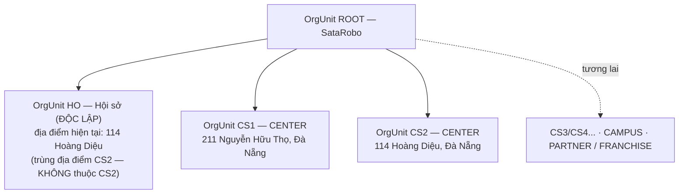

**Nguyên tắc (OI-1, OI-2, OI-12 đã chốt):**
- HO, CS1, CS2 là các OrgUnit **độc lập ngang hàng dưới ROOT SataRobo**. Tuyệt đối KHÔNG thiết kế logic kiểu `HO = CS2` hoặc HO nằm dưới CS2 — địa điểm làm việc trùng nhau ≠ quan hệ tổ chức; HO có thể đổi địa điểm bất kỳ lúc nào.
- CS2 không quản lý nhân sự HO (nếu người đó chỉ là HO staff).
- HO staff có thể kiêm nhiệm **một hoặc nhiều** trung tâm: CS1, CS2 và các CS3/CS4... mở thêm trong tương lai. CS1/CS2 chỉ là **seed data ban đầu, không phải giới hạn kiến trúc**.
- `address` chỉ là thông tin địa điểm trong OrgUnit — **KHÔNG dùng address để suy ra quan hệ quản lý** (HO và CS2 có thể cùng address nhưng khác OrgUnit). Không tạo Location model trong PR-A0-01; tách sau nếu cần (OI-12).

### 2.2 ERD identity/org đích

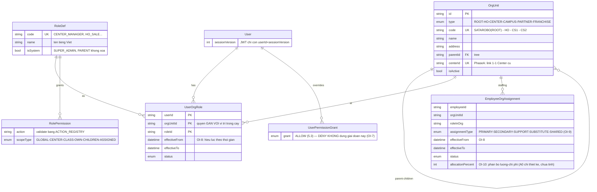

**Phân biệt 2 bảng gán (§11 OI-6/OI-8/OI-9/OI-10 đã chốt):**
- `UserOrgRole` = **quyền truy cập hệ thống** (RBAC) — do admin cấp qua RoleDef/Permission. Một user có thể có **nhiều UserOrgRole ở nhiều OrgUnit** (vd: HO/HO_MARKETING + CS1/CENTER_SALES_CSM + CS2/...). Tùy role được cấp, user có quyền rộng hoặc hẹp đúng theo quyền của role. Không dùng `user.centerId` đơn lẻ làm nguồn phân quyền chính; không hardcode mỗi user thuộc một center.
- `EmployeeOrgAssignment` = **nhân sự/chi phí** (kiêm nhiệm HO + một/nhiều trung tâm — CS1, CS2 và các center tương lai; GV dạy thay chéo cơ sở — `assignmentType` 5 loại; `allocationPercent` phân bổ lương; báo cáo lợi nhuận per cơ sở).
- **EmployeeOrgAssignment KHÔNG tự động sinh quyền** — quyền hệ thống không suy ra cứng từ việc thuộc/kiêm nhiệm đơn vị nào; admin cấp `UserOrgRole` phù hợp theo nhu cầu vận hành.
- Cả hai bảng đều có **hiệu lực theo thời gian** (`effectiveFrom/effectiveTo/status` — OI-8) để hỗ trợ kiêm nhiệm tạm thời/dạy thay/đổi role theo giai đoạn.
- **Center Manager & HO staff (OI-6):** Center Manager quản lý HO staff **chỉ trong phạm vi** assignment/role thuộc center mình (không quản lý vai trò HO của người đó); HO staff chỉ ngồi tại địa điểm center mà không có assignment/role tại center → **không** thuộc quản lý của Center Manager.

### 2.3 Bộ role khởi điểm (seed)

| Nhóm | Role | Quyền chính |
|---|---|---|
| HO | `SUPER_ADMIN`* | Toàn hệ thống, quản role (duy nhất được tạo/sửa/xóa RoleDef/Permission — OI-2 cũ giữ nguyên) |
| HO | `HO_ACCOUNTANT` | **Xem + sửa** toàn hệ thống theo chức năng kế toán (phân bổ chi phí, hoa hồng) |
| HO | `HO_HR` | **Xem + sửa** toàn hệ thống theo chức năng HR |
| HO | `HO_MARKETING` | **Xem + sửa** toàn hệ thống theo chức năng marketing (ads, campaign, dashboard). **PII theo phương án D: tùy permission admin cấp — không mặc định xem đầy đủ** (OI-4) |
| HO | `HO_SALE` | Trực Messenger, tạo LEADS_2, bàn giao trung tâm. Lead scope **A&B** (lead mình tạo/giao + lead kênh HO/ads/Messenger) — **xem có, sửa không** với lead đã thuộc cơ sở (OI-5, NC-1) |

> ❌ **KHÔNG có role `HO_MANAGER`** (OI-3 đã chốt — bản trước có, nay deprecated/xóa). Nhu cầu dashboard/báo cáo cấp TGĐ: dùng SUPER_ADMIN hoặc tạo role mới qua UI khi cần (NC-2).
| Center | `CENTER_MANAGER` | Toàn bộ dữ liệu center mình |
| Center | `CENTER_SALES_CSM` | Lead/HV được giao, pipeline, chăm sóc, tái tục (gộp Sale+CSM+CRM) |
| Center | `TEACHER`, `ASSISTANT_TEACHER` | Lớp mình dạy: điểm danh, nhận xét, bài tập, media |
| Center | `CENTER_ACCOUNTANT` | Học phí/công nợ/thanh toán center mình |
| Portal | `PARENT`* | Chỉ dữ liệu con mình (scope CHILDREN) |

(*) `isSystem` — không xóa được. Học sinh **không có account riêng** trong core.

### 2.4 Luồng resolve quyền

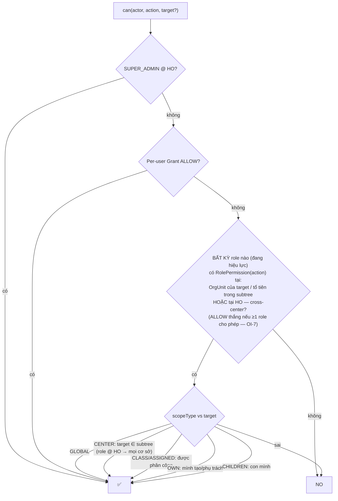

> **§11 OI-3/OI-5/OI-7 đã chốt:**
> - **HO role là cross-center theo chức năng:** role gắn tại **HO** áp dụng cho **tất cả cơ sở** đúng theo module/quyền của role đó (HO_ACCOUNTANT → kế toán toàn hệ thống; HO_HR → HR toàn hệ thống; HO_MARKETING → marketing toàn hệ thống; HO_SALE → lead scope A&B, xem có sửa không). **HO KHÔNG phải SUPER_ADMIN** — không mặc định có mọi chức năng của mọi role.
> - **Conflict (OI-7, phương án B):** user nhiều role → **ALLOW thắng nếu có ít nhất một role cho phép** đúng scope. **KHÔNG dùng DENY override giai đoạn này** (DENY thiết kế phase sau; grant DENY hiện hữu của Sprint 5.3 cần rà soát trước khi cắt sang can() v2 — NC-3).
> - Role chỉ tính khi **đang hiệu lực** (`effectiveFrom ≤ now ≤ effectiveTo`, `status` active — OI-8).

---

## §3 — DOMAIN, LOGIN CHUNG & PORTAL

### 3.1 Domain & login chung (Q9 — THAY ĐỔI so với hiện tại)

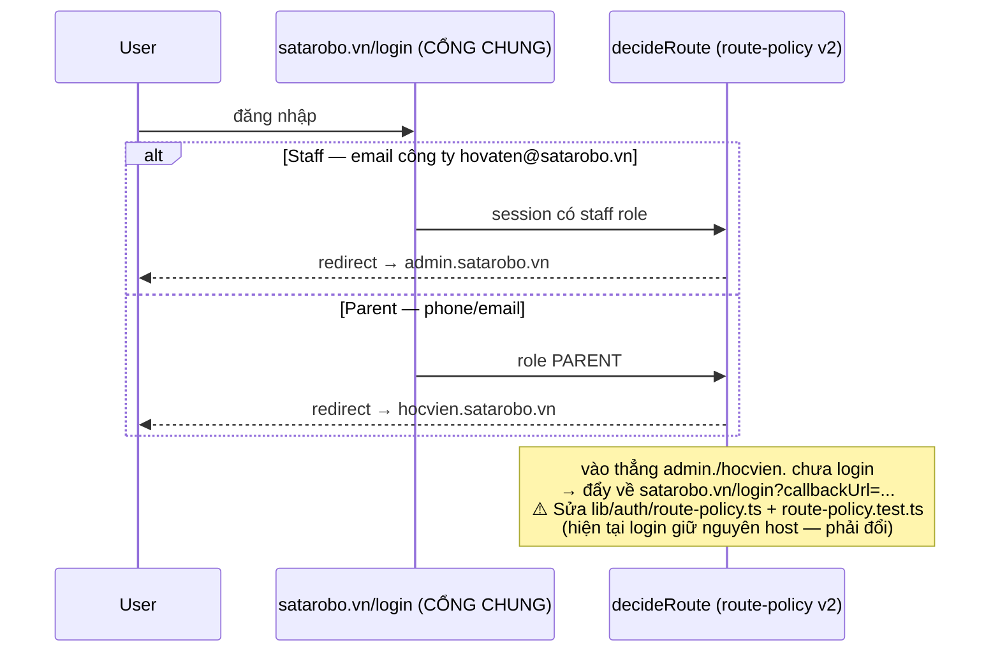

### 3.2 Portal phụ huynh + học sinh (Q10)

```
1 tài khoản PARENT → [ Site phụ huynh | Site con 1 | Site con 2 ... ]
- Site phụ huynh: chức năng PH (yêu cầu, đánh giá, học phí, consent)
- Site con N: CHỈ dữ liệu/chức năng của con N
- KHÔNG lộ studentId trên URL — active profile trong signed cookie (cơ chế ACTIVE_SITE đã có, giữ + mở rộng)
Route: /thong-bao /lich-hoc /bai-tap /trac-nghiem /nop-bai /hinh-anh /nhan-xet /danh-gia
```

---

## §4 — KIẾN TRÚC KỸ THUẬT ĐÍCH

### 4.1 Kiến trúc tổng thể

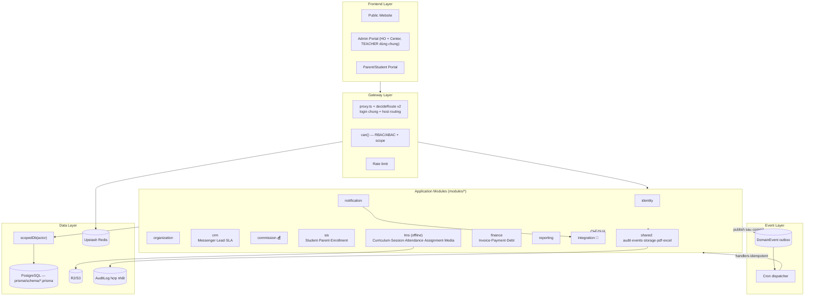

### 4.2 Cấu trúc code & ranh giới import (ESLint enforce)

```
modules/{identity, organization, crm, commission, sis, lms, attendance, finance,
         notification, reporting, integration, audit, shared}/
  └── index.ts (public API) · service.ts · repository.ts · events.ts · permissions.ts · validators.ts
```

```
✗ app/** import db trực tiếp            → đi qua module + scopedDb
✗ modules/A import sâu modules/B/**     → chỉ import modules/B (index)
✗ module nghiệp vụ gọi external API     → chỉ modules/integration
✓ mọi query user-facing qua scopedDb + can()
```

### 4.3 Multi-file Prisma (Q5)

```
prisma/schema/
├── base.prisma (datasource + generator, prismaSchemaFolder)
├── identity.prisma · organization.prisma · crm.prisma · commission.prisma
├── sis.prisma · lms.prisma · finance.prisma · engagement.prisma
├── hr.prisma · content.prisma · shared.prisma
```
(Di chuyển model giữa file = cắt-dán, không sinh migration.)

### 4.4 Data scope enforced

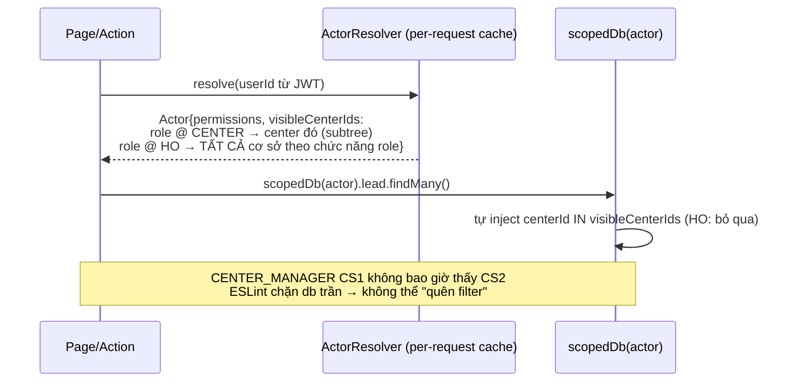

### 4.5 Event-driven nội bộ (Q4)

```prisma
model DomainEvent { id type payloadJson status(PENDING/PROCESSING/DONE/FAILED) attempts lastError createdAt processedAt }
```

**Danh mục event core:** `messenger.conversation.created` · `lead.qualified` · `lead.handed_to_center` · `lead.assigned_to_sale` · `lead.converted` · `invoice.created` · `payment.confirmed` · `parent.account.created` · `student.absent` · `course.completed` · `assignment.submitted` · `media.uploaded` · `marketing.cost_allocation.confirmed`

**Quy tắc phân loại (bắt buộc trong code review):**

| Trong TRANSACTION (atomic) | Qua EVENT (async, idempotent, retry) |
|---|---|
| `lead.converted` → tạo Parent/Student/Relation/Enrollment/Invoice/Payment | Gửi email/OTP activation |
| `payment.confirmed` → cập nhật invoice/debt/revenue | Cập nhật dashboard/funnel stats |
| Trừ kho khi xuất hàng | Alert SLA |
| | Commission stats draft |
| | Đồng bộ external (Ads insights, MISA sau này) |

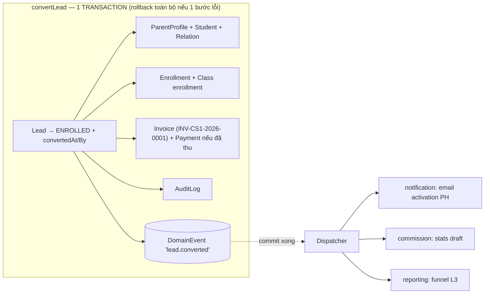

### 4.6 Session & quyền hiệu lực ngay

JWT chỉ còn `{userId, sessionVersion}` → ActorResolver đọc DB per-request (admin layout hiện đã query DB liveness — không tăng số query) → đổi role/quyền **hiệu lực request kế tiếp**, bỏ legacy shim + grants-in-token.

### 4.7 C4 Architecture Views

**Level 1 — System Context:**

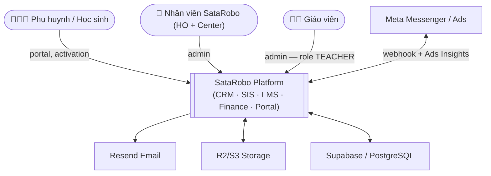

**Level 2 — Container:**

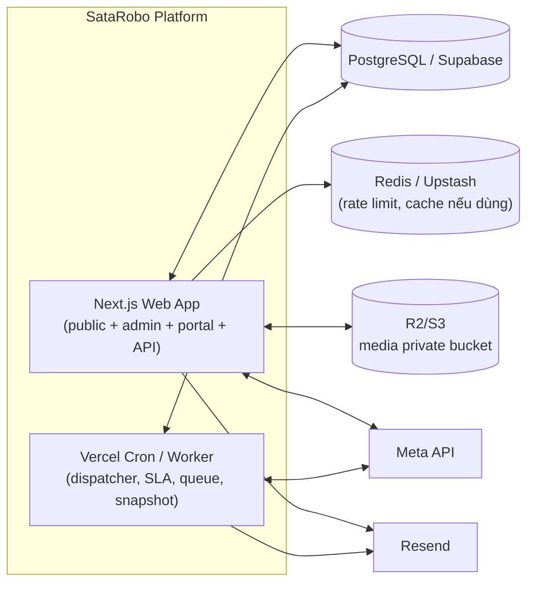

**Level 3 — Component (bên trong Next.js Web App):**

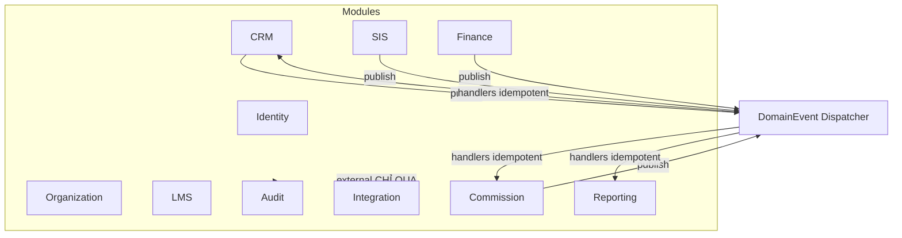

**Deployment View (bổ sung theo missing review điểm 1):**

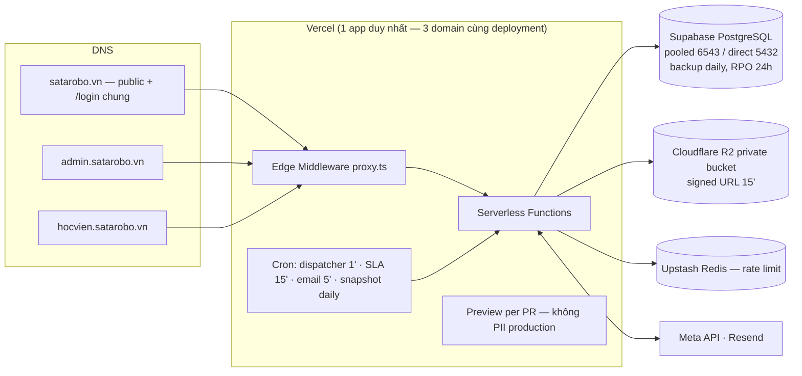

→ Trả lời các câu hỏi onboarding: 3 domain = **cùng 1 Next.js app** (host-routing); Meta/Resend là service NGOÀI đi qua `modules/integration`; R2 chứa media private; PostgreSQL chứa toàn bộ dữ liệu nghiệp vụ.

### 4.8 Bounded Context & Ownership

| Bounded Context | Sở hữu chính | Không được làm |
|---|---|---|
| Identity | User, Session, RoleDef, Permission, UserOrgRole | Không chứa logic học viên/lớp/học phí |
| Organization | OrgUnit, Center, Room, Campus, EmployeeOrgAssignment | Không xử lý doanh thu/lead |
| CRM | Lead, MessengerConversation, Handover, SLA | Không tự insert Student/Invoice trực tiếp |
| SIS | Student, ParentProfile, Enrollment, StudentStatus | Không tính tiền/hoa hồng |
| LMS | Curriculum, Lesson, Assignment, Quiz, Submission | Không quản lý công nợ |
| Attendance | Attendance, MakeupNeed | Không gọi provider notification trực tiếp |
| Finance | Invoice, Payment, Debt, Refund | Không tính commission trực tiếp (đã có Commission Context) |
| Commission | CommissionPeriod, CommissionItem, RateConfig | Không sửa Invoice/Payment |
| Engagement/Notification | Notification, EmailQueue, Media metadata, SataCoin nội bộ | Không chứa business rule CRM/SIS/Finance; không gọi provider ngoài trực tiếp |
| Integration | Meta, Resend, Zalo, MISA, Storage adapter | Không chứa business rule domain |
| Reporting | Report snapshot, dashboard aggregate | Không là source of truth |

**Rule ownership:**
- Module chỉ được **ghi dữ liệu nó sở hữu**; module khác muốn đổi trạng thái phải gọi **public API/application service** của owner module.
- Reporting đọc nhiều nhưng **không ghi ngược** vào source-of-truth.
- Không import private repository/internal service của module khác.

**Ví dụ chuẩn — Lead convert ĐÚNG vs SAI:**

```
✅ ĐÚNG: CRM lead.converted → application service mở TRANSACTION
         → gọi SIS public API tạo Student/Parent/Enrollment
         → gọi Finance public API tạo Invoice/Payment
         → AuditLog → DomainEvent 'lead.converted' (notify/stats đi sau commit)

❌ SAI:   CRM repository tự INSERT Student
          CRM repository tự INSERT Invoice
          CRM gọi Resend trực tiếp (phải qua modules/integration)
```

### 4.9 Aggregate Root & Transaction Boundary

| Use case | Aggregate root / App transaction | Transaction boundary |
|---|---|---|
| Convert lead to enrollment | LeadConversion | Lead + Parent + Student + Enrollment + Invoice + Payment (nếu có) + AuditLog + DomainEvent |
| Confirm payment | Invoice/Payment | Invoice + Payment + Debt + AuditLog + DomainEvent |
| Create class session | Class | ClassSession + ScheduleConflictCheck |
| Mark attendance | ClassSession | Attendance + MakeupNeed (nếu vắng) |
| Upload session media | ClassSessionMedia | Media + MediaStudentTag + Consent check |
| Confirm commission period | CommissionPeriod | Period + Items + AuditLog |
| Confirm cost allocation | CostAllocationPeriod | Period + Lines + AuditLog |

**Rule:** dữ liệu tiền/học viên/enrollment phải trong transaction · notification/report/external sync đi event **sau commit** · event handler phải **idempotent**.

### 4.10 Architecture Governance & CI Enforcement

```
✗ app/** import db trực tiếp                → chỉ gọi public API/application service của module
✗ modules/A import repository/internal B    → chỉ import public API modules/B
✗ modules/* gọi external provider trực tiếp → CHỈ modules/integration được gọi
✗ Reporting ghi ngược source-of-truth
```

Tool: `eslint-plugin-boundaries` · `dependency-cruiser` · `no-restricted-imports` (mở rộng cơ chế ESLint UI-split đã có).
CI: `pnpm lint` · `pnpm lint:boundaries` · `pnpm depcruise` · `pnpm test:permissions` · `pnpm test:events`.

---

## §5 — CRM TUYỂN SINH (SR217 + Messenger-first)

### 5.1 Phễu & nguồn

```
LEADS_1 = tin nhắn/tương tác vào Page Messenger (kênh chính: Messenger Ads Page HO)
LEADS_2 = có SĐT + ghi chú → đủ điều kiện bàn giao trung tâm
LEADS_3 = đã đóng học phí = doanh số thực tế = cơ sở hoa hồng
Nguồn phụ: Google Form · landing · web form · import · PH giới thiệu · đối tác/sự kiện · data cũ
```

### 5.2 Model Messenger (thay `PageInboundEvent` bản cũ)

```prisma
model FacebookPageMapping { pageId scopeType(HO|CENTER) centerId? }   // Page HO nay; Page CS1/CS2 sau
model MessengerConversation { pageId psid parentName? phone? status firstMessageAt respondedAt leadId? }
model MessengerMessage { conversationId direction(IN|OUT) text attachments sentAt }
```

### 5.3 Workflow & state machine handover

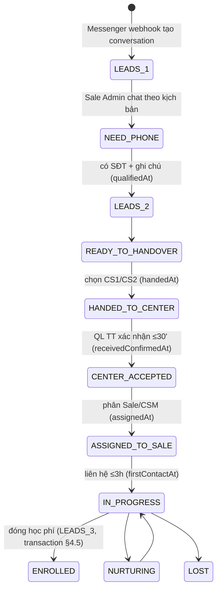

**Mapping với `LeadStatus` enum hiện có (13 giá trị — KHÔNG đập):** trạng thái handover mới = **derive từ timestamps** (`qualifiedAt/handedAt/receivedConfirmedAt/assignedAt/firstContactAt/convertedAt`) + LeadStatus hiện hữu (NEW→ASSIGNED→CONTACTED→…→ENROLLED). `MessengerConversation` trước khi có SĐT **chưa phải Lead record** — L1 sống ở bảng conversation.

### 5.4 SLA chốt (bảng cuối — thay mọi con số cũ)

| Rule | Ngưỡng | Alert tới |
|---|---|---|
| SLA-0 Sale Admin phản hồi Messenger | mục tiêu **≤ 5 phút** (đo `respondedAt`) | HO_SALE |
| SLA-1 L2 bàn giao TT | trong ngày, không qua đêm (**alert > 4h**) | HO_SALE + CENTER_MANAGER |
| SLA-2 QL TT xác nhận + phân Sale | **≤ 30 phút** | CENTER_MANAGER |
| SLA-3 Sale liên hệ sau khi giao | **≤ 3 giờ** | CENTER_MANAGER (+Sale) |
| SLA-4 Lead không cập nhật trạng thái | **> 2 ngày** → cảnh báo | CENTER_MANAGER |
| SLA-5 Báo cáo tuần/tháng | T2 ≤17h / ngày 01 ≤17h | QL TT + SUPER_ADMIN (TGĐ — NC-2, không còn HO_MANAGER) |
| SLA-6 Chốt phân bổ CP | trước ngày 05 | HO_ACCOUNTANT |

Kịch bản Sale Admin chuẩn (xin SĐT + lớp/tuổi + chọn CS1/CS2/cần tư vấn) — lưu trong tài liệu vận hành, hệ thống hỗ trợ quick-reply.

### 5.5 Chart data — luồng số liệu CRM/Marketing

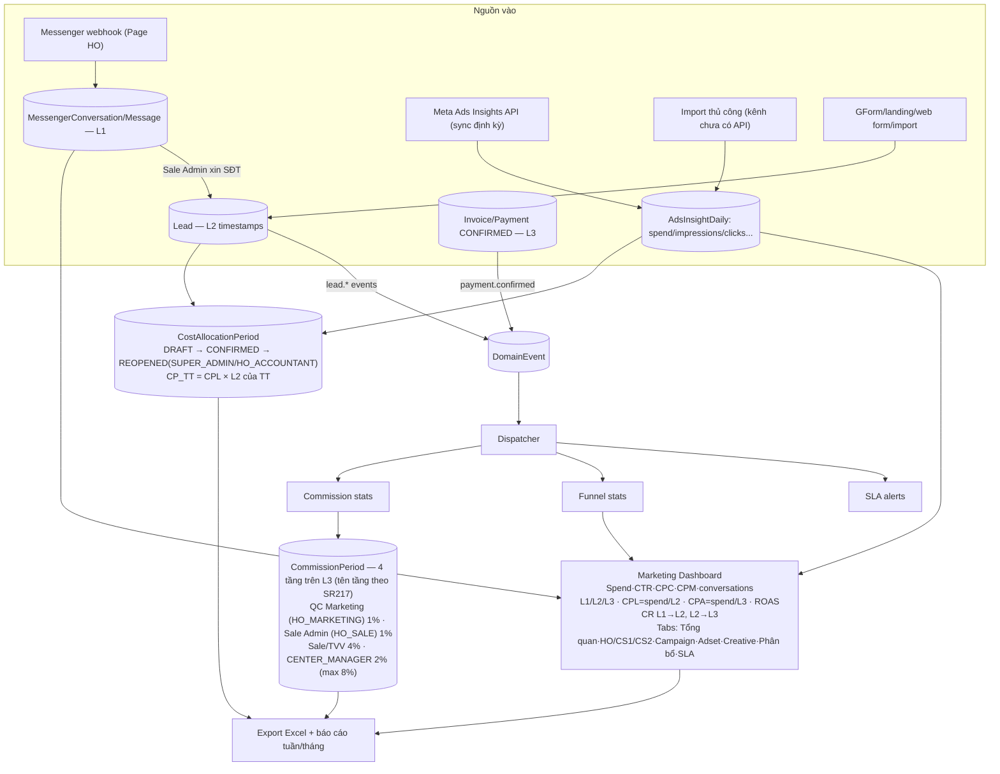

---

## §6 — SIS / FINANCE / LMS OFFLINE (tóm tắt chốt + delta với schema hiện tại)

### 6.1 Lead → Enrollment + Parent activation

- Transaction bắt buộc §4.5. Invoice code: `INV-{CENTER}-{YEAR}-{SEQ}` (dùng `Counter` hiện có). **Quyết định kỹ thuật: Invoice = mở rộng model `Order` hiện hữu** (đổi code format + ngữ nghĩa hiển thị) — không tạo model song song.
- Parent account: `PENDING_ACTIVATION` → email Resend → parent tự đặt mật khẩu (KHÔNG mật khẩu mặc định). OTP provider abstraction (`EMAIL` nay, `SMS/ZALO` cắm sau — model `OtpRequest` hiện có giữ).
- Duplicate phone: giữ dedup 90 ngày + UX hiển thị cho Sale.

### 6.2 Khóa học & gợi ý

Sata 1–8 + Combo 1&2 (model `Course/CoursePackage` hiện có). Gợi ý khóa tiếp: **rule-based `nextCourseId`** (Sata 3→4→…→8) — đã có nền `CoursePrerequisite/CourseCompletion.nextCourseId`. Online → link Sataworld.

### 6.3 LMS offline = vận hành đào tạo (không phải video LMS)

Chuỗi: Khóa → Giáo trình (**version, mỗi lớp gắn 1 curriculum version** — lớp cũ không bị ảnh hưởng khi đổi giáo trình) → Bài học → Lớp → Buổi → Điểm danh → Nhận xét → Media → Bài tập → Nộp → Chấm → Đánh giá năng lực → Báo cáo PH → CSM tái tục. Phần lớn model đã có (`Curriculum/Lesson/Class/ClassSession/...`).

**Delta cần làm so với schema hiện tại:**

| Hạng mục | Hiện tại | Chốt mới | Việc |
|---|---|---|---|
| ClassSession lesson | `lessonId` | `plannedLessonId` + `actualLessonId` (dạy lệch kế hoạch) | thêm cột, 2-phase |
| AttendanceStatus | PRESENT/ABSENT/LATE/EXCUSED | PRESENT/LATE/**ABSENT_EXCUSED/ABSENT_UNEXCUSED** | enum migration 2-phase (map ABSENT+EXCUSED) |
| Attendance rate | chưa chuẩn hóa | `presentCount=(PRESENT+LATE)/totalSessions COMPLETED` — Attendance là source of truth | helper + report |
| Teacher checklist sau buổi | checklist ck* rời | Điểm danh → xác nhận bài dạy → nhận xét → media+tag → giao bài → sự cố → **Hoàn tất buổi** | flow UI + trạng thái buổi |
| Assignment types | text/file | `IMAGE_UPLOAD/VIDEO_UPLOAD/FILE_UPLOAD/QUIZ/TEXT_ANSWER/PROJECT_SUBMISSION` + giao cho lớp/nhóm/cá nhân | mở rộng enum + targeting |
| Media | tag tùy chọn | **BẮT BUỘC tag**; PH chỉ xem media tag con; không tag = không hiển thị; duyệt + audit | enforce + consent |
| Consent | chưa có | `StudentConsent(type=CLASS_MEDIA, GRANTED/REVOKED, byParent)` — chưa consent thì lưu nội bộ, không public | model mới |
| Học bù | MakeupNeed có | + PH gửi yêu cầu bù, tìm buổi theo lesson/progress, **không học bù vượt tiến độ** | rule trong service |
| Giấy tờ tùy thân | — | **KHÔNG thu/lưu** (CMND/CCCD/khai sinh) — chỉ ảnh học viên + media lớp | policy |

### 6.4 Finance core

`Invoice(Order) · Payment · Debt · Refund · Tuition config · Revenue report · Cost allocation · Commission base`. Thanh toán: ghi nhận thủ công + kế toán xác nhận + Excel (Q14). Mọi mutation tiền → transaction + AuditLog.

### 6.5 HR (Phase R5 — nhân viên, KHÔNG học sinh)

QR động **30 giây + grace 5–10s**, GPS/geofence tại cơ sở, check-in/out, cảnh báo thiếu giờ, duyệt công (nền `EmployeeCheckin/Shift*` đã có).

---

## §7 — USE CASE DIAGRAMS (đích)

### 7.1 Hội sở

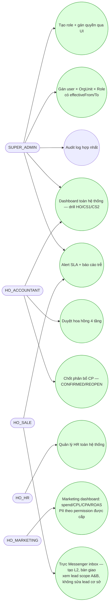

### 7.2 Trung tâm

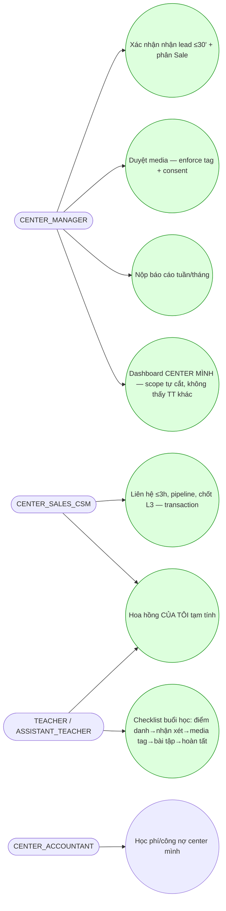

### 7.3 Phụ huynh / Học sinh (portal)

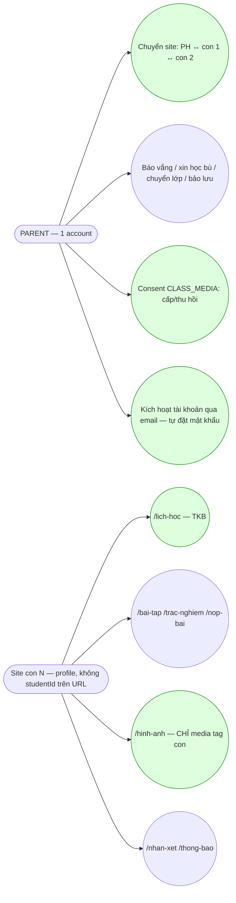

### 7.4 Hệ thống tự động

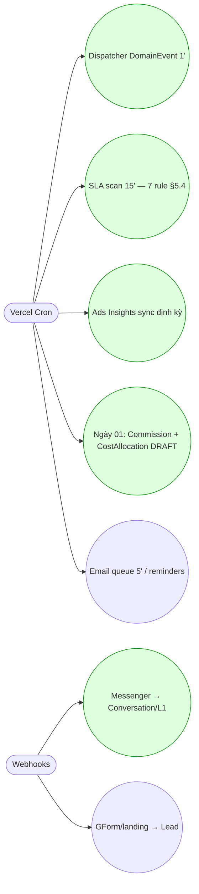

---

## §8 — AUDIT, BẢO MẬT & PII

**AuditLog hợp nhất:** `actorId · module · entityType · entityId · action · oldValues · newValues · orgUnitId · ip · userAgent · createdAt`.

**Bắt buộc audit:** lead (create/status/assign/handover/convert) · role/permission grant-revoke · student (create/update/transfer) · class (create/update/đổi GV) · invoice/payment/refund · parent activation · media (upload/duyệt/xóa) · attendance edit · cost allocation confirm · commission confirm.

**PII rules (enforce bằng scope + field visibility):**
```
TEACHER không mặc định xem SĐT phụ huynh · HO_MARKETING: PII theo permission admin cấp (phương án D — OI-4,
không mặc định xem đầy đủ; PII = SĐT, email, tên phụ huynh, tên học sinh, lịch sử tư vấn)
PARENT chỉ xem con mình · media chỉ hiển thị nếu tag đúng con · không expose studentId trên route
KHÔNG lưu giấy tờ tùy thân học viên · KHÔNG sinh trắc học/định vị học sinh
```

### 8.1 AuditLog Policy & Scaling

- AuditLog **không được sửa/xóa qua UI**; không lưu plain sensitive data nếu không cần.
- SĐT/email trong `oldValues/newValues` phải **mask khi hiển thị** nếu role không đủ quyền.
- SUPER_ADMIN/role audit được xem audit đầy đủ; **Center chỉ xem audit trong scope center** mình.
- **Export audit phải có `reason` và hành động export phải được audit lại** (có thể bổ sung `AuditExportLog` phase sau).
- Scaling: partition theo tháng/quý, giữ "nóng" 12–18 tháng (chi tiết §14.2).

### 8.2 Data Classification & Security Operation

| Level | Dữ liệu |
|---|---|
| Public | Nội dung website, khóa học public |
| Internal | Lớp, lịch học, báo cáo tổng hợp |
| Confidential | SĐT/email phụ huynh, học phí, invoice |
| Restricted | Quyền user, audit log, payment, token provider |

**Rule (OI-13/OI-14 đã chốt):**
- Restricted data **không export Excel** nếu role không đủ quyền.
- Export nhạy cảm có **watermark/metadata**: `exportedBy, userId, exportedAt, orgUnit/scope, reason`.
- File thường hết hạn **7 ngày**; file PII/tài chính/audit hết hạn **1–3 ngày** (mặc định 3 ngày).
- Secret nằm trong env/provider, không commit. Webhook secret phải **verify signature**.
- Staff session **24 giờ** · Parent session **30 ngày** + thao tác nhạy cảm cần OTP/xác thực lại.

**Security ops định kỳ (bổ sung theo missing review điểm 11):**
- **Secret rotation:** webhook secret / API token xoay theo lịch (tối thiểu 6 tháng hoặc ngay khi nghi lộ) — runbook §13.4.
- **Access review:** rà soát UserOrgRole + grant mỗi quý (SUPER_ADMIN, có biên bản); thu hồi role hết nhu cầu.
- **Password policy:** tối thiểu 8 ký tự (bcrypt), khuyến nghị 12+ cho staff; không mật khẩu mặc định (OI-25).
- **Rate limiting policy:** public endpoints (lead form 5/phút/IP đã có) + bổ sung `/login` chống brute-force.
- **Data deletion/retention:** soft-delete mặc định; retention theo §13.2; yêu cầu xóa dữ liệu của phụ huynh → quy trình có duyệt + audit.
- **Incident response:** phát hiện (alert §13.4) → cô lập (revoke session/rotate secret) → khắc phục → biên bản + thông báo bên liên quan nếu lộ PII.

### 8.3 File/Media Governance (OI-15 đã chốt)

- Ảnh: jpg/png/webp, max **10MB** · Video: mp4/mov, max **200MB** · thumbnail tạo tự động.
- **Private bucket** R2/S3; truy cập qua **signed URL hết hạn 15 phút**; object key **không chứa tên học sinh**.
- Virus scan để phase sau — MVP **phải** giới hạn MIME type/size.
- Media bị **revoke consent** → không hiển thị portal.

---

## §9 — ROADMAP CUỐI + PR SEQUENCING

```mermaid
gantt
    dateFormat YYYY-MM-DD
    title Lộ trình core (mốc tương đối — bắt đầu sau khi chốt Open Items)
    section A0 Foundation
    A0.1 OrgUnit + RoleDef/UserOrgRole + can() v2 song song :a1, 2026-06-09, 5d
    A0.2 Session gọn + ActorResolver + login chung           :a2, after a1, 4d
    A0.3 scopedDb + ESLint boundary                          :a3, after a2, 4d
    A0.4 DomainEvent outbox + dispatcher                     :a4, after a3, 4d
    A0.5 Module skeleton + AuditLog hợp nhất + UI roles      :a5, after a4, 3d
    section R1 CRM Messenger + Marketing
    R1.1 Messenger webhook + Inbox CRM                       :r1, after a5, 6d
    R1.2 Ads Insights sync + AdsInsightDaily                 :r2, after r1, 4d
    R1.3 L1→L2 + Handover HO→CS1/CS2                         :r3, after r2, 4d
    R1.4 SLA engine (7 rule)                                 :r4, after r3, 4d
    R1.5 Marketing dashboard                                 :r5, after r4, 5d
    R1.6 Cost allocation                                     :r6, after r5, 4d
    R1.7 Commission engine 4 tầng                            :r7, after r6, 6d
    R1.8 Export Excel + báo cáo tuần/tháng                   :r8, after r7, 4d
    section R2 SIS + Finance
    R2 Convert transaction · activation · Invoice/Payment/Debt · dedup UX :r9, after r8, 12d
    section R3 LMS offline
    R3 Curriculum version · Session · Attendance · checklist · Media+consent · Assignment/Quiz :r10, after r9, 14d
    section R4 Portal
    R4 Site PH + site con · route đẹp · lịch/bài tập/media/yêu cầu :r11, after r10, 10d
    section R5 HR
    R5 QR 30s + geofence NV + duyệt công                     :r12, after r11, 8d
```

### PR sequencing (giao việc trực tiếp)

| Nhóm | PR |
|---|---|
| **A0** | 8 PR — xem bảng chi tiết "A0 PR breakdown" ngay dưới (cập nhật 2026-06-06) |
| **R1 CRM** | PR-R1-01 FacebookPageMapping + MessengerConversation/Message · 02 `/api/webhooks/meta/messenger` · 03 `/admin/crm/messenger` inbox · 04 L1→L2 conversion · 05 Handover HO→Center · 06 SLA alerts · 07 Ads Insights sync · 08 Marketing dashboard · 09 Cost allocation · 10 Commission engine |

#### A0 PR breakdown (chốt 2026-06-06)

| PR | Nội dung | Yêu cầu chốt |
|---|---|---|
| **PR-A0-01** OrgUnit schema | Model `OrgUnit`; type ROOT/HO/CENTER/CAMPUS/PARTNER/FRANCHISE; **seed ROOT/HO/CS1/CS2** | HO và CS2 **có thể cùng address nhưng khác id/code/type** — HO không thuộc CS2; chưa tạo Location model; tree hỗ trợ trung tâm tương lai; **validate unique code + no parent cycle**; soft delete |
| **PR-A0-02** RoleDef + Permission + UserOrgRole | Dynamic RBAC; UI admin cấp quyền cho role; multi-role/multi-org | `UserOrgRole` có `effectiveFrom/effectiveTo/status`; conflict: **ALLOW thắng nếu ≥1 role cho phép**; HO role cross-center scope theo chức năng được cấp |
| **PR-A0-03** ActorResolver + can() v2 | Load nhiều UserOrgRole; tính permission theo role + scope + orgUnit | HO role áp dụng toàn hệ thống theo function của role; **không dùng DENY override** giai đoạn này |
| **PR-A0-04** scopedDb | Enforce center/org isolation | **CS1 không xem CS2, CS2 không xem CS1**; HO role xem tất cả cơ sở theo chức năng của role |
| **PR-A0-05** Common login + redirect | Cổng login chung `satarobo.vn/login` | Staff → `admin.satarobo.vn` · Parent → `hocvien.satarobo.vn` |
| **PR-A0-06** AuditLog | Unified audit log | Log role/org/permission changes; **export audit phải audit lại** (§8.1) |
| **PR-A0-07** DomainEvent outbox | Event outbox + dispatcher | Retry + idempotency |
| **PR-A0-08** EmployeeOrgAssignment foundation | Model nhân sự/kiêm nhiệm | `effectiveFrom/effectiveTo/status`; `assignmentType` PRIMARY/SECONDARY/SUPPORT/SUBSTITUTE/SHARED; `allocationPercent`; **không tự động cấp quyền** |

> Module skeleton + lint boundary (governance §4.10) thiết lập song song trong chuỗi PR trên — bắt đầu từ PR-A0-01.
| **R2 SIS/Fin** | PR-SIS-01 Parent/Student/Relation cleanup · 02 convertLeadToEnrollment transaction · 03 Invoice/Payment auto-create · 04 Parent activation Resend · 05 Duplicate phone UX · 06 Transfer rules |
| **R3 LMS** | PR-LMS-01 Curriculum/Lesson version · 02 Class/Session/Progress · 03 Attendance summary · 04 Teacher checklist · 05 Media + tag + consent · 06 Assignment/Submission · 07 Quiz |
| **R4 Portal** | PR-PORTAL-01 route shell + active profile · 02 parent site · 03 child site · 04 requests (vắng/bù/chuyển/bảo lưu) |

### Chiến lược an toàn (hệ thống live)

1. **Additive trước, destructive sau** — `User.role/centerId` + matrix cũ giữ làm fallback; drop ở Phase C sau 2–3 tuần prod ổn.
2. `can()` v2 **chạy song song so khớp log** 1 tuần trước khi cắt.
3. **Boy-scout** di code vào `modules/` khi chạm — không mass-move.
4. Mỗi PR: `pnpm typecheck && lint && build && test` xanh (workflow push-main Phase A hiện hành — "PR" = chuỗi commit theo nhóm).
5. Rollback flags: can() fallback, dispatcher tắt được, scopedDb bypass cho hotfix.

---

## §10 — DEFINITION OF DONE

### DoD A0
1. Tạo role mới qua UI, dùng ngay — 0 deploy. 2. HO_ACCOUNTANT thấy toàn hệ thống; CENTER_ACCOUNTANT CS1 chỉ CS1 (test). 3. scopedDb chặn query thiếu filter (test). 4. Thêm consumer event = 1 dòng đăng ký. 5. Đổi quyền hiệu lực request kế tiếp. 6. Login chung redirect đúng 2 nhánh + route-policy tests xanh.

### DoD toàn dự án core (18 điểm)
1. HO/CS1/CS2 = OrgUnit, scope chạy đúng. 2. Login chung redirect đúng admin/hocvien. 3. Messenger Page HO tự tạo LEADS_1. 4. Sale Admin chuyển L1→L2 (SĐT + ghi chú). 5. L2 bàn giao CS1/CS2 theo SLA. 6. Chốt L3 = transaction tạo Student/Parent/Enrollment/Invoice/Payment. 7. Parent activation không mật khẩu mặc định. 8. Marketing dashboard: spend, L1/L2/L3, CPL, CPA, ROAS. 9. Cost allocation theo L2 hoạt động. 10. Commission 4 tầng tính từ L3. 11. LMS offline đủ chuỗi khóa→giáo trình→lớp→buổi→điểm danh→bài tập→media. 12. Portal có site PH + site từng con, không lộ studentId. 13. PH chỉ xem ảnh/video của con. 14. Không lưu giấy tờ tùy thân. 15. Không có AI camera/sinh trắc/định vị học sinh. 16. Audit phủ nghiệp vụ nhạy cảm. 17. CENTER_MANAGER CS1 không xem được CS2 và ngược lại. 18. SUPER_ADMIN/HO xem toàn hệ thống theo quyền.

---

## §11 — OPEN ITEMS — ĐÃ CHỐT TRƯỚC KHI CODE A0

> Chốt ngày 2026-06-06 (quyết định Owner — bản mở rộng 26 mục, thay bảng 11 mục trước đó). Đây là nguồn đúng nhất — khi xung đột với tài liệu cũ, bảng này thắng.

| # | Vấn đề | Quyết định chốt |
|---|---|---|
| OI-1 | HO là OrgUnit độc lập? | **CÓ.** HO là OrgUnit độc lập dưới ROOT SataRobo, không gộp vào CS2. Hiện tại HO làm việc tại địa điểm 114 Hoàng Diệu, trùng CS2, nhưng không thuộc quản lý của CS2 (CS2 không tự quản lý nhân sự HO nếu người đó chỉ là HO staff). Sau này HO có thể làm ở địa điểm khác hoặc tại các CS khác nên không được gán thẳng HO vào CS2; không thiết kế logic `HO = CS2` hay HO nằm dưới CS2. ROOT là SataRobo; HO, CS1 (211 Nguyễn Hữu Thọ), CS2 (114 Hoàng Diệu) độc lập dưới ROOT. |
| OI-2 | Nhân sự HO có thể kiêm nhiệm trung tâm nào? | HO staff có thể kiêm nhiệm **một hoặc nhiều** trung tâm: CS1, CS2 và các trung tâm mở thêm trong tương lai (CS3, CS4, CS5...). **Không hardcode chỉ HO + CS2** — CS1/CS2 chỉ là seed data ban đầu, không phải giới hạn kiến trúc. |
| OI-3 | Role HO có phạm vi xem/sửa thế nào? | `HO_ACCOUNTANT` xem/sửa toàn hệ thống theo chức năng kế toán; `HO_HR` xem/sửa toàn hệ thống theo chức năng HR; `HO_MARKETING` xem/sửa toàn hệ thống theo chức năng marketing; `HO_SALE` xem được lead theo scope A&B nhưng **không sửa**. **Không có role `HO_MANAGER`** — nếu tài liệu cũ có thì đã xóa/deprecated. |
| OI-4 | HO_MARKETING được xem PII thế nào? | Theo **phương án D: tùy permission admin cấp**. Không mặc định mọi marketing user đều xem đầy đủ PII. PII gồm: số điện thoại, email, tên phụ huynh, tên học sinh, lịch sử tư vấn. |
| OI-5 | HO_SALE lead scope là gì? | Theo **A&B**: (A) xem lead do mình tạo/giao; (B) xem lead từ kênh HO/ads/Messenger. HO_SALE mặc định **xem có, sửa không** — không tự động sửa lead của cơ sở nếu chỉ được cấp quyền xem; nếu cần sửa trong tương lai, admin phải cấp role/permission riêng. |
| OI-6 | Center Manager có quản lý HO staff không? | **Có** nếu HO staff có `EmployeeOrgAssignment` hoặc `UserOrgRole` liên quan đến center đó — và chỉ quản lý phần công việc/assignment thuộc center đó, **không quản lý vai trò HO** của người đó. **Không** quản lý nếu HO staff chỉ ngồi làm việc tại địa điểm center mà không có assignment/role ở center. |
| OI-7 | Permission conflict xử lý thế nào? | **Phương án B: ALLOW thắng nếu có ít nhất một role cho phép** (đúng scope). **Giai đoạn này KHÔNG dùng DENY override** — nếu sau này cần DENY sẽ thiết kế phase sau. |
| OI-8 | UserOrgRole và EmployeeOrgAssignment có hiệu lực thời gian không? | **CÓ (phương án C).** Cả hai đều có `effectiveFrom`, `effectiveTo`, `status` — hỗ trợ kiêm nhiệm tạm thời, dạy thay, hỗ trợ theo giai đoạn, thay đổi role theo thời gian. |
| OI-9 | Assignment type giữ thế nào? | Giữ 5 loại: `PRIMARY` (đơn vị chính) · `SECONDARY` (đơn vị phụ) · `SUPPORT` (hỗ trợ/kiêm nhiệm) · `SUBSTITUTE` (dạy thay/làm thay tạm thời) · `SHARED` (chia sẻ giữa nhiều cơ sở/HO). |
| OI-10 | Lương/chi phí kiêm nhiệm xử lý thế nào? | **Phương án B:** `EmployeeOrgAssignment` có `allocationPercent` để sau này phân bổ lương/chi phí. **A0 chỉ thiết kế dữ liệu sẵn sàng** — công thức tính theo giờ công/buổi dạy/doanh thu để phase sau. |
| OI-11 | OrgUnit type gồm gì? | Giữ đầy đủ (phương án A): `ROOT`, `HO`, `CENTER`, `CAMPUS`, `PARTNER`, `FRANCHISE`. |
| OI-12 | Có tách Location model ngay không? | **Chưa (phương án A).** A0 chỉ để `address` trong OrgUnit, nhưng ghi rõ **không dùng address để suy ra quan hệ quản lý** — HO và CS2 có thể cùng address nhưng khác OrgUnit. Location model riêng có thể tách sau; **không tạo Location model trong PR-A0-01**. |
| OI-13 | Export expiry và watermark? | File thường hết hạn **7 ngày**; file PII/tài chính/audit hết hạn **1–3 ngày** (mặc định cụ thể: 3 ngày nhạy cảm, 7 ngày thường). Export nhạy cảm **phải có watermark/metadata** (`exportedBy, userId, exportedAt, orgUnit/scope, reason` với export nhạy cảm) + audit log. |
| OI-14 | Session policy? | Staff session **24 giờ**. Parent session **30 ngày**, nhưng thao tác nhạy cảm cần **OTP/xác thực lại**. |
| OI-15 | Media policy? | Video upload tối đa **200MB**. Signed URL hết hạn **15 phút**. Virus scan để phase sau — nhưng MVP **phải** giới hạn MIME type, size, dùng **private bucket + signed URL**. |
| OI-16 | Backup/RPO/RTO? | Dùng **Supabase backup**. **RPO: mất tối đa 24h dữ liệu · RTO: khôi phục trong 4–8h**. |
| OI-17 | Feature flag? | **Env flag trước, DB flag sau** (phương án C). A0 ghi strategy, chưa bắt buộc build model `FeatureFlag` DB. Không chặn PR-A0-01. |
| OI-18 | Search strategy? | **Tích hợp search engine riêng** (phương án C) cho lead/student/invoice/messenger khi dữ liệu tăng — nhưng **core vẫn có PostgreSQL search cơ bản** và search engine **không chặn PR-A0-01**. |
| OI-19 | Reporting snapshot? | R1: CRM/Marketing snapshot đơn giản · R2: Finance snapshot · R3: Attendance/LMS snapshot. Dashboard realtime nhỏ query live; dashboard tháng/quý/năm dùng snapshot/pre-aggregate. |
| OI-20 | Webhook replay UI? | **Phương án B:** làm cả `WebhookDelivery` log + UI replay **trước khi Messenger live**. Không chặn A0, nhưng **chặn R1 Messenger production live**. |
| OI-21 | API language và idempotency? | `error.code` tiếng Anh, `message` tiếng Việt, **`requestId` bắt buộc trong error response**. Idempotency **bắt buộc trước** cho webhook + payment/confirm payment; sau đó mở rộng cho convert lead, create invoice, send activation email. Các API quan trọng phải có idempotency strategy. |
| OI-22 | Page HO token + Meta App Review? | **Chưa chặn A0.** Build DB/UI trước, webhook bật sau, nhập tay/import fallback. |
| OI-23 | File Excel mẫu hoa hồng hiện hành? | **Chưa có. Không chặn A0** — chỉ chặn phần Commission ở R1 (R1.7/R1.8). |
| OI-24 | Khóa kỳ phân bổ sau CONFIRMED? | **CÓ.** Chỉ SUPER_ADMIN hoặc HO_ACCOUNTANT được REOPEN. |
| OI-25 | Parent activation? | Dùng email Resend trước, SMS brandname sau. **Không dùng mật khẩu mặc định `123456`.** |
| OI-26 | L3, tái tục, referral, clawback, đổi sale? | Dùng **default theo phương án đề xuất** đã có trong `0-yeucau/1-pm-tiep-nhan/03-cau-hoi-xac-nhan-khach-hang.md` (B1: L3 = Order CONFIRMED đợt 1, doanh số theo tiền thực thu · B2: loại tái tục khỏi 4 tầng · B3: referral = Sale 4% + QL TT 2% · B4: clawback bút toán âm kỳ sau · B5: người chốt cuối hưởng 100% tầng Sale). Nếu thiếu/mâu thuẫn → đánh dấu **NEED_CONFIRMATION**, không tự bịa thêm. |

### NEED_CONFIRMATION (không chặn A0 — cần xác nhận khi chạm tới)

| # | Điểm chưa chắc | Default tạm dùng |
|---|---|---|
| NC-1 | `HO_SALE` "xem có, sửa không" (OI-3/OI-5) vs nghiệp vụ Sale Admin SR217 (trực page, **tạo** LEADS_2, **bàn giao** TT — là thao tác ghi) | Diễn giải: tạo lead/bàn giao lead HO là **chức năng của HO_SALE** (lead "do mình tạo/giao" — scope A); "sửa không" áp dụng cho **lead đã bàn giao về cơ sở**. Xác nhận khi viết spec R1.3 |
| NC-2 | Bỏ `HO_MANAGER` → ai nhận alert SLA-5 (báo cáo tuần/tháng trễ) và xem dashboard toàn hệ thống cấp TGĐ? | Tạm: **SUPER_ADMIN**; nếu TGĐ cần tài khoản riêng không phải SUPER_ADMIN → tạo role mới qua UI và gán permission dashboard/report |
| NC-3 | OI-7 bỏ DENY — nhưng hệ thống đang chạy có `UserPermissionGrant DENY` (Sprint 5.3, có UI + data thật) | Khi cắt sang can() v2: DENY hiện hữu **vô hiệu** — phải rà soát data grant DENY trước khi cắt chuyển (liệt kê + thay bằng thu hồi role/ALLOW phù hợp) |
| NC-4 | `CENTER_SUPPORT` (ví dụ kiêm nhiệm trong quyết định Owner) chưa có trong seed §2.3 | Không seed sẵn — tạo qua UI `/admin/roles` khi cần (đúng tinh thần role động) |
| NC-5 | OI-11 bỏ `REGION` khỏi OrgUnit type (bản trước có) | Theo OI-11: enum không có REGION; nếu sau này cần cấp vùng → thêm enum value mới (tree không đổi, không phá kiến trúc) |
| NC-6 | Search engine cụ thể chưa chốt (Meilisearch / Typesense / OpenSearch — §13.3) | Quyết định ở implementation phase của search; core dùng PostgreSQL search fallback — không chặn A0 |
| ~~NC-7~~ | ~~File missing review không có trong repo~~ | ✅ **ĐÃ ĐÓNG (2026-06-07):** file đã bổ sung tại `0-yeucau/4-inputnew/`; đối chiếu đầy đủ 20 điểm → 4 gap nhỏ đã vá (Deployment view §4.7, ví dụ đúng/sai + SataCoin §4.8, partition monthly §13.2, security ops §8.2); 3 điểm review sai bị bác (HO_MANAGER, idempotency mở rộng ngay, đánh số section). Chi tiết: `0-yeucau/4-inputnew/00-danh-gia-review-va-cai-thien-moi-vs-cu.md` |

---

## §12 — BẢNG TRƯỚC/SAU (điều hành)

| Tiêu chí | TRƯỚC | SAU |
|---|---|---|
| Thêm role | Migration + code + deploy | UI, vài phút, audit |
| Hội sở | Không biểu diễn được | OrgUnit độc lập dưới ROOT; HO role cross-center theo chức năng |
| Kiêm nhiệm HO + một/nhiều trung tâm / dạy thay | Không mô hình hóa | UserOrgRole (quyền) + EmployeeOrgAssignment (nhân sự — không tự sinh quyền) |
| Lộ dữ liệu chéo TT | Phụ thuộc dev nhớ filter | scopedDb enforced + test |
| Login | Riêng từng host | Cổng chung tự redirect |
| Lead Messenger | Không có | Inbox CRM + L1 realtime + SLA 5' |
| Marketing ROI | Không đo được | Dashboard spend/CPL/CPA/ROAS + cost allocation |
| Hoa hồng | Tính tay Excel | Engine 4 tầng + duyệt + audit |
| Thêm consumer nghiệp vụ | Mổ action gốc | 1 dòng đăng ký handler |
| Thêm module/model | Schema 4000 dòng + god-files | Module template + multi-file schema |
| Đổi quyền hiệu lực | Bump token/re-login | Ngay request kế tiếp |
| Privacy trẻ em | Chưa có consent ảnh | Tag bắt buộc + consent + không sinh trắc/định vị |
| Franchise/SaaS sau này | Viết lại | OrgUnit subtree = 80% nền |

---

## §13 — VẬN HÀNH & PRODUCTION READINESS

### 13.1 Feature Flag & Rollout Strategy (OI-17)

- **Phase đầu: env flag** → sau đó DB FeatureFlag. Rollout theo: environment → orgUnit → user → percentage (vd: **bật CS1 trước → CS2 → toàn hệ thống**).
- Model khái niệm (phase sau): `FeatureFlag {key, description, enabled, rolloutType: GLOBAL/ORG_UNIT/USER/PERCENTAGE, configJson}` + `FeatureFlagAssignment {flagId, orgUnitId?, userId?, enabled}`.
- Flag đề xuất: `rbac_v2_enabled` · `scoped_db_enforced` · `messenger_inbox_enabled` · `commission_v2_enabled` · `portal_child_profile_enabled`.
- ⚠️ **Không dùng feature flag để bypass security trong production** nếu không có SUPER_ADMIN approval.

### 13.2 Database Scaling & Data Lifecycle

**Bảng nguy cơ lớn:** AuditLog · DomainEvent · MessengerMessage · EmailQueue · Notification · Attendance · ClassSessionMedia · MediaStudentTag · Payment/Audit finance.

| Policy | Chi tiết |
|---|---|
| AuditLog | Partition theo tháng/quý, giữ nóng **12–18 tháng** |
| DomainEvent | DONE archive/xóa sau **90–180 ngày** |
| MessengerMessage | Giữ nóng **12 tháng**, archive tin cũ |
| Media | File ở R2/S3 — DB **chỉ lưu metadata** |
| Report snapshot | Precompute theo ngày/tháng |
| Notification/EmailLog | Archive sau **6–12 tháng** |
| Attendance | Giữ lâu, index theo student/class/date |

**Partition đề xuất (khi volume tăng — không bắt buộc A0):** `AuditLog`, `DomainEvent`, `MessengerMessage` partition by `createdAt` **monthly**.

**Index baseline:** `Lead(orgUnitId, status, createdAt)` · `Lead(assignedSaleId, status, nextActionAt)` · `Lead(phone)` · `Student(orgUnitId, fullName)` · `Enrollment(studentId, status)` · `Invoice(orgUnitId, status, dueDate)` · `Payment(invoiceId, paidAt)` · `Attendance(classSessionId, studentId)` · `AuditLog(entityType, entityId, createdAt)` · `DomainEvent(status, createdAt, type)`.

### 13.3 Search Strategy (OI-18)

- Đã chốt: **tích hợp search engine riêng** — nhưng **không chặn PR-A0-01**; core vẫn có **PostgreSQL search cơ bản làm fallback**.
- **Core phase:** ILIKE cho dữ liệu nhỏ · chuẩn hóa số điện thoại · unaccent/full-text cho tên · trigram index nếu cần.
- **Engine:** Meilisearch/Typesense/OpenSearch — **NEED_CONFIRMATION (NC-6)** chọn engine cụ thể ở implementation phase.
- **Search objects:** Lead (phone, parentName, childName, source, status) · Student (name, parent phone, center/orgUnit, class) · Invoice (invoiceCode, parent phone, status) · Messenger (sender name, phone, conversation status).

### 13.4 Observability, SLO & Runbook

**Metrics bắt buộc:** `domain_event_pending_count` · `domain_event_failed_count` · `messenger_webhook_failed_count` · `email_queue_pending_count` · `login_failed_count` · `permission_denied_count` · `slow_query_count` · `cron_last_success_at`.

| SLO | Mục tiêu |
|---|---|
| Login availability | 99.5%/tháng |
| Messenger webhook processing | 99% success |
| DomainEvent dispatcher | 95% event xử lý < 5 phút |
| Email activation | 95% gửi < 2 phút |
| Admin page | p95 < 1.5s |
| Portal page | p95 < 2s |
| DB backup | daily + **restore test monthly** |

**Runbook tối thiểu:** DB restore · rollback migration · disable dispatcher · replay failed events · rotate webhook secret · revoke compromised user session.

### 13.5 API Contract & Error Model (OI-21)

```jsonc
// Success
{ "ok": true, "data": {}, "meta": {} }
// Error
{ "ok": false, "error": {
    "code": "VALIDATION_ERROR",      // tiếng Anh
    "message": "Thông báo lỗi dễ hiểu bằng tiếng Việt.",
    "field": "fieldName",
    "requestId": "req_xxx"           // BẮT BUỘC
}}
```

Error code nhóm: `AUTH_REQUIRED` · `PERMISSION_DENIED` · `VALIDATION_ERROR` · `NOT_FOUND` · `CONFLICT` · `RATE_LIMITED` · `EXTERNAL_PROVIDER_FAILED` · `BUSINESS_RULE_VIOLATION`.
**Idempotency:** bắt buộc trước cho **process webhook + confirm payment** → mở rộng convert lead, create invoice, send activation email. API quan trọng phải khai báo idempotency strategy.

### 13.6 Webhook Reliability Plan (OI-20)

Model khái niệm `WebhookDelivery {id, provider, externalEventId, payloadHash, status, attempts, receivedAt, processedAt, lastError}`.
Rule: webhook **idempotent** — cùng `externalEventId` không tạo trùng MessengerMessage/Lead · payload failed **không được mất** · có **log + UI replay trước khi Messenger live** (không chặn A0, **chặn R1 Messenger production live**).

### 13.7 Reporting Data Model (OI-19)

Snapshot models: `DailyMetricSnapshot` · `FunnelDailyStat` · `RevenueDailyStat` · `AttendanceDailyStat` · `SlaDailyStat` · `MarketingDailyStat`.
Rule: R1 CRM/Marketing snapshot → R2 Finance → R3 Attendance/LMS · dashboard realtime nhỏ query live · dashboard tháng/quý/năm dùng snapshot/pre-aggregate · **export Excel lớn chạy background job**.

### 13.8 Environment & Deployment Strategy

Môi trường: `local · dev · staging · production · preview per PR`.
Rule: migration chạy **staging trước production** · production migration phải **backup trước** · preview **không dùng production PII** · seed data tách dev/staging/prod · cron chỉ bật ở staging/production có kiểm soát · webhook staging dùng app/page riêng nếu có.

### 13.9 Backup, Restore & DR Plan (OI-16)

Provider **Supabase backup** · **RPO 24h · RTO 4–8h** · backup PostgreSQL hằng ngày · **restore test mỗi tháng** · migration rollback plan · staging restore từ backup **đã mask PII** · R2/S3 media cần lifecycle/metadata backup nếu dùng.

### 13.10 Performance Budget

| Hạng mục | Mục tiêu |
|---|---|
| Admin list page | p95 < 1.5s |
| Portal page | p95 < 2s |
| Search lead/student | p95 < 1s với filter chuẩn |
| Export Excel | **async nếu > 5.000 dòng** |
| Dashboard tháng | p95 < 3s (dùng snapshot) |
| Upload media | direct upload / presigned URL |

Rule: không render bảng > 1000 row một lần · list page **bắt buộc pagination** · export lớn đi background job · media upload lớn không đi qua server.

---

## §14 — TESTING STRATEGY & DATA MIGRATION

### 14.1 Test pyramid

| Tầng | Test bắt buộc |
|---|---|
| **Unit** | `can()` · scope resolver · commission formula · cost allocation formula · lead status transition · attendance summary |
| **Integration** | `convertLeadToEnrollment` transaction · `confirmPayment` transaction · DomainEvent dispatcher retry · Messenger webhook verify signature · **scopedDb không leak center** |
| **E2E** | Sale Admin tạo lead · Center nhận lead · Sale chốt lead · Parent login portal · Teacher điểm danh · HO xem dashboard toàn hệ thống theo role · **CS1 không xem CS2 · CS2 không xem CS1** |
| **Migration** | Seed HO/CS1/CS2 · backfill UserOrgRole từ role cũ · permission v1/v2 diff trong giai đoạn chuyển · drop legacy sau khi ổn định |

### 14.2 Data Migration Plan (checklist)

1. Tạo OrgUnit ROOT/HO/CS1/CS2. 2. Map Center hiện tại sang OrgUnit. 3. Tạo RoleDef tương ứng role cũ. 4. Backfill UserOrgRole từ `User.role/User.centerId`. 5. Seed RolePermission từ `permissions.ts`. 6. Chạy **permission diff log 7 ngày** (v1 vs v2). 7. Chuyển JWT/session sang `userId/sessionVersion`. 8. Bật can() v2 bằng feature flag (`rbac_v2_enabled`). 9. Bật scopedDb theo module — **ưu tiên CRM trước**. 10. Drop legacy field sau khi ổn định.

**Rủi ro migration:** user nhiều role map sai · `centerId` null không rõ là HO hay portal · ALLOW conflict → resolve theo rule "≥1 ALLOW hợp lệ thì cho phép" · **JWT cũ còn sống sau khi đổi session shape** (phải invalidate qua sessionVersion).

---

## §15 — COST & CAPACITY PLANNING

| Mức | Quy mô | Kiến trúc |
|---|---|---|
| **S0 MVP** | 2 center, <50 staff, <5k học viên | Vercel + Supabase/Postgres + R2/S3 |
| **S1 Growth** | 5–10 center, ~20k học viên | Supabase/Postgres tier cao hơn, Redis, worker/cron ổn định |
| **S2 Scale** | 20+ center, ~100k học viên | Read replica, partition, search engine, dedicated worker |

Chi phí theo dõi hằng tháng: hosting · database · storage media · email/SMS · Meta API/ads data · logging/monitoring · backup · domain/CDN.

---

## §16 — KẾT LUẬN

```
Modular Monolith
+ Organization Hierarchy HO/CS1/CS2 (OrgUnit tree)
+ Dynamic RBAC/ABAC 6-mức scope + per-user grant
+ Messenger-first CRM theo LEADS_1/2/3 + SLA engine
+ Marketing Ads dashboard + Cost allocation + Commission 4 tầng
+ LMS offline Sata 1–8 (curriculum version, checklist GV, media tag+consent)
+ Finance transaction-safe (Invoice/Payment/Debt)
+ Portal hocvien: site phụ huynh + site từng con, không lộ studentId
+ Login chung satarobo.vn/login
+ Audit hợp nhất + Privacy-first dữ liệu trẻ em
```

KHÔNG đưa lại vào core: AI camera, sinh trắc học, định vị học sinh, Web3/NFT/blockchain, marketplace, student login riêng, ~~teacher domain riêng~~ (đảo 04/07/2026 — phiếu BGĐ câu 7, xem §0 Q10), online video LMS, AI learning path, AI prediction.

> §11 đã CHỐT (2026-06-06) — đủ điều kiện bắt đầu **PR-A0-01: OrgUnit schema + seed ROOT SataRobo + HO/CS1/CS2**.
