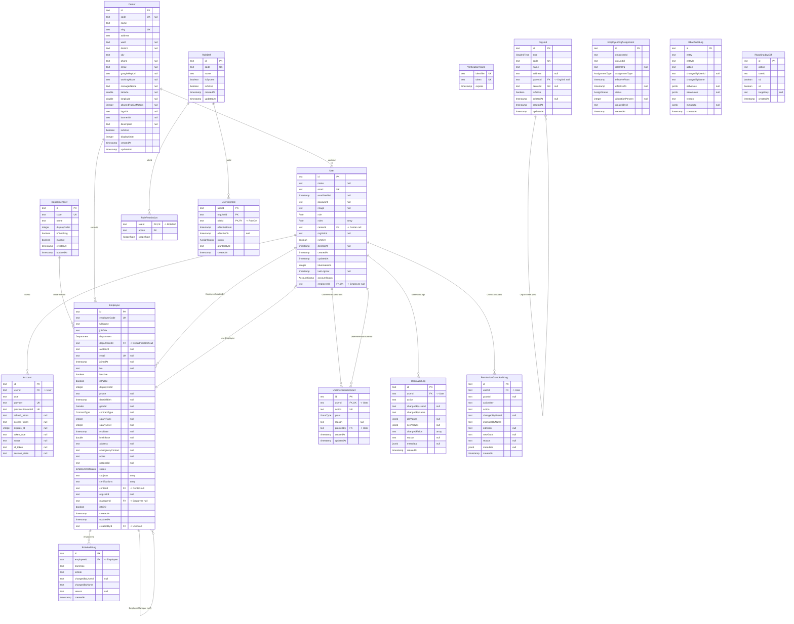
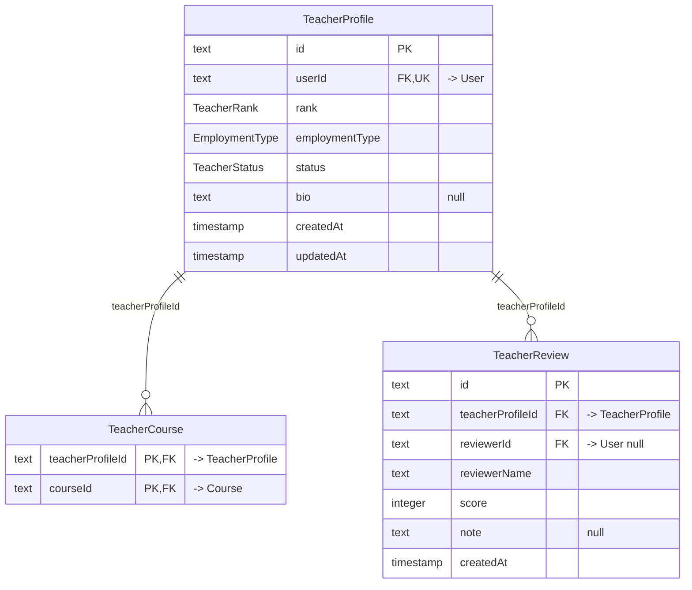
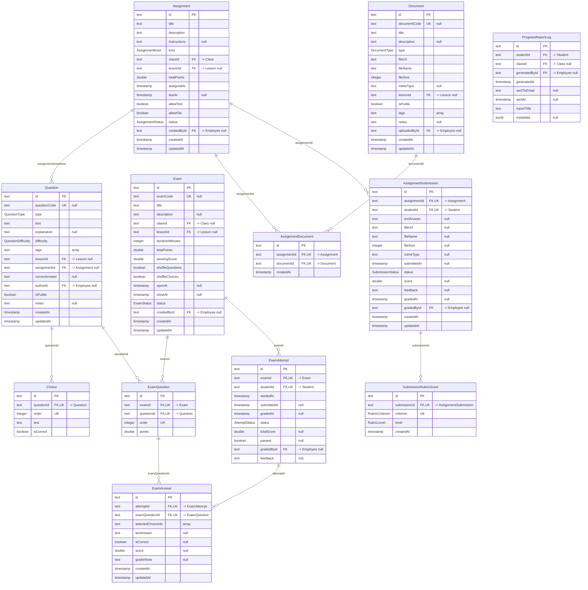
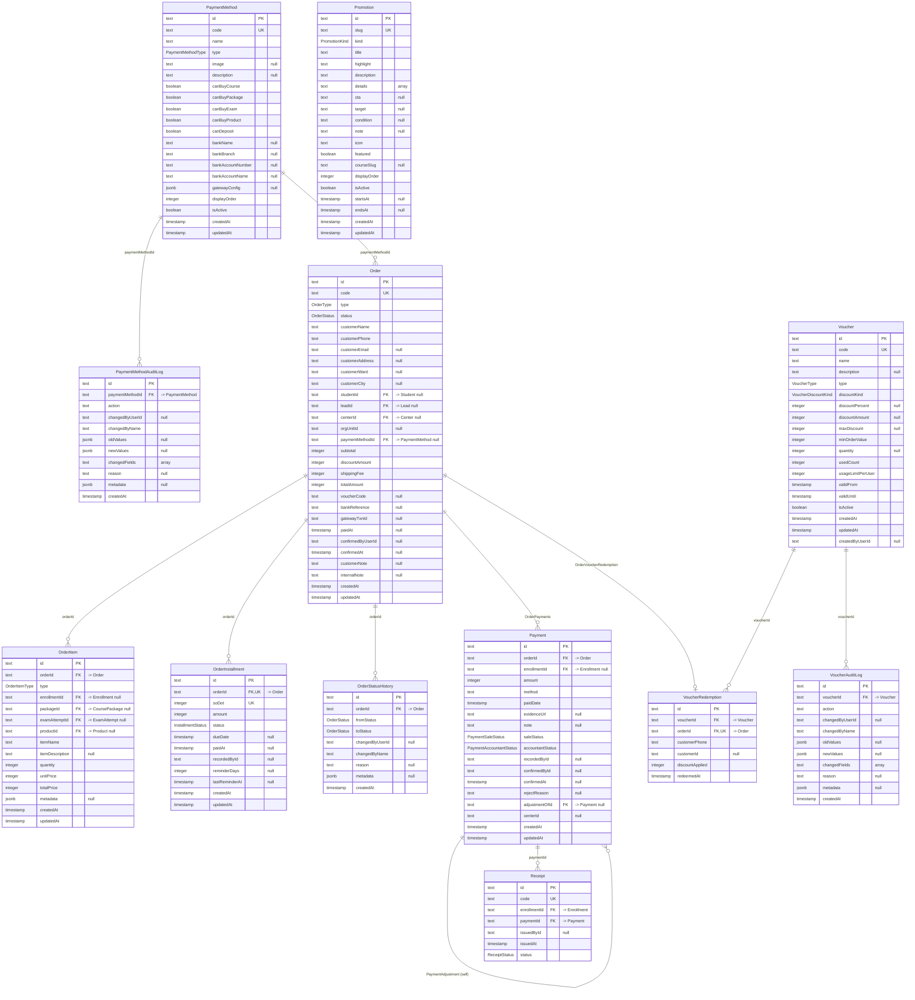
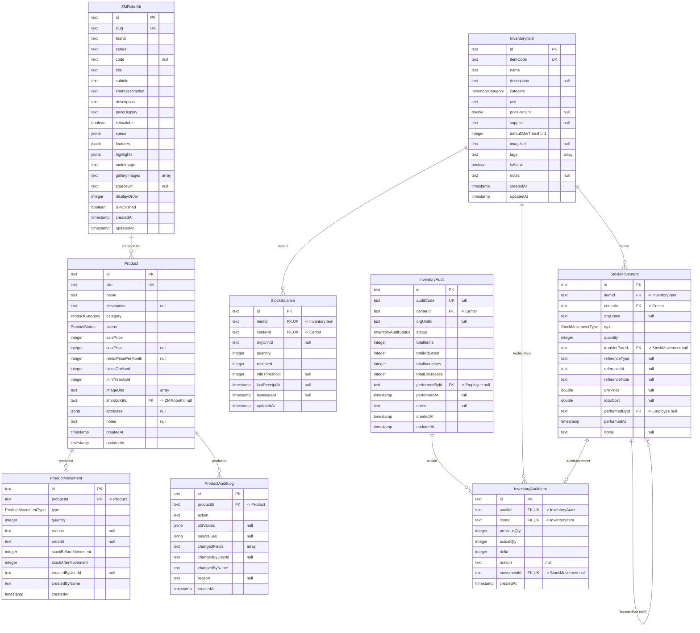
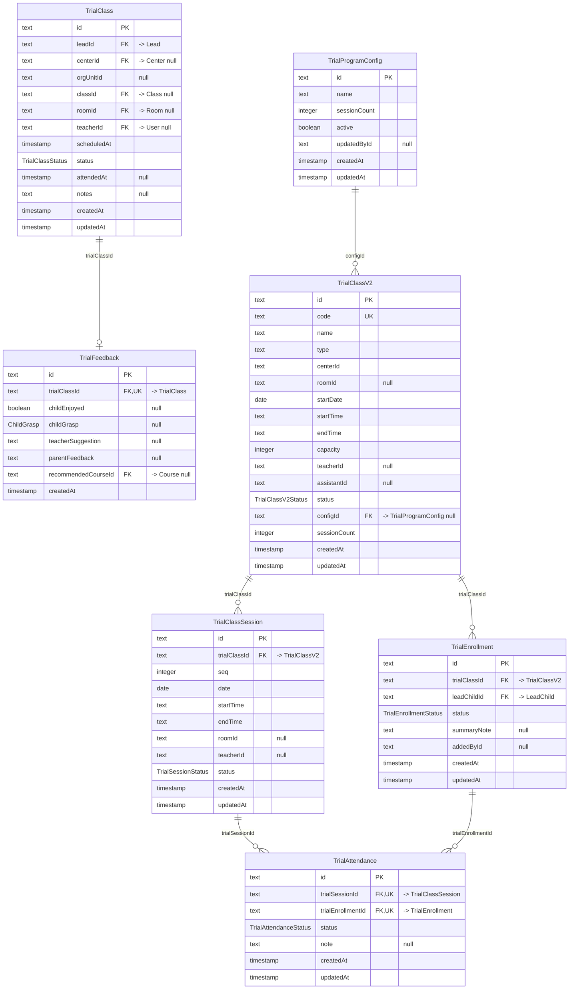

# ERD chuẩn (PostgreSQL) — Sata Robo VN

> Sinh tự động từ `prisma/schema.prisma` bằng `scripts/gen-erd.cjs` (snapshot 2026-06-17).
> 150 bảng, 105 enum. Mỗi cụm là 1 `erDiagram` Mermaid **có đầy đủ cột + kiểu Postgres + PK/FK/UK**.
> Mở bằng VS Code (*Markdown Preview Mermaid Support*) hoặc GitHub để render.
>
> Ký hiệu khóa: **PK** primary key · **FK** foreign key · **UK** unique. Cột FK ghi chú `-> Bảng đích`; `null` = nullable; `array` = mảng Postgres.
> Cardinality: `||--o{` 1—n (con optional) · `||--o|` 1—1 · `(self)` quan hệ tự tham chiếu.
>
> ⚠️ Kiểu `timestamp` ở đây phản ánh **hiện trạng** (Prisma map `DateTime` → `timestamp(3)` KHÔNG timezone vì schema chưa dùng `@db.Timestamptz`). Đây là một lỗi thiết kế — xem [ERD-review.md](./ERD-review.md) mục [5]. Đích cần đạt là `timestamptz`.

**Mục lục cụm:**

- 1. Tổ chức · Identity · RBAC
- 2. Lead / CRM / Marketing
- 3. Học vụ — Course / Class / Enrollment
- 4. Student & Portal phụ huynh
- 5. Giáo viên & Đánh giá
- 6. Thi & Bài tập
- 7. Đơn hàng · Thanh toán · Khuyến mãi
- 8. Kho / Vật tư (Inventory)
- 9. Trial (học thử) V1 & V2
- 10. HR · Chấm công · CMS · Tuyển dụng
- 11. Hệ thống · Tích hợp · Hạ tầng

---

## 1. Tổ chức · Identity · RBAC



---

## 2. Lead / CRM / Marketing

```mermaid
erDiagram
    Lead {
        text id PK
        text parentName
        text phone
        text email "null"
        text childName "null"
        integer childAge "null"
        text centerId FK "-> Center null"
        text orgUnitId "null"
        text courseId FK "-> Course null"
        text assignedToId FK "-> User null"
        LeadStatus status
        text source "null"
        text utmSource "null"
        text utmMedium "null"
        text utmCampaign "null"
        text utmContent "null"
        text utmTerm "null"
        text fbclid "null"
        text gclid "null"
        text fbp "null"
        text fbc "null"
        text eventId UK "null"
        text landingPage "null"
        text referrer "null"
        text ipAddress "null"
        text userAgent "null"
        boolean consentMarketing
        text note "null"
        text handoverNote "null"
        text convertedById "null"
        timestamp convertedAt "null"
        timestamp qualifiedAt "null"
        timestamp handedAt "null"
        timestamp receivedConfirmedAt "null"
        timestamp assignedAt "null"
        timestamp firstContactAt "null"
        CommissionSource commissionSource "null"
        text adminId "null"
        timestamp deletedAt "null"
        timestamp createdAt
        timestamp updatedAt
        timestamp lastActivityAt "null"
    }
    LeadChild {
        text id PK
        text leadId FK "-> Lead"
        text fullName
        date dob "null"
        integer ageYears "null"
        text gender "null"
        text schoolName "null"
        text gradeLevel "null"
        text interestedCourseId "null"
        text interestedCenterId "null"
        text note "null"
        LeadChildTrialStatus trialStatus
        timestamp createdAt
        timestamp updatedAt
    }
    Note {
        text id PK
        text content
        text leadId FK "-> Lead"
        text authorId FK "-> User"
        timestamp createdAt
        timestamp updatedAt
    }
    LeadActivity {
        text id PK
        text leadId FK "-> Lead"
        text actorId "null"
        text actorName
        LeadActivityType type
        text content
        jsonb metadata "null"
        timestamp createdAt
    }
    LeadTask {
        text id PK
        text leadId FK "-> Lead"
        text assignedToId "null"
        text assignedToName "null"
        text title
        text description "null"
        timestamp dueAt
        timestamp completedAt "null"
        LeadTaskStatus status
        timestamp createdAt
    }
    LeadDuplicate {
        text id PK
        text primaryLeadId FK "-> Lead"
        text duplicatePhone
        text source "null"
        timestamp matchedAt
    }
    LeadTransfer {
        text id PK
        text leadId
        text fromCenterId "null"
        text toCenterId "null"
        text fromSaleId "null"
        text toSaleId "null"
        text note
        text reason "null"
        text transferredById "null"
        text transferredByName
        timestamp createdAt
    }
    LeadAuditLog {
        text id PK
        text leadId FK "-> Lead"
        text action
        text changedByUserId "null"
        text changedByName
        jsonb oldValues "null"
        jsonb newValues "null"
        text changedFields "array"
        text reason "null"
        jsonb metadata "null"
        timestamp createdAt
    }
    LeadAssignmentConfig {
        text id PK
        text centerId UK
        LeadAssignMode mode
        timestamp createdAt
        timestamp updatedAt
    }
    LeadAssignmentHistory {
        text id PK
        text leadId FK "-> Lead"
        text fromUserId "null"
        text toUserId "null"
        text assignedById "null"
        text reason "null"
        timestamp createdAt
    }
    ConvertConflict {
        text id PK
        text leadId
        text parentAId
        text parentBId
        ConvertConflictStatus status
        text resolvedById "null"
        text note "null"
        timestamp createdAt
        timestamp updatedAt
    }
    MessengerConversation {
        text id PK
        text pageId UK
        text psid UK
        text parentName "null"
        text phone "null"
        text status
        text centerId "null"
        text orgUnitId "null"
        timestamp firstMessageAt "null"
        timestamp respondedAt "null"
        text leadId "null"
        timestamp createdAt
        timestamp updatedAt
    }
    MessengerMessage {
        text id PK
        text conversationId FK "-> MessengerConversation"
        text direction
        text text "null"
        jsonb attachments "null"
        text externalEventId UK "null"
        timestamp sentAt
        timestamp createdAt
    }
    FacebookPageMapping {
        text id PK
        text pageId UK
        text pageName "null"
        OrgUnitType scopeType
        text centerId "null"
        boolean isActive
        timestamp createdAt
    }
    MarketingReport {
        text id PK
        ReportPeriodType periodType UK
        text periodKey UK
        text submittedById UK
        jsonb snapshot
        timestamp submittedAt
    }
    MarketingCostPeriod {
        text id PK
        text period UK
        double totalQcCost
        CostPeriodStatus status
        text confirmedById "null"
        timestamp confirmedAt "null"
        timestamp createdAt
        timestamp updatedAt
    }
    AdsInsightDaily {
        text id PK
        date date UK
        text channel UK
        double spend
        integer impressions
        integer clicks
        text source
        timestamp createdAt
        timestamp updatedAt
    }
    MarketingConfig {
        text id PK
        text key UK
        jsonb value
        timestamp createdAt
        timestamp updatedAt
    }
    CommissionStatement {
        text id PK
        text period UK
        CommissionStatus status
        text approvedById "null"
        timestamp approvedAt "null"
        timestamp createdAt
        timestamp updatedAt
    }
    CommissionLine {
        text id PK
        text statementId FK "-> CommissionStatement"
        text recipientId
        text tier
        integer amount
        boolean isClawback
        text leadId "null"
    }
    CommissionRateConfig {
        text id PK
        text tier
        double rate
        timestamp effectiveFrom
        timestamp effectiveTo "null"
        text reason "null"
        text createdById "null"
        text createdByName "null"
        timestamp createdAt
    }
    Lead ||--o{ LeadChild : "leadId"
    Lead ||--o{ Note : "leadId"
    Lead ||--o{ LeadActivity : "leadId"
    Lead ||--o{ LeadTask : "leadId"
    Lead ||--o{ LeadDuplicate : "LeadDuplicates"
    Lead ||--o{ LeadAuditLog : "LeadAuditLogs"
    Lead ||--o{ LeadAssignmentHistory : "leadId"
    MessengerConversation ||--o{ MessengerMessage : "conversationId"
    CommissionStatement ||--o{ CommissionLine : "statementId"
```



<details><summary>FK liên cụm (4)</summary>

- `Lead.centerId` → `Center` *(cụm 1. Tổ chức · Identity · RBAC)*
- `Lead.courseId` → `Course` *(cụm 3. Học vụ — Course / Class / Enrollment)*
- `Lead.AssignedLeads` → `User` *(cụm 1. Tổ chức · Identity · RBAC)*
- `Note.authorId` → `User` *(cụm 1. Tổ chức · Identity · RBAC)*

</details>

---

## 3. Học vụ — Course / Class / Enrollment

```mermaid
erDiagram
    CourseCategoryDef {
        text id PK
        text code UK
        text name
        text slug UK "null"
        integer displayOrder
        boolean isActive
        timestamp createdAt
        timestamp updatedAt
    }
    Course {
        text id PK
        text name
        text slug UK
        CourseType type
        text description "null"
        integer price "null"
        integer duration "null"
        boolean isActive
        text ageRange "null"
        text level "null"
        text code "null"
        text shortDescription "null"
        text priceDisplay "null"
        CourseCategory category "null"
        text categoryId FK "-> CourseCategoryDef null"
        boolean isTeachable
        integer totalSessions "null"
        text durationDisplay "null"
        integer studentCount
        integer displayOrder
        boolean isPublished
        text thumbnail "null"
        timestamp createdAt
        timestamp updatedAt
    }
    CoursePrerequisite {
        text id PK
        text courseId FK,UK "-> Course"
        text requiredCourseId FK,UK "-> Course"
        timestamp createdAt
    }
    CoursePackage {
        text id PK
        text slug UK
        text code
        text name
        text shortName "null"
        text subtitle "null"
        text shortDescription "null"
        text description "null"
        text ageGroup "null"
        text level "null"
        integer lessons "null"
        text duration "null"
        integer priceOriginal "null"
        integer priceEarlyBird "null"
        integer priceMember "null"
        jsonb features "null"
        jsonb highlights "null"
        jsonb curriculum "null"
        text badge "null"
        text color "null"
        integer displayOrder
        boolean isPublished
        boolean isFeatured
        text thumbnail "null"
        text seoTitle "null"
        text seoDescription "null"
        text parentCourseSlug "null"
        text audienceTag "null"
        text audienceDescription "null"
        text mission "null"
        jsonb outcomesJson "null"
        jsonb methodsJson "null"
        jsonb conditionsJson "null"
        text noteForParents "null"
        jsonb faqsJson "null"
        text heroImageUrl "null"
        jsonb galleryImageUrlsJson "null"
        timestamp createdAt
        timestamp updatedAt
    }
    CourseDiscount {
        text id PK
        text courseId FK "-> Course"
        CourseDiscountType type
        integer value
        text note "null"
        text conditions "null"
        boolean active
        timestamp validFrom "null"
        timestamp validTo "null"
        timestamp createdAt
        timestamp updatedAt
    }
    CourseCompletion {
        text id PK
        text studentId FK,UK "-> Student"
        text courseId FK,UK "-> Course"
        text classId "null"
        timestamp completedAt
        text finalAssessment "null"
        text finalGrade "null"
        text certificateCode UK
        text nextCourseId "null"
        text createdById "null"
        timestamp createdAt
        timestamp updatedAt
    }
    ClassGroup {
        text id PK
        text code UK
        text displayCode
        text name "null"
        text centerId FK "-> Center"
        text orgUnitId "null"
        ClassGroupStatus status
        text notes "null"
        timestamp deletedAt "null"
        timestamp createdAt
        timestamp updatedAt
    }
    Class {
        text id PK
        text classCode UK "null"
        text name
        text description "null"
        text courseId FK "-> Course"
        text centerId FK "-> Center null"
        text orgUnitId "null"
        text classGroupId FK "-> ClassGroup null"
        text teacherId FK "-> User null"
        text assistantId FK "-> User null"
        text roomId FK "-> Room null"
        text schedule "null"
        timestamp startDate "null"
        timestamp endDate "null"
        integer scheduleDays "array"
        text startTime "null"
        text endTime "null"
        integer maxStudents
        integer minStudents
        ClassStatus status
        boolean isActive
        timestamp submittedForApprovalAt "null"
        timestamp approvedAt "null"
        text approvedById "null"
        text approvedByName "null"
        text notes "null"
        timestamp deletedAt "null"
        timestamp createdAt
        timestamp updatedAt
        text curriculumId "null"
        integer curriculumVersion "null"
    }
    ClassSession {
        text id PK
        text classId FK "-> Class"
        timestamp date
        text topic "null"
        text notes "null"
        text lessonId FK "-> Lesson null"
        text lessonNotes "null"
        text planId FK "-> ClassSessionPlan null"
        SessionStatus status
        timestamp startedAt "null"
        timestamp completedAt "null"
        boolean ckClean
        boolean ckEquipment
        boolean ckKit
        boolean ckAttendance
        boolean ckLessonConfirmed
        boolean ckFeedback
        boolean ckMedia
        boolean ckHomework
        boolean ckIncident
        text incidentNote "null"
        timestamp createdAt
        timestamp updatedAt
    }
    ClassSessionPlan {
        text id PK
        text classId FK "-> Class"
        integer seq
        text lessonId "null"
        text customTitle "null"
        text note "null"
        integer order
        timestamp createdAt
        timestamp updatedAt
    }
    ClassAuditLog {
        text id PK
        text classId FK "-> Class"
        text action
        text changedByUserId "null"
        text changedByName
        jsonb oldValues "null"
        jsonb newValues "null"
        text changedFields "array"
        text reason "null"
        jsonb metadata "null"
        timestamp createdAt
    }
    Enrollment {
        text id PK
        text studentId FK,UK "-> Student"
        text classId FK,UK "-> Class"
        text courseId FK "-> Course"
        EnrollmentStatus status
        integer tuition "null"
        timestamp paidAt "null"
        integer listPrice "null"
        text discountType "null"
        integer discountAmount "null"
        integer finalPrice "null"
        timestamp startDate "null"
        timestamp endDate "null"
        timestamp enrolledAt
        timestamp confirmedAt "null"
        timestamp startedAt "null"
        timestamp endedAt "null"
        text transferredToId FK "-> Enrollment null"
        text transferReason "null"
        text notes "null"
        timestamp createdAt
        timestamp updatedAt
    }
    EnrollmentAuditLog {
        text id PK
        text enrollmentId FK "-> Enrollment"
        text fromStatus
        text toStatus
        text changedByUserId "null"
        text changedByName
        text reason "null"
        jsonb extraData "null"
        timestamp createdAt
    }
    Curriculum {
        text id PK
        text courseId FK,UK "-> Course"
        integer version UK
        text name
        text description "null"
        boolean isActive
        CurriculumStatus status
        timestamp createdAt
        timestamp updatedAt
    }
    Lesson {
        text id PK
        text curriculumId FK,UK "-> Curriculum"
        integer order UK
        text title
        text description "null"
        text content "null"
        integer duration
        text objectives "array"
        text materials "array"
        text notes "null"
        text teacherGuide "null"
        text expectedOutput "null"
        text homeworkDefault "null"
        text assessmentCriteria "null"
        timestamp createdAt
        timestamp updatedAt
    }
    Room {
        text id PK
        text name
        text code UK
        text centerId FK,UK "-> Center"
        text orgUnitId "null"
        integer capacity
        text equipment "array"
        RoomStatus status
        text notes "null"
        integer displayOrder
        timestamp createdAt
        timestamp updatedAt
    }
    Holiday {
        text id PK
        text name
        date date
        date endDate "null"
        text centerId FK "-> Center null"
        text orgUnitId "null"
        HolidayType type
        text note "null"
        timestamp createdAt
        timestamp updatedAt
    }
    CourseCategoryDef ||--o{ Course : "CourseCategoryDef"
    Course ||--o{ CoursePrerequisite : "CoursePrereqOwner"
    Course ||--o{ CoursePrerequisite : "CoursePrereqRequired"
    Course ||--o{ CourseDiscount : "courseId"
    Course ||--o{ CourseCompletion : "CourseCompletions"
    Course ||--o{ Class : "courseId"
    ClassGroup ||--o{ Class : "classGroupId"
    Room ||--o{ Class : "roomId"
    Class ||--o{ ClassSession : "classId"
    Lesson ||--o{ ClassSession : "lessonId"
    ClassSessionPlan ||--o{ ClassSession : "planId"
    Class ||--o{ ClassSessionPlan : "classId"
    Class ||--o{ ClassAuditLog : "ClassAuditLogs"
    Enrollment ||--o{ Enrollment : "EnrollmentTransfer (self)"
    Class ||--o{ Enrollment : "classId"
    Course ||--o{ Enrollment : "courseId"
    Enrollment ||--o{ EnrollmentAuditLog : "enrollmentId"
    Course ||--o{ Curriculum : "courseId"
    Curriculum ||--o{ Lesson : "curriculumId"
```

<details><summary>FK liên cụm (8)</summary>

- `CourseCompletion.studentId` → `Student` *(cụm 4. Student & Portal phụ huynh)*
- `ClassGroup.centerId` → `Center` *(cụm 1. Tổ chức · Identity · RBAC)*
- `Class.centerId` → `Center` *(cụm 1. Tổ chức · Identity · RBAC)*
- `Class.TeacherClasses` → `User` *(cụm 1. Tổ chức · Identity · RBAC)*
- `Class.AssistantClasses` → `User` *(cụm 1. Tổ chức · Identity · RBAC)*
- `Enrollment.studentId` → `Student` *(cụm 4. Student & Portal phụ huynh)*
- `Room.centerId` → `Center` *(cụm 1. Tổ chức · Identity · RBAC)*
- `Holiday.centerId` → `Center` *(cụm 1. Tổ chức · Identity · RBAC)*

</details>

---

## 4. Student & Portal phụ huynh

```mermaid
erDiagram
    Student {
        text id PK
        text name
        text studentCode UK "null"
        timestamp dateOfBirth "null"
        Gender gender "null"
        text phone "null"
        text email "null"
        text avatarUrl "null"
        integer currentGrade "null"
        text school "null"
        text parentName "null"
        text parentPhone "null"
        text parentEmail "null"
        text parentRelation "null"
        text parent2Name "null"
        text parent2Phone "null"
        text parent2Relation "null"
        text address "null"
        text ward "null"
        text district "null"
        text city "null"
        BloodType bloodType "null"
        text allergies "array"
        text healthNotes "null"
        date enrollmentDate "null"
        text preferredCenterId FK "-> Center null"
        text preferredOrgUnitId "null"
        text notes "null"
        StudentStatus status
        text centerId FK "-> Center null"
        text orgUnitId "null"
        text parentUserId FK "-> User null"
        timestamp deletedAt "null"
        timestamp createdAt
        timestamp updatedAt
        text classGroupId FK "-> ClassGroup null"
    }
    StudentConsent {
        text id PK
        text studentId UK
        ConsentType type UK
        ConsentStatus status
        timestamp grantedAt
        timestamp revokedAt "null"
        timestamp updatedAt
    }
    StudentSkillAssessment {
        text id PK
        text studentId FK "-> Student"
        RoboticsSkill skill
        SkillLevel level
        text note "null"
        text assessedById
        timestamp assessedAt
    }
    StudentSessionFeedback {
        text id PK
        text classSessionId FK,UK "-> ClassSession"
        text studentId FK,UK "-> Student"
        text comment
        integer rating "null"
        text createdById
        timestamp createdAt
        timestamp updatedAt
    }
    StudentAuditLog {
        text id PK
        text studentId FK "-> Student"
        text action
        text changedByUserId "null"
        text changedByName
        jsonb oldValues "null"
        jsonb newValues "null"
        text changedFields "array"
        text reason "null"
        jsonb metadata "null"
        timestamp createdAt
    }
    StudentCenterHistory {
        text id PK
        text studentId FK "-> Student"
        text centerId
        text orgUnitId "null"
        timestamp fromDate
        timestamp toDate "null"
        text reason "null"
        timestamp createdAt
    }
    StudentTransferRequest {
        text id PK
        text studentId FK "-> Student"
        text fromClassId "null"
        text fromCenterId "null"
        text toClassId "null"
        text toCenterId "null"
        TransferRequestStatus status
        text reason "null"
        text note "null"
        text requestedById "null"
        text decidedById "null"
        timestamp decidedAt "null"
        timestamp createdAt
        timestamp updatedAt
    }
    StudentReserve {
        text id PK
        text studentId FK "-> Student"
        text enrollmentId FK "-> Enrollment null"
        text reason
        timestamp startedAt
        timestamp expectedEndAt "null"
        timestamp endedAt "null"
        text endReason "null"
        text createdByUserId "null"
        text createdByName
        text endedByUserId "null"
        text endedByName "null"
        boolean isActive
        timestamp createdAt
        timestamp updatedAt
    }
    StudentRiskAlert {
        text id PK
        text studentId FK "-> Student"
        text centerId "null"
        text orgUnitId "null"
        RiskAlertType type
        RiskSeverity severity
        RiskStatus status
        text detail "null"
        text resolvedById "null"
        timestamp resolvedAt "null"
        timestamp createdAt
        timestamp updatedAt
    }
    StudentCareTask {
        text id PK
        text studentId FK "-> Student"
        text centerId "null"
        text orgUnitId "null"
        text assignedToId "null"
        text riskAlertId FK "-> StudentRiskAlert null"
        text title
        text description "null"
        timestamp dueAt
        CareTaskStatus status
        timestamp completedAt "null"
        text createdById "null"
        timestamp createdAt
        timestamp updatedAt
    }
    MakeupNeed {
        text id PK
        text studentId FK,UK "-> Student"
        text classId FK "-> Class"
        text centerId "null"
        text orgUnitId "null"
        text missedSessionId UK
        text missedLessonId "null"
        MakeupNeedStatus status
        text makeupSessionId "null"
        text note "null"
        text createdById "null"
        text scheduledById "null"
        timestamp completedAt "null"
        timestamp createdAt
        timestamp updatedAt
    }
    Attendance {
        text id PK
        text sessionId FK,UK "-> ClassSession"
        text studentId FK,UK "-> Student"
        AttendanceStatus status
        text note "null"
        MakeupStatus makeupStatus
        text makeupSessionId "null"
        text absenceReason "null"
        timestamp notifiedAt "null"
        timestamp createdAt
    }
    ParentRequest {
        text id PK
        text studentId FK "-> Student"
        text parentUserId "null"
        ParentRequestType type
        text content
        timestamp preferredDate "null"
        text sessionId "null"
        ParentRequestStatus status
        text response "null"
        text handledById "null"
        text handledByName "null"
        timestamp handledAt "null"
        timestamp createdAt
        timestamp updatedAt
    }
    ParentFeedback {
        text id PK
        text parentUserId "null"
        text parentName "null"
        text studentId "null"
        text studentName "null"
        integer rating
        text content
        text adminResponse "null"
        text respondedById "null"
        timestamp respondedAt "null"
        timestamp createdAt
    }
    Survey {
        text id PK
        text title
        text description "null"
        SurveyMilestone milestone
        boolean isActive
        text centerId "null"
        text orgUnitId "null"
        text createdById "null"
        timestamp createdAt
        timestamp updatedAt
    }
    SurveyQuestion {
        text id PK
        text surveyId FK "-> Survey"
        text text
        SurveyQuestionType type
        integer order
    }
    SurveyResponse {
        text id PK
        text surveyId FK "-> Survey"
        text studentId "null"
        text parentUserId "null"
        text centerId "null"
        text orgUnitId "null"
        text classId "null"
        text teacherId "null"
        text csmId "null"
        integer npsScore "null"
        text comment "null"
        jsonb answers "null"
        timestamp createdAt
    }
    ClassSessionMedia {
        text id PK
        text classId
        text fileUrl
        text fileName "null"
        text caption "null"
        MediaStatus status
        boolean isClassWide
        text uploadedById "null"
        text uploadedByName "null"
        text approvedById "null"
        text approvedByName "null"
        timestamp approvedAt "null"
        timestamp createdAt
    }
    MediaStudentTag {
        text id PK
        text mediaId FK,UK "-> ClassSessionMedia"
        text studentId UK
    }
    SataCoinTransaction {
        text id PK
        text studentId FK "-> Student"
        integer amount
        SataCoinTxType type
        text reason
        text note "null"
        text centerId "null"
        text orgUnitId "null"
        text ruleCode "null"
        text reversedTxId UK "null"
        text createdById "null"
        timestamp createdAt
    }
    SataCoinRule {
        text id PK
        text code UK
        text label
        integer amount
        boolean isActive
        text centerId "null"
        timestamp createdAt
        timestamp updatedAt
    }
    Notification {
        text id PK
        text title
        text body
        NotificationAudience audience
        text centerId "null"
        text orgUnitId "null"
        text classId "null"
        text studentId "null"
        boolean isPublished
        timestamp publishedAt "null"
        text createdById "null"
        text createdByName "null"
        text dedupeKey UK "null"
        timestamp createdAt
        timestamp updatedAt
    }
    StaffNotification {
        text id PK
        text userId UK
        text category
        text title
        text body
        text href "null"
        text dedupeKey UK
        timestamp readAt "null"
        timestamp createdAt
        timestamp updatedAt
    }
    Student ||--o{ StudentSkillAssessment : "studentId"
    Student ||--o{ StudentSessionFeedback : "studentId"
    Student ||--o{ StudentAuditLog : "StudentAuditLogs"
    Student ||--o{ StudentCenterHistory : "studentId"
    Student ||--o{ StudentTransferRequest : "studentId"
    Student ||--o{ StudentReserve : "StudentReserves"
    Student ||--o{ StudentRiskAlert : "studentId"
    Student ||--o{ StudentCareTask : "studentId"
    StudentRiskAlert ||--o{ StudentCareTask : "riskAlertId"
    Student ||--o{ MakeupNeed : "studentId"
    Student ||--o{ Attendance : "studentId"
    Student ||--o{ ParentRequest : "StudentParentRequests"
    Survey ||--o{ SurveyQuestion : "surveyId"
    Survey ||--o{ SurveyResponse : "surveyId"
    ClassSessionMedia ||--o{ MediaStudentTag : "mediaId"
    Student ||--o{ SataCoinTransaction : "studentId"
```



<details><summary>FK liên cụm (8)</summary>

- `Student.StudentPreferredCenter` → `Center` *(cụm 1. Tổ chức · Identity · RBAC)*
- `Student.centerId` → `Center` *(cụm 1. Tổ chức · Identity · RBAC)*
- `Student.ParentChildren` → `User` *(cụm 1. Tổ chức · Identity · RBAC)*
- `Student.ClassGroupStudents` → `ClassGroup` *(cụm 3. Học vụ — Course / Class / Enrollment)*
- `StudentSessionFeedback.classSessionId` → `ClassSession` *(cụm 3. Học vụ — Course / Class / Enrollment)*
- `StudentReserve.EnrollmentReserves` → `Enrollment` *(cụm 3. Học vụ — Course / Class / Enrollment)*
- `MakeupNeed.classId` → `Class` *(cụm 3. Học vụ — Course / Class / Enrollment)*
- `Attendance.sessionId` → `ClassSession` *(cụm 3. Học vụ — Course / Class / Enrollment)*

</details>

---

## 5. Giáo viên & Đánh giá



<details><summary>FK liên cụm (3)</summary>

- `TeacherProfile.UserTeacherProfile` → `User` *(cụm 1. Tổ chức · Identity · RBAC)*
- `TeacherCourse.courseId` → `Course` *(cụm 3. Học vụ — Course / Class / Enrollment)*
- `TeacherReview.TeacherReviewer` → `User` *(cụm 1. Tổ chức · Identity · RBAC)*

</details>

---

## 6. Thi & Bài tập



<details><summary>FK liên cụm (17)</summary>

- `Question.lessonId` → `Lesson` *(cụm 3. Học vụ — Course / Class / Enrollment)*
- `Question.QuestionAuthor` → `Employee` *(cụm 1. Tổ chức · Identity · RBAC)*
- `Exam.classId` → `Class` *(cụm 3. Học vụ — Course / Class / Enrollment)*
- `Exam.lessonId` → `Lesson` *(cụm 3. Học vụ — Course / Class / Enrollment)*
- `Exam.ExamCreator` → `Employee` *(cụm 1. Tổ chức · Identity · RBAC)*
- `ExamAttempt.studentId` → `Student` *(cụm 4. Student & Portal phụ huynh)*
- `ExamAttempt.AttemptGrader` → `Employee` *(cụm 1. Tổ chức · Identity · RBAC)*
- `Document.lessonId` → `Lesson` *(cụm 3. Học vụ — Course / Class / Enrollment)*
- `Document.DocumentUploader` → `Employee` *(cụm 1. Tổ chức · Identity · RBAC)*
- `Assignment.classId` → `Class` *(cụm 3. Học vụ — Course / Class / Enrollment)*
- `Assignment.lessonId` → `Lesson` *(cụm 3. Học vụ — Course / Class / Enrollment)*
- `Assignment.AssignmentCreator` → `Employee` *(cụm 1. Tổ chức · Identity · RBAC)*
- `AssignmentSubmission.studentId` → `Student` *(cụm 4. Student & Portal phụ huynh)*
- `AssignmentSubmission.SubmissionGrader` → `Employee` *(cụm 1. Tổ chức · Identity · RBAC)*
- `ProgressReportLog.studentId` → `Student` *(cụm 4. Student & Portal phụ huynh)*
- `ProgressReportLog.classId` → `Class` *(cụm 3. Học vụ — Course / Class / Enrollment)*
- `ProgressReportLog.ReportGenerator` → `Employee` *(cụm 1. Tổ chức · Identity · RBAC)*

</details>

---

## 7. Đơn hàng · Thanh toán · Khuyến mãi



<details><summary>FK liên cụm (9)</summary>

- `Order.StudentOrders` → `Student` *(cụm 4. Student & Portal phụ huynh)*
- `Order.LeadOrders` → `Lead` *(cụm 2. Lead / CRM / Marketing)*
- `Order.centerId` → `Center` *(cụm 1. Tổ chức · Identity · RBAC)*
- `OrderItem.EnrollmentOrderItems` → `Enrollment` *(cụm 3. Học vụ — Course / Class / Enrollment)*
- `OrderItem.packageId` → `CoursePackage` *(cụm 3. Học vụ — Course / Class / Enrollment)*
- `OrderItem.ExamOrderItems` → `ExamAttempt` *(cụm 6. Thi & Bài tập)*
- `OrderItem.productId` → `Product` *(cụm 8. Kho / Vật tư (Inventory))*
- `Payment.EnrollmentPayments` → `Enrollment` *(cụm 3. Học vụ — Course / Class / Enrollment)*
- `Receipt.EnrollmentReceipts` → `Enrollment` *(cụm 3. Học vụ — Course / Class / Enrollment)*

</details>

---

## 8. Kho / Vật tư (Inventory)



<details><summary>FK liên cụm (5)</summary>

- `StockBalance.centerId` → `Center` *(cụm 1. Tổ chức · Identity · RBAC)*
- `StockMovement.centerId` → `Center` *(cụm 1. Tổ chức · Identity · RBAC)*
- `StockMovement.MovementPerformer` → `Employee` *(cụm 1. Tổ chức · Identity · RBAC)*
- `InventoryAudit.centerId` → `Center` *(cụm 1. Tổ chức · Identity · RBAC)*
- `InventoryAudit.AuditPerformer` → `Employee` *(cụm 1. Tổ chức · Identity · RBAC)*

</details>

---

## 9. Trial (học thử) V1 & V2



<details><summary>FK liên cụm (7)</summary>

- `TrialClass.leadId` → `Lead` *(cụm 2. Lead / CRM / Marketing)*
- `TrialClass.centerId` → `Center` *(cụm 1. Tổ chức · Identity · RBAC)*
- `TrialClass.classId` → `Class` *(cụm 3. Học vụ — Course / Class / Enrollment)*
- `TrialClass.roomId` → `Room` *(cụm 3. Học vụ — Course / Class / Enrollment)*
- `TrialClass.TrialTeacher` → `User` *(cụm 1. Tổ chức · Identity · RBAC)*
- `TrialFeedback.TrialRecommendedCourse` → `Course` *(cụm 3. Học vụ — Course / Class / Enrollment)*
- `TrialEnrollment.leadChildId` → `LeadChild` *(cụm 2. Lead / CRM / Marketing)*

</details>

---

## 10. HR · Chấm công · CMS · Tuyển dụng

```mermaid
erDiagram
    WorkShiftConfig {
        text id PK
        text centerId UK "null"
        text code UK
        text name
        text startTime
        text endTime
        integer toleranceMinutes
        boolean isActive
        timestamp createdAt
        timestamp updatedAt
    }
    ShiftRegistration {
        text id PK
        text userId FK,UK "-> User"
        text centerId "null"
        text orgUnitId "null"
        date date UK
        WorkShift shifts "array"
        ShiftRegStatus status
        text note "null"
        timestamp createdAt
        timestamp updatedAt
    }
    TimesheetAdjustmentRequest {
        text id PK
        text userId
        text centerId "null"
        text orgUnitId "null"
        date date
        text reason
        text requested "null"
        AdjustStatus status
        text reviewedById "null"
        text reviewedByName "null"
        timestamp reviewedAt "null"
        text reviewNote "null"
        timestamp createdAt
        timestamp updatedAt
    }
    TimesheetEditLog {
        text id PK
        text userId
        date date
        text field
        text fromValue "null"
        text toValue "null"
        text reason "null"
        text editedById "null"
        text editedByName "null"
        text requestId "null"
        timestamp createdAt
    }
    CenterDayChecklist {
        text id PK
        text centerId UK
        text orgUnitId "null"
        date date UK
        boolean openPower
        boolean openDevices
        boolean openRoomsReady
        boolean openCleanCommon
        boolean openSecurity
        boolean closePower
        boolean closeDevices
        boolean closeLock
        boolean closeKpiBoard
        boolean closeSafety
        boolean closeHandover
        text note "null"
        text byUserId "null"
        timestamp updatedAt
    }
    EmployeeCheckin {
        text id PK
        text userId UK
        text userName "null"
        text centerId "null"
        text orgUnitId "null"
        CheckinType type UK
        timestamp checkedAt
        double latitude "null"
        double longitude "null"
        integer distanceMeters "null"
        boolean withinGeofence
        text qrToken UK "null"
        timestamp createdAt
    }
    JobPosting {
        text id PK
        text title
        text slug UK
        text department "null"
        text location "null"
        text type "null"
        text description
        text workingHours "null"
        ExperienceLevel experienceLevel "null"
        text responsibilities "array"
        text requirements "array"
        text benefits "array"
        text salary "null"
        integer salaryMin "null"
        integer salaryMax "null"
        text salaryNote "null"
        integer openings
        JobStatus status
        text authorId FK "-> User null"
        text contactEmail "null"
        text contactPhone "null"
        timestamp closesAt "null"
        timestamp createdAt
        timestamp updatedAt
    }
    JobApplication {
        text id PK
        text jobId FK "-> JobPosting"
        text name
        text email
        text phone
        text cvUrl "null"
        text coverLetter "null"
        ApplicationStatus status
        timestamp createdAt
        timestamp updatedAt
    }
    Honor {
        text id PK
        text slug UK
        text employeeId FK "-> Employee null"
        text jobTitleAtTime "null"
        integer yearsAtTime "null"
        text fullName "null"
        text jobTitle "null"
        text avatarUrl "null"
        integer yearsAtCompany "null"
        HonorCategory category
        text awardName
        timestamp awardedAt
        text awardQuarter "null"
        text story
        varchar shortBio "null"
        varchar pullQuote "null"
        text achievements "null"
        boolean isFeatured
        boolean isPublished
        integer displayOrder
        timestamp createdAt
        timestamp updatedAt
        text createdById FK "-> User null"
    }
    News {
        text id PK
        text slug UK
        text title
        text excerpt
        text content
        text coverImage "null"
        text category "null"
        text tags "array"
        boolean isPublished
        boolean isFeatured
        timestamp publishedAt "null"
        integer displayOrder
        text seoTitle "null"
        text seoDescription "null"
        timestamp createdAt
        timestamp updatedAt
    }
    TimelineItem {
        text id PK
        timestamp occurredAt
        text title
        text description
        text coverImageUrl "null"
        text relatedHonorIds "null"
        boolean isPublished
        integer displayOrder
        timestamp createdAt
        timestamp updatedAt
    }
    PageContent {
        text id PK
        text slug UK
        text title
        jsonb content
        boolean isPublished
        timestamp createdAt
        timestamp updatedAt
    }
    SitePageContent {
        text id PK
        text pageKey UK
        text contentKey UK
        text contentValue
        timestamp updatedAt
        text updatedById FK "-> User null"
    }
    Testimonial {
        text id PK
        text name
        text role
        text location
        integer rating
        text avatar
        text avatarColor
        text content
        text videoId "null"
        text courseSlug "null"
        integer displayOrder
        boolean isPublished
        timestamp createdAt
        timestamp updatedAt
    }
    JobPosting ||--o{ JobApplication : "jobId"
```



<details><summary>FK liên cụm (5)</summary>

- `ShiftRegistration.userId` → `User` *(cụm 1. Tổ chức · Identity · RBAC)*
- `JobPosting.authorId` → `User` *(cụm 1. Tổ chức · Identity · RBAC)*
- `Honor.employeeId` → `Employee` *(cụm 1. Tổ chức · Identity · RBAC)*
- `Honor.HonorCreatedBy` → `User` *(cụm 1. Tổ chức · Identity · RBAC)*
- `SitePageContent.PageContentUpdatedBy` → `User` *(cụm 1. Tổ chức · Identity · RBAC)*

</details>

---

## 11. Hệ thống · Tích hợp · Hạ tầng

```mermaid
erDiagram
    EmailTemplate {
        text id PK
        text code UK
        text name
        text description "null"
        EmailTemplateTrigger trigger
        boolean isActive
        text subject
        text bodyText
        text bodyHtml
        text availableVariables "array"
        text fromName "null"
        text replyTo "null"
        integer sentCount
        timestamp lastSentAt "null"
        timestamp createdAt
        timestamp updatedAt
    }
    EmailLog {
        text id PK
        text templateId FK "-> EmailTemplate null"
        text toEmail
        text toName "null"
        text subject
        text bodyText
        text bodyHtml
        EmailLogStatus status
        text resendId "null"
        text failureReason "null"
        text contextType "null"
        text contextId "null"
        text triggeredByUserId "null"
        text triggeredByName "null"
        text triggerType
        timestamp sentAt "null"
        timestamp createdAt
    }
    EmailQueue {
        text id PK
        text toEmail
        text toName "null"
        text templateKey "null"
        text subject "null"
        text bodyText "null"
        text bodyHtml "null"
        jsonb payload
        EmailQueueStatus status
        integer attempts
        integer maxAttempts
        text error "null"
        text contextType "null"
        text contextId "null"
        timestamp scheduledAt
        timestamp sentAt "null"
        text emailLogId "null"
        timestamp createdAt
        timestamp updatedAt
    }
    OtpRequest {
        text id PK
        text target
        OtpChannel channel
        OtpPurpose purpose
        text codeHash
        timestamp expiresAt
        integer attempts
        integer maxAttempts
        timestamp verifiedAt "null"
        timestamp consumedAt "null"
        text userId "null"
        timestamp createdAt
        timestamp updatedAt
    }
    OtpDeliveryLog {
        text id PK
        text otpRequestId FK "-> OtpRequest"
        OtpChannel channel
        text target
        text provider
        text status
        text error "null"
        timestamp createdAt
    }
    WebhookDelivery {
        text id PK
        text source
        text externalId "null"
        jsonb payload
        WebhookStatus status
        timestamp receivedAt
        timestamp processedAt "null"
        text errorMessage "null"
        integer retryCount
    }
    IntegrationConfig {
        text id PK
        text provider UK
        boolean isEnabled
        jsonb settings
        timestamp updatedAt
        timestamp createdAt
    }
    IntegrationLog {
        text id PK
        text provider
        IntegrationDirection direction
        text action
        IntegrationStatus status
        jsonb requestPayload
        jsonb responsePayload "null"
        text errorMessage "null"
        timestamp createdAt
    }
    ZaloMessageLog {
        text id PK
        text toPhone "null"
        text templateKey "null"
        jsonb payload
        ZaloMessageStatus status
        text providerMessageId "null"
        text errorMessage "null"
        boolean fallbackEmailed
        timestamp createdAt
        timestamp sentAt "null"
    }
    SystemSetting {
        text key PK
        jsonb valueJson
        text updatedById "null"
        text updatedByName "null"
        timestamp updatedAt
        timestamp createdAt
    }
    CenterSetting {
        text orgUnitId PK
        text key PK
        jsonb valueJson
        text updatedById "null"
        text updatedByName "null"
        timestamp updatedAt
        timestamp createdAt
    }
    AuditLog {
        text id PK
        text actorId "null"
        text actorName
        text module
        text entityType
        text entityId
        text action
        jsonb oldValues "null"
        jsonb newValues "null"
        text changedFields "array"
        text reason "null"
        text orgUnitId "null"
        text ip "null"
        text userAgent "null"
        timestamp createdAt
    }
    DomainEvent {
        text id PK
        text type
        jsonb payloadJson
        text status
        integer attempts
        integer maxAttempts
        text lastError "null"
        text dedupeKey UK "null"
        timestamp createdAt
        timestamp processedAt "null"
    }
    IdempotencyKey {
        text id PK
        text key UK
        text scope "null"
        jsonb result "null"
        timestamp createdAt
    }
    Counter {
        text id PK
        text key UK
        integer lastValue
        timestamp updatedAt
    }
    EmailTemplate ||--o{ EmailLog : "templateId"
    OtpRequest ||--o{ OtpDeliveryLog : "otpRequestId"
```



---

## Thống kê

- Bảng: **150** · Enum: **105** · Tổng cột: **1792** · Quan hệ liên cụm: **66**.
