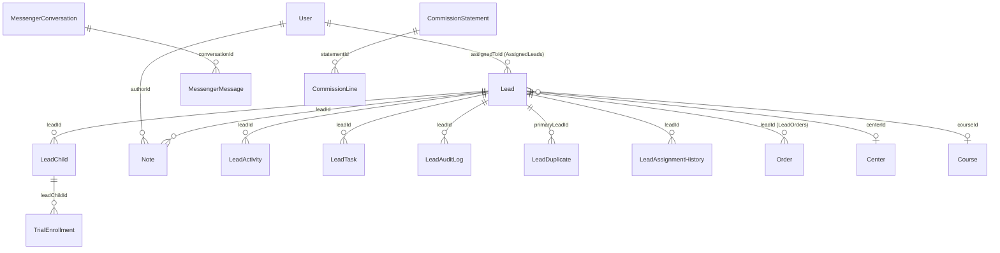
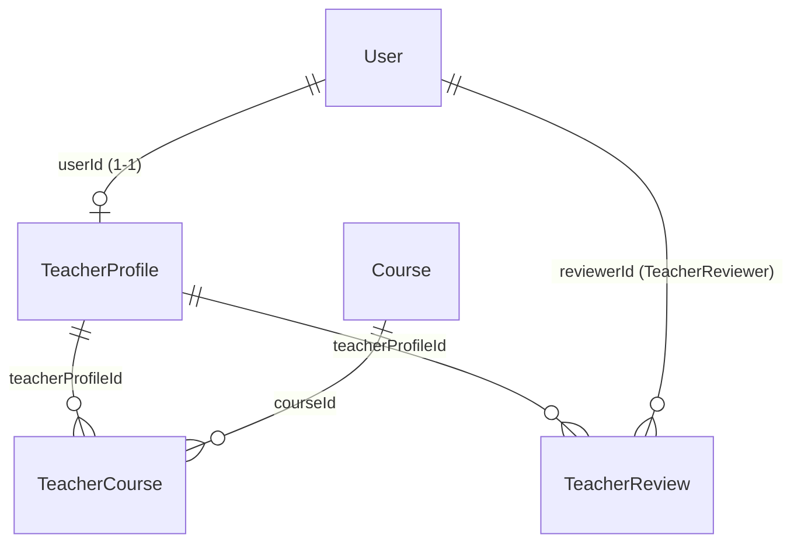
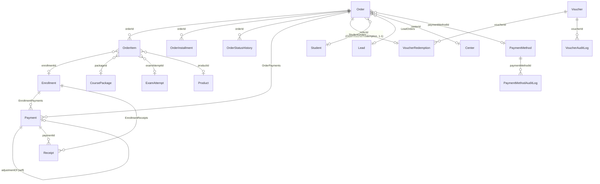
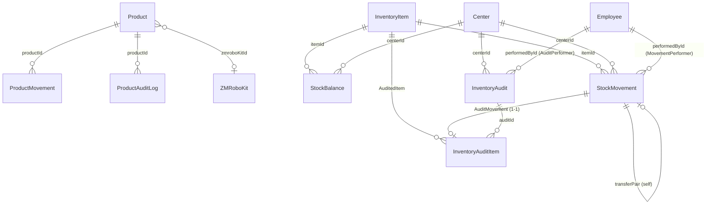
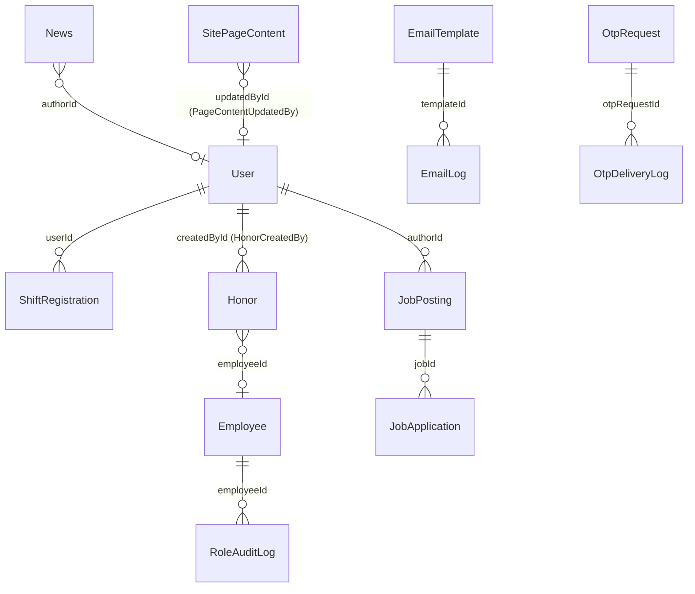

# ERD — Database hiện tại (Sata Robo VN)

> Sinh từ `prisma/schema.prisma` (snapshot 2026-06-16). ~130 model. Vì quá lớn cho 1 sơ đồ,
> ERD được chia theo **cụm nghiệp vụ**. Mỗi block dưới đây là Mermaid `erDiagram` — mở bằng VS Code
> (extension *Markdown Preview Mermaid Support*) hoặc GitHub để render.
>
> Quy ước cardinality:
> - `||--o{` = **1 — n** (1 cha, nhiều con; con optional)
> - `||--|{` = **1 — n** (con bắt buộc ≥1)
> - `||--o|` = **1 — 1** (optional)
> - `}o--||` đọc ngược lại
> - Quan hệ tự tham chiếu (self) = cây phân cấp.

---

## 1. Tổ chức, Identity & RBAC

Trục: `Center` / `OrgUnit` (cây) · `User` ↔ `Employee` (1-1) · RBAC động (`RoleDef` / `RolePermission` / `UserOrgRole`).

```mermaid
erDiagram
    OrgUnit  ||--o{ OrgUnit              : "parent→children (cây)"
    Center   ||--o{ User                 : centerId
    Center   ||--o{ Employee             : centerId
    Center   ||--o{ Room                 : centerId
    Center   ||--o{ ClassGroup           : centerId
    Center   ||--o{ Class                : centerId
    Center   ||--o{ Lead                 : centerId
    Center   ||--o{ Order                : centerId
    Center   ||--o{ Student              : centerId
    Center   ||--o{ Student              : preferredCenterId

    User     ||--o| Employee             : "employeeId (1-1)"
    Employee ||--o{ Employee             : "manager→subordinates"
    Employee }o--o| DepartmentDef        : departmentId
    Employee }o--o| Center               : centerId
    User     ||--o{ Employee             : "createdBy"

    RoleDef         ||--o{ RolePermission : roleId
    RoleDef         ||--o{ UserOrgRole    : roleId
    User            ||--o{ Account        : userId
    User            ||--o{ UserPermissionGrant : "userId (grants)"
    User            ||--o{ UserPermissionGrant : "grantedBy (grantor)"
    User            ||--o{ UserAuditLog        : userId
    User            ||--o{ PermissionGrantAuditLog : userId
```

> Ghi chú: `UserOrgRole`, `EmployeeOrgAssignment`, `RbacAuditLog`, `RbacShadowDiff`, `RoleAuditLog`
> tham chiếu `userId`/`orgUnitId` ở dạng scalar (không khai báo back-relation trong schema), nên không
> hiện cạnh nhưng vẫn là khóa logic tới `User`/`OrgUnit`.

---

## 2. Lead / CRM / Marketing



> `FacebookPageMapping`, `MarketingReport`, `MarketingCostPeriod`, `AdsInsightDaily`,
> `CommissionRateConfig`, `LeadAssignmentConfig`, `LeadTransfer` là bảng cấu hình/log độc lập
> (tham chiếu logic qua centerId/leadId scalar).

---

## 3. Học vụ — Course / Class / Enrollment

```mermaid
erDiagram
    CourseCategoryDef ||--o{ Course            : categoryId
    Course ||--o{ CoursePrerequisite           : "courseId (owner)"
    Course ||--o{ CoursePrerequisite           : "requiredCourseId"
    Course ||--o{ Class                         : courseId
    Course ||--o{ Enrollment                    : courseId
    Course ||--o{ Curriculum                    : courseId
    Course ||--o{ CourseCompletion              : courseId
    Course ||--o{ CourseDiscount                : courseId

    Curriculum ||--o{ Lesson                    : curriculumId

    ClassGroup ||--o{ Student                   : "classGroupId (ClassGroupStudents)"
    ClassGroup ||--o{ Class                     : classGroupId
    Center     ||--o{ ClassGroup                : centerId

    Class ||--o{ Enrollment                     : classId
    Class ||--o{ ClassSession                   : classId
    Class ||--o{ ClassAuditLog                  : classId
    Class }o--o| Room                           : roomId
    Class }o--o| User                           : "teacherId (TeacherClasses)"
    Class }o--o| User                           : "assistantId (AssistantClasses)"

    ClassSession }o--o| Lesson                  : lessonId
    ClassSession }o--o| ClassSessionPlan        : planId

    Enrollment ||--o| Enrollment                : "transferredTo (self)"
    Enrollment ||--o{ EnrollmentAuditLog        : enrollmentId
    Enrollment ||--o{ OrderItem                 : "EnrollmentOrderItems"
    Enrollment ||--o{ StudentReserve            : "EnrollmentReserves"
    Enrollment ||--o{ Payment                   : "EnrollmentPayments"
    Enrollment ||--o{ Receipt                   : "EnrollmentReceipts"
    Student    ||--o{ Enrollment                : studentId
```

---

## 4. Student & Portal phụ huynh

```mermaid
erDiagram
    User    ||--o{ Student              : "parentUserId (ParentChildren)"
    Student ||--o{ Attendance           : studentId
    Student ||--o{ StudentSkillAssessment   : studentId
    Student ||--o{ StudentSessionFeedback   : studentId
    Student ||--o{ StudentAuditLog      : studentId
    Student ||--o{ CourseCompletion     : studentId
    Student ||--o{ StudentCenterHistory : studentId
    Student ||--o{ StudentTransferRequest : studentId
    Student ||--o{ StudentReserve       : "StudentReserves"
    Student ||--o{ ParentRequest        : "StudentParentRequests"
    Student ||--o{ StudentRiskAlert     : studentId
    Student ||--o{ StudentCareTask      : studentId
    Student ||--o{ MakeupNeed           : studentId
    Student ||--o{ Order                : "StudentOrders"
    Student ||--o{ SataCoinTransaction  : studentId

    ClassSession ||--o{ Attendance              : classSessionId
    ClassSession ||--o{ StudentSessionFeedback  : sessionId
    StudentRiskAlert ||--o{ StudentCareTask     : riskAlertId
    Class ||--o{ MakeupNeed                      : classId

    Survey ||--o{ SurveyQuestion        : surveyId
    Survey ||--o{ SurveyResponse        : surveyId

    ClassSessionMedia ||--o{ MediaStudentTag : mediaId
```

---

## 5. Giáo viên & Đánh giá



---

## 6. Thi & Bài tập (Exam / Assignment)

```mermaid
erDiagram
    Curriculum ||--o{ Lesson         : curriculumId
    Lesson ||--o{ Question           : lessonId
    Lesson ||--o{ Exam               : lessonId
    Lesson ||--o{ Document           : lessonId
    Lesson ||--o{ Assignment         : lessonId

    Question ||--o{ Choice           : questionId
    Question ||--o{ ExamQuestion     : questionId
    Employee ||--o{ Question         : "authorId (QuestionAuthor)"

    Exam ||--o{ ExamQuestion         : examId
    Exam ||--o{ ExamAttempt          : examId
    Exam }o--o| Class                : classId
    Employee ||--o{ Exam             : "createdById (ExamCreator)"

    Student     ||--o{ ExamAttempt   : studentId
    ExamAttempt ||--o{ ExamAnswer    : attemptId
    ExamAttempt ||--o{ OrderItem     : "ExamOrderItems"
    ExamQuestion ||--o{ ExamAnswer   : examQuestionId
    Employee ||--o{ ExamAttempt      : "gradedById (AttemptGrader)"

    Class ||--o{ Assignment          : classId
    Assignment ||--o{ AssignmentDocument   : assignmentId
    Assignment ||--o{ AssignmentSubmission : assignmentId
    Assignment ||--o{ Question              : "AssignmentQuestions"
    Document   ||--o{ AssignmentDocument    : documentId
    Student    ||--o{ AssignmentSubmission  : studentId
    AssignmentSubmission ||--o{ SubmissionRubricScore : submissionId
    Employee ||--o{ Assignment              : "createdById (AssignmentCreator)"
    Employee ||--o{ AssignmentSubmission    : "gradedById (SubmissionGrader)"
    Employee ||--o{ Document                : "uploadedById (DocumentUploader)"
    Student  ||--o{ ProgressReportLog       : studentId
    Class    ||--o{ ProgressReportLog       : classId
    Employee ||--o{ ProgressReportLog       : "generatedById (ReportGenerator)"
```

---

## 7. Đơn hàng, Thanh toán & Khuyến mãi



---

## 8. Kho / Vật tư (Inventory)



---

## 9. Trial (học thử) — V1 & V2

```mermaid
erDiagram
    TrialClass ||--o{ TrialFeedback   : trialClassId
    TrialClass }o--o| Lead            : leadId
    TrialClass }o--o| Center          : centerId
    TrialClass }o--o| Class           : classId
    TrialClass }o--o| Room            : roomId
    TrialClass }o--o| User            : "teacherId (TrialTeacher)"
    TrialFeedback }o--o| Course       : "recommendedCourseId (TrialRecommendedCourse)"

    TrialProgramConfig ||--o{ TrialClassV2     : configId
    TrialClassV2 ||--o{ TrialClassSession      : trialClassId
    TrialClassV2 ||--o{ TrialEnrollment        : trialClassId
    LeadChild    ||--o{ TrialEnrollment        : leadChildId
    TrialClassSession ||--o{ TrialAttendance   : trialSessionId
    TrialEnrollment   ||--o{ TrialAttendance   : trialEnrollmentId
```

---

## 10. HR / Chấm công · Hệ thống · CMS



> Bảng độc lập (không cạnh FK, chỉ tham chiếu scalar / cấu hình toàn cục):
> `AuditLog`, `DomainEvent`, `IdempotencyKey`, `Counter`, `SystemSetting`, `CenterSetting`,
> `WorkShiftConfig`, `TimesheetAdjustmentRequest`, `TimesheetEditLog`, `CenterDayChecklist`,
> `EmployeeCheckin`, `Notification`, `StaffNotification`, `WebhookDelivery`, `EmailQueue`,
> `PageContent`, `TimelineItem`, `Testimonial`, `Promotion`, `MarketingConfig`,
> `IntegrationConfig`, `IntegrationLog`, `ZaloMessageLog`, `SataCoinRule`, `Holiday`,
> `StudentConsent`, `ParentFeedback`, `ConvertConflict`, `VerificationToken`.

---

## Phụ lục — các quan hệ 1-1 (đáng chú ý)

| Bên A | Bên B | FK (có `@unique`) | Ý nghĩa |
|---|---|---|---|
| `User` | `Employee` | `User.employeeId` | 1 tài khoản ↔ 1 hồ sơ nhân sự |
| `User` | `TeacherProfile` | `TeacherProfile.userId` | hồ sơ giáo viên của 1 user |
| `Order` | `VoucherRedemption` | `VoucherRedemption.orderId` | mỗi đơn dùng tối đa 1 voucher |
| `StockMovement` | `InventoryAuditItem` | `InventoryAuditItem.movementId` | bút toán điều chỉnh khi kiểm kê |
| `Payment` | `Payment` | `Payment.adjustmentOfId` (self) | bút toán điều chỉnh thanh toán |
| `Enrollment` | `Enrollment` | `Enrollment.transferredToId` (self) | chuyển ghi danh |
| `OrgUnit` | `OrgUnit` | `OrgUnit.parentId` (self) | cây tổ chức ROOT→HO/CS1/CS2 |
| `Employee` | `Employee` | `Employee.managerId` (self) | cây quản lý nhân sự |

## Phụ lục — các bảng "hub" (nhiều quan hệ nhất)

- **`User`** — tâm của identity: cha của Account, Student(parent), Lead(assigned), Class(teacher/assistant),
  TeacherProfile, các bản audit/grant.
- **`Center`** — scope cơ sở: cha của User, Employee, Room, Class, ClassGroup, Lead, Order, Student, kho.
- **`Student`** — tâm học vụ: Enrollment, Attendance, đánh giá, ParentRequest, Order, risk/care, SataCoin.
- **`Course` / `Class` / `Enrollment`** — trục đào tạo.
- **`Order`** — trục tài chính (OrderItem, Payment, Receipt, Voucher).
- **`Employee`** — tâm vận hành học liệu (Question/Exam/Document/Assignment/Inventory đều `createdBy`).
