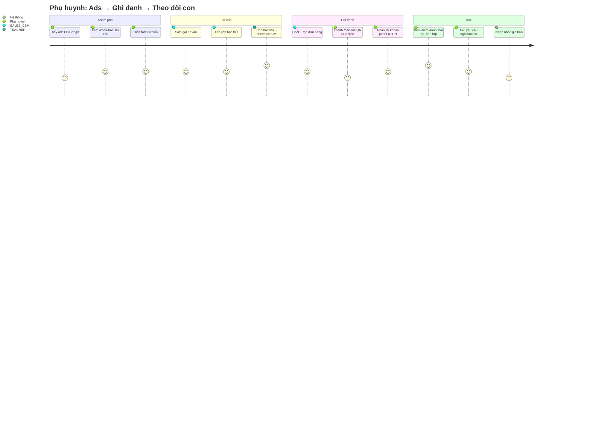
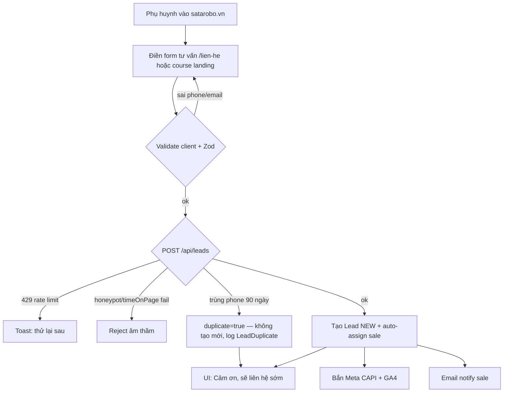
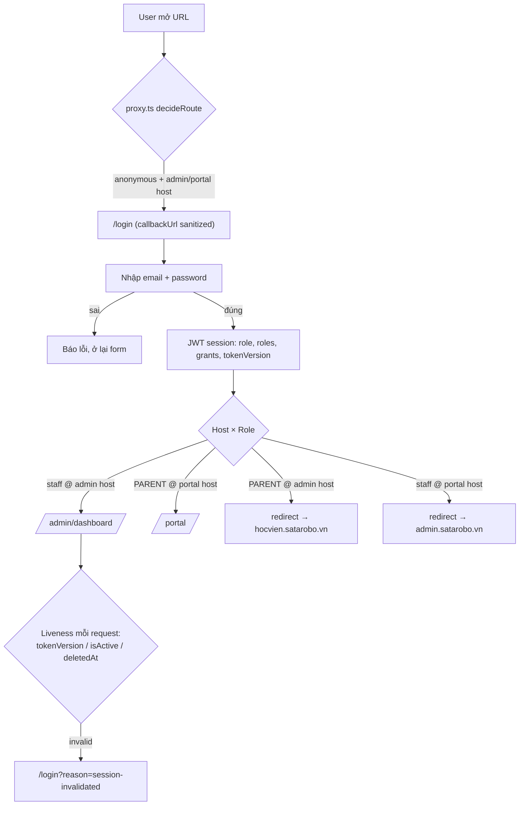
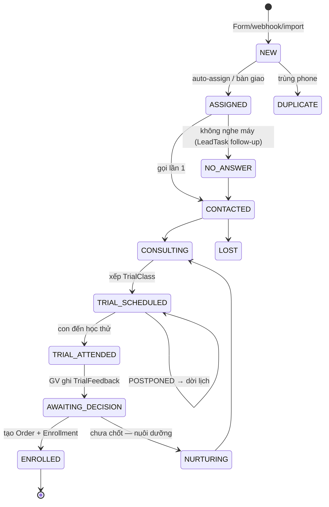

# Doc 8 — User Flow / Journey Map

> **Ai đọc:** BA, FE, QA.
> 🔄 **ĐỒNG BỘ DOC 15 (2026-06-06):** flow login (mục 3) là **HIỆN TRẠNG** (login giữ host) — target là **login chung `satarobo.vn/login`** redirect theo role (Doc 15 §3.1). Ma trận role (mục 10) là hiện trạng — bộ role mới + flow tổ chức/phân quyền xem Doc 15 §2.3 + Doc 9 mục 5. Khi xung đột, Doc 15 thắng.
> **Cập nhật:** 2026-06-06 · Sinh từ quét routes + server actions + docs nghiệp vụ.

---

## 1. Journey tổng: Phụ huynh từ quảng cáo → học viên



## 2. Flow: Lead capture (public)



**Edge cases:** mạng lỗi → form giữ data, retry; chặn JS tracking → CAPI server-side vẫn ghi; webhook FB/Zalo/GForm đổ lead song song (dedup chung theo phone).

## 3. Flow: Đăng nhập & điều hướng theo host



**Edge cases:** token cũ sau khi admin đổi quyền/khóa user → tokenVersion bump → force re-login; session hết hạn giữa chừng → server action trả "Chưa đăng nhập" → toast + redirect; user đa vai trò (staff kiêm parent) → ưu tiên staff ở admin host.

## 4. Flow: Kích hoạt tài khoản phụ huynh (OTP)

```
Sale ghi danh học viên → tạo User PARENT (PENDING_ACTIVATION) liên kết Student
→ Phụ huynh vào /kich-hoat → nhập SĐT/email → OtpRequest (HMAC hash, maxAttempts)
→ Nhận OTP qua EMAIL (Resend) / SMS → nhập OTP → đặt mật khẩu → ACTIVE → login portal
Edge: OTP hết hạn → gửi lại · quá maxAttempts → khóa request, tạo mới · đổi liên hệ → purpose=CHANGE_CONTACT
```
(Chi tiết: `docs/otp-service.md`.)

## 5. Flow: Portal phụ huynh (mỗi mục một happy path)

| Flow | Các bước | Edge cases |
|---|---|---|
| **Chọn con** | Login → nếu ≥2 con: SiteSwitcher → `setActiveSite(studentId)` (cookie ký) | 0 con linked → màn hình "liên hệ trung tâm"; cookie con không thuộc parent → reject `assertOwnsStudent` |
| **Làm bài thi** | `/bai-thi` → thấy đề PUBLISHED trong khung openAt–closeAt → `startAttempt` → trả lời từng câu (`submitAnswer`) → `submitAttempt` | Hết giờ → auto-submit; đề đã đóng → báo lỗi; mất mạng → answer đã lưu từng câu |
| **Nộp bài tập** | `/bai-tap` → bài PUBLISHED → nhập text và/hoặc upload file (presigned) → `submitAssignment` | Quá `dueAt` → status LATE; allowText/allowFile quyết định input |
| **Gửi yêu cầu** | `/yeu-cau` → chọn loại (vắng/bù/chuyển lớp/chuyển cơ sở/bảo lưu/khác) + ngày → PENDING | Hủy được khi còn PENDING; staff duyệt → APPROVED/REJECTED + response |
| **Đánh giá** | `/danh-gia` → rating 1–5 + nội dung | Admin phản hồi → hiện adminResponse |
| **Bảng điểm** | `/portal` → tải PDF `/api/portal/transcript?studentId=` | studentId không phải con mình → 403 |

## 6. Flow: Admin — CRM pipeline (SALES_CSM)



Mỗi chuyển trạng thái ghi `LeadActivity` + `LeadAuditLog`. Sale nghỉ → `reassignLead` hàng loạt (`LeadAssignmentHistory`). Bàn giao sang vận hành: `/admin/ban-giao-lead` + `handoverNote` (xem `docs/lead-handover.md`, `docs/lead-to-enrollment-flow.md`).

## 7. Flow: Admin — vận hành lớp hằng ngày (TEACHER / CENTER_MANAGER)

```
Mở cơ sở: CENTER_MANAGER tick CenterDayChecklist (điện, thiết bị, phòng...)
GV trước buổi: xem /attendance hôm nay → buổi học (đã auto-sinh, né ngày nghỉ)
Trong buổi: điểm danh PRESENT/ABSENT/LATE/EXCUSED → ABSENT sinh MakeupNeed
          → nhận xét từng HS (StudentSessionFeedback) → upload ảnh lớp (PENDING)
          → giao bài tập (CLASSWORK/HOMEWORK)
Sau buổi: CENTER_MANAGER duyệt ảnh → APPROVED hiện trên portal
        → hệ thống quét rủi ro (vắng liên tiếp...) → StudentRiskAlert → CareTask cho CSM
Đóng cơ sở: checklist đóng
```

**Edge:** thêm ngày nghỉ đột xuất → buổi trùng tự dời + báo GV + hiện trên lịch; học bù: MakeupNeed PENDING → xếp vào session khác → MADE_UP.

## 8. Flow: Đơn hàng & thanh toán (SALES_CSM / ACCOUNTANT)

```
Tạo đơn /admin/orders/new: chọn loại (khóa/gói/thi/sản phẩm) + voucher (validate) 
→ DRAFT → chốt → PENDING_PAYMENT → hiện VietQR (bank info từ PaymentMethod)
→ KH chuyển khoản → kế toán đối soát → CONFIRMED (ghi bankReference, confirmedBy)
→ kích hoạt OrderItem: Enrollment CONFIRMED / xuất kho Product → COMPLETED
Trả góp: 2 OrderInstallment (đợt 1 PAID mới CONFIRMED; đợt 2 PENDING → cron debt-reminder)
Edge: hủy → CANCELLED (+hoàn voucher quota) · hoàn tiền → REFUNDED · voucher hết quota/hạn → báo ngay khi áp
```

## 9. Flow: HR — chấm công QR

```
Màn hình cơ sở hiện QR (token xoay vòng, /api/admin/cham-cong/qr-token)
→ NV scan trên điện thoại → gửi GPS → recordCheckin: verify token + geofence ≤ allowedRadiusMeters
→ EmployeeCheckin (CHECK_IN/CHECK_OUT, distanceMeters, withinGeofence)
Sai lệch → TimesheetAdjustmentRequest (PENDING → quản lý duyệt → TimesheetEditLog)
Đăng ký ca tuần: ShiftRegistration (CA_SANG/CHIEU/TOI) → duyệt → export Excel lương
Edge: ngoài geofence → ghi nhận withinGeofence=false để quản lý xét · QR token hết hạn → refresh
```

## 10. Ma trận flow × role (điểm vào chính)

| Flow | Anonymous | PARENT | SALES_CSM | TEACHER | CENTER_MANAGER | HR | ACCOUNTANT | MARKETING |
|---|---|---|---|---|---|---|---|---|
| Xem public site | ✅ | ✅ | ✅ | ✅ | ✅ | ✅ | ✅ | ✅ |
| Gửi lead | ✅ | — | — | — | — | — | — | — |
| Portal (con) | — | ✅ | — | — | — | — | — | — |
| CRM lead/trial | — | — | ✅ | — | ✅ | — | — | view |
| Điểm danh/LMS | — | — | — | ✅ | ✅ | — | — | — |
| Đơn hàng/voucher | — | — | tạo | — | ✅ | — | ✅ | — |
| Nhân sự/chấm công | — | — | checkin | checkin | duyệt | ✅ | lương | — |
| Tin tức/site content | — | — | — | — | — | — | — | ✅ |
| User/quyền/audit | — | — | — | — | — | — | — | — | (SUPER_ADMIN) |
