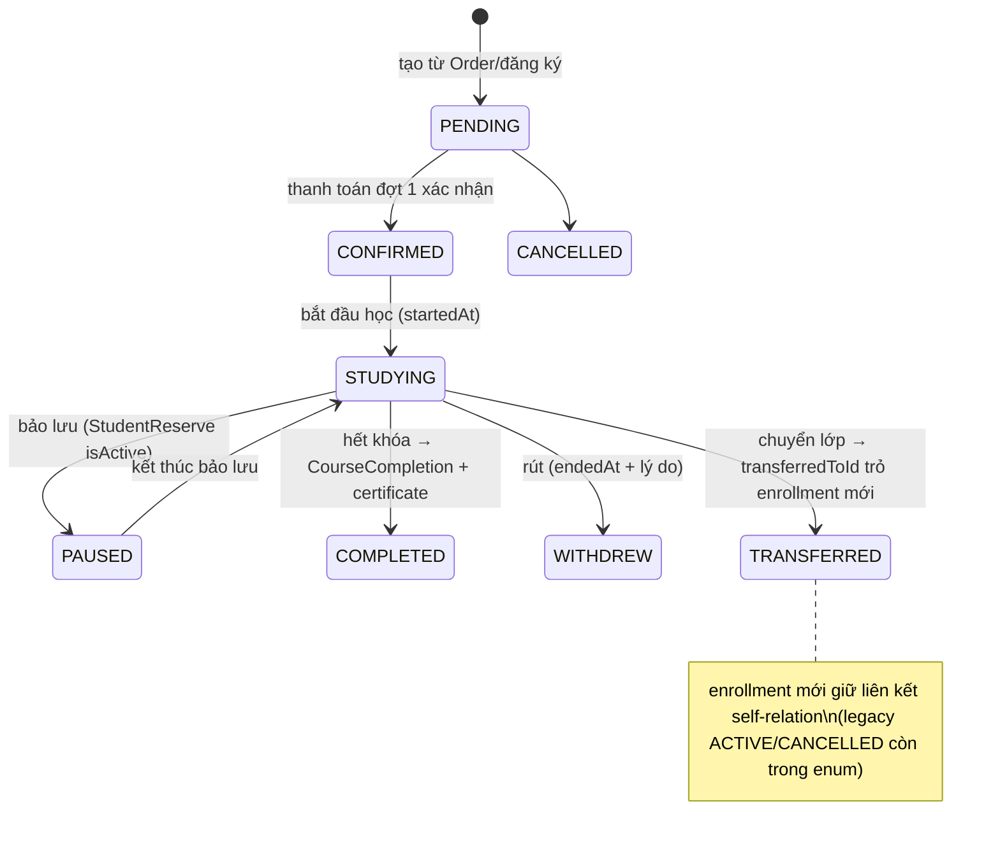
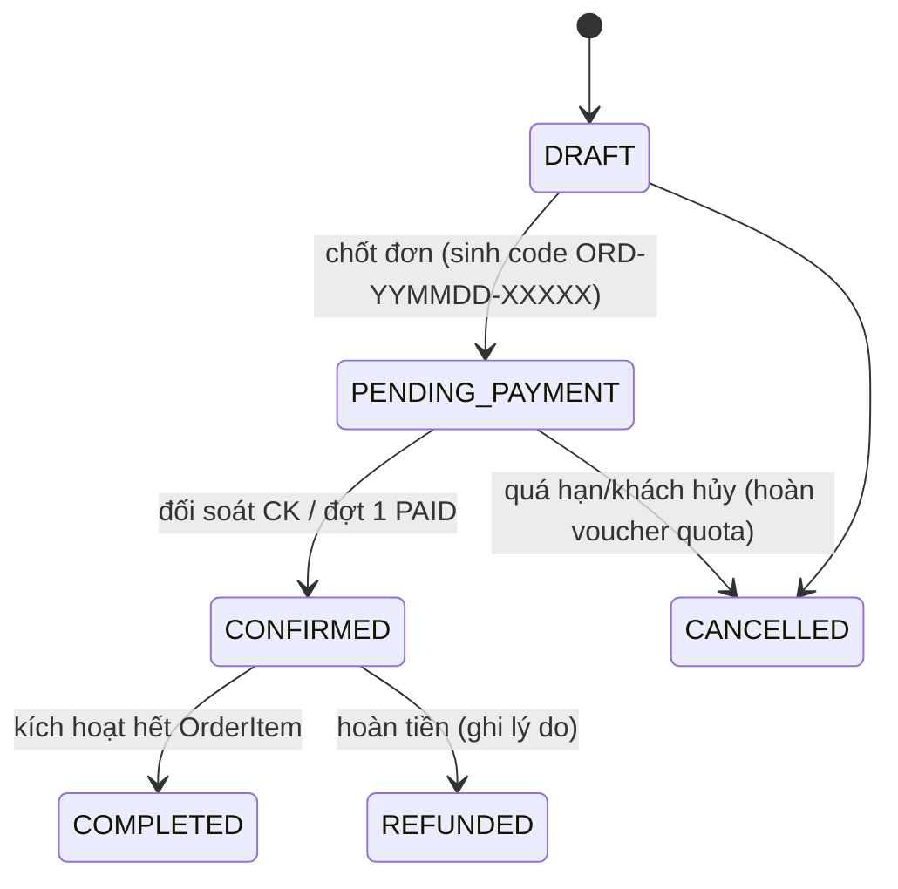
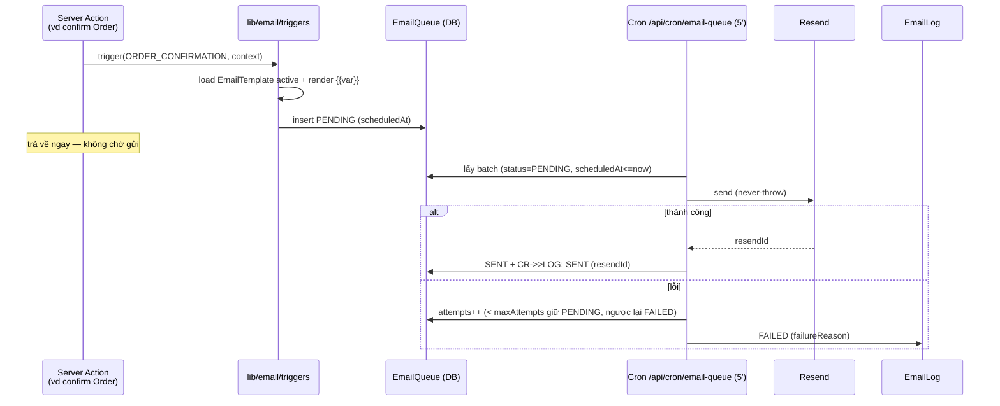
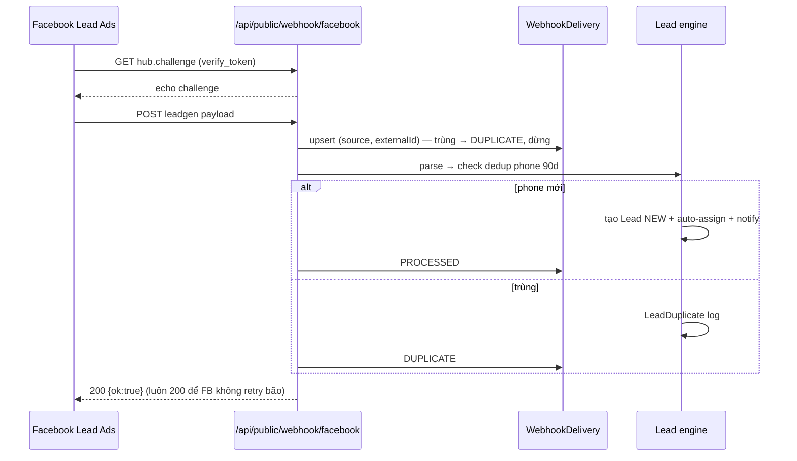
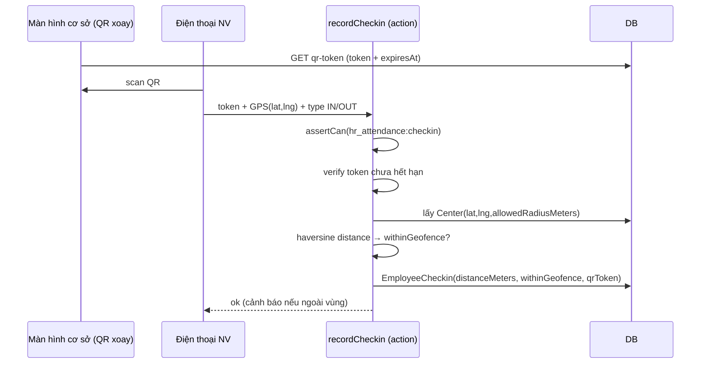

# Doc 9 — Business Logic Flow

> **Ai đọc:** Backend Dev, BA.
> 🔄 **ĐỒNG BỘ DOC 15 (2026-06-06):** doc mô tả nghiệp vụ HIỆN TRẠNG; thêm **mục 5 (TARGET)** — các flow tổ chức/phân quyền mới theo Doc 15 §2/§11. Khi xung đột, Doc 15 thắng.
> **Cập nhật:** 2026-06-06 · State machines + decision trees + sequence diagrams cho nghiệp vụ phức tạp.

---

## 1. State machines cốt lõi

### 1.1 Lead (13 trạng thái — xem diagram đầy đủ ở Doc 8 §6)

Bất biến: mọi transition ghi `LeadActivity(type=STATUS_CHANGE)` + `LeadAuditLog`; `ENROLLED` set `convertedById/convertedAt`; `DUPLICATE` chỉ set bởi dedup engine.

### 1.2 Enrollment (ghi danh)



Mọi transition ghi `EnrollmentAuditLog(fromStatus, toStatus, changedBy, reason)`.

### 1.3 Class (lớp)

`PLANNED → RECRUITING → PENDING_APPROVAL → (approvedBy ghi snapshot) → ACTIVE → COMPLETED | CANCELLED`
Khi ACTIVE: sinh `ClassSession` theo `scheduleDays + startTime/endTime + startDate`, map từng buổi với `Lesson` theo thứ tự giáo trình, **bỏ qua/dời ngày trùng `Holiday`** (`lib/classes/schedule.ts`).

### 1.4 Order



Mọi transition → `OrderStatusHistory`. `OrderItem` polymorphic kích hoạt theo type: COURSE_ENROLLMENT → Enrollment CONFIRMED; PRODUCT → `ProductMovement(SALE)` trừ kho; EXAM_REGISTRATION → ExamAttempt slot.

### 1.5 ExamAttempt / AssignmentSubmission

```
ExamAttempt:  IN_PROGRESS → SUBMITTED → GRADED → REVIEWED
  - startAttempt: check exam PUBLISHED + now ∈ [openAt, closeAt] + student enrolled
  - auto-grade trắc nghiệm (Choice.isCorrect); tự luận chờ Employee chấm
Submission:   NOT_SUBMITTED → SUBMITTED | LATE (now > dueAt) → GRADED (+ SubmissionRubricScore 6 tiêu chí × 4 mức)
```

### 1.6 ParentRequest / StudentTransferRequest

`PENDING → APPROVED | REJECTED | CANCELLED(parent tự hủy khi còn PENDING)`; transfer thêm `WAITLISTED`.
⚠️ Duyệt **không tự động thực thi** (chuyển lớp/bảo lưu) — staff thao tác nghiệp vụ tương ứng thủ công rồi phản hồi.

## 2. Decision trees

### 2.1 Auto-assign lead (`lib/lead/assign-strategy.ts`)

```mermaid
flowchart TD
    A[Lead mới có centerId?] -->|không| B[Vào pool chung — MANUAL]
    A -->|có| C{LeadAssignmentConfig.mode của center}
    C -->|MANUAL| B
    C -->|ROUND_ROBIN| D[Chọn sale kế tiếp trong vòng<br/>(active SALES_CSM của center)]
    C -->|CLOSE_RATE| E[Chọn sale tỉ lệ chốt cao nhất<br/>còn capacity]
    D & E --> F[status=ASSIGNED + LeadActivity + notify sale]
```

### 2.2 Resolution quyền (`can()` — lib/auth/permissions.ts)

```
can(user, action):
1. user có SUPER_ADMIN trong roles? → TRUE (bypass cả DENY — chống tự khóa)
2. grants có DENY action?           → FALSE
3. grants có ALLOW action?          → TRUE
4. UNION các role trong roles[] theo matrix: bất kỳ role nào cho phép → TRUE
5. mặc định FALSE
```

### 2.3 Phát hiện rủi ro học viên (RiskAlertType)

```
Quét theo học viên đang STUDYING:
- vắng N buổi LIÊN TIẾP        → CONSECUTIVE_ABSENCE (HIGH)
- tỉ lệ vắng > ngưỡng           → HIGH_ABSENCE (MEDIUM)
- thiếu ≥ N bài nộp            → MISSED_SUBMISSIONS
- GV đánh giá cần hỗ trợ        → NEEDS_SUPPORT
- còn ≤ N buổi & chưa gia hạn   → NEARING_END_NO_RENEWAL
- OrderInstallment quá dueDate  → OVERDUE_PAYMENT
→ StudentRiskAlert(OPEN) — không trùng alert OPEN cùng type
→ sinh StudentCareTask gán SALES_CSM phụ trách → DONE/CANCELLED → alert RESOLVED|ESCALATED
```

### 2.4 Validate voucher khi áp vào đơn

```
1. code tồn tại + isActive? 2. now ∈ [validFrom, validUntil]?
3. type khớp loại hàng trong đơn (COURSE/PACKAGE/KIT_ROBOT/SENSOR/ALL)?
4. subtotal ≥ minOrderValue? 5. usedCount < quantity (null = unlimited)?
6. số lần dùng của customerPhone < usageLimitPerUser?
→ PERCENT: discount = min(subtotal × %, maxDiscount) · FIXED: discountAmount
→ redeem khi đơn chốt: VoucherRedemption (orderId unique — 1 voucher/đơn) + usedCount++
```

## 3. Sequence diagrams (luồng nhiều thành phần)

### 3.1 Email queue end-to-end



### 3.2 Webhook lead (Facebook)



### 3.3 Chấm công QR + geofence



### 3.4 Hoàn thành khóa → chứng chỉ → khóa kế tiếp

```mermaid
sequenceDiagram
    participant CM as CENTER_MANAGER
    participant ACT as hoan-thanh-khoa action
    participant DB as DB
    participant PDF as /api/admin/reports/certificate
    participant EM as Email trigger

    CM->>ACT: đánh dấu hoàn thành (final grade/assessment)
    ACT->>DB: Enrollment → COMPLETED (+AuditLog)
    ACT->>DB: CourseCompletion (certificateCode unique, nextCourseId từ CoursePrerequisite chain)
    ACT->>EM: queue email chúc mừng + gợi ý khóa kế
    CM->>PDF: tải PDF chứng chỉ (@react-pdf, NotoSans)
    Note over DB: SataCoin EARN nếu có rule; CSM nhận care task "tư vấn gia hạn"
```

## 4. Bất biến nghiệp vụ (invariants — vi phạm = bug)

1. Ledger (`SataCoinTransaction`, `StockMovement`, `ProductMovement`) **không bao giờ UPDATE/DELETE** — chỉ append + bút toán đảo.
2. `StockBalance.quantity` = tổng đại số StockMovement của (item, center); chỉnh kho phải qua movement (kể cả kiểm kê — `InventoryAuditItem.movementId`).
3. 1 Order ↔ tối đa 1 VoucherRedemption; tối đa 2 OrderInstallment.
4. Chỉ 1 Employee `isCEO=true`; chỉ 1 Honor `isFeatured` per nhóm (toggle exclusive).
5. Soft-delete: query mặc định `deletedAt: null`; hard delete chỉ SUPER_ADMIN.
6. PARENT không bao giờ thấy dữ liệu học viên không thuộc mình (`assertOwnsStudent` ở mọi portal action/API).
7. TEACHER không thấy SĐT/email phụ huynh (`canViewParentContact` = false).
8. Buổi học không được rơi vào `Holiday` của center — sinh lịch phải né/dời.
9. Audit log ghi **trước khi trả về thành công** cho 8 domain nhạy cảm.
10. Mã code sinh từ `Counter` — không tự ghép chuỗi đếm max(+1) (race condition).

## 5. 🔄 TARGET — Flow tổ chức & phân quyền (đồng bộ Doc 15, từ A0)

### 5.1 Flow admin cấp role/permission

```
SUPER_ADMIN (duy nhất) → /admin/roles → tạo/sửa RoleDef + gán RolePermission (action × scopeType)
→ gán UserOrgRole (user × orgUnit × role + effectiveFrom/effectiveTo/status)
→ AuditLog + reason BẮT BUỘC → hiệu lực request kế tiếp (không deploy, không re-login)
```

### 5.2 Flow HO staff kiêm nhiệm nhiều trung tâm

```
HO_HR tạo EmployeeOrgAssignment (employee × orgUnit, assignmentType: PRIMARY/SECONDARY/SUPPORT/SUBSTITUTE/SHARED,
  allocationPercent, effectiveFrom/To)  ← nhân sự/lương, KHÔNG sinh quyền
Nếu cần quyền hệ thống tại center đó → SUPER_ADMIN cấp thêm UserOrgRole tương ứng
VD: GV CS2 dạy thay CS1 1 tháng = Assignment(SUBSTITUTE, CS1, 1 tháng) + UserOrgRole(TEACHER @ CS1, cùng kỳ hạn)
Hết effectiveTo → quyền/assignment tự hết hiệu lực
```

### 5.3 Flow Center Manager quản lý HO staff

```
HO staff có Assignment HOẶC UserOrgRole tại center X?
├─ CÓ  → Center Manager X quản lý PHẦN công việc/assignment thuộc center X
│        (KHÔNG quản lý vai trò HO của người đó)
└─ KHÔNG (chỉ ngồi làm việc tại địa điểm center) → KHÔNG thuộc quản lý của Center Manager
   (địa điểm trùng ≠ quan hệ tổ chức — HO ≠ CS2)
```

### 5.4 Flow HO role xem toàn hệ thống theo chức năng

```
can(actor, action, target):
  actor có role @ HO chứa permission(action)? → scope = TẤT CẢ cơ sở (cross-center theo module của role)
  actor có role @ CENTER chứa permission?     → scope = center đó (CS1 không thấy CS2 và ngược lại)
  Nhiều role → ALLOW thắng nếu ≥1 role cho phép (không DENY override)
VD: HO_ACCOUNTANT mở /admin/orders → thấy đơn mọi cơ sở; CENTER_ACCOUNTANT @ CS1 → chỉ CS1
```

### 5.5 Flow lead theo scope A&B của HO_SALE

```
HO_SALE đăng nhập → danh sách lead = (A) lead do mình tạo/giao ∪ (B) lead từ kênh HO/ads/Messenger
→ ĐƯỢC: xem, tạo lead mới từ hội thoại, bàn giao về CS1/CS2, theo dõi tiến trình lead đã giao
→ KHÔNG ĐƯỢC: sửa lead đã thuộc cơ sở (muốn sửa → admin cấp permission riêng trong tương lai)
```
