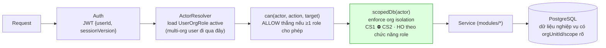
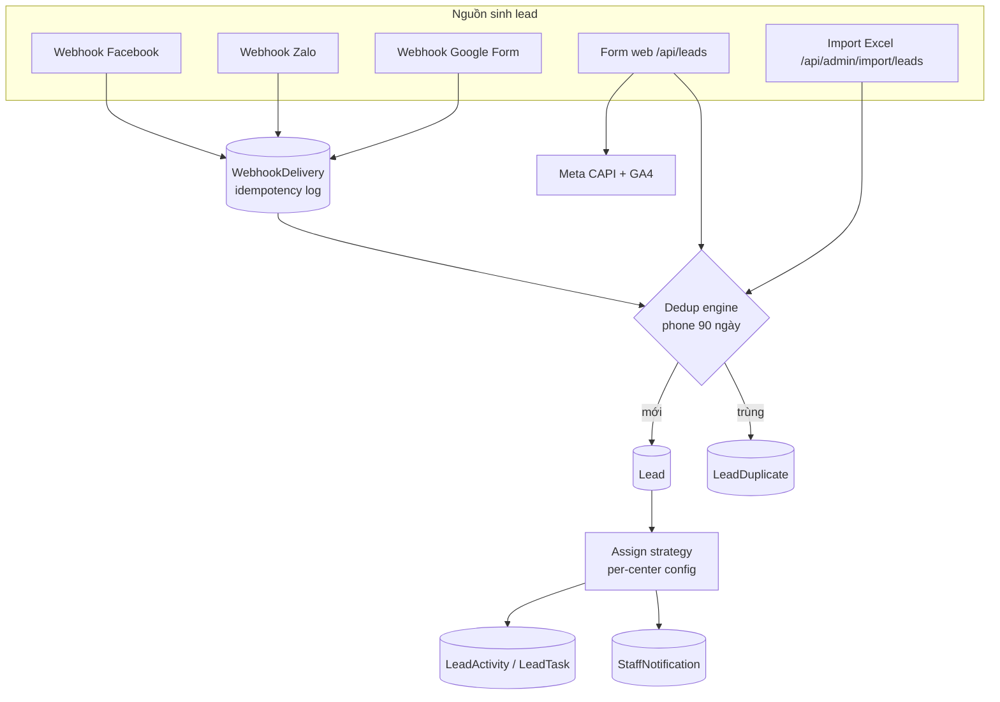
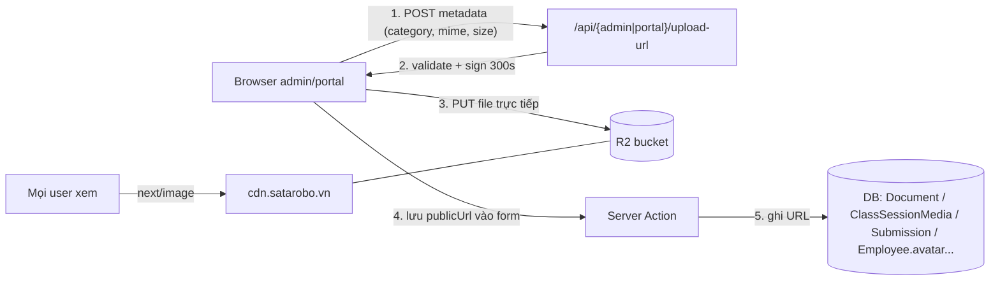

# Doc 10 — Data Flow Diagram

> **Ai đọc:** Backend Dev, DevOps.
> 🔄 **ĐỒNG BỘ DOC 15 (2026-06-06):** từ A0, MỌI request nghiệp vụ đi qua pipeline mới ở **mục 0** dưới đây — không có đường tắt bỏ qua `scopedDb`. Khi xung đột, Doc 15 thắng.
> **Cập nhật:** 2026-06-06. Hệ thống **không dùng message broker** (Kafka/RabbitMQ) — mọi flow async đi qua DB-backed queue + Vercel Cron; mọi flow sync đi qua Prisma.

---

## 0. 🔄 TARGET — Pipeline request chuẩn từ A0 (đồng bộ Doc 15)



Quy tắc: **không có đường tắt bỏ qua scopedDb** (ESLint chặn `db` trần trong `app/**`) · `EmployeeOrgAssignment` chỉ là data nhân sự — **không tham gia cấp quyền** trong pipeline trên · bảng nghiệp vụ mới phải có `orgUnitId`.

---

## 1. DFD mức 0 (context)

```mermaid
flowchart LR
    PH((Phụ huynh))
    NV((Nhân viên))
    FB[Facebook/Zalo/GForm]
    PAY[Ngân hàng/VietQR]

    SYS[["Sata Robo System<br/>(Next.js monolith)"]]

    DB[(PostgreSQL)]
    R2[(R2/CDN)]
    RS[Resend]
    TRK[GA4 / Meta CAPI]
    ZL[Zalo OA/ZNS]

    PH -->|form lead, bài làm, yêu cầu| SYS
    NV -->|CRUD nghiệp vụ| SYS
    FB -->|webhook lead| SYS
    PH -.->|chuyển khoản ngoài hệ thống| PAY -.->|đối soát thủ công| NV
    SYS <-->|Prisma| DB
    SYS <-->|presigned PUT / GET| R2
    SYS -->|email| RS
    SYS -->|events server-side| TRK
    SYS -->|ZNS (stub)| ZL
    SYS -->|trang, PDF, thông báo| PH
    SYS -->|dashboard, report, bell| NV
```

## 2. Luồng dữ liệu Lead (nhiều nguồn → 1 pipeline)



**Ai produce / ai consume:** producers = 5 nguồn trên; consumers = trang `/admin/leads` (SALES_CSM), dashboard funnel (Recharts), export CSV, cron không đụng lead.

## 3. Luồng dữ liệu file/media (browser ↔ R2, server không cầm file)



Xóa: `/api/admin/upload-delete { keys[] }` → DeleteObjects R2 (URL trong DB do caller dọn).

## 4. Luồng email (event-driven qua DB queue)

```
PRODUCERS (ghi EmailQueue PENDING):
  - Server Actions: order confirm, payment receipt, reservation/withdrawal notice
  - Cron reminders: class (01:00), renewal (02:00), debt (03:00)
  - Thủ công: admin gửi từ email-templates (trigger MANUAL)
CONSUMER (duy nhất): cron email-queue mỗi 5' → Resend → EmailLog (SENT/FAILED/BOUNCED) + sentCount template
FALLBACK: ZaloMessageLog FAILED/SKIPPED → fallbackEmailed=true (gửi email thay ZNS)
```

## 5. Luồng điểm danh → hệ quả dây chuyền (fan-out trong cùng transaction/follow-up)

```mermaid
flowchart TD
    GV[GV điểm danh buổi học] --> AT[(Attendance)]
    AT -->|ABSENT| MK[(MakeupNeed PENDING)]
    AT -->|ABSENT| NTF[Thông báo phụ huynh<br/>(notify + Zalo stub)]
    AT --> RISK{Quét rủi ro}
    RISK -->|vắng liên tiếp/nhiều| RA[(StudentRiskAlert)] --> CT[(StudentCareTask → CSM)]
    AT -->|PRESENT + rule| SC[(SataCoinTransaction EARN)]
    AT --> PORTAL[Portal phụ huynh đọc<br/>RSC query Attendance]
    MK -->|xếp lịch bù| MS[Session khác] -->|hoàn tất| MK2[MADE_UP]
```

## 6. Luồng đơn hàng → kho/ghi danh (consistency dọc)

```
Order CONFIRMED
 ├─ OrderItem COURSE_ENROLLMENT → Enrollment.status=CONFIRMED → (lớp bắt đầu) STUDYING
 ├─ OrderItem PRODUCT → ProductMovement(SALE, stockBefore/After) → Product.stockOnHand--
 ├─ VoucherRedemption → Voucher.usedCount++
 ├─ OrderStatusHistory append
 └─ EmailQueue(PAYMENT_RECEIPT) + IntegrationLog(MISA PUSH_INVOICE — skeleton)
Kho linh kiện nội bộ (dạy học) đi đường riêng: StockMovement ↔ StockBalance per center
```

## 7. Luồng tracking/analytics (dual: client + server)

| Kênh | Producer | Dữ liệu | Consumer |
|---|---|---|---|
| Client | `<GA4/>`, `<MetaPixel/>` (root layout, sau consent) | page_view, events | Google/Meta dashboards |
| Server | `/api/leads` handler | Lead event (CAPI + Measurement Protocol, kèm fbp/fbc, hashed) | Meta/GA4 attribution |
| Consent | `CookieConsent` → localStorage + cookie | categories necessary/analytics/marketing | gate cho 2 kênh trên |
| Errors | mọi runtime | Sentry (qua tunnel `/monitoring`, PII stripped) | Sentry dashboard |

## 8. Luồng dữ liệu Audit (write-only, một chiều)

```
Mọi mutation nhạy cảm (8 domain: user, grant, lead, class, student, payment-method, voucher, product)
  → lib/audit/log.ts: actor(session) + diff(old,new) + metadata(ip, UA)
  → bảng *AuditLog tương ứng (append-only)
  → Consumer duy nhất: /admin/audit-log viewer (SUPER_ADMIN, CENTER_MANAGER)
```

## 9. Bảng tổng hợp producer/consumer

| Data store | Producers | Consumers |
|---|---|---|
| `Lead*` | form, 3 webhook, import, sales actions | CRM pages, dashboard, export |
| `EmailQueue` | actions + 3 cron reminder | cron email-queue |
| `EmailLog` | cron email-queue | /admin/email-logs |
| `WebhookDelivery` | 3 webhook endpoints | retry/debug viewer |
| `StockMovement` | nhập/xuất/kiểm kê/chuyển kho actions | StockBalance recompute, báo cáo kho |
| `SataCoinTransaction` | attendance rule, redeem, adjust | số dư coin (SUM), /admin/satacoin, portal |
| `StaffNotification` | mọi module (dedupeKey) | bell `/api/admin/notifications/bell` |
| `*AuditLog` (8) | audit helper trong actions | /admin/audit-log |
| `ZaloMessageLog` | notify adapter (stub) | retry + fallback email |
| `IntegrationLog` | MISA adapter (skeleton) | /admin/tich-hop |
| R2 bucket | presigned PUT từ browser | CDN public reads |
