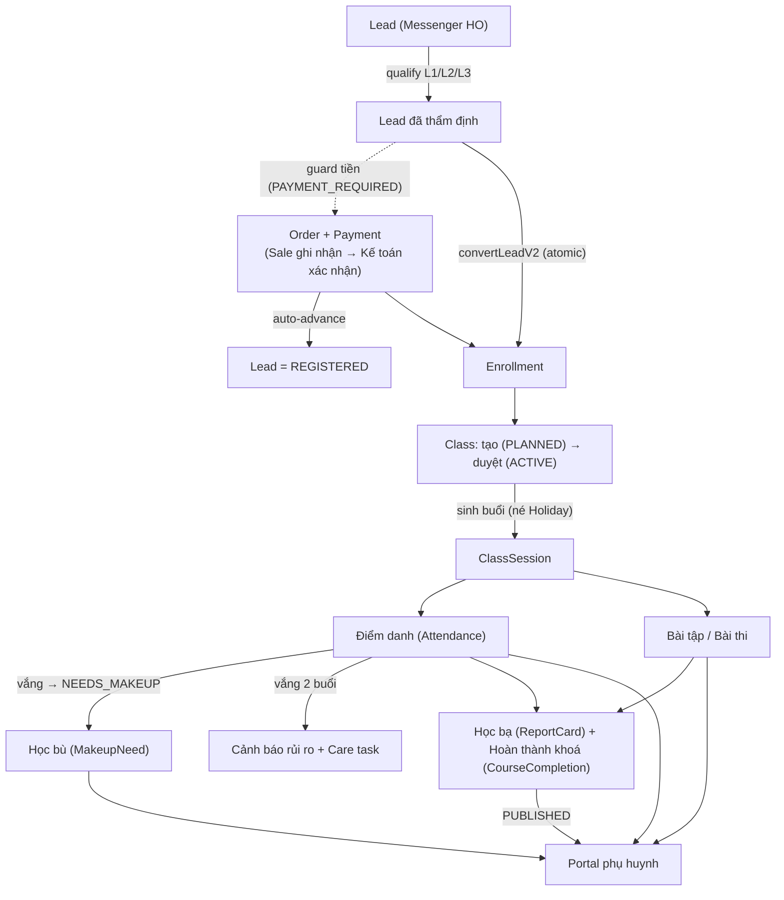

# Luồng LMS Sata Robo — Hiện trạng theo 5 vai trò

> **Phạm vi:** vận hành đào tạo **offline** (Phòng Đào tạo · Giáo viên · Quản lý lớp học · Học viên · Phụ huynh) + lớp xương sống RBAC/dữ liệu.
> **Nguồn:** đọc & đối chiếu trực tiếp source code — nhánh `FixPublicSite`, working tree, ngày **2026-06-29**.
> **Phương pháp:** 6 luồng khảo sát song song (multi-agent) → đối chiếu mở file thật → critic rà sót. Mọi tuyên bố kèm bằng chứng `đường/dẫn:dòng`.
> **Cách đọc:** mỗi mục = một vai trò; mỗi bước ghi rõ _Trạng thái · UI · Action · Quyền · Ghi DB · Event_. Xem chú giải ký hiệu ở cuối phần này.

> ⚠️ **Lưu ý quan trọng (chưa commit):** các bản vá tiền/ghi danh **PH‑1** (gộp sổ Payment), **PH‑2** (Lead → `REGISTERED`), **C4/C5** hiện đang nằm ở **working tree, CHƯA commit** (`git status` đánh `M` trên `lib/finance/payment.ts`, `lib/orders/installments.ts`, `lib/crm/convert-lead-v2.ts`, `app/(admin)/admin/leads/actions.ts`, `lib/auth/permissions.ts`, `lib/db-scope.ts` + migration `20260629142518_lead_payment_enroll_fields/`). Tài liệu mô tả trạng thái **sau** các fix này. Hãy commit + chạy migration trước khi dựa vào.

---

## Mục lục

1. [Luồng Phòng Đào tạo](#-1-luồng-phòng-đào-tạo-training--academic-admin)
2. [Luồng Giáo viên](#-2-luồng-giáo-viên-teacher)
3. [Luồng Quản lý Lớp học](#-3-luồng-quản-lý-lớp-học-class-operations--lifecycle)
4. [Luồng Học viên](#-4-luồng-học-viên-truy-cập-qua-cổng-phụ-huynh)
5. [Luồng Phụ huynh (Portal)](#-5-luồng-phụ-huynh-portal--hocviensatarobovn)
6. [Luồng Xương sống & RBAC](#-6-luồng-xương-sống--rbac-cross-cutting)
- [Phụ lục A — 4 đường ghi danh (đối chiếu guard)](#phụ-lục-a--4-đường-ghi-danh-đối-chiếu-guard)
- [Phụ lục B — Ranh giới HR vs LMS](#phụ-lục-b--ranh-giới-hr-vs-lms-tránh-nhầm)
- [Phụ lục C — Đầu "producer" của luồng portal đọc‑một‑chiều](#phụ-lục-c--đầu-producer-của-các-luồng-portal-đọcmộtchiều)
- [Phụ lục D — Route phụ thuộc thiết lập + Feature flags](#phụ-lục-d--route-phụ-thuộc-thiết-lập--feature-flags)
- [Phụ lục E — Sổ tổng hợp Khoảng trống & Vấn đề (ưu tiên)](#phụ-lục-e--sổ-tổng-hợp-khoảng-trống--vấn-đề-ưu-tiên)
- [Phụ lục F — Phương pháp & độ tin cậy](#phụ-lục-f--phương-pháp--độ-tin-cậy)

---

## Tổng quan kiến trúc LMS

- **1 app Next.js, 3 site / 3 domain:** public `satarobo.vn`, **admin** `admin.satarobo.vn` (Phòng Đào tạo · Giáo viên · Quản lý lớp), **portal** `hocvien.satarobo.vn` (Phụ huynh + Học viên).
- **Học viên KHÔNG có tài khoản đăng nhập riêng** (scope đã loại). Mọi mặt học‑viên‑facing nằm trong **portal của phụ huynh**: 1 tài khoản `PARENT` quản nhiều con, chọn "con đang xem" qua cookie ký HMAC; "chế độ Học viên" chỉ là cookie `portal_view` trên cùng tài khoản PH.
- **Vận hành offline.** Giáo viên & quản lý lớp thao tác trong **admin**, bị **cách ly theo cơ sở** (`scopedDb`): CS1 không đụng dữ liệu CS2; Giáo viên chỉ thấy lớp được phân công.
- **9 vai trò RBAC thực** trong code: `SUPER_ADMIN`, `CENTER_MANAGER`, `TRAINING` (Phòng Đào tạo — biên soạn LMS), `TEACHER`, `SALES_CSM`, `ACCOUNTANT`, `MARKETING`, `HR`, `PARENT` (+ biến thể HO‑level cross‑center). *(CLAUDE.md mô tả "8 role" là bản cũ — `TRAINING` đã được thêm.)*
- **Quy tắc atomic vs event:** tiền / ghi danh chạy trong **transaction**; thông báo / auto‑homework / đồng bộ ngoài đi qua **DomainEvent outbox** (handler idempotent).

### Sơ đồ pipeline tổng (lead → lớp → portal)

### Ai chạm khâu nào (tóm tắt)

| Khâu | Phòng Đào tạo | Giáo viên | Quản lý lớp | Học viên | Phụ huynh |
|---|:---:|:---:|:---:|:---:|:---:|
| Khoá · giáo trình · đề thi · template | ✅ tạo | xem / đề xuất sửa | — | — | — |
| Tạo lớp · ghi danh · duyệt lớp | ✅ tạo/ghi danh | — | ✅ duyệt (CENTER_MANAGER) | — | — |
| Sinh buổi · đổi lịch · học bù · chuyển lớp | ✅ | — | ✅ | — | xem |
| Điểm danh · hoàn tất buổi · giao bài | hỗ trợ | ✅ (lớp mình) | ✅ (cơ sở) | — | xem |
| Chấm thi/bài tập · đánh giá kỹ năng · học bạ | review/phát hành | ✅ chấm/soạn (lớp mình) | ✅ | — | xem (PUBLISHED) |
| Làm bài tập · làm bài thi | — | — | — | ✅ | bật giúp con |
| Học phí · yêu cầu · đánh giá · tin nhắn | — | ✅ tin nhắn (staff) | — | xem | ✅ |

### Chú giải ký hiệu trạng thái

| Ký hiệu | Nghĩa |
|---|---|
| ✅ **wired** | Đã nối UI ↔ action ↔ DB và chạy được |
| 🟡 **partial** | Có nhưng bị che sau feature‑flag, thiếu một phần, hoặc còn 2 luồng song song |
| 🧩 **schema‑only** | Mới có model/schema, chưa có UI/action |
| 🔴 **broken / gãy** | Có nhưng đứt mạch (action không được gọi, trạng thái không đạt được…) |
| ❓ **chưa xác minh** | Chưa kiểm chứng chắc chắn |

### Bảng tóm tắt trạng thái theo vai trò

| Vai trò | Nơi thao tác | Mức hoàn thiện | Điểm gãy nổi bật |
|---|---|---|---|
| **Phòng Đào tạo** | admin | ✅ phần lớn wired | `convertLeadV2` không re‑check sĩ số / tiên quyết; `TRAINING` không có quyền duyệt‑phát hành ReportCard |
| **Giáo viên** | admin (scope lớp mình) | ✅ wired; vài phần sau flag | "Hoàn tất buổi" sau flag `SESSION_LIFECYCLE_V2` (OFF); trình chiếu SCORM tắt theo `SCORM_ENABLED` (OFF) |
| **Quản lý lớp học** | admin (hub `classes/[id]`) | ✅ wired | `cancelClassAction` (hủy lớp + refund) **chưa nối UI** |
| **Học viên** | qua portal phụ huynh | 🟡 đọc nhiều; tương tác = nộp bài + làm thi | `HomeworkAssignment.status` không bao giờ đổi; gamification SataCoin chưa nối; tài liệu bài giảng lộ URL thô |
| **Phụ huynh** | portal | ✅ wired | **không có UI cấp/thu hồi consent ảnh**; `/admin/parent-feedback` không cách ly cơ sở |
| **Xương sống / RBAC** | toàn hệ | ✅ wired (PH‑1/PH‑2 đã fix ở working tree) | `Attendance`/`ReportCard` chưa scope tầng query; `scopedDb` chưa auto‑scope WRITE; **chưa commit** |

---

## 1. 🎓 Luồng Phòng Đào tạo (Training / Academic Admin)

**Tóm tắt.** Phòng Đào tạo (role `TRAINING`, có thật trong enum `prisma/schema.prisma:24` — KHÁC `TEACHER`) chuẩn bị toàn bộ "khung học thuật" trước khi lớp chạy: danh mục khoá → giáo trình/buổi học → ngân hàng câu hỏi/đề/tài liệu/template bài tập → tạo lớp (chốt snapshot giáo trình, tự sinh kế hoạch buổi + bài tập DRAFT) → ghi danh học viên (guard sĩ số + tiên quyết) → quy trình duyệt lớp (CENTER_MANAGER duyệt → sinh buổi thật). Vận hành OFFLINE; học viên KHÔNG có tài khoản riêng, kết quả hiển thị ở Portal phụ huynh. Core flow wired tốt; các điểm gãy thật nằm ở `convertLeadV2` (không re-check sĩ số + không check tiên quyết) và lệch quyền duyệt ReportCard/CourseCompletion (TRAINING bị bỏ ra ngoài).

**Vai trò RBAC liên quan:** `SUPER_ADMIN`, `TRAINING` (Đào tạo — toàn quyền LMS), `CENTER_MANAGER` (duyệt lớp + quản lý ghi danh, theo cơ sở), `SALES_CSM` (ghi danh + xếp học thử), `TEACHER` (chấm bài/đánh giá lớp mình), `ACCOUNTANT`/`MARKETING`/`HR` (chỉ xem một số danh mục).

**Điểm vào chính:**
| Route | File | Mục đích |
|---|---|---|
| /admin/courses | app/(admin)/admin/courses/page.tsx | Danh mục khoá (gate `courses:view`) |
| /admin/courses/[id] | app/(admin)/admin/courses/[id]/page.tsx | Chi tiết khoá + ưu đãi + gói bán |
| /admin/course-packages | app/(admin)/admin/course-packages/page.tsx | Gói/combo bán (gate `course-packages:edit`) |
| /admin/course-prerequisites | app/(admin)/admin/course-prerequisites/ | Cấu hình khoá tiên quyết |
| /admin/curriculums, /[id]/edit | app/(admin)/admin/curriculums/page.tsx, [id]/edit/page.tsx | Soạn giáo trình + buổi + duyệt đề xuất sửa |
| /admin/exams, /[id]/builder, /[id]/attempts | app/(admin)/admin/exams/** | Đề thi, soạn câu hỏi, chấm bài |
| /admin/documents | app/(admin)/admin/documents/page.tsx | Ngân hàng tài liệu gắn buổi |
| /admin/classes, /new, /[id], /[id]/edit | app/(admin)/admin/classes/** | Tạo/sửa/duyệt/chạy lớp |
| /admin/class-groups | app/(admin)/admin/class-groups/ | Nhóm lớp (kế thừa center/orgUnit) |
| /admin/enrollments, /new | app/(admin)/admin/enrollments/** | Ghi danh học viên vào lớp |
| /admin/students, /new | app/(admin)/admin/students/** | Danh mục học viên + đánh giá năng lực |
| /admin/trial-classes, /[id] | app/(admin)/admin/trial-classes/** | Lớp học thử V2 + xếp LeadChild |
| /admin/report-cards/[enrollmentId] | app/(admin)/admin/report-cards/** | Phiếu học tập (DRAFT→PUBLISHED) |
| /admin/hoan-thanh-khoa | app/(admin)/admin/hoan-thanh-khoa/ | Xác nhận hoàn thành khoá + cấp cert |
| /admin/hoc-bu | app/(admin)/admin/hoc-bu/ | Lập lịch & hoàn tất buổi học bù |
| /admin/evaluations | app/(admin)/admin/evaluations/ | Form đánh giá buổi (EvalForm) |
| /admin/bao-cao/dao-tao | app/(admin)/admin/bao-cao/dao-tao/page.tsx | Báo cáo chuyên cần / hoàn thành bài / lesson |

### Các bước trong luồng

1. **Thiết lập danh mục khoá (Course + Discount + Prerequisite)** — TRAINING/CENTER_MANAGER tạo khoá, ưu đãi, khoá tiên quyết.
   - _Trạng thái:_ ✅ wired
   - _UI:_ `app/(admin)/admin/courses/page.tsx:24`, `courses/[id]/page.tsx`
   - _Action:_ `updateCourseBasics()` (`courses/[id]/_actions.ts:53`), `createCourseDiscount()` (`:96`), `updateCourseDiscount()` (`:144`), `deleteCourseDiscount()` (`:196`)
   - _Quyền:_ `can(user,'courses:edit')` = [SUPER_ADMIN, TRAINING, CENTER_MANAGER, MARKETING]; xem = `courses:view`
   - _Ghi DB:_ Course, CourseDiscount, CoursePrerequisite
   - _Event:_ —

2. **Soạn giáo trình (Curriculum + Lesson + LessonChangeRequest)** — tạo curriculum đa phiên bản, thêm/sửa/sắp xếp buổi, gắn tài liệu/bài tập, đặt status buổi, khoá buổi; GV đề xuất sửa → Đào tạo duyệt.
   - _Trạng thái:_ ✅ wired
   - _UI:_ `app/(admin)/admin/curriculums/[id]/edit/page.tsx`, `_components/lesson-change-requests.tsx`
   - _Action:_ `createCurriculum()` (`curriculums/_actions.ts:78`), `createLesson()` (`:201`), `setLessonStatusAction()` (`:425`), `archiveLessonAction()` (`:458`), `reorderLessons()` (`:317`), `attachAssignmentToLesson()` (`:611`), `submitLessonChangeRequest()` (`:515`), `handleLessonChangeRequest()` (`:560`)
   - _Quyền:_ `curriculum:create/edit` = [SUPER_ADMIN, TRAINING]; `questions:author` (đề xuất); `lesson-change:approve` = [SUPER_ADMIN, TRAINING, CENTER_MANAGER]
   - _Ghi DB:_ Curriculum, Lesson, LessonChangeRequest, AssignmentTemplate
   - _Event:_ —

3. **Ngân hàng câu hỏi / đề thi / tài liệu** — TRAINING tạo Question bank, Exam (gán điểm/câu), upload Document.
   - _Trạng thái:_ ✅ wired
   - _UI:_ `app/(admin)/admin/exams/[id]/builder/page.tsx`, `documents/page.tsx`, `questions/`
   - _Action:_ `createExam()` (`exams/_actions.ts:140`), `updateExam()` (`:192`), `addQuestionToExam()` (`:303`), `autoGenerateExamQuestions()` (`:470`), `changeExamStatus()` (`:706`); `createDocument()` (`documents/_actions.ts:43`)
   - _Quyền:_ `exams:edit`, `documents:upload`, `questions:author` (TRAINING độc quyền biên soạn; TEACHER chỉ xem/chấm)
   - _Ghi DB:_ Exam, Question, Choice, ExamQuestion, Document, AssignmentTemplate
   - _Event:_ —

4. **Tạo lớp + sinh kế hoạch buổi (Class + ClassSessionPlan + Assignment)** — chốt curriculum ACTIVE, pin version, tự sinh kế hoạch buổi + bài tập DRAFT từ template.
   - _Trạng thái:_ ✅ wired
   - _UI:_ `app/(admin)/admin/classes/new/page.tsx`, `[id]/edit/page.tsx`
   - _Action:_ `createClass()` (`classes/_actions.ts:234`) → guard `courseHasActiveCurriculum` (`:266`) → `createSessionPlansForClass()` (`lib/classes/snapshot.ts`, gọi tại `:358`) → `generateAssignmentsFromTemplates()` (`lib/lms/assignment.ts`, gọi tại `:371`, idempotent, best-effort không chặn)
   - _Quyền:_ `classes:create/edit`; thêm cách ly cơ sở (`actorCanUseCenter`, `:252`) + GV cùng cơ sở (`assertTeachersInCenter`, `:258`)
   - _Ghi DB:_ Class (curriculumId + curriculumVersion snapshot), ClassSessionPlan, Assignment (DRAFT)
   - _Event:_ — (audit `logClassAudit`)

5. **Ghi danh học viên (Student + Enrollment)** — tạo/tìm HS, ghi danh vào lớp với guard sĩ số Serializable + tiên quyết.
   - _Trạng thái:_ ✅ wired
   - _UI:_ `app/(admin)/admin/enrollments/new/page.tsx`, `students/new/page.tsx`
   - _Action:_ `enrollStudent()` (`enrollments/_actions.ts:430`) — pre-check + **re-check sĩ số trong `runSerializable` (`:537-574`)** + `checkPrerequisites()` (`:123`, `:532`); `createStudent()` (`students/_actions.ts:120`). ⚠️ `createEnrollment()` (`:185`) là legacy CRUD KHÔNG có 2 guard này.
   - _Quyền:_ `enrollments:create/edit`, `students:create/edit`; ghi danh kèm cách ly cơ sở (`classCenterInScope`)
   - _Ghi DB:_ Student, Enrollment (centerId denormalize từ Class — FL3-02), AuditLog (writeAudit); status-change ghi EnrollmentAuditLog
   - _Event:_ —

6. **Duyệt lớp trước chạy (Class Approval)** — gửi duyệt khi đủ HS, CENTER_MANAGER/SUPER_ADMIN duyệt → sinh buổi thật.
   - _Trạng thái:_ ✅ wired
   - _UI:_ `app/(admin)/admin/classes/[id]/_components/*class-approval*`
   - _Action:_ `submitClassForApproval()` (`classes/_actions.ts:503`, PLANNED|RECRUITING→PENDING_APPROVAL, chặn enrollments=0), `approveClass()` (`:559`, →ACTIVE + `generateClassSessions(onlyIfEmpty)` `:577`), `rejectClass()` (`:607`), `generateSessionsAction()` (`:590`)
   - _Quyền:_ submit = SUBMIT_ROLES; duyệt = APPROVE_ROLES qua `requireApprover` (`:539`) — CENTER_MANAGER chỉ duyệt cơ sở mình
   - _Ghi DB:_ Class (status/approvedAt/approvedById), ClassSession
   - _Event:_ —

7. **Chạy lớp: buổi học + điểm danh + bài tập về nhà** — điểm danh, ghi nhận phòng/GV thay, checklist, học bù.
   - _Trạng thái:_ ✅ wired (riêng học bù có UI riêng /hoc-bu)
   - _UI:_ `app/(admin)/admin/classes/[id]/page.tsx`, `sessions/`, `hoc-bu/page.tsx`
   - _Action:_ điểm danh/hoàn tất buổi (lib/lms/attendance-record.ts, session-lifecycle.ts); makeup: `scheduleMakeupAction()`/`completeMakeupAction()` (`hoc-bu/_actions.ts:45,61`)
   - _Quyền:_ `classes:edit`, `exams:grade`; makeup `parent-requests:manage`
   - _Ghi DB:_ Attendance, ClassSession, HomeworkAssignment, MakeupNeed
   - _Event:_ —

8. **Chấm điểm thi & bài tập** — chấm ExamAttempt + từng câu; GV chỉ lớp mình (R7-13).
   - _Trạng thái:_ ✅ wired
   - _UI:_ `app/(admin)/admin/exams/[id]/attempts/page.tsx`
   - _Action:_ `gradeAttempt()` (`exams/_actions.ts:538`, dùng `canGradeClassWork`), `manualGradeAnswer()` (`:641`); chấm bài tập trong `assignments/_actions.ts`
   - _Quyền:_ `exams:grade`, `assignments:grade`
   - _Ghi DB:_ ExamAttempt, ExamAnswer, AssignmentSubmission, SubmissionRubricScore
   - _Event:_ —

9. **Đánh giá năng lực robotics + đánh giá buổi (StudentSkillAssessment + EvalForm)** — GV chấm 9 kỹ năng × 4 mức; form đánh giá buổi.
   - _Trạng thái:_ ✅ wired (KHÔNG phải schema-only như explorer nói)
   - _UI:_ `app/(admin)/admin/students/[id]/edit/page.tsx` (skill); `evaluations/` (form)
   - _Action:_ `saveStudentSkills()` (`students/[id]/_actions.ts:56`, gate `canAssessStudent`) ghi `db.studentSkillAssessment`; `saveSessionEvalAction()`/`loadSessionEvalAction()` (`lib/eval/session-eval-actions.ts:81,53`); quản lý form `createFormAction()` (`evaluations/_actions.ts:39`, perm `evaluations:manage`)
   - _Ghi DB:_ StudentSkillAssessment, EvalForm, EvalResponse, EvalAnswer
   - _Event:_ —

10. **Báo cáo học tập + hoàn thành khoá (ReportCard + CourseCompletion)** — phát hành phiếu + cấp chứng nhận.
    - _Trạng thái:_ ✅ wired (lưu ý quyền lệch — xem Khoảng trống)
    - _UI:_ `app/(admin)/admin/report-cards/[enrollmentId]/page.tsx`, `hoan-thanh-khoa/page.tsx`
    - _Action:_ `saveReportCardAction()` (`report-cards/_actions.ts:71`), `transitionReportCardAction()` (`:166`, DRAFT→PUBLISHED); `markCourseCompletion()` (`hoan-thanh-khoa/_actions.ts:50`, trả certificateCode), `bulkCompleteByClass()` (`:107`)
    - _Quyền:_ `report-cards:manage` = [SUPER_ADMIN, CENTER_MANAGER, TEACHER]; `report-cards:review` = [SUPER_ADMIN, CENTER_MANAGER]; `completions:manage` = [SUPER_ADMIN, CENTER_MANAGER, TEACHER]
    - _Ghi DB:_ ReportCard, ReportCardScore, CourseCompletion, ProgressReportLog
    - _Event:_ —

11. **Lớp học thử + convert lead (TrialClassV2 + convertLeadV2)** — cấu hình lớp thử, xếp LeadChild, hoàn tất buổi thử, convert thành ghi danh chính thức.
    - _Trạng thái:_ ✅ wired (convert có lỗ hổng sĩ số/tiên quyết — xem Khoảng trống)
    - _UI:_ `app/(admin)/admin/trial-classes/[id]/page.tsx`, `leads/[id]/convert/`
    - _Action:_ `createTrialClassAction()` (`trial-classes/_actions.ts:123`), `enrollLeadChildAction()` (`:170`), `markTrialAttendanceAction()` (`:439`), `completeTrialSessionAction()` (`:495`); `convertLeadV2()` (`lib/crm/convert-lead-v2.ts:73`)
    - _Quyền:_ `trials:config`/`trials:manage`/`trials:override-capacity`/`trials:feedback`
    - _Ghi DB:_ TrialClassV2, TrialEnrollment, TrialAttendance, Lead, Student, Enrollment, StudentConsent
    - _Event:_ `lead.converted`, `consent.granted` (publishEvent SAU commit, `:253,258`)

12. **Báo cáo & analytics đào tạo** — thống kê chuyên cần/hoàn thành bài/lesson per lớp.
    - _Trạng thái:_ ✅ wired (KHÔNG schema-only; chỉ THIẾU báo cáo aggregate năng lực overall)
    - _UI:_ `app/(admin)/admin/bao-cao/dao-tao/page.tsx` (BarChart top lớp theo chuyên cần)
    - _Action:_ `computeTrainingReport()` (`lib/reports/dao-tao.ts`)
    - _Quyền:_ gate `classes:view-all` || `training:manage`
    - _Ghi DB:_ — (read-only)
    - _Event:_ —

### Vai trò này LÀM ĐƯỢC
- Tạo/sửa khoá + ưu đãi + tiên quyết (Course/CourseDiscount/CoursePrerequisite).
- Soạn giáo trình đa phiên bản, set/khoá trạng thái buổi, duyệt đề xuất sửa buổi của GV.
- Xây ngân hàng câu hỏi/đề thi/tài liệu/template bài tập (TRAINING độc quyền biên soạn nội dung LMS).
- Tạo lớp với snapshot giáo trình + tự sinh kế hoạch buổi (ClassSessionPlan) và bài tập DRAFT.
- Ghi danh học viên với guard sĩ số chống TOCTOU (Serializable) + kiểm tra khoá tiên quyết.
- Quy trình duyệt lớp PLANNED→PENDING_APPROVAL→ACTIVE → tự sinh buổi thật.
- Điểm danh, học bù (UI /hoc-bu), chấm thi/bài tập (GV giới hạn lớp mình), đánh giá 9 kỹ năng robotics.
- Phát hành ReportCard + xác nhận hoàn thành khoá (cấp certificateCode).
- Quản lý lớp học thử V2 + convert lead thành ghi danh chính thức (atomic + idempotent).
- Báo cáo đào tạo per lớp (chuyên cần/bài tập/lesson).
- Cách ly cơ sở nhất quán ở write-path (CS1 không thao tác dữ liệu CS2).

### Hạn chế / KHÔNG làm được
- Học viên KHÔNG có tài khoản riêng — không có route học-viên-facing độc lập; kết quả chỉ hiện ở Portal phụ huynh (đã xác minh: StudentSkillAssessment/ReportCard đọc qua `portal/ho-so-con`, `portal/ket-qua`).
- TRAINING (Đào tạo) KHÔNG có quyền duyệt/phát hành ReportCard (`report-cards:review`) lẫn hoàn thành khoá (`completions:manage`) — chỉ SUPER_ADMIN/CENTER_MANAGER (+TEACHER cho manage). Trái mô tả "Đào tạo phát hành báo cáo".
- TRAINING KHÔNG duyệt lớp (chỉ tạo); duyệt thuộc CENTER_MANAGER/SUPER_ADMIN.
- Báo cáo đào tạo CHƯA có mục tổng hợp năng lực overall per HS (dữ liệu skill đã lưu nhưng không có view aggregate xếp loại).

### ⚠️ Khoảng trống & vấn đề đã phát hiện
- **convertLeadV2 KHÔNG re-check sĩ số lớp** — tạo Enrollment trực tiếp không count vs maxStudents → N lead convert song song có thể vượt sĩ số. _Bằng chứng:_ `lib/crm/convert-lead-v2.ts:194` (không có guard capacity, khác hẳn `enrollStudent`).
- **convertLeadV2 KHÔNG kiểm tra khoá tiên quyết** — không gọi `checkPrerequisites`; chỉ guard tiền (PAYMENT_REQUIRED). Explorer ghi "check tiên quyết khi convert" là SAI. _Bằng chứng:_ `lib/crm/convert-lead-v2.ts:73-261`.
- **2 đường ghi danh không đồng nhất guard** — `createEnrollment` (legacy, `enrollments/_actions.ts:185`) KHÔNG có capacity guard + KHÔNG check tiên quyết, trong khi `enrollStudent` (`:430`) có cả hai. Rủi ro nếu form cũ còn gọi `createEnrollment`. _Bằng chứng:_ `enrollments/_actions.ts:185-240` vs `:537-574`.
- **checkPrerequisites fail-OPEN** — lỗi tra cứu DB trả `{ok:true}` (không chặn). _Bằng chứng:_ `enrollments/_actions.ts:151-155`.
- **Lệch quyền ReportCard/CourseCompletion với TRAINING** (như mục Hạn chế). _Bằng chứng:_ `lib/auth/permissions.ts:382,390,391`.
- **2 hệ TrialClass song song** (model `TrialClass` schema:3581 cũ + `TrialClassV2` schema:4952) coexist có chủ đích nhưng tăng bề mặt nhầm lẫn. _Bằng chứng:_ `prisma/schema.prisma:3581,4952`.
- **Sai sót mô tả của explorer đã đính chính:** `approveClass` ở dòng 559 (không phải 600); action chấm thi là `gradeAttempt`/`manualGradeAnswer` (không phải `gradeExamAttempt`); action năng lực là `saveStudentSkills` (không phải `recordSkillAssessment`, file `skills.ts` chỉ chứa label); báo cáo dùng `transitionReportCardAction`/`markCourseCompletion`; các "gap" MakeupNeed-no-UI / LessonChangeRequest-no-UI / StudentSkillAssessment-schema-only đều ĐÃ wired thực tế.

---

## 2. 👩‍🏫 Luồng Giáo viên (Teacher)

**Tóm tắt.** GIÁO VIÊN (TEACHER) là vai trò vận hành LMS ở phạm vi HẸP: chỉ tác động lên lớp mình được phân công (GV chính `teacherId` hoặc trợ giảng `assistantId`). Họ dùng CÙNG các action như CENTER_MANAGER nhưng bị siết bằng owner-scope (`actor.assignedClassIds` / `canManageSessionClass` / `canGradeClassWork`), trong khi CENTER_MANAGER có scope toàn cơ sở. Vòng đời chính: xem lịch + lớp → mở học liệu/SCORM → điểm danh → hoàn tất buổi + giao bài → chấm bài thi/bài tập → đánh giá năng lực + phiếu buổi → nhập học bạ (chỉ nhập, không duyệt) → nhắn tin phụ huynh. GV KHÔNG xem SĐT/email phụ huynh, KHÔNG biên soạn nội dung LMS, KHÔNG duyệt lớp/học bạ.

**Vai trò RBAC liên quan:** `TEACHER` (chính). So sánh: `CENTER_MANAGER` (scope cơ sở), `TRAINING` (biên soạn LMS), `SUPER_ADMIN` (bypass). Quyền tĩnh ở `lib/auth/permissions.ts`; owner-scope ở action; cách ly cơ sở qua `scopedDb` (`lib/db-scope.ts`).

**Điểm vào chính:**
| Route | File | Mục đích |
|---|---|---|
| `/admin/lich` | `app/(admin)/admin/lich/page.tsx` | Lịch dạy (lưới tháng) |
| `/admin/classes/[id]` | `app/(admin)/admin/classes/[id]/page.tsx` | Hub lớp 7 tab (info/CT/buổi+điểm danh/ảnh/học bù/SCORM/đánh giá) |
| `/admin/teaching-materials` | `app/(admin)/admin/teaching-materials/page.tsx` | Học liệu lớp mình (read-only, FL1-04) |
| `/admin/scorm/play/[id]` | `app/(admin)/admin/scorm/play/[id]/page.tsx` | Player SCORM (vé 10p + watermark) |
| `/admin/attendance` | `app/(admin)/admin/attendance/_actions.ts` | Điểm danh (standalone + tab hub) |
| `/admin/exams/[id]/attempts` | `app/(admin)/admin/exams/_actions.ts` | Chấm bài thi |
| `/admin/assignments/[id]/edit` | `app/(admin)/admin/assignments/_actions.ts` | Chấm bài tập + rubric robotics |
| `/admin/students/[id]/edit` | `app/(admin)/admin/students/[id]/_actions.ts` | Đánh giá năng lực robotics |
| `/admin/report-cards` | `app/(admin)/admin/report-cards/_actions.ts` | Nhập học bạ năng lực |
| `/admin/tin-nhan` | `app/(admin)/admin/tin-nhan/page.tsx` | Nhắn tin 1-1 với phụ huynh |

### Các bước trong luồng

1. **Xem lịch dạy** — GV mở lưới tháng các buổi học.
   - _Trạng thái:_ 🟡 partial (lọc theo CƠ SỞ, không theo lớp được phân công của GV)
   - _UI:_ `app/(admin)/admin/lich/page.tsx:16` + `components/lms/month-calendar.tsx`
   - _Action/loader:_ `getAdminCalendarEvents()` (`lib/lms/calendar-data.ts:10`); helper thuần `monthGrid/monthGridRange` (`lib/lms/calendar.ts:26,56`)
   - _Quyền:_ chỉ check đăng nhập (`page.tsx:22`); scope dữ liệu = `actor.visibleCenterIds` (`calendar-data.ts:11`) → KHÔNG giới hạn `assignedClassIds`
   - _Ghi DB:_ — (read)

2. **Xem lớp được phân công (hub)** — GV mở chi tiết 1 lớp.
   - _Trạng thái:_ ✅ wired
   - _UI:_ `app/(admin)/admin/classes/[id]/page.tsx:60`
   - _Quyền:_ `can(actor,'classes:view-own')` (TEACHER, `permissions.ts:365`); IDOR-guard: chỉ GV/TA của lớp mới xem khi chỉ có view-own (`page.tsx:126-130`); danh sách GV lọc cơ sở qua `getAssignableTeachers({centerIds})` (`lib/teachers/assignable.ts:32`)
   - _Ghi DB:_ — (read qua `scopedDb`)

3. **Xem học liệu giảng dạy + SCORM** — khung chương trình + buổi + bài tập + thống kê nộp.
   - _Trạng thái:_ 🟡 partial (SCORM ẩn khi `SCORM_ENABLED=false`, mặc định OFF)
   - _UI:_ `app/(admin)/admin/teaching-materials/page.tsx:28`; tab SCORM trong hub `classes/[id]/page.tsx:409`
   - _Quyền:_ `teaching-materials:view-own-class` (`permissions.ts:452`); plain TEACHER siết `assignedClassIds` (`shouldRestrictToOwnClasses`, page.tsx:42-46); present SCORM gate `canOpenScorm` = GV phân công ∪ `training:manage` (`lib/scorm/access.ts:54`)
   - _Ghi DB:_ read-only (không sửa LMS)

4. **Trình chiếu SCORM** — mở player bài giảng.
   - _Trạng thái:_ 🟡 partial (sau flag `SCORM_ENABLED`, mặc định OFF — `lib/flags.ts:59`)
   - _UI:_ `app/(admin)/admin/scorm/play/[id]/page.tsx:46`
   - _Quyền:_ `isScormEnabled()` (notFound nếu OFF, :47) + `canOpenScorm(actor, classSession)` (:84) — GV phân công buổi/lớp ∪ `training:manage`; gói phải PUBLISHED với GV thường (:88)
   - _Ghi DB:_ `ScormAccessLog` (:94), `ScormAttempt` (resume, đọc); vé TTL 600s

5. **Điểm danh buổi** — đánh trạng thái PRESENT/ABSENT/LATE/EXCUSED + lý do vắng/học bù.
   - _Trạng thái:_ ✅ wired
   - _UI:_ tab "Buổi & Điểm danh" hub (`classes/[id]/page.tsx:375` → `ClassAttendancePanel`); loader roster `loadClassSessionRoster()` (`classes/[id]/_attendance-actions.ts:19`)
   - _Action:_ `markAttendance()` (`app/(admin)/admin/attendance/_actions.ts:44`)
   - _Quyền:_ `requireTeacherOrAdmin()` (:34, chỉ TEACHER/CENTER_MANAGER/SUPER_ADMIN) + owner-scope `canManageSessionClass()` (:75)
   - _Ghi DB:_ `Attendance` (upsert trong `$transaction`, :85); `MakeupNeed` qua `createMakeupNeed` (:124)
   - _Event:_ KHÔNG có DomainEvent — side-effect inline: `evaluateAbsenceRisk` (:137), `notifyAttendanceForSession` (:148, email PH best-effort)

6. **Hoàn tất buổi (lifecycle v2)** — ghi GV/giờ/phòng thực dạy + nhận xét lớp + chọn cách giao bài.
   - _Trạng thái:_ 🟡 partial (sau flag `SESSION_LIFECYCLE_V2`, mặc định OFF — `flags.ts:36`; OFF → action trả lỗi, dùng checklist cũ)
   - _UI:_ `classes/[id]/session/_components/complete-session.tsx:10,37`
   - _Action:_ `completeSessionAction()` (`classes/[id]/session/_actions.ts:33`) → `completeSession()` (`lib/lms/session-lifecycle.ts:40`)
   - _Quyền:_ `can(user,'sessions:edit')` (:55, TEACHER có — `permissions.ts:400`) + scope cơ sở `resolveSessionScope` (:60) + ownership `actor.assignedClassIds.has(classId)` (:71)
   - _Ghi DB:_ `ClassSession` (status COMPLETED + dữ liệu thực tế)
   - _Event:_ phát `session.taught` (idempotent theo sessionId, `session-lifecycle.ts:17`) → R7-14 consume auto giao bài

7. **Giao bài về nhà** — auto khi hoàn tất (NOW/CUSTOM_DUE) hoặc nút "Giao bài" thủ công (DEFER).
   - _Trạng thái:_ ✅ wired (phụ thuộc bước 6)
   - _UI:_ `classes/[id]/session/_components/give-homework.tsx:12,20`
   - _Action:_ `assignSessionHomeworkAction()` (`classes/[id]/session/_actions.ts:109`) → `assignHomeworkForSession()` (`lib/lms/assignment.ts`, nguồn = Exam PUBLISHED gắn Lesson; idempotent)
   - _Quyền:_ `sessions:edit` (:115) + ownership `assignedClassIds` (:128)
   - _Ghi DB:_ `HomeworkAssignment` (createMany skipDuplicates); `AuditLog` ASSIGN_HOMEWORK (:148)

8. **Chấm bài thi** — auto-grade MCQ/short + chấm tay ESSAY/CODE.
   - _Trạng thái:_ ✅ wired
   - _Action:_ `gradeAttempt()` (`app/(admin)/admin/exams/_actions.ts:538`), `manualGradeAnswer()` (:641)
   - _Quyền:_ `requireRole()` = `exams:edit` (:65) + `canGradeClassWork(user, exam.class)` (:38) — GV chỉ lớp mình (`canManageSessionClass`), else `report-cards:review`/`training:manage`; đề không gắn lớp → chỉ Đào tạo/Admin
   - _Ghi DB:_ `ExamAnswer`, `ExamAttempt` (status GRADED + passed)

9. **Chấm bài tập lớp + rubric robotics** — điểm/nhận xét, hoặc rubric 6 tiêu chí (nhận xét bắt buộc).
   - _Trạng thái:_ ✅ wired
   - _Action:_ `gradeSubmission()` (`app/(admin)/admin/assignments/_actions.ts:405`), `gradeSubmissionRubric()` (:725)
   - _Quyền:_ `canGradeClassWork(user, assignment.class)` (:429,:756) — owner-scope như trên
   - _Ghi DB:_ `AssignmentSubmission` (GRADED), `SubmissionRubricScore` (:770-777); email PH tuỳ chọn (enqueue, :794)

10. **Đánh giá năng lực robotics** — chấm StudentSkill theo HS (tùy chọn gắn buổi/bài).
    - _Trạng thái:_ ✅ wired
    - _UI:_ `app/(admin)/admin/students/[id]/_components/skill-editor.tsx`
    - _Action:_ `saveStudentSkills()` (`students/[id]/_actions.ts:56`)
    - _Quyền:_ `canAssessStudent()` (`lib/lms/skill-access.ts:8`) — SUPER_ADMIN | CENTER_MANAGER cùng cơ sở | TEACHER có enrollment dạy HS (teacherId/assistantId)
    - _Ghi DB:_ `StudentSkillAssessment` (createMany — mỗi lần lưu = bản ghi lịch sử mới)

11. **Đánh giá buổi học (SESSION_EVAL)** — GV điền phiếu theo từng HS.
    - _Trạng thái:_ ✅ wired (GV chỉ ĐIỀN; cấu hình form/đợt = `evaluations:manage`)
    - _UI:_ tab "Đánh giá" hub (`classes/[id]/page.tsx:451` → `ClassEvalPanel`)
    - _Action:_ `loadSessionEvalAction()` / `saveSessionEvalAction()` (`lib/eval/session-eval-actions.ts:53,81`); biến thể lớp trải nghiệm `saveTrialSessionEvalAction` (:182)
    - _Quyền:_ `gateFill()` (:28) — SUPER_ADMIN | TRAINING | CENTER_MANAGER cùng cơ sở | TEACHER là GV/TA của lớp
    - _Ghi DB:_ phản hồi SESSION_EVAL (idempotent đợt×buổi×HS)

12. **Nhập học bạ năng lực** — GV nhập nhận xét + chấm tiêu chí, rồi NỘP (PENDING_REVIEW).
    - _Trạng thái:_ ✅ wired
    - _UI:_ `app/(admin)/admin/report-cards/page.tsx:31`
    - _Action:_ `saveReportCardAction()` (`report-cards/_actions.ts:71`), `transitionReportCardAction()` (:166)
    - _Quyền:_ `authContext()` = `report-cards:manage` (TEACHER, `permissions.ts:390`); `checkEnrollmentScope` (owner/cơ sở); PHÁT HÀNH/duyệt cần `review` (CM/SUPER, GV KHÔNG có)
    - _Ghi DB:_ `ReportCard`, `ReportCardScore`; `AuditLog`
    - _Event:_ khi PUBLISHED phát `reportcard.published` (chỉ người có review) (:240)

13. **Tạo báo cáo tiến độ lớp** — gửi email PH hàng loạt.
    - _Trạng thái:_ ✅ wired
    - _Action:_ `generateClassProgressReports()` (`classes/[id]/_actions.ts:16`)
    - _Quyền:_ `completions:manage` (TEACHER, `permissions.ts:382`) + TEACHER chỉ lớp `teacherId` của mình (:32)
    - _Ghi DB:_ báo cáo tiến độ + `sendProgressReportEmail`

14. **Nhắn tin 1-1 với phụ huynh** — trả lời theo enrollment/lớp phụ trách.
    - _Trạng thái:_ ✅ wired
    - _UI:_ `app/(admin)/admin/tin-nhan/page.tsx:22`; `markThreadRead(enrollmentId,'STAFF')` (:56)
    - _Action:_ `sendStaffMessage()` (`tin-nhan/_actions.ts:49`) → `postMessage(... authorSide:'STAFF')` (:74)
    - _Quyền:_ `classes:view-all` || `classes:view-own` (:57); ownership `staffOwnsEnrollment()` (:25) — TEACHER qua `assignedClassIds`, CM/SUPER qua `scopedDb`
    - _Ghi DB:_ message (authorSide STAFF)

15. **Đề xuất sửa buổi giáo trình (GV gửi, Đào tạo duyệt)** — 🔴 xem mục Khoảng trống.
    - _Trạng thái:_ 🔴 broken cho TEACHER (gate `questions:author` + page `curriculum:edit` đều KHÔNG cấp cho TEACHER)
    - _Action:_ `submitLessonChangeRequest()` (`curriculums/_actions.ts:515`, gate `questions:author` :521); duyệt `handleLessonChangeRequest()` (:560, `lesson-change:approve`)
    - _Ghi DB:_ `LessonChangeRequest`

16. **(Phụ — KHÔNG thuộc LMS) Chấm công bản thân** — `/admin/cham-cong/**` là module HR/payroll (chấm công QR `hr_attendance:checkin`), không liên quan điểm danh lớp. Xem [Phụ lục B](#phụ-lục-b--ranh-giới-hr-vs-lms-tránh-nhầm).

### Giáo viên LÀM ĐƯỢC
- Xem lớp/buổi/đăng ký của lớp mình (`classes:view-own`, `sessions:view`, `enrollments:view-own`, `students:view-own-class` — `permissions.ts:355,365,378,398`).
- Điểm danh + tạo nhu cầu học bù; hoàn tất buổi (khi flag v2 ON) + giao bài; chấm bài thi/bài tập/rubric của lớp mình.
- Đánh giá năng lực HS mình dạy; điền phiếu đánh giá buổi; nhập học bạ rồi NỘP để duyệt; tạo báo cáo tiến độ lớp mình.
- Xem học liệu + trình chiếu SCORM (khi flag ON) của lớp được phân công; xem kho câu hỏi/đề/curriculum ở chế độ ĐỌC (`questions:view`, `exams:view`, `curriculum:view` — :430,434,423).
- Xem & tải ảnh lớp (`media:view`/`media:upload` :320-321); nhắn tin với phụ huynh lớp mình.
- Xem nhân sự công khai, tin tức, kho/thiết bị (`inventory:view`/`movement` :468,470), chấm công bản thân.

### Hạn chế / KHÔNG làm được
- **KHÔNG xem SĐT/email phụ huynh** — `canViewParentContact` loại TEACHER (`permissions.ts:688-697`).
- **KHÔNG xem lớp người khác / lớp ngoài phân công** — owner-scope `assignedClassIds` + `canManageSessionClass` + IDOR-guard (`classes/[id]/page.tsx:126`).
- **KHÔNG duyệt / phát hành học bạ** — `report-cards:review` chỉ CENTER_MANAGER/SUPER_ADMIN (:391); GV chỉ `manage`.
- **KHÔNG duyệt lớp / gán GV / override sĩ số / cấu hình số buổi** — `classes:edit` (:367), `trials:assign-teacher`/`override-capacity` (:301-302), `trials:config` (:307) đều không cấp TEACHER.
- **KHÔNG biên soạn nội dung LMS** — `curriculum:create/edit`, `questions:author`, `exams:create/edit`, `assignments:create/edit`, `documents:upload` chỉ SUPER_ADMIN/TRAINING (:424-449).
- **KHÔNG duyệt ảnh lớp** (`media:approve` :322), **KHÔNG quản lý học bù** trong hub (`parent-requests:manage` :314 — tab "Học bù" ẩn với GV, `classes/[id]/page.tsx:207`).
- **KHÔNG có `attendance:edit`** trong matrix (:403, chỉ SUPER/CM) — nhưng đường `markAttendance`/`deleteAttendance` dùng `requireTeacherOrAdmin` riêng (không qua `assertCan('attendance:edit')`) nên GV vẫn sửa/xoá được điểm danh lớp mình (matrix và path không khớp — xem Khoảng trống).

### ⚠️ Khoảng trống & vấn đề đã phát hiện
- **"GV đề xuất chỉnh bài" không khả dụng cho TEACHER.** Trang sửa giáo trình gate `curriculum:edit` (TRAINING/SUPER) → GV bị redirect trước khi thấy nút; dù vào được thì action lại gate `questions:author` (cũng TRAINING/SUPER). TEACHER không có cả hai. Comment code ghi "GV gửi đề xuất" nhưng quyền không cho. — _bằng chứng:_ `app/(admin)/admin/curriculums/[id]/edit/page.tsx:30`, `_components/lesson-list.tsx:62,68`, `curriculums/_actions.ts:521`, ma trận `permissions.ts:425,431`.
- **Lịch dạy không lọc theo lớp được phân công.** `/admin/lich` truy vấn buổi theo `actor.visibleCenterIds` (cả cơ sở), không theo `assignedClassIds` → GV thấy buổi của mọi lớp trong cơ sở, không chỉ lớp mình. — _bằng chứng:_ `lib/lms/calendar-data.ts:11`; `app/(admin)/admin/lich/page.tsx:22` (không gate role).
- **`markAttendance`/`deleteAttendance` không đi qua matrix `attendance:edit`.** Dùng `requireTeacherOrAdmin` đọc `session.user.role` (single role string, không phải `roles[]`) — user đa vai trò có TEACHER trong `roles[]` nhưng `role` chính khác có thể bị chặn; đồng thời matrix `attendance:edit` (loại TEACHER) bị bỏ qua trên path này. — _bằng chứng:_ `app/(admin)/admin/attendance/_actions.ts:34-42`, `permissions.ts:403`.
- **Tính năng cốt lõi bị khoá sau 2 flag mặc định OFF.** "Hoàn tất buổi" (`SESSION_LIFECYCLE_V2`) và SCORM (`SCORM_ENABLED`) đều OFF mặc định → trên môi trường chưa bật env, GV không hoàn tất buổi v2 (action trả lỗi) và không thấy/present SCORM. — _bằng chứng:_ `lib/flags.ts:36,59`; `session/_actions.ts:51`; `scorm/play/[id]/page.tsx:47`.
- **Điểm danh side-effect inline, chưa qua DomainEvent.** `notifyAttendanceForSession` + `evaluateAbsenceRisk` chạy trực tiếp trong `markAttendance` (best-effort try/catch), trái với định hướng Doc 15 "side-effect không-atomic qua DomainEvent". — _bằng chứng:_ `attendance/_actions.ts:131-149`.

---

## 3. 🏫 Luồng Quản lý Lớp học (Class Operations / Lifecycle)

**Tóm tắt.** Vòng đời 1 lớp: tạo (PLANNED) → tuyển sinh (RECRUITING) → gửi duyệt (PENDING_APPROVAL) → duyệt (ACTIVE, tự sinh buổi) → chạy buổi (điểm danh → hoàn tất buổi) → kết thúc (COMPLETED) hoặc huỷ (CANCELLED). Trung tâm vận hành là hub `app/(admin)/admin/classes/[id]/page.tsx` với **7 tab** (Thông tin · Chương trình · Buổi & Điểm danh · Ảnh lớp · Học bù · Tài liệu SCORM · Đánh giá), 4 tab cuối render có điều kiện theo quyền. Mọi mutation theo `classId` đều qua `scopedDb`/`passesScope("Class", …)` để cách ly cơ sở (CS1 không đụng lớp CS2). So với khảo sát của explorer, nhiều thành phần bị đánh nhầm "schema-only/partial" thực ra ĐÃ wired đầy đủ (học bù, cảnh báo rủi ro, hoàn thành khoá, chuyển lớp).

**Vai trò RBAC liên quan:** SUPER_ADMIN, CENTER_MANAGER (duyệt + quản lý cơ sở), SALES_CSM (gửi duyệt, tạo yêu cầu chuyển lớp/chăm sóc), TEACHER (điểm danh, hoàn tất buổi, đánh giá lớp mình), HO-level (cross-center theo chức năng).

**Điểm vào chính:**
| Route | File | Mục đích |
|---|---|---|
| `/classes` | `classes/page.tsx` | Danh sách lớp + bộ lọc |
| `/classes/new` | `classes/new/page.tsx` | Tạo lớp mới |
| `/classes/[id]` | `classes/[id]/page.tsx` | **Hub đa-tab (7 tab)** |
| `/classes/[id]/edit` | `classes/[id]/edit/page.tsx` | Sửa lớp |
| `/classes/[id]/students` | `classes/[id]/students/page.tsx` | Gán/bỏ học viên |
| `/classes/[id]/progress` | `classes/[id]/progress/page.tsx` | Tiến độ + tạo báo cáo |
| `/class-groups` | `class-groups/page.tsx` | Nhóm lớp (gom lớp đi cùng) |
| `/hoc-bu` | `hoc-bu/page.tsx` | Quản lý nhu cầu học bù |
| `/chuyen-lop` | `chuyen-lop/page.tsx` | Chuyển lớp / cơ sở |
| `/hoan-thanh-khoa` | `hoan-thanh-khoa/page.tsx` | Hoàn thành khoá + chứng chỉ |
| `/canh-bao-rui-ro` · `/cham-soc-hv` | `canh-bao-rui-ro/page.tsx` · `cham-soc-hv/page.tsx` | Cảnh báo rủi ro + care task |

### Các bước trong luồng

1. **Tạo lớp** — form submit → `createClass`. Chặn nếu khoá chưa có giáo trình ACTIVE; pin `curriculumVersion`; dual-write `orgUnitId`+`centerId`; sinh `ClassSessionPlan` (snapshot) + `Assignment` DRAFT. **KHÔNG** sinh `ClassSession` ở bước này.
   - _Trạng thái:_ ✅ wired
   - _UI:_ `classes/_components/class-form.tsx`
   - _Action:_ `createClass()` (`classes/_actions.ts:234`); session-plan: `createSessionPlansForClass` (`_actions.ts:358`); assignment: `generateAssignmentsFromTemplates` (`_actions.ts:371`)
   - _Quyền:_ `classes:create` (`requireClassWrite`) + `actorCanUseCenter`
   - _Ghi DB:_ Class, ClassSessionPlan, Assignment
   - _Event:_ —

2. **Phê duyệt lớp** — gửi duyệt (PLANNED/RECRUITING → PENDING_APPROVAL, yêu cầu ≥1 HS) → duyệt (→ ACTIVE, **tự sinh buổi học**) hoặc trả lại (→ RECRUITING, lý do ≥5 ký tự).
   - _Trạng thái:_ ✅ wired
   - _UI:_ `classes/[id]/_components/class-approval-actions.tsx` (tab Thông tin)
   - _Action:_ `submitClassForApproval()` (`_actions.ts:503`), `approveClass()` (`_actions.ts:559`, auto `generateClassSessions` onlyIfEmpty `:577`), `rejectClass()` (`_actions.ts:607`)
   - _Quyền:_ `hasAnyRole` — gửi: SUPER_ADMIN/CENTER_MANAGER/SALES_CSM; duyệt: SUPER_ADMIN/CENTER_MANAGER (CENTER_MANAGER chỉ cơ sở mình)
   - _Ghi DB:_ Class (status, submittedForApprovalAt, approvedAt, approvedById, approvedByName)
   - _Event:_ —

3. **Sinh buổi học thủ công** — nút "Sinh buổi học" tạo `ClassSession` theo lịch lớp + số buổi chuẩn, bỏ ngày nghỉ (Holiday), chỉ khi lớp chưa có buổi.
   - _Trạng thái:_ ✅ wired
   - _UI:_ `classes/[id]/_components/class-reschedule.tsx:49`
   - _Action:_ `generateSessionsAction()` (`_actions.ts:590`) → `generateClassSessions` (`lib/classes/generate.ts`) → `computeSessionDates` (`lib/classes/schedule.ts`)
   - _Quyền:_ `classes:edit` + `classInScope`
   - _Ghi DB:_ ClassSession
   - _Event:_ —

4. **Điểm danh buổi** — chọn buổi (dropdown, mặc định buổi sắp tới gần nhất) → roster RSC → lưu. Side-effect dây chuyền: tạo MakeupNeed (NEEDS_MAKEUP), đánh giá rủi ro vắng, thông báo PH.
   - _Trạng thái:_ ✅ wired
   - _UI:_ `classes/[id]/_components/class-attendance-panel.tsx` → `attendance/_components/attendance-grid.tsx`. Loader roster: `loadClassSessionRoster` (`classes/[id]/_attendance-actions.ts:19`)
   - _Action:_ **`markAttendance()`** (`attendance/_actions.ts:44`) — ⚠️ KHÔNG phải `saveAttendanceAction`. Trong action: `createMakeupNeed` (`:124`), `evaluateAbsenceRisk` (`:137`), `notifyAttendanceForSession` (`:146`)
   - _Quyền:_ `requireTeacherOrAdmin()` role ∈ {SUPER_ADMIN, CENTER_MANAGER, TEACHER} + owner-scope `canManageSessionClass` (KHÔNG dùng `can('attendances:record')`)
   - _Ghi DB:_ Attendance (status PRESENT/ABSENT/LATE/EXCUSED; makeupStatus NONE/NEEDS_MAKEUP/MADE_UP; absenceReason), MakeupNeed, StudentRiskAlert/StudentCareTask
   - _Event:_ `makeup.requested` (khi tạo MakeupNeed)

5. **Hoàn tất buổi (lifecycle v2)** — ghi GV/giờ/phòng thực dạy + nhận xét lớp; idempotent; yêu cầu đã điểm danh (thiếu thì bắt confirm).
   - _Trạng thái:_ 🟡 partial — gác sau flag `SESSION_LIFECYCLE_V2` (server-side chặn cả POST khi OFF)
   - _UI:_ `classes/[id]/session/_components/complete-session.tsx` (trong `class-sessions-manage.tsx`)
   - _Action:_ `completeSessionAction()` (`classes/[id]/session/_actions.ts:33`) → `completeSession` (`lib/lms/session-lifecycle.ts:40`)
   - _Quyền:_ `sessions:edit` (KHÔNG phải classes:edit) + `isSessionLifecycleV2Enabled()` + ownership `actor.assignedClassIds`
   - _Ghi DB:_ ClassSession (status=COMPLETED, completedAt, completedById, actualTeacherId, actualRoomId, classComment)
   - _Event:_ `session.taught` (dedupeKey idempotent → handler auto giao bài/tiến độ)

6. **Điều chỉnh / Huỷ buổi** — đổi ngày/GV/phòng; huỷ set status=CANCELLED (lý do ≥5 ký tự, không xoá).
   - _Trạng thái:_ ✅ wired
   - _UI:_ `classes/[id]/_components/class-sessions-manage.tsx:9`
   - _Action:_ `adjustSessionAction()` (`_curriculum-actions.ts:179`), `cancelSessionAction()` (`_curriculum-actions.ts:148`) → `lib/classes/adjust.ts`
   - _Quyền:_ `classes:edit` + scope buổi qua lớp
   - _Ghi DB:_ ClassSession (date, teacherId, roomId, status, cancelledReason)
   - _Event:_ —

7. **Đổi lịch lớp & dời buổi tương lai** — xem trước buổi đã dịch (né lịch nghỉ) → áp dụng.
   - _Trạng thái:_ ✅ wired
   - _UI:_ `classes/[id]/_components/class-reschedule.tsx:22,34`
   - _Action:_ `previewClassReschedule()` (`_actions.ts:678`), `applyClassReschedule()` (`_actions.ts:699`)
   - _Quyền:_ `classes:edit` + `classInScope`
   - _Ghi DB:_ ClassSession (date) — chỉ buổi SCHEDULED tương lai
   - _Event:_ `class.session_changed` (trong tx, `_actions.ts:717`)

8. **Gán / bỏ học viên** — phân loại current/assignable → chọn → thêm; override sức chứa cần quyền cao hơn.
   - _Trạng thái:_ ✅ wired
   - _UI:_ `classes/[id]/students/_components/assign-students.tsx`
   - _Action:_ `assignSelectedAction()` / `assignAllFilteredAction()` (`classes/[id]/students/_actions.ts:53,84`) → `lib/lms/assign.ts`
   - _Quyền:_ `classes:edit`; override sức chứa = `classes:create` (`canOverrideCapacity`)
   - _Ghi DB:_ Enrollment (classId, status)
   - _Event:_ —

9. **Giáo trình lớp** — chốt version lúc tạo; sửa custom title/note từng buổi; đổi version (bắt buộc lý do).
   - _Trạng thái:_ ✅ wired
   - _UI:_ `classes/[id]/_components/class-curriculum.tsx`
   - _Action:_ `adoptCurriculumVersionAction()` (`_curriculum-actions.ts:86`), `updateSessionPlan()` (`_curriculum-actions.ts:45`) → `lib/classes/snapshot.ts`
   - _Quyền:_ `classes:edit`
   - _Ghi DB:_ Class (curriculumVersion), ClassSessionPlan (customTitle, note, order)
   - _Event:_ —

10. **Học bù** — vắng (NEEDS_MAKEUP) → MakeupNeed PENDING → gợi ý buổi bù (liên cơ sở, né trùng lịch, còn chỗ) → xếp (SCHEDULED) → hoàn tất (COMPLETED, đồng bộ Attendance.makeupStatus=MADE_UP).
   - _Trạng thái:_ ✅ wired (KHÔNG phải readonly)
   - _UI:_ `hoc-bu/_components/makeup-row.tsx` (dùng lại ở tab Học bù của hub, `page.tsx:402`)
   - _Action:_ `getMakeupSuggestions/scheduleMakeupAction/completeMakeupAction/cancelMakeupAction` (`hoc-bu/_actions.ts:38,45,61,75`) → `lib/makeup/service.ts`
   - _Quyền:_ `parent-requests:manage` + `makeupNeedInScope`
   - _Ghi DB:_ MakeupNeed (status), Attendance (makeupStatus, makeupSessionId)
   - _Event:_ `makeup.requested`, `makeup.confirmed`

11. **Cảnh báo rủi ro & chăm sóc** — tự tạo StudentRiskAlert + StudentCareTask sau điểm danh (vắng 2 buổi liên tiếp → CONSECUTIVE_ABSENCE); xử lý ở trang riêng.
    - _Trạng thái:_ ✅ wired (KHÔNG phải schema-only)
    - _UI:_ `canh-bao-rui-ro/page.tsx`, `cham-soc-hv/page.tsx`
    - _Action:_ tạo: `evaluateAbsenceRisk`/`raiseRiskAlert` (`lib/risk/service.ts:83,38`); xử lý: `resolveRiskAlert/escalateRiskAlert/completeCareTask` (`canh-bao-rui-ro/_actions.ts:24,40,52`)
    - _Quyền:_ tự tạo: hệ thống; xử lý: `students:view-all` + `passesScope`
    - _Ghi DB:_ StudentRiskAlert, StudentCareTask
    - _Event:_ —

12. **Tiến độ lớp & báo cáo PH** — bảng tiến độ per-HV; tạo báo cáo hàng loạt + email.
    - _Trạng thái:_ ✅ wired
    - _UI:_ `classes/[id]/progress/page.tsx` + `progress/_components/generate-reports-button.tsx`
    - _Action:_ `generateClassProgressReports()` (`classes/[id]/_actions.ts:16`) → `getStudentProgress` + `sendProgressReportEmail`
    - _Quyền:_ `completions:manage` (TEACHER chỉ lớp mình)
    - _Ghi DB:_ ProgressReportLog
    - _Event:_ —

13. **Hoàn thành khoá + chứng chỉ** — đánh giá cuối khoá, sinh certificateCode; có cả bulk theo lớp.
    - _Trạng thái:_ ✅ wired (KHÔNG phải schema-only)
    - _UI:_ `hoan-thanh-khoa/page.tsx` + `_components/completion-form.tsx`
    - _Action:_ `markCourseCompletion()` / `bulkCompleteByClass()` / `listStudentCoursesAction()` (`hoan-thanh-khoa/_actions.ts:50,107,17`) → `lib/completion/service.completeCourse`
    - _Quyền:_ `completions:manage` + `scopedDb` (HV/lớp trong scope)
    - _Ghi DB:_ CourseCompletion (certificateCode UNIQUE, finalAssessment, finalGrade, nextCourseId)
    - _Event:_ —

14. **Chuyển lớp / cơ sở** — tạo yêu cầu (chờ duyệt) → duyệt/từ chối; tìm lớp đích đủ điều kiện.
    - _Trạng thái:_ ✅ wired (KHÔNG phải schema-only)
    - _UI:_ `chuyen-lop/page.tsx`
    - _Action:_ `createTransferRequestAction/approveTransferAction/rejectTransferAction/listEligibleClassesAction` (`chuyen-lop/_actions.ts:48,76,119,36`) → `lib/transfer/service`
    - _Quyền:_ tạo = `enrollments:create`; duyệt/từ chối = `enrollments:transfer` + scope lớp nguồn/đích
    - _Ghi DB:_ StudentTransferRequest, Enrollment, (StudentCenterHistory)
    - _Event:_ —

15. **Nhóm lớp (ClassGroup)** — gom lớp; lớp gác dưới nhóm kế thừa center/org của nhóm.
    - _Trạng thái:_ ✅ wired
    - _UI:_ `class-groups/**` (page/new/[id]/edit + group-enroll-panel, group-members)
    - _Action:_ `createClassGroup` … (`class-groups/_actions.ts:54`); kế thừa center khi tạo lớp: `resolveClassOrg` (`classes/_actions.ts:161`)
    - _Quyền:_ `class_group:create/edit/delete`
    - _Ghi DB:_ ClassGroup
    - _Event:_ —

16. **Tab Ảnh / SCORM / Đánh giá (hub)** — Ảnh: `media:view`/`upload`/`approve` (MediaClient). SCORM: `isScormEnabled() && (canManageTraining || GV của lớp)`, link `/scorm/play/[id]?sessionId=…` (vé 10' + watermark, route tự gate). Đánh giá: `canEdit || GV của lớp` → ClassEvalPanel/SessionEvalFill, dùng HV present (Attendance PRESENT|LATE).
    - _Trạng thái:_ 🟡 partial (gate theo quyền/flag) — `page.tsx:204-228, 451-460`

### Vai trò này LÀM ĐƯỢC
- Tạo/sửa/xoá (soft-delete) lớp; pin giáo trình; dual-write org/center.
- Workflow phê duyệt 3 trạng thái; duyệt ACTIVE tự sinh buổi.
- Sinh buổi theo lịch + né Holiday; điều chỉnh/huỷ buổi; dời buổi tương lai theo lịch mới.
- Điểm danh per-buổi kèm dây chuyền tự động: học bù + cảnh báo rủi ro + thông báo PH.
- Hoàn tất buổi (state-machine, flag v2) phát `session.taught`.
- Gán/bỏ HS (kiểm sức chứa, override có quyền).
- Học bù đầy đủ vòng đời (gợi ý liên cơ sở → xếp → hoàn tất).
- Cảnh báo rủi ro + care task; hoàn thành khoá + chứng chỉ; chuyển lớp/cơ sở; báo cáo tiến độ + email.
- Cách ly cơ sở chặt (scopedDb + passesScope ở mọi mutation).

### Hạn chế / KHÔNG làm được
- Học viên KHÔNG có tài khoản riêng (đã loại scope) — mọi mặt HV-facing nằm trong portal phụ huynh.
- Hoàn tất buổi (v2) phụ thuộc flag `SESSION_LIFECYCLE_V2`: OFF → UI ẩn + action trả lỗi (`session/_actions.ts:51`).
- Tạo nội dung SCORM từ UI: không (chỉ link lesson đã gắn).
- GV non-owner (chỉ `classes:view-own`) không xem được lớp/roster lớp khác (`page.tsx:126`, `_attendance-actions.ts:34`).

### ⚠️ Khoảng trống & vấn đề đã phát hiện
- **`cancelClassAction` ("Hủy lớp đúng nghĩa") CHƯA có UI gọi.** Action mạnh (Class→CANCELLED + rút enrollment→WITHDREW + tạo refund request + huỷ buổi tương lai + event `class.cancelled`) tồn tại nhưng grep 0 file `.tsx` tham chiếu — chỉ `deleteClass` (soft-delete) được nối nút. — _bằng chứng:_ `classes/_actions.ts:754`; UI hiện có: `classes/_components/class-delete-button.tsx`.
- Tab "Buổi & Điểm danh" gộp 2 mục trong 1 tab (không phải 2 tab riêng) — đếm tab cần thống nhất: hub có **7** `TabsTrigger`. — _bằng chứng:_ `page.tsx:302-311`.
- Đếm sĩ số lớp ứng viên học bù LIÊN CƠ SỞ dùng `db` trần (vì Enrollment scope theo cơ sở → đếm chéo = 0), đã có advisory lock chống over-book khi xếp. — _bằng chứng:_ `lib/makeup/service.ts:143-152, 245`.
- Hoàn tất buổi: nếu chưa lưu điểm danh, action trả `needsConfirm` để UI ép xác nhận trước khi đóng — luồng 2 bước. — _bằng chứng:_ `lib/lms/session-lifecycle.ts:90-99`.
- Preview dời buổi format ngày bằng `toLocaleDateString` phía client (so sánh đổi ngày theo chuỗi) — rủi ro lệch múi giờ GMT+7 ở biên ngày (mức độ thấp, chưa xác nhận lỗi thực tế). — _bằng chứng:_ `class-reschedule.tsx:11,47`.

---

## 4. 🎓 Luồng Học viên (truy cập qua cổng phụ huynh)

**Tóm tắt.** Học viên KHÔNG có tài khoản đăng nhập riêng — đây là quyết định kiến trúc đã xác minh trong code (chỉ có provider `Credentials`, không có role `STUDENT`; `getPortalContext` chỉ chấp nhận `role === "PARENT"`). Phụ huynh (PARENT) đăng nhập tại `/login`, chọn "con đang xem" qua cookie HMAC đã ký (`portal_active_site`), rồi mọi trang học-viên-facing nằm trong `app/(portal)/portal/**`. Hai chức năng TƯƠNG TÁC thực sự được wired đầy đủ là **nộp bài tập** (Assignment) và **làm bài thi** (Exam/ExamAttempt); phần còn lại đa số là đọc (kết quả, học bạ, lịch, bài giảng, SataCoin). SCORM là học liệu cho GIÁO VIÊN (không hướng HV) và đang tắt theo flag.

**Vai trò RBAC liên quan:** `PARENT` (toàn bộ luồng). Không có role `STUDENT`. Mọi quyền dữ liệu HV thực thi server-side qua `requireActiveStudent()` + cookie ký HMAC + `assertOwnsStudent()`, không qua `can()`.

**Điểm vào chính:**
| Route | File | Mục đích |
|---|---|---|
| `/portal` | `app/(portal)/portal/layout.tsx`, `page.tsx` | Layout chặn staff, load danh sách con, `SiteSwitcher` chọn con |
| `/portal/bai-tap` | `app/(portal)/portal/bai-tap/page.tsx` | Danh sách bài: 2 chế độ (Phụ huynh tổng quan / Học viên làm bài) |
| `/portal/bai-tap/[assignmentId]` | `bai-tap/[assignmentId]/page.tsx` | Chi tiết + nộp bài tập (text + file) |
| `/portal/bai-tap/lam-bai/[homeworkId]` | `bai-tap/lam-bai/[homeworkId]/page.tsx` | Xem nội dung "bài kiểm tra được giao" (CHỈ ĐỌC) |
| `/portal/bai-thi` | `bai-thi/page.tsx` | Danh sách đề mở; bắt đầu/làm tiếp/thi lại |
| `/portal/bai-thi/[examId]` | `bai-thi/[examId]/page.tsx` | Làm bài thi (autosave + nộp) |
| `/portal/bai-giang` | `bai-giang/page.tsx` | Bài giảng buổi đã dạy + tài liệu tải về |
| `/portal/ket-qua` | `ket-qua/page.tsx` | Điểm thi, bài tập, kỹ năng robotics, tiến độ |
| `/portal/hoc-ba` | `hoc-ba/page.tsx` | Học bạ đã phát hành (ReportCard PUBLISHED) / fallback transcript |
| `/portal/satacoin` | `satacoin/page.tsx` | Số dư + lịch sử giao dịch SataCoin |
| `/portal/lich-hoc` | `lich-hoc/page.tsx` | Lịch buổi sắp tới/đã qua + tổng kết điểm danh |
| `/portal/lich` | `lich/page.tsx` | Lịch tháng dạng calendar |
| `/portal/nhan-xet` | `nhan-xet/page.tsx` | Nhận xét buổi học của GV + media buổi |
| `/portal/hinh-anh` | `hinh-anh/page.tsx` | Ảnh lớp (gate consent + signed URL) |
| `/portal/ho-so-con` | `ho-so-con/page.tsx` | Hồ sơ con + đánh giá kỹ năng |

### Các bước trong luồng
1. **Phụ huynh đăng nhập + chọn con** — `/login` (Credentials). Layout chặn mọi staff (`hasStaffRole → /dashboard`); chỉ PARENT vào portal. Chọn con set cookie ký HMAC sau khi verify sở hữu.
   - _Trạng thái:_ ✅ wired
   - _UI:_ `app/(portal)/portal/layout.tsx:31`, `_components/site-switcher.tsx`
   - _Action:_ `setActiveSite()` (`app/(portal)/portal/actions.ts:13`) → `assertOwnsStudent()` (`lib/portal/session.ts:104`)
   - _Quyền:_ `role === "PARENT"` (`lib/portal/session.ts:64`); cookie `portal_active_site` ký bằng `NEXTAUTH_SECRET`
   - _Ghi DB:_ — (chỉ set cookie httpOnly)
   - _Event:_ —
2. **Nộp bài tập (Assignment)** — Học viên (qua tài khoản PH ở chế độ "student") xem chi tiết bài và nộp text + file.
   - _Trạng thái:_ ✅ wired
   - _UI:_ `bai-tap/[assignmentId]/page.tsx:26` (`getAssignmentDetail`), `_components/submit-form.tsx` (upload presigned `/api/portal/upload-url`, dòng 58)
   - _Action:_ `submitAssignment()` (`app/(portal)/portal/bai-tap/actions.ts:31`)
   - _Quyền:_ `requireActiveStudent` + assignment `PUBLISHED` + enrollment ∈ `ACTIVE` (`ENROLLMENT_ACTIVE_STATUS_LIST`); chặn nộp lại khi `GRADED`
   - _Ghi DB:_ `AssignmentSubmission` (upsert, status `SUBMITTED`/`LATE`)
   - _Event:_ — (chỉ `revalidatePath`)
3. **Xem "bài kiểm tra được giao" (HomeworkAssignment)** — Mục riêng trong bài-tập, link sang trang làm bài; tự gán từ template buổi học.
   - _Trạng thái:_ 🟡 partial — trang `lam-bai` CHỈ ĐỌC câu hỏi, không có form trả lời/nộp; status không bao giờ chuyển
   - _UI:_ `bai-tap/page.tsx` (mục "Bài kiểm tra được giao", link `/portal/bai-tap/lam-bai/[id]`), `lam-bai/[homeworkId]/page.tsx`
   - _Action:_ `getStudentHomeworkDetail()` / `getParentHomeworkSummary()` (`lib/portal/learning.ts:656,559`); tạo bản ghi: `lib/lms/assignment.ts:164`
   - _Quyền:_ `requireActiveStudent` + `getPortalView() === "student"` (chặn PH gọi thẳng) + ownership `hw.studentId === studentId`
   - _Ghi DB:_ `HomeworkAssignment` (chỉ tạo; KHÔNG cập nhật status — xem khoảng trống)
   - _Event:_ Notification "Bài tập mới" (`lib/lms/assignment.ts:169`, dedupe theo buổi×HV)
4. **Làm bài thi (Exam)** — Bắt đầu/làm tiếp/nộp; autosave từng câu; thi lại tới `maxAttempts`.
   - _Trạng thái:_ ✅ wired
   - _UI:_ `bai-thi/page.tsx`, `bai-thi/_components/start-exam-button.tsx`, `bai-thi/[examId]/_components/exam-taking.tsx` (gọi `saveAnswer`/`submitAttempt`)
   - _Action:_ `startAttempt`/`saveAnswer`/`submitAttempt` (`app/(portal)/portal/bai-thi/actions.ts`)
   - _Quyền:_ `requireActiveStudent` + `studentOwnsExam()` (enrollment ∈ `CONFIRMED/STUDYING/ACTIVE`) + exam `PUBLISHED` + ràng buộc `openAt/closeAt` + deadline `min(startedAt+duration, closeAt)`
   - _Ghi DB:_ `ExamAttempt` (status `IN_PROGRESS→SUBMITTED/GRADED`, `attemptNo`), `ExamAnswer`. Auto-chấm `MULTIPLE_CHOICE/TRUE_FALSE/SHORT_ANSWER`; `ESSAY/CODE` để GV chấm tay
   - _Event:_ — (`revalidatePath`)
5. **Xem bài giảng + tải tài liệu** — Bài học của buổi đã dạy (`ClassSession.lessonId`, `date <= now`).
   - _Trạng thái:_ ✅ wired (đọc) — ⚠️ tài liệu lộ URL thô
   - _UI:_ `bai-giang/page.tsx`
   - _Action:_ `getStudentLessons()` (`lib/portal/learning.ts:176`)
   - _Quyền:_ `requireActiveStudent` (lọc theo `classIdsFor(studentId)`)
   - _Ghi DB:_ — (read-only)
   - _Event:_ —
6. **Xem kết quả học tập** — Tổng hợp điểm thi, bài tập, kỹ năng robotics, tiến độ lớp, báo cáo mới nhất.
   - _Trạng thái:_ ✅ wired
   - _UI:_ `ket-qua/page.tsx`
   - _Action:_ `getStudentExamResults`/`getStudentAssignmentResults`/`getLatestProgressReport` (`lib/portal/learning.ts`), `getStudentProgress` (`lib/progress`), `getStudentClassProgress`
   - _Quyền:_ `requireActiveStudent`
   - _Ghi DB:_ — (read-only)
   - _Event:_ —
7. **Xem học bạ** — Chỉ bản ĐÃ PHÁT HÀNH; chưa có → fallback transcript cũ.
   - _Trạng thái:_ ✅ wired
   - _UI:_ `hoc-ba/page.tsx`, `components/report-card/report-card-view.tsx`, `components/transcript/transcript-view.tsx`
   - _Action:_ `getPublishedReportCards()` (`lib/lms/report-card.ts`), `getStudentTranscript()`
   - _Quyền:_ `requireActiveStudent` + `ReportCard.status === PUBLISHED` (ẩn DRAFT/PENDING/RECALLED)
   - _Ghi DB:_ — (read-only)
   - _Event:_ —
8. **Xem SataCoin** — Số dư + 100 giao dịch gần nhất.
   - _Trạng thái:_ ✅ wired (hiển thị) — 🟡 earn theo rule chưa nối
   - _UI:_ `satacoin/page.tsx`
   - _Action:_ `getBalance`/`listTransactions` (`lib/satacoin/service.ts:10,18`)
   - _Quyền:_ `requireActiveStudent`
   - _Ghi DB:_ — đọc `SataCoinTransaction`; ghi chỉ từ admin (`recordTransaction`)
   - _Event:_ —
9. **Xem lịch học / lịch tháng / nhận xét / hình ảnh** — Buổi sắp tới-đã qua, điểm danh, calendar, nhận xét GV, ảnh lớp.
   - _Trạng thái:_ ✅ wired
   - _UI:_ `lich-hoc/page.tsx`, `lich/page.tsx`, `nhan-xet/page.tsx`, `hinh-anh/page.tsx`
   - _Action:_ `getStudentSessions`/`getStudentProgressSummaries`/`getStudentAttendanceSummaries`; `getStudentCalendarEvents`; `getStudentSessionEvals`/`getSessionMediaForStudent`; ảnh qua `resolveMediaUrl` + `hasMediaConsent`
   - _Quyền:_ `requireActiveStudent`; ảnh thêm gate `StudentConsent`
   - _Ghi DB:_ — (read-only)
   - _Event:_ —
10. **Hồ sơ con** — Thông tin cơ bản + lớp đang học + đánh giá kỹ năng robotics.
    - _Trạng thái:_ ✅ wired (read-only)
    - _UI:_ `ho-so-con/page.tsx`
    - _Action:_ `db.student.findUnique`, `getStudentClasses`, đọc `StudentSkillAssessment`
    - _Quyền:_ `requireActiveStudent`
    - _Ghi DB:_ — (StudentSkillAssessment chỉ ghi từ admin `students/[id]/_actions.ts`)
    - _Event:_ —
11. **SCORM (học liệu GIÁO VIÊN, KHÔNG hướng HV)** — Theo dõi GV hoàn thành giảng gói SCORM.
    - _Trạng thái:_ 🧩 không có UI trong portal HV (đúng chủ đích) — wired cho admin/GV, gated tắt
    - _UI:_ Không có ở `app/(portal)`. Có admin: `/admin/scorm/play/[id]`, upload `curriculums/_components/lesson-scorm-upload.tsx`
    - _Action/API:_ `app/api/scorm/runtime/route.ts` (ghi `ScormAttempt.userId` = GV), `app/api/scorm/asset/[...path]`, `app/api/admin/scorm/{presign,confirm}`
    - _Quyền:_ `SCORM_ENABLED` (mặc định OFF, `lib/flags.ts:59`) + `training:manage`
    - _Ghi DB:_ `ScormAttempt` (gắn `userId` GV, KHÔNG phải studentId), `ScormAccessLog`
    - _Event:_ —

### Vai trò này LÀM ĐƯỢC
- Đăng nhập bằng tài khoản PARENT, chọn lần lượt từng con để xem dữ liệu (cách ly theo cookie ký + ownership).
- Nộp bài tập (Assignment) gồm text + file (upload presigned), trạng thái `SUBMITTED`/`LATE`, không nộp lại sau khi đã chấm.
- Làm bài thi: bắt đầu, autosave từng câu theo deadline, nộp; thi lại tới `maxAttempts`; tự chấm trắc nghiệm/đúng-sai/điền ngắn.
- Xem nội dung "bài kiểm tra được giao" (read-only, không lộ đáp án).
- Xem bài giảng + tải tài liệu, xem kết quả (điểm thi/bài tập/kỹ năng/tiến độ), học bạ đã phát hành, SataCoin, lịch học, lịch tháng, nhận xét GV, ảnh lớp (có consent), hồ sơ con.

### Hạn chế / KHÔNG làm được
- KHÔNG có tài khoản học viên độc lập / role `STUDENT` (xác minh `lib/auth.ts`, `lib/portal/session.ts:64`).
- KHÔNG sửa hồ sơ/điểm/enrollment của con từ portal (đa số read-only).
- KHÔNG chấm bài / chỉnh điểm (việc của admin/GV ngoài portal).
- KHÔNG chạy SCORM trong portal (SCORM là học liệu GV, không nối điểm HV; mặc định tắt).
- KHÔNG xem dữ liệu con khác (cookie ký + `assertOwnsStudent` + lọc `parentUserId`).
- KHÔNG có thông báo real-time (chỉ Notification dạng poll khi tải trang).

### ⚠️ Khoảng trống & vấn đề đã phát hiện
- **`HomeworkAssignment.status` không bao giờ chuyển trạng thái:** tạo mặc định `ASSIGNED` (`prisma/schema.prisma:3813`) qua `createMany` (`lib/lms/assignment.ts:164`); KHÔNG có `.update`/`.updateMany` nào trong `app`/`lib`. Trang `lam-bai` chỉ đọc câu hỏi (không có form nộp). Vì vậy "Đã làm/Đã chấm" trong `getParentHomeworkSummary` (`lib/portal/learning.ts:559`) thực tế đứng yên; điểm chỉ suy ra gián tiếp bằng join `ExamAttempt` theo `examId` + gate setting `homework.showScoreToParent`. — _bằng chứng:_ `lib/portal/learning.ts:606-618`, `bai-tap/lam-bai/[homeworkId]/page.tsx` (không có submit).
- **Hai hệ "bài" song song dễ nhầm:** Assignment/AssignmentSubmission (nộp tương tác) vs HomeworkAssignment (gắn với Exam, hiển thị + xem read-only). Việc thực sự "làm + chấm" của hệ Exam nằm ở `/portal/bai-thi`, tách rời `/portal/bai-tap/lam-bai`. — _bằng chứng:_ `bai-tap/page.tsx` (2 section), `bai-thi/actions.ts`.
- **Gamification rule-based chưa nối:** `grantByRule()` tồn tại nhưng KHÔNG nơi nào gọi; `SataCoinRule`/`CoinRuleConfig` không tự sinh giao dịch. Chỉ admin cộng/trừ thủ công. — _bằng chứng:_ `lib/satacoin/service.ts:78` (định nghĩa), grep không có caller; chỉ `app/(admin)/admin/satacoin/_actions.ts:83`.
- **Tài liệu bài giảng lộ `fileUrl` thô (không presign):** `LessonRow.documents` trả thẳng `fileUrl`, `bai-giang` render link tải trực tiếp. (Ảnh ở `/portal/hinh-anh` thì DÙNG `resolveMediaUrl` + consent — nên đây là gap riêng của tài liệu lesson, không phải toàn bộ media.) — _bằng chứng:_ `lib/portal/learning.ts:172,203`; đối chiếu `hinh-anh/page.tsx:3-5,15`.
- **`ScormAttempt` gắn `userId` (GV) chứ không phải học viên** — bất kỳ kỳ vọng "SCORM ghi tiến độ HV" đều sai theo thiết kế. — _bằng chứng:_ `prisma/schema.prisma:4533`, `app/api/scorm/runtime/route.ts:1-3`.

---

## 5. 👪 Luồng Phụ huynh (Portal — hocvien.satarobo.vn)

**Tóm tắt.** Phụ huynh (role `PARENT`) đăng nhập portal để theo dõi & thay con tương tác với trung tâm. KHÔNG có tài khoản học viên riêng: một tài khoản PARENT quản nhiều con, chọn "con đang xem" qua cookie active-site ký HMAC; cái gọi là "chế độ Học viên" chỉ là cookie `portal_view` trên cùng tài khoản PARENT (làm bài vẫn chạy dưới session phụ huynh). Mọi truy cập dữ liệu đều qua `requireActiveStudent`/`getPortalContext` và verify `Student.parentUserId` — không lộ `studentId` trên URL. Học phí chỉ hiển thị Payment đã được kế toán xác nhận (AC1); ảnh lớp bị chặn sau `StudentConsent`.

**Vai trò RBAC liên quan:** `PARENT` (portal). Phía admin xem phản hồi: `SUPER_ADMIN`, `CENTER_MANAGER`, `MARKETING` (quyền `parent-feedback:view`).

**Điểm vào chính:**
| Route | File | Mục đích |
|---|---|---|
| /login | `app/(auth)/login/page.tsx` | Đăng nhập email/mật khẩu |
| /kich-hoat | `app/(auth)/kich-hoat/page.tsx` | Kích hoạt tài khoản PENDING qua OTP email |
| /portal | `app/(portal)/portal/page.tsx` | Dashboard: công nợ, học bù, thông báo, 5 chỉ số HS |
| /portal/hoc-phi | `app/(portal)/portal/hoc-phi/page.tsx` | Học phí theo ghi danh + biên lai CONFIRMED |
| /portal/lich-hoc · /portal/lich | `.../lich-hoc/page.tsx` · `.../lich/page.tsx` | Lịch học + điểm danh 5 chỉ số; calendar tháng |
| /portal/bai-tap · /bai-thi · /ket-qua · /hoc-ba · /bai-giang | `app/(portal)/portal/...` | Học tập của con (xem/PH; làm bài/HS-view) |
| /portal/hinh-anh | `app/(portal)/portal/hinh-anh/page.tsx` | Ảnh lớp APPROVED (gate consent) |
| /portal/yeu-cau | `app/(portal)/portal/yeu-cau/page.tsx` | Gửi/huỷ yêu cầu (báo vắng, học bù, chuyển lớp…) |
| /portal/danh-gia · /danh-gia-gv | `.../danh-gia/page.tsx` · `.../danh-gia-gv/page.tsx` | Đánh giá dịch vụ; đánh giá GV (flag EVAL_V2) |
| /portal/nhan-xet · /khao-sat | `.../nhan-xet/page.tsx` · `.../khao-sat/page.tsx` | Nhận xét buổi + phiếu SESSION_EVAL; khảo sát NPS/CENTER_SURVEY |
| /portal/tin-nhan · /thong-bao | `.../tin-nhan/page.tsx` · `.../thong-bao/page.tsx` | Nhắn tin 1-1 với GV; thông báo scoped |
| /portal/satacoin · /ho-so · /ho-so-con | `app/(portal)/portal/...` | Số dư coin; hồ sơ PH; hồ sơ con |
| /admin/parent-feedback | `app/(admin)/admin/parent-feedback/page.tsx` | Admin xem & trả lời đánh giá PH |

### Các bước trong luồng
1. **Kích hoạt tài khoản (OTP email)** — PENDING_ACTIVATION → gửi OTP → đặt mật khẩu → ACTIVE; publish event idempotent + email chào mừng.
   - _Trạng thái:_ ✅ wired
   - _UI:_ `app/(auth)/kich-hoat/page.tsx`, `.../activate-form.tsx`
   - _Action:_ `requestActivationOtp()` (`app/(auth)/kich-hoat/_actions.ts:18`), `activateAccount()` (`:59`)
   - _Quyền:_ public (chưa đăng nhập); generic response chống dò email (`:33-35`)
   - _Ghi DB:_ User(password/accountStatus/isActive/emailVerified), OtpRequest/OtpDeliveryLog, UserAudit
   - _Event:_ `account.activated` dedupeKey `account.activated:<userId>` (`:94-98`)
2. **Đăng nhập & session** — Credentials authorize verify password, load role/roles/grants/tokenVersion; layout portal redirect /dashboard nếu có vai trò nhân viên.
   - _Trạng thái:_ ✅ wired
   - _UI:_ `app/(auth)/login/page.tsx`
   - _Action:_ NextAuth `authorize()` (`lib/auth.ts:50`); guard layout `hasStaffRole` (`app/(portal)/portal/layout.tsx:29`)
   - _Ghi DB:_ User.lastLoginAt (`lib/auth.ts:78-81`)
3. **Context portal & chọn con** — `getPortalContext` chỉ trả ctx khi role=PARENT; active-site cookie ký HMAC, chỉ accept con thuộc PH, fallback children[0].
   - _Trạng thái:_ ✅ wired
   - _UI:_ `app/(portal)/portal/_components/site-switcher.tsx`
   - _Action:_ `setActiveSite()` (`app/(portal)/portal/actions.ts:12`)
   - _Quyền:_ `assertOwnsStudent()` (`lib/portal/session.ts:100`), `requireActiveStudent()` (`:89`)
   - _Ghi DB:_ Cookie `portal_active_site` (httpOnly, HMAC)
4. **Dashboard** — công nợ (computeEnrollmentDebt + Payment CONFIRMED), học bù mở (ParentRequest MAKEUP PENDING), thông báo 7 ngày, 5 chỉ số điểm danh, bài tập x/y.
   - _Trạng thái:_ ✅ wired
   - _UI:_ `app/(portal)/portal/page.tsx`
   - _Action:_ `getParentDashboard()` (`lib/portal/dashboard.ts:36`), `getStudentDashboard()` (`:104`)
   - _Ghi DB:_ — (read-only)
5. **Học phí & thanh toán** — finalPrice (chốt tại convert) − Σ Payment(CONFIRMED); badge pendingCount/rejectedCount KHÔNG lộ số tiền (AC1); biên lai CONFIRMED.
   - _Trạng thái:_ ✅ wired
   - _UI:_ `app/(portal)/portal/hoc-phi/page.tsx:34`
   - _Action:_ `getParentBilling()` (`lib/portal/billing.ts:181`) → gọi `getParentConfirmedPayments()` (`:228`, định nghĩa `:95`)
   - _Quyền:_ cổng sở hữu = childIds thuộc parentUserId (db trần có chủ đích — PARENT không có center-role)
   - _Ghi DB:_ — (read-only)
6. **Hồ sơ PH & con** — đổi tên/mật khẩu; xem hồ sơ con + năng lực robotics.
   - _Trạng thái:_ ✅ wired
   - _UI:_ `app/(portal)/portal/ho-so/page.tsx`, `.../ho-so-con/page.tsx`
   - _Action:_ `updateParentName()` (`app/(portal)/portal/ho-so/actions.ts:23`), `changeParentPassword()` (`:51`)
   - _Ghi DB:_ User(name/password); không bump tokenVersion
7. **Học tập của con** — Bài giảng/Bài tập/Bài thi/Kết quả/Học bạ. PARENT-view = tổng quan; "student"-view (cookie `portal_view`) = làm bài. Học bạ chỉ ReportCard PUBLISHED.
   - _Trạng thái:_ ✅ wired
   - _UI:_ `bai-tap/page.tsx:34` (ViewToggle), `bai-thi/[examId]/_components/exam-taking.tsx`, `hoc-ba/page.tsx`
   - _Action:_ `startAttempt/saveAnswer/submitAttempt` (`app/(portal)/portal/bai-thi/actions.ts:49,111,170`); chấm tự động MC/TF/SHORT trong transaction, ESSAY/CODE chờ GV
   - _Quyền:_ `studentOwnsExam` (enrollment ACTIVE của con) (`bai-thi/actions.ts:32`); toàn bộ qua `requireActiveStudent`
   - _Ghi DB:_ ExamAttempt/ExamAnswer/AssignmentSubmission
8. **Hình ảnh (gate consent)** — chỉ ảnh APPROVED + (tag con OR isClassWide) khi `StudentConsent CLASS_MEDIA = GRANTED`; thu hồi → ẩn ngay.
   - _Trạng thái:_ 🟡 partial (xem khoảng trống — không có UI cấp consent)
   - _UI:_ `app/(portal)/portal/hinh-anh/page.tsx:27-56`
   - _Action:_ `hasMediaConsent()` (`lib/lms/media-consent.ts:34`), `resolveMediaUrl` flag MEDIA_SIGNED_URL
   - _Ghi DB:_ — (read-only)
9. **Yêu cầu phụ huynh** — tạo (ABSENCE/MAKEUP/TRANSFER_CLASS/TRANSFER_CENTER/RESERVE/OTHER), huỷ khi PENDING.
   - _Trạng thái:_ ✅ wired
   - _UI:_ `app/(portal)/portal/yeu-cau/page.tsx`
   - _Action:_ `createParentRequest()` (`.../yeu-cau/actions.ts:21`), `cancelParentRequest()` (`:78`)
   - _Quyền:_ `requireActiveStudent`; cancel + `assertOwnsStudent` + chỉ PENDING (`:91-95`)
   - _Ghi DB:_ ParentRequest (status PENDING/CANCELLED). Không phát event (admin tự xem)
10. **Đánh giá dịch vụ** — rating 1-5 + nội dung, gắn con đang chọn.
    - _Trạng thái:_ ✅ wired
    - _Action:_ `createParentFeedback()` (`.../danh-gia/actions.ts:14`)
    - _Ghi DB:_ ParentFeedback; revalidate `/parent-feedback`
11. **Đánh giá GV (flag EVAL_V2)** — phiếu TEACHER_EVAL theo đợt mở; OFF → "Tính năng đang chuẩn bị".
    - _Trạng thái:_ 🟡 partial (code đủ, bị che sau flag — mặc định OFF)
    - _Action:_ `submitTeacherEval()` (`.../danh-gia-gv/_actions.ts:30`); UNIQUE (round,enrollment,teacher) chống trùng (`:96`)
    - _Quyền:_ `isEvalV2Enabled()` (`danh-gia-gv/page.tsx:16`)
    - _Ghi DB:_ EvalResponse + EvalAnswer
12. **Nhận xét buổi** — song song StudentSessionFeedback cũ + phiếu SESSION_EVAL + ảnh buổi (gate consent).
    - _Trạng thái:_ ✅ wired (read-only)
    - _UI:_ `app/(portal)/portal/nhan-xet/page.tsx:24`
    - _Action:_ `getStudentSessionEvals/getSessionMediaForStudent` (`lib/eval/session-eval-portal.ts`)
13. **Tin nhắn 1-1 với GV** — mỗi enrollment = 1 luồng; markThreadRead phía PARENT; badge chưa đọc STAFF.
    - _Trạng thái:_ ✅ wired
    - _UI:_ `app/(portal)/portal/tin-nhan/page.tsx`
    - _Action:_ `sendParentMessage()` (`.../tin-nhan/actions.ts:21`) → `postMessage`; `markThreadRead(id,'PARENT')` (`page.tsx:46`)
    - _Quyền:_ ownership enrollment→student→parentUserId (`actions.ts:36-42`)
    - _Ghi DB:_ Message (authorSide=PARENT), readByParentAt
14. **Thông báo** — scope ALL_PARENTS/CENTER/CLASS/STUDENT + publishedAt<=now.
    - _Trạng thái:_ ✅ wired (read-only)
    - _Action:_ `getParentNotifications()` (`lib/portal/notifications.ts:20`), count 7 ngày (`:92`)
15. **Khảo sát** — legacy NPS (@deprecated) + CENTER_SURVEY (chính).
    - _Trạng thái:_ 🟡 partial (2 luồng song song)
    - _Action:_ `submitSurveyResponse()` (NPS) (`.../khao-sat/_actions.ts:21`); `submitCenterSurvey()` (`.../khao-sat/_eval-actions.ts`)
    - _Ghi DB:_ SurveyResponse / EvalResponse(CENTER_SURVEY)
16. **SataCoin** — số dư + lịch sử giao dịch (read-only).
    - _Trạng thái:_ ✅ wired
    - _Action:_ `getBalance/listTransactions` (`lib/satacoin/service.ts`)
17. **Admin xem/trả lời ParentFeedback** — danh sách + adminResponse.
    - _Trạng thái:_ ✅ wired (⚠️ không center-scope)
    - _UI:_ `app/(admin)/admin/parent-feedback/page.tsx:14`
    - _Quyền:_ `can(user,'parent-feedback:view')` = SUPER_ADMIN/CENTER_MANAGER/MARKETING (`lib/auth/permissions.ts:317`)

### Vai trò này LÀM ĐƯỢC
- Đăng nhập + tự kích hoạt tài khoản qua OTP email; đổi tên/mật khẩu.
- Chọn "con đang xem" (active-site) an toàn theo ownership; quản nhiều con bằng 1 tài khoản.
- Xem học phí mỗi ghi danh (finalPrice − Payment CONFIRMED), tổng nợ, biên lai; xem ngày đến hạn gần nhất.
- Xem lịch học + 5 chỉ số điểm danh + calendar tháng; xem bài giảng/bài tập/kết quả/học bạ (PUBLISHED).
- Bật "chế độ Học viên" để con làm bài thi/bài tập (vẫn dưới session PH).
- Gửi & huỷ yêu cầu (báo vắng/học bù/chuyển lớp…); gửi đánh giá dịch vụ; đánh giá GV (khi EVAL_V2 ON); trả lời khảo sát.
- Nhắn tin 1-1 với GV theo từng lớp; xem thông báo scoped; xem nhận xét buổi + ảnh buổi; xem SataCoin.

### Hạn chế / KHÔNG làm được
- KHÔNG có tài khoản học viên riêng — "student view" chỉ là cookie `portal_view` trên tài khoản PH (`lib/portal/learning.ts:523-530`).
- KHÔNG tự cấp/thu hồi consent dùng hình ảnh từ portal (không có UI — xem khoảng trống).
- KHÔNG thanh toán online (chỉ xem số nợ + được hướng dẫn liên hệ trung tâm).
- KHÔNG thấy số tiền của khoản đang chờ/bị từ chối (chỉ thấy badge đếm — AC1).
- KHÔNG sửa hồ sơ con, không thấy ReportCard ở trạng thái DRAFT/PENDING/RECALLED.
- KHÔNG có phân trang — dữ liệu bị giới hạn take 100-200.

### ⚠️ Khoảng trống & vấn đề đã phát hiện
- **GÃY THỰC — không có đường cấp/thu hồi consent ảnh:** `grantMediaConsent`/`revokeMediaConsent` chỉ được gọi trong test, KHÔNG page/action nào của portal hay admin gọi — _bằng chứng:_ `lib/lms/media-consent.ts:17,26` + grep chỉ ra caller duy nhất là `tests/e2e/*`. Hệ quả: nếu consent không set qua seed/DB tay thì `/portal/hinh-anh` và ảnh trong `/portal/nhan-xet` luôn rỗng cho mọi PH.
- **Admin /admin/parent-feedback không cách ly cơ sở:** `db.parentFeedback.findMany` không lọc theo center — _bằng chứng:_ `app/(admin)/admin/parent-feedback/page.tsx:16-19`. CENTER_MANAGER thấy feedback toàn hệ thống (seed-roles.ts:76 có scope CHILDREN nhưng page dùng `can()` tĩnh không áp scope).
- **Badge thông báo không phải "chưa đọc":** chỉ đếm cửa sổ 7 ngày, không có trạng thái đã đọc per-user — _bằng chứng:_ `lib/portal/notifications.ts:92-97`.
- **Yêu cầu PH không có side-effect/event:** `createParentRequest` chỉ tạo PENDING + revalidate, không thông báo tự động cho CSM/GV — _bằng chứng:_ `app/(portal)/portal/yeu-cau/actions.ts:61-74`.
- **Ghi danh chưa chốt giá vô hình với PH:** học phí chỉ tính Enrollment `finalPrice != null` — _bằng chứng:_ `lib/portal/billing.ts:192`. Convert lỗi không set finalPrice → khoản không hiển thị.
- **Order legacy còn trong lib nhưng không dùng ở trang học phí:** `getParentOrders` (DEPRECATED) — _bằng chứng:_ `lib/portal/billing.ts:21`; hoc-phi/page.tsx không gọi; chỉ OrderInstallment còn dùng cho nearestDueDate (`dashboard.ts:59`).
- **Phân trang cứng:** take 100-200 ở billing/notifications/satacoin… không infinite scroll — _bằng chứng:_ `lib/portal/billing.ts:206`, `lib/portal/notifications.ts:72`.

---

## 6. 🦴 Luồng Xương sống & RBAC (cross-cutting)

**Tóm tắt.** Đây là lớp nền xuyên suốt LMS: ma trận quyền tĩnh (`lib/auth/permissions.ts`, ~150 action ↔ 9 role) + cổng cách ly cơ sở `scopedDb` + outbox `DomainEvent`, đỡ cho pipeline Lead → convert → Order/Payment → Enrollment → Class → ClassSession → Attendance → ReportCard → Portal. **Quan trọng:** trong working tree nhánh `FixPublicSite`, hai lỗi kiến trúc PH-1 (split-brain Payment) và PH-2 (REGISTERED không đạt được) trong `docs/fix-plan-lead-payment-enroll.md` ĐÃ ĐƯỢC FIX (`ensureOrderPaymentRecorded`, `maybeAdvanceLeadToRegistered`) — explorer mô tả trạng thái TRƯỚC fix. Khoảng trống còn lại là về cách ly cơ sở của Attendance/ReportCard và ghi (write) chưa auto-scope.

**Vai trò RBAC liên quan:** SUPER_ADMIN, CENTER_MANAGER, HR, SALES_CSM, TEACHER, TRAINING, MARKETING, ACCOUNTANT, PARENT (9 role thực — `TRAINING` là role biên soạn LMS, không phải 8 role như CLAUDE.md mô tả hiện trạng cũ).

**Điểm vào chính:**
| Route | File | Mục đích |
|---|---|---|
| `/admin/leads` | `app/(admin)/admin/leads/page.tsx` | Kanban lead, đổi status, gán, ghi hoạt động |
| `/admin/leads/[id]/convert` | `app/(admin)/admin/leads/[id]/convert/page.tsx` | Form chuyển đổi đa học viên, guard tiền |
| `/admin/orders/new` | `app/(admin)/admin/orders/new/page.tsx` | Tạo đơn thủ công |
| `/admin/orders/[id]` | `app/(admin)/admin/orders/[id]/page.tsx` | Thu/2 đợt/đổi trạng thái → sinh Payment |
| `/admin/payments` | `lib/finance/payment.ts` (recordPayment/confirmPayment) | Sale ghi nhận ↔ Kế toán xác nhận |
| `/admin/report-cards` | `app/(admin)/admin/report-cards/_actions.ts` | Học bạ: tạo + chuyển trạng thái |
| `/admin/attendance` · `/admin/sessions` | `app/(admin)/admin/attendance/_actions.ts` | Điểm danh lớp + quản lý buổi (standalone) |
| `/portal/hoc-phi` | `app/(portal)/portal/hoc-phi/page.tsx` | PH xem học phí + biên lai CONFIRMED |

### Các bước trong luồng
1. **RBAC tĩnh — `can()` / `assertCan()`** — matrix `PERMISSIONS: Record<Action, Role[]>`, union đa vai trò, SUPER_ADMIN bypass, grant DENY>ALLOW>role.
   - _Trạng thái:_ ✅ wired
   - _Action:_ `can()` (`lib/auth/permissions.ts:559-595`), `assertCan()` (`:603-610`)
   - _Quyền:_ LMS-core: `leads:* (288-294)`, `enrollments:* (377-394)`, `classes:* (363-368)`, `sessions:*/attendance:* (398-403)`, `report-cards:manage/review (390-391)`, `exams:*/assignments:* (434-443)`, `payments:record(495)/confirm(496)`, `installments:approve(498)`, `orders:manage(500)`
   - _Ghi DB:_ — (chỉ đọc matrix)
2. **RBAC động (DB) — RoleDef/RolePermission/UserOrgRole** — actor resolve quyền + tầm nhìn cơ sở.
   - _Trạng thái:_ 🟡 partial — schema + `resolveActor`/`Actor` đã dùng trong scopedDb; ĐÃ có UI quản trị RBAC động tại `/admin/roles` (CRUD: `createRoleAction:37`/`updateRoleAction:49`/`deleteRoleAction:61`/`setRolePermissionsAction:73`, gate `roles:manage`, chỉ SUPER_ADMIN); còn 🟡 do `RolePermission.scopeType` chưa áp triệt để ở mọi page (vd `/admin/parent-feedback` dùng `can()` tĩnh)
   - _Action:_ `resolveActor()` (`lib/auth/actor.ts`), tiêu thụ trong `getModelVisibleCenterIds` (`lib/db-scope.ts:121-164`)
3. **scopedDb — cách ly cơ sở** — inject `centerId IN visibleCenterIds` cho SCOPED_MODELS.
   - _Trạng thái:_ ✅ wired (READ) / 🔴 write chưa auto-scope
   - _Action:_ `scopedDb()` (`lib/db-scope.ts:197-233`), `injectScope()` (`:167-176`), `passesScope()` (`:179-191`)
   - _Ghi DB:_ SCOPED_MODELS gồm Lead, Order, Student, Class, Payment, **Enrollment, ClassSession** (đã flip FL3-02, `:24-25`)… ; SCOPE_EXEMPT: **Attendance, ReportCard, EvaluationRound** (`:42-57`)
4. **Lead pipeline + transition guard** — NEW→…→AWAITING_DECISION→REGISTERED→ENROLLED.
   - _Trạng thái:_ ✅ wired (REGISTERED đạt được qua auto-advance)
   - _UI:_ `leads-kanban.tsx:109` (KANBAN_COLUMNS — **không có cột REGISTERED**)
   - _Action:_ `updateLeadStatus()` (`leads/actions.ts:38-136`) đọc payment THỰC (`:62-63`); `canTransitionLeadStatus()` (`lib/leads/status.ts:113-132`)
   - _Ghi DB:_ Lead.status, LeadActivity, LeadAudit
5. **Order + Payment 2 sổ → hợp nhất** — mọi luồng ghi tiền tạo `Payment(saleStatus=RECORDED)`.
   - _Trạng thái:_ ✅ wired (PH-1 đã fix)
   - _Action:_ `ensureOrderPaymentRecorded()` (`lib/finance/payment.ts:65-140`, idempotent theo orderId+soDot) gọi từ `recordInstallmentPlan`(`installments.ts:88`), `markInstallmentPaid`(`:123`), `approveInstallmentPlan`(`:236`), `changeOrderStatusAction`(`orders/_actions.ts:564`); `recordPayment()`(`payment.ts:174`); `confirmPayment()`(`:247`) → Receipt + emit `payment.confirmed`
   - _Quyền:_ `payments:record`, `payments:confirm`, `installments:approve`
   - _Ghi DB:_ Payment, OrderInstallment, Order.status/paidAt, Receipt; auto Lead→REGISTERED
   - _Event:_ `payment.confirmed`, `payment.rejected`
6. **Convert → Enrollment (atomic)** — tạo Parent/Student/Enrollment trong 1 transaction.
   - _Trạng thái:_ ✅ wired
   - _Action:_ `convertLeadV2()` (`lib/crm/convert-lead-v2.ts:73-261`) — guard tiền (`:95-107`), atomic-claim status notIn terminal (`:130-134`), dedupe parent/student, ghi `enrollment.centerId` từ lead (`:199`)
   - _Quyền:_ `enrollments:create` (SUPER_ADMIN/CENTER_MANAGER/SALES_CSM)
   - _Ghi DB:_ User(PARENT), Student, Enrollment, StudentConsent, IdempotencyKey
   - _Event:_ `lead.converted`, `consent.granted`
7. **Báo cáo học bạ (ReportCard)** — tạo + chuyển trạng thái.
   - _Trạng thái:_ ✅ wired (KHÔNG phải schema-only)
   - _Action:_ `saveReportCardAction()` (`report-cards/_actions.ts:71`), `transitionReportCardAction()` DRAFT→PENDING_REVIEW→PUBLISHED→RECALLED (`:166`)
   - _Quyền:_ `report-cards:manage` (TEACHER/CENTER_MANAGER/SUPER_ADMIN), `report-cards:review`
   - _Event:_ `reportcard.published` (handler `register.ts:28`)
8. **Portal học phí (PARENT)** — read-only chỉ khoản CONFIRMED.
   - _Trạng thái:_ ✅ wired
   - _UI:_ `app/(portal)/portal/hoc-phi/page.tsx:34`
   - _Action:_ `getParentBilling()` (`lib/portal/billing.ts:181`) → `getParentConfirmedPayments()` (`:95-142`)
   - _Quyền:_ — (scope qua `Student.parentUserId`, db trần có chủ đích — PARENT không center-role)
9. **DomainEvent outbox** — publish trong tx, dispatcher xử lý handler idempotent.
   - _Trạng thái:_ ✅ wired, dùng RỘNG (15 nhóm handler)
   - _Action:_ `publishEvent()` (`lib/events/publish.ts:11-36`), `ensureHandlersRegistered()` (`lib/events/register.ts:21-39`)
   - _Event:_ lead.converted, payment.confirmed/rejected, session.taught, enrollment.assigned, reportcard.published, homework, trial.*, makeup.*, eval.opened, scorm.uploaded, account.activated, comment.added, conversation.*

### Vai trò này LÀM ĐƯỢC
- Phân quyền theo hành động cho 9 role qua matrix tĩnh + per-user grant ALLOW/DENY + union đa vai trò (`permissions.ts:559-595`).
- Cách ly cơ sở tự động ở tầng READ cho SCOPED_MODELS, kể cả Enrollment/ClassSession; chống IDOR đọc qua `passesScope` ở findUnique (`db-scope.ts:219-226`).
- Pipeline tiền end-to-end nhất quán: tạo đơn / đóng 2 đợt / xác nhận đơn đều sinh `Payment(RECORDED)` (hết split-brain), tự đẩy Lead→REGISTERED, guard convert đọc đúng tiền.
- Tách side-effect không-atomic ra DomainEvent (email, thông báo, scorm, auto-homework) — tiền/enrollment vẫn trong transaction.
- Duyệt kế hoạch trả góp 2 đợt với assertCan + reason + audit; đợt 2 chỉ tính tiền sau APPROVED.

### Hạn chế / KHÔNG làm được
- PARENT không có quyền admin (vắng mặt khỏi mọi mảng PERMISSIONS) → `can(PARENT, adminAction)=false`; học viên KHÔNG có tài khoản riêng (xác nhận: portal scope qua `Student.parentUserId`, `billing.ts:78-88`).
- Non-SUPER_ADMIN không sửa RoleDef (`roles:manage` chỉ SUPER_ADMIN).
- scopedDb KHÔNG tự scope write (update/create/delete) và KHÔNG scope nested include → phải guard `passesScope` thủ công.
- REGISTERED không hiện thành cột kanban (chỉ đạt qua auto-advance / chuyển tay AWAITING_DECISION→REGISTERED).
- confirmPayment không sinh được Receipt nếu Payment chưa gắn enrollmentId (`payment.ts:274-276`) → buộc thứ tự convert trước, confirm sau.

### ⚠️ Khoảng trống & vấn đề đã phát hiện
- **Attendance chưa cách ly tầng query** — vẫn ở SCOPE_EXEMPT, dựa lọc `sessionId/classId` thủ công ở trang điểm danh; chưa flip SCOPED_MODELS — _bằng chứng:_ `lib/db-scope.ts:53-57`.
- **ReportCard / EvaluationRound** dùng bare db + manual scope-check, `centerId` nullable nên inject `centerId IN` sẽ ẩn nhầm — _bằng chứng:_ `lib/db-scope.ts:42-47`.
- **scopedDb writes chưa auto-scope** — mọi update/create/delete trên SCOPED_MODELS cần `passesScope` thủ công (IDOR write) — _bằng chứng:_ `lib/db-scope.ts:202-230` (chỉ findUnique post-filter; các write không qua extension).
- **Nested include không auto-scope** — query include model scoped khác phải tự thêm `where` — _bằng chứng:_ `lib/db-scope.ts:4-5`.
- **Guard convert dùng db TRẦN** `db.payment.count` thay vì scopedDb → có thể lệch với card khi `Payment.centerId=null` (đã giảm rủi ro nhờ `ensureOrderPaymentRecorded` luôn set centerId) — _bằng chứng:_ `lib/crm/convert-lead-v2.ts:101-103` so với `leads/actions.ts:62`.
- **REGISTERED thiếu khỏi KANBAN_COLUMNS** — chỉ auto-advance/chuyển tay mới tới, không kéo-thả được trên kanban — _bằng chứng:_ `lib/leads/status.ts:63-77`.
- **Toàn bộ fix PH-1/PH-2/C4/C5 đang ở working tree (chưa commit)** — rủi ro mất nếu reset; cần commit + chạy migration mới — _bằng chứng:_ git status (M trên 6 file lib + `prisma/migrations/20260629142518_lead_payment_enroll_fields/`).

---

## Phụ lục A — 4 đường ghi danh (đối chiếu guard)

Có **4 đường** tạo `Enrollment` với 3 mức guard khác nhau — đây là nguồn mâu thuẫn tiềm ẩn về sĩ số/tiên quyết:

| Đường | Hàm (file:line) | Re-check sĩ số | Check tiên quyết | Quyền | Ghi chú |
|---|---|:---:|:---:|---|---|
| **Chuẩn** | `enrollStudent()` (`enrollments/_actions.ts:430`) | ✅ Serializable re-count vs `maxStudents` (`:537-574`) | ✅ `checkPrerequisites` (**fail-open** :151-155) | `enrollments:create` | Đường nên dùng |
| Legacy CRUD | `createEnrollment()` (`enrollments/_actions.ts:185`) | ❌ | ❌ | `enrollments:create` | Cũ — không guard, tránh dùng |
| Gán từ hub lớp | `assignSelectedAction()` (`classes/[id]/students/_actions.ts:53` → `lib/lms/assign.ts`) | ⚠️ có kiểm; override = `classes:create` | ❓ chưa xác minh | `classes:edit` | Gán hàng loạt |
| Convert lead | `convertLeadV2()` (`lib/crm/convert-lead-v2.ts:73`) | ❌ không re-check (`:194`) | ❌ không gọi | `enrollments:create` | Chỉ guard **tiền**; tạo Enrollment trực tiếp |

> **Rủi ro:** `convertLeadV2` là đường ghi danh **chính** từ phễu sale nhưng lại **không** re-check sĩ số/tiên quyết → N lead convert song song có thể vượt `maxStudents`. `checkPrerequisites` còn fail-open (lỗi DB → cho qua).

---

## Phụ lục B — Ranh giới HR vs LMS (tránh nhầm)

Hai module dễ bị nhầm là "điểm danh lớp" / "phân công GV" nhưng thực ra thuộc **Nhân sự (HR)**, KHÔNG thuộc luồng vận hành lớp:

| Route | Thực chất | KHÁC với LMS |
|---|---|---|
| `/admin/cham-cong/**` | **Chấm công nhân sự** (QR check-in, ca làm, duyệt công) — `EmployeeCheckin`, `computeShiftAttendance`, quyền `hr_attendance:*` | ≠ Điểm danh học viên (`markAttendance`, `attendance/_actions.ts:44`) |
| `/admin/teachers` | **View hồ sơ nhân sự GV** — gate `employees:view-all` | ≠ Phân công GV vào lớp (nằm trong `class-form` qua `assertTeachersInCenter`) |

---

## Phụ lục C — Đầu "producer" của các luồng portal đọc‑một‑chiều

Portal (phụ huynh/học viên) chủ yếu **ĐỌC**; phần **TẠO** nằm ở admin. Liệt kê để thấy luồng đủ 2 đầu:

| Luồng | Đầu "producer" (admin) | Đầu "consumer" (portal) |
|---|---|---|
| Thông báo | `createNotification()` (`admin/notifications/actions.ts:43`, gate `notifications:manage`) | `getParentNotifications()` (`/portal/thong-bao`) |
| Đánh giá GV / khảo sát | Mở `EvaluationRound` tại `/admin/evaluations` (`evaluations:manage`) + xem `/admin/evaluations/results/[roundId]`; event `eval.opened` | `/portal/danh-gia-gv`, `/portal/khao-sat` |
| Tin nhắn 1‑1 | `sendStaffMessage()` (`admin/tin-nhan/_actions.ts:49`) | `sendParentMessage()` (`portal/tin-nhan/actions.ts:21`) |
| Học bạ | GV/QL soạn ở `/admin/report-cards` → `transitionReportCardAction` PUBLISHED | `/portal/hoc-ba` (chỉ thấy PUBLISHED) |
| Yêu cầu phụ huynh | **⚠️ thiếu đầu producer tự động** — `createParentRequest` tạo `PENDING` nhưng KHÔNG notify staff; staff phải tự xem `/admin` | `/portal/yeu-cau` |

---

## Phụ lục D — Route phụ thuộc thiết lập + Feature flags

**Route thiết lập (điều kiện để sinh buổi & hiển thị đúng):**
- `/admin/rooms` — phòng học (`actualRoomId` khi sinh/hoàn tất buổi).
- `/admin/holidays` — lịch nghỉ (`computeSessionDates` né `Holiday` khi sinh buổi).
- `/admin/cau-hinh-van-hanh` — setting vận hành, chứa `homework.showScoreToParent` mà `lib/portal/learning.ts` phụ thuộc để hiện điểm cho PH.
- `/admin/roles` — quản trị **RBAC động** (CRUD vai trò + gán quyền), gate `roles:manage` (SUPER_ADMIN).

**Feature flags (mặc định OFF) — quyết định tính năng nào "sống":**

| Flag | Ảnh hưởng | Mặc định |
|---|---|---|
| `SCORM_ENABLED` (`flags.ts:59`) | Trình chiếu SCORM (GV) + player; OFF → ẩn | OFF |
| `SESSION_LIFECYCLE_V2` (`flags.ts:36`) | "Hoàn tất buổi" v2 (GV); OFF → action lỗi, dùng checklist cũ | OFF |
| `EVAL_V2` | Đánh giá GV ở portal; OFF → "đang chuẩn bị" | OFF |
| `MEDIA_SIGNED_URL` | Ảnh lớp dùng signed URL | (kiểm env) |

---

## Phụ lục E — Sổ tổng hợp Khoảng trống & Vấn đề (ưu tiên)

### 🔴 Ưu tiên cao
- **Consent ảnh không có đường cấp/thu hồi trong app** — `grantMediaConsent`/`revokeMediaConsent` chỉ được gọi trong test → `/portal/hinh-anh` & ảnh `/portal/nhan-xet` **luôn rỗng** nếu không set tay qua seed/DB. (`lib/lms/media-consent.ts:17,26`)
- **`HomeworkAssignment.status` không bao giờ chuyển** — tạo `ASSIGNED` qua `createMany`, không có `.update` nào → "Đã làm/Đã chấm" đứng yên; trang `lam-bai` chỉ đọc. (`lib/lms/assignment.ts:164`; `prisma/schema.prisma:3813`)
- **`convertLeadV2` không re-check sĩ số + không check tiên quyết** — rủi ro vượt sĩ số khi convert song song. (`lib/crm/convert-lead-v2.ts:194`; xem [Phụ lục A](#phụ-lục-a--4-đường-ghi-danh-đối-chiếu-guard))

### 🟡 Ưu tiên trung bình
- **`/admin/parent-feedback` không cách ly cơ sở** — CENTER_MANAGER thấy feedback toàn hệ thống. (`parent-feedback/page.tsx:16-19`)
- **`scopedDb` chưa auto-scope WRITE + nested include** — mọi update/create/delete trên SCOPED_MODELS cần `passesScope` thủ công (IDOR write backlog). (`lib/db-scope.ts`)
- **`Attendance` & `ReportCard` còn ở `SCOPE_EXEMPT`** — chưa cách ly tầng query, dựa lọc `sessionId/classId` thủ công. (`lib/db-scope.ts:42-57`)
- **`cancelClassAction` chưa nối UI** — action mạnh (hủy lớp + rút enrollment→WITHDREW + tạo refund + huỷ buổi + event `class.cancelled`) tồn tại nhưng 0 file `.tsx` gọi; chỉ có `deleteClass` (soft-delete). (`classes/_actions.ts:754`)
- **"GV đề xuất chỉnh bài" broken cho TEACHER** — gate `questions:author` + `curriculum:edit` đều không cấp TEACHER, dù comment ghi "GV gửi". (`curriculums/[id]/edit/page.tsx:30`, `curriculums/_actions.ts:521`)
- **Lịch dạy GV lọc theo cơ sở, không theo lớp phân công** — GV thấy buổi mọi lớp trong cơ sở. (`lib/lms/calendar-data.ts:11`)
- **`markAttendance` bỏ qua matrix `attendance:edit`** — dùng `requireTeacherOrAdmin` đọc `user.role` đơn (không phải `roles[]`) → lệch với matrix + rủi ro user đa vai trò. (`attendance/_actions.ts:34-42`)
- **Gamification SataCoin rule-based chưa nối** — `grantByRule()` không có caller; chỉ admin cộng/trừ tay. (`lib/satacoin/service.ts:78`)
- **Tài liệu bài giảng lộ `fileUrl` thô (không presign)** ở `/portal/bai-giang` (ảnh thì có signed URL). (`lib/portal/learning.ts:172,203`)
- **`createParentRequest` không phát event / không notify staff** — phụ thuộc staff chủ động xem. (`yeu-cau/actions.ts:61-74`)
- **`REGISTERED` thiếu khỏi `KANBAN_COLUMNS`** — chỉ đạt qua auto-advance / chuyển tay, không kéo-thả. (`lib/leads/status.ts:63-77`)
- **`TRAINING` (Phòng Đào tạo) không có quyền duyệt/phát hành ReportCard lẫn hoàn thành khoá** — trái mô tả "Đào tạo phát hành". (`permissions.ts:382,390,391`)

### 🟢 Ưu tiên thấp / nợ kỹ thuật
- **2 hệ TrialClass song song** (`TrialClass` cũ + `TrialClassV2`) coexist có chủ đích nhưng tăng bề mặt nhầm lẫn. (`schema.prisma:3581,4952`)
- **2 hệ "bài" song song** — `Assignment`/`AssignmentSubmission` (nộp tương tác) vs `HomeworkAssignment` (gắn Exam, read-only) — dễ nhầm.
- **Phân trang cứng** `take 100-200` ở hầu hết helper portal — dữ liệu HS lâu năm bị cắt. (`billing.ts:206`, `notifications.ts:72`)
- **Badge thông báo = đếm 7 ngày**, không phải "chưa đọc" thật. (`notifications.ts:92-97`)
- **Preview đổi lịch format ngày client-side** — rủi ro lệch GMT+7 ở biên ngày (chưa xác nhận lỗi thực). (`class-reschedule.tsx:11,47`)
- **Điểm danh phát side-effect inline** (email/risk) thay vì DomainEvent — trái định hướng Doc 15. (`attendance/_actions.ts:131-149`)

---

## Phụ lục F — Phương pháp & độ tin cậy

- **Cách lập tài liệu:** orchestration đa tác tử — 6 luồng **khảo sát song song** (đọc lướt định vị code) → **đối chiếu** (mở file thật, sửa sai/bổ sung) → **critic** rà sót & mâu thuẫn. Mục **Giáo viên** được dựng lại bằng một tác tử xác minh riêng (lần chạy đầu rớt kết nối).
- **Độ tin cậy:** 6/6 mục **high-confidence**, mọi `file:line` đã được mở & xác minh trực tiếp; các sai sót của bước khảo sát ban đầu đã được đính chính trong từng mục.
- **Mốc thời gian:** working tree nhánh `FixPublicSite`, **2026-06-29**. Code có thể đã đổi sau đó — kiểm lại `file:line` trước khi dựa vào để sửa.
- **Đính chính so với bản khảo sát thô (đã áp vào tài liệu):** (1) `/admin/roles` ĐÃ có UI quản trị RBAC động (không phải "chưa có UI"); (2) `/admin/cham-cong` là HR, không phải điểm danh lớp; (3) memory cũ "`/portal/hoc-phi` chưa gọi `getParentConfirmedPayments`" đã **lỗi thời** — nay đã wired (`billing.ts:228`); (4) PH‑1/PH‑2 (split-brain Payment, Lead→REGISTERED) đã **fixed** ở working tree (chưa commit).
- ⚠️ **Chưa commit:** PH‑1/PH‑2/C4/C5 + migration `20260629142518_lead_payment_enroll_fields` đang ở working tree — commit + chạy migration trước khi phụ thuộc.
