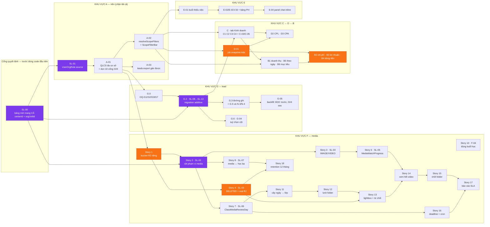

# KẾ HOẠCH SPRINT — TOÀN ĐỢT (A → F → G → C/D/B → E)

**Phạm vi:** toàn bộ spec `docs/specs/spec-dashboard-qlcs-duyet-media-lead.md` (7 khu vực A–G).
**Nguồn:** 7 PRD + 1 backlog + 1 kế hoạch migration + 1 rà soát bảo mật + bộ `documentation/`.
**Nhánh khảo sát của mọi PRD:** `hptkk29/runhop20_08`.

> Mọi khẳng định hiện trạng trong tài liệu này đều kèm `file:dòng`, dẫn lại từ các PRD đã đọc trực tiếp mã nguồn.
> Mọi con số công suất/vận tốc là **GIẢ ĐỊNH**, không phải số đo — xem §2.

---

## 1. Mục tiêu cả đợt + phạm vi

### 1.1 Mục tiêu

| # | Mục tiêu | Đo bằng gì |
|---|---|---|
| M1 | Một tài khoản QLCS giữ **N cơ sở** thì **xem được và làm việc được** ở cả N — không rò sang cơ sở thứ N+1 | e2e: `visibleCenterIds` đúng N phần tử; điểm danh + chốt buổi được ở cơ sở thứ hai (`A-nen-tang.md` §3) |
| M2 | **Bốn tab dashboard** (Tài chính · Kinh doanh · Chi phí Marketing · Tương tác KH) dùng **chung một** bộ lọc phạm vi và **chung một** resolver | grep: 4 tab đều gọi `resolveScopeFilters()` |
| M3 | Ảnh/video học viên **không còn tải được vô danh**, và **không media nào tới phụ huynh mà chưa có người bấm duyệt** | `curl` không cookie vào 5 object key → 403/404; grep: không còn tham số `autoApprove` |
| M4 | Dữ liệu lead tách đúng hai tầng **PH ↔ từng học sinh**, doanh số quy được về **đúng đứa con** | e2e: 1 PH – 2 con – 2 đơn → C-03 hiện 2 dòng, tổng khớp `Payment` |
| M5 | **14 metric** của C/D/B có nguồn số duy nhất, có test, và không tab nào hiện `0` khi nghĩa thật là "chưa có dữ liệu" | bảng §0.2 `CDB-dashboard.md` chuyển hết sang ✅ |
| M6 | QLCS mở được **cửa sổ chat ngay trên dashboard**, không rời trang, **không viết lại** component chat | diff của E-04 có **0 dòng** trong `components/chat/**` (trừ ngoại lệ §6.5.3 `E-tuong-tac.md`) |

### 1.2 Trong phạm vi đợt

Toàn bộ P0 của 7 khu vực + các P1 được ghim là **điều kiện cần** của một P0 khác (ví dụ: vá `lastActivityAt` là điều kiện cần của C-05; `Story 8` mốc học bạ là điều kiện cần của `Story 18` retention).

### 1.3 **NGOÀI** phạm vi đợt (đẩy sang sau, có lý do)

| Hạng mục | Vì sao ra ngoài | Nguồn |
|---|---|---|
| **F-02** nén video H.264/720p (Story 5) | Repo **không có** ffmpeg/sharp dùng được; chưa chốt chạy ở đâu (client / Vercel / dịch vụ ngoài). Chưa ước lượng được cho tới khi spike đóng | `F-media-stories.md` Story 5 [SPIKE]; `F-media.md` OQ-F3 |
| **Phase B** drop `Lead.childName`/`childAge` | Cần ≥14 ngày prod ổn định + 7 điều kiện đo được; và là **điểm không quay lại duy nhất** của cả G | `G-lead-migration-plan.md` §2.5 |
| Dọn object R2 **mồ côi lịch sử** (Story F-01-4) | Là việc rà kho, không phải vòng đời; cần dry-run + người vận hành chạy tay | `F-media.md` OQ-F6 |
| Google Ads (D-01-7), chi phí phân bổ theo tỷ lệ (B-03-6), tuỳ chọn cột cho bảng thứ hai (G-04-5/6) | P2 thuần | các PRD tương ứng |
| Viết lại `/admin/marketing/funnel` | Non-Goal 5 của D — chỉ **treo banner** một dòng JSX | `CDB-dashboard.md` D-00-2 |

### 1.4 Thứ tự thi công đã chốt

`A → F → G → C → D → B → E`, trong đó **G chạy song song được với F**, và **E chạy song song được với C/D** (spec `:196-200`). Chi tiết chỗ song song ở §5.

---

## 2. Giả định ước lượng — nói rõ cái gì là giả định

> 🔴 **KHÔNG CÓ dữ liệu vận tốc lịch sử.** Repo không có sổ sprint, không có burndown, không có bản ghi story-point nào của các đợt trước. Mọi con số dưới đây là **giả định để lập kế hoạch**, phải hiệu chỉnh lại sau **2 sprint đầu** bằng vận tốc đo được thật.

| # | Giả định | Giá trị | Ghi chú |
|---|---|---|---|
| GĐ-1 | Độ dài sprint | **2 tuần = 10 ngày làm việc** | Giả định |
| GĐ-2 | Quy đổi điểm | **1 điểm ≈ 1 ngày-người lý tưởng** | Giả định. Nhãn effort của backlog F quy đổi: **S = 2 · M = 3 · L = 5 · XL = 8** |
| GĐ-3 | Công suất hữu ích | **70%** của ngày lịch (họp, ngắt quãng, hỗ trợ vận hành) | Mặc định theo yêu cầu |
| GĐ-4 | Đệm việc phát sinh | **20%** trừ tiếp trên phần hữu ích | Mặc định theo yêu cầu |
| GĐ-5 | Gánh review/kiến trúc của Lead | thêm **20%** trừ riêng cho Lead | Giả định — Lead vừa code vừa review 2 người |
| GĐ-6 | Không có QA chuyên trách | Test do chính 3 dev viết; **test đỏ viết trước** đã tính vào điểm của từng hạng mục | Luật cứng Nền Hệ thống #5 (`CLAUDE.md`) |
| GĐ-7 | Migration PROD do **người vận hành chạy tay** | Không tính vào công suất dev, nhưng **chặn** tiêu chí kết thúc sprint | Luật cứng #4 (`CLAUDE.md`) |
| GĐ-8 | Nghiệm thu người thật (QLCS, kế toán, Marketing) | Không tính vào công suất dev; phải đặt lịch trước ≥1 sprint | Pre-mortem F T2, E-02 |

**Ba giả định có thể sai và làm vỡ kế hoạch — theo dõi từ sprint 1:**

1. **Khối lượng dữ liệu prod chưa đo.** Số object R2 thuộc `ClassSessionMedia`, số `Lead` phải backfill, số dòng `AdsInsightDaily` — cả ba đều là "chưa đo" trong các PRD (`F-media-stories.md` Story 1 spike; `G-lead-migration-plan.md` `G05-T21` giả định 200.000 lead; `D01-premortem.md` cổng A6). Sai một bậc độ lớn là đổi hẳn ước lượng của Story 1, G-05a, D.3.
2. **`test.satarobo.vn` và máy local dùng CHUNG một DB** (`CLAUDE.md`) ⇒ không có môi trường thứ ba để chạy song song hai nhánh migration.
3. **Cron không chạy trên environment `test`** của Vercel, và creds Meta/SePay chỉ ở scope Production (`D01-premortem.md` E-03) ⇒ **lần chạy thật đầu tiên của D-01 là trên prod**. Mọi ước lượng "test xong rồi bật" đều sai bản chất ở khu vực D.

---

## 3. Công suất đội

| Thành viên | Vai | Ngày khả dụng/sprint | Điểm/sprint | Ghi chú |
|---|---|---|---|---|
| **Lead** | Kiến trúc + review; gánh schema / quyền / migration | 10 ngày lịch → **7,0** ngày hữu ích (70%) | **4,5** | Trừ tiếp 20% đệm và 20% review/kiến trúc/hỗ trợ. Là người **duy nhất** ký migration và ký quy ước SL-00/SL-01 |
| **Senior** | Backend · job/cron · truy vấn · script migration | 10 → **7,0** | **5,5** | Trừ 20% đệm |
| **Frontend** | UI/UX · component dùng chung · a11y · mobile 375px | 10 → **7,0** | **5,5** | Trừ 20% đệm |
| **Tổng đội** | | **21,0 ngày hữu ích** | **15,5 → cam kết 15** | Tương đương ~50% của 30 ngày-người lý thuyết |

**Tổng công suất đợt:** 18 sprint × 15 điểm = **270 điểm cam kết**, để phủ **~240 điểm** hạng mục đã bóc + đệm.

**Tổng khối lượng theo khu vực (điểm):**

| Khu vực | Điểm | Tỷ trọng | Ghi chú |
|---|---|---|---|
| **V — vá lỗi đang có** | ~14 | 6% | Phần lớn nằm lồng trong các khu vực, xem §6.0 |
| **A — nền phạm vi & quyền** | 20 | 8% | Chặn tất cả |
| **F — media** | 62 | 26% | Khối lớn nhất; đã trừ Story 5 (transcode) |
| **G — lead** | 42 | 18% | Trong đó G-05 migration chiếm 18 |
| **C — kinh doanh** | 22 | 9% | |
| **D — chi phí marketing** | 33 | 14% | Toàn bộ đường ghi hiện là **MÃ CHẾT** — là **xây mới** |
| **B — tài chính** | 32 | 13% | Hệ thống **chưa có khái niệm "chi"** |
| **E — tương tác KH** | 18 | 8% | |
| **Tổng** | **~243** | | |

---

## 4. 🔴 BẢN ĐỒ PHỤ THUỘC

### 4.1 Ràng buộc GIỮA CÁC KHU VỰC (đã ghi trong PRD, không phải suy đoán)

| # | Chặn | Bị chặn | Bằng chứng |
|---|---|---|---|
| P-1 | **A** (toàn bộ) | B, C, D, E | Spec `:196` "A chặn tất cả phần còn lại" |
| P-2 | **A-02** `resolveScopeFilters()` | **cả 4 tab** | `CDB-dashboard.md` CHUNG-3 + §0 ràng buộc 4: `resolveScopeFilters` **CHƯA CÓ** (grep = 0); chỉ có `resolveReportFilters` với `centerId` **đơn trị** (`lib/reports/filters.ts:11`) |
| P-3 | **SL-00** (quy ước `centerId` + `orgUnitId` cho bảng mới) | **MỌI bảng mới của F và G** | `A-nen-tang.md` §10 SL-00: `injectScope` **chỉ** chèn `centerId: { in: [...] }` (`lib/db-scope.ts:277-279`) cho tới khi bật cutover ⇒ bảng chỉ có `orgUnitId` sẽ **không bao giờ được lọc**. F + G đẻ **≥5 bảng mới** |
| P-4 | **SL-01** (`UserOrgRole.source`) | **A-01**, và qua A-01 chặn **F** và **G** | `A-nen-tang.md` §10.1 + §6.1: `reconcileUserOrgRoles` suy `prevPlan` từ **một** đơn vị neo cũ (`lib/auth/legacy-role-map.ts:96-122`), schema **không có cột ghi nguồn dòng** ⇒ dòng gán tay bị `EXPIRED` khi ai đó chỉ đổi ô "Đơn vị" (`users/_actions.ts:363-380`, `nhan-su/actions.ts:377` → `lib/hr/sync-employee-unit.ts:77-89`). Cấu hình đa cơ sở mục nát ⇒ **mọi nghiệm thu F/G cho QLCS đa cơ sở đều là ảo** (`F-media.md` §8.1) |
| P-5 | **SL-02** (`ClassSessionMedia`+`MediaStudentTag` mang cột phạm vi) | **MỌI thứ còn lại của F** | `F-media.md` §8.1: "điều kiện cần tuyệt đối". Hai model **không có** `centerId`, **không có** `orgUnitId`, **không nằm trong** `SCOPED_MODELS` lẫn `SCOPE_EXEMPT` (grep `lib/db-scope.ts` = 0 hit) ⇒ `injectScope` thoát ngay ở `lib/db-scope.ts:269` và trả args nguyên vẹn |
| P-6 | **G** (schema lead) | **C** | `CDB-dashboard.md` §0 ràng buộc 3 + CHUNG-2: C đếm theo **học sinh**, mà `LeadChild` (`prisma/schema.prisma:1461-1483`, 14 trường) **không có** `status` / `closedAt` / `centerId` |
| P-7 | **C** (C1 tổng lead, C3 lead chốt) | **D2 CPL, D3 CPA** | `CDB-dashboard.md` §0 ràng buộc 1: `computeCpl(spend, l2)` / `computeCpa(spend, l3)` (`lib/crm/marketing-metrics.ts:26-27`) lấy mẫu số từ C |
| P-8 | **D-01** (job snapshot ads) | **D2, D3, D-03, D-08** | `CDB-dashboard.md` D.8 bước D.8; toàn bộ đường ghi ads là **MÃ CHẾT** (`lib/crm/ads-insights.ts:78`, `:52` — call-site sản phẩm = 0) |
| P-9 | **C và D** | **B** | `CDB-dashboard.md` §0 ràng buộc 2: chi phí quảng cáo là **một đầu phí** của B2; dựng bảng chi phí trước rồi D đẻ bảng ads riêng ⇒ **B3 trừ hai lần**. B.8 bước B.11 phụ thuộc **D.7** |
| P-10 | **A-02** | **E** (chỉ vậy) | `E-tuong-tac.md` §8.1: E **không** bị F/G chặn và **không** chặn ai; chỉ phụ thuộc A-02 (bộ lọc), A-02-7 (chưa bật "Tất cả cơ sở"), A-01 (QLCS đa cơ sở) |

### 4.2 Ràng buộc **TRONG** từng khu vực

| Khu vực | Chuỗi bắt buộc | Bằng chứng |
|---|---|---|
| **A** | SL-00 → SL-01 → A.1 (test đỏ) → A-01 → A-02 → A-03 → cập nhật `documentation/` | `A-nen-tang.md` §8 |
| **F** | Story 1 (bucket) → Story 2 (SL-02) → Story 3 (SL-04) → Story 4 (SL-03 xoá R2) → Story 7 (SL-06) → Story 11 (cây folder) → Story 12 (lưới) → Story 13 (lightbox) → Story 14 (xem hết video) → Story 15 (chốt folder) → Story 17 (SLA). Nhánh rẽ: Story 3 → Story 6 (SL-05) → Story 14; Story 2 → Story 8 (SL-07) → Story 18 (retention); Story 7 → Story 16 (deadline+cron) | `F-media-stories.md` Story Map §Must-have; `F-media.md` §8.2 |
| **G** | G.0 (4 quyết định) → G.1 (test đỏ) → G.2 (migration additive) → G.3 (đường ghi) → G.4/G.5/G.6 → G-05 (backfill: **đọc trước, ghi sau**) | `G-lead.md` §9; `G-lead-migration-plan.md` §2.6 |
| **C** | C.0 (4 OQ + đo lệch prod) → [A-02, G.2] → C.3 test đỏ → C.4 `lead-kpi.ts` thuần → C.6 `LeadTarget` → C.7 tab C → C.8 bảng C-03/C-05 → C.9 | `CDB-dashboard.md` C.8 |
| **D** | D.0 (4 OQ) → D.1 **ban hành SR.QD.232** → D.2 test đỏ → D.3 migration → D.4 parser + meta-client → D.5 job → D.7 resolver → D.8 (**cần C.7**) → D.9 | `CDB-dashboard.md` D.8 |
| **B** | B.0 (đo prod + 4 OQ) → B.3 `revenue.ts` → B.5 vá target → B.6 (B1+B5+B6) → B.8 migration chi phí → B.9/B.10 → B.11 (**cần D.7**) | `CDB-dashboard.md` B.8 |
| **E** | E.0 (OQ-1/2/3) → E.1 test đỏ → E.2 (E-01) ∥ E.3 (E-02) → E.4 (E-03) → E.5 (E-04 panel) → E.6 nghiệm thu tay | `E-tuong-tac.md` §8.2 |

### 4.3 Sơ đồ phụ thuộc



**Lịch theo sprint (gantt):**

```mermaid
gantt
    title Lộ trình 18 sprint (2 tuần/sprint) — nút thắt là CÔNG SUẤT, không phải phụ thuộc
    dateFormat X
    axisFormat S%s
    section Cổng
    SL-00 + SL-01              :done, g1, 0, 1
    section A (chặn tất cả)
    A-01 + A-02 + A-03         :a1, 0, 2
    section F (media)
    Nhóm 0 — hạ tầng chặn đường :f1, 2, 3
    Trang duyệt + chốt folder   :f2, 5, 4
    SLA + retention             :f3, 8, 2
    section G (lead) — song song F
    Schema + đường ghi          :gg1, 5, 3
    G-05 backfill               :gg2, 9, 1
    section C
    Tab Kinh doanh              :c1, 10, 2
    section D
    Job Ads + phân bổ           :d1, 12, 3
    section B
    Doanh thu + chi phí         :b1, 15, 3
    section E — song song C/D
    E-01…E-04                   :e1, 11, 4
```



---

## 5. 🔴 ĐƯỜNG GĂNG

### 5.1 Chuỗi dài nhất

```
SL-00 → SL-01 → A-01 → A-02 → G.0 → G.2 (SL-08/09/09b) → G.3 (đường ghi)
      → C.4 (lead-kpi.ts) → C.7 (C1 · C3) → D.8 (CPL · CPA) → B.11 (B2 · B3 · B4)
```

| Mắt xích | Điểm | Vì sao không bỏ qua được |
|---|---|---|
| SL-00 | 1 | Sai nó thì **5 bảng mới** của F+G phải làm lại, và sửa sau = migration trên bảng đã có dữ liệu prod (luật cứng #4) |
| SL-01 | 3 | Không có nó, cấu hình đa cơ sở bị phá bởi **một thao tác không nhằm thu hồi quyền** (`A-nen-tang.md` §6.1) |
| A-01 | 6 | Bao gồm dọn **~10 cổng** dạng `record.centerId === user.centerId` — nếu bỏ, "QLCS 2 cơ sở XEM được lớp CS2 nhưng KHÔNG điểm danh / chốt buổi được" (`A-nen-tang.md` RT-1) |
| A-02 | 8 | Đầu vào của **cả 4 tab** (CHUNG-3) |
| G.0 + G.2 + G.3 | 11 | `LeadChild` là **đơn vị sinh doanh thu** của C-03; `Order` **không có** `leadChildId` (`prisma/schema.prisma:3687`) |
| C.4 + C.7 | 7 | Mẫu số của D2/D3 |
| D.0…D.8 | 22 | Toàn bộ đường ghi ads là **MÃ CHẾT** ⇒ là **xây mới**, không phải "gọi lại hàm có sẵn" (`D01-premortem.md` E-01) |
| B.8…B.11 | 16 | "Hệ thống **không có khái niệm chi**": 207 model, grep `expense` = **0 kết quả** (`CDB-dashboard.md` B.1) |
| **Tổng đường găng** | **~74 điểm** | ≈ **10,5 sprint** nếu **một** người làm liên tục; ≈ **21 tuần** |

### 5.2 🔴 Kết luận quan trọng nhất của mục này

> **Đường găng dài ~10,5 sprint, nhưng kế hoạch dài 18 sprint. Nút thắt là CÔNG SUẤT (243 điểm / 15 điểm mỗi sprint), không phải phụ thuộc.**

Hệ quả cho việc điều hành:

- Thêm người **rút ngắn được** đợt này (không phải bài toán "9 phụ nữ đẻ 1 con trong 1 tháng") — nhưng chỉ trong các nhánh **ngoài** đường găng: F, E, và phần UI của B/D.
- Cắt phạm vi **trên đường găng** (A, G, C) hầu như **không** rút ngắn được gì, vì mỗi mắt xích đều là điều kiện cần của mắt sau.
- Cắt phạm vi **ngoài** đường găng (F, E) rút ngắn thật — nhưng F chính là khối có **cổng pháp lý hình ảnh trẻ em**. Đây là căng thẳng phải nói ra ở cấp quản lý, không giải bằng kỹ thuật (`F-media-stories.md` Elephant **E5**).

### 5.3 Chỗ chạy SONG SONG được (và điều kiện)

| # | Song song | Điều kiện | Rút ngắn ước tính |
|---|---|---|---|
| SS-1 | **F ∥ G** | Spec `:198` cho phép. Điều kiện: **SL-00 và SL-01 đã đóng**; Lead review cả hai migration; **không** trộn migration F và G trong cùng một lần chạy prod | ~4 sprint |
| SS-2 | **E ∥ C/D** | E chỉ cần A-02 (`E-tuong-tac.md` §8.1). Điều kiện: Frontend làm E trong lúc Senior làm C/D backend | ~3 sprint |
| SS-3 | **D.6 (màn mapping D-07) ∥ D.5 (job D-01)** | Cả hai chỉ cần D.3 (migration). Màn mapping không cần job chạy | ~1 sprint |
| SS-4 | **B.8–B.10 (khái niệm chi phí) ∥ D** | `CostEntry`/`CostCategory` **không** phụ thuộc D; chỉ **B.11** mới cần D1 | ~1,5 sprint |
| SS-5 | **Story 10 (F-04 đúng buổi) ∥ mọi thứ** | "chạy được **ngay** trên schema hiện tại, không chờ story nào" (`F-media-stories.md` Story 10). Là lỗ **đang mở trên prod** | — (làm sớm, không rút lịch nhưng đóng rủi ro sớm) |
| SS-6 | **Việc ngoài code (§9) ∥ toàn bộ** | Ban hành SR.QD.232, chốt danh mục, pháp lý ảnh trẻ em — **phải khởi động ngay sprint 1**, nếu không sẽ chặn D.1 và Story 18 | ~2 sprint (nếu làm trễ thì mất) |

**Nếu KHÔNG khai thác SS-1…SS-4:** đợt kéo dài thêm **~9,5 sprint** (≈19 tuần).

---

## 6. Phân chia theo sprint

**Ký hiệu người:** `L` = Lead · `S` = Senior · `F` = Frontend.
**Ký hiệu rủi ro:** 🔴 cao (mất dữ liệu / rò PII / sai số liệu im lặng) · 🟠 trung bình · 🟢 thấp.

---

### 6.0 🔴 NHÓM V — VÁ LỖI ĐANG CÓ (không phải tính năng mới)

Các PRD chỉ ra rằng nhiều hạng mục là **lỗi đang chạy trên prod**, không phải việc mới. Nhóm này tách riêng vì hai lý do: (a) ước lượng cho "vá" khác hẳn "xây"; (b) một số **phải vá TRƯỚC** khi xây tính năng đứng lên trên nó — xây trước là xây trên nền sai và phải làm lại.

| Mã | Lỗi đang có | Bằng chứng | 🔴 PHẢI vá TRƯỚC | Sprint | Điểm |
|---|---|---|---|---|---|
| **V-01** | `Lead.lastActivityAt` bỏ sót **12/15** đường ghi; và `sla.ts:132` truyền `lead.updatedAt` (là `@updatedAt`, reset mỗi lần chạm record) thay vì `lead.lastActivityAt` ⇒ rule `SLA-4` **không bao giờ nổ** | 15 chỗ tạo `LeadActivity` liệt kê ở `CDB-dashboard.md` §C.2.5; chỉ 3 chỗ bump: `app/(admin)/admin/leads/actions.ts:346`, `:395`, `:431`. `lib/crm/sla.ts:117,132,156`; `prisma/schema.prisma:1373` | **C-05** (cột "số ngày chưa tiếp cận lại") và **C-05-4** | S7 | 3 |
| **V-02** | `funnel-query.ts:15` gom `spend` bằng `db` **trần**, `aggregate` **không có `where`** ⇒ QLCS **hiện đã** xem được chi phí quảng cáo **toàn hệ thống**; trang chỉ gác `leads:view-all` mà `CENTER_MANAGER` đã có | `lib/crm/funnel-query.ts:15`; `app/(admin)/admin/marketing/funnel/page.tsx:18`; `prisma/seed-roles.ts:400-403` — `A-nen-tang.md` §9/RT-2, `D01-premortem.md` IM-11/T-09 | **D** (mọi metric chi phí) | S1 | 2 |
| **V-03** | **Xoá media chưa bao giờ đụng R2** — `deleteMedia` chỉ xoá row DB, `deleteDraftMedia` cũng vậy; chú thích tự khai điều đó | `app/(admin)/admin/media/actions.ts:440`; `lib/lms/media-publish.ts:308-310`, `:12`, `:283-286` | **F-03, F-15, Story 13, Story 18** | S4 (trong Story 4) | — |
| **V-04** | Cờ `isClassWide` **bỏ qua hoàn toàn** kiểm tra consent ⇒ trẻ đã **thu hồi** đồng ý vẫn xuất hiện trong ảnh gửi cho mọi gia đình khác | `security-media.md` phát hiện 7 (`lib/lms/media-publish.ts` + `app/(admin)/admin/media/actions.ts`) | **Story 10, cổng B pháp lý** | S3 (cùng Story 10) | 2 |
| **V-05** | **F-04 chưa được áp**: đường đọc của PH **không lọc** `classSessionId` ⇒ học viên chỉ dự buổi 5 vẫn thấy ảnh buổi 3 (lộ chéo trong cùng lớp) | `lib/portal/photos.ts:29-41` (`classSessionId` chỉ dùng gom nhóm `:46-70`); `app/(portal)/portal/hinh-anh/page.tsx:58-79` | **F-04, F-04-2, cổng B5** | S3 (Story 10) | 3 |
| **V-06** | `lib/pending-tasks.ts` đếm ảnh chờ duyệt bằng `db` **trần**, lọc cơ sở **chỉ khi** actor là `CENTER_MANAGER` thuần và dựa `user.centerId` **đơn trị**, trần `take: 50` ⇒ vai khác đếm ảnh `PENDING` của **mọi** cơ sở | `lib/pending-tasks.ts:1`, `:109-116`, `:202-233`, `:204`, `:217`; `security-media.md` phát hiện 10; pre-mortem F **T10** | **F-13-4**, và **E-01** (nếu tái dùng `sessionIncomplete`) | S5 | 2 |
| **V-07** | Dedup nhập tay so khớp **chuỗi đúng-bằng** ⇒ SĐT đã tồn tại dạng `0…` không bắt được khi nhập `84…` | `app/(admin)/admin/leads/actions.ts:596`, `:731` vs `lib/lead/dedup.ts:18` → `lib/phone.ts:112` | **G-05 backfill** (nhóm trùng SĐT) | S7 | 2 |
| **V-08** | `revenue-target-data.ts:24-25` **bỏ qua** mục tiêu từng cơ sở khi actor cấp HO | `lib/reports/revenue-target-data.ts:24-25` | **B6** (tỷ lệ hoàn thành) | S16 | 2 |
| **V-09** | Doanh thu tính **3 chỗ lặp** và **bỏ sót hoàn tiền + điều chỉnh**; hoàn tiền không trừ doanh thu/công nợ/portal; `ADJUSTED` bị bỏ qua im lặng | `flows.md` §8 mục 8, 9; `lib/finance/payment.ts:600-632`, `:541-557`; `lib/finance/debt.ts:134`; `lib/portal/billing.ts:117-119` | **B1, B3, B4, C-03-2** | S16 (trong B.3) | — |
| **V-10** | `syncMetaAds` nhét `access_token` vào **query string** ⇒ lọt vào log, Sentry (`beforeSend` chỉ xoá headers/cookies, **không** scrub URL của span), trace, mọi proxy | `lib/crm/ads-insights.ts:93`; `sentry.server.config.ts:18`, `:22-32` — `D01-premortem.md` **T-06** | **D.5** (job chạy thật) | S13 (trong D.4) | — |
| **V-11** | `reviewMedia` chỉ chặn `DRAFT` ⇒ **`APPROVED → REJECTED` và `REJECTED → APPROVED` đang LỌT** ở server (UI ẩn nút nhưng action vẫn nhận payload) | `app/(admin)/admin/media/actions.ts:401-407`; UI `media-client.tsx:769`, `:788` | **F-03-4, Story 15** | S4 | 2 |
| **V-12** | Người mang `media:approve` upload là ảnh `APPROVED` **ngay** ⇒ không có cặp mắt thứ hai, `MediaWatchProgress` không sinh, `ClassMediaReviewDay` không tạo, `approvedAt ≈ createdAt` làm SLA **đẹp giả**. Nặng hơn: `media:approve` seed **GLOBAL cho `CENTER_MANAGER`** — đúng vai bị ràng buộc lại là vai đi vòng được | `app/(admin)/admin/media/actions.ts:337`, `:345`, `:351-353`, `:573`; `lib/lms/media-publish.ts:118-119`, `:218`, `:239-241`; `prisma/seed-roles.ts:449` | **Story 15, Story 17 (F-30/F-32)** | S4 | 2 |
| **V-13** | Trang duyệt **phẳng, trần 100 dòng + trần 200 lớp**, không phân trang ⇒ ảnh `PENDING` cũ hơn 100 dòng gần nhất **không bao giờ hiện ra** | `app/(admin)/admin/media/page.tsx:29-34`, `:40-55`, `:45`, `:51`; pre-mortem F **T6** | **F-16** (lớp không bao giờ đóng được) | S4 (tạm) → S6 (Story 11 thay hẳn) | 2 |
| **V-14** | `DELETE /api/admin/upload-delete` nhận **`key` thô từ client**, gác quyền bằng **chuỗi role** ⇒ quản lý cơ sở xoá được **object bất kỳ** dưới `uploads/`, kể cả của cơ sở khác | `app/api/admin/upload-delete/route.ts:21-24`; `security-media.md` phát hiện 4 | **Story 4** (không được để F gọi vào route này) | S3 | 2 |
| **V-15** | `canEditAds` so `roleCode === "HO_MARKETING"` **inline** — trái luật cứng #1. Lint `no-inline-authz` **không bắt được** vì glob chỉ phủ `app/**`, file nằm ở `lib/` | `lib/crm/ads-insights.ts:44-49`; `eslint.config.mjs:115-121` — `D01-premortem.md` **F-07** | **D-07** (màn mapping) | S6 | 1 |
| **V-16** | `leads:export` là **key chết** — không call-site enforce nào; endpoint export gác bằng `leads:view-all` ⇒ **bất kỳ ai đọc được danh sách lead đều xuất được file**. Thêm: `take: 5000` cắt **im lặng** | grep `leads:export` trên `app/` = 0 (`flows.md` §8 mục 17); `app/api/admin/leads/export/route.ts:29`, `:55` | **A-03, G-03, C-04** | S2 (trong A-03) | — |
| **V-17** | `resolveReportFilters` parse hai đầu ngày bằng **hai cách khác nhau** ⇒ bộ lọc "tháng 8" **mất** giao dịch 00:00–07:00 giờ VN ngày 01/08 và **ăn nhầm** giao dịch cùng khung ngày 01/09 | `lib/reports/filters.ts:35-44` — `CDB-dashboard.md` §0.1 | **B5** (doanh thu theo ngày) và 8 trang `/bao-cao/*` đang dùng | S1 | 1 |
| **V-18** | Địa chỉ / tỉnh-TP / mã NV nhập lead bị **nhét vào `Lead.note`** dạng text; `note` lại nằm trong `sensitiveFields` và bị `maskFreeText` ⇒ người không có quyền PII **mất luôn cả địa chỉ lẫn mã NV** dù hai thứ đó không phải PII | `lib/lead/intake/map-sale-form.ts:122`, `:127`, `:130`; `lib/permissions/registry/crm.ts:15`; `lib/lead/pii.ts:26,30,50` — nợ **N-1** | **G-01-1**, và báo cáo theo địa bàn | S7 (G.3) + S11 (bóc note) | — |
| **V-19** | **"Người nhập lead" bị trộn với "sale phụ trách"**: `ingest.ts:157` trả `assignedToId` từ chính mã NV trên phiếu; mã NV **không** lưu ở cột riêng nào — chỉ nằm trong `note` | `lib/lead/intake/ingest.ts:157`, `:352`, `:106`, `:148-153` — nợ **N-2** | **G-01-2** | S7 (G.3) | — |

> **Đọc bảng này thế nào.** Cột "PHẢI vá TRƯỚC" là ràng buộc **cứng**: xây tính năng lên trên một dòng chưa vá thì tính năng đó **nghiệm thu xanh mà số vẫn sai**. Ví dụ điển hình: làm C-05 (cột "số ngày chưa tiếp cận lại") trước khi vá **V-01** sẽ cho ra một cột hiển thị **số nhỏ giả tạo** — đúng thứ QLCS dùng để soi lead treo (`CDB-dashboard.md` §C.2.5).

**Tổng nhóm V tính riêng:** ~14 điểm (phần còn lại nằm lồng trong hạng mục của khu vực tương ứng, đánh dấu `—`).

---

### Sprint 1 — Cổng quyết định + mở nền A

**Mục tiêu:** đóng hai quyết định chặn toàn đợt (SL-00, SL-01), có test đỏ của A, và bịt lỗ rò chi phí quảng cáo đang mở.

| # | Hạng mục | Khu vực | Điểm | Người | Phụ thuộc | Rủi ro |
|---|---|---|---|---|---|---|
| 1 | ✅ **SL-00 — ĐÃ CHỐT 24/08/2026 (quyết định B1):** bảng mới mang **cả** `centerId` + `orgUnitId`. Việc còn lại chỉ là **viết vào `documentation/`** trước dòng code đầu tiên của F và G | A | 0,5 | L | — | 🟢 Câu hỏi đã đóng; đừng mở lại. Bảng không phải dữ liệu theo đơn vị (`UserTablePreference`, `AdsSyncRun`) vẫn **không mang cột nào** và phải ghi lý do vào chú thích schema |
| 2 | 🔴 **SL-01 (GẤP)** — thêm `UserOrgRole.source` (`AUTO`/`MANUAL`, additive nullable + backfill); nhánh thu hồi `reconcileUserOrgRoles` **chỉ** đụng dòng `source = AUTO` | A | 3 | L | SL-00 | 🔴 **Mức độ đổi 24/08/2026:** chủ dự án xác nhận prod **đang có** cấu hình đa cơ sở gán tay (OQ-5) ⇒ lỗ hổng này **đang mở**: một thao tác đổi ô "Đơn vị" ở `users/_actions.ts:363-380` hoặc `nhan-su/actions.ts:377` là xoá mất cấu hình đó, **không** nhằm thu hồi quyền. Làm **trước** khi đụng hai màn đó |
| 3 | **A.1 test đỏ** — e2e QLCS 2 cơ sở **khác REGION** · e2e chống IDOR bộ lọc (`?center=` ngoài phạm vi) · e2e 403 export | A | 3 | S | — | 🟠 Chưa có test đỏ thì chưa được viết Server Action (luật cứng #5) |
| 4 | **V-02** — vá `funnel-query.ts:15`: thêm `where` + lọc theo `getVisibleCenterIds(actor)` (không dùng `db` trần) | V | 2 | S | — | 🔴 Rò **đang xảy ra**: QLCS xem được chi phí QC toàn hệ thống |
| 5 | **A-01 (UI)** — form gán vai: **chặn cứng** neo `CENTER_MANAGER` tại `OrgUnit` type `HO`/`ROOT` + hiện số cơ sở đang giữ + cảnh báo "cần đăng xuất/đăng nhập lại" | A | 3 | F | SL-01 | 🔴 Một dòng vai tại HO/ROOT ⇒ `isHoLevel` ⇒ thấy **mọi** cơ sở (`lib/auth/actor.ts:255`, `:278-281`) |
| 6 | **V-17** — vá lệch giờ VN ở `resolveReportFilters` (neo cả hai đầu vào `Asia/Ho_Chi_Minh`) | V | 1 | F | — | 🟠 Đang sai trên 8 trang `/bao-cao/*` |
| 7 | Dựng **REGION thứ hai** + tài khoản QLCS 2 cơ sở khác vùng trong dữ liệu test | A | 2 | S | — | 🟠 Seed chỉ có **một** REGION `DANANG` (`prisma/seed-orgunit.ts:44-51`); `OrgAnchor` **không có** `REGION` (`lib/auth/legacy-role-map.ts:13`) |
| | **Tổng** | | **15** | | | |

**Tiêu chí kết thúc sprint 1**
- [ ] ✅ SL-00 **đã ký 24/08/2026** (cả hai cột). 🔴 **SL-01 chưa ký và nay là việc GẤP** (prod đang có cấu hình đa cơ sở gán tay — OQ-5). Cả hai phải **ghi vào `documentation/`** — không ai được mở migration F hoặc G trước mốc này.
- [ ] 🔴 **Đã đo prod** (§6.9 Đ1–Đ4), trong đó **Đ4** xác nhận anh Phúc **chưa** bị rớt khỏi nhóm chat lớp của cơ sở thứ hai; **script backfill `UserOrgRole`** đã dry-run (việc mới từ OQ-5).
- [ ] 🔴 **Đã có tài khoản QLCS thuần** (không `SUPER_ADMIN`) giữ 2 cơ sở **khác vùng** để UAT/e2e A-01 — nghiệm thu bằng tài khoản anh Phúc là **xanh giả** (V-7).
- [ ] 🔴 **3 rào R1/R2/R3** cho `roles:assign` của `HO_HR` đã có test, và lịch **chạy `seed-prod-roles.yml`** sau merge lên `main` đã ghi vào runbook (việc mới từ OQ-7).
- [ ] Migration SL-01 chạy dry-run xong, người vận hành đã chạy tay trên prod (luật cứng #4).
- [ ] 3 bộ e2e của A **đỏ** (chưa xanh — đúng ý đồ).
- [ ] `curl`/truy vấn xác nhận QLCS cấp cơ sở **không còn** đọc được `spend` toàn hệ thống.
- [ ] `pnpm typecheck && pnpm lint && pnpm build` PASS.
- [ ] **§9**: ✅ `SR.QD.232` **đã ban hành** (áp dụng 23/08/2026) · ✅ pháp lý ảnh trẻ em — chủ dự án **chấp nhận rủi ro** (B7, 24/08) · ⚠️ Cấu hình vận hành: ngưỡng lead treo = 2 ngày (thiếu mức đỏ), lý do rớt **bỏ danh mục**, ⏳ **còn danh mục nguồn lead**.

---

### Sprint 2 — Đóng khu vực A: bộ lọc dùng chung + quyền export

**Mục tiêu:** giao **khung lọc** và **khung quyền** cho B/C/D/E; QLCS đa cơ sở **làm việc được** ở cơ sở thứ hai.

| # | Hạng mục | Khu vực | Điểm | Người | Phụ thuộc | Rủi ro |
|---|---|---|---|---|---|---|
| 8 | **A-02 (server)** — `resolveScopeFilters()` + kiểu `ScopeFilters` **MỚI** cạnh `resolveReportFilters` (không sửa hàm cũ) + khoá cache mới gồm mảng `centerIds` **đã sắp xếp** | A | 3 | L | S1 | 🔴 Đổi kiểu `ReportFilters.centerId` vỡ **11 chỗ đọc / 8 page** + **1 đường GHI** mục tiêu doanh thu. Quên khoá cache ⇒ **trộn cache, sai số liệu im lặng 120s** |
| 9 | **A-02 (UI)** — `components/admin/scope-filter-bar.tsx` multi-select (**không** thêm thư viện) + 2 ô `<input type="date">` + khung 4 tab ở `app/(admin)/admin/dashboard/` | A | 5 | F | #8 | 🟠 Repo **chưa có** multi-select; `select.tsx`/`combobox.tsx` dựng trên **Base UI**, không phải Radix — đừng dán snippet shadcn/Radix |
| 10 | **A-03** — call-site export yêu cầu **CẢ HAI** `leads:view-all` **AND** `leads:export`; gỡ khỏi `prisma/seed-roles.ts:229`, `:411`; **giữ nguyên key** trong `PERMISSIONS` chỉ làm rỗng danh sách role; tạo `UserGroup` + `PermissionGrant`; **chặn cứng `leads:*`** ở màn per-user; báo rõ khi chạm trần 5000 | A / V-16 | 3 | S | S1 | 🔴 Thay (không AND) `leads:view-all` ⇒ người neo vai tại HO không có `leads:*` nào rơi vào nhánh `isHoLevel → "ALL"` (`lib/db-scope.ts:256-262`) ⇒ **xuất lead toàn hệ thống**. Xoá key khỏi `PERMISSIONS` ⇒ mọi grant mang key bị vứt im lặng + CI đỏ |
| 11 | **A-01-6** — dọn cổng **GHI**: `canManageSessionClass` (`app/(admin)/admin/sessions/[id]/_actions.ts:38`), `students/[id]/_actions.ts:27`, `lib/lms/skill-access.ts:19` chấp nhận mọi cơ sở trong `actor.visibleCenterIds` | A | 3 | S | S1 | 🔴 Không làm ⇒ QLCS 2 cơ sở **xem được lớp CS2 nhưng không điểm danh / chốt buổi được** |
| 12 | Cập nhật `documentation/permissions.md` + `flows.md` phần A | A | 1 | L | #8–#11 | 🟢 Luật cứng #10 |
| | **Tổng** | | **15** | | | |

**Tiêu chí kết thúc sprint 2**
- [ ] 3 e2e của A chuyển từ **đỏ → xanh**.
- [ ] grep: 4 tab đều gọi `resolveScopeFilters()`; **không** trang `/bao-cao/*` nào bị đụng.
- [ ] e2e: QLCS 2 cơ sở **điểm danh + chốt buổi** thành công ở cơ sở thứ hai.
- [ ] e2e: QLCS không thuộc nhóm quyền → gọi endpoint export trả **403**.
- [ ] Sau merge `test` → `main`: **đã chạy `seed-prod-roles.yml`** (gỡ `leads:export` khỏi 2 role trên prod).
- [ ] Ghi rõ trong `documentation/`: chốt quy ước URL `?center=`; ~14 trang khác vẫn dùng `?centerId=` và **không** đổi trong đợt này.

---

### Sprint 3 — F cổng pháp lý: bucket riêng + cột phạm vi media

**Mục tiêu:** đóng **T1** của pre-mortem F (bucket công khai) và **T9** (F-04 lộ ảnh chéo) — hai lỗ **đang mở trên prod**.

| # | Hạng mục | Khu vực | Điểm | Người | Phụ thuộc | Rủi ro |
|---|---|---|---|---|---|---|
| 13 | **SPIKE bucket** — đếm object + dung lượng `uploads/images/` thuộc `ClassSessionMedia`; `CopyObject` server-side hay phải tải về; `keyFromPublicUrl` xử được cả URL lẫn key chưa; TTL bao nhiêu để PH mở album 200 ảnh không hết hạn giữa chừng | F/S1 | 2 | L | A xong | 🔴 Chưa có số ⇒ ước lượng Story 1 chưa đáng tin |
| 14 | **Story 1** — `lib/storage/class-media-storage.ts` fail-closed (throw khi env trống **và** khi trùng `R2_BUCKET_NAME`) + presign upload/GET riêng + `fileUrl` chuyển sang object key + `buildMediaObjectKey` (gỡ **mã chết** `lib/lms/media-key.ts:8-15`) + script di trú **dry-run mặc định** | F | 5 | L+S | #13 | 🔴 **T1/T7**: `.env.example:91-93` ghi thẳng "MỌI object tải được vô danh qua `https://cdn.satarobo.vn/<key>`"; key sinh từ **tên file người dùng** (`app/api/admin/upload-url/route.ts:109-119`) ⇒ tên trẻ nằm trên URL vĩnh viễn. Bật `MEDIA_SIGNED_URL` **không cứu được** (`lib/flags.ts:80-82`, `lib/storage/signed-url.ts:38`) |
| 15 | **Story 2 · SL-02** — `ClassSessionMedia` + `MediaStudentTag` thêm `centerId?`/`orgUnitId?`; khai `SCOPED_MODELS` (`lib/db-scope.ts:11`) **và** `BACKFILL_SPECS` (`lib/org/center-bridge.ts:45`) **và** `getModelPrefixes`; index `[centerId, status]`, `[centerId, createdAt]`; backfill từ `Class.centerId`; vá mọi đường `create` tự set `centerId` | F | 3 | S | #14 | 🔴 Quên `BACKFILL_SPECS` ⇒ test `[US-07-IT-08b]` đỏ; quên `getModelPrefixes` ⇒ **fail-open** `isHoLevel → "ALL"` (đã cháy 1 lần với `Attendance` — `lib/db-scope.ts:176-180`). `scopedDb` **không che write** (`:2`, `:291`) |
| 16 | **Story 10 (V-05 + V-04)** — F-04 "đúng buổi học" ở **cả hai** đường đọc portal + vá nhánh `isClassWide` bỏ qua consent; test ma trận 3 học viên × 3 buổi × 2 loại media | F / V | 3 | F | — (chạy được ngay trên schema hiện tại) | 🔴 **T9** lộ ảnh chéo **đang xảy ra**. 🔴 Bật mù ⇒ media prod có `classSessionId = null` **biến mất khỏi portal ngay** — phải chốt **OQ-F5** trước |
| 17 | **V-14** — vá `app/api/admin/upload-delete/route.ts`: bỏ nhận `key` thô, gác bằng `can()` thay chuỗi role, ràng buộc key thuộc phạm vi actor | V | 2 | F | — | 🔴 Xoá được object bất kỳ dưới `uploads/`, kể cả của cơ sở khác |
| | **Tổng** | | **15** | | | |

**Tiêu chí kết thúc sprint 3**
- [ ] `curl` **không cookie** vào 5 object key media lớp (2 `PENDING`, 3 `APPROVED`) → **403/404** cả 5, có ảnh chụp màn hình đính kèm biên bản (cổng **A1**/**B1** của F).
- [ ] `getClassMediaBucket()` **throw** ở cả hai nhánh (env trống · trùng bucket công khai), có unit test.
- [ ] Chưa cấu hình env → luồng media lớp trả **503 `STORAGE_NOT_CONFIGURED`**, **không** rơi về bucket công khai; luồng honors/news/SCORM vẫn chạy.
- [ ] `SELECT count(*) FROM "ClassSessionMedia" WHERE "centerId" IS NULL` = 0 trên DB test; báo cáo dry-run số dòng ảnh hưởng đã được đọc trước khi chạy prod.
- [ ] e2e: actor CS1 gọi `sdb.classSessionMedia.findMany()` **không** `where` → **0 dòng** thuộc CS2.
- [ ] e2e: học viên A không có `Attendance` ở buổi S → **không** thấy media gắn `classSessionId = S`, kể cả `isClassWide = true`.
- [ ] **OQ-F5 đã đóng** (backfill `classSessionId` theo `takenAt` hay miễn trừ theo mốc thời gian), có số đo trên prod.

---

### Sprint 4 — F vòng đời: phân loại · xoá thật · gỡ đường tắt

**Mục tiêu:** `APPROVED` chỉ còn sinh ra từ **một** chỗ; "từ chối" trở thành mất thật nhưng **có đường quay lại**.

| # | Hạng mục | Khu vực | Điểm | Người | Phụ thuộc | Rủi ro |
|---|---|---|---|---|---|---|
| 18 | **Story 3 · SL-04** — enum `MediaKind{IMAGE,VIDEO}` + `kind @default(IMAGE)`, `mimeType?`, `sizeBytes?`, `durationSec?`, `width?`, `height?`, `transcodeStatus`, `transcodeError?`. `kind` suy từ `mimeType` ở **server**, không tin client | F | 2 | L | #15 | 🟠 Backfill mọi dòng cũ = `IMAGE` (đúng: luồng chỉ nhận ảnh — `upload-photo-dialog.tsx:159-161`) |
| 19 | **V-11 + V-12 (F.1b)** — gỡ `autoApprove` ở **cả hai** đường ghi; chặn `APPROVED ↔ REJECTED` ở **server** | F / V | 2 | L | #18 | 🔴 Đổi hành vi **thấy được ngay trên prod** — phải báo trước cho QLCS. 🔴 Cần đóng **OQ-F6 (backlog)**: giữ hay bỏ `autoApprove` |
| 20 | **Story 4 · SL-03** — `DELETED` (đặt **CUỐI** enum) + `deletedAt`/`deletedById`/`deleteReason`/`purgeAfterAt`; đường từ chối/xoá chuyển **soft**; cron `/api/cron/media-purge` xoá **R2 trước, DB sau**; test giả lập R2 trả 500 | F / V-03 | 5 | S | #14, #18 | 🔴 **T3**: thứ tự ngược ⇒ object mồ côi sống vĩnh viễn trên CDN công khai. 🔴 **T5**: hôm nay **không có** backup R2, không versioning, không bảng vết xoá — phải bật versioning trên bucket mới |
| 21 | **Màn "Thùng rác"** + khôi phục trong hạn ân hạn + audit cả hai lượt | F | 3 | F | #20 | 🔴 **T2**: F-15 đặt "X lớn" trong luồng vuốt nhanh; xoá cứng tức thì trong UI thiết kế để bấm nhanh là **công thức mất dữ liệu** |
| 22 | **V-13 (tạm)** — bỏ trần `take: 100` × 2 và trần `take: 200` lớp trên `/admin/media` hiện tại, chuyển sang phân trang | V | 2 | F | — | 🔴 **T6**: ảnh `PENDING` cũ hơn 100 dòng **không bao giờ hiện ra** ⇒ lớp không bao giờ đóng được theo F-16 |
| | **Tổng** | | **14** | | | |

**Tiêu chí kết thúc sprint 4**
- [ ] e2e: `SUPER_ADMIN` upload 1 ảnh → `status = PENDING`. grep: **không còn** tham số `autoApprove`.
- [ ] Server **từ chối** payload `APPROVED → REJECTED` và `REJECTED → APPROVED`.
- [ ] Bấm từ chối → media `DELETED`, **biến mất khỏi portal và trang duyệt ngay**, object R2 **vẫn còn** trong hạn ân hạn.
- [ ] Test giả lập R2 lỗi 500 khi purge → **0** row mất mà object còn, **0** object mất mà row còn (đếm trước/sau khớp) — cổng **A4**.
- [ ] **Diễn tập khôi phục** một ảnh đã xoá thành công, có biên bản ghi thời gian + người thực hiện — cổng **A3**.
- [ ] Enum `DELETED` nằm **cuối** `MediaStatus`; migration là `ALTER TYPE … ADD VALUE`, không drop giá trị nào.
- [ ] Không đường nào trong F gọi `/api/admin/upload-delete`.
- [ ] **OQ-F2 (backlog)** đã đóng: thời gian ân hạn bao lâu, ai được khôi phục. **OQ-F5 (backlog)** đã đóng: ảnh bị từ chối xoá ngay hay vào ân hạn.

---

### Sprint 5 — F nền dữ liệu duyệt + mở màn G

**Mục tiêu:** dựng xong **ba bảng chịu lực** của F (sổ duyệt ngày, tiến độ xem video, mốc học bạ) và mở khu vực G chạy song song.

| # | Hạng mục | Khu vực | Điểm | Người | Phụ thuộc | Rủi ro |
|---|---|---|---|---|---|---|
| 23 | **Story 7 · SL-06** — `ClassMediaReviewDay(classId, reviewDate, status, noPhotoNote?, deadlineAt, reviewedBy*, mediaCount, approvedCount, deletedCount, centerId?, orgUnitId?)`, unique `[classId, reviewDate]`; upsert ở T2/T4/T7; `computeReviewDeadline` thuần | F | 3 | L | #15 | 🔴 `deadlineAt` phải **đóng băng** lúc dòng sinh — đổi cấu hình **không** được dịch deadline quá khứ, nếu không SLA F-30 **đổi kết quả của quá khứ**. 🔴 `ClassSession.ckMedia` (`prisma/schema.prisma:1967`) là ô tích **TAY** — **không dùng làm nguồn** |
| 24 | **Story 6 · SL-05** — `MediaWatchProgress` unique `[mediaId, userId]` + `segments Json` + `lastFlushAt`; Server Action `reportMediaWatch` (chặn đoạn giả mạo); `mergeSegments`/`coveredSeconds`/`isWatchComplete` thuần | F | 3 | S | #18 | 🔴 Cộng theo **một con số** không phân biệt "xem 10 phút liền" với "tua đi tua lại 30 giây đầu 20 lần" — chống tua **bắt buộc** đo theo độ phủ đoạn |
| 25 | **Story 8 · SL-07** — liên kết `ClassSessionMedia` ↔ `ReportCard` + `retentionDueAt?`; ✅ **24/08/2026: `ReportCardExportLog` + cắm ghi vào 4 route PDF ĐÃ BỎ** — thay bằng **`ReportCard.sentToParentAt`** (additive) set trong handler `reportcard.published` khi tạo `Notification` cho PH (`lib/_handlers/report-card.ts:33-44`) | F | 2 | S | #15 | ✅ **OQ-F1 đóng theo nghĩa (c) "đã gửi đến PH"** (B6). ⚠️ **KHÔNG** thêm giá trị enum `ReportCardStatus`: hai đường đọc của PH lọc cứng `status = "PUBLISHED"` (`lib/lms/report-card.ts:220`, `:239`) ⇒ đổi trạng thái = **PH mất học bạ**. "Đã gửi đến PH" là **nhãn suy ra** từ `sentToParentAt != null`. Ước lượng giảm 3 → 2 ngày vì bỏ được 4 điểm cắm log |
| 26 | **Story 9 · F-01** — mở luồng kho cho video: `category: "video"`, dialog nhận `image/*` **và** `video/*`, ghi `kind`/`mimeType`/`sizeBytes`/`durationSec`, **trần dung lượng lô** cho video | F | 3 | F | #18 | 🟠 **T12**: `upload-config.ts:53-63` cho 500MB mà chưa có nén ⇒ hạ trần tạm (đề xuất 100MB / 90 giây) và nói rõ với GV. Cần **OQ-F4** |
| 27 | **G.0** — ✅ **OQ-G1 đóng** (`Order.leadChildId`, một đơn – một con) · ✅ **OQ-G2 đóng** (doanh số theo học sinh = `Payment` CONFIRMED) · ✅ **OQ-G3 đóng 24/08** (`lostNote` ở **`Lead`**) · 🔴 **OQ-G7 còn treo** (2 cột người nhập); ghi vào `documentation/` | G | 0,5 | L | — | 🟠 Chỉ còn OQ-G7 khoá danh sách cột cuối cùng — chốt sau khi C-03 chạy = quy lại dữ liệu bằng tay |
| 28 | **V-06** — `lib/pending-tasks.ts:202-233` nhánh `mediaApproval` chuyển sang `scopedDb(actor)`, bỏ nhánh `user.centerId` đơn trị (`:114`), nới trần `take: 50` (`:217`) | V | 2 | F | A-01-6 | 🟠 **T10**: vai khác `CENTER_MANAGER` đang đếm ảnh `PENDING` của **mọi** cơ sở |
| | **Tổng** | | **15** | | | |

**Tiêu chí kết thúc sprint 5**
- [ ] Unique `[classId, reviewDate]`: hai lượt chốt song song cùng lớp/ngày → **một** dòng, lượt thua nhận lỗi rõ (mẫu `DRAFT_RACE` — `lib/lms/media-publish.ts:244`).
- [ ] Đổi cấu hình deadline **không** làm đổi `deadlineAt` của dòng lịch sử.
- [ ] Unit: chuỗi sự kiện `seek 0 → duration` cho `watchedSec = 0`; client POST `watchedSeconds = 9999` → server kẹp về `min(durationSec, tổng khoảng hợp lệ)`, **không** set `completedAt`.
- [ ] Mỗi lần tải PDF học bạ qua **bất kỳ** trong 4 route → sinh đúng **1** dòng log; câu "học bạ X đã xuất chưa, lần cuối lúc nào" trả lời được bằng **một** câu SQL.
- [ ] Định nghĩa **"đã xuất" vs "đã phát hành"** viết thành văn trong `documentation/`, và **mọi** chỗ trong F tham chiếu cùng một định nghĩa.
- [ ] GV chọn 1 video + 3 ảnh trong một lượt → 4 dòng `DRAFT`, `kind` đúng từng dòng.
- [ ] ✅ OQ-G1 + OQ-G2 **đã ký 24/08/2026**. 🔴 **OQ-G3 (tầng đặt `lostNote`) và OQ-G7 (2 cột người nhập) vẫn phải ký trước khi sinh migration G.**

---

### Sprint 6 — F trang duyệt (1) ∥ G schema đợt 1

**Mục tiêu:** cây folder **ngày → lớp** thay hẳn lưới phẳng; cảnh báo quá hạn có cron thật; G bắt đầu migration.

| # | Hạng mục | Khu vực | Điểm | Người | Phụ thuộc | Rủi ro |
|---|---|---|---|---|---|---|
| 29 | **Story 11 · F-10 + F-11** — trang `/admin/media/duyet`: cấp 1 = ngày (chỉ ngày **có `ClassSession`** không `CANCELLED`), cấp 2 = lớp (link chi tiết lớp, icon ⓘ hover tên GV, **không** lộ SĐT/email). Đếm bằng `groupBy`, **không** nạp toàn bộ dòng | F | 5 | F | #15, #23 | 🔴 **Mâu thuẫn nội tại của spec**: F-10 "chỉ hiện ngày có media chưa duyệt" ⇒ **F-14 không bao giờ render được** và F-31 mất 2 trạng thái. Phải đóng **OQ-F2 (PRD)** — khuyến nghị cách đọc (B) |
| 30 | **Story 16 · F-20 + F-21** — 2 key registry `media.reviewDeadlineHour` (default 10) + `media.reviewDeadlineOffsetDays` (default 1), `centerOverridable: true` (**không migration**); job quét quá hạn → `notifyStaff`; khai **một dòng mới** trong `lib/notifications/catalog.ts` | F | 3 | L | #23 | 🔴 **T11**: đã từng có **20 cron prod chưa từng chạy** vì header `Authorization` rụng theo redirect canonical ⇒ **bắt buộc smoke test trên prod**, không chỉ trên `test`. 🔴 Người nhận: **KHÔNG** sao chép `getParentRequestRecipients` (`lib/portal/parent-request-notify.ts:25-36`) — hàm đó lọc `User.centerId` **đơn trị** |
| 31 | **V-15** — thay `canEditAds` inline bằng `can(actor, "ads:manage", target)`; khai key `ads:view`/`ads:manage` vào registry (hiện **0 key** `ads:*`) | V / D | 1 | L | — | 🟠 Lint `no-inline-authz` **không bắt được** vì file ở `lib/` |
| 32 | **G.1 test đỏ** — cách ly `LeadChild` theo cơ sở (`G05-T18`) · dedup `0…`/`84…` · doanh số theo con (`G05-T26` ghim giới hạn đã biết) | G | 2 | S | #27 | 🟠 Luật cứng #5 |
| 33 | **G.2a** — migration additive **SL-08** (`LeadChild.centerId?/orgUnitId?`) + **SL-09** (`LeadChildStatus`, `status`, `closedAt?`, `contractValue?`) + **SL-09b** (đường nối tiền theo OQ-G1); khai `SCOPED_MODELS` + `BACKFILL_SPECS` (`nullMeaning`, nguồn suy = `lead.centerId`) + `getModelPrefixes` → `["leads:"]` | G | 3 | S | #27, #32 | 🔴 Thiếu `SCOPED_MODELS` ⇒ `injectScope` thoát ngay (`lib/db-scope.ts:269`) và trả **cả 3 dòng** — rò chéo cơ sở ở đúng **bảng doanh thu**. ⚠️ Thêm `getModelPrefixes` kéo theo hệ quả §6.3b của A: quyền `leads:*` cấp per-user **nới luôn tầm nhìn** model này — rào chặn nằm ở **A-03-7** đã làm ở S2 |
| 34 | Review kiến trúc F + G, cập nhật `documentation/` | — | 1 | L | — | 🟢 |
| | **Tổng** | | **15** | | | |

**Tiêu chí kết thúc sprint 6**
- [ ] Ngày không có `ClassSession` nào → **không** có folder ngày, kể cả khi có media `takenAt` rơi vào ngày đó (media mồ côi vào khu riêng, hiện tường minh).
- [ ] Cách ly cơ sở: QLCS CS1 truyền `?date=` + `?classId=` của CS2 trên URL → 404/redirect, **không** 500 và **không** lộ tên lớp.
- [ ] Hiệu năng: 2 cơ sở × 30 ngày × 12 lớp/ngày → dựng cây < 1s; không truy vấn nào nạp quá 500 dòng media.
- [ ] Đổi giờ deadline trên `/cau-hinh-van-hanh` có hiệu lực với ngày **mới**, không đổi dòng lịch sử.
- [ ] Chạy cron **5 lần liên tiếp** → đúng **1** dòng `StaffNotification` (`@@unique([userId, dedupeKey])`).
- [ ] Cron media **đã chạy thật trên prod** và có chỉ số "lần chạy cuối" xem được — cổng **C2**.
- [ ] `G05-T18` xanh: actor QLCS chỉ CS1 đọc `LeadChild` → đúng 2 dòng của CS1, 0 dòng của CS2.
- [ ] Test `[US-07-IT-08b]` xanh.

---

### Sprint 7 — F lưới folder ∥ G schema đợt 2 + đường ghi

**Mục tiêu:** QLCS **nhìn được** từng tấm ảnh; G đóng danh sách cột và ngừng nhét dữ liệu vào `note`.

| # | Hạng mục | Khu vực | Điểm | Người | Phụ thuộc | Rủi ro |
|---|---|---|---|---|---|---|
| 35 | **Story 12 · F-12 + F-17** — lưới của một folder (lớp × ngày): thumbnail ảnh + poster video có badge thời lượng, sắp theo buổi rồi giờ, hiện tên HV được tag, trạng thái từng ô, **phân trang cuộn theo lô** | F | 3 | F | #29 | 🔴 Lưới phải hiện **đủ** media kể cả > 200 ảnh — đối lập trực tiếp với `page.tsx:45, :51 take: 100`. Media `DRAFT` **không** xuất hiện |
| 36 | **Story 13 (phần 1)** — overlay xem từng media: vuốt trái/phải, `←`/`→`, `Esc` thoát; giữ vị trí khi đóng/mở lại | F | 2 | F | #35 | 🟠 Repo **chưa có** lightbox nào cho media lớp (`media-client.tsx` không có handler `keydown`) |
| 37 | **G.2b** — migration additive **SL-10** (**`Lead.lostNote` bắt buộc** + **`Lead.lostAt`** — B5; ~~`lostReasonId`~~ bỏ; `contractValue`, `campaignId`/`adsetId`/`adId`) + **SL-11** (~~`LeadLostReason`~~ **chỉ còn `LeadSource`** — **không** mang cột phạm vi) + **SL-12** (6 trường G-01 còn thiếu) + **SL-13** (`UserTablePreference` — **cố ý không** mang cột phạm vi) + seed **1** danh mục | G | 2,5 | S | #33 | 🔴 **SL-09b + SL-12 khoá DANH SÁCH CỘT CUỐI CÙNG**. ✅ Tầng `lostNote` đã chốt (B5 — `Lead`); ⏳ **vẫn cần giá trị khởi tạo của `LeadSource`** |
| 38 | **G.3 (V-18 + V-19)** — đường ghi: ngừng nhét `Tỉnh/TP`/`Địa chỉ`/`Nhân viên nhập` vào `note`; tách `createdById`+`createdByCode` khỏi `assignedToId`; **mọi** `create` `LeadChild` tự set `centerId`+`orgUnitId` | G | 3 | S | #37 | 🔴 `scopedDb` **không che write** ⇒ quên set `centerId` = bản ghi **tàng hình** với chính QLCS cơ sở đó. Đường tạo phải rà: `lib/lead/intake/ingest.ts:200`, `addLeadChild` |
| 39 | **V-01** — helper `recordLeadActivity` duy nhất dùng ở đủ **15** call-site; vá `lib/crm/sla.ts:132` (`lead.updatedAt` → `lead.lastActivityAt`); backfill `lastActivityAt = MAX(LeadActivity.createdAt)` | V / C | 3 | L | #33 | 🔴 **Thứ tự bắt buộc**: vá `sla.ts` **trước** backfill. Không vá ⇒ cột C-05 hiện **số nhỏ giả tạo** |
| 40 | **V-07** — dedup nhập tay đổi sang `phone: { in: phoneVariants(d.phone) }` ở `actions.ts:596` và `:731`; **giữ nguyên** tính cross-center có chủ đích | V / G | 2 | L | — | 🟠 Sale nhập tay SĐT đã tồn tại dạng `0…` đang **tạo lead trùng** |
| | **Tổng** | | **16** | | | |

**Tiêu chí kết thúc sprint 7**
- [ ] Lưới hiện **đủ** media của folder với lớp thử **500 media**; số đếm trên folder = số ô thực tế — cổng **A6**.
- [ ] Ảnh và video nằm **chung một** dòng thời gian, không tách tab; mobile 375px không tràn ngang.
- [ ] Thumbnail lỗi tải → placeholder + nút thử lại, **không** làm hỏng cả lưới.
- [ ] `pnpm typecheck && pnpm lint && pnpm build` PASS; test `[US-07-IT-08b]` xanh.
- [ ] Unit: lead có `updatedAt = now`, `lastActivityAt = 3 ngày trước` → `evaluateSla` trả `["SLA-4"]`.
- [ ] Test: tạo lead phone `0905…`, nhập tay `84905…` → **bị chặn**.
- [ ] Danh sách cột lead **đã khoá** và ghi vào `documentation/` — **không ai được đổi sau mốc này** cho tới khi G-04 lên prod.

---

### Sprint 8 — F chốt folder: xem hết video + bản ghi trách nhiệm

**Mục tiêu:** sinh ra **bản ghi trách nhiệm** mà báo cáo SLA đọc; và ràng buộc "đã xem" trở thành thật.

| # | Hạng mục | Khu vực | Điểm | Người | Phụ thuộc | Rủi ro |
|---|---|---|---|---|---|---|
| 41 | **Story 13 (phần 2)** — nút **X lớn** = từ chối → popup xác nhận (**không** đường tắt, **không** phím tắt) → `DELETED`; toast **"Hoàn tác" sống ≥ 10 giây**; nút X góc = thoát, khác rõ rệt về vị trí/kích thước/màu/`aria-label` | F | 3 | F | #20, #36 | 🔴 **T2**: nghiệm thu bằng **test người thật ≥ 3 QLCS × 20 lượt vuốt → 0 lần bấm nhầm không hoàn tác được** (cổng **A8**). Mất mạng lúc bấm → giữ nguyên trạng thái cũ, **không** hiển thị lạc quan rồi âm thầm sai |
| 42 | **Story 14 · F-18 + F-19** — player khoá `playbackRate = 1`, ghi tiến độ theo đoạn thật (flush 15s + `pause`/`ended`/`visibilitychange`); badge `Đã xem` / `Còn X:XX chưa xem`; header `Đã xem n/m video` | F | 3 | F | #24, #35 | 🔴 **Đường thoát bắt buộc**: video thiếu `durationSec` **không bao giờ** đạt 95% ⇒ **loại khỏi mẫu số** và hiện cảnh báo riêng, **không** khoá nút câm lặng |
| 43 | **Story 15 · F-13 + F-14 + F-16** — `closeMediaReviewDay` trong **một transaction**: đổi mọi media `PENDING` → `APPROVED`, ghi/cập nhật `ClassMediaReviewDay`, `writeAudit`, `publishEvent` idempotent (`dedupeKey = media-review-day:<classId>:<date>`); hai nút **loại trừ nhau tuyệt đối** | F | 5 | S | #23, #42 | 🔴 **T16 đua**: GV upload **trong lúc** popup mở → server phát hiện số media đã đổi, **từ chối** và yêu cầu tải lại. Không được im lặng duyệt cả ảnh QLCS chưa nhìn thấy |
| 44 | **G.4 · G-02** — mở rộng form sửa lead theo G-01/G-06 + mục **"Lịch sử thay đổi"** trên `app/(admin)/admin/leads/[id]/page.tsx` đọc `AuditLog` (`module='leads'`, `entityId=leadId`) | G | 3 | L | #38 | 🟢 Audit **đã có** (`logLeadAudit` → `writeAudit`, 19 call-site). Việc là **UI**: trang hiện chỉ đọc `activities` (`:54`), grep `auditLog` = 0. **Đừng** làm lại cơ chế audit — `LeadAuditLog` đã đóng băng (`lib/audit/legacy-log.ts:1-4`) |
| 45 | Review + hỗ trợ | — | 1 | L | — | 🟢 |
| | **Tổng** | | **15** | | | |

**Tiêu chí kết thúc sprint 8**
- [ ] Test người thật **≥ 3 QLCS × 20 lượt**, **0** lần từ chối nhầm không hoàn tác được.
- [ ] Bấm từ chối liên tiếp 5 lần thật nhanh → **đúng 5** media bị đánh dấu, không nhiều hơn.
- [ ] `watchedSec/durationSec = 0.9` → nút "Duyệt tất cả" **khoá** kèm **lý do cụ thể**; `0.96` → mở.
- [ ] Tiến độ ghi **theo người**: QLCS A xem xong **không** làm QLCS B đủ điều kiện.
- [ ] Folder không có video nào → điều kiện F-18 coi như thoả, nút bật bình thường.
- [ ] "Hôm nay không có ảnh" bắt buộc ghi chú **≥ 10 ký tự**; server **từ chối** `NO_PHOTO` khi folder thực tế có media.
- [ ] Giả lập lỗi giữa chừng → **không** media nào đổi trạng thái và **không** dòng `ClassMediaReviewDay` nào được tạo.
- [ ] Bấm hai lần → **không** sinh hai sự kiện.
- [ ] e2e: sửa `parentName` → mục "Lịch sử thay đổi" hiện **cũ → mới**.

---

### Sprint 9 — F báo cáo SLA + retention pha 1 ∥ G tuỳ chọn cột

**Mục tiêu:** thứ QLCS **bị đo** phải đúng ngay từ ngày đầu; và chạy cổng Go/No-Go của F.

| # | Hạng mục | Khu vực | Điểm | Người | Phụ thuộc | Rủi ro |
|---|---|---|---|---|---|---|
| 46 | **Story 17 · F-30/F-31/F-32** — `/admin/bao-cao/duyet-anh`: STT · Tên lớp · Ngày GV up · Trạng thái · Ghi chú. Hàm **thuần** `evaluateMediaSla(row, now)` + `mediaSlaNote(...)` có test phủ đủ **4** trạng thái + ranh giới `t = deadline` | F | 3 | S | #23, #43, #30 | 🔴 **Không** dùng `ClassSessionMedia.approvedAt` làm mốc duyệt — trường đó ghi **cả cho bản bị từ chối** (`actions.ts:408-416`). Dùng `ClassMediaReviewDay.reviewedAt`. 🔴 **P4 thành Tiger** nếu ai đó tính lại từ `ClassSessionMedia` mỗi lần mở trang |
| 47 | **Story 18 (pha 1) · F-05** — `decideMediaRetention` thuần + `MediaRetentionLog` (17 cột, index `[runId]`/`[mediaId]`/`[decision,createdAt]`/`[centerId]`) + job **chỉ liệt kê** ứng viên, gộp vào `/api/cron/retention-scan` (**không** thêm cron thứ 24) | F | 3 | S | #20, #25 | 🔴 **T4**: mặc định fail-safe là **GIỮ**, không phải XOÁ. Media thuộc học bạ `RECALLED` → **không** bị xoá (test riêng). Media **không** thuộc học bạ nào rơi vào nhánh `DELETED` — **hành vi cố ý**, phải ghi rõ trong runbook và cần **OQ-F4** |
| 48 | **G.6 · G-04** — catalog cột + `UserTablePreference` + dialog tuỳ chọn cột + kéo-thả **HTML5 thuần** (khuôn `leads-kanban.tsx:140-176`) + nút **▲/▼** cho a11y và mobile + nút Khôi phục mặc định | G | 5 | F | #37 | 🔴 **G-04-4**: tuỳ chọn cột **không** được biến thành cổng quyền — cột PII vẫn qua mask server (`lib/lead/pii.ts:42-51`). 🟠 Khoá lạc **bỏ qua im lặng** khi render, **giữ nguyên** trong DB; `visible` rỗng sau lọc → dùng bộ mặc định; JSON hỏng → mặc định, **không** throw |
| 49 | **Cổng Go/No-Go F** — chạy trọn cổng A (8 mục), cổng B (8 mục), cổng C (8 mục) của pre-mortem F; lập biên bản | F | 3 | L | #41–#47 | 🔴 **No-Go tự động** nếu: bucket vẫn công khai (A1 đỏ) · chưa diễn tập khôi phục (A3 đỏ) · retention được phép xoá thật mà chưa có người ký (A7 đỏ) |
| | **Tổng** | | **14** | | | |

**Tiêu chí kết thúc sprint 9**
- [ ] Số liệu SLA đọc từ `ClassMediaReviewDay`, **không** đếm lại `ClassSessionMedia` mỗi lần mở trang → mở lại cùng khoảng ngày ra **cùng** con số.
- [ ] Lớp mà người có quyền duyệt tự upload → có **nhãn phụ tường minh**, **không** hiện `Đã duyệt` như thể đã qua quy trình.
- [ ] Job retention chế độ mặc định là **dry-run**; báo cáo liệt kê: số media đủ điều kiện · số giữ lại vì học bạ chưa xuất (kèm `reportCardId`) · số không thuộc học bạ nào · tổng dung lượng sẽ giải phóng.
- [ ] Con số mỗi lần chạy **lưu vào DB** (không lặp lại lỗi `console.warn` của `lib/compliance/retention.ts:48`).
- [ ] e2e: ẩn 2 cột, đổi thứ tự, F5 → giữ nguyên; bấm Khôi phục → về mặc định (< 5s).
- [ ] **Biên bản Go/No-Go F** có đủ 24 dấu ✅ kèm **bằng chứng**, không phải lời khẳng định.

---

### Sprint 10 — G-05: chuyển dữ liệu lead (ĐỌC trước, GHI sau)

**Mục tiêu:** mọi lead cũ có `LeadChild`, và **không đổi một đồng nào** trong sổ tiền.

| # | Hạng mục | Khu vực | Điểm | Người | Phụ thuộc | Rủi ro |
|---|---|---|---|---|---|---|
| 50 | **G-05a** — `scripts/g05-backfill-lead-student.ts`: dry-run mặc định, `--apply` mới ghi, idempotent, `BATCH=500`, checkpoint chạy tiếp được sau khi đứt, **ghi dấu nguồn** (`note` bắt đầu `[G-05]` hoặc xuất file id) + bộ đối soát A/B/C/D/E | G | 5 | L | #38 | 🔴 **Không có dấu nguồn ⇒ KHÔNG rollback được** (không phân biệt với con do người dùng nhập). 🔴 **Không** bọc 120.000 dòng trong **một** transaction. 🔴 `createdAt` của con = `Lead.createdAt`, **không** `now()` — nếu không, mọi lead cũ có tuổi 0 ngày và C-03 tính sai "thời gian chốt" |
| 51 | **G-05b (đường ĐỌC)** — helper `getLeadChildView(lead)`; đổi **4 khoá tìm kiếm** (`leads/page.tsx:127`, `search/page.tsx:83`, `export/route.ts:46`, `trials-list.tsx:94`) + các helper; cập nhật `instrumentation-client.ts:44` và `lib/permissions/registry/crm.ts:15` | G | 5 | S | #50 | 🔴 4 khoá đó là **mệnh đề `where`**, không phải cột hiển thị ⇒ hỏng là **thiếu kết quả IM LẶNG**, người dùng kết luận "lead không có trong hệ thống" rồi tạo trùng. 🔴 Hai file "chuỗi" `pnpm typecheck` **không bắt được** |
| 52 | **G-05c (đường GHI kép)** — 6 đường: `api/leads/route.ts:90`, `leads/actions.ts:635` + `:756`, `import/leads/route.ts:243`, `intake/ingest.ts:344`, `students/sync-name.ts:111`; sửa import Excel tạo `LeadChild` cả khi **1 con**; soạn tay `public/templates/mau-lead-v2.xlsx` | G | 5 | F | #51 | 🔴 **Phải SAU bước đọc**: đi trước ⇒ lead mới có `LeadChild` mà UI vẫn đọc cột phẳng ⇒ lead mới **vô hình**. 🔴 `students/sync-name.ts:104-115` nằm trong module **Học viên** — không ai grep module lead mà ra nó. 🔴 File template là **binary soạn tay**, `build:templates` **đã xoá — đừng khôi phục** |
| | **Tổng** | | **15** | | | |

**Tiêu chí kết thúc sprint 10**
- [ ] Bảng đối soát **B1/B2/B3** (tổng `Order.totalAmount`, tổng `Payment.amount`, tổng đơn gắn lead) **= TRƯỚC, chính xác tuyệt đối**. Lệch dù 1 đồng ⇒ **rollback ngay**.
- [ ] **A5** = 0 sau khi apply (không còn lead sống có `childName` mà thiếu `LeadChild`).
- [ ] **A6** = N và có dấu nguồn để rollback.
- [ ] **C1/C2** (phân bố `Lead` theo `status` và theo `centerId`) **từng dòng = TRƯỚC**.
- [ ] **E1** = 0 · **E2** = 0 · **E3** = 0 · **E4** = 0.
- [ ] `G05-T15` chuyển **đỏ → xanh**: gõ tên con thứ hai vào **cả 4** cửa tìm kiếm đều ra lead.
- [ ] `G05-T16`: tạo lead qua **cả 5** lối đều sinh ≥1 `LeadChild` (lối import 1 con hiện **FAIL** — phải xanh).
- [ ] `G05-T19` xanh: `childName` **và** `children[].fullName` đều bị mask với vai không có `leads:view-pii`.
- [ ] Chạy `--apply` **ba lần** liên tiếp: lần 2 và 3 ra 0 dòng mới, `migrationFlags` không nhân bản.
- [ ] Backfill **lần hai (vét)** đã chạy sau bước ghi kép; truy vấn đối soát `= 0`.
- [ ] Người vận hành đã chạy tay trên PROD theo runbook, có bản dry-run đã đọc trước đó.

---

### Sprint 11 — C tab Kinh doanh (1) + bóc `note`

| # | Hạng mục | Khu vực | Điểm | Người | Phụ thuộc | Rủi ro |
|---|---|---|---|---|---|---|
| 53 | **C.0** — ✅ **OQ-C1, OQ-C3, OQ-C6, OQ-C7 đã chốt 24/08/2026**; việc còn lại: **chạy truy vấn đo lệch §C.6.9 trên prod (chỉ đọc)** | C | 0,5 | L | G.2 | 🔴 Định nghĩa đã chốt nhưng **mức lệch chưa đo** — không đo thì không báo trước được cho người dùng khi số nhảy |
| 54 | **C.3 test đỏ** — cách ly `LeadChild` theo cơ sở · C1 đếm đúng học sinh · C3 theo **lứa** · C4 loại dòng `closedAt < createdAt` | C | 2 | S | #53 | 🟠 Luật cứng #5 |
| 55 | **C.4** — `lib/reports/lead-kpi.ts` (`CLOSED_CHILD_STATUSES`, `LOST_CHILD_STATUSES`, `isChildClosed`) + `lib/reports/date-vn.ts` — **hàm thuần, không gọi DB**, có unit test khẳng định nó **khác** `CONVERTED_STATUSES` (`lib/reports/lead.ts:45`) | C | 2 | S | #54 | 🔴 "Tỷ lệ chốt" hiện có **ÍT NHẤT 8** công thức khác nhau trong repo — không có nguồn sự thật (`CDB-dashboard.md` §C.2.2) |
| 56 | **C.7** — tab C: **C1** tổng lead · **C2** tỷ lệ đạt mục tiêu · **C3** tỷ lệ thành công · **C4** thời gian chốt (avg + median + p90) | C | 5 | F | #55, A-02 | 🔴 Chưa đặt mục tiêu → **"Chưa đặt mục tiêu"**, **KHÔNG** hiện `0%` (tiền lệ `computeAchievement` trả `null` — `lib/reports/revenue-target.ts:32-39`). Tooltip ghi rõ mẫu số là **cohort** |
| 57 | **G-05d** — bóc `note` (tỉnh/TP · địa chỉ · mã NV) sang cột thật: dry-run → duyệt tay 5 định dạng → apply; **giữ nguyên text gốc** | G | 3 | L | #52 | 🔴 Phase A **KHÔNG xoá** dòng đã bóc khỏi `note`. Lead **>1 con** → bỏ qua `Trường`/`Lớp` (không biết của con nào), cờ `SCHOOL_AMBIGUOUS` |
| | **Tổng** | | **14** | | | |

**Tiêu chí kết thúc sprint 11**
- [ ] Kết quả truy vấn đo lệch §C.6.9 trên prod đã được đọc và ghi lại. ✅ OQ-C1 + OQ-C7 đã ký 24/08; ⚠️ OQ-C6 mới có ngưỡng vàng (2 ngày); 🔴 **OQ-C3 chưa ký**.
- [ ] Test đỏ: "lead 1 PH – 2 con, con A convert, con B chưa → C1 = 2, C3 tử số = 1" chuyển **đỏ → xanh**.
- [ ] Actor CS1 **không** thấy con số của CS2 (e2e).
- [ ] C4 loại bản ghi `closedAt < createdAt` khỏi phép tính **và đếm riêng** (không im lặng bỏ).
- [ ] `G05-T13` xanh: **5 định dạng** `note` bóc đúng, `note` gốc của cả 5 **nguyên vẹn** (E5 = 0).
- [ ] `SELECT count(*) FROM "Lead" WHERE city IS NOT NULL` > 0 và khớp báo cáo dry-run.

---

### Sprint 12 — C tab Kinh doanh (2) ∥ E khởi động

| # | Hạng mục | Khu vực | Điểm | Người | Phụ thuộc | Rủi ro |
|---|---|---|---|---|---|---|
| 58 | **C.6** — bảng `LeadTarget` (chỉ tiêu lead theo tháng × cơ sở) + màn đặt chỉ tiêu theo khuôn `RevenueTargetForm` / `setRevenueTargetAction` | C | 3 | S | #55 | 🟠 **Nhớ nhánh `centerId = null`**: Postgres coi `NULL` là DISTINCT trong unique index ⇒ upsert **không match**, phải `findFirst` + create/update tay (`bao-cao/doanh-thu/_actions.ts:72-87`). Cần **OQ-C5** (key quyền) |
| 59 | **C.8** — bảng **C-03** (Lead đã chuyển đổi, 9 cột, đếm theo **học sinh**) + bảng **C-05** (Lead rớt) + cột "số ngày chưa tiếp cận lại" **trên cả bảng lead đang chăm** + badge cảnh báo khi vượt ngưỡng | C | 3 | S | #56, V-01 | 🔴 Đây là **biện pháp đối trọng duy nhất** cho việc "lead rớt là thủ công" — bỏ nó đi thì C3 là **con số tự khen**. Cột giá trị của C-03 chặn bởi OQ-G1/OQ-G2 |
| 60 | **C.9** — **C-06** đánh dấu rớt: `LeadChild.status = LOST` (theo con) + **bắt buộc `Lead.lostNote`** (ô ghi chú tự do ở cấp phụ huynh — 12(b) + B5) + `Lead.lostAt`; **đổi chữ ký** `updateLeadStatus(leadId, rawStatus)` (`actions.ts:127-130`), **không** nhét lý do vào `note` + **C-07** mục "Lịch sử trạng thái" | C | 2,5 | F | #37, #44 | 🟢 Rủi ro "danh mục rỗng chặn cứng người dùng" **đã biến mất**. ⚠️ Hai bẫy của B5: con rớt sau **đè** ghi chú của con trước; gỡ một con khỏi `LOST` **chỉ được xoá** `Lead.lostNote`/`lostAt` khi **không còn con nào** `LOST` |
| 61 | **E.0 + E.1** — chốt **OQ-1** (định nghĩa "PH đã tương tác") · **OQ-2** (bộ `Enrollment.status` của mẫu số) · **OQ-3** (QLCS bấm kênh 1-1 thì xảy ra gì); test đỏ E | E | 3 | L | A-02 | 🔴 **OQ-3**: QLCS **không** là participant của DM, **không** mở được DM mới (`DmKind` chỉ có 2 giá trị — `lib/chat/dm.ts:67`; `openDmTargetOf` ép `centerId: null` để QLCS tự deny — `:135, 139`), và `assertActiveParticipant` chặn cứng (`lib/chat/queries.ts:434`). Không chốt ⇒ **code ra nút chết** hoặc ai đó "vá" bằng cách nới `assertActiveParticipant` |
| 62 | **E.2 · E-01** — `countSessionGaps` dựa `resolveAttendanceQueuePhase` + mở rộng `/admin/attendance` nhận `dateFrom`/`dateTo` | E | 3 | F | #61 | 🔴 **KHÔNG** dùng lại `sessionIncomplete` (`lib/pending-tasks.ts:235`): cứng `date < startOfToday` và scope **đơn trị** ⇒ mâu thuẫn trực tiếp với A-01. Cần **OQ-5** (thứ tự suy "GV phụ trách" — repo đang có **4** thứ tự khác nhau) và **OQ-6** |
| | **Tổng** | | **15** | | | |

**Tiêu chí kết thúc sprint 12**
- [ ] C-03: một PH hai con chốt cả hai ⇒ **2 dòng**; tên KH link sang `/admin/leads/<leadId>`.
- [ ] Server Action **từ chối** đánh dấu rớt khi thiếu `lostReasonId`; `Lead.status` **không** tự đổi khi một con `LOST`.
- [ ] Ngưỡng cảnh báo lead treo nằm trong **Cấu hình vận hành**, **không** hardcode.
- [ ] E-01: đổi range ngày → số đổi; con số **khớp** danh sách khi bấm vào (cùng hàm phân bậc, cùng bộ lọc).
- [ ] QLCS 2 cơ sở đếm **gộp** cả hai; truy vấn dùng `centerId: { in: … }` từ A-02, **không** đọc `session.user.centerId`.
- [ ] **OQ-1, OQ-2, OQ-3, OQ-5, OQ-6 của E đã ký.**

---

### Sprint 13 — D job Ads (1) ∥ E-02

**Mục tiêu:** làm cho **lần chạy sai đầu tiên trở nên nhìn thấy được** — trước cả việc làm job chạy đúng.

| # | Hạng mục | Khu vực | Điểm | Người | Phụ thuộc | Rủi ro |
|---|---|---|---|---|---|---|
| 63 | **D.0** — ✅ **OQ-D1 đóng** (`SR.QD.232` đã ban hành, áp dụng **23/08/2026**) · ✅ **OQ-D2 đóng** (**VND** + **GMT+7**) · 🔴 còn **OQ-D4** (loại token + hạn) · 🔴 **OQ-D6** (campaign hay ad set); đo prod **A6** (`AdsInsightDaily`, `MarketingCostPeriod` bao nhiêu dòng) và **A7** (`StaffNotification` `dedupeKey LIKE 'cost-unconfirmed:%'` tồn đọng) | D | 1 | L | — | 🟢 **T-04 đã tắt**: tiền tệ VND, không lệch 26.000 lần. 🔴 **E-07** vẫn còn: kênh cảnh báo có thể **đã bão hoà**. 🔴 OQ-D4 chưa đóng ⇒ token hết hạn là job **chết im** |
| 64 | **D.2 test đỏ** — parser **18 ca** · thứ tự ưu tiên `adset override → campaign override → parser → CHƯA PHÂN BỔ` · `DISTINCT ON` không cộng trùng · bất biến tổng khi chia tỷ lệ | D | 3 | S | #63 | 🟠 Luật cứng #5 |
| 65 | **D.3** — migration additive: `AdsSyncRun` (**cố ý KHÔNG** mang cột phạm vi — nhật ký vận hành) + `AdsSpendSnapshot` (append-only, mang **cả** `centerId` + `orgUnitId`, `campaignId` + `campaignNameRaw` + `adsetId`) + `AdsCampaignMapping` + `AdsBudgetTarget`; khai `SCOPED_MODELS` + `BACKFILL_SPECS` + `getModelPrefixes`. **KHÔNG đụng** `AdsInsightDaily`/`MarketingCostPeriod` | D | 3 | S | #64 | 🔴 **T-02**: `upsertAdsInsight` (`lib/crm/ads-insights.ts:55`) **ghi đè lịch sử** — trái thẳng D-01 và **xoá bằng chứng của 5 rủi ro khác**. Phải **gỡ/deprecated ngay trong PR đầu**, nếu không người viết job sẽ gọi lại nó cho nhanh (**E-04**) |
| 66 | **D.4 (V-10)** — `lib/ads/campaign-code.ts` parser `SR.QD.232` + `lib/ads/meta-client.ts` gửi token qua header `Authorization: Bearer` | D | 3 | L | #64 | 🔴 Token trong query string lọt Sentry vì `beforeSend` **chỉ** xoá headers/cookies, **không** scrub URL của span |
| 67 | **E.3 · E-02** — mẫu số (`DISTINCT parentUserId`, khuôn `lib/chat/dm.ts:373-378`) + tử số theo định nghĩa OQ-1 + thẻ tỉ lệ; index `Message(senderId, createdAt)` nếu chọn phương án (A) | E | 3 | F | #61 | 🔴 `Message` **không có index nào** bắt đầu bằng `senderId` hay `createdAt` (`prisma/schema.prisma:6569-6571`) ⇒ chọn (A) mà không thêm index = **quét bảng mỗi lần mở dashboard**. 🔴 Bộ lọc `Conversation.centerId` **loại sạch DM** (`lib/chat/dm.ts:623`) |
| | **Tổng** | | **14** | | | |

**Tiêu chí kết thúc sprint 13**
- [ ] `accountCurrency` và `accountTimezone` **thật** đã được chụp màn từ Ads Manager và ghi vào tài liệu — cổng **A2**.
- [ ] grep `upsertAdsInsight` sau PR = **0 call-site mới**; hàm đã deprecated hoặc gỡ — cổng **A1**.
- [ ] grep `access_token=` trong `lib/` = **0** — cổng **B6**.
- [ ] `AdsSpendSnapshot` khai **cả** `SCOPED_MODELS` **và** `BACKFILL_SPECS`; test `[US-07-IT-08b]` xanh — cổng **B1**.
- [ ] E-02 hiển thị **phân số + phần trăm**; mẫu số 0 → `—`, **không phải** `0%`.
- [ ] Ghi nguyên văn định nghĩa "đã tương tác" cạnh con số trên UI.

---

### Sprint 14 — D job Ads (2) + E-03

| # | Hạng mục | Khu vực | Điểm | Người | Phụ thuộc | Rủi ro |
|---|---|---|---|---|---|---|
| 68 | **D.5** — `lib/ads/sync.ts` + `app/api/cron/ads-sync/route.ts` lịch `"0 17 * * *"` UTC (= **00:00 giờ VN**, kèm chú thích) + mục thứ 24 trong `vercel.json` + ghi **một dòng `AdsSyncRun` mỗi lượt, kể cả lượt ghi 0 dòng** + cơ chế tự tố cáo (không snapshot cho `D-1` sau 26 giờ → `notifyStaff`) + thêm vào `cron-pump-test.yml` | D | 5 | S | #65, #66 | 🔴 **T-05**: `"0 0 * * *"` là **07:00 giờ VN**, không phải 00:00. 🔴 **T-01**: không có sổ lần chạy ⇒ IM-01 + IM-03 + IM-08 **đều vô hình**. 🔴 **E-03**: lần chạy thật đầu tiên **là trên prod** ⇒ phải dry-run ghi sổ mà **không** ghi số trước |
| 69 | **D.6 · D-07** — màn gán mapping campaign/adset → cơ sở + tab "Chưa phân bổ" (campaign + chi tiêu + lần thấy gần nhất) + ràng buộc **tổng tỷ lệ = 100%** cho `MULTI` | D | 5 | F | #65 | 🔴 **D-07-2**: campaign `MULTI` chưa khai tỷ lệ ⇒ toàn bộ chi tiêu vào `CHƯA PHÂN BỔ` — **không chia đều, không đoán**. Cần **OQ-D5** (vai `MARKETING` cấp cơ sở có được sửa mapping không — gán campaign cho CS1 là **lấy tiền khỏi** CS2) |
| 70 | **E.4 · E-03** — bảng chi tiết PH tương tác (tên PH · SĐT · danh sách người đã tương tác) với **hai cổng quyền tách nhau**: (a) vào trang; (b) thấy cột SĐT qua `canViewParentContact` | E | 3 | L | #67 | 🔴 Không đạt cổng (b) ⇒ **không đưa trường `phone` vào payload RSC**, không phải ẩn bằng CSS (tiền lệ `StaffChatMember` — `components/chat/staff/types.ts:31-40`). 🔴 Nguồn SĐT là `User.phone` (`:1051`), **không** phải `Student.parentPhone` (`:1536`) |
| 71 | **G.7 · G-03** — bổ sung cột mới của G-01/G-06 + doanh số theo con vào file xuất, **định dạng `.xlsx`** (SheetJS đã có — `package.json:112`) | G | 2 | L | A-03, #52 | ✅ **OQ-6 của A đã đóng 24/08 (B12): `.xlsx`**. ⏳ OQ-G12 chưa có chỉ đạo khác ⇒ giữ khuyến nghị PRD: **bộ cột cố định**, không theo tuỳ chọn cột của người xuất |
| | **Tổng** | | **15** | | | |

**Tiêu chí kết thúc sprint 14**
- [ ] Test CI: gọi handler với Meta giả → đúng **1** dòng `AdsSyncRun`, `rowsFetched`/`rowsWritten` khớp — cổng **B2**.
- [ ] Test CI: gọi handler **hai lần** cùng `runKey` → **không cộng đôi** — cổng **B3**.
- [ ] Test CI: Meta trả `currency = "USD"` → `status = BLOCKED`, **0 dòng** `AdsSpendSnapshot` — cổng **B4**.
- [ ] Test CI cách ly: 2 cơ sở, spend chỉ gắn CS1, đọc bằng actor CS2 ⇒ **0** — cổng **B5**.
- [ ] Lịch cron viết đúng UTC + có chú thích giờ VN — cổng **B7**.
- [ ] Endpoint đã vào `cron-pump-test.yml` kèm assert — cổng **B8**.
- [ ] **Chạy dry-run trên prod 1 lượt**: ghi `AdsSyncRun`, **không** ghi snapshot; đối chiếu `spendTotalVnd` bằng mắt với Ads Manager — cổng **B9**.
- [ ] E-03 **không** rò nội dung tin nhắn — chỉ metadata.

---

### Sprint 15 — D số liệu + E-04 panel + mở nền B

| # | Hạng mục | Khu vực | Điểm | Người | Phụ thuộc | Rủi ro |
|---|---|---|---|---|---|---|
| 72 | **D.7** — `lib/reports/ads-spend.ts` là **cửa duy nhất** đọc snapshot + **D1** ngân sách thực tế theo cơ sở | D | 3 | S | #68, #69 | 🔴 **D-00-1**: `lib/crm/funnel-query.ts:15` là ví dụ điển hình của việc mỗi chỗ tự viết một kiểu |
| 73 | **D.8** — **D-02/D-03** chỉ tiêu + % thực tế/chỉ tiêu · **D2 CPL** · **D3 CPA** | D | 3 | S | #72, **C.7** | 🔴 **T-08**: mẫu số = 0 ⇒ hiện `—` + lý do, **không bao giờ** hiện `0`. Hiện mẫu số cạnh tỷ số: `CPL 120.000đ (4.800.000đ / 40 lead)` |
| 74 | **E.5 · E-04** — `chat-panel.tsx` (client) + `DashboardThreadPanel` (RSC chép từ `ThreadPanel` — `chat-workspace.tsx:188-283`) + mở/đóng bằng **đúng một** searchParam `?chat=` | E | 5 | F | #70 | 🔴 Diff **0 dòng** trong `components/chat/**` (trừ ngoại lệ §6.5.3). 🔴 `sendTarget` phải là bản sao **khớp hệt server** gồm `createdById` — bỏ nó ⇒ vai scope OWN **bị xám ô nhập trên prod** trong khi Server Action vẫn cho gửi, và **không lộ ở local**. 🔴 `components/ui/sheet.tsx` có **0 call-site** trong repo — E-04 là call-site đầu tiên |
| 75 | **B.0** — **chạy §B.6.8 trên prod** (bắt buộc, chỉ đọc); ✅ **OQ-B1 đã chốt 24/08: THỐNG NHẤT về `Payment` CONFIRMED** (Đường 1 — sửa logic) · 🔴 còn **OQ-B2** (điều chỉnh nhiều lần tính bản nào) · 🔴 **OQ-B4** (danh mục đầu phí) · 🔴 **OQ-B7** (chi phí có phải duyệt không) | B | 2 | L | — | 🔴 Định nghĩa đã chốt nhưng **số đo vẫn bắt buộc**: số của kế toán và ROAS sẽ **tụt ngay** ngày lên prod, phải đo rồi **báo trước cho kế toán + marketing** |
| 76 | **D.9 · D-08** — banner cảnh báo `CHƯA PHÂN BỔ` (số tiền + số campaign + link tới D-07) + banner trên `/admin/marketing/funnel` (D-00-2) | D | 2 | L | #72 | 🟢 Banner funnel là **một dòng JSX** — làm sớm được |
| | **Tổng** | | **15** | | | |

**Tiêu chí kết thúc sprint 15**
- [ ] Tab D **không** bật "Tất cả cơ sở" (A-02-7), hoặc đã có cột phạm vi + test cách ly xanh — cổng **C6**.
- [ ] Tỷ số có mẫu số 0 hiện `—`, **không** hiện `0`; mẫu số hiện cạnh tỷ số — cổng **C7**.
- [ ] `ads:manage` đã seed **trên prod** (`seed-prod-roles.yml` đã chạy) và có ≥1 người giữ — cổng **C5**.
- [ ] E-04: URL vẫn là `/dashboard`; header/sidebar **không remount**; đóng panel xoá **đúng một** searchParam, giữ nguyên `center`, `dateFrom`, `dateTo`, `tab`.
- [ ] E-04: người không phải participant mở panel → thông điệp tiếng Việt + lối đi thay thế, **không** 500.
- [ ] E-04: ba prop `announcementsHref`/`membersHref`/`backHref` **không** còn trỏ về `/tin-nhan`.
- [ ] Kết quả §B.6.8 trên prod đã đọc. ✅ OQ-B1 đã ký 24/08 (thống nhất `Payment` CONFIRMED — **Đường 1**); 🔴 **OQ-B2/B4/B7 chưa ký**.

---

### Sprint 16 — B tài chính (1): doanh thu thuần

| # | Hạng mục | Khu vực | Điểm | Người | Phụ thuộc | Rủi ro |
|---|---|---|---|---|---|---|
| 77 | **B.2 test đỏ** — hoàn tiền trừ doanh thu · bản điều chỉnh thay bản gốc · B5 đủ ngày trống · B5 ranh giới ngày VN · B6 ba chế độ mục tiêu | B | 2 | S | #75 | 🟠 Luật cứng #5 |
| 78 | **B.3 (V-09)** — `lib/finance/revenue.ts`: `revenueWhere(filters)` + `netRevenueOf` + `grossRevenueOf`; chuyển **3 chỗ lặp** sang dùng; unit test đối chiếu **gộp vs thuần** | B | 3 | S | #77 | 🔴 Số sẽ **thấp hơn** con số 3 màn hiện tại đang hiện — phải báo trước, không để người dùng tự phát hiện |
| 79 | **B.4 + B.5 (V-08)** — migration additive index `[centerId, paidDate]` + `[accountantStatus, paidDate]` trên `Payment`; vá `lib/reports/revenue-target-data.ts:24-25` (có test cho **cả ba** chế độ phạm vi) | B | 3 | L | #78 | 🟠 `RevenueTarget` ∈ `SCOPE_EXEMPT`; `@@unique([centerId, period])` coi `NULL` là DISTINCT ⇒ QLCS 2 cơ sở chọn "tất cả" đang bị so **doanh thu 2 cơ sở** với **mục tiêu cả công ty** |
| 80 | **B.6** — **B1** doanh thu · **B5** bảng doanh thu theo **ngày lịch VN** (`generate_series`, ngày không giao dịch vẫn hiện dòng `0`) · **B6** mục tiêu + tỷ lệ hoàn thành | B | 5 | F | #78, #79 | 🔴 Repo **chưa từng có trục NGÀY** — mọi báo cáo tiền gom theo **tháng** qua `monthKeyVN` (`lib/reports/lead.ts:87-90`) |
| 81 | **B.7** — ✅ **SỬA LOGIC** `accountant-dashboard.tsx:26-31` + `funnel-query.ts:17-20` sang `Payment` CONFIRMED (B3 — Đường 1), rồi đổi nhãn cho rõ nghĩa | B | 2 | L | #80 + §B.6.8 đã chạy | 🔴 **Không còn là "một dòng JSX"** — đây là **đổi con số người dùng đang nhìn**. Điều kiện cứng: đã đo §B.6.8 trên prod **và** đã thông báo trước cho kế toán + marketing |
| 82 | **E.6** — nghiệm thu tay E theo §8.4 (4 việc **xanh hết ở CI mà vẫn hỏng thật**) | E | 1 | F | #74 | 🔴 Ô nhập tin có xám không **chỉ lộ trên prod** (v2), không lộ ở local (v1) |
| | **Tổng** | | **15** | | | |

**Tiêu chí kết thúc sprint 16**
- [ ] Tooltip trên ô Doanh thu ghi **công thức**; người dùng biết con số này **khác** dashboard kế toán.
- [ ] Range 90 ngày trả **90 dòng**; ranh giới ngày VN đúng (không mất/ăn nhầm giao dịch 00:00–07:00).
- [ ] Chưa đặt mục tiêu → **"Chưa đặt mục tiêu"**, không phải `0%`.
- [ ] Nghiệm thu tay E: kiểm mắt panel ở **375px / 768px / 1440px**; vùng cuộn tin cuộn **bên trong** panel; đăng nhập đúng vai QLCS **thật** trên môi trường chạy v2 để xem ô nhập có gõ được không; so URL **từng ký tự** trước/sau khi đóng panel.

---

### Sprint 17 — B tài chính (2): dựng khái niệm "chi phí"

| # | Hạng mục | Khu vực | Điểm | Người | Phụ thuộc | Rủi ro |
|---|---|---|---|---|---|---|
| 83 | **B.8** — migration additive `CostCategory` + `CostEntry` + 2 enum; khai `SCOPED_MODELS` + `BACKFILL_SPECS` (`nullMeaning: "NULL_TOAN_HE_THONG"`) + `getModelPrefixes`; key quyền `costs:view`/`costs:manage`/`costs:approve` | B | 3 | L | #75 | 🔴 Đây **không** phải "thêm màn hình" mà là thêm **một khái niệm nghiệp vụ chưa từng có** (207 model, grep `expense` = 0). 🔴 Key mới **phải** seed `RolePermission` trên prod qua `seed-prod-roles.yml` **sau** khi merge — quên là **kế toán trắng màn** |
| 84 | **B.9** — màn nhập chi phí tay + duyệt (`DRAFT → APPROVED → VOID`, chỉ `APPROVED` vào B2/B3/B4) | B | 5 | F | #83 | 🟠 shadcn/ui thuần; `auth()` + `assertCan` ngay đầu mỗi Server Action. Đầu phí "Quảng cáo" **không nhập tay** — đọc từ D1, đánh dấu `source = ADS_SYNC` |
| 85 | **B.10 · B-05** — `public/templates/mau-chi-phi-v2.xlsx` **soạn tay** + `app/api/admin/import/costs/route.ts` (khuôn `holidays/route.ts`: 2 stage + mảng `errors: {row, error}[]`) + màn xem trước | B | 3 | S | #83 | 🔴 **Không** khôi phục `build:templates` (đã xoá có chủ đích — `CLAUDE.md`). Phải báo **đủ dòng lỗi**, không dừng ở dòng đầu |
| 86 | **Story 18 (pha 2)** — bật xoá thật theo retention: chỉ chạy khi có **tham số tường minh** + **người vận hành chạy tay** + **chữ ký người phụ trách dữ liệu** | F | 3 | S | #47, §9 | 🔴 **E4**: chính sách hiện hành trong repo đi **ngược** F-05 — `lib/compliance/retention.ts:5-7` ghi rõ *"KHÔNG tự động xoá (dữ liệu trẻ em — xoá là không thể hoàn tác, cần người xác nhận)"*. Đây là quyết định của người có thẩm quyền, **không phải của người viết mã** |
| | **Tổng** | | **14** | | | |

**Tiêu chí kết thúc sprint 17**
- [ ] Test `[US-07-IT-08b]` xanh sau khi thêm 2 model mới.
- [ ] Sau merge `test` → `main`: **đã chạy `seed-prod-roles.yml`** cho `costs:*`; xác nhận ≥1 người giữ quyền.
- [ ] Import chi phí: file có 10 dòng trong đó 3 dòng lỗi → báo **đủ 3** dòng lỗi kèm số dòng, **không** ghi dòng nào.
- [ ] Chỉ `CostEntry.status = APPROVED` vào B2/B3/B4.
- [ ] Retention pha 2: có **tên người ký** ghi trong tài liệu vận hành (cổng **A7**); chạy thật lần đầu có biên bản.

---

### Sprint 18 — Đóng đợt: B hàng chỉ số 2 + đối soát + bàn giao

| # | Hạng mục | Khu vực | Điểm | Người | Phụ thuộc | Rủi ro |
|---|---|---|---|---|---|---|
| 87 | **B.11** — **B2** chi phí · **B3** lợi nhuận · **B4** dòng tiền + **bảng đối soát 3 lớp tiền** (`BankTransaction` ↔ `Payment` ghi nhận ↔ `Payment CONFIRMED`) | B | 5 | S | #84, #85, **D.7** | 🔴 Thiếu B2 → hiện `—`, **không** hiện `= doanh thu` (như thể chi phí bằng 0). 🔴 Chi phí quảng cáo **đọc từ D1**, không nhập tay — nếu không **B3 trừ hai lần** |
| 88 | **Màn đối soát tổng Ads** (§9.2 của D pre-mortem) — nhập tổng từ Ads Manager + so sánh + lệch > ngưỡng ⇒ cảnh báo; **dấu của độ lệch chỉ ra nghi ngờ nào** (âm ⇒ IM-02/IM-08; dương ⇒ IM-09) | D | 3 | F | #72 | 🔴 **E-05**: con số này dùng để **đánh giá người** ⇒ phía được lợi không đi báo, phía bị thiệt không có bằng chứng ⇒ đối soát **phải là cơ chế máy móc định kỳ**, không thể là "để ý là thấy" |
| 89 | **Cổng Go/No-Go D** — 7 ngày liên tiếp `AdsSyncRun.status = OK` với `rowsFetched > 0`; 1 lượt đối soát tổng tháng; 1 lượt đối soát mẫu **ngày cuối tháng**; 4 cảnh báo đã bắn thử tới **đúng người** | D | 2 | L | #88 | 🔴 Ngày `rowsFetched = 0` **không tính** là ngày sạch |
| 90 | **Cập nhật `documentation/`** toàn đợt (architecture · flows · permissions · variables) + runbook vận hành (migration, cron, retention, backfill) + liệt kê file đổi | — | 3 | L | tất cả | 🟢 Luật cứng #10 |
| 91 | Đệm nghiệm thu + vá theo phản hồi người dùng thật | — | 2 | F | — | 🟠 |
| | **Tổng** | | **15** | | | |

**Tiêu chí kết thúc đợt**
- [ ] Bảng §0.2 của `CDB-dashboard.md` (14 metric) chuyển hết sang ✅ hoặc có ghi chú tường minh vì sao chưa.
- [ ] `pnpm typecheck && pnpm lint && pnpm build` PASS; toàn bộ e2e xanh.
- [ ] Toàn bộ **24 mục Go/No-Go của F** và **26 mục Go/No-Go của D** có dấu ✅ kèm bằng chứng.
- [ ] `documentation/` phản ánh đúng hiện trạng sau đợt; **không** còn khẳng định nào trong đó mâu thuẫn với mã.
- [ ] Danh sách các OQ **chưa đóng** được ghi lại kèm chủ và hạn (không để trôi).

---

### 6.19 Nếu phải rút ngắn — cắt theo thứ tự này

| Thứ tự cắt | Cắt gì | Rút được | Đánh đổi phải nói ra |
|---|---|---|---|
| 1 | **Story 9 + Story 14** — ra mắt F **chỉ với ảnh**, video ở đợt 2 | ~1,5 sprint | Phải nói rõ với BGĐ, **không để tưởng là có** (`F-media-stories.md` Should-have) |
| 2 | **D-06/D-07** (phân bổ theo cơ sở), giữ D-01 ở mức tổng | ~1,5 sprint | Pre-mortem D nói thẳng: nếu buộc cắt thì cắt cái này, **đừng cắt** sổ lần chạy (§9.1) và đối soát tổng (§9.2) |
| 3 | **B-05** import chi phí (giữ nhập tay B-03-4) | ~0,5 sprint | Kế toán nhập tay từng dòng |
| 4 | **C-04** xuất Excel + **G-03** cột mới vào file xuất | ~0,5 sprint | |
| 5 | **E-04** panel chat inline (giữ E-01/E-02/E-03) | ~1 sprint | Spec đã chốt "làm luôn, không hoãn" (quyết định #4) ⇒ phải xin đảo quyết định |
| **KHÔNG BAO GIỜ CẮT** | **Story 1** (bucket riêng) · **Story 4** (thùng rác) · **Story 8** (mốc học bạ) · **AdsSyncRun** (sổ lần chạy) · **SL-01** | — | 🔴 `F-media-stories.md` **E5**: đúng ba story đầu là *"chống mất dữ liệu và chống rủi ro pháp lý"* — cắt chúng thì **demo vẫn đẹp, rủi ro vẫn nguyên** |

---

## 7. Rủi ro sprint + giảm thiểu

### 7.1 Rủi ro chặn ra mắt (từ pre-mortem F và D)

| # | Rủi ro | Nguồn | Ảnh hưởng sprint | Giảm thiểu trong kế hoạch |
|---|---|---|---|---|
| R-1 | **Bucket công khai** — ảnh trẻ em, kể cả **chưa duyệt**, tải được vô danh; bật `MEDIA_SIGNED_URL` **không cứu được** | F **T1** · `security-media.md` phát hiện 1–3 | S3 (chặn mọi story F sau) | Hạng mục #14; nghiệm thu bằng **curl không cookie** vào 5 key. **No-Go tự động** nếu A1 đỏ |
| R-2 | **Không có backup R2, không thùng rác** — mọi cơ chế cứu đứng trên giả định "còn cái gì đó để khôi phục" | F **T5** | S4 | Bật **object versioning** trên bucket mới (#14) + thùng rác (#20/#21) + **diễn tập khôi phục có biên bản** trước khi bật F |
| R-3 | **Bấm nhầm X hàng loạt** trong luồng vuốt nhanh, không hoàn tác được — ảnh buổi học đã qua **không tái tạo được** | F **T2** | S8 | Soft `DELETED` + ân hạn là **điều kiện bắt buộc** của Story 13; toast Hoàn tác ≥10s; **test người thật 3 QLCS × 20 lượt** |
| R-4 | **Xoá row DB và xoá R2 lệch pha** — đường mới hoàn toàn, **chưa từng chạy** | F **T3** | S4 | Thứ tự cứng **R2 trước, DB sau**; test giả lập R2 trả 500 là **bắt buộc**; job đối soát tuần chỉ **liệt kê**, không tự xoá |
| R-5 | **Job retention xoá nhầm** vì điều kiện "học bạ đã xuất" hiện **không trả lời được** | F **T4** | S5 (Story 8) trước S9/S17 (Story 18) | **Story 8 TRƯỚC Story 18, không đảo thứ tự**; fail-safe = **GIỮ**; pha 2 cần **chữ ký** |
| R-6 | **Không có sổ lần chạy job Ads** ⇒ job chết im, số cũ vẫn hiển thị | D **T-01** | S14 | `AdsSyncRun` ghi **mỗi lượt, kể cả lượt 0 dòng**; test CI là điều kiện merge PR |
| R-7 | **UPSERT ghi đè lịch sử** — xoá bằng chứng của 5 rủi ro khác; hàm cũ có test xanh nên trông y như "đã có" | D **T-02** + **E-04** | S13 | Bảng **MỚI** append-only; **gỡ/deprecated `upsertAdsInsight` ngay trong PR đầu** |
| R-8 | **Đơn vị tiền không xác minh** — USD cộng thẳng vào thang VND | D **T-04** | S13 | currency ≠ VND ⇒ `status = BLOCKED`, **không tự đoán tỷ giá** |
| R-9 | **Bật job trước khi ban hành SR.QD.232** ⇒ dữ liệu những ngày đầu rơi hết `CHƯA PHÂN BỔ` | D **T-07** · spec `:216` | S13–S14 | §9 mục 1: ban hành **và** đổi tên campaign đang chạy **trước**; nếu buộc bật trước thì append-only trở thành điều kiện **cứng** |
| R-10 | **Cron không chạy trên prod** vì header `Authorization` rụng theo redirect canonical — **đã từng xảy ra với 20 cron** | F **T11** · `proxy.ts:122-131` | S6, S14 | Smoke test cron **trên prod** ngay sau merge; chỉ số "lần chạy cuối" hiện trên `/cau-hinh-van-hanh`; cảnh báo nếu > 2h không chạy |

### 7.2 Rủi ro cho chính nhịp sprint

| # | Rủi ro | Bằng chứng | Giảm thiểu |
|---|---|---|---|
| N-1 | **`test.satarobo.vn` và máy local dùng chung một DB** ⇒ hai migration song song (F và G) đè nhau; migration DROP/RENAME xoá dữ liệu đang làm việc ở local | `CLAUDE.md` | Toàn đợt đi **additive**; **không** trộn migration F và G trong cùng một lần chạy prod (SS-1 điều kiện); lịch chạy migration ghi rõ trong tiêu chí kết thúc từng sprint |
| N-2 | **Không có môi trường nghiệm thu D ngoài prod** — cron không chạy trên env `test`, creds Meta chỉ ở Production | `D01-premortem.md` **E-03** | Nghiệm thu parser/resolver/phân bổ bằng **fixture**; khâu gọi Meta thật smoke trên prod sau merge; **dry-run ghi sổ mà không ghi số** ở lượt đầu |
| N-3 | **Máy local chạy RBAC v1 tĩnh, prod chạy v2 động** ⇒ mọi kết luận về quyền rút ra từ local đều **không đáng tin** | `CLAUDE.md`; `lib/flags.ts:8`; `chat-workspace.tsx:227-229` | Mọi tiêu chí kết thúc chạm quyền phải nghiệm thu trên môi trường chạy v2, không phải local. Đưa vào DoD §8 |
| N-4 | **Quên chạy `seed-prod-roles.yml`** sau merge ⇒ vai liên quan **thấy màn trắng** dù mã đã lên | Tiền lệ trong `MEMORY.md`; `CDB-dashboard.md` B.8 | Đưa thành mục bắt buộc trong tiêu chí kết thúc của S2 (`leads:export`), S15 (`ads:manage`), S17 (`costs:*`) |
| N-5 | **Vận tốc giả định sai** (không có dữ liệu lịch sử) | §2 | Hiệu chỉnh sau **2 sprint đầu**; nếu vận tốc thực < 12 điểm/sprint thì kích hoạt §6.19 ngay, đừng đợi tới sprint 10 |
| N-6 | **Khối lượng dữ liệu prod chưa đo** (object R2, số lead, `AdsInsightDaily`) | §2 | Ba phép đo nằm trong S3 (#13 spike), S10 (#50 dry-run), S13 (#63 cổng A6) — nếu lệch bậc độ lớn, ước lượng hạng mục tương ứng phải làm lại |
| N-7 | **Nghiệm thu người thật không đặt lịch kịp** (QLCS cho Story 13, kế toán cho B, Marketing cho D) | GĐ-8 | Đặt lịch **trước ≥1 sprint**; Story 13 (S8) cần lịch từ S7 |
| N-8 | **`vercel.json` chạm trần cron** — đang **23** entry, đợt này thêm `media-purge` + `ads-sync`; hồ sơ repo lo ngại nhưng **CHƯA KIỂM CHỨNG** | `F-media.md` §2.11; `F-media-stories.md` §Cron | Đóng **OQ-F8** trước S4; ưu tiên **gộp** vào cron đang chạy (retention-scan, parent-request-reminder) thay vì thêm entry mới |

### 7.3 🔴 Mâu thuẫn GIỮA CÁC TÀI LIỆU — phải phân xử trước sprint tương ứng

Đây là rủi ro riêng của đợt này: các PRD được viết độc lập và **lệch nhau ở 6 chỗ**. Không phân xử thì hai người sẽ code hai hướng.

| # | Mâu thuẫn | Bên A | Bên B | Phải chốt trước |
|---|---|---|---|---|
| X-1 | **Từ chối media: xoá R2 ngay hay soft-delete + ân hạn?** | `F-media.md` §6.1.1 T9: `DeleteObjectCommand` **ngay**, rồi set `DELETED` | `F-media-stories.md` Story 4: **soft** `DELETED` + `purgeAfterAt` + cron `media-purge` + thùng rác | **S4** (hạng mục #20). Backlog **OQ-F5** hỏi đúng câu này. Kế hoạch này chọn **bên B** vì T2/T5 (không có backup) — nhưng phải có người ký |
| X-2 | **`autoApprove` giữ hay bỏ?** | `F-media.md` §6.1.3: **khuyến nghị gỡ** ở cả hai đường | `F-media-stories.md` **OQ-F6**: để **mở**, "đổi hành vi đang chạy trên prod" | **S4** (hạng mục #19) |
| X-3 | **Lý do rớt đặt ở `Lead` hay `LeadChild`?** | `A-nen-tang.md` §10.3 **SL-10**: trên `Lead` | `G-lead.md` §6.3.b + `CDB-dashboard.md` C-06-2: trên `LeadChild` | **S5** (G.0). Là **OQ-G3 = OQ-C3**. Chốt sai = migrate cột sang bảng khác **sau khi đã có dữ liệu** |
| X-4 | **Cách đọc F-10** — chỉ hiện ngày có media chưa duyệt, hay cả folder trống? | Câu chữ spec `:118` (cách đọc A) | `F-media.md` §6.2.2 khuyến nghị **(B)** | **S6** (hạng mục #29). Đọc chặt ⇒ **F-14 không bao giờ render được** và F-31 mất 2 trạng thái |
| X-5 | **Số cron thêm mới** | `F-media.md` §6.1.5(6) + §6.3.2: **gộp**, không thêm entry thứ 24 | `F-media-stories.md` §Cron: thêm **2** cron mới; `CDB-dashboard.md` D.8: thêm entry **thứ 24** | **S4** (OQ-F8). Nếu chạm trần thì gộp vào một endpoint điều phối |
| X-6 | **Đánh số OQ của F bị TRÙNG giữa hai tài liệu** — `OQ-F1` trong `F-media.md` là *"học bạ đã xuất"*, trong `F-media-stories.md` là *"nén video"*; `OQ-F3` thì ngược lại | `F-media.md` §7 | `F-media-stories.md` §Open Questions | **S3**. Đổi tên thành `OQ-F-PRD-x` và `OQ-F-BL-x`, hoặc gộp thành một danh sách duy nhất. Không làm ⇒ biên bản họp ghi "đã chốt OQ-F1" mà hai bên hiểu hai câu khác nhau |

### 7.4 Elephants — rủi ro tổ chức, không sửa được bằng mã

| # | Vấn đề | Nguồn | Ai phải đưa ra bàn |
|---|---|---|---|
| EL-1 | **Đã phát ảnh trẻ em qua bucket công khai suốt một thời gian dài, chưa ai đếm bao nhiêu file.** Ra mắt F mà không nói ra ⇒ biên bản nghiệm thu ghi "đã có quy trình duyệt trước khi ảnh tới PH" trong khi thực tế mọi ảnh đều đã tải được từ trước bước duyệt | F **E1** | Lead + Chủ dự án, **trước S3** |
| EL-2 | **F-13 bắt QLCS ký "đã xem và duyệt toàn bộ ảnh"** — 12 lớp/ngày × 20-40 ảnh = 15–30 phút mỗi tối, trước 10h sáng hôm sau. **Chưa ai hỏi QLCS có đồng ý ký không.** Nếu họ thấy đây là gánh nặng không được ghi nhận, họ sẽ bấm cho xong — kiểm soát bay hết, hồ sơ vẫn đẹp | F **E2** | Chủ dự án + QLCS, **trước S8** |
| EL-3 | **Chưa biết bao nhiêu PH đã thực sự ký văn bản đồng ý dùng hình ảnh, và văn bản đó có điều khoản rút lại chưa** | F **E3**, **T8** | Pháp chế, **trước S3** |
| EL-4 | **Job xoá tự động ảnh trẻ em cần một người ký. Chưa ai muốn là người đó.** Chính sách hiện hành trong repo đi **ngược** F-05 | F **E4** | Chủ dự án, **trước S17** |
| EL-5 | **F bị lịch của khu vực khác ép**; thứ đầu tiên bị cắt sẽ là những story **vô hình với người xem demo** | F **E5** | Lead, **thống nhất trước S3** — xem §6.19 hàng "KHÔNG BAO GIỜ CẮT" |
| EL-6 | **Chưa ai xác nhận trang `/admin/media` có người dùng thật.** Nếu suốt thời gian qua không ai duyệt mà ảnh vẫn tới PH, thì F không phải "cải tiến quy trình" mà là **lần đầu tiên quy trình được áp** — và tải công việc mới là **cú sốc**, không phải cải thiện | F **E6** | Lấy một con số: 30 ngày qua có bao nhiêu lượt `reviewMedia` thật và bao nhiêu ảnh vào thẳng `APPROVED`. **Trước S3** |
| EL-7 | **Không ai trong tổ chức sở hữu con số chi phí quảng cáo.** Người nhận cảnh báo marketing hiện tại là **SUPER_ADMIN** — người **ít có khả năng đi kiểm Ads Manager nhất** | D **E-02** | Chủ dự án, **trước S13**: *ai là người, khi cảnh báo nổ, sẽ mở Ads Manager ra đối chiếu?* |
| EL-8 | **B, C, D dùng ba định nghĩa doanh thu/chốt khác nhau; ROAS tab D sẽ KHÔNG BAO GIỜ khớp doanh thu tab B.** Câu hỏi "vì sao hai tab lệch" sẽ đến **trong tuần đầu** | D **E-06** | Chủ dự án + Kế toán, **trước S15** (OQ-B1) |
| EL-9 | **Kênh cảnh báo có thể đã bão hoà** trước khi ta thêm cảnh báo mới vào cùng chuông, cùng người nhận | D **E-07** | Đo trước trên prod (cổng A7 ở S13), rồi hoặc dọn, hoặc đổi người nhận |

---

## 8. Definition of Done chung

Áp cho **mọi** hạng mục. Thiếu một dòng = chưa xong, không có ngoại lệ.

### 8.1 Trước khi viết dòng mã đầu tiên
- [ ] Mọi OQ được đánh dấu "chặn hạng mục này" **đã có câu trả lời ký**, ghi vào `documentation/` (không phải trong chat).
- [ ] **Test đỏ đã viết và đang đỏ** (luật cứng Nền Hệ thống #5: *"Story chưa có test đỏ thì chưa được viết Server Action"*).

### 8.2 Mã
- [ ] `pnpm typecheck && pnpm lint && pnpm build` **PASS**.
- [ ] Không `any`; Zod schema là nguồn sự thật, type suy qua `z.infer`.
- [ ] Server-first: mặc định Server Component; `'use client'` chỉ khi cần state/effect/handler; **không** `useEffect` cho data fetching.
- [ ] Mọi kiểm quyền đi qua **duy nhất** `can()` / `checkPermission` — **cấm** so role/`centerId` inline (luật cứng #1). ⚠️ Lint `no-inline-authz` chỉ phủ `app/**`; file ở `lib/` phải **soi tay**.
- [ ] Server Action / API route: `auth()` + `assertCan(...)` **ngay đầu function** (layout gate là chưa đủ).
- [ ] Import DB: `scopedDb(actor)` (admin/teacher) hoặc `portalDb` (portal). **Không** xin thêm vào allowlist.
- [ ] Admin = shadcn/ui + Recharts; client = shadcn/ui + Magic UI + Motion. **Không** thêm thư viện UI mới.

### 8.3 Dữ liệu & cách ly cơ sở
- [ ] Model mới thuộc dữ liệu theo đơn vị: khai **đủ ba nơi** — `SCOPED_MODELS` (`lib/db-scope.ts:11`) · `BACKFILL_SPECS` (`lib/org/center-bridge.ts:45`) · `getModelPrefixes` (`lib/db-scope.ts:135-140`). Thiếu nơi 2 ⇒ test `[US-07-IT-08b]` đỏ; thiếu nơi 3 ⇒ **fail-open `isHoLevel → "ALL"`**.
- [ ] Bảng mới cần `scopedDb` cách ly mang **CẢ HAI** cột `centerId` + `orgUnitId` (SL-00). Bảng không phải dữ liệu theo đơn vị (`UserTablePreference`, `AdsSyncRun`) **không mang cột nào** — và phải **ghi lý do** vào chú thích schema.
- [ ] Mọi `create` trên model thuộc `SCOPED_MODELS` **tự set `centerId`**; mọi `update`/`delete` **tự `passesScope()`** (`scopedDb` **không che write**).
- [ ] **e2e cách ly cơ sở** cho mọi màn/truy vấn mới: actor CS1 truy vấn dữ liệu CS2 → **0 dòng**; truyền id CS2 qua URL → bỏ qua im lặng hoặc 404, **không** 500 và **không** lộ tên.
- [ ] Migration **additive** (không DROP/RENAME/SET NOT NULL trên bảng có dữ liệu prod — luật cứng #4). Có **dry-run**, số dòng ảnh hưởng **đã được đọc**, **người vận hành chạy tay** trên PROD theo runbook.
- [ ] Giá trị enum mới đặt **CUỐI** (khớp `ALTER TYPE ADD VALUE`).

### 8.4 Số liệu (áp riêng cho B/C/D/E)
- [ ] Mỗi metric có **một** hàm/hằng số là nguồn sự thật, đặt trong `lib/reports/*` hoặc `lib/finance/*`, **thuần**, có unit test **không cần Postgres**.
- [ ] Mẫu số = 0 ⇒ hiện `—` + lý do, **không bao giờ** hiện `0`. Chưa đặt mục tiêu ⇒ **"Chưa đặt mục tiêu"**, không phải `0%`.
- [ ] Khoá cache gồm **đủ** mọi chiều bộ lọc, mảng `centerIds` **đã sắp xếp**.
- [ ] Trục thời gian neo vào `Asia/Ho_Chi_Minh`, khoảng **nửa mở** `[dateFrom, dateTo)`.
- [ ] Tooltip/chú thích ghi rõ **công thức** cạnh con số dễ hiểu sai.

### 8.5 Riêng tư & bảo mật
- [ ] PII không vào payload RSC khi người xem không đủ quyền (**không** ẩn bằng CSS).
- [ ] SĐT/email PH **không bao giờ** vào payload trả cho PH khác.
- [ ] Xuất dữ liệu nhạy cảm: có watermark + `writeAudit` + mask theo quyền; báo rõ khi chạm trần dòng.
- [ ] Không hardcode credential; không log giá trị secret; token đi qua **header**, không query string.

### 8.6 Giao diện
- [ ] Mobile **375px** dùng được; bảng/diagram/code cuộn ngang **trong khối riêng**, body không cuộn ngang.
- [ ] Thao tác kéo-thả **luôn có** đường thay thế bằng bàn phím (`eslint-plugin-jsx-a11y` đang bật).
- [ ] Nút phá huỷ dữ liệu: popup xác nhận **không có đường tắt**, **không** phím tắt, và có đường hoàn tác nếu dữ liệu không tái tạo được.

### 8.7 Kết thúc
- [ ] Cập nhật `documentation/` phần đã làm + **liệt kê file đổi** + cách test (luật cứng #10).
- [ ] Sau merge `test` → `main`: nếu có key quyền mới → **đã chạy `seed-prod-roles.yml`** và xác nhận ≥1 người giữ.
- [ ] Nếu có cron mới/đổi: **smoke test trên prod**, không chỉ trên `test`.
- [ ] Nghiệm thu trên môi trường chạy **RBAC v2** cho mọi kết luận chạm quyền — **không** kết luận từ local.

---

## 9. 🔴 Việc NGOÀI CODE phải làm song song

> Không xong thì code vô nghĩa. Mỗi mục có **chủ** và **sprint chặn**. Một mục không có tên người là một mục chưa có chủ.

### 9.1 Việc bắt buộc, có mốc cứng

| # | Việc | Vì sao code vô nghĩa nếu thiếu | Chủ (vai) | Phải xong TRƯỚC |
|---|---|---|---|---|
| ~~**NC-1**~~ | ✅ **XONG 24/08/2026 (B9): `SR.QD.232` đã ban hành, ngày áp dụng 23/08/2026.** Việc còn lại thuộc Marketing: đổi tên campaign **đang chạy** cho khớp quy ước trước khi bật job D-01 | Campaign chạy trước 23/08 rơi vào `CHƯA PHÂN BỔ` và chỉ sửa được bằng gán tay (D-07) — đã biết trước | **Trưởng Marketing** | **Trước khi bật job (S13)** |
| **NC-1b** | **Đổi tên các campaign ĐANG CHẠY** theo quy ước mới | Ban hành văn bản mà campaign cũ giữ nguyên tên ⇒ parser vẫn trả `null` (cổng **A5** của D) | **Trưởng Marketing** | **S13** |
| ~~**NC-2**~~ | ✅ **XONG 24/08/2026 (12(a)): ngưỡng lead treo — vàng 2 ngày · đỏ 7 ngày.** Vào registry `crm.staleLeadWarnDays = 2` / `crm.staleLeadDangerDays = 7`, `centerOverridable` | — | — | Đóng |
| ⚠️ **NC-3** | ~~Chốt danh mục `LeadLostReason`~~ ❌ **BỎ 24/08/2026 (12(b))** — lý do rớt là **ô ghi chú tự do**. ⏳ **Còn: chốt danh mục `LeadSource`** (nguồn lead) — giá trị ban đầu | Migrate `Lead.source` (String tự do) **không có đích để map** nếu thiếu danh sách này. Phần lý do rớt không còn chặn G-06-1 | **Vận hành + Marketing** (OQ-G6) | **S7** (trước migration SL-11) |
| **NC-4** | **Chốt danh mục đầu phí** (`ADS · RENT · SALARY · UTILITY · MARKETING_OFFLINE · OTHER`?) | B-05 không có template và B2 **không nghiệm thu được** | **Kế toán** (OQ-B4) | **S15** |
| **NC-5** | **Xác minh `accountCurrency` + `accountTimezone`** của ad account thật, **chụp màn hình** ghi vào tài liệu | Tiền tệ khác VND ⇒ sai **~26.000 lần** theo hướng làm số đẹp. Múi giờ khác ⇒ `statDate` lệch với trục ngày của B5 | **Trưởng Marketing** (người có quyền Ads Manager) — cổng **A2** | **S13** |
| **NC-6** | **Xác nhận danh sách `Center.code`** đầy đủ: mọi cơ sở đang hoạt động **đều có mã** (`SELECT code FROM "Center" WHERE "isActive" AND code IS NULL` ⇒ 0 dòng) | Parser `SR.QD.232` đối chiếu mã cơ sở; cơ sở thiếu mã ⇒ tiền của nó **luôn** rơi `CHƯA PHÂN BỔ` | **Vận hành** — cổng **A4** | **S13** |
| **NC-7** | **Chỉ định người mở Ads Manager khi cảnh báo nổ** — tên người cụ thể | Không có tên người thì mọi cơ chế đối soát chỉ là **bản ghi cho lịch sử** (D **E-02**) | **Chủ dự án** — cổng **C8** | **S14** |
| **NC-8** | **Chỉ định người phụ trách dữ liệu ký lệnh xoá** theo retention (Story 18 pha 2) | Không có người ký thì pha 2 **không bao giờ chạy được**, và pha 1 thành báo cáo không ai đọc | **Chủ dự án** (OQ-F8 backlog) — cổng **A7** | **S17** |
| **NC-9** | **Chỉ định người nhận và xử lý khiếu nại của PH về hình ảnh**, kèm SLA phản hồi | Cổng **B7** của F | **Chủ dự án** | **S9** (trước Go/No-Go F) |
| **NC-10** | **Đặt lịch nghiệm thu người thật**: ≥3 QLCS cho Story 13 (S8); kế toán cho B (S16–S17); Marketing cho D (S14) | Bốn thứ ở §8.4 của E và cổng A8 của F **xanh hết ở CI mà vẫn hỏng thật** | **Lead** | **≥1 sprint trước** mỗi mốc |
| **NC-11** | **Buổi hướng dẫn 30 phút cho GV và QLCS** về những gì đổi và **tại sao** (không chỉ email) | Cổng **C6** của F. `autoApprove` bị gỡ là **đổi hành vi thấy được ngay** | **Đào tạo + Lead** | **S9** |

### 9.2 Quyết định pháp lý / riêng tư về ảnh trẻ em

> Nhóm này lấy trọn từ pre-mortem F (cổng B) và các Elephant. **Không mục nào giải được bằng kỹ thuật.**

| # | Quyết định | Câu hỏi phải trả lời | Chủ | Trước |
|---|---|---|---|---|
| **PL-1** | **Quy mô consent hiện tại** | Bao nhiêu **%** phụ huynh đã thực sự ký văn bản đồng ý dùng hình ảnh (`StudentConsent` type `CLASS_MEDIA`)? Ai đang **giữ bản giấy/PDF**? Nếu một PH khiếu nại và yêu cầu xuất trình, ai cầm? | **Chủ dự án + Pháp chế** (OQ-F9 backlog; F **E3**) | **S3** |
| **PL-2** | **Điều khoản rút lại đồng ý** | Văn bản đồng ý có điều khoản rút lại chưa? Nội dung phải nói rõ: **phạm vi sử dụng · thời hạn lưu · quyền rút · và GIỚI HẠN** (bản đã tải về trước thời điểm rút **không thu hồi được**) | **Pháp chế** — cổng **B4** | **S3** |
| **PL-3** | **Quy trình xử lý khi PH rút consent** | Viết thành văn: rút → media của em đó chuyển `DELETED` → purge theo ân hạn → **xác nhận bằng văn bản** cho PH. Ai nhận yêu cầu rút? | **Pháp chế + Lead** — cổng **B3** (F **T8**) | **S4** |
| **PL-4** | **Chính sách lưu trữ cho ảnh KHÔNG thuộc học bạ nào** | F-05 **không nói gì** về nhóm này — mà đó là **đa số** ảnh trong kho. Kho phình vô hạn = mỗi tháng thêm rủi ro của **T1**/**T8** | **Chủ dự án** (OQ-F4 backlog; F **T14**) — cổng **B8** | **S9** (trước Story 18) |
| **PL-5** | **Đảo nguyên tắc "không tự động xoá dữ liệu trẻ em"** | `lib/compliance/retention.ts:5-7` ghi rõ *"KHÔNG tự động xoá (dữ liệu trẻ em — xoá là không thể hoàn tác, cần người xác nhận)"*; đường xoá thật hiện là **ẩn danh PII**, chỉ SUPER_ADMIN bấm tay. **F-05 đòi đảo nguyên tắc đó.** Ai ký? | **Chủ dự án** (F **E4**) | **S17** |
| **PL-6** | **Giới hạn chia sẻ lại link** | Sau khi tách bucket, PH vẫn gửi được signed URL cho người khác trong TTL. Chốt TTL (đề xuất **≤10 phút**) và ghi vào văn bản đồng ý rằng **chia sẻ lại là trách nhiệm của PH** | **Pháp chế + Lead** (F **T15**) — cổng **B6** | **S9** |
| **PL-7** | **Đo quy mô di sản** | Bao nhiêu object mồ côi trên R2? Bao nhiêu `fileName`/object key hiện **chứa tên học viên**? Bao nhiêu ảnh `isClassWide = true` thuộc lớp có học viên `StudentConsent` REVOKED? | **Lead** (`security-media.md` §"Không kiểm chứng được" mục 3, 5, 6) | **S3** |

### 9.3 Danh sách câu hỏi mở còn lại — chủ và mốc

> 📍 **Bảng kẹt & cách gỡ:** `docs/plan/ket-va-cach-go.md` — dịch danh sách dưới đây thành
> "bước nào đang bị chặn, ai gỡ được, gỡ từng bước ra sao", kèm truy vấn SQL sẵn cho các phép đo.
> ✅ **Cập nhật 24/08/2026 — chủ dự án đã trả lời 12 câu chặn khởi công.** Nguồn:
> `docs/plan/cau-hoi-can-quyet.md` §"Quyết định của chủ dự án — chốt 24/08/2026".
> **Đóng:** SL-00 (cả hai cột) · OQ-C1 (`ENROLLED`) · OQ-B1 (`Payment` CONFIRMED, **Đường 1**) · OQ-G1
> (`Order.leadChildId`) · OQ-G2 (`Payment`) · OQ-C7 (bỏ danh mục lý do rớt) · OQ-F1 (đã gửi đến PH) ·
> OQ-F7 (tách bucket trong đợt F) · OQ-D1 (`SR.QD.232` áp dụng 23/08) · OQ-D2 (VND + GMT+7) · OQ-2 của A
> (cấp quản lý) · OQ-6 của A (`.xlsx`) · pháp lý ảnh trẻ em (**chấp nhận rủi ro**).
> **Đóng thêm cùng ngày:** OQ-G3/OQ-C3 (`lostNote` đặt ở **`Lead`**) · OQ-C6 (vàng 2 ngày · **đỏ 7 ngày**).
> **Đợt 2 cùng ngày — đóng thêm:** A·OQ-4 (gộp theo phạm vi chọn) · A·OQ-5 (prod **đã có** QLCS đa cơ sở
> gán tay ⇒ sinh việc đo prod + SL-01 gấp + backfill) · A·OQ-7 (chỉ `SUPER_ADMIN`) · B·OQ-B9 ("01 → hôm nay").
> Chốt kỹ thuật của Dev (chờ phản đối): A·OQ-3 (Popover + Checkbox) · G·OQ-G7 (2 cột).
> **Đợt 3 cùng ngày — chủ dự án chỉnh lại 2 câu:** A·OQ-4 → **mặc định gộp + công tắc tách theo cơ sở**
> (không phải "không tách") · A·OQ-7 → **MỞ `roles:assign` cho `HO_HR`** (không phải "giữ chỉ SUPER_ADMIN",
> nên phải viết 3 rào §6.10 + chạy `seed-prod-roles.yml`). Đóng thêm: A·OQ-8 = **có, cơ sở khác vùng là ca
> thật**; OQ-5 = người đó là **anh Phúc** (cần xác định vai trước khi ước lượng backfill).
> **Đợt 4 cùng ngày — 12 câu KỸ THUẬT đã chốt (Dev quyết, chờ phản đối):** C·OQ-C5 · D·OQ-D6 · B·OQ-B5 ·
> F/PRD·OQ-F6 · F/PRD·OQ-F8 · G·OQ-G8 · G·OQ-G11 · G·OQ-G12 · E·OQ-4 · E·OQ-5 · E·OQ-6 · E·OQ-8.
> 🔴 **Hệ quả gộp: 5 permission key MỚI** (`lead_targets:manage` · `costs:view|manage|approve` ·
> `dashboard:view`) ⇒ **bắt buộc chạy `seed-prod-roles.yml` ngay sau khi merge `test` → `main`**; quên là
> màn trắng không kèm lỗi và **không tái hiện được ở local**.
> **Còn treo chặn sprint đầu:** ⏳ danh mục **nguồn lead** (`LeadSource`).


Bảy PRD cộng lại có **~71 câu hỏi mở**. Bảng dưới liệt kê những câu **chặn một hạng mục cụ thể trong kế hoạch này**; phần còn lại (P1/P2) theo dõi trong PRD gốc.

| OQ | Nội dung tóm tắt | Chủ | Chặn sprint |
|---|---|---|---|
| ⚙️ A · OQ-3 | **Chốt kỹ thuật 24/08 (Dev, chờ phản đối):** multi-select = dropdown checkbox trên `Popover` + `Checkbox` của shadcn, không thêm thư viện | Dev | — |
| ~~A · OQ-4~~ | ✅ **ĐÃ CHỐT 24/08/2026 (bản chốt): mặc định GỘP + công tắc "Tách theo cơ sở"** (`?split=1`, chỉ hiện khi chọn ≥2 cơ sở). 🔴 Mọi hàm số liệu B/C/D/E nhận `groupByCenter` **ngay từ bản đầu** — thêm sau = viết lại tầng truy vấn của 4 tab | — | Đóng |
| ~~A · OQ-2~~ | ✅ **ĐÃ CHỐT 24/08/2026 (B11):** QLCS → quản lý khu vực → giám đốc. ⚠️ Hệ thống chỉ có **2/3 tầng** ⇒ nhóm `leads:export` v1 = **`CENTER_MANAGER` + `SUPER_ADMIN`**; vai quản lý khu vực chưa tồn tại (thêm RoleDef + mở neo vai tại REGION = P2); vai chức năng Hội sở **không** thuộc nhóm | — | Đóng |
| ~~A · OQ-6~~ | ✅ **ĐÃ CHỐT 24/08/2026 (B12): đổi sang `.xlsx`** — dùng `xlsx` (SheetJS) đã có ở `package.json:112`, không thêm thư viện. Kéo theo F-30-3 và C-04 | — | Đóng |
| ~~A · OQ-7~~ | ✅ **ĐÃ CHỐT 24/08/2026 (bản chốt): MỞ `roles:assign` cho `HO_HR`**, kèm 3 rào R1/R2/R3 (`A-nen-tang.md` §6.10) + **chạy `seed-prod-roles.yml` sau khi merge lên `main`** | — | Đóng |
| ~~A · OQ-8~~ | ✅ **ĐÃ CHỐT 24/08/2026: CÓ — cơ sở khác vùng là ca thật.** Dữ liệu test A-01 phải có **REGION thứ hai**; e2e phủ ca QLCS giữ 2 cơ sở khác vùng | — | Đóng |
| 🔴 ~~A · OQ-5~~ | **ĐÃ TRẢ LỜI 24/08/2026: CÓ — anh Phúc, VỪA QLCS VỪA `SUPER_ADMIN`.** ⇒ giữ đủ V-1→V-2→V-3, **thêm V-7** (tài khoản QLCS thuần cho UAT/e2e — tài khoản anh Phúc luôn xanh dù A-01 hỏng). Hỏng do SL-01 ở tài khoản này **không lộ ở dashboard**, chỉ lộ ở **nhóm chat lớp cơ sở thứ hai** — truy vấn Đ4 ở `A-nen-tang.md` §6.9 | Dev | **S1** |
| ~~F/PRD · OQ-F1~~ | ✅ **ĐÃ CHỐT 24/08/2026 (B6): "đã gửi đến được cho PH"** — cột mới `ReportCard.sentToParentAt`, nhãn UI "Đã gửi đến PH", **không** thêm giá trị enum. Bỏ được `ReportCardExportLog` + 4 điểm cắm log | — | Đóng |
| F/PRD · OQ-F2 | Cách đọc F-10 (A hay B) — xem X-4 | Chủ dự án | **S6** |
| F/PRD · OQ-F4 | Trần **dung lượng/thời lượng** video một lần up (500MB hiện tại × F-18 "phải xem hết" = việc bất khả thi) | Chủ dự án | **S5** |
| F/PRD · OQ-F5 | Media prod đang có `classSessionId = null` xử lý sao (backfill theo `takenAt` hay miễn trừ theo mốc) — **cần đo prod trước** | Chủ dự án + Dev | **S3** |
| ~~F/PRD · OQ-F7~~ | ✅ **ĐÃ CHỐT 24/08/2026 (B8): tách bucket NGAY trong đợt F.** Kèm: nới `isOwnStorageUrl` cho 2 bucket; media cũ ở lại bucket công khai (di sản — OQ-F6) | — | Đóng |
| ⚙️ ~~F/PRD · OQ-F8~~ | ✅ **Chốt kỹ thuật 24/08 (Dev): entry cron RIÊNG.** Đã đo: `vercel.json` 23 khe, Pro cho 40 — không chạm trần | — | Đóng |
| F/BL · OQ-F2 | Thời gian **ân hạn** trước khi xoá vĩnh viễn (đề xuất 30 ngày); ai được khôi phục | Chủ dự án | **S4** |
| F/BL · OQ-F5 | Ảnh **đã bị từ chối** xoá khỏi R2 **ngay** hay cũng vào ân hạn — xem X-1 | Chủ dự án | **S4** |
| F/BL · OQ-F6 | `autoApprove` giữ hay bỏ — xem X-2 | Chủ dự án | **S4** |
| F/BL · OQ-F7 | Đợt 1 ra mắt **chỉ ảnh** rồi video đợt 2, hay chờ đủ cả hai | Chủ dự án | **S5** |
| ~~G · OQ-G1~~ | ✅ **ĐÃ CHỐT 24/08/2026 (B4): `Order.leadChildId`** + quy tắc một đơn – một con. Bảng `OrderLeadChildAllocation` loại | — | Đóng |
| ~~G · OQ-G2~~ | ✅ **ĐÃ CHỐT 24/08/2026 (B3): `Payment` CONFIRMED** (thực thu), không `Order.totalAmount` | — | Đóng |
| ~~G · OQ-G3 = C · OQ-C3~~ | ✅ **ĐÃ CHỐT 24/08/2026 (B5): ô ghi chú `lostNote` đặt ở `Lead`** (cấp phụ huynh); trạng thái `LOST` vẫn theo từng con. `G-lead.md` §6.3.b đã sửa cho khớp SL-10 — X-3 đóng | — | Đóng |
| ⚙️ G · OQ-G7 | **Chốt kỹ thuật 24/08 (Dev, chờ phản đối): 2 cột** `createdById` + `createdByCode`; chuỗi `mãNV_tên` chỉ là cách hiển thị | Dev | — |
| G · OQ-G10 | Bảng nào là **nguồn sự thật** cho lịch sử chuyển sale (hiện **3 bảng, 3 đường ghi**, không bảng nào phủ hết) | Chủ dự án | **S8** (G-06-7, P1) |
| ⚙️ ~~G · OQ-G11~~ | ✅ **Chốt kỹ thuật 24/08 (Dev): giữ nguyên 7 cột mặc định.** Khoá danh sách cột (SL-09b + SL-12) **trước** khi có người lưu cấu hình đầu tiên | — | Đóng |
| ⚙️ ~~G · OQ-G12~~ | ✅ **Chốt kỹ thuật 24/08 (Dev): bộ cột CỐ ĐỊNH** cho file xuất, tách khỏi G-04 | — | Đóng |
| ⚙️ ~~G · OQ-G8~~ | ✅ **Chốt kỹ thuật 24/08 (Dev): ĐỂ NỢ** — giữ `String?`; validator chuẩn hoá đầu vào mới. Kích hoạt nợ khi có báo cáo cần nhóm theo giới tính | — | Đóng (ghi nợ) |
| ~~C · OQ-C1~~ | ✅ **ĐÃ CHỐT 24/08/2026 (B2): chỉ `ENROLLED`** ("đăng ký thành công, trở thành học viên") ⇒ **không** phải thêm giá trị enum. ⚠️ Vẫn phải chạy §C.6.9 trên prod trước khi bật C3 | — | Đóng |
| ⚙️ ~~C · OQ-C5~~ | ✅ **Chốt kỹ thuật 24/08 (Dev): key MỚI `lead_targets:manage`** — KHÔNG dùng lại `leads:assign-config` (key đó chưa seed cho vai nào **và** đang gác màn cấu hình chia lead). Phải seed prod | — | Đóng |
| C · OQ-C8 | Tỷ lệ thành công tính theo **lứa** hay theo **kỳ chốt** | Chủ dự án | **S11** |
| C · OQ-C4 | "Lần tiếp cận gần nhất" tính những loại `LeadActivity` nào (tính `STATUS_CHANGE` thì Sale **reset được đồng hồ mà không gọi khách**) | Vận hành | **S12** |
| D · OQ-D3 | Có bao nhiêu ad account (job hiện đọc **một** `META_AD_ACCOUNT_ID`) | Marketing | **S13** |
| D · OQ-D5 | Vai `MARKETING` cấp cơ sở có được sửa mapping D-07 không (gán campaign cho CS1 là **lấy tiền khỏi** CS2) | Chủ dự án | **S14** |
| ⚙️ ~~D · OQ-D6~~ | ✅ **Chốt kỹ thuật 24/08 (Dev): `level=adset`**, lưu kèm `campaignId` + `adsetId` | — | Đóng |
| D · OQ-D8 | Chi phí marketing **ngoài Meta** (tờ rơi, sự kiện, KOL) đi đường nào — PRD đề xuất qua **bảng chi phí của B**, không nhét vào bảng ads (nếu không **B3 trừ hai lần**) | Chủ dự án | **S15** |
| ~~B · OQ-B1~~ | ✅ **ĐÃ CHỐT 24/08/2026 (B3): THỐNG NHẤT về `Payment` CONFIRMED** (Đường 1 — sửa logic `accountant-dashboard.tsx:26-31` + `funnel-query.ts:17-20`). ⚠️ Điều kiện cứng: đo §B.6.8 trước + **báo trước cho kế toán và marketing** vì số của họ tụt ngay | — | Đóng |
| B · OQ-B2 | Một khoản bị điều chỉnh **nhiều lần** thì tính bản nào (PRD đề xuất **bản `ADJUSTED` mới nhất thắng**) | Kế toán | **S15** |
| B · OQ-B3 | "Dòng tiền" = **thu ghi nhận** hay **tiền vật lý về ngân hàng** | Chủ dự án | **S18** |
| ⚙️ ~~B · OQ-B5~~ | ✅ **Chốt kỹ thuật 24/08 (Dev): `costs:view` / `costs:manage` / `costs:approve`**; người nhập **không** tự duyệt. Phải seed prod | — | Đóng |
| B · OQ-B6 | Chi phí **cấp công ty** (`centerId = null`) có phân bổ về cơ sở không | BGĐ | **S18** |
| ~~B · OQ-B9~~ | ✅ **ĐÃ CHỐT 24/08/2026: "01 → hôm nay"**, giống 3 tab kia — không có ngoại lệ cho tab B | — | Đóng |
| D · OQ-D7 = B · OQ-B8 | Có cần **đóng sổ theo tháng** không (khoá không cho sửa) | Kế toán | Sau S18 (additive, làm sau được) |
| E · OQ-1 | Định nghĩa **"PH đã tương tác"** (A: đã gửi ≥1 tin trong range · B: `lastReadAt ≥ dateFrom` · C: A hoặc đọc thông báo). **Kèm câu hỏi con: có tính kênh 1-1 vào không?** | Chủ dự án | **S12** |
| E · OQ-2 | Mẫu số E-02 lọc `Enrollment.status` nào — riêng **(a)** `PAUSED` có tính? **(b)** `COMPLETED` có tính? | Chủ dự án | **S12** |
| E · OQ-3 | QLCS bấm vào kênh 1-1 thì xảy ra gì (a/b/c) | Chủ dự án | **S12** |
| ⚙️ ~~E · OQ-4~~ | ✅ **Chốt kỹ thuật 24/08 (Dev): key MỚI `dashboard:view`** gác trang 4 tab; từng tab gate thêm bằng key lĩnh vực. ❌ Không mượn `chat:read`. Phải seed prod | — | Đóng |
| ⚙️ ~~E · OQ-5~~ | ✅ **Chốt kỹ thuật 24/08 (Dev): `substituteTeacherId ?? actualTeacherId ?? class.teacherId`**, đặt trong helper dùng chung; chuyển 4 chỗ cũ sang helper là ticket riêng | — | Đóng |
| ⚙️ ~~E · OQ-6~~ | ✅ **Chốt kỹ thuật 24/08 (Dev): mở rộng `/admin/attendance`**, thiếu `dateFrom`/`dateTo` ⇒ hành vi y hệt hôm nay | — | Đóng |
| E · OQ-7 | E-03 có xuất hiện trên **site giáo viên** không (nếu có thì cột SĐT phải rỗng với TEACHER) | Chủ dự án | **S14** |
| ⚙️ ~~E · OQ-8~~ | ✅ **Chốt kỹ thuật 24/08 (Dev): CÓ thêm index**, dùng `CREATE INDEX CONCURRENTLY`, nằm trong story E-02 | — | Đóng |

### 9.4 Nhịp theo dõi việc ngoài code

| Nhịp | Việc | Ai chủ trì |
|---|---|---|
| **Mỗi sprint planning** | Rà bảng §9.3: câu nào chặn sprint kế mà **chưa có chủ hoặc chưa có hạn** → leo thang ngay, không đưa hạng mục đó vào sprint | Lead |
| **Mỗi sprint review** | Đối chiếu tiêu chí kết thúc sprint; mục nào không đạt thì **không** kéo sang sprint sau mà không ghi lý do | Lead |
| **Hằng tuần trong 7 ngày sau G-05** | Chạy bảng đối soát A/B/C/D/E (`G-lead-migration-plan.md` §3.3). Chênh lệch ngoài kỳ vọng = **dừng, không đi tiếp** | Senior |
| **Hằng tuần sau khi bật D-01** | Đối soát tổng với Ads Manager; đọc `AdsSyncRun`; theo dõi % `CHƯA PHÂN BỔ` | Trưởng Marketing + Senior |
| **Hằng tuần sau khi bật F** | Theo dõi 6 Track Tiger của F: GB/tháng theo cơ sở · % folder trễ · tỷ lệ `DELETED`/tổng upload theo GV · trạng thái cron · số dòng media mồ côi · % học viên ACTIVE có consent GRANTED | Lead |

---

## Phụ lục — bảng tra nhanh: hạng mục ↔ sprint ↔ cổng chặn

| Sprint | Trọng tâm | Cổng chặn phải qua trước khi đóng sprint |
|---|---|---|
| S1 | SL-00 · SL-01 · test đỏ A · vá rò chi phí QC | SL-00 + SL-01 đã ký; migration SL-01 đã chạy tay trên prod |
| S2 | A-02 · A-03 · dọn cổng GHI | `seed-prod-roles.yml` đã chạy; 3 e2e của A xanh |
| S3 | Bucket riêng · SL-02 · F-04 đúng buổi | `curl` không cookie → 403/404 (**A1/B1**); OQ-F5 đã đóng |
| S4 | SL-04 · xoá R2 thật · gỡ `autoApprove` | Diễn tập khôi phục có biên bản (**A3**); test R2 lỗi 500 (**A4**); OQ-F2/F5/F6 (backlog) đã đóng |
| S5 | SL-06 · SL-05 · SL-07 · video vào kho · G.0 | OQ-F1 đã đóng; OQ-G1/G2/G3/G7 đã ký |
| S6 | Cây folder · deadline+cron · G.2a | Cron media chạy thật **trên prod** (**C2**); `G05-T18` xanh |
| S7 | Lưới folder · G.2b · G.3 · vá N-3/N-4 | Lớp thử 500 media, số đếm = số ô (**A6**); danh sách cột lead **đã khoá** |
| S8 | Lightbox · xem hết video · chốt folder · G-02 | Test người thật 3 QLCS × 20 lượt, 0 lần nhầm (**A8**) |
| S9 | SLA · retention pha 1 · G-04 · **Go/No-Go F** | Biên bản Go/No-Go F đủ 24 dấu ✅ **kèm bằng chứng** |
| S10 | G-05 backfill | Đối soát tiền B1/B2/B3 **chính xác tuyệt đối**; A5 = 0; E1–E4 = 0 |
| S11 | C.0 · lead-kpi · tab C · bóc note | Truy vấn đo lệch §C.6.9 đã chạy trên prod và đã đọc |
| S12 | LeadTarget · C-03/C-05 · C-06/C-07 · E.0–E.2 | OQ-C1/C3/C6/C7 và OQ-E1/E2/E3/E5/E6 đã ký |
| S13 | D.0 · test đỏ D · migration D · parser + token header | Cổng **A1–A7** của D; grep `access_token=` = 0 |
| S14 | Job D-01 · màn mapping · E-03 · export | Cổng **B1–B10** của D, gồm **dry-run trên prod** |
| S15 | D1/D2/D3 · E-04 panel · B.0 | Cổng **C5–C7** của D; §B.6.8 đã chạy trên prod |
| S16 | revenue.ts · B1/B5/B6 · nghiệm thu E | Nghiệm thu tay E (4 việc ở §8.4) trên môi trường chạy v2 |
| S17 | CostEntry · nhập/duyệt chi phí · import · retention pha 2 | `seed-prod-roles.yml` cho `costs:*`; người ký retention đã có tên |
| S18 | B2/B3/B4 · đối soát Ads · **Go/No-Go D** · bàn giao | Cổng **C1–C8** của D; `documentation/` đã cập nhật |
