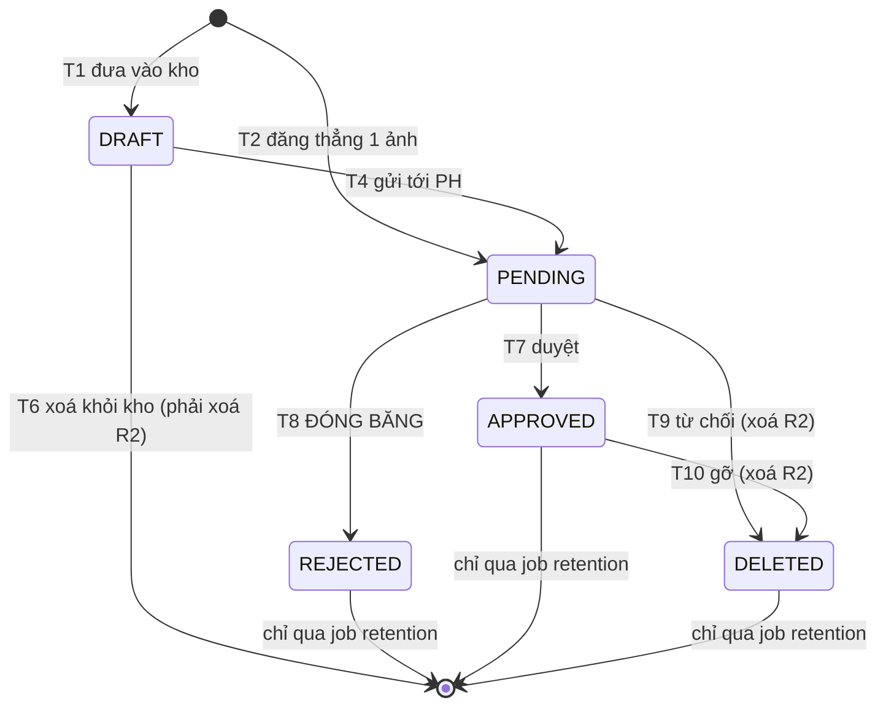

# PRD — KHU VỰC F: Kho media & quy trình duyệt ảnh/video

**Trạng thái:** Draft
**Nguồn spec (đã chốt):** `docs/specs/spec-dashboard-qlcs-duyet-media-lead.md` — KHU VỰC F (F-01…F-05, F-10…F-19, F-20, F-21, F-30…F-32)
**Phạm vi:** CHỈ khu vực F. Không mở rộng sang A/B/C/D/E/G.
**Phụ thuộc khoá schema:** `docs/prd/A-nen-tang.md` §10.2 — **SL-02 → SL-07** (+ SL-00, SL-01).
**Nhánh khảo sát:** `hptkk29/runhop20_08`

> Mọi khẳng định hiện trạng đều kèm `file:dòng` đọc trực tiếp từ mã nguồn trên nhánh này.
> Chỗ nào chưa tồn tại được ghi rõ **CHƯA CÓ**; chỗ nào là mã chết được ghi rõ **MÃ CHẾT**.

---

## 1. Executive Summary

Khu vực F là khối nặng nhất của đợt: nó vừa xây mới (trang duyệt của QLCS, theo dõi xem video, báo cáo SLA, job xoá theo hạn), vừa **sửa lại vòng đời media đang chạy trên prod**.

Bốn kết luận chịu lực của khảo sát:

| # | Kết luận | Hệ quả |
|---|---|---|
| 1 | Vòng đời hiện tại **không phải một chuỗi** mà là **hai đường song song**: "đăng ngay 1 ảnh" (`uploadClassMedia`) và "kho DRAFT → gửi" (`createDraftMediaBatch` → `publishClassMedia`). Cả hai đều có nhánh `autoApprove` cho người mang `media:approve` → **ảnh thành `APPROVED` ngay, không qua bước duyệt nào**. | F-13/F-16/F-18 dựng ra để bắt QLCS xem, mà `media:approve` lại seed đúng cho **CENTER_MANAGER** (`prisma/seed-roles.ts:449`) ⇒ đúng vai bị ràng buộc là vai đi vòng được. Phải gỡ nhánh này (§6.1.3). |
| 2 | **Xoá media chưa bao giờ đụng R2.** `deleteMedia` chỉ xoá row DB (`app/(admin)/admin/media/actions.ts:440`), `deleteDraftMedia` cũng vậy (`lib/lms/media-publish.ts:308-310`), và chú thích ghi thẳng điều đó (`lib/lms/media-publish.ts:12`, `:283-286`). Bucket lại là bucket **CÔNG KHAI** gắn `cdn.satarobo.vn` (`.env.example:91-93`). | F-03/F-15 ("xoá khỏi R2, không soft-delete") **chưa có phần thực thi nào**. Mỗi ngày trôi qua là thêm object ảnh học viên tải được vô danh mà DB không còn con trỏ để dọn. |
| 3 | Trang duyệt hiện tại **phẳng, không phân trang, trần 100 dòng** (`app/(admin)/admin/media/page.tsx:40-55`) và duyệt **từng ảnh một** (`reviewMedia` nhận đúng 1 id — `actions.ts:385-388`). | Ảnh `PENDING` cũ hơn 100 dòng gần nhất **không bao giờ hiện ra**. F.2 không phải "thêm nút", mà là viết lại màn theo trục **ngày → lớp**. |
| 4 | Ba thứ F cần **chưa tồn tại ở bất kỳ tầng nào**: cột phạm vi cơ sở trên `ClassSessionMedia`, phân biệt ảnh/video, và liên kết media ↔ học bạ. | SL-02, SL-04, SL-07 là **điều kiện cần**, không phải việc làm sau. Không có SL-02 thì trang duyệt của QLCS đa cơ sở **không có gì để lọc** (`injectScope` thoát ngay ở `lib/db-scope.ts:269`). |

Ngoài ra: F-05 (xoá sau 12 tháng nếu học bạ **đã xuất**) hiện **không trả lời được câu hỏi gốc** — 4 route xuất PDF học bạ không ghi một mốc nào (§6.1.5).

---

## 2. Background & Context

### 2.1 Hai đường ghi song song đang chạy trên prod

```
(A) "Đăng ngay 1 ảnh"
    uploadClassMedia (actions.ts:233-383)
      └─ status = autoApprove ? APPROVED : PENDING   (:345)
         autoApprove = checkPermission("media:approve")  (:337)

(B) "Kho"
    createDraftMediaBatch (lib/lms/media-publish.ts:43-109)  →  N row DRAFT (:78)
      └─ publishClassMedia (:131-279)
           └─ status = autoApprove ? APPROVED : PENDING     (:218)
```

| Ràng buộc | Giá trị | Bằng chứng |
|---|---|---|
| Trần 1 lô vào kho | **40** file | `lib/lms/media-publish.ts:18` (`DRAFT_BATCH_MAX = 40`) |
| Trần 1 lượt gửi / xoá kho | **60** id | `lib/lms/media-publish.ts:20` (`PUBLISH_BATCH_MAX = 60`) |
| Guard đua khi gửi | `updateMany where status DRAFT` + `throw "DRAFT_RACE"` | `lib/lms/media-publish.ts:233-244` |
| Chặn duyệt ảnh còn trong kho | `current?.status === "DRAFT"` → từ chối | `app/(admin)/admin/media/actions.ts:401-407` |

### 2.2 Hai cổng quyền tách nhau (chốt 11/08, đã ship)

| Hàm | Ai qua được | Bằng chứng |
|---|---|---|
| `canStageToClass` — đưa vào **kho** | GV/trợ giảng lớp ∪ Sale phụ trách lớp ∪ `media:approve` ∪ vai chỉ-góp-ảnh giữ `media:upload-draft` | `actions.ts:121-142` |
| `canPublishToClass` — **gửi tới PH** | GV/trợ giảng lớp ∪ Sale phụ trách lớp (derive qua `Order→OrderItem→Enrollment`) ∪ `media:approve` | `actions.ts:61-109` |
| Duyệt | `media:approve` + `mediaClassInScope` | `actions.ts:391-395`, `:27-40` |

Seed RBAC v2: `media:approve` **scope GLOBAL** cho `CENTER_MANAGER` (`prisma/seed-roles.ts:449`); `media:upload-draft` cho `HO_MARKETING` (`:263`) và `CENTER_CLASS_MANAGER` (`:591`); `TEACHER` có `media:view` + `media:upload` (`:689-690`). Ma trận v1 tương ứng: `lib/auth/permissions.ts:400-408`.

### 2.3 Schema hiện có

| Thứ | Có? | Bằng chứng |
|---|---|---|
| `enum MediaStatus` = `PENDING · APPROVED · REJECTED · DRAFT` | ✅ | `prisma/schema.prisma:4492-4499`; quy ước "giá trị mới đặt **CUỐI**" ghi ở `:4497` |
| `ClassSessionMedia` | ✅ | `:4501-4527` — `classId`(phẳng) · `fileUrl` · `status`(:4507) · `isClassWide` · `classSessionId`(:4513, phẳng) · `takenAt`(:4514) · `uploadedBy*` · `approvedBy*` · `approvedAt`(:4519) · index `[classId,status]`/`[status,createdAt]`/`[classSessionId]` (:4524-4526) |
| `MediaStudentTag` | ✅ | `:4557-4564` — FK tới media `onDelete: Cascade` (:4560); `studentId` **phẳng, không FK** (:4562) |
| `centerId` / `orgUnitId` trên media | ❌ **KHÔNG CÓ** | grep `ClassSessionMedia` trong `lib/db-scope.ts` + `lib/org/center-bridge.ts` = **0 hit** |
| Phân biệt ảnh / video (`kind`, `mimeType`, `durationSec`) | ❌ **KHÔNG CÓ** | `:4501-4527` không có cột nào |
| `deletedAt` / soft-delete | ❌ **KHÔNG CÓ** | không nằm trong `SOFT_DELETE_MODELS` |
| Theo dõi đã-xem-video | ❌ **CHƯA CÓ** | grep `watchedSeconds|watchedDuration|WatchProgress` toàn repo = **0 hit** |
| Bảng chốt duyệt theo ngày/lớp | ❌ **CHƯA CÓ** | grep `MediaReviewDay|reviewDate` toàn repo = **0 hit** |
| Liên kết media ↔ học bạ | ❌ **CHƯA CÓ** | `ReportCard` (`:6268-6293`) không có cột media nào, không bảng nối |

### 2.4 Lưu trữ — 🔴 lỗ đang mở

- `R2_BUCKET_NAME` là bucket **công khai** gắn custom domain `R2_PUBLIC_URL = https://cdn.satarobo.vn`; `.env.example:91-93` ghi thẳng *"MỌI object trong đó tải được vô danh qua `https://cdn.satarobo.vn/<key>`"*.
- `ClassSessionMedia.fileUrl` chính là URL công khai đó (`getPublicUrl` — `lib/storage/r2-client.ts:91-94`).
- Cờ `MEDIA_SIGNED_URL` mặc định **OFF** (`lib/flags.ts:80-82`). **Bật cũng không đóng được lỗ**: signed URL vẫn chứa nguyên object key, mà bucket vẫn có domain công khai ⇒ ghép domain là tải được.
- Cách vá đã dùng thật cho module chat: **tách bucket riêng** — `getChatBucket()` đọc `R2_CHAT_BUCKET_NAME`, fail-closed nếu trống hoặc trùng bucket công khai (`lib/storage/chat-storage.ts:49-68`).
- Object key sinh từ **tên file người dùng** (`app/api/admin/upload-url/route.ts:109-119`, `safeName`), dạng `uploads/images/<yyyy-mm>/<safeName>-<8 ký tự>.<ext>` (`:121`).
- `buildMediaObjectKey` (`lib/lms/media-key.ts:8-15`) — hàm dựng key privacy-first — là **MÃ CHẾT**: call-site duy nhất là `lib/lms/lms-logic.test.ts:51`.

### 2.5 Upload hiện tại — ẢNH-ONLY

- Dialog GV lọc cứng `f.type.startsWith("image/")` (`app/(teacher)/teacher/anh-lop/_components/upload-photo-dialog.tsx:159-161`); màn admin y hệt (`app/(admin)/admin/media/_components/media-client.tsx:279-281`).
- `UPLOAD_CONFIG.image`: tối đa **10MB**, chỉ `image/jpeg|png|webp|gif` (`lib/storage/upload-config.ts` mục `image`); **SVG cố ý cấm** (stored XSS trên origin CDN).
- `UPLOAD_CONFIG.video` **có sẵn** (500MB, `mp4/webm/mov/avi`) nhưng luồng ảnh lớp không dùng.
- **KHÔNG có nén / transcode / ffmpeg / sharp ở bất kỳ đâu** trong repo.

### 2.6 Trang duyệt hiện tại

`app/(admin)/admin/media/page.tsx`: nạp ≤200 lớp trong tầm nhìn (`:29-34`), rồi **2 truy vấn** — 100 ảnh non-DRAFT + 100 ảnh DRAFT (`:40-55`). Phẳng, **không phân trang**, **không gom theo lớp/buổi**.

🔴 Hệ quả đo được: ảnh `PENDING` cũ hơn 100 dòng gần nhất **không bao giờ hiện ra trên trang duyệt** — và không có màn nào khác cho chúng.

`media-client.tsx` chỉ lọc tại chỗ; lưới 2 cột ảnh cao `h-28` (`:702`, `:711`); **không lightbox, không xem từng ảnh, không phím mũi tên**. Duyệt 40 ảnh = 40 vòng `reviewMedia` + 40 lần `router.refresh()` (`:774-806`).

### 2.7 Việc tồn & thông báo

- `lib/pending-tasks.ts:202-233` đếm `status: "PENDING"` bằng `db` **TRẦN** (không `scopedDb`), lọc cơ sở **chỉ khi** actor là `CENTER_MANAGER` thuần và dựa vào `user.centerId` đơn trị (`:109-116`, `:204`, `:208-212`); trần `take: 50` (`:217`). ⇒ Vai khác có `media:approve` đếm ảnh `PENDING` của **mọi cơ sở**.
- **KHÔNG CÓ CRON MEDIA NÀO.** 23 entry trong `vercel.json`, không entry nào chạm media. Thông báo `media_approval:pending` / `media_approval:overdue` chỉ sinh khi người dùng **tự mở chuông** — `app/api/notifications/route.ts:54` gọi `syncStaffNotifications` **sau khi response đã đi**. Quản lý không mở chuông = im lặng vô thời hạn.
- Đường ghi thông báo **duy nhất** là `notifyStaff()` (`lib/notifications/notify.ts:47`). "Loại thông báo" **không phải enum Prisma** mà là bảng tiền tố `dedupeKey` trong `lib/notifications/catalog.ts` — media đã có một dòng ở `:137-139` (`group: action_required`, `priority: 2`, `target: /media`). Khoá chưa khai → `console.warn` + rơi chót panel (`lib/notifications/notify.ts:62-67`).

### 2.8 Retention hiện tại

`lib/compliance/retention.ts` — **51 dòng, KHÔNG XOÁ GÌ**: đếm học viên `INACTIVE` quá hạn rồi `console.warn` (`:43-51`); con số **không lưu ở đâu**. `RETENTION_DAYS` mặc định **1825 ngày = 5 năm**, đọc từ env (`:11`), và áp **duy nhất** cho bảng `Student`. Không có chính sách nào cho `ReportCard` hay `ClassSessionMedia`.

Cron `/api/cron/retention-scan` chạy `0 7 * * 1` (thứ Hai hàng tuần, giờ UTC — `vercel.json`), xác thực `verifyCronAuth` Bearer `CRON_SECRET` (`lib/cron/auth.ts:8-16`).

Xoá thật do người bấm tay trên `/admin/compliance` (chỉ SUPER_ADMIN — `app/(admin)/admin/compliance/page.tsx:15`) qua `applyStudentErasure` (`lib/compliance/erasure.ts:47`) — **ẩn danh PII**, không hard-delete.

### 2.9 Học bạ

`ReportCard` (`prisma/schema.prisma:6268-6293`): `status` (`DRAFT|PENDING_REVIEW|PUBLISHED|RECALLED` — `:6261-6266`), `publishedAt`, `publishedById`, `publishedSnapshot` (JSON đóng băng số liệu), `centerId` + `orgUnitId`.

🔴 **PHÁT HÀNH ≠ XUẤT.** Bốn route xuất PDF học bạ **không ghi bất kỳ mốc nào** — kiểm bằng grep `writeAudit|create(|update(|new Date()` trên từng file, **0 hit**:

| Route | Số dòng |
|---|---|
| `app/(teacher)/teacher/hoc-ba/pdf/[enrollmentId]/route.ts` | 107 |
| `app/api/portal/report-card/[id]/route.ts` | 51 |
| `app/api/admin/reports/transcript/route.ts` | 67 |
| `app/api/portal/transcript/route.ts` | 48 |

Chỉ **báo cáo tiến độ** có bảng vết `ProgressReportLog` (`prisma/schema.prisma:3187-3204`) — không phải học bạ.
⇒ Câu hỏi *"học bạ này đã được XUẤT chưa / lúc nào"* **hiện tại không trả lời được**.

### 2.10 Cột phẳng không FK (Prisma không join được)

`ClassSessionMedia.classId` (`:4502`), `ClassSessionMedia.classSessionId` (`:4513`), `MediaStudentTag.studentId` (`:4562`), `ReportCard.enrollmentId` (`:6270`).
⇒ Mọi truy vấn "media của buổi X" hay "học bạ của ghi danh Y" phải đi **2 bước**; mẫu chuẩn: `lib/lms/report-card.ts:210-224`. Xoá `Class` **không làm gì** với ảnh của nó.

### 2.11 Hạ tầng dùng lại được

| Thứ | Dùng cho | Bằng chứng |
|---|---|---|
| `writeAudit()` — AuditLog hợp nhất, bất biến, tự suy `orgUnitId` | mọi chuyển trạng thái | `lib/audit/audit-log.ts`; model `prisma/schema.prisma:564-585` |
| `publishEvent(type, payload, {tx, dedupeKey})` — outbox, idempotent phía producer | tách side-effect | `lib/events/publish.ts:11-23`; đăng ký handler `on()` `lib/events/registry.ts:14` + `lib/events/register.ts` |
| `notifyStaff()` + `catalog.ts` | F-21 | `lib/notifications/notify.ts:47` |
| `lib/settings/registry.ts` — thêm 1 entry là `/cau-hinh-van-hanh` tự render, **không cần migration** | F-20 | mẫu `storage.presignTtlSec` `:607-614`; trang map toàn bộ `SETTING_KEYS` — `app/(admin)/admin/cau-hinh-van-hanh/page.tsx:24` |
| `lib/crm/sla.ts` — ngưỡng động từ `SystemSetting` + hàm **thuần** `evaluateSla` + cron 15′ | F-20/F-21/F-30 | `:22-37` (`loadSlaThresholds`), `:64-83` (`evaluateSla`), `:109` (`runSlaCheck`) |
| Mẫu job **xoá thật** | F-05 | `purgeExpiredOtpRecords` — `lib/otp/cleanup.ts:22-28` (`OtpRequest` > 90 ngày) |
| `scopedDb` scope **7 method đọc**: `findMany · findFirst · count · aggregate · groupBy · findUnique · findFirstOrThrow` | mọi truy vấn F | `lib/db-scope.ts:352-372` |

⚠️ **Cảnh báo lịch sử về cron:** đã từng có **20 cron prod chưa từng chạy** vì header `Authorization` rụng theo redirect canonical. `vercel.json` đang **23 entry**; hồ sơ repo lo ngại giới hạn số cron nhưng **CHƯA KIỂM CHỨNG**.

---

## 3. Objectives & Success Metrics

### Goals

1. **Một đường vào, một chỗ duyệt.** Mọi media vào hệ thống đều đi qua `PENDING`; `APPROVED` chỉ sinh ra từ đúng một hàm, nơi có thể ràng buộc "đã xem" và ghi mốc SLA.
2. **Từ chối = mất thật.** Media bị từ chối/hết hạn thì **object trên R2 biến mất**, không chỉ row DB.
3. **QLCS duyệt theo ngày, không theo dòng.** Trang duyệt gom **ngày → lớp**, tự ẩn khi đã xong, và không bao giờ giấu ảnh cũ.
4. **Video phải xem xong mới duyệt được**, và tua nhanh không tính là xem.
5. **Quá hạn thì có người biết** mà không cần ai mở chuông.
6. **Ảnh học viên không nằm lại quá 12 tháng** trừ khi còn ràng buộc học bạ, và mỗi lần giữ lại đều có lý do ghi lại được.

### Non-Goals (cố ý không làm trong F)

1. **Không** đổi đơn vị đo phạm vi từ `centerId` sang `orgUnitId` — F ghi kép cả hai theo SL-00, cutover là việc P4.
2. **Không** tự dựng hạ tầng transcode trong app Next.js. F-02 cần một lựa chọn (§7 OQ-F3); PRD này chỉ khoá **chỗ lưu trạng thái** (`transcodeStatus`, SL-04).
3. **Không** vá cách ly cơ sở của `lib/pending-tasks.ts` cho **mọi** loại việc — F chỉ sửa nhánh `mediaApproval` (`:202-233`).
4. **Không** đổi hệ thông báo: không thêm enum loại, chỉ thêm dòng vào `lib/notifications/catalog.ts`.
5. **Không** drop cột/enum nào. `REJECTED` **giữ nguyên** trong enum (luật cứng #4); chỉ đóng băng đường sinh ra nó.
6. **Không** làm màn quản trị riêng cho kho R2 (dọn object mồ côi lịch sử) — xem OQ-F6.
7. **Không** đụng luồng chat/SCORM dù cùng dùng R2.

### Success Metrics

| Chỉ số | Hiện tại | Đích | Cách đo |
|---|---|---|---|
| Media `APPROVED` mà không có người bấm duyệt | **Có** (đường autoApprove — `actions.ts:337,345`; `media-publish.ts:218`) | 0 | e2e: user có `media:approve` upload 1 ảnh → `status = PENDING`; grep: không còn tham số `autoApprove` |
| Object R2 còn sống sau khi media bị từ chối | **100%** (không đường nào gọi `DeleteObjectCommand`) | 0 | test tích hợp: từ chối → `HeadObject` trả 404 |
| Ảnh `PENDING` không hiện ra trên trang duyệt | **Có** (>100 dòng gần nhất bị cắt — `page.tsx:45`) | 0 | e2e: tạo 250 ảnh PENDING ở 3 ngày → mọi ảnh đều tới được qua cây ngày/lớp |
| Duyệt cả folder | không có (1 id/lần — `actions.ts:385-388`) | 1 lời gọi / folder | e2e: folder 40 ảnh → 1 action, 1 lần revalidate |
| Video được duyệt khi chưa xem hết | không đo được (không có video) | 0 | e2e: `watchedSec/durationSec = 0.9` → nút "Duyệt tất cả" khoá; `0.96` → mở |
| Tua nhanh tính là đã xem | — | 0 | unit: chuỗi sự kiện `seek 0→duration` → `watchedSec = 0` |
| QLCS đa cơ sở thấy media cơ sở khác | **Có thể** (`ClassSessionMedia` ∉ `SCOPED_MODELS` ⇒ `injectScope` trả args nguyên vẹn — `lib/db-scope.ts:269`) | 0 | e2e cách ly: actor CS1 truy vấn media CS2 → 0 dòng |
| Quá hạn duyệt mà không ai được báo | **100%** (không cron media) | 0 | e2e: đẩy đồng hồ qua deadline → chạy cron → có `StaffNotification` |
| Media > 12 tháng còn trên R2 | **100%** | 0, trừ nhóm bị học bạ giữ lại | đọc `MediaRetentionLog` theo `runId` |
| Media bị xoá mà không giải thích được vì sao | — | 0 | mỗi media trong `runId` có đúng 1 dòng log với `decision` + `reason` |

---

## 4. Target Users & Segments

| Vai | Ai | Cần gì từ F | Ràng buộc |
|---|---|---|---|
| **QLCS** (`CENTER_MANAGER`, giữ `media:approve` — `seed-roles.ts:449`) | Quản lý cơ sở | F.2 toàn bộ: cây ngày/lớp, xem từng ảnh, duyệt cả folder, chỉ báo tiến độ video | Là người **bị** F-18 ràng buộc. Sau §6.1.3 thì cũng phải duyệt chính ảnh mình upload. |
| **Giáo viên / trợ giảng** | Người tạo phần lớn media | F-01: up vào kho theo lớp + buổi + ngày; thấy được ảnh của mình bị từ chối | `canStageToClass`/`canPublishToClass` (`actions.ts:121-142`, `:85-109`) |
| **Vai chỉ-góp-ảnh** (`HO_MARKETING` `:263`, `CENTER_CLASS_MANAGER` `:591` — giữ `media:upload-draft`) | Marketing HO, Giáo vụ | Đưa ảnh vào kho lớp; **không** tự gửi PH | Chỉ xoá được ảnh do chính mình đưa vào kho (`actions.ts:630-637`) |
| **Phụ huynh** | B2C | Xem ảnh con — **chỉ `APPROVED`, chỉ đúng buổi học** (F-04) | Gate `StudentConsent` type `CLASS_MEDIA` (`schema:964-984`); đường đọc `lib/portal/photos.ts` + `app/(portal)/portal/hinh-anh/page.tsx` |
| **SUPER_ADMIN / cấp Hội sở** | BGĐ | Báo cáo SLA F-30 xuyên cơ sở; cấu hình deadline F-20 | `bypassesScope` (`lib/db-scope.ts:126-128`) |
| **Người vận hành** | Dev/DevOps | Chạy tay job retention lần đầu, đọc `MediaRetentionLog` | Luật cứng #4: migration + job xoá trên prod do người chạy tay |

---

## 5. User Stories & Requirements

### F.1 — Vòng đời media (F-01…F-05)

#### P0

| # | User story | Acceptance criteria |
|---|---|---|
| **F-01-1** | Là GV, tôi up ảnh/video vào **kho chưa lưu hành**, gắn với **lớp + buổi học + ngày**. | `classSessionId` trở thành **bắt buộc** ở cả hai đường ghi (hiện `optional().nullable()` — `actions.ts:225`, `:468`; `media-publish.ts:29`). Buổi phải thuộc đúng lớp (đã có: `actions.ts:326-330`, `media-publish.ts:60-68`). `takenAt` fallback ngày buổi. Media trong kho **không** hiện portal, **không** vào hàng duyệt. |
| **F-01-2** | Media mang đủ dấu vết kỹ thuật ngay lúc tạo. | Mỗi row ghi `kind` (`IMAGE`/`VIDEO`), `mimeType`, `sizeBytes`, `durationSec` (video), `centerId` + `orgUnitId` suy từ `Class` (SL-02, SL-04). 🔴 `scopedDb` **không che write** ⇒ mọi `create` phải tự set `centerId`, quên = row vô hình với chính QLCS cơ sở đó. |
| **F-03-1** | Trạng thái media theo đúng một máy trạng thái, không có đường tắt. | Xem §6.1.1. Chuyển tiếp không nằm trong bảng đó → action từ chối, không im lặng. |
| **F-03-2** | Từ chối media là **xoá object trên R2**, không soft-delete. | Đường từ chối gọi `DeleteObjectCommand` (mẫu `app/api/admin/upload-delete/route.ts:63-68`), rồi set `status = DELETED` + `deletedAt`/`deletedById`/`deleteReason`. Row **giữ lại** làm vết cho F-30. |
| **F-03-3** | 🔴 Không ai bỏ qua được bước duyệt. | Gỡ nhánh `autoApprove` ở **cả hai** đường: `actions.ts:337`, `:345`, `:351-353`; `actions.ts:573` + `media-publish.ts:118-119`, `:218`, `:239-241`. Sau đó `APPROVED` chỉ sinh từ `reviewMedia`. e2e: `SUPER_ADMIN` upload → `PENDING`. |
| **F-03-4** | Không đảo ngược quyết định đã chốt. | Server chặn `APPROVED → REJECTED` và `REJECTED → APPROVED`. **Hiện tại đang lọt**: `reviewMedia` chỉ chặn `DRAFT` (`actions.ts:401-407`); UI ẩn nút (`media-client.tsx:769`, `:788`) nhưng action vẫn nhận payload. `DELETED` là **terminal tuyệt đối**. |
| **F-04-1** | PH chỉ xem được media `APPROVED` **và đúng buổi học**. | Thêm điều kiện `classSessionId` vào cả hai đường đọc portal — xem §6.1.4. 🔴 Hiện `lib/portal/photos.ts:29-41` và `app/(portal)/portal/hinh-anh/page.tsx:58-79` **KHÔNG lọc `classSessionId`** (trường này chỉ dùng để gom nhóm — `photos.ts:46-70`). |
| **F-04-2** | Media gắn vào học bạ cũng chịu cùng luật. | Trình dựng học bạ chỉ nhận media `APPROVED` có `classSessionId` thuộc tập buổi của `Enrollment` đó (SL-07). Không có liên kết nào ⇒ không gắn được. |
| **F-05-1** | Media quá 12 tháng **và** học bạ đã xuất thì bị xoá tự động. | Job chạy theo lịch, xoá **object R2 trước, row DB sau**, ghi `MediaRetentionLog` mỗi media. Xem §6.1.5. |
| **F-05-2** | Media nằm trong học bạ **chưa xuất** thì giữ lại + ghi log lý do + học bạ nào. | Dòng log `decision = KEPT_REPORT_CARD_UNPUBLISHED` kèm `reportCardId` + `reportCardStatus` + `reason` đọc được. |
| **F-05-3** | Job chạy lại không xoá nhầm, không xoá hai lần. | Idempotent theo `MediaRetentionLog`; trần số lượng mỗi lần chạy; xác thực `verifyCronAuth`. |

#### P1

| # | User story | Acceptance criteria |
|---|---|---|
| **F-02-1** | Video được chuẩn hoá **H.264, 720p** trước khi lưu R2. | `transcodeStatus` (`PENDING`/`RUNNING`/`DONE`/`FAILED`/`SKIPPED`) + `transcodeError`. Media `kind = VIDEO` chưa `DONE` **không vào hàng duyệt** và không hiện portal. Cách thực thi chờ OQ-F3. |
| **F-02-2** | Video lỗi transcode không làm kẹt cả folder. | `transcodeStatus = FAILED` → hiện riêng, cho QLCS `DELETED` thẳng; **không** tính vào mẫu số F-16/F-18. |
| **F-01-3** | Ảnh/video đi vào **bucket riêng**, không phải bucket công khai. | Media lớp dùng `R2_MEDIA_BUCKET_NAME` + helper fail-closed theo đúng mẫu `lib/storage/chat-storage.ts:49-68`. Object key dựng bằng `buildMediaObjectKey` (`lib/lms/media-key.ts:8-15`) — **gỡ mã chết**, thôi lấy tên file người dùng (`upload-url/route.ts:109-119`). |

#### P2

| # | User story | Acceptance criteria |
|---|---|---|
| **F-01-4** | Object R2 mồ côi từ trước (do `deleteMedia`/`deleteDraftMedia` cũ) được dọn. | Script rà `uploads/images/**` đối chiếu `ClassSessionMedia.fileUrl`, **dry-run mặc định**, người vận hành chạy tay. Xem OQ-F6. |

---

### F.2 — Trang duyệt QLCS (F-10…F-19)

#### P0

| # | User story | Acceptance criteria |
|---|---|---|
| **F-10-1** | Là QLCS, tôi mở trang duyệt và thấy **cây folder theo ngày**; ngày không có lớp thì không có folder. | Danh sách ngày dựng từ `ClassSession.date` (`schema:1937`) với `status ∈ {SCHEDULED, IN_PROGRESS, COMPLETED}` — `CANCELLED` (`schema:2008`) **không** tính. Biểu thức truy vấn: §6.2.2. |
| **F-10-2** | Ngày đã duyệt hết thì ẩn folder ngày. | "Đã duyệt hết" = mọi lớp của ngày đó đã đóng (§6.2.3). 🔴 **Không có trường nào ghi mốc "lớp đã duyệt hết ảnh"** — phải **ĐẾM** theo `(classId, classSessionId, status)`. `ClassSession.ckMedia` (`schema:1967`) là ô tích **TAY**, nhãn "Tuỳ chọn", **không** suy từ trạng thái duyệt ⇒ **không dùng làm nguồn**. |
| **F-10-3** | Cách ly cơ sở đúng cho QLCS đa cơ sở. | Sau SL-02: khai `"ClassSessionMedia"` vào `SCOPED_MODELS` (`lib/db-scope.ts:11`) **và** `BACKFILL_SPECS` (`lib/org/center-bridge.ts:45`). Trước SL-02: lọc 2 bước qua `classId` đã scope, và **bỏ trần 200 lớp** (`page.tsx:33`). |
| **F-11-1** | Trong một ngày, tôi thấy folder theo **lớp**; tên folder = tên lớp, click sang chi tiết lớp. | Link `/classes/<classId>`. Lớp đã duyệt hết → ẩn (§6.2.3). |
| **F-11-2** | Icon ⓘ hover hiện **tên GV phụ trách**. | Đọc `Class.teacherId` (`schema:1675`) + `Class.assistantId` (`:1676`) → tên qua `User`. Không lộ SĐT/email. |
| **F-12-1** | Chọn folder lớp → grid **toàn bộ** ảnh/video của lớp trong ngày đó. | Grid gồm cả `PENDING`, `APPROVED`, `DELETED` (hiển thị khác nhau), **loại `DRAFT`** — kho riêng của GV, `reviewMedia` đã chặn (`actions.ts:401-407`). Phân trang/lazy-load theo lô, **không** trần cứng im lặng. |
| **F-13-1** | Nút **"Duyệt tất cả"** chỉ hiện khi folder **có** media. | Đếm media không-DRAFT của `(classId, ngày)` > 0. |
| **F-13-2** | Bấm "Duyệt tất cả" → popup *"Xác nhận đã xem và duyệt toàn bộ ảnh"*, sau đó **một** lời gọi duyệt cả folder. | Action mới `approveClassMediaDay({ classId, reviewDate })`: gate `media:approve` + `mediaClassInScope`-tương-đương ở mức lớp, `updateMany` mọi media `PENDING` của folder → `APPROVED`, ghi `ClassMediaReviewDay` (SL-06) `status = APPROVED_ALL` + `reviewedById` + `reviewedAt`, **1** `writeAudit`, **1** lần revalidate. |
| **F-13-3** | Nút bị **khoá** khi còn video chưa xem hết. | Điều kiện mở nút ở §6.2.4. Khoá thì phải hiện **lý do** ("còn 2 video chưa xem hết"), không im lặng. |
| **F-14-1** | Nút **"Hôm nay không có ảnh"** chỉ hiện khi folder **không có** media, và bắt buộc nhập ghi chú giải trình. | Ghi `ClassMediaReviewDay.status = NO_PHOTO` + `noPhotoNote` (bắt buộc, độ dài tối thiểu — mẫu `reason` 5..500 của `user-groups/_actions.ts`). Ghi chú này là nguồn duy nhất của cột Ghi chú F-32. |
| **F-15-1** | Click ảnh → chế độ xem từng ảnh, vuốt / phím mũi tên. | `←`/`→` chuyển, `Esc` thoát. Hiện **CHƯA CÓ** lightbox nào (`media-client.tsx` không có handler `keydown`). |
| **F-15-2** | Nút **X lớn** = từ chối → popup xác nhận → **xoá khỏi R2**. | Chuyển T9/T10 ở §6.1.1. Popup nêu rõ **không hoàn tác được**. |
| **F-15-3** | Nút X **góc** = thoát về F-12, không đụng dữ liệu. | Hai nút X phải khác nhau rõ ràng về vị trí, kích thước, nhãn `aria-label`. |
| **F-16-1** | Lớp chỉ "hoàn tất" khi **mọi** media đã `APPROVED` hoặc `DELETED`. | Bất biến: `count(status = PENDING) = 0` cho `(classId, ngày)`. `REJECTED` (di sản) tính như `DELETED` — §6.1.2. `DRAFT` **không** tính vào mẫu số. |
| **F-17-1** | Video nằm **cùng grid** F-12 và **cùng slide** F-15, không màn riêng. | Một danh sách, phân biệt bằng `kind` (SL-04); phần tử video render `<video>` + badge F-19. |
| **F-18-1** | "Duyệt tất cả" chỉ bật khi **mọi video trong folder đã phát hết** (`watchedDuration ≥ 95% duration`), theo **user + media**. | Bảng `MediaWatchProgress` (SL-05), unique `[mediaId, userId]`. Thuật toán + cấu trúc: §6.2.4. |
| **F-18-2** | **Tua nhanh vượt mốc chưa xem không tính là đã xem.** | Cộng theo **đoạn (segment)**, chỉ cộng khi bước tiến của con trỏ phát khớp bước tiến của đồng hồ thật; nhảy > `WATCH_MAX_JUMP_SEC` → bỏ qua. Unit test: `seek 0 → duration` cho `watchedSec = 0`. |
| **F-19-1** | Trên grid, mỗi video hiện badge `Đã xem` / `Còn X:XX chưa xem`. | `completedAt != null` → `Đã xem`; ngược lại `durationSec − watchedSec` định dạng `mm:ss`. |
| **F-19-2** | Header folder hiện **"Đã xem n/m video"**. | `n` = số video có `completedAt != null` của **chính user đang xem**; `m` = số video không-DRAFT, `transcodeStatus != FAILED`, `durationSec != null`. |

#### P1

| # | User story | Acceptance criteria |
|---|---|---|
| **F-12-2** | Grid cho biết ảnh nào đã xử lý rồi. | Badge trạng thái + bộ lọc "chỉ chưa duyệt". |
| **F-15-4** | Từ chối **hàng loạt** trong chế độ slide. | Gom id rồi gọi 1 action, trần bằng `PUBLISH_BATCH_MAX = 60` (`media-publish.ts:20`) cho nhất quán. |
| **F-13-4** | Việc tồn "Ảnh chờ duyệt" đếm đúng theo cơ sở cho **mọi** vai. | Sửa `lib/pending-tasks.ts:202-233`: dùng `scopedDb(actor)` thay `db` trần, bỏ nhánh `user.centerId` đơn trị (`:114`), bỏ/nới trần `take: 50` (`:217`). |

#### P2

| # | User story | Acceptance criteria |
|---|---|---|
| **F-12-3** | Xem trước video nhẹ (thumbnail/poster). | Sinh poster lúc transcode; phụ thuộc OQ-F3. |
| **F-15-5** | Cử chỉ vuốt trên mobile. | Bổ sung sau khi bàn phím + click đã ổn. |

---

### F.3 — Deadline & cảnh báo (F-20, F-21)

#### P0

| # | User story | Acceptance criteria |
|---|---|---|
| **F-20-1** | Hạn duyệt mặc định **10h sáng ngày hôm sau**, admin tự set trong **Cấu hình vận hành**. | Hai key mới trong `lib/settings/registry.ts` (mẫu `:607-614`): `media.reviewDeadlineHour` (int 0..23, default **10**) và `media.reviewDeadlineOffsetDays` (int 0..7, default **1**). `centerOverridable: true`. **Không cần migration** — `/cau-hinh-van-hanh` tự render (`page.tsx:24`). |
| **F-20-2** | Deadline của một folder **đóng băng** lúc folder sinh ra. | `ClassMediaReviewDay.deadlineAt` tính **một lần** khi tạo dòng, theo giờ VN. Đổi cấu hình **không** dịch deadline của quá khứ — nếu không, báo cáo F-30 đổi ngược thời gian. |
| **F-21-1** | Quá deadline mà chưa duyệt hết → thông báo vào hệ notification cho QLCS, **không cần ai mở chuông**. | Job định kỳ quét `ClassMediaReviewDay` quá hạn chưa đóng → `notifyStaff()`. Không có cron media nào hiện tại (§2.7). Phương án lịch: §6.3.2. |
| **F-21-2** | Thông báo không spam. | `dedupeKey = media_review_overdue:<classId>:<yyyy-mm-dd>` — idempotent theo `@@unique([userId, dedupeKey])` (`schema:4394`). Khai **một dòng mới** trong `lib/notifications/catalog.ts` (nhóm `due_date`), nếu không sẽ `console.warn` + rơi chót panel (`notify.ts:62-67`). **Không** `reopen`. |
| **F-21-3** | Người nhận đúng là người duyệt được. | Danh sách người nhận = user có `media:approve` **và** nhìn thấy cơ sở của lớp. 🔴 **KHÔNG** sao chép `getParentRequestRecipients` (`lib/portal/parent-request-notify.ts:25-36`): hàm đó lọc `User.roles hasSome` + `User.centerId` **đơn trị** — đúng thứ khu vực A đang gỡ (A-01). |

#### P1

| # | User story | Acceptance criteria |
|---|---|---|
| **F-21-4** | Nhắc **trước** hạn, không chỉ sau. | Ngưỡng nhắc sớm thêm 1 key registry (`media.reviewRemindBeforeMinutes`, default 0 = tắt). |
| **F-20-3** | Ngày nghỉ không sinh deadline vô lý. | Đối chiếu `Holiday` (đã ∈ `SCOPED_MODELS` — `lib/db-scope.ts:12`) khi tính `deadlineAt`. |

---

### F.4 — Báo cáo SLA (F-30…F-32)

#### P0

| # | User story | Acceptance criteria |
|---|---|---|
| **F-30-1** | Bảng SLA với cột: **STT · Tên lớp · Ngày GV up · Trạng thái · Ghi chú**. | Một dòng = một `ClassMediaReviewDay` (SL-06). "Ngày GV up" = `min(ClassSessionMedia.createdAt)` của folder; folder không có media → để trống. |
| **F-31-1** | Enum trạng thái đúng 4 giá trị: `Chưa duyệt` · `Đã duyệt` · `Phê duyệt trễ` · `Không có ảnh`. | Hàm **thuần** `evaluateMediaSla(row, now)` — mẫu `evaluateSla` (`lib/crm/sla.ts:64-83`). Bảng suy diễn: §6.4.2. |
| **F-32-1** | Cột Ghi chú theo đúng luật: Trễ → *thời điểm duyệt / deadline cấu hình*; Chưa duyệt & Đã duyệt → **trống**; Không có ảnh → nội dung giải trình F-14. | Xem §6.4.3. |
| **F-30-2** | Báo cáo cách ly theo cơ sở và lọc theo khoảng ngày. | `ClassMediaReviewDay` mang `centerId` + `orgUnitId` (SL-00/SL-06) và vào `SCOPED_MODELS` + `BACKFILL_SPECS`. |

#### P1

| # | User story | Acceptance criteria |
|---|---|---|
| **F-30-3** | Xuất Excel bảng SLA. | Đi cùng quyết định định dạng của A-03 (OQ-6 trong `A-nen-tang.md`) — CSV hay `.xlsx`, không tự chọn riêng. |
| **F-30-4** | Bảng SLA có hàm build thuần + test. | Mẫu `lib/reports/*.ts` ("hàm build thuần + test"); tách hẳn khỏi component. |

#### P2

| # | User story | Acceptance criteria |
|---|---|---|
| **F-30-5** | Số liệu gộp theo GV / theo lớp / theo tháng. | Sau khi bảng chi tiết ổn định. |

---

## 6. Solution Overview

### 6.1 F.1 — Vòng đời media

#### 6.1.1 Máy trạng thái (BẮT BUỘC ĐẶC TẢ)

**Tập trạng thái**

| Trạng thái | Nghĩa | Ghi chú |
|---|---|---|
| `DRAFT` | Kho riêng của lớp. PH không thấy; **không** vào hàng duyệt. | Có sẵn (`schema:4498`) |
| `PENDING` | Chờ QLCS duyệt. | Có sẵn (`schema:4493`) |
| `APPROVED` | PH xem được **nếu** thoả thêm điều kiện F-04 (§6.1.4). | Có sẵn (`schema:4494`) |
| `DELETED` | **MỚI** (SL-03) — object R2 đã xoá, row giữ lại làm vết SLA. **Terminal tuyệt đối.** | Phải đặt **CUỐI** enum, khớp `ALTER TYPE ADD VALUE` (quy ước ghi tại `schema:4497`) |
| `REJECTED` | **DI SẢN, ĐÓNG BĂNG.** | Có sẵn (`schema:4495`) — xem §6.1.2 |

**Quan hệ `REJECTED` ↔ `DELETED`:** `REJECTED` là bản `DELETED` **thiếu phần xoá file**. Từ F trở đi **không đường ghi nào sinh ra `REJECTED` nữa**; nhưng enum giữ nguyên (luật cứng #4 — không drop trên bảng có dữ liệu prod), và mọi nơi đọc coi `REJECTED` là "đã xử lý" tương đương `DELETED`, nếu không thì mọi lớp cũ có ảnh bị từ chối sẽ **không bao giờ đóng được** theo F-16. 🔴 Đánh đổi phải nói thẳng: object R2 của các row `REJECTED` cũ **vẫn còn sống và vẫn tải được vô danh** — chúng chỉ được dọn khi có script ở OQ-F6.



**Bảng chuyển tiếp đầy đủ**

| # | Từ → Đến | Ai được làm (quyền) | Điều kiện tiền quyết | Tác dụng phụ | Hiện trạng |
|---|---|---|---|---|---|
| **T1** | ∅ → `DRAFT` | `media:upload-draft` **hoặc** `canPublishToClass` (`actions.ts:139-142`) | Lớp trong tầm nhìn actor · ≤ **40** file/lô (`media-publish.ts:18`) · `fileUrl` thuộc storage hệ thống (`actions.ts:150-156`) · buổi thuộc lớp (`media-publish.ts:60-68`) | `writeAudit` `MEDIA_DRAFT_BATCH_CREATE` **1 dòng/lô** (`media-publish.ts:90-104`) · `revalidatePath("/media")` (`actions.ts:518`) · **MỚI:** set `centerId`+`orgUnitId`, `kind`/`mimeType`/`sizeBytes`/`durationSec`, `transcodeStatus=PENDING` | ✅ có |
| **T2** | ∅ → `PENDING` | `canPublishToClass` (`actions.ts:255`) | Consent `CLASS_MEDIA` GRANTED **và** đang học đúng lớp cho mọi tag (`actions.ts:275-313`) · C6.2: `isClassWide` hoặc ≥1 tag (`:228-231`) · buổi thuộc lớp (`:326-330`) | `writeAudit` `CREATE` (`:365-379`) · `revalidatePath("/media")` (`:381`) · **MỚI:** upsert `ClassMediaReviewDay` (SL-06) trạng thái `OPEN` + tính `deadlineAt` | ✅ có (`:345`) |
| **T3** | ∅ → `APPROVED` | `canPublishToClass` **và** `media:approve` (`actions.ts:337`) | như T2 | Ghi `approvedById`/`approvedByName`/`approvedAt` = **chính người upload** (`:351-353`) | ⚠️ **có — PHẢI GỠ** (§6.1.3) |
| **T4** | `DRAFT` → `PENDING` | `canPublishToClass` (`actions.ts:564`) | Mọi id cùng **một** lớp (`media-publish.ts:156-158`) · mọi row đang `DRAFT` (`:159-161`) · C6.2 (`:145-147`) · C6.3 (`:171-206`) · ≤ **60** id (`:20`) | Tag + đổi status **trong 1 transaction** (`:222-270`) · guard đua `updateMany where status DRAFT` + `DRAFT_RACE` (`:233-244`) · `writeAudit` `MEDIA_DRAFT_PUBLISH` · `revalidatePath("/media")` + `("/portal/hinh-anh")` (`actions.ts:587-588`) · **MỚI:** upsert `ClassMediaReviewDay` | ✅ có (`:218`) |
| **T5** | `DRAFT` → `APPROVED` | `canPublishToClass` **và** `media:approve` (`actions.ts:573`) | như T4 | như T4 + ghi `approvedBy*`/`approvedAt` (`media-publish.ts:239-241`) | ⚠️ **có — PHẢI GỠ** |
| **T6** | `DRAFT` → **xoá row** | `canPublishToClass` (mọi DRAFT của lớp) **hoặc** `canStageOnlyToClass` + là người tải lên (`actions.ts:630-637`) | `where status: "DRAFT"` (`media-publish.ts:309`) · ≤ **60** id | `writeAudit` `MEDIA_DRAFT_DELETE` (`:312-321`) · 🔴 **KHÔNG đụng R2** (`:283-286`, `:12`) · **MỚI: phải xoá object R2 trước** | ✅ có, **thiếu phần R2** |
| **T7** | `PENDING` → `APPROVED` | `media:approve` (`actions.ts:391`) + `mediaClassInScope` (`:393-395`, `:27-40`) | `status ≠ DRAFT` (`:401-407`) · **MỚI:** nếu đi qua "Duyệt tất cả" thì mọi video của folder phải `completedAt != null` (§6.2.4) | Ghi `approvedBy*`+`approvedAt` (`:408-416`) · `writeAudit` `STATUS_CHANGE` (`:417-424`) · `revalidatePath("/media")` + `("/portal/hinh-anh")` (`:425-426`) · **MỚI:** nếu folder hết `PENDING` → `ClassMediaReviewDay.status = APPROVED_ALL` + `reviewedAt` | ✅ có |
| **T8** | `PENDING` → `REJECTED` | như T7 | như T7 | như T7 — 🔴 ghi `approvedById`/`approvedByName`/`approvedAt` **cho cả bản bị từ chối** (`:408-416`) ⇒ tính "thời gian tới lúc duyệt" bằng `approvedAt` sẽ lẫn ảnh bị từ chối | ⚠️ **ĐÓNG BĂNG** — thay bằng T9 |
| **T9** | `PENDING` → `DELETED` | `media:approve` + `mediaClassInScope` | Popup xác nhận (F-15) · nêu rõ **không hoàn tác** | 1) `DeleteObjectCommand` trên R2 (mẫu `upload-delete/route.ts:63-68`); 2) set `status=DELETED` + `deletedAt`/`deletedById`/`deleteReason`; 3) `writeAudit` `STATUS_CHANGE`; 4) revalidate `/media` + `/portal/hinh-anh`; 5) nếu folder hết `PENDING` → đóng `ClassMediaReviewDay` | ❌ **CHƯA CÓ** |
| **T10** | `APPROVED` → `DELETED` | như T9 | như T9 + cảnh báo "phụ huynh có thể đã xem ảnh này" | như T9 | ❌ **CHƯA CÓ** |
| **T11** | `APPROVED` → **xoá row** | `media:approve` + `mediaClassInScope` (`actions.ts:433-437`) | không có | `writeAudit` `DELETE` (`:441-447`) · 🔴 **KHÔNG đụng R2** (`:440`) | ⚠️ **có — THAY bằng T10** |

**Chuyển tiếp BỊ CẤM**

| Chuyển tiếp | Vì sao cấm | Hiện trạng |
|---|---|---|
| `APPROVED` → `DRAFT` | Ảnh đã tới PH; đẩy ngược về kho là làm ảnh biến mất khỏi portal mà không có vết. | ✅ đã cấm — `publishClassMedia` chỉ nhận row `DRAFT` (`media-publish.ts:159-161`, `:234`) |
| `PENDING` → `DRAFT` | Cùng lý do; và làm ảnh rơi khỏi hàng duyệt mà không ai quyết định gì. | ✅ đã cấm (cùng chỗ) |
| `DRAFT` → `APPROVED`/`REJECTED` qua `reviewMedia` | Kho chưa phải hàng duyệt. | ✅ đã cấm (`actions.ts:401-407`) |
| `APPROVED` → `REJECTED` | Đảo ngược quyết định đã công bố tới PH. | 🔴 **ĐANG LỌT** — `reviewMedia` chỉ chặn `DRAFT`; UI ẩn nút (`media-client.tsx:769`, `:788`) nhưng action nhận payload. **Phải chặn ở server.** |
| `REJECTED` → `APPROVED` | Object có thể đã bị coi là bỏ. | 🔴 **ĐANG LỌT** (cùng lý do) |
| `DELETED` → bất kỳ | Object R2 đã mất, không phục hồi được. | ❌ chưa có `DELETED` |
| ∅ → `DELETED` | Vô nghĩa. | — |
| ∅ → `APPROVED` (T3), `DRAFT` → `APPROVED` (T5) | **§6.1.3** | ⚠️ đang có |

#### 6.1.2 Bất biến đếm cho F-16

```ts
// lib/lms/media-review-status.ts — THUẦN, test được không cần DB.
import type { MediaStatus } from "@prisma/client"

/** Còn nằm trong hàng duyệt. DRAFT KHÔNG tính (kho riêng của GV). */
export const UNREVIEWED_STATUSES = ["PENDING"] as const satisfies readonly MediaStatus[]

/**
 * Đã xử lý xong (F-16). REJECTED là DI SẢN — tính như DELETED, nếu không thì lớp cũ
 * có ảnh bị từ chối trước F sẽ không bao giờ đóng được folder.
 */
export const RESOLVED_STATUSES = ["APPROVED", "DELETED", "REJECTED"] as const satisfies readonly MediaStatus[]

/** Buổi được tính là "ngày có lớp học". CANCELLED (schema:2008) KHÔNG tính. */
export const TEACHING_SESSION_STATUSES = ["SCHEDULED", "IN_PROGRESS", "COMPLETED"] as const
```

#### 6.1.3 🔴 Đường (A) phá vỡ bất biến của F-13/F-16/F-18 — và cách xử lý

**Vấn đề.** Người mang `media:approve` upload là ảnh `APPROVED` ngay (`actions.ts:337`, `:345`; `media-publish.ts:218`). Theo **câu chữ** F-16 ("mọi media `APPROVED` hoặc `DELETED`") thì lớp đó vẫn "hoàn tất" — nên thoạt nhìn không mâu thuẫn. Nhưng nó phá **bất biến thật** mà F.2 dựng lên:

| Bất biến bị phá | Cụ thể |
|---|---|
| `APPROVED` = "đã có người XEM và chịu trách nhiệm" | Người upload = người duyệt, không có cặp mắt thứ hai. |
| F-18 "phải xem hết video" | Không có bản ghi `MediaWatchProgress` nào được sinh ⇒ ràng buộc bị **bỏ qua hoàn toàn**. |
| F-30 có dòng cho mọi lớp × ngày | `ClassMediaReviewDay` không bao giờ được tạo qua đường này ⇒ bảng SLA **thiếu dòng**, hoặc dòng không có mốc duyệt. |
| F-32 "thời điểm duyệt" có nghĩa | `approvedAt ≈ createdAt` ⇒ "thời gian tới lúc duyệt" luôn ≈ 0 ⇒ báo cáo SLA đẹp giả. |

Nặng hơn: `media:approve` được seed **GLOBAL cho `CENTER_MANAGER`** (`prisma/seed-roles.ts:449`) — đúng vai mà F-13…F-19 sinh ra để ràng buộc, lại là vai đi vòng được.

**Đề xuất (khuyến nghị): gỡ nhánh `autoApprove` ở CẢ HAI đường ghi.**

| Chỗ sửa | Sửa gì |
|---|---|
| `app/(admin)/admin/media/actions.ts:337` | Bỏ `const autoApprove = await checkPermission("media:approve")` |
| `app/(admin)/admin/media/actions.ts:345` | `status: "PENDING"` cố định |
| `app/(admin)/admin/media/actions.ts:351-353` | Bỏ khối gán `approvedById`/`approvedByName`/`approvedAt` |
| `app/(admin)/admin/media/actions.ts:573` | Bỏ `autoApprove`, truyền cố định `false` (hoặc bỏ hẳn tham số) |
| `lib/lms/media-publish.ts:118-119`, `:218`, `:239-241` | Bỏ tham số `autoApprove`, `status` cố định `"PENDING"` |

Kết quả: `APPROVED` **chỉ** sinh ra từ `reviewMedia` (T7) — **một chỗ duy nhất**, nơi gắn được kiểm tra "đã xem hết video" và ghi `ClassMediaReviewDay`.

**Đánh đổi phải nói rõ với chủ dự án:** QLCS tự chụp ảnh lớp mình sẽ phải bấm duyệt chính ảnh của mình (2 bước thay vì 1). Đó **chính là** bước tạo mốc SLA — không có nó thì F-30/F-32 không có gì để đo.

**Phương án thay thế (không khuyến nghị):** giữ `autoApprove` nhưng bắt buộc, ngay tại chỗ upload, phải ghi `ClassMediaReviewDay` **và** `MediaWatchProgress.completedAt` cho mọi video — tức vẫn phải xem hết video trước khi upload xong. Phức tạp hơn, và mở thêm một đường ghi `APPROVED` thứ hai phải nhớ đồng bộ mãi mãi.

#### 6.1.4 F-04 — "chỉ `APPROVED` và **đúng buổi học**"

🔴 **Hiện trạng: điều kiện "đúng buổi học" CHƯA ĐƯỢC ÁP.** Cả hai đường đọc của PH lọc `status: "APPROVED"` + `(tag con OR isClassWide)` nhưng **không** lọc `classSessionId`:

| Đường đọc | Bằng chứng | `classSessionId` dùng làm gì |
|---|---|---|
| Portal v2 | `lib/portal/photos.ts:29-41` (`where` ở `:30-37`, `take: 200` ở `:41`) | chỉ để **gom nhóm** (`:46-70`) |
| Trang `/portal/hinh-anh` | `app/(portal)/portal/hinh-anh/page.tsx:58-79` | không dùng |

Gate consent thì đã đúng: `hasMediaConsent` (`lib/lms/media-consent.ts:93-99`) + enrollment `ACTIVE` (`photos.ts:21-24`, hằng `ACTIVE` ở `:11`).

**Điều kiện MỚI (đặc tả):**

```ts
// Vị ngữ đọc của PH sau F. Cả 3 điều kiện phải đúng, không điều kiện nào suy ra điều kiện kia.
const parentVisibleWhere = {
  classId: { in: classIdsOfActiveEnrollments },   // đã có
  status: "APPROVED" as const,                     // đã có
  classSessionId: { not: null },                   // MỚI — F-01 bắt buộc gắn buổi
  OR: [
    { tags: { some: { studentId } } },             // đã có
    { isClassWide: true },                         // đã có
  ],
}
```

Và **thêm một ràng buộc nữa** mà chữ "đúng buổi học đó" hàm ý — media chỉ được render **bên trong** nhóm của đúng buổi nó gắn, không rơi vào nhóm gộp:

```ts
// photos.ts:57 hiện gom mọi ảnh không gắn buổi vào khoá "khac".
// Sau F: nhóm "khac" KHÔNG còn tồn tại ở đường đọc PH — media chưa gắn buổi bị lọc từ where.
// Media cũ (trước F) có classSessionId = null ⇒ BIẾN MẤT khỏi portal.
```

🔴 **Hệ quả di sản phải chốt trước khi bật (OQ-F5):** mọi media prod đang có `classSessionId = null` sẽ **biến mất khỏi portal** ngay khi thêm điều kiện này. Hai lựa chọn: (a) backfill `classSessionId` theo `takenAt` khớp `ClassSession.date` cùng lớp, phần không khớp thì để `null` và chấp nhận ẩn; (b) miễn trừ media tạo trước một mốc thời gian. Không được bật mù.

**Với học bạ (F-04-2):** media chỉ gắn được vào học bạ của `Enrollment` E nếu `media.classSessionId ∈ { buổi của lớp mà E ghi danh }`. Vì `ClassSessionMedia.classSessionId` là **cột phẳng, không FK** (`schema:4513`) và `ReportCard.enrollmentId` cũng vậy (`:6270`), truy vấn phải đi **2 bước** — mẫu `lib/lms/report-card.ts:210-224`.

#### 6.1.5 F-05 — Job retention 12 tháng (BẮT BUỘC ĐẶC TẢ)

**(1) Vì sao chưa chạy được ngay — phải bổ sung gì trước**

| Thiếu | Bằng chứng | Phải có trước |
|---|---|---|
| Không biết học bạ **đã xuất chưa** | 4 route PDF không ghi mốc nào (§2.9) | Chốt nghĩa "đã xuất" (OQ-F1) rồi làm theo §(2) |
| Không biết media **thuộc học bạ nào** | `ReportCard` không có cột media, không bảng nối (§2.3) | **SL-07** |
| Không có ngưỡng 12 tháng cho media | `RETENTION_DAYS` = 5 năm, chỉ áp `Student` (`lib/compliance/retention.ts:11`, `:25-35`) | Key registry riêng `media.retentionMonths` (default **12**) |
| Không có chỗ ghi vết | `runRetentionScan` chỉ `console.warn`, số **không lưu ở đâu** (`:43-51`) | Bảng `MediaRetentionLog` — §(4) |
| Không có đường xoá R2 trong luồng media | `deleteMedia` `:440` / `deleteDraftMedia` `:308-310` chỉ xoá row | Đường xoá R2 của T6/T9/T10 |

**(2) Định nghĩa "học bạ đã xuất" — hai nghĩa, phải chốt**

| Nghĩa | Nguồn dữ liệu | Đánh giá |
|---|---|---|
| **(a) ĐÃ PHÁT HÀNH** — khuyến nghị | `ReportCard.status = PUBLISHED` + `publishedAt` (`schema:6272`, `:6279`) | **Đã tồn tại**, là mốc **vòng đời** xảy ra đúng một lần, có `publishedSnapshot` đóng băng số liệu. Không cần thêm gì. |
| (b) **ĐÃ TẢI FILE PDF** | không có | Phải thêm `ReportCardExportLog(reportCardId, exportedById, exportedAt, route, ip?)` **và** cắm `writeAudit`/ghi log vào cả **4** route (§2.9). "Tải file" là hành vi **đọc**, xảy ra 0..N lần ⇒ dùng làm điều kiện xoá là mong manh: học bạ đúng nhưng chưa ai bấm tải thì ảnh không bao giờ được xoá. |

⇒ PRD này đặc tả theo **(a)**; nếu chủ dự án chọn (b) thì thêm một bước bắt buộc trước F-05 (xem OQ-F1).

**(3) Điều kiện xoá / không xoá**

```ts
// lib/compliance/media-retention.ts — quyết định THUẦN, test không cần DB.
export type MediaRetentionDecision =
  | { decision: "DELETED"; reason: string }
  | { decision: "KEPT_REPORT_CARD_UNPUBLISHED"; reason: string; reportCardId: string; reportCardStatus: string }
  | { decision: "KEPT_NOT_DUE"; reason: string }

export function decideMediaRetention(input: {
  mediaCreatedAt: Date
  now: Date
  retentionMonths: number                 // mặc định 12, từ SystemSetting
  linkedReportCards: { id: string; status: string }[]   // SL-07
}): MediaRetentionDecision {
  const dueAt = new Date(input.mediaCreatedAt)
  dueAt.setMonth(dueAt.getMonth() + input.retentionMonths)
  if (input.now < dueAt) {
    return { decision: "KEPT_NOT_DUE", reason: `Chưa tới hạn ${input.retentionMonths} tháng (hạn ${dueAt.toISOString()})` }
  }
  // "Chưa xuất" = còn ÍT NHẤT MỘT học bạ liên kết chưa PUBLISHED. Đủ một cái là giữ.
  const blocking = input.linkedReportCards.find((rc) => rc.status !== "PUBLISHED")
  if (blocking) {
    return {
      decision: "KEPT_REPORT_CARD_UNPUBLISHED",
      reason: `Học bạ ${blocking.id} đang ở trạng thái ${blocking.status} — chưa phát hành`,
      reportCardId: blocking.id,
      reportCardStatus: blocking.status,
    }
  }
  return { decision: "DELETED", reason: `Quá ${input.retentionMonths} tháng, mọi học bạ liên kết đã PUBLISHED` }
}
```

⚠️ Media **không** liên kết học bạ nào (`linkedReportCards = []`) → rơi vào nhánh `DELETED`. Đây là hành vi **cố ý** và phải ghi rõ trong runbook: ảnh sinh hoạt lớp thông thường không gắn học bạ, và spec F-05 chỉ nêu học bạ như **ngoại lệ giữ lại**.

**(4) Bảng vết `MediaRetentionLog` — cấu trúc đầy đủ**

| Cột | Kiểu | Ý nghĩa |
|---|---|---|
| `id` | `String @id @default(cuid())` | |
| `runId` | `String` | Mã lần chạy (cuid sinh đầu job) — gom mọi dòng của một lần chạy |
| `mediaId` | `String` | **Cột phẳng, KHÔNG FK** — row media sẽ bị xoá, FK sẽ kéo log đi theo |
| `classId` | `String` | Snapshot |
| `classSessionId` | `String?` | Snapshot |
| `objectKey` | `String` | Key R2 suy từ `fileUrl` — thứ duy nhất còn lại để dọn tay nếu bước xoá R2 hỏng |
| `mediaCreatedAt` | `DateTime` | Mốc tính 12 tháng (tái kiểm được) |
| `takenAt` | `DateTime?` | Snapshot |
| `decision` | `String` | `DELETED` · `KEPT_REPORT_CARD_UNPUBLISHED` · `KEPT_NOT_DUE` · `FAILED_STORAGE` · `FAILED_DB` |
| `reason` | `String @db.Text` | Câu giải thích đọc được (từ `decideMediaRetention`) |
| `reportCardId` | `String?` | Học bạ chặn việc xoá (F-05: "ghi log lý do + **học bạ nào**") |
| `reportCardStatus` | `String?` | Trạng thái học bạ lúc quyết |
| `storageDeletedAt` | `DateTime?` | Mốc xoá object R2 thành công |
| `rowDeletedAt` | `DateTime?` | Mốc xoá row DB thành công |
| `error` | `String? @db.Text` | Thông báo lỗi khi `FAILED_*` |
| `centerId` | `String?` | SL-00 — bảng mới cần scope thì mang **cả hai** cột |
| `orgUnitId` | `String?` | SL-00 |
| `createdAt` | `DateTime @default(now())` | |

Index: `@@index([runId])` · `@@index([mediaId])` · `@@index([decision, createdAt])` · `@@index([centerId])`.
Khai vào `SCOPED_MODELS` (`lib/db-scope.ts:11`) **và** `BACKFILL_SPECS` (`lib/org/center-bridge.ts:45`).

**Ba dòng dữ liệu mẫu**

| runId | mediaId | objectKey | decision | reason | reportCardId | storageDeletedAt | rowDeletedAt |
|---|---|---|---|---|---|---|---|
| `run_c9x1` | `cm_a7f2` | `class-media/ses_88/cm_a7f2.jpg` | `DELETED` | `Quá 12 tháng, mọi học bạ liên kết đã PUBLISHED` | `null` | `2027-08-23T00:12:31Z` | `2027-08-23T00:12:31Z` |
| `run_c9x1` | `cm_b3k9` | `class-media/ses_91/cm_b3k9.mp4` | `KEPT_REPORT_CARD_UNPUBLISHED` | `Học bạ rc_5512 đang ở trạng thái PENDING_REVIEW — chưa phát hành` | `rc_5512` | `null` | `null` |
| `run_c9x1` | `cm_d0p4` | `class-media/ses_88/cm_d0p4.jpg` | `FAILED_STORAGE` | `DeleteObject trả 500 — sẽ thử lại lần chạy sau` | `null` | `null` | `null` |

**(5) Ranh giới transaction — xoá object trước hay xoá row trước?**

🔴 **Bắt buộc: xoá object R2 TRƯỚC, xoá row DB SAU.** Lý do bất đối xứng:

| Thứ tự | Nếu bước 2 hỏng | Kết cục |
|---|---|---|
| Row DB trước → R2 sau | Object còn sống, **và không còn con trỏ nào trong DB** | Ảnh học viên tải được vô danh qua `cdn.satarobo.vn/<key>` **vĩnh viễn** — không ai biết key đó tồn tại. **Không chấp nhận được.** |
| **R2 trước → row DB sau** | Row còn, `fileUrl` trỏ 404 | Ảnh vỡ ở portal — khó chịu nhưng **có con trỏ**, lần chạy sau dọn nốt. |

Trình tự chuẩn cho mỗi media:

```
1. GHI MediaRetentionLog (decision=DELETED, objectKey, storageDeletedAt=null, rowDeletedAt=null)
      ↳ commit NGAY. Đây là con trỏ dự phòng — phải tồn tại TRƯỚC khi đụng R2.
2. DeleteObjectCommand(bucket, objectKey)
      ↳ lỗi → cập nhật log decision=FAILED_STORAGE + error, DỪNG media này, sang media kế.
3. UPDATE log SET storageDeletedAt = now()
4. db.$transaction: xoá row ClassSessionMedia (MediaStudentTag cascade — schema:4560)
                    + UPDATE log SET rowDeletedAt = now()
      ↳ lỗi → log giữ storageDeletedAt != null, rowDeletedAt = null ⇒ lần sau nhận ra và dọn nốt row.
```

**Transaction chỉ bọc bước 4.** Không có transaction nào bao được lời gọi mạng tới R2 — bọc chung là tự lừa mình.

**Idempotent.** Mỗi lần chạy chọn media theo: quá hạn **và** chưa có dòng log nào với `decision = DELETED` **và** `rowDeletedAt != null`. `DeleteObject` của S3/R2 vốn idempotent (xoá key không tồn tại trả thành công) nên bước 2 chạy lại vô hại. Media có log `FAILED_STORAGE` được thử lại ở lần chạy sau.

**Trần mỗi lần chạy.** `MEDIA_RETENTION_BATCH_MAX = 300` (hằng số tầng mã, không vào schema). Mẫu tham chiếu: `findStudentsDueForRetention` dùng `take: 500` (`lib/compliance/retention.ts:33`). Chọn 300 vì mỗi media tốn **một lời gọi mạng** tới R2 — 300 × ~100ms ≈ 30s, còn biên trong giới hạn function. Job dừng sạch và lần chạy sau tiếp tục; **không** cố xử lý hết trong một lượt.

**(6) Lịch chạy & xác thực — đề xuất GỘP, không thêm cron thứ 24**

`vercel.json` đang **23 entry**; hồ sơ repo lo ngại giới hạn nhưng **chưa kiểm chứng**. Đã có `/api/cron/retention-scan` chạy `0 7 * * 1` và hiện **chỉ `console.warn`** — cùng họ nghiệp vụ (NĐ13 / lưu trữ), cùng tần suất tuần.

⇒ **Thêm bước `runMediaRetention()` vào `app/api/cron/retention-scan/route.ts`** (route hiện 14 dòng, gọi đúng `runRetentionScan()` ở `:12`), giữ nguyên `verifyCronAuth(req)` Bearer `CRON_SECRET` (`lib/cron/auth.ts:8-16`). Hai nhánh bọc `try/catch` **riêng**: lỗi phần media không được làm hỏng phần đếm học viên, và ngược lại.

⚠️ Nhắc lại rủi ro đã xảy ra thật: **20 cron prod chưa từng chạy** vì header `Authorization` rụng theo redirect canonical. Đường `/api/cron/retention-scan` đang chạy ⇒ gộp vào nó là **an toàn hơn** đăng ký path mới.

**(7) Ngưỡng 12 tháng đặt ở đâu**

Thêm key registry `media.retentionMonths` (`z.number().int().min(1).max(120)`, default **12**, `centerOverridable: false`) — mẫu `storage.presignTtlSec` (`lib/settings/registry.ts:607-614`). **Không** dùng lại `RETENTION_DAYS` (`lib/compliance/retention.ts:11`): giá trị 5 năm và ngữ nghĩa "hồ sơ học viên" khác hẳn; dùng chung là đảm bảo một ngày ai đó sửa một cái làm hỏng cái kia.

---

### 6.2 F.2 — Trang duyệt QLCS

#### 6.2.1 Nguồn dữ liệu và ràng buộc join

| Thứ | Nguồn | Ràng buộc |
|---|---|---|
| "Ngày có lớp học" | `ClassSession.date` (`schema:1937`) + `ClassSession.status` (`:1957`) | `CANCELLED` (`:2008`) **không** tính. `Class` chỉ giữ lịch dạng `scheduleDays`/`scheduleSlots` — **không** dùng làm nguồn ngày. |
| "Media của buổi" | `ClassSessionMedia.classSessionId` | 🔴 **Cột phẳng, không FK** (`:4513`) ⇒ Prisma **không join được**, phải **2 bước**. |
| "Chưa duyệt" | `status = PENDING` | `DRAFT` **không** tính — kho riêng của GV, `reviewMedia` chặn (`actions.ts:401-407`), không hiện portal. |
| "Lớp đã duyệt hết" | **ĐẾM** `(classId, classSessionId, status)` | 🔴 **Không có trường nào ghi mốc này.** `ClassSession.ckMedia` (`:1967`) là ô tích **TAY**, nhãn "Tuỳ chọn" — **không dùng**. |
| Cách ly cơ sở | `ClassSession` **đã** ∈ `SCOPED_MODELS` (`lib/db-scope.ts:29`); `ClassSessionMedia` **CHƯA** | ⚠️ Phụ thuộc **SL-02**. Chưa có SL-02 thì `injectScope` thoát ngay (`lib/db-scope.ts:269`) và trả args nguyên vẹn. |

`scopedDb` scope đúng 7 method: `findMany · findFirst · count · aggregate · groupBy · findUnique · findFirstOrThrow` (`lib/db-scope.ts:352-372`) — `groupBy` **có** được scope, dùng thoải mái.

#### 6.2.2 F-10 — danh sách NGÀY hiện folder (biểu thức truy vấn)

🔴 **Mâu thuẫn nội tại của spec phải xử lý trước.** F-10 nói folder ngày chỉ hiện khi *"có lớp học **VÀ** có media chưa duyệt"*. F-14 lại đòi nút *"Hôm nay không có ảnh"* — chỉ hiện khi folder **KHÔNG có** media. Đọc chặt F-10 thì trường hợp F-14 **không bao giờ render được**, và F-31 mất luôn hai trạng thái `Chưa duyệt` / `Không có ảnh`.

Hai cách đọc, đặc tả cả hai; **khuyến nghị (B)**:

```ts
// ─── CÁCH ĐỌC (A): CHẶT theo câu chữ F-10 ────────────────────────────────────
// Ngày hiện folder ⇔ tồn tại ≥1 buổi dạy trong ngày CÓ ≥1 media PENDING.
// Hệ quả: F-14 chết, F-31 mất 2 trạng thái.

// ─── CÁCH ĐỌC (B): KHUYẾN NGHỊ ───────────────────────────────────────────────
// Ngày hiện folder ⇔ tồn tại ≥1 buổi dạy trong ngày mà folder lớp-ngày tương ứng
// CHƯA ĐÓNG (chưa có ClassMediaReviewDay ở APPROVED_ALL / NO_PHOTO).
// Bao trọn cả hai tình huống: lớp còn ảnh chưa duyệt, và lớp chưa có ảnh nào (cần F-14).
```

**Truy vấn theo cách đọc (B)** — 3 bước, không bước nào join được vì cột phẳng:

```ts
import { scopedDb } from "@/lib/db-scope"
import { vnDayKey, vnDayStartUtc } from "@/lib/students/birthday-dates"
import { TEACHING_SESSION_STATUSES, UNREVIEWED_STATUSES } from "@/lib/lms/media-review-status"

const sdb = scopedDb(actor)

// Bước 1 — buổi dạy trong khoảng ngày. ClassSession ∈ SCOPED_MODELS (db-scope.ts:29)
//          ⇒ đã tự cách ly cơ sở, KHÔNG cần lọc tay.
const sessions = await sdb.classSession.findMany({
  where: {
    date: { gte: fromUtc, lt: toUtc },
    status: { in: [...TEACHING_SESSION_STATUSES] },   // CANCELLED bị loại
  },
  select: { id: true, classId: true, date: true },
})

// Bước 2 — folder (lớp × ngày) đã đóng. SL-06.
const closed = await sdb.classMediaReviewDay.findMany({
  where: {
    reviewDate: { gte: fromUtc, lt: toUtc },
    status: { in: ["APPROVED_ALL", "NO_PHOTO"] },
  },
  select: { classId: true, reviewDate: true },
})
const closedKeys = new Set(closed.map((r) => `${r.classId}|${vnDayKey(r.reviewDate)}`))

// Bước 3 — ngày còn ít nhất một folder chưa đóng.
const openDays = new Set<string>()
for (const s of sessions) {
  const day = vnDayKey(s.date)
  if (!closedKeys.has(`${s.classId}|${day}`)) openDays.add(day)
}
const dayList = [...openDays].sort().reverse()   // mới nhất lên đầu
```

**Truy vấn theo cách đọc (A)** — nếu chủ dự án giữ nguyên câu chữ:

```ts
// Bước 2' thay cho bước 2-3: đếm media PENDING theo buổi (groupBy ĐƯỢC scope — db-scope.ts:362).
const pending = await sdb.classSessionMedia.groupBy({
  by: ["classSessionId"],
  where: {
    classSessionId: { in: sessions.map((s) => s.id) },
    status: { in: [...UNREVIEWED_STATUSES] },
  },
  _count: { _all: true },
})
const sessionsWithPending = new Set(pending.map((p) => p.classSessionId!))
const dayList = [...new Set(
  sessions.filter((s) => sessionsWithPending.has(s.id)).map((s) => vnDayKey(s.date)),
)].sort().reverse()
```

**SQL tương đương (cách đọc A)** — để đối chiếu khi soát tay trên prod:

```sql
SELECT DISTINCT (cs."date" AT TIME ZONE 'Asia/Ho_Chi_Minh')::date AS ngay
FROM "ClassSession" cs
JOIN "ClassSessionMedia" m ON m."classSessionId" = cs."id"
WHERE cs."status" IN ('SCHEDULED','IN_PROGRESS','COMPLETED')
  AND cs."date" >= $1 AND cs."date" < $2
  AND m."status" = 'PENDING'
  AND cs."centerId" = ANY($3)     -- SAU SL-02 dùng m."centerId" = ANY($3) là đủ
ORDER BY ngay DESC;
```

⚠️ `m."classSessionId"` **không có FK** — `JOIN` trên SQL thô vẫn chạy, nhưng Prisma thì không, và **không có ràng buộc toàn vẹn**: xoá `ClassSession` để lại media trỏ id chết.

#### 6.2.3 F-11 — danh sách LỚP trong một ngày + điều kiện ẩn

```ts
// Lớp của một ngày cụ thể, kèm số media theo trạng thái.
const dayStart = vnDayStartUtc(dayKey)
const dayEnd = new Date(dayStart.getTime() + 86_400_000)

const daySessions = await sdb.classSession.findMany({
  where: { date: { gte: dayStart, lt: dayEnd }, status: { in: [...TEACHING_SESSION_STATUSES] } },
  select: { id: true, classId: true },
})
const sessionIdsByClass = new Map<string, string[]>()
for (const s of daySessions) {
  sessionIdsByClass.set(s.classId, [...(sessionIdsByClass.get(s.classId) ?? []), s.id])
}

// Đếm theo (buổi × trạng thái) — 1 truy vấn cho cả ngày.
const counts = await sdb.classSessionMedia.groupBy({
  by: ["classSessionId", "status"],
  where: { classSessionId: { in: daySessions.map((s) => s.id) } },
  _count: { _all: true },
})

// Điều kiện ẨN folder lớp (F-11 "Lớp đã duyệt hết → ẩn"), THUẦN:
function isClassFolderClosed(rows: { status: MediaStatus; n: number }[]): boolean {
  const total = rows.filter((r) => r.status !== "DRAFT").reduce((a, r) => a + r.n, 0)
  const pending = rows.filter((r) => UNREVIEWED_STATUSES.includes(r.status as never))
                      .reduce((a, r) => a + r.n, 0)
  // total = 0  → chưa có ảnh: KHÔNG ẩn, đây là folder cần nút F-14 "Hôm nay không có ảnh".
  //              (Cách đọc (A) sẽ ẩn — và đó chính là chỗ F-14 chết.)
  // pending = 0 và total > 0 → mọi media đã APPROVED/DELETED/REJECTED ⇒ F-16 hoàn tất ⇒ ẩn.
  return total > 0 && pending === 0
}
```

**Điều kiện ẩn folder NGÀY:** mọi folder lớp của ngày đó đều `isClassFolderClosed = true` **hoặc** đã có `ClassMediaReviewDay.status ∈ {APPROVED_ALL, NO_PHOTO}`.

**Ẩn ≠ xoá:** báo cáo SLA F-30 vẫn phải đọc được folder đã đóng. Ẩn chỉ là chuyện của **cây điều hướng**, dữ liệu nằm nguyên ở `ClassMediaReviewDay`.

**Cách ly cơ sở — hai giai đoạn:**

```ts
// TRƯỚC SL-02 — ClassSessionMedia ∉ SCOPED_MODELS ⇒ injectScope trả args NGUYÊN VẸN
// (lib/db-scope.ts:269). Phải lọc TAY qua tập classId đã scope, mẫu media/page.tsx:29-43:
const classes = await sdb.class.findMany({ where: { deletedAt: null }, select: { id: true } })
//   ⚠️ và BỎ trần `take: 200` của page.tsx:33 — cơ sở >200 lớp sống thì lớp thứ 201 biến mất.
const where = { classId: { in: classes.map((c) => c.id) }, /* … */ }

// SAU SL-02 — khai "ClassSessionMedia" vào SCOPED_MODELS (lib/db-scope.ts:11) + BACKFILL_SPECS
// (lib/org/center-bridge.ts:45). Mọi truy vấn trên bỏ được bước lấy classIds.
// 🔴 scopedDb KHÔNG che write ⇒ mọi create media vẫn phải tự set centerId.
```

#### 6.2.4 F-18 — theo dõi đã-xem-hết-video (BẮT BUỘC ĐẶC TẢ)

**(1) Cấu trúc bản ghi — `MediaWatchProgress` (SL-05)**

| Cột | Kiểu | Ý nghĩa |
|---|---|---|
| `id` | `String @id @default(cuid())` | |
| `mediaId` | `String` + relation `ClassSessionMedia` `onDelete: Cascade` | Mẫu `MediaStudentTag` (`schema:4560`) — media bị xoá thì tiến độ đi theo |
| `userId` | `String` | Người xem (QLCS). Cột phẳng, không FK — theo lệ repo |
| `durationSec` | `Int?` | Chép từ `ClassSessionMedia.durationSec` (SL-04) lúc bản ghi sinh; `null` = chưa biết ⇒ **không bao giờ đạt 95%** |
| `watchedSec` | `Int @default(0)` | Tổng **hợp** các đoạn đã xem (đã trừ trùng lặp) |
| `segments` | `Json @default("[]")` | Mảng đoạn đã hợp nhất `[[start,end], …]`, giây nguyên, **không chồng lấn, đã sắp xếp** |
| `maxPositionSec` | `Int @default(0)` | Mốc xa nhất con trỏ từng tới — chỉ để chẩn đoán, **không** dùng tính hoàn thành |
| `completedAt` | `DateTime?` | Mốc đạt ngưỡng. **Ghi một lần**, xem lại không xoá |
| `lastFlushAt` | `DateTime?` | Mốc lần gửi trước — dùng chặn đoạn giả mạo (§(3) bước 4) |
| `centerId` | `String?` | SL-00 |
| `orgUnitId` | `String?` | SL-00 |
| `createdAt` / `updatedAt` | `DateTime` | |

Khoá: `@@unique([mediaId, userId])` · `@@index([userId, completedAt])` · `@@index([centerId])`.
Khai vào `SCOPED_MODELS` + `BACKFILL_SPECS`.

🔴 **Vì sao phải có `segments`, không chỉ `watchedSec`:** một con số cộng dồn không phân biệt được "xem 10 phút liền" với "tua đi tua lại 30 giây đầu 20 lần". Chống tua **bắt buộc** đo theo **độ phủ**, tức hợp các khoảng.

**(2) Hằng số — tầng mã, KHÔNG nhét vào schema**

```ts
// lib/lms/media-watch.ts — THUẦN.
export const WATCH_COMPLETE_RATIO = 0.95   // F-18: watchedDuration >= 95% duration
export const WATCH_FLUSH_MS = 15_000       // tần suất gửi lên server
export const WATCH_TICK_MS = 1_000         // tần suất lấy mẫu ở client
export const WATCH_MAX_JUMP_SEC = 2        // dung sai lệch giữa con trỏ phát và đồng hồ thật
export const WATCH_SEGMENT_GAP_SEC = 1     // khe ≤1s coi như liền, khép lại (chống vụn do làm tròn)
```

**(3) Thuật toán chống tua nhanh**

*Phía client — cộng theo ĐOẠN, không cộng theo số:*

```ts
let last = { pos: video.currentTime, wall: performance.now() }
const covered: [number, number][] = []      // đoạn đã xem trong phiên hiện tại

function onTick() {                          // gọi mỗi WATCH_TICK_MS (timeupdate tự throttle)
  const pos = video.currentTime
  const wall = performance.now()
  const dPos = pos - last.pos                // con trỏ phát tiến bao nhiêu giây
  const dWall = (wall - last.wall) / 1000    // đồng hồ THẬT trôi bao nhiêu giây

  const isRealPlayback =
    !video.paused &&
    !video.seeking &&
    dPos > 0 &&                              // lùi (tua ngược) → không cộng
    dPos <= dWall + WATCH_MAX_JUMP_SEC       // tiến NHANH HƠN đồng hồ thật → là nhảy, không cộng

  if (isRealPlayback) covered.push([last.pos, pos])
  // Mọi trường hợp còn lại: KHÔNG cộng gì, chỉ đặt lại mốc — đó là toàn bộ cơ chế chống tua.
  last = { pos, wall }
}
```

`playbackRate` bị **khoá ở 1** trong trình phát của trang duyệt (điều kiện trên cố ý không nhân `rate`) — nếu không, 4× là cách hợp lệ để "xem hết" trong 1/4 thời gian, đúng thứ F-18 muốn chặn. **Thanh tua vẫn giữ** (QLCS cần xem lại đoạn nghi ngờ), chỉ là đoạn bị tua qua không được cộng.

*Hợp nhất đoạn — THUẦN, dùng ở cả client lẫn server:*

```ts
export function mergeSegments(segs: [number, number][]): [number, number][] {
  const norm = segs
    .map(([a, b]) => [Math.max(0, Math.floor(a)), Math.max(0, Math.ceil(b))] as [number, number])
    .filter(([a, b]) => b > a)
    .sort((x, y) => x[0] - y[0])
  const out: [number, number][] = []
  for (const [a, b] of norm) {
    const tail = out[out.length - 1]
    if (tail && a <= tail[1] + WATCH_SEGMENT_GAP_SEC) tail[1] = Math.max(tail[1], b)
    else out.push([a, b])
  }
  return out
}

export const coveredSeconds = (segs: [number, number][]): number =>
  segs.reduce((n, [a, b]) => n + (b - a), 0)

export function isWatchComplete(watchedSec: number, durationSec: number | null): boolean {
  if (durationSec == null || durationSec <= 0) return false   // không biết dài bao nhiêu ⇒ CHƯA xong
  return watchedSec / durationSec >= WATCH_COMPLETE_RATIO
}
```

*Phía server — Server Action `reportMediaWatch`:*

```
1. auth() + checkPermission("media:approve") + mediaClassInScope(userId, mediaId)
      (mẫu app/(admin)/admin/media/actions.ts:27-40, :391-395)
2. Đọc row hiện có theo unique [mediaId, userId]; media phải kind = VIDEO.
3. merged = mergeSegments([...row.segments, ...input.segments])
4. CHẶN ĐOẠN GIẢ MẠO — client là dữ liệu không đáng tin:
     • bỏ đoạn có b > durationSec + 1
     • tổng ĐỘ DÀI MỚI thêm vào không được vượt
         (now - (row.lastFlushAt ?? row.createdAt)) * 1.5 + 5  (giây)
       ⇒ gửi một phát [0, duration] ngay sau khi mở video sẽ bị cắt.
5. watchedSec = min(coveredSeconds(merged), durationSec)
6. Nếu isWatchComplete(...) và completedAt == null → completedAt = now()   // GHI MỘT LẦN
7. Ghi lastFlushAt = now(); upsert theo [mediaId, userId]; set centerId/orgUnitId lúc create.
```

**(4) Tần suất gửi · mất kết nối · xem lại nhiều lần**

| Tình huống | Xử lý |
|---|---|
| Tần suất gửi | Mỗi `WATCH_FLUSH_MS = 15s`, **cộng thêm** khi `pause`, `ended`, và `visibilitychange → hidden`. |
| Mất kết nối | `covered` giữ trong bộ nhớ **và** `localStorage` khoá `mwp:<mediaId>`; gửi lại ở lần mở sau. Gửi trùng **vô hại** vì server hợp nhất — mất mạng chỉ mất tối đa 15s cuối. |
| Đóng tab đột ngột | Chấp nhận mất ≤15s (hoặc đoạn từ lần flush cuối). Không dùng `sendBeacon` với Server Action; nếu cần thì làm route API riêng với `fetch(..., { keepalive: true })`. |
| Xem lại nhiều lần | Hợp đoạn ⇒ `watchedSec` **không bao giờ vượt** `durationSec`. `completedAt` chỉ ghi lần đầu, **không reset**. |
| Nhiều QLCS cùng duyệt | `@@unique([mediaId, userId])` ⇒ mỗi người một sổ riêng. F-13 kiểm theo **chính người đang bấm**, không phải "ai đó đã xem". |

**(5) Nút "Duyệt tất cả" (F-13) đọc trạng thái này thế nào**

```ts
const videos = folderMedia.filter(
  (m) => m.kind === "VIDEO" && m.status === "PENDING"
         && m.transcodeStatus !== "FAILED" && m.durationSec != null,
)
const watchedCount = videos.length === 0 ? 0 : await sdb.mediaWatchProgress.count({
  where: { mediaId: { in: videos.map((v) => v.id) }, userId: actor.userId, completedAt: { not: null } },
})
const canApproveAll = watchedCount === videos.length
```

🔴 **Đường thoát bắt buộc.** Video thiếu `durationSec` (metadata lỗi / transcode chưa xong) **không bao giờ** đạt 95% ⇒ sẽ khoá nút vĩnh viễn. Vì vậy các video đó **bị loại khỏi mẫu số** ở trên, và folder hiện cảnh báo riêng *"n video chưa xử lý xong — chưa duyệt được"* thay vì khoá nút câm lặng.

**(6) F-19 — chỉ báo tiến độ**

```ts
// Badge mỗi video trong grid
const badge = p?.completedAt
  ? "Đã xem"
  : `Còn ${mmss(Math.max(0, (m.durationSec ?? 0) - (p?.watchedSec ?? 0)))} chưa xem`

// Header folder
const header = `Đã xem ${watchedCount}/${videos.length} video`
```

`mmss()` là hàm thuần; `videos` dùng đúng mẫu số ở (5) để header và nút không mâu thuẫn nhau.

---

### 6.3 F.3 — Deadline & cảnh báo

#### 6.3.1 F-20 — cấu hình deadline

Hai key mới trong `SETTINGS` (`lib/settings/registry.ts:116`), nhóm mới `"media"` thêm vào `SettingGroup` (`:19-38`):

```ts
"media.reviewDeadlineHour": def({
  key: "media.reviewDeadlineHour",
  group: "media",
  label: "Giờ hạn duyệt ảnh (giờ VN)",
  schema: z.number().int().min(0).max(23),
  default: 10,                    // spec: 10h sáng
  centerOverridable: true,
}),
"media.reviewDeadlineOffsetDays": def({
  key: "media.reviewDeadlineOffsetDays",
  group: "media",
  label: "Hạn duyệt sau ngày dạy (số ngày)",
  schema: z.number().int().min(0).max(7),
  default: 1,                     // spec: "ngày hôm sau"
  centerOverridable: true,
}),
```

Không migration — trang `/cau-hinh-van-hanh` map toàn bộ `SETTING_KEYS` (`app/(admin)/admin/cau-hinh-van-hanh/page.tsx:24`; `SETTING_KEYS` ở `registry.ts:766`).

```ts
/** THUẦN — deadline của một folder lớp × ngày, theo GIỜ VN. */
export function computeReviewDeadline(
  reviewDate: Date, offsetDays: number, hour: number,
): Date { /* reviewDate + offsetDays ngày, đặt giờ hour:00 giờ VN, trả về UTC */ }
```

🔴 **Đóng băng.** `ClassMediaReviewDay.deadlineAt` tính **một lần** lúc dòng sinh ra (T2/T4). Đổi cấu hình **không** dịch deadline của folder cũ — nếu không, báo cáo SLA F-30 sẽ đổi kết quả của quá khứ mỗi lần ai đó chỉnh cấu hình.

#### 6.3.2 F-21 — thông báo quá hạn

Hiện **không có cron media nào** và thông báo media chỉ sinh khi người dùng tự mở chuông (§2.7). Job mới phải chủ động.

**Chỗ đặt — hai phương án:**

| | Phương án | Ưu | Nhược |
|---|---|---|---|
| **(i)** *khuyến nghị* | Thêm bước `runMediaReviewDeadlineCheck()` vào `/api/cron/parent-request-reminder` (`0 * * * *` — hàng giờ, đúng độ phân giải cần) | Không thêm entry thứ 24; đường cron này **đang chạy thật** | Trộn hai nghiệp vụ trong một route ⇒ **bắt buộc** `try/catch` riêng từng nhánh + log riêng, lỗi media không được làm hỏng nhắc yêu cầu PH |
| (ii) | Thêm cron `/api/cron/media-review-deadline` `0 * * * *` | Sạch về nghiệp vụ | Thành **24 entry**; và mỗi path mới là một lần đối mặt rủi ro "cron chưa từng chạy vì `Authorization` rụng theo redirect" |

**Logic job:**

```
1. verifyCronAuth(req)                                   // lib/cron/auth.ts:8-16
2. rows = ClassMediaReviewDay: status ∉ {APPROVED_ALL, NO_PHOTO} AND deadlineAt < now
      ↳ đọc bằng db trần + tự lọc, HOẶC scopedDb(bypass) — job hạ tầng, không có actor.
3. Với mỗi row: recipients = người có media:approve nhìn thấy row.centerId  (F-21-3)
4. notifyStaff({
     userIds: recipients,
     dedupeKey: `media_review_overdue:${row.classId}:${vnDayKey(row.reviewDate)}`,
     title: "Quá hạn duyệt ảnh lớp",
     body:  `${tenLop} — buổi ${ngay}: còn ${soAnhPending} ảnh chưa duyệt (hạn ${gioHan})`,
     href:  "/media",
     entityId: row.id,
     expiresAt: <cuối tuần>,       // hết thời sự thì thôi đếm badge
   })                               // KHÔNG reopen — đã báo rồi thì thôi
5. Khai một dòng mới trong lib/notifications/catalog.ts:
     "media_review_overdue:": { group: "due_date", priority: 1, entity: "media", target: "/media" }
   Không khai → console.warn (notify.ts:62-67) + rơi chót panel.
```

⚠️ `dedupeKey` mới **không** được đặt dạng `<loại>:pending` / `<loại>:overdue` — đó là dải khoá do vòng đồng bộ việc tồn **sở hữu** (`lib/notifications/pending-sync.ts:57-59`, `:66-73`), và nó sẽ tự đánh dấu đã đọc thông báo của mình khi người dùng mở chuông.

⚠️ **Người nhận (F-21-3).** Không sao chép `getParentRequestRecipients` (`lib/portal/parent-request-notify.ts:25-36`): hàm đó lọc `User.roles hasSome` + `User.centerId` **đơn trị** — QLCS đa cơ sở (A-01) sẽ **không nhận** cảnh báo của cơ sở thứ hai. Phải chọn theo `UserOrgRole` / tầm nhìn cơ sở.

---

### 6.4 F.4 — Báo cáo SLA duyệt ảnh

#### 6.4.1 Nguồn dữ liệu

Một dòng bảng SLA = một `ClassMediaReviewDay` (SL-06). Không có bảng này thì **không dựng nổi bảng SLA** — bốn thứ F-14/F-13/F-20/F-30 đều không có chỗ lưu.

| Cột bảng (F-30) | Nguồn |
|---|---|
| STT | thứ tự hiển thị |
| Tên lớp | `Class.name` / `Class.classCode` qua `ClassMediaReviewDay.classId` (**2 bước** — cột phẳng) |
| Ngày GV up | `min(ClassSessionMedia.createdAt)` của folder; không có media → trống |
| Trạng thái | `evaluateMediaSla()` — §6.4.2 |
| Ghi chú | §6.4.3 |

#### 6.4.2 F-31 — bảng suy diễn 4 trạng thái (hàm THUẦN)

```ts
export type MediaSlaStatus = "CHUA_DUYET" | "DA_DUYET" | "PHE_DUYET_TRE" | "KHONG_CO_ANH"

export function evaluateMediaSla(row: {
  status: "OPEN" | "APPROVED_ALL" | "NO_PHOTO"
  deadlineAt: Date
  reviewedAt: Date | null
}, now: Date): MediaSlaStatus {
  if (row.status === "NO_PHOTO") return "KHONG_CO_ANH"
  if (row.status === "OPEN") return "CHUA_DUYET"          // kể cả đã quá hạn — vẫn là "chưa duyệt"
  return row.reviewedAt && row.reviewedAt > row.deadlineAt ? "PHE_DUYET_TRE" : "DA_DUYET"
}
```

| `status` | `reviewedAt` vs `deadlineAt` | Kết quả |
|---|---|---|
| `NO_PHOTO` | — | `Không có ảnh` |
| `OPEN` | — | `Chưa duyệt` |
| `APPROVED_ALL` | `reviewedAt ≤ deadlineAt` | `Đã duyệt` |
| `APPROVED_ALL` | `reviewedAt > deadlineAt` | `Phê duyệt trễ` |

🔴 **Không dùng `ClassSessionMedia.approvedAt` làm mốc duyệt của folder.** `reviewMedia` ghi `approvedById`/`approvedByName`/`approvedAt` **cho cả bản bị từ chối** (`actions.ts:408-416`) ⇒ mốc đó lẫn ảnh bị loại. Mốc đúng là `ClassMediaReviewDay.reviewedAt` — ghi đúng một lần, lúc folder đóng.

#### 6.4.3 F-32 — cột Ghi chú

```ts
export function mediaSlaNote(row: {
  status: "OPEN" | "APPROVED_ALL" | "NO_PHOTO"
  deadlineAt: Date
  reviewedAt: Date | null
  noPhotoNote: string | null
}, sla: MediaSlaStatus): string {
  switch (sla) {
    case "PHE_DUYET_TRE":
      // Spec: "hiện thời điểm duyệt / deadline cấu hình"
      return `${fmtVN(row.reviewedAt!)} / ${fmtVN(row.deadlineAt)}`
    case "KHONG_CO_ANH":
      return row.noPhotoNote ?? ""       // giải trình bắt buộc từ F-14
    case "CHUA_DUYET":
    case "DA_DUYET":
      return ""                          // spec: để trống
  }
}
```

Hàm build bảng tách hẳn khỏi component, có test — mẫu `lib/reports/*.ts` ("hàm build thuần + test") và `lib/crm/sla.ts:64-83`.

---

## 7. Open Questions

Chỉ ghi câu **thực sự chưa trả lời được** từ mã + spec.

| # | Câu hỏi | Vì sao chặn | Chủ | Cần trước |
|---|---|---|---|---|
| **OQ-F1** | "Học bạ **đã xuất**" (F-05) nghĩa là **đã PHÁT HÀNH** (`ReportCard.status = PUBLISHED`) hay **đã có người tải file PDF**? | Nghĩa (a) dùng được ngay (`schema:6272`, `:6279`). Nghĩa (b) đòi thêm bảng `ReportCardExportLog` + cắm ghi vào **cả 4** route PDF (hiện 0 route nào ghi gì — §2.9). Chốt sai = phải sửa điều kiện của job đã xoá dữ liệu thật. | Chủ dự án | Trước SL-07 |
| **OQ-F2** | Giữ **nguyên câu chữ F-10** (chỉ hiện ngày có media chưa duyệt — cách đọc A) hay mở rộng để folder trống cũng hiện (cách đọc B)? | Đọc chặt thì **F-14 không bao giờ render được** và F-31 mất 2 trạng thái (`Chưa duyệt`, `Không có ảnh`). Đây là mâu thuẫn trong chính spec, không suy ra được từ mã. | Chủ dự án | Trước khi code F.2 |
| **OQ-F3** | F-02 (H.264/720p) thực thi bằng gì? | Repo **không có** ffmpeg/sharp/transcode ở bất kỳ đâu; Vercel function không phải chỗ chạy ffmpeg cho file 500MB. Ba hướng: dịch vụ ngoài (Cloudflare Stream…), worker riêng, hoặc **hoãn F-02** và chỉ nhận video đã đúng chuẩn (chặn ở validate). Chọn hướng nào quyết định `transcodeStatus` có ý nghĩa gì. | Chủ dự án + Dev | Trước SL-04 |
| **OQ-F4** | Trần dung lượng/thời lượng video một lần up? | `UPLOAD_CONFIG.video` đang **500MB** (`lib/storage/upload-config.ts`) trong khi ảnh là 10MB. QLCS phải **xem hết** mọi video (F-18) ⇒ 10 video × 10 phút = 100 phút mỗi ngày mỗi lớp. Không có trần thời lượng thì F-18 biến trang duyệt thành việc bất khả thi. | Chủ dự án | Trước khi bật upload video |
| **OQ-F5** | Media prod đang có `classSessionId = null` xử lý sao khi bật điều kiện F-04? | Thêm `classSessionId: { not: null }` vào đường đọc PH (§6.1.4) làm chúng **biến mất khỏi portal ngay lập tức**. Cần chọn: backfill theo `takenAt` khớp `ClassSession.date`, hay miễn trừ media trước một mốc. Số lượng thực tế chưa đo (cần truy vấn prod). | Chủ dự án + Dev | Trước khi triển khai F-04 |
| **OQ-F6** | Dọn object R2 **mồ côi lịch sử** (do `deleteMedia`/`deleteDraftMedia` cũ và các row `REJECTED`) — làm trong F hay tách? | Bucket công khai ⇒ mỗi object mồ côi là một ảnh học viên tải được vô danh. Nhưng đây là việc **rà kho**, không phải vòng đời, và cần dry-run + người vận hành chạy tay (luật cứng #4). | Chủ dự án | Trước khi đóng F |
| **OQ-F7** | Media lớp chuyển sang **bucket riêng** (F-01-3) trong đợt F hay để sau? | Đổi bucket làm mọi `fileUrl` cũ vẫn trỏ bucket công khai ⇒ hai kho song song, và `isOwnStorageUrl` (`actions.ts:150-156`) so với **một** `getR2PublicUrl()` nên phải nới. Làm sớm thì di sản nhỏ; làm muộn thì di sản lớn hơn mỗi ngày. | Chủ dự án | Trước SL-02 (ảnh hưởng object key) |
| **OQ-F8** | Cảnh báo F-21 gộp vào `/api/cron/parent-request-reminder` (23 cron) hay thêm entry thứ 24? | Hồ sơ repo lo ngại giới hạn số cron nhưng **đánh dấu CHƯA KIỂM CHỨNG**. Cần một câu trả lời dứt khoát về giới hạn của gói Vercel đang dùng. | Dev | Trước khi code F-21 |

---

## 8. Timeline & Phasing

### 8.1 Điều kiện vào — khoá schema trước dòng code đầu tiên

Theo `docs/prd/A-nen-tang.md` §10.5 mục 2, thứ tự khoá bắt buộc **SL-02 → SL-03 → SL-04 → SL-05 → SL-06 → SL-07**, và **SL-00** đứng trước tất cả.

| Khoá | Nội dung | F phụ thuộc ở đâu | Loại |
|---|---|---|---|
| **SL-00** | Quy ước: bảng mới cần `scopedDb` phải mang **cả hai** cột `centerId` + `orgUnitId` | Mọi bảng mới của F: `MediaWatchProgress`, `ClassMediaReviewDay`, `MediaRetentionLog` | quyết định |
| **SL-01** | `UserOrgRole.source` (`AUTO`/`MANUAL`) | Gián tiếp — nghiệm thu F cho QLCS đa cơ sở đứng trên cấu hình đó | ADDITIVE |
| **SL-02** | `ClassSessionMedia` + `MediaStudentTag` thêm `centerId`/`orgUnitId`, vào `SCOPED_MODELS` + `BACKFILL_SPECS`, index `[centerId, status]` | **§6.2.1, §6.2.3** — điều kiện cần của cả F.2 và F.4 | ADDITIVE |
| **SL-03** | `MediaStatus += DELETED` (đặt **CUỐI**) + `deletedAt`/`deletedById`/`deleteReason` | **§6.1.1** T9/T10, **§6.1.2**, F-16, F-30 | ADDITIVE |
| **SL-04** | `kind`, `mimeType`, `sizeBytes`, `durationSec`, `transcodeStatus` | **F-02, F-17, F-18, F-19** — không có thì không phân biệt nổi ảnh với video | ADDITIVE |
| **SL-05** | Bảng mới `MediaWatchProgress` | **§6.2.4** — F-13 phụ thuộc trực tiếp | BẢNG MỚI |
| **SL-06** | Bảng mới `ClassMediaReviewDay` | **F-13, F-14, F-20, F-30…F-32** — không có thì không dựng nổi bảng SLA | BẢNG MỚI |
| **SL-07** | Liên kết `ClassSessionMedia` ↔ `ReportCard` + `retentionDueAt` | **§6.1.5** F-05 | ADDITIVE |
| *(F thêm)* | Bảng mới `MediaRetentionLog` | **§6.1.5(4)** — chưa nằm trong danh sách SL của PRD A; cùng luật SL-00 | BẢNG MỚI |

⚠️ **SL-02 là điều kiện cần tuyệt đối.** Mọi bảng phụ của F đều trỏ về `ClassSessionMedia`; bảng gốc không có cột phạm vi thì mọi bảng con buộc phải lọc **TAY**, và mỗi màn mới là một lần phải nhớ.

### 8.2 Thứ tự thi công

| Bước | Nội dung | Phụ thuộc | Ghi chú |
|---|---|---|---|
| **F.0** | Chốt OQ-F1, OQ-F2, OQ-F3, OQ-F7 · khoá SL-00 → SL-07 + `MediaRetentionLog` · viết vào `documentation/` | — | Luật cứng #3/#4; sai SL-00 thì 3 bảng mới phải làm lại |
| **F.1a** | **Test đỏ trước** (luật cứng #5): unit máy trạng thái · unit `mergeSegments`/`isWatchComplete` · unit `evaluateMediaSla` · e2e cách ly cơ sở media · e2e "không ai bỏ qua bước duyệt" | F.0 | Chưa có test đỏ thì chưa được viết Server Action |
| **F.1b** | §6.1.3 — gỡ `autoApprove` ở cả hai đường ghi; chặn `APPROVED↔REJECTED` ở server | F.1a | Đổi hành vi thấy được ngay; báo trước cho QLCS |
| **F.1c** | Đường xoá R2 thật cho T6/T9/T10; `DELETED` thay `REJECTED` | F.1b, SL-03 | 🔴 Xoá cứng **không hoàn tác được** — dry-run trước |
| **F.1d** | F-01: bắt buộc `classSessionId`; ghi `centerId`/`orgUnitId`/`kind`/… lúc create | SL-02, SL-04 | |
| **F.1e** | F-04: thêm điều kiện `classSessionId` vào 2 đường đọc portal + backfill/miễn trừ theo OQ-F5 | F.1d | 🔴 Bật mù = ảnh biến mất khỏi portal của PH |
| **F.2a** | `ClassMediaReviewDay` + upsert ở T2/T4/T7 + `computeReviewDeadline` | SL-06, F.1b | Sinh dữ liệu cho F.3 và F.4 |
| **F.2b** | Trang duyệt mới: cây ngày (§6.2.2) → folder lớp (§6.2.3) → grid F-12 | F.2a, SL-02 | Bỏ trần 200 lớp / 100 ảnh của màn cũ |
| **F.2c** | F-15 lightbox + phím mũi tên; F-13 duyệt cả folder; F-14 "không có ảnh" | F.2b | |
| **F.2d** | F-17/F-18/F-19: video chung luồng + `MediaWatchProgress` + badge tiến độ | F.2c, SL-04, SL-05, OQ-F3, OQ-F4 | Khoá `playbackRate = 1` |
| **F.2e** | Sửa `lib/pending-tasks.ts:202-233` sang `scopedDb` | F.2a | P1 |
| **F.3** | F-20 hai key registry + F-21 job cảnh báo + dòng mới trong `catalog.ts` | F.2a, OQ-F8 | Không đổi hệ thông báo, chỉ thêm khoá |
| **F.4** | F-30…F-32: hàm build thuần + bảng + test | F.2a | Xuất file đi cùng quyết định A-03/OQ-6 |
| **F.5** | F-05: `decideMediaRetention` + `MediaRetentionLog` + gộp vào `/api/cron/retention-scan` | SL-07, F.1c, OQ-F1 | **Người vận hành chạy tay lần đầu**, dry-run trước |
| **F.6** | Cập nhật `documentation/` (flows, permissions) | F.1–F.5 | Luật cứng #10 |

### 8.3 Ràng buộc môi trường

- `test.satarobo.vn` và máy local **dùng chung một DB** (CLAUDE.md). Mọi migration của F là **additive** — không DROP/RENAME nào, đúng luật cứng #4 và tránh xoá dữ liệu đang làm việc ở local.
- Enum `DELETED` phải đặt **CUỐI** `MediaStatus` để khớp `ALTER TYPE ADD VALUE` — quy ước ghi ngay trong schema (`prisma/schema.prisma:4497`).
- Cả hai bảng/model mới phải khai **đủ hai nơi**: `SCOPED_MODELS` (`lib/db-scope.ts:11`) **và** `BACKFILL_SPECS` (`lib/org/center-bridge.ts:45`). Quên → test `[US-07-IT-08b]` đỏ, hoặc dữ liệu rò im lặng.
- Job xoá R2 (F.5) và mọi migration chạy trên prod **do người vận hành chạy tay**, có dry-run (luật cứng #4).
