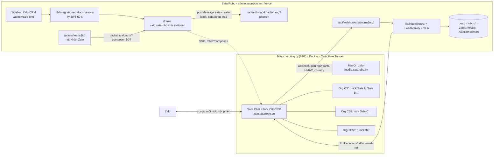

# Kế hoạch tích hợp ZaloCRM vào Sata Robo (bản 2: fork có kiểm soát, nhúng SSO)

> **Ngày lập:** 05/09/2026 (bản 2, sau khi chủ dự án chốt 13 câu chiều 05/09) · **Nhánh:** `hptkk29/tichhop-zalocrm` · **Trạng thái:** thiết kế đã chốt hướng, chưa code.
> **Bản 1** (vệ tinh không sửa mã, viết trước khi có chốt) giữ ở `01-ban-1-ve-tinh-khong-sua-ma.md`; Phụ lục B (7 lỗi có sẵn trên `test`), Phụ lục C (kiểm chứng đối kháng) và §4 (hợp đồng API ZaloCRM đọc từ mã) của bản 1 **vẫn đúng và được tham chiếu**, không chép lại.
> **Quy ước trích dẫn:** `[main]`, `[test]`, `[ZCRM]` như bản 1. ZaloCRM = tag v3.4.0, commit `8664567`.

---

## 0. Hiện trạng và 13 chốt của chủ dự án (05/09/2026)

**Hiện trạng** (bản 1 §0, không đổi): chưa có dòng code ZaloCRM nào; `lib/zalo/*` trên prod là Zalo OA/ZNS chính thức; hộp thư đa kênh trên `test` xong lõi + màn + quyền nhưng chưa kênh nào nối thật; nợ pháp lý nền (`consentMarketing: true`, trang chính sách bảo mật dẫn NĐ 13/2023) còn nguyên.

**13 chốt** (nguyên văn rút gọn, đây là văn bản quyết định cho tới khi có biên bản ký giấy):

| # | Chốt | Hệ quả thiết kế |
|---|---|---|
| Mở đầu | *"Mỗi sale được cấp 1 acc, log vào như Zalo Web nên không bị ban; tài khoản của công ty, bị ban thì công ty chịu; **có thể fork về và cho phép chép mã**; QLCS và admin quản lý các đoạn chat của các sale."* | Đảo PA-2 (BA 29/07) và Q12 (BB14 21/08). Phương án bản 1 (không sửa mã) hết tối ưu; chọn **fork có kiểm soát**. |
| 9.1 | BGĐ đã ký, chấp nhận rủi ro | Cổng cứng số 1 đã mở. Cần đưa vào biên bản ký giấy cùng 9.2–9.13. |
| 9.2 | Luật sư: làm trước | Code không chờ. Nghĩa vụ AGPL vẫn phải tuân (§2), vì đó là điều kiện của giấy phép, không phải ý kiến. |
| 9.3 | Không tự tạo lead từ SĐT cạo hồ sơ, chỉ gợi ý | Giữ luật nối lead bản 1 §5.7. |
| 9.4 | Được sửa mã ZaloCRM (PR upstream hoặc fork) | Sửa trực tiếp trong fork; không phụ thuộc upstream nhận PR. |
| 9.5 | Giữ GĐ3, nhưng tạo lead bằng **nút**, không tự động | Nút "Tạo lead" trong màn chat, mở form nhập khách điền sẵn. |
| 9.6 | Nhóm: loại hẳn | Không đồng bộ hội thoại nhóm về Sata; trong ZaloCRM vẫn xem được. |
| 9.7 | **Mỗi Sale một nick**; **mỗi cơ sở một Organization ZaloCRM**, nhiều nick; Hội sở không dùng; **QLCS quản chat của Sale cơ sở mình, admin quản toàn bộ** | Sale = member sở hữu nick; QLCS = admin của org cơ sở; SUPER_ADMIN = admin ở mọi org, chọn cơ sở bằng tab. |
| 9.8 | Trần gửi giữ mặc định ZaloCRM | 200 tin/ngày/nick, 20 tin/30 s, 30 kết bạn/ngày (`[ZCRM] sdk-limit-service.ts:23`). Sata không đặt trần riêng. |
| 9.9 | Kiệt vận hành; **máy chủ tại công ty bật 24/7 thay VPS được không?** | Được, có điều kiện. Trả lời đầy đủ ở §7.1. |
| 9.10 | Vá `consentMarketing: true` cùng đợt | Việc S8 trong GĐ2. |
| 9.11 | Org TEST: chưa hiểu, cần nêu rõ | Giải thích ở §3.3; khuyến nghị tạo. |
| 9.12 | **Thêm mục sidebar admin** "quản lý message CRM" cho QLCS và admin; **không cần site Sale nữa, Sale thao tác ngay trên site admin** | Mục "Zalo CRM" ở nhóm CSKH của sidebar admin cho cả Sale. Site Sale: giữ cờ `SALE_SITE_ENABLED` OFF, **không xoá code đợt này**, cần biên bản riêng vì đảo hai biên bản 21/08 và 27/08 (xem §9). |
| 9.13 | Lead vào hệ thống → bấm SĐT → sang màn chat nhắn khách; **làm cả hai chiều** | Chiều lead → chat: nút "Nhắn Zalo" cạnh SĐT trên phiếu lead. Chiều chat → lead: nút "Tạo lead" / "Mở lead" trong màn chat. Hai chiều dữ liệu: tin nhắn về dòng thời gian lead, lead nối với Contact. |

---

## 1. Mục tiêu, phạm vi

**Mục tiêu.** Sale nhắn khách bằng nick Zalo công ty ngay trong site admin Sata Robo, qua giao diện chat của ZaloCRM (fork) nhúng bằng iframe với đăng nhập một lần. Quản lý cơ sở đọc được mọi hội thoại của Sale cơ sở mình; SUPER_ADMIN đọc toàn bộ. Sata Robo vẫn là **sổ cái lead**: mọi tin nhắn ghi mốc lên dòng thời gian và SLA của lead, lead nối với khách trong ZaloCRM theo hai chiều.

**Trong phạm vi.**
- Fork ZaloCRM thành sản phẩm nội bộ (tên mới, ví dụ "Sata Chat"), sửa 7 điểm nhỏ có đích danh (§4).
- Mục sidebar admin "Zalo CRM" nhúng giao diện chat, SSO từ phiên Auth.js.
- Nút "Nhắn Zalo" trên phiếu lead; nút "Tạo lead" / "Mở lead" trong màn chat.
- Webhook giàu ngữ cảnh từ fork → Sata: ghi `Inbox*` (bản chữ), dòng thời gian lead, SLA, cảnh báo "khách nhắn mà Sale im".
- Nối lead ↔ Contact hai chiều theo luật đúng-một-lead.
- Chạy trên máy chủ công ty qua Cloudflare Tunnel (§7.1), org TEST riêng cho `test.satarobo.vn`.

**Ngoài phạm vi, cố ý.**
- Viết lại giao diện chat trong Sata: giao diện ZaloCRM đã đủ tính năng (ảnh, sticker, nhóm, nhãn, tìm kiếm); viết lại là việc của nhiều tháng cho một dev.
- Gửi tin **tự động** qua nick (nhắc lịch, chiến dịch): vẫn ZNS/OA. Nick chỉ gửi tin do người gõ.
- Hội thoại nhóm về Sata (9.6). Tự tạo lead từ SĐT cạo hồ sơ Zalo (9.3).
- Gỡ banner ghi công của tác giả ZaloCRM: **không được** nếu chưa mua giấy phép thương mại (§2).
- Xoá code site Sale (9.12): đợi biên bản.

---

## 2. Nghĩa vụ giấy phép khi fork (bắt buộc, không phải khuyến nghị)

Chủ dự án chốt "làm trước, luật sư sau". Bốn nghĩa vụ dưới đây là **điều khoản của chính giấy phép**, rẻ, và làm ngay từ commit đầu của fork:

| # | Nghĩa vụ | Căn cứ | Cách làm |
|---|---|---|---|
| L1 | **Công khai mã nguồn fork** cho mọi người dùng tương tác qua mạng | AGPL-3.0 §13 (`[ZCRM] LICENSE:540-549`) kích hoạt ngay khi **sửa mã** và cho người khác dùng qua mạng | Repo GitHub **public** `satarobo/sata-zalo-chat` (hoặc tên khác), mọi thay đổi commit lên đó. Không có nhánh "riêng" chứa tính năng không công bố. |
| L2 | **Khôi phục link "Mã nguồn"** ở màn đăng nhập, trỏ về repo public của fork | §13; upstream đã comment khối này (`[ZCRM] frontend/src/views/LoginView.vue:62-72`) | Bỏ comment, đổi URL. |
| L3 | **Giữ nguyên banner ghi công** `contact-marquee` và module `use-attribution.ts` | NOTICE §7(b) + chú thích trong `[ZCRM] frontend/src/composables/use-attribution.ts:1-40` (file này tự dẫn Apache 2.0 §4(d), tài liệu tự mâu thuẫn nhưng ý một: không gỡ khi chưa có giấy phép thương mại) | Không sửa, không ẩn bằng CSS. Muốn gỡ: liên hệ tác giả mua giấy phép thương mại (câu 9.14). |
| L4 | **Đổi tên và logo** sản phẩm | NOTICE §7(e): tên "ZaloCRM" và logo không được dùng cho bản phái sinh | Tên mới trong `Organization.name`/branding, title, favicon; giữ dòng "phát triển từ ZaloCRM của Nguyễn Tiến Lộc" trong NOTICE. |

Ngoài giấy phép, hai việc pháp lý nền vẫn nằm trong đợt này: **S8** vá `consentMarketing: true` (9.10) và sửa trang chính sách bảo mật sang Luật 91/2025 + NĐ 356/2025, thêm câu "tin nhắn tới nick công ty được nhân viên và quản lý đọc và lưu".

---

## 3. Kiến trúc mục tiêu

### 3.1 Ai làm gì ở đâu

| Vai Sata | Vai trong org ZaloCRM | Thấy gì | Vào bằng |
|---|---|---|---|
| SALES_CSM (cơ sở X) | `member` của org X, **sở hữu** nick của mình (`ZaloAccount.ownerUserId`) | nick mình + khách mình phụ trách (`[ZCRM] contact-scope.ts:33-51`, `zalo-scope.ts:9-13`) | sidebar "Zalo CRM" |
| CENTER_MANAGER / CENTER_CLASS_MANAGER (cơ sở X) | `admin` của org X | mọi nick, mọi hội thoại của org X (admin bỏ qua scope, `contact-scope.ts:45-53`, `zalo-access-middleware.ts:35`) | sidebar "Zalo CRM" |
| SUPER_ADMIN | `admin` ở **mọi** org | toàn bộ; chọn cơ sở bằng tab trên trang Sata (mỗi tab một phiên SSO vào org tương ứng) | sidebar "Zalo CRM" |
| Vai Hội sở khác | không có tài khoản | không dùng (9.7) | không thấy mục sidebar |

Tài khoản ZaloCRM **không tạo tay**: SSO tự tạo/cập nhật khi người dùng Sata mở mục Zalo CRM lần đầu (F1). Người rời việc: vô hiệu ở Sata ⇒ SSO từ chối ⇒ fork gọi thu hồi phiên (`jwtTokenVersion` +1) và chuyển nick sang QLCS.

### 3.2 Khoá dữ liệu (kế thừa bản 1 §3, rút gọn nhờ webhook giàu ngữ cảnh)

| Khoá Sata | Giá trị | Nguồn (sau F2) |
|---|---|---|
| `ZaloCrmNick` | `zcrmAccountId @unique`, `orgCode`, `sataUserId` (Sale sở hữu), `centerId`+`orgUnitId`, `status` | `zalo.connected` + JWT `GET /api/v1/zalo-accounts` lúc đồng bộ |
| `InboxIdentity.accountId` | `zcrmAccountId` (nick) | payload `message.*` |
| `InboxIdentity.externalUserId` | `threadId` = UID khách | payload `message.*` (F2 thêm) |
| `InboxConversation.externalThreadId` | `conversationId` | payload |
| `InboxMessage.channelMessageId` | `messageId` | payload; tin gửi từ giao diện ZaloCRM cũng có (F2) |
| Lead ↔ Contact | `Contact.externalRef = 'sata:lead:<id>'` (cột mới, F2) và `ZaloCrmThread.leadId` | hai chiều |

Không còn bước "discover" bằng DomainEvent như bản 1: payload đã có `threadId`, `threadType`, `zaloAccountId`, `contactId`, `phone` (nếu có), nên ingest inline, nhóm loại ngay tại `dich-payload`.

### 3.3 Org TEST là gì và vì sao cần (trả lời 9.11)

- ZaloCRM chỉ cho **một địa chỉ webhook cho mỗi Organization** (`AppSetting @@unique([orgId, settingKey])`, `[ZCRM] backend/prisma/schema.prisma:1514`). Org CS1 phải trỏ về `admin.satarobo.vn` (prod). Nếu muốn nghiệm thu trên `test.satarobo.vn` (DB test, khác DB prod) thì phải có một org khác trỏ về đó.
- Vì vậy: tạo thêm **org "TEST"** trên cùng máy chủ, gắn **một nick thử** (SIM công ty dự phòng, không phải nick Sale thật), webhook trỏ `test.satarobo.vn`. Mọi thứ khác giống hệt org thật.
- Không có nick thử thì không thể nghiệm thu được gì trước khi lên prod: tin thật của Sale sẽ vào DB test.
- **Khuyến nghị:** tạo org TEST ngay ở GĐ0, cần một SIM công ty rảnh. Sau khi lên prod, giữ nguyên org này để thử mọi thay đổi sau.

---

## 4. Thay đổi trong fork ZaloCRM (7 điểm, mỗi điểm nhỏ, đều có chỗ cắm sẵn)

| # | Thay đổi | Chỗ cắm đã đọc | Ghi chú |
|---|---|---|---|
| **F1** | **SSO:** `POST /api/v1/auth/sso` nhận JWT HS256 do Sata ký (`SSO_SECRET` chung), claims `{sub: sataUserId, orgCode, role: owner/admin/member, fullName, phone, email, jti, exp ≤ 60 s}`; kiểm `jti` chưa dùng (Redis, fork đã có); upsert `User` theo cột mới `external_id` (= sataUserId) trong org có `code = orgCode` (cột mới trên `Organization`); trả `{token, refreshToken, user}` y hệt login (`[ZCRM] auth-routes.ts:42, :71`). Frontend: route `/sso` đọc `location.hash` (`#token=…&next=…`), gọi `persistTokens` (`[ZCRM] frontend/src/stores/auth.ts:70-73`) rồi `router.replace(next)`. | token ở `localStorage` theo origin `zalo.satarobo.vn` nên iframe không vướng cookie bên thứ ba | Token SSO trong **fragment** (`#`), không vào query/log. Sata SUPER_ADMIN: một token cho mỗi org (tab). |
| **F2** | **Webhook giàu ngữ cảnh + có retry:** thêm vào `data` của `message.received/sent`: `zaloAccountId`, `threadId`, `threadType`, `contactId`, `contact.phone` (nếu có), `sentByUserId` (+ `sentByExternalId`) khi gửi từ giao diện; **bắn `message.sent` cho cả tin gõ trong giao diện** (hiện guard 30 s nuốt trước `emitWebhook`, `[ZCRM] message-handler.ts:343-372`); thêm sự kiện `contact.phone_set`; thay fire-and-forget (`[ZCRM] webhook-service.ts:44-54`) bằng bảng `webhook_outbox` + worker BullMQ retry 3 lần (1 s, 30 s, 5 phút) + log mã HTTP. | `emitWebhook` là một hàm duy nhất, mọi call site đi qua nó | Chống mất tin khi Vercel cold start > 10 s. Cron đối soát bản 1 §5.4 chuyển thành lưới an toàn tuỳ chọn (GĐ3). |
| **F3** | **Cho nhúng iframe** từ Sata: `frame-ancestors https://admin.satarobo.vn https://test.satarobo.vn` thay `'none'` (`[ZCRM] security-headers.ts:48`), bỏ `X-Frame-Options: DENY` (`:63`) vì CSP đã thay thế; đọc danh sách origin từ env `FRAME_ANCESTORS`. | một file | `connect-src` đã ghim `APP_URL` cho Socket.IO, không phải sửa. |
| **F4** | **Public API đủ dùng cho đối soát/gửi từ Sata (GĐ3):** `GET /conversations` trả `zaloAccountId` + nhận `since`; thêm `GET /conversations/:id`; `POST /messages/send` đi qua `sdk-limit-service` (trần mặc định 9.8) và trả `msgId` (SDK đã có, `[ZCRM] chat-routes.ts:1690-1695`); `PUT /contacts/:id/external-ref`. | `public-api-routes.ts` | Đợt 1 Sata **không gửi** qua API, Sale gửi trong giao diện. |
| **F5** | **Nút "Tạo lead Sata" / "Mở lead"** ở cột hồ sơ khách của `ChatView`: khi chạy trong iframe (`window.parent !== window`), `postMessage({type:'sata:create-lead', phone, name, contactId, conversationId}, SATA_ORIGIN)`; nếu `Contact.externalRef` đã có ⇒ nút "Mở lead" gửi `sata:open-lead`. Ngoài iframe: ẩn nút. | `ChatView.vue` cột 4, cùng chỗ với nút "Chèn từ kho" (`:570`) | Chiều chat → lead của 9.13 và nút tạo lead của 9.5. |
| **F6** | **Giấy phép** (§2): đổi tên/logo; khôi phục link Mã nguồn; giữ banner. | `LoginView.vue:62-72`, branding | Commit đầu tiên của fork. |
| **F7** | **Khoá tính năng không dùng bằng env**: `AI_FEATURES_ENABLED=false` chặn `getAiConfig` tự tạo `enabled: true` (`[ZCRM] ai-service.ts:46-52`) và ẩn màn AI; `TELEGRAM_BRIDGE_ENABLED=false`; friend-invite/lead-pool giữ tắt (bản Community không có bundle EE). | `config/index.ts` | Không để nội dung chat của phụ huynh rơi sang nhà cung cấp AI nước ngoài vì một quản trị bấm nhầm. |

Việc **không** làm trong fork: sửa mô hình dữ liệu Contact/Conversation; sửa zca-js; gỡ trần chống khoá (9.8); đụng `use-attribution.ts`.

---

## 5. Thay đổi trong repo Sata Robo

**Nhánh:** `feat/zalocrm` cắt từ `origin/test` **lúc bắt đầu code** (test còn đang nhận commit; hộp thư đa kênh chỉ có ở đó). Đường lên prod: feature → test → main; kéo theo backlog test (bản 1 §5).

| # | Việc | File | Ghi chú |
|---|---|---|---|
| **S1** | **Trang `/admin/zalo-crm`** + mục sidebar "Zalo CRM" ở nhóm "CSKH & Phụ huynh" (`[main] components/admin/sidebar.tsx:203-215`), khai `ADMIN_ROUTE_SEGMENTS` (`[main] lib/auth/route-policy.ts:107`), cổng trang bằng quyền mới `zalocrm:use`. Server Component: `assertCan` → tính `orgCode` theo cơ sở của actor (SUPER_ADMIN: tab từng cơ sở, mặc định cơ sở đầu) → `mintSsoToken()` → render `<iframe src="https://zalo.satarobo.vn/sso#token=…&next=/chat{?compose=}">` cao trọn viewport (`h-[calc(100vh-…)]` như màn Tin nhắn `9baeef95`). Client: lắng nghe `message` từ đúng origin `zalo.satarobo.vn`, `sata:create-lead` ⇒ `router.push('/nhap-khach-hang?phone=&name=&zcrmContactId=&zcrmConversationId=')`, `sata:open-lead` ⇒ `/leads/<id>`. | `app/(admin)/admin/zalo-crm/{page.tsx,_components/zalocrm-frame.tsx}`, `lib/integrations/zalocrm/sso.ts` (+ `.test.ts`), `components/admin/sidebar.tsx`, `lib/auth/route-policy.ts`, `lib/auth/page-gates.ts` | Token 60 s, `jti` ngẫu nhiên, ký bằng `ZALOCRM_SSO_SECRET` (env). `next.config.ts` thêm `frame-src https://zalo.satarobo.vn` (CSP đang Report-Only, `[main] next.config.ts:18`, vẫn khai cho đúng). |
| **S2** | **Nút "Nhắn Zalo"** cạnh SĐT trên phiếu lead, chỉ hiện cho người thấy PII (`canViewLeadPii`, `[main] app/(admin)/admin/leads/[id]/page.tsx:115, :266`) ⇒ `/admin/zalo-crm?compose=<SĐT chuẩn 84…>&lead=<id>`; iframe mở `/chat?compose=` (ZaloCRM tự tra Zalo theo SĐT và tạo hội thoại, `[ZCRM] ChatView.vue:621-625`, `ConversationList.vue:431-440`). Đồng thời Sata ghi `ZaloCrmThread.leadId` tạm theo `(orgCode, phone)` để khi hội thoại được tạo, webhook đầu tiên nối đúng lead. | `app/(admin)/admin/leads/[id]/...` | Chiều lead → chat của 9.13. Mỗi lần tra SĐT là một `PhoneSearchEvent` ở ZaloCRM và tính vào hạn mức Zalo; không tra hàng loạt. |
| **S3** | **Webhook receiver** `/api/webhooks/zalocrm/[org]`: khuôn 7 bước của trục gọi (`[test] lib/calls/webhook.ts:86-161`) với HMAC bắt buộc, rate-limit theo nguồn 600/phút, `[org]` tra `IntegrationConfig ZALOCRM:<org>`, đục `content` trước khi ghi `WebhookDelivery`; `dich-payload.ts` thuần ⇒ `ingestInboundMessage` / `ingestOutboundEcho` (kênh `ZALO_CA_NHAN`, migration enum như bản 1 §5.1), cập nhật `ZaloCrmNick.status`, `contact.phone_set` ⇒ thử nối lead. | `lib/integrations/zalocrm/{types,dich-payload,webhook,client}.ts`, `app/api/webhooks/zalocrm/[org]/route.ts`, migration enum + 2 bảng (`SCOPE_EXEMPT`, `BACKFILL_SPECS`, RLS) | Idempotency: `InboxMessage @@unique([channel, channelMessageId])`. |
| **S4** | **Nối lead hai chiều:** (a) chat → lead qua S1 (`zcrmContactId` đi cùng form nhập khách ⇒ sau khi tạo/gộp lead, gọi `PUT /contacts/:id/external-ref`); (b) `contact.phone_set` hoặc `phone` trong payload ⇒ `thuNoiTheoSdt` chỉ khi đúng **một** lead **cùng cơ sở** (sửa `timLeadTheoSdt` nhận `orgUnitId`, bản 1 B3); (c) số cạo hồ sơ ⇒ chỉ gợi ý (9.3); (d) khi lead nối xong ⇒ `ganDonViTheoNick` gắn `orgUnitId` lên identity/conversation/message. | `lib/inbox/{identity,don-vi}.ts`, handler `_handlers/lead-linked.ts` | Không tự tạo lead. |
| **S5** | **Dòng thời gian và SLA:** `message.sent` có `sentByExternalId` ⇒ map `User` ⇒ `recordLeadActivity MESSAGE` với luật S-9 (bản 1 §5.5: chủ phiếu hoặc người điều phối mới làm mới đồng hồ; lead chưa giao ⇒ NOTE hệ thống; **tin đến không ghi**). Cảnh báo "khách nhắn mà Sale im > N giờ" đọc `InboxConversation.awaitingReply` (đã có), hiện ở dashboard QLCS. | `lib/inbox/thao-tac.ts`, `lib/lead/activity-write.ts` (chỉ gọi, không sửa) | Sale gõ trong giao diện ZaloCRM cũng được tính là "đã chạm khách". |
| **S6** | **Quyền:** action mới `zalocrm:use` khai ở 3 nơi (`lib/auth/permissions.ts` v1, `prisma/seed-roles.ts` v2 scope CENTER, `lib/permissions/registry/`), cấp cho SUPER_ADMIN, CENTER_MANAGER, CENTER_CLASS_MANAGER, SALES_CSM; test parity. Vai → vai ZaloCRM: SUPER_ADMIN/CENTER_MANAGER/CENTER_CLASS_MANAGER ⇒ `admin`, SALES_CSM ⇒ `member`. Sau merge main: chạy `seed-prod-roles.yml`. | 3 file quyền + `lib/integrations/zalocrm/sso.ts` | Không dùng grant DENY. |
| **S7** | **Đồng bộ nick:** handler `zalo.connected` + lệnh admin "Đồng bộ nick" (JWT `GET /api/v1/zalo-accounts` mỗi org) ⇒ upsert `ZaloCrmNick{zcrmAccountId, orgCode, sataUserId (theo `ownerUserId.external_id`), centerId/orgUnitId}`; mục ZaloCRM ở `/admin/tich-hop`: bảng nick theo cơ sở, trạng thái, sự kiện cuối, cảnh báo "connected mà 24 h không sự kiện", nút kiểm tra kết nối. | `app/(admin)/admin/tich-hop/_components/zalocrm-section.tsx`, `lib/integrations/zalocrm/nick-admin.ts` | Đục `contact.phone` khỏi log. |
| **S8** | **Pháp lý nền (9.10):** bỏ `consentMarketing: true` ghi cứng (`[test] lib/lead/ingest.ts:66`) thay bằng giá trị thật từ nguồn (form có ô, webhook không có ⇒ `false`); sửa trang chính sách bảo mật. | `lib/lead/ingest.ts`, `app/(public)/chinh-sach-bao-mat/page.tsx` | Đợt riêng trong cùng PR hoặc PR trước. |
| **S9** | **Sửa 7 lỗi có sẵn** (bản 1 Phụ lục B): B2 gán người ⇒ gán `orgUnitId`; B3 nối SĐT có scope; B4 `INBOX_ENABLED`; B5 CI gọi `test:inbox-db`; B6 `send.ts` bước 3; B7 cron dọn `WebhookDelivery`/`DomainEvent` 30 ngày; B1 `outboundKey` (chỉ ảnh hưởng nếu dùng hộp thư Sata để gửi, sửa luôn cho sạch). | như bản 1 | B5 là điều kiện để test hộp thư có chạy trong CI. |
| **S10** | **Site Sale:** giữ `SALE_SITE_ENABLED` OFF, không mount gì mới ở `app/(sale)`, không xoá. Ghi biên bản đảo (§9). | `docs/sale-hub/` | |

**Env mới (Sata):** `ZALOCRM_ENABLED`, `ZALOCRM_BASE_URL` (API), `ZALOCRM_APP_URL` (iframe), `ZALOCRM_SSO_SECRET`, `ZALOCRM_WEBHOOK_SECRET`, `ZALOCRM_API_KEYS` (JSON theo `orgCode`, chỉ cần từ GĐ3). **SystemSetting:** `zalocrm.orgCodes` (danh sách cơ sở ↔ `orgCode`), `zalocrm.idleAlertHours` (mặc định 2).

---

## 6. Giai đoạn thực thi

| GĐ | Mục tiêu | Việc | Test viết trước | Điều kiện ra | Ngày công | Việc ngoài code |
|---|---|---|---|---|---|---|
| **GĐ0** | Hạ tầng + fork sạch giấy phép | Máy chủ công ty theo §7.1 (Ubuntu Server, Docker, `cloudflared`, 2 hostname); fork public + F6 + F7; 3 org (CS1, CS2, TEST) với `code`; 1 nick thử ở org TEST; biên bản ký giấy 13 chốt + đảo site Sale | không | `https://zalo.satarobo.vn` lên qua tunnel; nick thử connected; repo fork public có link Mã nguồn; `ai_config.enabled=false` mọi org | 3 | Kiệt (máy chủ, SIM thử), chủ dự án (biên bản) |
| **GĐ1** | Sale nhắn khách trong site admin | Fork: F1, F3. Sata: S1, S2, S6 (quyền), CSP `frame-src` | `sso.test.ts` (claims, exp 60 s, jti, sai secret ⇒ từ chối); parity quyền `zalocrm:use`; `zalocrm-frame` kiểm origin postMessage; e2e a0: SALES_CSM thấy mục sidebar, CENTER_ACCOUNTANT không | Sale thật (UAT) mở "Zalo CRM" trên test, thấy nick mình, bấm "Nhắn Zalo" từ phiếu lead ra đúng hộp soạn tin; QLCS thấy hội thoại của Sale; SUPER_ADMIN đổi tab cơ sở | 6 | thiết lập SSO secret hai bên |
| **GĐ2** | Hai chiều dữ liệu, sổ cái lead | Fork: F2, F5. Sata: S3, S4, S5, S7, S8, S9 | `dich-payload.test.ts`; `webhook.test.ts` (HMAC, 503, 600/phút, org lạ 404); `tests/inbox/zalocrm.spec.ts`: ZC-01 trùng không cộng unread · ZC-03 SĐT đúng-một cùng cơ sở mới nối · ZC-05 QLCS CS2 không thấy hội thoại CS1 · ZC-08 MESSAGE theo luật S-9, tin đến không ghi · ZC-11 số cạo hồ sơ chỉ gợi ý · ZC-15 nối lead ⇒ orgUnitId lan đủ 3 bảng · ZC-17 gán người hết mồ côi · ZC-18 retention; **CI chạy `test:inbox-db`** | Smoke trên org TEST: tin khách → dòng thời gian lead trong < 10 s; Sale gõ trong ZaloCRM ⇒ `firstContactAt` đóng đúng luật; tắt Sata 5 phút ⇒ outbox fork retry giao đủ; "Tạo lead" từ chat mở form điền sẵn và nối ngược `externalRef` | 8 | không |
| **GĐ3** (tuỳ chọn) | Gửi từ hộp thư Sata, đối soát, báo cáo | Fork: F4. Sata: provider `ZALO_CA_NHAN` gửi qua API (đi qua trần ZaloCRM), cron đối soát 5 phút (lưới an toàn), báo cáo phản hồi theo Sale/cơ sở | `provider.test.ts`, ZC-02 claim echo, ZC-07 cron idempotent | tổ Sale dùng một tuần trên test | 4 | không |
| **GĐ4** | Prod, bàn giao, dừng | PR → test → main; `seed-prod-roles.yml`; 6 env prod; org CS1/CS2 trỏ webhook prod; bật `ZALOCRM_ENABLED` sau cùng; runbook | | Sale thật trả lời một phụ huynh thật qua site admin; `IntegrationLog` không FAILED 24 h; Kiệt dựng lại máy chủ từ backup trong ≤ 1 giờ theo runbook (diễn tập) | 2 | Kiệt |

Tổng ≈ **23 ngày công**; lõi GĐ0 + GĐ1 + GĐ2 + GĐ4 = 19. GĐ1 đã cho Sale nhắn khách trong site admin sau khoảng 2 tuần làm việc.

---

## 7. Vận hành

### 7.1 Máy chủ công ty thay VPS (trả lời 9.9)

**Được**, và có hai điểm lợi hơn VPS: dữ liệu trẻ em nằm tại trụ sở (không phát sinh hợp đồng xử lý dữ liệu với nhà VPS), và Zalo thấy nick đăng nhập từ IP văn phòng ổn định như một trình duyệt Zalo Web bình thường, thay vì IP trung tâm dữ liệu. Điều kiện:

| Yêu cầu | Cụ thể | Vì sao |
|---|---|---|
| Phần cứng | ≥ 4 vCPU, ≥ 8 GB RAM (ZaloCRM khuyến nghị 4 GB cho app + Postgres + Redis + MinIO, `[ZCRM] README.md:113-123`; thêm 4 GB dự phòng cho ClamAV và backup), SSD ≥ 120 GB | ZaloCRM là tiến trình sống lâu giữ một WebSocket cho mỗi nick + Socket.IO + BullMQ |
| Hệ điều hành | **Ubuntu Server 24.04 LTS** + Docker Engine (khuyến nghị). Windows + Docker Desktop cũng chạy nhưng cần quyền quản trị máy và WSL2, khởi động lại sau update Windows hay treo | compose của upstream viết cho Linux |
| Mạng | Cáp quang riêng cho máy chủ; **Cloudflare Tunnel** (`cloudflared` chạy như service) công bố hai hostname `zalo.satarobo.vn` → `app:3000` và `zalo-media.satarobo.vn` → `minio:9000`; **không mở cổng router**, TLS do Cloudflare cấp | Sata trên Vercel phải gọi được API; Zalo CDN phải kéo được ảnh từ MinIO (`docker-compose.yml:128-162`); Sale làm việc từ nhà vẫn vào được |
| Điện | UPS ≥ 30 phút + tự tắt an toàn; BIOS bật "power on after AC loss"; Docker `restart: unless-stopped` | mất điện là mọi nick rớt cùng lúc; phiên đã lưu nên tự nối lại, không phải quét QR |
| Sao lưu | `pg_dump` hằng đêm (container backup của upstream) **mã hoá** rồi đẩy lên bucket R2 riêng `satarobo-zalo-backup` (đã có tài khoản Cloudflare); giữ 14 ngày; diễn tập khôi phục ở GĐ4 | dump chứa phiên nick plaintext (`[ZCRM] zalo-pool.ts:549-554`) |
| Giám sát | Sata cron 5 phút gọi `https://zalo.satarobo.vn/health`; 3 lần lỗi ⇒ mục Tích hợp đỏ + email Kiệt; cảnh báo nick "connected mà 24 h không sự kiện" | máy ở văn phòng không có ai canh ban đêm |
| Đường lùi | Nếu máy chết quá 4 giờ: dựng VPS 4 GB tại VN (~300–500k/tháng), khôi phục dump, đổi tunnel | không cần mua trước |

Điều **không** làm được bằng máy công ty: chạy Sata Robo (vẫn Vercel). Điều phải chấp nhận: mạng văn phòng đứt là kênh Zalo đứt cho tới khi có mạng, trong khi tin khách vẫn nằm trên Zalo và sẽ về khi nối lại.

### 7.2 Còn lại

- **Cập nhật fork:** pull upstream theo quý, merge vào nhánh fork, chạy test của fork, deploy = dump → build → `prisma migrate deploy` → bump `jwt_token_version`.
- **Thiết lập org:** `scripts/zalocrm-setup.sh` tạo org (có `code`), đặt `webhook_url` + `webhook_secret`, sinh API key; **không bấm Lưu ở màn `/settings/dev/api`** của ZaloCRM (giao diện ghi sai trường, xoá webhook: bản 1 §4.1).
- **Nick:** Sale tự quét QR nick công ty trong giao diện; QLCS cấp lại nick khi Sale nghỉ (`ownerUserId`). Trần mặc định của ZaloCRM giữ nguyên (9.8).
- **Rollback:** `ZALOCRM_ENABLED=false` ⇒ mục sidebar ẩn, webhook 404; dữ liệu chữ đã ở `Inbox*` nên gỡ ZaloCRM không mất lịch sử (đính kèm nằm ở MinIO).

---

## 8. Rủi ro và biện pháp

| Rủi ro | Mức | Biện pháp |
|---|---|---|
| Khoá nick (tác giả tự tuyên bố "có thể vi phạm ToS Zalo", `[ZCRM] README.md:482-499`) | **Cao, đã chấp nhận (9.1)** | nick công ty, mỗi Sale một nick, trần mặc định ZaloCRM, chỉ tin do người gõ, IP văn phòng ổn định, ZNS/OA giữ vai thông báo |
| Không tuân L1–L4 sau khi fork | Cao | làm ở commit đầu (F6), CI của fork kiểm còn banner + link Mã nguồn |
| Bảo trì fork (upstream đổi nhanh, 109 migration, Prisma 7 early access) | Cao | 7 điểm sửa nhỏ, có đích danh, mỗi điểm một commit riêng để rebase; pull upstream theo quý |
| Dữ liệu trẻ em plaintext trên máy công ty; MinIO tải nặc danh | Cao | mã hoá đĩa, backup mã hoá, `zalo-media` chỉ qua tunnel với Cloudflare Access cho console; retention ảnh 90 ngày (cron fork); F7 |
| SSO token bị đánh cắp | TB | exp 60 s, `jti` một lần, fragment không vào log, chỉ ký khi `assertCan('zalocrm:use')` |
| `postMessage` giả từ tab khác | TB | kiểm `event.origin === ZALOCRM_APP_URL` cả hai chiều; payload chỉ mang id và SĐT, không mang lệnh |
| Hội thoại mồ côi (tin không kèm SĐT) | Cao về giá trị | nút "Tạo lead" ngay trong chat (F5), gợi ý khớp, quy trình nhập lead ở Sata trước |
| Đảo site Sale không có biên bản | TB | §9 câu 9.15; giữ code, tắt cờ |
| Máy chủ văn phòng mất điện/mạng | TB | UPS, tunnel tự nối, giám sát, đường lùi VPS |
| Webhook prod và test lẫn nhau | Thấp | org TEST riêng (§3.3) |

---

## 9. Việc chủ dự án còn phải làm

| # | Việc | Hạn |
|---|---|---|
| 9.14 | Quyết định có mua giấy phép thương mại từ tác giả (gỡ banner, dùng tên tuỳ ý) hay giữ banner | trước GĐ4 |
| 9.15 | **Biên bản ký giấy** gồm 13 chốt 05/09 + đảo hai biên bản 21/08 và 27/08 về site Sale ("Sale thao tác trên site admin") + xác nhận rủi ro khoá nick | trước GĐ1 |
| 9.16 | Cấp **một SIM công ty** cho nick thử org TEST; danh sách Sale ↔ SIM công ty cho CS1, CS2 | GĐ0 |
| 9.17 | Máy chủ: mua/chỉ định máy + UPS + đường mạng riêng theo §7.1 | GĐ0 |
| 9.18 | Tên sản phẩm mới cho fork (L4) | GĐ0 |

---

## Phụ lục A. Vì sao đổi phương án so với bản 1

Bản 1 chọn "vệ tinh không sửa mã" vì hai chốt cũ cấm sửa/chép mã và chưa có văn bản chấp nhận rủi ro; giá phải trả là nhiều heuristic (đối khớp echo, discover hội thoại, không SSO, không iframe, hai đăng nhập). Chốt 05/09 gỡ cả hai ràng buộc. Với quyền sửa mã, bảy thay đổi nhỏ trong fork (§4) xoá hết heuristic đó và cho Sale làm việc trong một cửa. Phương án fork sâu từng bị chấm 3,88/10 chủ yếu ở hai tiêu chí pháp lý và chi phí bảo trì; tiêu chí pháp lý nay do BGĐ quyết, còn chi phí bảo trì được khống chế bằng cách **chỉ sửa 7 điểm có đích danh**, không viết lại giao diện, không đụng mô hình dữ liệu.
