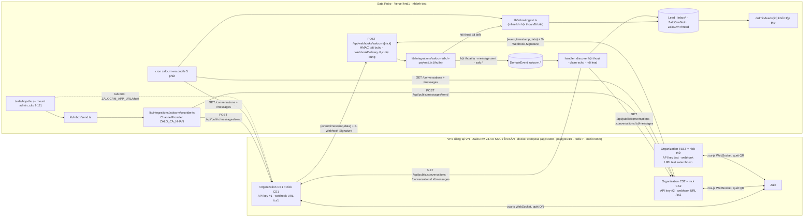

# [BẢN 1, 05/09 sáng, ĐÃ THAY BẰNG 00-ke-hoach-tich-hop-zalocrm.md] Kế hoạch tích hợp ZaloCRM vệ tinh không sửa mã

> ⚠️ Bản này viết TRƯỚC khi chủ dự án chốt 13 câu (05/09 chiều: được fork, BGĐ đã ký). Giữ lại vì Phụ lục B (lỗi có sẵn trên test), Phụ lục C (kiểm chứng) và §4 (hợp đồng API ZaloCRM đã đọc mã) vẫn đúng. Kiến trúc mục 3, 5, 6 KHÔNG còn hiệu lực.

> **Ngày lập:** 05/09/2026 · **Nhánh:** `hptkk29/tichhop-zalocrm` · **Trạng thái:** bản thảo kỹ thuật, CHƯA có chữ ký chủ dự án, CHƯA có ý kiến luật sư.
> **Đề bài:** *"check lại phần module tích hợp ZaloCRM từ source có sẵn (github.com/locphamnguyen/ZaloCRM), xem đã làm chưa, nếu rồi thì làm đến đâu, nếu chưa làm thì lên plan chi tiết để tích hợp vào hệ thống."*
> **Phương pháp:** đọc mã tĩnh ba nguồn (nhánh `main` HEAD `f4b4b48c`; nhánh `origin/test` HEAD `9f5c76d1`, 90 commit trước main; ZaloCRM tag v3.4.0 commit `8664567` ngày 26/06/2026) + tài liệu BA và biên bản chốt. Quy trình 60 agent: 5 khảo sát độc lập → 3 phương án kiến trúc → 9 phiếu giám khảo (3 lăng kính × 3 phương án) → tổng hợp → 20 khẳng định then chốt bị 40 lượt bác bỏ đối kháng → 1 phê bình độ đủ. Kết quả kiểm chứng ở Phụ lục C.
> **Quy ước trích dẫn:** `[main] đường/dẫn:dòng` · `[test] đường/dẫn:dòng` · `[ZCRM] đường/dẫn:dòng` (trong repo ZaloCRM) · `[CHƯA KIỂM CHỨNG]` = không đọc được từ mã, phải đo khi chạy thật.

---

## 0. Kết luận hiện trạng: CHƯA CÓ DÒNG CODE NÀO tích hợp ZaloCRM

| # | Hiện trạng | Bằng chứng |
|---|---|---|
| 0.1 | Nhánh `hptkk29/tichhop-zalocrm` **trùng hệt `origin/main`** (0 commit riêng). Main **không có** `lib/inbox/` lẫn `lib/integrations/`. | `git log origin/main..HEAD` rỗng; `ls lib/inbox` không tồn tại |
| 0.2 | Thứ đang chạy trên prod mang tên "Zalo" là **Zalo OA / ZNS chính thức** (OTP, học phí, sinh nhật, điểm danh): `lib/zalo/{provider,service,token,templates}.ts`, cron `zalo-token-refresh`, webhook `/api/public/webhook/zalo` (chỉ nhận form lead). Không liên quan ZaloCRM. | `[main] lib/zalo/provider.ts:1-15`, `[main] app/api/public/webhook/zalo/route.ts:7-13` |
| 0.3 | **BA 29/07 đã LOẠI ZaloCRM** (phương án PA-2) với hai lý do mức CHẶN: ZC-1 khoá tài khoản (zca-js là client không chính thức), ZC-2 giấy phép AGPL-3.0. Điều kiện mở lại ghi rõ: *"phải có ý kiến luật sư về AGPL và chấp nhận bằng văn bản rủi ro mất kênh liên lạc"*. BA cố ý **không đọc mã** ZaloCRM vì rủi ro giấy phép. | `[main] docs/ba-chat-realtime-va-goi-dien-da-vai-tro.md:60-62, :190-192, :250-251, :318, :352` |
| 0.4 | Biên bản 21/08 câu Q12: *"ZCRM THAM CHIẾU, không fork, không chép mã"*. | `[test] docs/sale-hub/bien-ban-chot-14-cau-2108.md:20` |
| 0.5 | Biên bản 27/08: chủ dự án lệnh làm ngay "hộp thư đa kênh, Zalo 2 chiều, gọi điện ghi âm", trục Zalo chọn **Zalo OA gói Open API 2.500.000đ/12 tháng**; trần chi phí tin Zalo 2.000.000đ/tháng (`outbound.zaloMonthlyCapVnd`). Cũng ghi nhận Zalo OA **không nhắn trước được** cho người chưa bấm Quan tâm và tin khách gửi tới **không kèm SĐT**. Đó chính là khoảng trống mà nick cá nhân (ZaloCRM) lấp vào. | `[test] docs/sale-hub/bien-ban-chot-8-cau-2708.md:66-100, :182` |
| 0.6 | Commit 10/08 `9baeef95` ghi ý định chủ dự án: *"tính tích hợp Zalo CRM từ Zalo OA vào chính màn Tin nhắn"*. Thực tế 27/08 hộp thư đa kênh được dựng ở **site Sale** `/sale/hop-thu`, tách khỏi chat nội bộ. Hướng đã đổi mà chưa có biên bản. | `git show 9baeef95`; `[test] app/(sale)/sale/hop-thu/page.tsx` |
| 0.7 | **Hộp thư đa kênh chỉ có trên `test`** (PR #195, 27/08): hợp đồng `ChannelProvider` 4 nhánh SENT/SIMULATED/SKIPPED/FAILED, sổ đăng ký `PROVIDERS = {ZALO_OA, MESSENGER}`, `resolveSendMode` tắt an toàn, `ingestInboundMessage`/`ingestOutboundEcho`, 3 bảng `InboxIdentity`/`InboxConversation`/`InboxMessage` có RLS, quyền `inbox:view/reply/assign`. | `[test] lib/integrations/types.ts:44-59`, `registry.ts:21-24`, `fail-safe.ts:22-49`, `lib/inbox/ingest.ts:24-135`, `prisma/schema.prisma:9472-9661` |
| 0.8 | Hộp thư **chưa có đường nhận tin nào**: không webhook nào gọi `ingestInboundMessage` (chỉ test gọi); webhook Messenger vẫn ghi bảng cũ `MessengerConversation`; đường gửi thật Zalo OA cố ý trả `SKIPPED ZALO_OA_LIVE_CHUA_HIEN_THUC` chờ cổng CH-3(a). | `[test] lib/inbox/ingest.ts:4-6`, `lib/integrations/zalo-oa/provider.ts:14-30, :68` |
| 0.9 | Migration `20260827120000_hop_thu_da_kenh` **đã áp lên DB test/dev** (workflow `Migrate TEST DB` tự chạy khi push `test`; lần gần nhất 03/09 xanh tại `9f5c76d1`). Lời ghi trong file "CHƯA CHẠY lên môi trường nào" là ảnh chụp lúc viết, không còn đúng. | `gh run list --workflow=migrate-test.yml`; `[test] .github/workflows/migrate-test.yml:26-28` |
| 0.10 | Nợ pháp lý nền vẫn nguyên: `consentMarketing: true` ghi cứng khi nhận lead; trang chính sách bảo mật vẫn dẫn NĐ 13/2023 thay vì Luật 91/2025 + NĐ 356/2025. BA gọi đây là *"rào chắn phải dỡ TRƯỚC mọi tính năng chat/gọi"*. | `[test] lib/lead/ingest.ts:66`; `[test] app/(public)/chinh-sach-bao-mat/page.tsx:7, :23`; BA-CHAT:36 |

**Trả lời thẳng đề bài:** ZaloCRM **chưa được làm**, và không phải do sót việc mà do một quyết định có văn bản (0.3, 0.4). Phần "đã làm đến đâu" của họ hàng gần nhất là hộp thư đa kênh trên `test` (0.7, 0.8): xong lõi thuần + màn hình + quyền, chưa nối kênh thật nào. Kế hoạch dưới đây là cách cắm ZaloCRM vào đúng cái lõi đó, với điều kiện chủ dự án đảo hai chốt đã ký.

---

## 1. Mục tiêu, phạm vi, giả định

**Mục tiêu.** Sale và Quản lý cơ sở đọc và trả lời tin Zalo cá nhân (nick đứng tên công ty) ngay trong hộp thư Sata Robo; **Sata Robo là sổ cái duy nhất** cho Lead và hội thoại; ZaloCRM chạy **nguyên bản, không sửa mã** trên VPS riêng, chỉ giữ nick, phiên Zalo và kho đính kèm.

**Trong phạm vi.**
- Kênh mới `InboxChannel.ZALO_CA_NHAN` trong hộp thư đa kênh.
- Nhận tin qua webhook của ZaloCRM + cron đối soát 5 phút (bù cho webhook không retry).
- Gửi tin chữ qua Public API của ZaloCRM, có trần chống khoá do Sata tự gác.
- Nối hội thoại với Lead theo ba đường có thứ tự (tag máy → SĐT sale nhập tay → nối tay).
- Deep link mở hội thoại trong ZaloCRM (tab mới) để xem ảnh/đính kèm.
- Khối "Hộp thư" trên trang chi tiết lead; mục cấu hình nick ở `/admin/tich-hop`.
- GĐ3 tuỳ chọn: tag ngược về Contact, lịch học thử → Appointment một chiều.

**Ngoài phạm vi, cố ý.**
- Gửi tự động qua nick (nhắc lịch, chiến dịch, hàng loạt): vẫn đi ZNS/OA. Nick chỉ gửi tin do người gõ.
- Nhúng iframe: ZaloCRM đặt `X-Frame-Options: DENY` vô điều kiện và CSP `frame-ancestors 'none'` (`[ZCRM] backend/src/shared/security/security-headers.ts:48, :63`).
- SSO: ZaloCRM dùng JWT riêng, router bắt đăng nhập (`[ZCRM] frontend/src/router/index.ts:49-52`). Nhân viên có hai tài khoản.
- Hội thoại **nhóm**: loại hẳn (luật chat #6: tin của phụ huynh này không vào payload phụ huynh khác).
- Đính kèm: chỉ hiện nhãn "[ảnh/tệp: xem trong ZaloCRM]", không kéo file về.
- Deep link `/chat?compose=<SĐT>` (nhắn chủ động cho số chưa từng nhắn): là tiếp thị, cần đồng ý, ngoài phạm vi.
- Fork, sửa, chép mã ZaloCRM. Tự tạo lead từ SĐT cạo hồ sơ Zalo.

**Giả định phải đo trong tuần đầu GĐ1** (mã không trả lời được):
- **A1** `senderUid` của tin `message.sent` là UID nick (listener chỉ chép `message.data?.uidFrom`, `[ZCRM] backend/src/modules/zalo/zalo-listener-factory.ts:622`; zca-js không có trong clone) `[CHƯA KIỂM CHỨNG]`. Kiến trúc dưới đây **không còn phụ thuộc** A1 (xem §3, mỗi Organization ZaloCRM = 1 nick), nhưng vẫn đo để ghi tài liệu.
- **A2** Gói Vercel còn hạn mức cho cron thứ 27 (`[test] vercel.json` hiện 26 cron) và cron reconcile chạy xong trong thời lượng mặc định `[CHƯA KIỂM CHỨNG]`.
- **A3** `tags` ghi qua Public API có hiện trên giao diện ZaloCRM không: PUT public ghi cột Json `tags` nhưng **không** ghi bảng nối `ContactTag` như đường nội bộ (`[ZCRM] backend/src/modules/contacts/contact-routes.ts:1336-1345`) ⇒ nhiều khả năng **không hiện**. Chỉ ảnh hưởng GĐ3.

---

## 2. Cổng GĐ0: điều kiện tiên quyết không kỹ thuật (không đạt = DỪNG, không viết code)

1. **Văn bản BGĐ đảo hai chốt đã ký:** PA-2 mức CHẶN (BA-CHAT:60-61, :190-192) và Q12 "không fork" (BB14:20). Văn bản phải ghi: chấp nhận rủi ro **mất nick và mất kênh liên lạc với phụ huynh**, ai gánh, và rằng ZNS/OA vẫn là kênh chính cho thông báo.
2. **Ý kiến luật sư bằng văn bản** (BA đòi *"trước khi đọc dòng mã đầu tiên"*), tối thiểu 4 câu:
   - (i) AGPL-3.0 với bản **không sửa** tự host: §13 chỉ kích hoạt *"if you modify the Program"* (`[ZCRM] LICENSE:540-549`), nhưng tác giả công bố cách hiểu rộng hơn: *"cung cấp dưới dạng dịch vụ qua mạng, kể cả bản đã chỉnh sửa, bắt buộc công khai mã nguồn"* (`[ZCRM] README.md:523-526`), và chính bản upstream đã **comment** link "Mã nguồn" §13 ở màn đăng nhập (`[ZCRM] frontend/src/views/LoginView.vue:62-72`) ⇒ vùng tranh chấp.
   - (ii) Sata Robo gọi HTTP JSON arm's-length (Public API + webhook), không chép mã, không link thư viện: có bị lây AGPL không.
   - (iii) Quản lý cơ sở đọc hội thoại có tên trẻ, nằm trên VPS tự quản, theo NĐ 356/2025: cần thông báo gì, hợp đồng xử lý dữ liệu với nhà VPS ký ở dạng nào.
   - (iv) SĐT "công khai trên hồ sơ Zalo" mà ZaloCRM tự cạo (`captureZaloProfile`, `[ZCRM] backend/src/modules/chat/message-handler.ts:953-975`) có phải cơ sở hợp lệ để mở phiếu bán hàng không.
3. **Nick đứng tên CÔNG TY** (SIM công ty), **1 nick / 1 cơ sở**, không dùng nick riêng nhân viên (giảm ZC-3). Quy trình nhân sự rời việc: thu SIM, đổi owner trong ZaloCRM, gỡ ánh xạ.
4. **Vá nền pháp lý trước khi bật kênh:** sửa trang chính sách bảo mật sang Luật 91/2025 + NĐ 356/2025 và thêm câu *"tin nhắn tới nick công ty được nhân viên và quản lý cơ sở đọc và lưu"*; chốt lịch vá `consentMarketing: true` (kênh này **không** đi qua `lib/lead/ingest.ts`, nhưng mở thêm kênh trên nền đồng ý giả là nhân rộng nợ B-04).
5. **VPS tại Việt Nam, ≥ 4 GB RAM** (`[ZCRM] README.md:113-123`), HTTPS công cộng (SSRF guard của ZaloCRM chặn localhost/RFC1918, `[ZCRM] backend/src/shared/utils/ssrf-guard.ts:21-32` ⇒ **không smoke webhook ở localhost được**, chỉ trên `test.satarobo.vn`). **Điều khoản xử lý dữ liệu ký với nhà VPS** (dữ liệu trẻ em), cập nhật DPIA cho luồng mới.
6. **AI và cầu Telegram của ZaloCRM tắt có bằng chứng, không chỉ để trống env:** `getAiConfig` **tự tạo** bản ghi `enabled: true` cho org ngay lần đọc đầu (`[ZCRM] backend/src/modules/ai/ai-service.ts:46-52`); quản trị org nhập được API key nhà cung cấp nước ngoài từ giao diện với quyền `settings.edit` (`ai-routes.ts:98`). Điều kiện ra GĐ0: bảng `ai_config` của mọi org có `enabled=false`, không hàng provider key, chỉ owner giữ `settings.edit`, runbook kiểm hằng tháng.
7. **Ai giữ tài khoản owner ZaloCRM và vận hành VPS** (patch, backup, quét QR lại khi nick rớt): phải là người vận hành **không phải dev**, vì đội dev có 1 người.
8. **Hộp thư phải mở được cho người thao tác:** layout site Sale đá về `/dashboard` khi `SALE_SITE_ENABLED` tắt hoặc người dùng không phải "Sale thuần" (`[test] app/(sale)/sale/layout.tsx:59-65`) ⇒ SUPER_ADMIN và Quản lý cơ sở (đang giữ `inbox:assign`) **không mở được** `/sale/hop-thu`. Chủ dự án chốt câu 9.12 (mount hộp thư trong admin) trước GĐ2.

---

## 3. Kiến trúc mục tiêu

**Quyết định kiến trúc then chốt: mỗi Organization ZaloCRM = đúng một nick = đúng một cơ sở.** Lý do, đều đo từ mã:
- Public API **không trả `zaloAccountId`** trong danh sách hội thoại (`[ZCRM] backend/src/modules/api/public-api-routes.ts:154-158`) nhưng **bắt buộc** `zaloAccountId` khi gửi (`:261`). Nếu một org chứa nhiều nick, Sata phải đoán nick cho từng hội thoại. Một org một nick thì `zaloAccountId` là cấu hình cố định của org.
- ZaloCRM khoá hội thoại theo `@@unique([zaloAccountId, externalThreadId])` (`[ZCRM] backend/prisma/schema.prisma` model Conversation:34): một khách nhắn hai nick là hai hội thoại. Khoá danh tính phía Sata vì thế phải mang nick: `InboxIdentity.accountId = ZaloCrmNick.slug`, không phải hằng `'zalocrm'`.
- Cửa sổ `GET /conversations` chỉ 100 hội thoại gần nhất, không cursor (`:147-168`): chia theo org là chia cửa sổ theo nick, đủ dùng cho một cơ sở.
- Webhook và API key là **một bộ / org** (`AppSetting @@unique([orgId, settingKey])`, `[ZCRM] backend/prisma/schema.prisma:1514`): org TEST có webhook trỏ `test.satarobo.vn`, org CS1/CS2 trỏ prod, không giẫm nhau.
- Đổi lại: nhân viên Hội sở muốn xem cả hai cơ sở trên giao diện ZaloCRM cần hai tài khoản. Đường của họ là hộp thư Sata (đúng mục tiêu).

**Nguyên tắc khoá dữ liệu:**

| Khoá phía Sata | Giá trị | Nguồn |
|---|---|---|
| `InboxIdentity.accountId` | `ZaloCrmNick.slug` (`cs1`, `cs2`, `test`) | cấu hình |
| `InboxIdentity.externalUserId` | `Conversation.externalThreadId` của ZaloCRM = **UID khách** (chỉ `threadType = user`, loại `virtual:*` và nhóm) | `GET /api/public/conversations` (`:154-158`); **không** dùng `senderUid` của webhook vì với `message.sent` nó là UID nick (`[ZCRM] backend/src/modules/chat/message-handler.ts:843`) |
| `InboxConversation.externalThreadId` | `data.conversationId` = `Conversation.id` của ZaloCRM = khoá deep link `/chat/:convId` | webhook `:613-619`; router `:49` |
| `InboxMessage.channelMessageId` | `data.messageId` = `Message.id`; `GET /conversations/:id/messages` trả cùng `id` (`:183-186`) ⇒ webhook và cron đổ vào một khoá `@@unique([channel, channelMessageId])` | `:614` |
| Tin gửi từ Sata | `providerMessageId = 'zalocrm:sent:<outboundKey>'` tạm; echo về sẽ **claim** thay bằng id thật | `/messages/send` trả `{success:true}` không id (`:287`) |

**Hệ quả:** tin của hội thoại lạ **không ingest inline** mà đi qua event `zalocrm.thread_discover` để tra `externalThreadId` + `threadType` trước; nhờ vậy danh tính luôn là UID khách, nhóm và hội thoại ảo bị loại trước khi vào `Inbox*`. Độ trễ tin đầu tiên của người lạ ≈ một nhịp cron `dispatch-events` (1 phút trên prod, 5 phút trên test); tin sau inline.

---

## 4. Hợp đồng tích hợp với ZaloCRM (đã đọc mã, không đoán)

### 4.1 Xác thực và endpoint dùng

| Chiều | Endpoint | Xác thực | Dùng cho | Ghi chú đã đọc |
|---|---|---|---|---|
| Sata → ZC | `GET /api/public/conversations?limit=100` | header `x-api-key`, tra `AppSetting{public_api_key}` → `orgId` (`[ZCRM] public-api-routes.ts:14-24`); một key plaintext toàn quyền org, không scope | discover hội thoại, đối soát | không GET theo id, không `since`/cursor, sắp `lastMessageAt desc`, trả `contact{id,fullName,phone}` (`:147-168`) |
| Sata → ZC | `GET /api/public/conversations/:id/messages?limit=50` | như trên | đối soát | `{id, senderType: self/contact/ai_assistant, senderName, content, contentType, sentAt, attachments}` (`:170-194`) |
| Sata → ZC | `GET /api/public/contacts/:id` | như trên | đọc `tags`, `phone`, `metadata` | |
| Sata → ZC | `PUT /api/public/contacts/:id` (GĐ3) | như trên | ghi `tags`, `notes` | ghi 7 trường `fullName, phone, email, source, status, notes, tags` (`:125-136`); `tags` thay cả mảng ⇒ đọc-gộp-ghi. ⚠️ **Phải gửi lại `phone`** trong mọi PUT: extension `contact-phone-normalize` luôn ghi `phoneNormalized = normalizePhone(body.phone)` (`[ZCRM] backend/src/shared/database/prisma-client.ts:90-101`), thiếu `phone` là xoá `phoneNormalized`, phá dedup SĐT bên ZaloCRM. PUT public **không bắn** webhook nào ⇒ không có vòng lặp. |
| Sata → ZC | `POST /api/public/messages/send {zaloAccountId, threadId, content, threadType?}` | như trên | gửi | 400 thiếu trường, 404 nick không thuộc org, 409 `NICK_ARCHIVED`, 422 chưa connected hoặc không trong pool; gọi thẳng `api.sendMessage`, **bỏ qua** trần chống khoá nội bộ, **không tạo dòng `Message`**, trả `{success:true}` không id (`:256-292`) |
| Sata → ZC | `POST /api/public/appointments` (GĐ3) | như trên | lịch học thử | `:224` |
| ZC → Sata | webhook 1 URL / org | `X-Webhook-Signature` = HMAC-SHA256 hex(secret, rawBody), **rỗng** khi org chưa đặt `webhook_secret`; `X-Webhook-Event`; timeout 10 s; fire-and-forget, **không retry, không log** (`[ZCRM] backend/src/modules/api/webhook-service.ts:39-54`) | mọi sự kiện | ⇒ thứ tự thiết lập bắt buộc: **đặt secret ở ZaloCRM trước, bật `ZALOCRM_ENABLED` sau**; ngược lại Sata trả 401 và tin rơi im |
| Tay một lần | `POST /api/v1/auth/login` → `POST /api/v1/settings/api-key/generate` (trả `{key}` đúng một lần; sinh lại là key cũ chết, `[ZCRM] webhook-settings-routes.ts:78-90`) → `PUT /api/v1/settings/webhook {url, secret}` (`:42-50`) → `GET /api/v1/zalo-accounts` để lấy `zaloAccountId` | Bearer JWT | thiết lập | ⚠️ **Cấm bấm Lưu ở màn `/settings/dev/api` của ZaloCRM**: giao diện đọc `res.data.apiKey` trong khi backend trả `{key}`, và PUT gửi `{webhookUrl, webhookSecret}` trong khi backend đọc `{url, secret}` rồi ghi `url ?? ''` (`[ZCRM] frontend/src/views/ApiSettingsView.vue:130-145, :183-190` vs `webhook-settings-routes.ts:42-50`) ⇒ **bấm Lưu là xoá webhook URL**. Thiết lập bằng script curl, ghi runbook. |

### 4.2 Sự kiện webhook và hành động của Sata

| `event` | `data` (đã đọc) | Hành động |
|---|---|---|
| `message.received` | `{messageId, conversationId, senderUid (UID khách), content, contentType, sentAt}` (`[ZCRM] message-handler.ts:612-619`); không bắn cho tin backfill (`:602-609`); **không có SĐT, contactId, zaloAccountId** | hội thoại đã có trong `ZaloCrmThread` (threadType user) ⇒ `ingestInboundMessage` inline; lạ ⇒ `publishEvent('zalocrm.thread_discover', …, {dedupeKey: 'zalocrm:discover:'+messageId})` |
| `message.sent` | như trên, `senderUid` = UID nick (A1) | **chỉ bắn cho tin gửi qua Public API**: đường nội bộ của ZaloCRM tạo dòng `Message` trước rồi guard 30 s nuốt echo (`[ZCRM] message-handler.ts:343-372`, `return null` trước `:612`); route public không tạo dòng nên echo được insert và bắn (`selfListen: true`, `[ZCRM] zalo-pool.ts:192, :372`). Hành động: `claimEcho` (§5.3). Tin Sale gõ **trong giao diện ZaloCRM** không có sự kiện, cron 5 phút bù (`senderType: self`). |
| `contact.updated` | `{contactId, changes: diff 9 trường (fullName, crmName, phone, email, gender, birthDate, addressLine, occupation, assignedUserId), contact{…phone…}}`; **chỉ** bắn từ PUT nội bộ `/api/v1/contacts/:id` khi có ít nhất một trong 9 trường đổi (`[ZCRM] contact-routes.ts:1233-1262`); đổi status/tags/leadScore **không** bắn | có `changes.phone` ⇒ event `zalocrm.contact_updated` ⇒ thử nối lại danh tính mồ côi (luật đúng-một-lead) |
| `zalo.connected` / `zalo.disconnected` | `{accountId}`; `connected` bắn **cả khi reconnect** (`[ZCRM] zalo-pool.ts:305, :418-422`) ⇒ mỗi lần restart VPS là một loạt sự kiện | `ZaloCrmNick.status` + `IntegrationLog`; handler idempotent |
| `contact.created`, `friend.*`, `webhook.test`, lạ | | PROCESSED và bỏ qua (`webhook.test` ghi log để smoke) |

### 4.3 Idempotency

`WebhookDelivery` không có unique (`[test] prisma/schema.prisma:4676-4689`), nên khoá chống trùng đặt ở bảng nghiệp vụ: `InboxMessage @@unique([channel, channelMessageId])` (webhook và cron cùng đổ vào), `ZaloCrmThread.zcrmConversationId @unique`, và `DomainEvent.dedupeKey` **theo từng tin và kèm loại sự kiện** (`zalocrm:discover:<messageId>`, `zalocrm:echo:<messageId>`): `dedupeKey` là unique toàn cục và `publishEvent` trả event cũ khi trùng (`[test] lib/events/publish.ts:27-30`), nên hai loại event của cùng một tin không được dùng chung khoá; cũng **không** khoá theo ngày (event FAILED sau 5 lần sẽ chặn cả ngày).

### 4.4 Ánh xạ thực thể

| ZaloCRM | Sata | Cách |
|---|---|---|
| Organization | Cơ sở (Center) + môi trường | 1 org = 1 nick = 1 cơ sở; org TEST riêng cho `test.satarobo.vn` |
| ZaloAccount (nick) | `ZaloCrmNick` | `zcrmAccountId` cố định theo org, đọc một lần bằng JWT |
| Conversation | `InboxConversation` + `ZaloCrmThread` | §3 |
| Contact | Lead (bản chiếu, không phải nguồn sự thật thứ hai) | `Contact.tags` mang `sata:lead:<Lead.id>` (GĐ3); **không** đẩy toàn bộ Lead sang Contact (tránh cấp nguyên liệu cho tra UID hàng loạt ở module Lists của ZaloCRM) |
| User | User | không ánh xạ; hai tài khoản |
| Department / Team | không dùng | org đã là ranh giới |

---

## 5. Thay đổi trong repo Sata Robo

**Nhánh làm việc:** `feat/zalocrm-ve-tinh` **cắt từ `origin/test`** (main không có hộp thư; xây trên main là làm trùng, bài học 26/08). `origin/test` vẫn đang nhận commit mới (lần gần nhất 05/09 14:24), nên cắt nhánh **ngay lúc bắt đầu code**, không cắt trước. Đường lên prod: feature → `test` → `main`. ⚠️ Merge `test → main` sẽ đẩy cả ~90 commit + 7 migration từ `20260827` lên prod cùng lúc; kế hoạch này **đứng trên** việc backlog `test` được nghiệm thu, hoặc phải dùng đường "tách một luồng" (tiền lệ 28/08).

### 5.1 Schema và migration `prisma/migrations/2026MMDD_zalocrm_kenh_zalo_ca_nhan/migration.sql`

- `ALTER TYPE "InboxChannel" ADD VALUE IF NOT EXISTS 'ZALO_CA_NHAN'`; `ALTER TYPE "InboxIdentityLinkSource" ADD VALUE IF NOT EXISTS 'EXTERNAL_TAG'` (tiền lệ `[test] prisma/migrations/20260516131710_enrollment_status_new_values/`). **Không** tái dùng `WEBHOOK_PROFILE`: giá trị đó là **bằng chứng đồng ý** kỹ thuật `user_submit_info` của Zalo OA (`[test] prisma/schema.prisma:9511-9512`); ghi nối máy vào đó là làm hỏng vết đồng ý. Không dùng giá trị enum mới trong cùng migration (Postgres cấm).
- Bảng `ZaloCrmNick` (cấu hình, không PII): `id`, `slug @unique`, `zcrmOrgName`, `zcrmAccountId @unique`, `zaloUid?`, `displayName?`, `centerId?` + `orgUnitId?` (giữ cả hai theo đính chính 27/08 §8.7), `isActive`, `status` (UNKNOWN/CONNECTED/DISCONNECTED), `lastEventAt?`, `sentDate @db.Date?`, `sentToday Int`, `burstWindowStart Timestamptz?`, `burstCount Int`.
- Bảng `ZaloCrmThread` (ánh xạ kỹ thuật, không PII, không FK sang Inbox*): `zcrmConversationId @unique`, `nickId` (FK `ZaloCrmNick`), `zcrmContactId?` (index), `zaloThreadUid?` (= UID khách, là `threadId` khi gửi), `threadType` (user/group/virtual), `enrichStatus` (CHUA/XONG/CHUA_TIM_THAY/LOAI), `lastSeenAt?`, `centerId?` + `orgUnitId?` (chép từ nick).
- **Khai cả hai bảng vào `SCOPE_EXEMPT`** (không vào `SCOPED_MODELS`): test introspection bắt mọi model có `centerId` phải nằm trong một trong hai tập (`[test] lib/db-scope.test.ts:221-229`). Ghi rõ scopedDb **không cách ly** hai bảng này; `nick-resolver`/`nick-admin` tự gác theo `visibleCenterIds`. Khai `BACKFILL_SPECS` ở `lib/org/center-bridge.ts`: `ZaloCrmNick` nullMeaning `NULL_TOAN_HE_THONG`, `ZaloCrmThread` nullMeaning `NULL_CHUA_KHOP` (tiền lệ `FacebookPageMapping`, `[test] lib/org/center-bridge.ts:246-251`).
- `ENABLE ROW LEVEL SECURITY` cho cả hai ngay trong migration (nếp `20260827120000_hop_thu_da_kenh/migration.sql:170-172`).
- Migration **tự chạy** khi push `test` (`migrate-test.yml`) và khi push `main` (`deploy.yml`). Việc "chạy tay" chỉ còn là seed vai và script.

### 5.2 File mới / sửa

| Đường dẫn | Mới/Sửa | Nội dung |
|---|---|---|
| `lib/integrations/zalocrm/types.ts` | mới | kiểu payload webhook + response Public API, **viết tay**, không import gì từ ZaloCRM |
| `lib/integrations/zalocrm/dich-payload.ts` (+ `.test.ts`) | mới | hàm thuần: sự kiện → hành động; sự kiện lạ ⇒ bỏ qua; **đục `content` thành độ dài** trước khi ghi `WebhookDelivery` (caller tự đục, `logWebhookDelivery` ghi nguyên trạng `[test] lib/lead/webhook.ts:115-133`) |
| `lib/integrations/zalocrm/webhook.ts` | mới | chép khuôn 7 bước của trục gọi (`[test] lib/calls/webhook.ts:86-161`) với 3 khác biệt: (1) HMAC **bắt buộc**, so timing-safe, chữ ký rỗng ⇒ 401, chỉ nhận header; (2) **rate-limit theo nguồn 600/phút** thay vì theo IP 120/phút (`:92`): mọi sự kiện đến từ một IP VPS và bên gửi không retry, 429 là tự làm rơi sự kiện; rate-limit rơi về bộ nhớ per-instance khi thiếu Upstash (`[test] lib/rate-limit.ts:5-12`) ⇒ điều kiện ra GĐ1 kiểm env Upstash; (3) định tuyến sớm theo `X-Webhook-Event` trước khi parse thân. Thiếu `ZALOCRM_WEBHOOK_SECRET` trên production ⇒ 503. Luôn 200 cho payload hợp lệ. |
| `app/api/webhooks/zalocrm/[nick]/route.ts` | mới | `isZaloCrmEnabled()` false ⇒ 404 (khuôn `[test] app/api/webhooks/omicall/cdr/route.ts:16-19`); `[nick]` tra `ZaloCrmNick.slug` đang `isActive`, sai ⇒ 404 |
| `lib/integrations/zalocrm/client.ts` | mới | fetch `x-api-key` theo nick, AbortController 10 s, map 404/409/422/5xx → mã lỗi; **mọi** lời gọi ra ngoài qua đây; cộng vào bộ đếm `OutboundSpendCounter` với đơn giá 0đ để có sổ lượt gọi |
| `lib/integrations/zalocrm/provider.ts` | mới | `zaloCrmProvider: ChannelProvider` {channel `ZALO_CA_NHAN`, `isConfigured()` = có `ZALOCRM_BASE_URL` + `ZALOCRM_API_KEYS`}; `send` → `resolveSendMode({configured, readLive: getSetting('inbox.zaloCaNhanLive')})` → `throttle` → client. Lệch có chủ đích với chú thích "adapter không chạm DB" (`[test] lib/integrations/types.ts:7-9`): adapter đọc `ZaloCrmNick` để lấy `zcrmAccountId` và ghi bộ đếm. Ghi rõ trong file. |
| `lib/integrations/zalocrm/throttle.ts` (+ `.test.ts`) | mới | hai vế bằng UPDATE atomic trên `ZaloCrmNick`: ngày (`sentToday = CASE WHEN sentDate = today_VN THEN sentToday+1 ELSE 1 END, sentDate = today_VN WHERE id=? AND (sentDate IS DISTINCT FROM today_VN OR sentToday < cap)`; 0 dòng ⇒ `SKIPPED ZALOCRM_DAILY_CAP`) và **burst 20 tin / 30 s** (`SKIPPED ZALOCRM_BURST`). Lý do: ZaloCRM có trần `daily 200, burst 20/30_000ms` (`[ZCRM] backend/src/modules/zalo/sdk-limit-service.ts:23`) nhưng route public bỏ qua cả hai. Hai bộ đếm (Sata và giao diện ZaloCRM) **không cộng nhau** ⇒ trần Sata đặt thấp (120) và dặn không gửi hàng loạt trong ZaloCRM. Ngày tính theo `lib/time/vn.ts`, không `new Date().getDate()`. |
| `lib/integrations/zalocrm/_handlers/{thread-discover,echo-claim,contact-updated,nick-status}.ts` (+ GĐ3: `lead-linked`, `trial-appointment`) | mới | đăng ký một dòng trong `ensureHandlersRegistered` (`[test] lib/events/register.ts:24-45`); idempotent (dispatcher retry ≤ 5) |
| `lib/integrations/zalocrm/reconcile.ts` + `app/api/cron/zalocrm-reconcile/route.ts` + `vercel.json` + `.github/workflows/cron-pump-test.yml:50` | mới/sửa | §5.4; thêm endpoint vào vòng `for p in …` của cron-pump-test |
| `lib/integrations/zalocrm/retention.ts` + `app/api/cron/zalocrm-retention/route.ts` | mới | **xoá `WebhookDelivery` nguồn `zalocrm` và `DomainEvent zalocrm.*` đã DONE quá 30 ngày**. Hiện repo **không có** cron dọn nào cho hai bảng này (grep `deleteMany` rỗng) và `DomainEvent.payloadJson` mang thân tin ⇒ PII ngoài cổng không có chủ. Ghi vào DPIA GĐ0. |
| `lib/integrations/registry.ts` | sửa | `ZALO_CA_NHAN: zaloCrmProvider` |
| `lib/inbox/danh-tinh.ts` | mới | `timDanhTinhTheoKhoa`, `capNhatHoSoDanhTinh` (không xoá bằng null, nếp `ingest.ts:152-156`) |
| `lib/inbox/claim-echo.ts` (+ `.test.ts`) | mới | §5.3 |
| `lib/inbox/don-vi.ts` | mới | `ganDonViTheoNick({identityId, orgUnitId, centerId})`: set trên **identity + conversation + message** (cùng khuôn `noiIdentityVaoLead`, `[test] lib/inbox/identity.ts:77-101`) ngay lúc discover; sửa ghi chú luật NULL ở `[test] lib/inbox/scope.ts:14-24` thêm nguồn thứ ba "nick gắn cơ sở" |
| `lib/inbox/identity.ts` | sửa | `timLeadTheoSdt` đang dùng `db.lead` **không scope** (`:27-33`) ⇒ có thể nối vào lead cơ sở khác và kéo `orgUnitId` hội thoại ra khỏi cơ sở của nick. Thêm tham số `orgUnitId` của nick: chỉ nối khi lead cùng cơ sở hoặc lead chưa có cơ sở. |
| `lib/inbox/send.ts` | sửa nhỏ | bước 3 tách hai lệnh: cập nhật trạng thái; rồi `updateMany({where:{id, channelMessageId: null}, data:{channelMessageId}})` để không đè id thật mà echo đã claim lúc dòng còn PENDING (`:112-126`). Bọc try/catch cho bước 3 (hiện chỉ bọc bước 1, `:79-100`). |
| `lib/inbox/thao-tac.ts` | sửa | `ganNguoiPhuTrach` (`:88-104`) hiện **không ghi `orgUnitId`** ⇒ hội thoại đã gán vẫn mồ côi, hiện với mọi cơ sở. Gán người ⇒ gán luôn `orgUnitId` của người đó. Sau SENT và hội thoại có `leadId`: ghi `LeadActivity` theo §5.5. |
| `lib/inbox/queries.ts`, `lib/inbox/view.ts` | sửa | select `externalThreadId`; `listConversationsOfLead(actor, leadId)` dùng `dungWhere` (có `inboxOrgScopeWhere`, `:54-70`); `HoiThoaiView.lienKetNgoai` dựng ở server = `ZALOCRM_APP_URL + '/chat/' + externalThreadId`; `chieuTinNhan` chiếu `attachments` thành nhãn (hiện bỏ qua, `view.ts:51-62`) |
| `components/sale/hop-thu/hop-thu-workspace.tsx`, `app/(sale)/sale/hop-thu/page.tsx` | sửa | `NHAN_KENH.ZALO_CA_NHAN = 'Zalo cá nhân'` (Record bắt buộc đủ enum, `:30-35`), `KENH_HOP_LE` (`page.tsx:31`), nút "Mở trong ZaloCRM" (`target=_blank rel=noopener`), câu chỉ việc cho `ZALOCRM_DAILY_CAP`/`ZALOCRM_BURST`/`ZALOCRM_NICK_OFFLINE`. **Sửa lỗi có sẵn:** `outboundKey = conversationId + hash(nội dung)` (`:467-470`) khiến Sale **không bao giờ gửi lại cùng câu** trong một hội thoại (va `@@unique([conversationId, outboundKey])` ⇒ `TRUNG_LUOT_GUI`, `actions.ts:45`). Thêm mốc thời gian sinh khi mở ô soạn vào khoá. Lỗi này lộ ngay smoke 20 tin GĐ2. |
| `app/(admin)/admin/hop-thu/` (câu 9.12) | mới | mount lại `components/sale/hop-thu` trong khung admin cho SUPER_ADMIN/CENTER_MANAGER (tiền lệ nhập khách 23/08). Khai `ADMIN_ROUTE_SEGMENTS` kẻo vòng lặp chuyển hướng. |
| `app/(admin)/admin/leads/[id]/page.tsx` + `_components/lead-inbox-panel.tsx` | sửa/mới | khối Hộp thư đọc `listConversationsOfLead`, che PII theo `canViewLeadPii()` (`[test] lib/auth/check-permission.ts:96`) |
| `app/(admin)/admin/tich-hop/{page.tsx,_actions.ts,_components/zalocrm-section.tsx}` + `lib/integrations/zalocrm/nick-admin.ts` | sửa/mới | gate `settings:view`/`settings:edit`; công tắc live qua `setGlobalSetting` (SUPER_ADMIN + reason); nút "Kiểm tra kết nối" `GET /conversations?limit=1` rateLimit 5/giờ + `writeAudit`, **đục `contact.phone`** trước khi hiện/log; bảng nick: trạng thái, số tin hôm nay, sự kiện cuối, cảnh báo "connected nhưng 24 h không sự kiện" (bắt lỗi webhook URL bị xoá) |
| `lib/flags.ts` | sửa | `isZaloCrmEnabled()` = `ZALOCRM_ENABLED === 'true'` (khuôn `isOmicallEnabled`, `:310-312`). **Sửa lỗi có sẵn:** `registry.ts:669` nhắc `INBOX_ENABLED` nhưng cờ không tồn tại ⇒ hộp thư không có công tắc tắt riêng; thêm `INBOX_ENABLED` để rollback tắt được cả hộp thư. |
| `lib/settings/registry.ts` | sửa | group `inbox` đã có (`:40`): `inbox.zaloCaNhanLive` (boolean, false), `inbox.zaloCaNhanDailyCapPerNick` (int 0..200, default 120), `inbox.zaloCaNhanAutoCreateLead` (boolean, false, GĐ3), theo khuôn `:677-692`; cache TTL 300 s ⇒ không hứa tắt trong 5 giây |
| `.env.example` | sửa | `ZALOCRM_ENABLED`, `ZALOCRM_BASE_URL`, `ZALOCRM_APP_URL`, `ZALOCRM_WEBHOOK_SECRET` (đặt cùng giá trị ở mọi org), `ZALOCRM_API_KEYS` (JSON `{"cs1":"zcrm_…","cs2":"zcrm_…"}`, một biến cho mọi nick, chỉ env) |
| `.github/workflows/ci.yml` | sửa | **thêm `pnpm test:inbox-db` vào job có Postgres**: hiện `tests/inbox/*.spec.ts` tự SKIP khi không có Postgres (`hop-thu.spec.ts:19-26`), job `unit-tests` không có Postgres, job DB chỉ gọi `test:chat-db`/`test:nen-db`/`test:lead-intake` (`ci.yml:179-192`), `test:inbox-db` (`package.json:39`) **chưa từng được CI gọi** ⇒ mọi test hộp thư đang xanh giả. |
| `docs/tich-hop-zalocrm/{01-runbook-vps,02-runbook-thiet-lap,03-phap-ly,04-van-hanh}.md`, `docs/chat-realtime/permissions.md` (mục Q18: chat nội bộ ≠ hộp thư khách), `CLAUDE.md` | mới/sửa | tài liệu |

### 5.3 Claim echo (`lib/inbox/claim-echo.ts`)

Khi nhận `message.sent` của hội thoại đã biết: tìm dòng OUT cùng hội thoại, `deliveryStatus IN (PENDING, SENT)`, `channelMessageId IS NULL OR LIKE 'zalocrm:sent:%'`, `trim(body)` bằng nhau, `|sentAt − data.sentAt| ≤ 120 s` (rộng hơn 30 s vì `sentAt` của self-listen có thể rơi về `Date.now()` lệch ~30 s, `[ZCRM] backend/prisma/schema.prisma:816-818`); chọn dòng cũ nhất; **claim** = set `channelMessageId = data.messageId` (giữ `sentByUserId`). Không khớp ⇒ `ingestOutboundEcho` với `externalUserId = ZaloCrmThread.zaloThreadUid` (không phải `senderUid`), `sentOutsideSystem = true`. Ca sai chắc chắn: hai tin cùng nội dung trong 2 phút cùng hội thoại ⇒ bong bóng đôi; đo bằng chỉ số M-OA-4 của kênh. Cron 5 phút cũng đi qua hàm này cho `senderType: self`.

**Chỉ số "gửi giả" bắt buộc:** ZaloCRM trả `{success:true}` ngay cả khi Zalo âm thầm chặn nick. Dòng SENT mà **không có echo claim trong 5 phút** ⇒ đếm vào chỉ số `ZALOCRM_SENT_KHONG_ECHO`, hiện đỏ ở `/admin/tich-hop`. Đây là bài học `lib/crm/messenger-send-gate.ts`.

### 5.4 Cron đối soát (5 phút, `withCron` + `CRON_SECRET`)

Với mỗi nick `isActive`: `GET /conversations?limit=100` → hội thoại có `lastMessageAt > ZaloCrmThread.lastSeenAt` (hoặc chưa có thread) → upsert `ZaloCrmThread` (đây cũng là đường bù cho `CHUA_TIM_THAY`) → nếu `threadType = user` và không `virtual:*`: `GET /conversations/:id/messages?limit=50` → `senderType contact` ⇒ `ingestInboundMessage`; `self` ⇒ claim echo; **`ai_assistant` ⇒ ingest thành OUT `sentOutsideSystem`** (không bỏ: nếu AI của ZaloCRM lỡ bật, Sata phải thấy nó đã nói gì với phụ huynh). `contact.phone` trong danh sách **không lưu**, chỉ dùng tại chỗ để thử nối lead theo luật §5.7. Ghi `IntegrationLog{provider:'ZALOCRM', direction:'PULL'}`; 3 lượt lỗi liên tiếp ⇒ FAILED để `/admin/tich-hop` báo đỏ. Cron thứ 27 (A2). Giới hạn thật: chỉ thấy 100 hội thoại gần nhất mỗi nick; không bù được `zalo.*`.

### 5.5 Dòng thời gian lead và SLA

`recordLeadActivity` bump `lastActivityAt` và đóng `firstContactAt` **vĩnh viễn** (`[test] lib/lead/activity-write.ts:105-125`); chốt S-9 27/08 bắt nơi gọi quyết `lamMoiDongHo` qua `duocLamMoiDongHoChamSoc` (`[test] lib/lead/sla-clock.ts:67-70`); `hasSaleInteraction` đếm type MESSAGE và khoá tự chia lead (`[test] lib/lead/auto-assign.ts:56-62`). Luật cho kênh này:

| Tình huống sau SENT | Ghi | Cờ |
|---|---|---|
| Lead có `assignedToId`, người gửi là chủ phiếu hoặc có quyền điều phối | `MESSAGE {platform:'Zalo', via:'zalocrm', inboxMessageId}` | `lamMoiDongHo: true` |
| Lead có chủ, người gửi khác | `MESSAGE` | `lamMoiDongHo: false` |
| Lead **chưa giao** | `NOTE {system:true, platform:'Zalo'}` | `lamMoiDongHo: false` (không khoá tự chia) |
| Tin **đến** | **không ghi** LeadActivity (ghi là bump `lastActivityAt`, che mất SLA "khách nhắn mà sale im"); khối Hộp thư đọc thẳng `Inbox*` theo leadId | |

### 5.6 Quyền và cách ly

- Không thêm key. Tái dùng `inbox:view/reply/assign` (v1: SUPER_ADMIN, CENTER_MANAGER, SALES_CSM, `[test] lib/auth/permissions.ts:854-859`; v2 seed GLOBAL). Vì `inbox:*` là key mới trên `test`, sau merge `main` **phải** chạy `seed-prod-roles.yml` (`[test] lib/auth/page-gates.ts:197-199`); quên là RBAC v2 trả false cho mọi người, hỏng câm.
- Cách ly bằng `inboxOrgScopeWhere`/`passesInboxScope` (`[test] lib/inbox/scope.ts:44-65`). Hội thoại mồ côi (`orgUnitId = null`) hiện với **mọi** người mở được hộp thư (`:14-24`) ⇒ `ganDonViTheoNick` gắn cơ sở **ngay lúc discover** để nhóm mồ côi chỉ còn "chưa nối lead", không còn "chưa biết cơ sở".
- PII qua `leads:view-pii` ở server (`view.ts:51-62`); không đụng ma trận SĐT đã đảo ba lần. Không dùng grant DENY.
- `DUOC_PHEP` của `cong-truy-cap.test.ts` chỉ quét `app/components/lib/scripts` (`:22`), không quét `prisma/` và không bắt `scopedDb(actor).inbox*`: đừng gọi nó là "danh sách duy nhất"; `lib/integrations/zalocrm/` **không** chạm `db.inbox*`, đi qua `lib/inbox/`.

### 5.7 Nối lead: thứ tự và cơ sở pháp lý

1. Tag `sata:lead:<id>` trên Contact (source `EXTERNAL_TAG`) thắng (GĐ3).
2. `Contact.phone` do **Sale nhập tay** trong ZaloCRM (bắn `contact.updated`) hoặc thấy ở cron ⇒ `thuNoiTheoSdt` chỉ khi **đúng một** lead khớp (`[test] lib/inbox/identity-rules.ts:40-49`) **và** lead cùng cơ sở với nick (§5.2 sửa `timLeadTheoSdt`).
3. Số nằm trong `metadata.zaloPublicPhones` (ZaloCRM cạo hồ sơ Zalo) ⇒ **không tự nối**, chỉ hiện "gợi ý khớp" cho người có `inbox:assign` bấm xác nhận, chờ câu (iv) của luật sư.
4. Còn lại: mồ côi có cơ sở, chờ nối tay. **Không tự tạo lead** (GĐ3 tuỳ chọn, `consentMarketing: false`, qua `ingestIntakeLead` với `centerHint` từ nick, `externalId = zcrmContactId`; không đi `lib/lead/ingest.ts:66`).

⚠️ Hai nguồn sự thật SĐT là rủi ro có thật: Sale nhập SĐT trong ZaloCRM mà Sata chưa có lead thì không sinh gì (tự tạo lead OFF). Quy trình vận hành: **nhập lead ở Sata trước** (`/admin/nhap-khach-hang`), rồi nối ở hộp thư. Ghi vào runbook và câu 9.3.

---

## 6. Giai đoạn thực thi

| GĐ | Mục tiêu | Việc chính | Test viết TRƯỚC | Điều kiện ra | Ngày công (1 dev) | Việc ngoài code |
|---|---|---|---|---|---|---|
| **GĐ0** | Cổng pháp lý + hạ tầng, **không code Sata** | 8 mục §2; VPS compose upstream (`[ZCRM] docker-compose.yml:4-31`), firewall 9001, MinIO 9000 sau TLS (anonymous download là cố ý, `:150-162`), `TENANT_GUARD_MODE=off` + `RLS_SET_CONFIG=false` (bật là Public API chết vì không có tenant context, `[ZCRM] backend/src/config/index.ts:120-123, :160`); 3 Organization (CS1, CS2, TEST), mỗi org: 1 nick + 1 API key + 1 webhook URL + cùng `webhook_secret`; script curl thiết lập; runbook VPS | không | văn bản BGĐ + luật sư; `GET /api/public/contacts?limit=1` trả 200 bằng từng key; org TEST có 1 nick connected; `ai_config.enabled=false` mọi org; F0-6 đã sửa; DPA ký | 2 (chờ pháp lý không tính) | chủ dự án, luật sư, người vận hành |
| **GĐ1** | Nhận tin vào hộp thư ở chế độ mô phỏng, đo giả định | migration + `SCOPE_EXEMPT` + `BACKFILL_SPECS`; cờ/setting/env; `dich-payload`; webhook 7 bước; `thread-discover` + `ZaloCrmThread` + `ganDonViTheoNick`; ingest inline; provider trả SIMULATED/SKIPPED; registry; nhãn kênh; **CI gọi `test:inbox-db`**; `INBOX_ENABLED`; Q18 vào permissions.md; đo A1/A2/A3 trên org TEST | `dich-payload.test.ts`; `webhook.test.ts` (đúng/sai/rỗng chữ ký, thiếu env prod ⇒ 503, 600/phút, `[nick]` lạ ⇒ 404); `provider.test.ts` (3 lý do mô phỏng, khuôn `fail-safe.test.ts`); `tests/inbox/zalocrm.spec.ts`: ZC-01 trùng không cộng unread · ZC-09 cờ OFF ⇒ 404 · ZC-10 hội thoại lạ không ingest inline, nhóm và `virtual:*` bị LOAI · ZC-15 discover gắn `orgUnitId` của nick lên identity + conversation + message | typecheck/lint/build xanh; `test:inbox-db` chạy **trong CI** và xanh; tin thật từ nick TEST hiện ở `/sale/hop-thu` với nhãn "Zalo cá nhân" (≤ 6 phút tin đầu trên test vì cron-pump 5 phút, < 5 s tin sau); Gửi ⇒ SIMULATED nói thật; env Upstash có trên test; kết quả A1/A2/A3 ghi docs | 7 | thiết lập webhook org TEST (secret trước, cờ sau) |
| **GĐ2** | Gửi thật, trần, đối soát, echo, deep link, lead panel, admin | client + throttle 2 vế + đường live; `claim-echo`; sửa `send.ts` bước 3; sửa `timLeadTheoSdt` scope; sửa `ganNguoiPhuTrach` orgUnitId; sửa `outboundKey`; cron reconcile + cron-pump-test; cron retention 30 ngày; `lienKetNgoai` + nút mở tab; LeadActivity §5.5; khối Hộp thư trên lead; mục ZaloCRM ở `/admin/tich-hop` + chỉ số SENT-không-echo; mount admin (nếu 9.12 = có) | `throttle.test.ts` (chạm trần, sang ngày VN reset, burst); `claim-echo.test.ts` (PENDING + SENT, ±120 s, body, hai tin cùng nội dung); ZC-02 claim không đẻ dòng đôi kể cả echo đến lúc PENDING; ZC-03 SĐT đúng-một nối, hai lead ⇒ mồ côi, lead khác cơ sở ⇒ không nối; ZC-04 tag thắng SĐT; ZC-05 Sale CS2 không thấy hội thoại nick CS1; ZC-06 SIMULATED không tắt awaitingReply; ZC-07 cron idempotent; ZC-08 MESSAGE chỉ khi SENT, chưa giao ⇒ NOTE system, tin đến không ghi; ZC-11 số cạo hồ sơ không tự nối; ZC-16 gửi lại cùng câu hai lần đều đi; ZC-17 gán người ⇒ hội thoại hết mồ côi; ZC-18 retention xoá đúng bảng, không đụng tin | smoke 20 tin trên org TEST: SENT thật, claim ≥ 95 %; chạm cap ⇒ SKIPPED có mã; tắt live ⇒ SIMULATED; tắt webhook 10 phút, cron bù đủ; `firstContactAt` chỉ đóng theo §5.5; SENT-không-echo = 0 | 8 | không |
| **GĐ3** (tuỳ chọn, cắt được) | Sổ cái hai chiều có kiểm soát | `lead-linked` (PUT tags/notes đọc-gộp-ghi, **gửi lại `phone`**); `contact-updated`; `trial-appointment` (`trial.assigned`, `[test] lib/trial/service.ts:382-389` ⇒ `POST /appointments` notes `[sata:trial:<id>]`); tự tạo lead nếu chủ dự án chốt | ZC-12 tag về Contact sau nối; ZC-13 sửa SĐT trong ZaloCRM ⇒ nối lại đúng-một; ZC-14 xếp học thử ⇒ 1 appointment, chạy 3 lần không nhân đôi | tổ Sale dùng 1 tuần trên test (BB8 câu 6) | 4 | không |
| **GĐ4** | Lên prod, nghiệm thu, bàn giao, **DỪNG** | PR → `test` → `main`; live OFF 1 ngày quan sát `WebhookDelivery`/`IntegrationLog` rồi bật `inbox.zaloCaNhanLive` | | 1 tin thật trả lời tới phụ huynh; `IntegrationLog` không FAILED 24 h; người vận hành quét QR lại nick theo runbook | 2 | `seed-prod-roles.yml`; 6 env prod (`ZALOCRM_*` + `SALE_SITE_ENABLED` nếu chưa); webhook org CS1/CS2; `ZALOCRM_ENABLED=true` sau cùng |

Tổng ≈ **23 ngày công** code Sata; lõi GĐ1 + GĐ2 + GĐ4 = 17; GĐ3 hoãn được. Chưa gồm chờ pháp lý, vận hành VPS, và nghiệm thu backlog `test`.

---

## 7. Vận hành

- **Triển khai ZaloCRM:** compose upstream (app + postgres:16 + redis:7 + minio), không sửa mã, không đổi thương hiệu (§7(e)), giữ NOTICE và banner ghi công (§7(b)). Cập nhật = `pg_dump` → `git pull` → `compose up -d --build app` → `prisma migrate deploy` (109 thư mục migration, Prisma 7 earlyAccess) → người dùng đăng nhập lại. Backup container bật + **mã hoá đĩa** (dump SQL thô chứa phiên nick plaintext: `sessionData` ghi `{cookie, imei, userAgent}` không mã hoá, `[ZCRM] backend/src/modules/zalo/zalo-pool.ts:549-554`; `ENCRYPTION_KEY` được nạp nhưng không nơi nào dùng). Chỉ 2 tài khoản admin; VPN cho cổng 9001. `MEDIA_AV_ENABLED=1` sau khi clamav healthy.
- **Thiết lập:** `scripts/zalocrm-setup.sh` (curl, đọc secret từ env, không in ra). Luật: không bấm Lưu ở `/settings/dev/api`.
- **Giám sát nick:** `zalo.connected/disconnected` → `ZaloCrmNick.status`; cảnh báo "connected mà 24 h không sự kiện"; cảnh báo "ZaloCRM báo connected mà Sata ghi DISCONNECTED" (mất sự kiện vì cold start > 10 s); cron reconcile 3 lỗi liên tiếp ⇒ đỏ; SENT-không-echo > 0 ⇒ đỏ. Quét QR lại là việc của người vận hành (circuit breaker ≥ 5 lần rớt / 5 phút ⇒ `qr_pending`).
- **Trần:** không có trục tiền (nick không tính phí); trần là số tin 120/ngày/nick (setting) + 20/30 s; `OutboundSpendCounter` chỉ để có sổ lượt gọi.
- **Rollback:** `ZALOCRM_ENABLED=false` ⇒ webhook 404, cron no-op; `inbox.zaloCaNhanLive=false` ⇒ SIMULATED; `INBOX_ENABLED=false` ⇒ tắt cả hộp thư. Dữ liệu chữ đã ở `Inbox*` nên gỡ ZaloCRM không mất lịch sử (đính kèm thì mất). Xoay API key = sinh lại (key cũ chết ngay) + đổi env + redeploy trong cùng cửa sổ.

---

## 8. Rủi ro và biện pháp

| Rủi ro | Mức | Biện pháp |
|---|---|---|
| Khoá nick bất ngờ (tác giả tự tuyên bố "có thể vi phạm ToS Zalo, tài khoản bị khoá", `[ZCRM] README.md:482-499`) | **Cao, không gỡ được bằng kỹ thuật** | nick công ty, 1/cơ sở, chỉ tin do người gõ, trần 2 vế, ZNS/OA giữ vai chính; văn bản chấp nhận rủi ro |
| Pháp lý AGPL: cách hiểu rộng của tác giả, link §13 bị comment ở upstream, banner §7(b) kèm UTM tiếp thị | **Cao** | không sửa, không chép, không nhúng; luật sư kết luận trước GĐ1; nếu cần sửa (vd 1 dòng trả `msgId` từ `/messages/send`, SDK đã có giá trị này, `[ZCRM] backend/src/modules/chat/chat-routes.ts:1690-1695`) thì đi đường PR upstream hoặc giấy phép thương mại |
| Dữ liệu trẻ em/phụ huynh plaintext trên VPS; MinIO anonymous download; backup SQL thô; AI per-org tự bật | **Cao** | §2 mục 5-6; mã hoá đĩa; firewall; `settings.edit` chỉ owner; kiểm `ai_config` hằng tháng; retention |
| Đa số hội thoại mồ côi (tin không kèm SĐT; số cạo hồ sơ không được tự nối) | **Cao về giá trị** | gắn cơ sở theo nick ngay lúc discover; quy trình nhập lead ở Sata trước; nối tay ở hộp thư; đo tỷ lệ mồ côi > 7 ngày làm chỉ số rút lui |
| Webhook không retry + Vercel cold start > 10 s | TB | ingest inline nhẹ; cron 5 phút bù tin; `zalo.*` không bù được ⇒ cảnh báo lệch trạng thái |
| Hai nguồn sự thật SĐT (Sale nhập trong ZaloCRM) | TB | tự tạo lead OFF; runbook "Sata trước"; gợi ý khớp cho người xác nhận |
| Cửa sổ 100 hội thoại / nick, không cursor | TB | 1 org / nick; `CHUA_TIM_THAY` + cron thử lại |
| Bong bóng đôi khi hai tin cùng nội dung trong 120 s | Thấp | claim dòng cũ nhất; chỉ số M-OA-4 |
| Rò chéo cơ sở với hội thoại mồ côi | TB | `ganDonViTheoNick` + `ganNguoiPhuTrach` ghi `orgUnitId` + `timLeadTheoSdt` có scope |
| Hai bộ đếm chống khoá không cộng nhau | TB | trần Sata 120 < 200; dặn không gửi hàng loạt trong ZaloCRM |
| Public API là một key toàn quyền org, plaintext | Cao | key chỉ ở env Vercel; org TEST tách riêng; xoay 6 tháng |
| Vận hành hệ thứ hai cho 1 dev (109 migration, Prisma 7 earlyAccess, lịch sử CVE cross-tenant 05/2026) | Cao | người vận hành không phải dev; runbook; cập nhật theo lịch |
| Merge `test → main` kéo theo ~90 commit + 7 migration | TB | nghiệm thu backlog test trước, hoặc "tách một luồng" |
| Test hộp thư xanh giả trong CI | Đã xử lý | thêm `test:inbox-db` vào job DB (GĐ1) |

---

## 9. Câu hỏi chủ dự án phải chốt trước khi code

| # | Câu hỏi | Khuyến nghị |
|---|---|---|
| 9.1 | BGĐ có ký văn bản đảo PA-2 + Q12 và chấp nhận rủi ro mất nick/kênh không? | **Không ký thì DỪNG**; giữ lại các ý tưởng ở Phụ lục B cho kênh Zalo OA chính thức |
| 9.2 | Luật sư trả lời 4 câu §2 mục 2 trước GĐ1, hay "làm trước, gánh rủi ro"? | Trước, đúng điều kiện BA đã ghi |
| 9.3 | SĐT cạo từ hồ sơ Zalo có được tự nối/tự tạo lead không? | Không tự động; chỉ gợi ý cho người xác nhận |
| 9.4 | Có cho gửi PR upstream 1 dòng (trả `msgId`, thêm `threadId` vào `message.*`) không? Upstream đòi CLA + DCO | Hỏi luật sư cùng 9.2; được thì bỏ heuristic echo |
| 9.5 | GĐ3 (tag ngược, appointment, tự tạo lead) làm đợt này hay hoãn? | Hoãn; giữ GĐ1 + GĐ2 + GĐ4 |
| 9.6 | Hội thoại nhóm: loại hẳn hay đợt sau? | Loại hẳn |
| 9.7 | 1 nick / cơ sở (= 1 Organization ZaloCRM / cơ sở), người Hội sở dùng hộp thư Sata thay vì giao diện ZaloCRM? | Có |
| 9.8 | Trần 120 tin/ngày/nick và 20 tin/30 s? | Giữ, thấp hơn mặc định ZaloCRM |
| 9.9 | Ai vận hành VPS (patch, backup, quét QR lại)? | Người vận hành không phải dev; runbook là điều kiện ra GĐ4 |
| 9.10 | Vá `consentMarketing: true` khi nào? | Cùng đợt hoặc trước |
| 9.11 | Org TEST trên cùng VPS? | Cùng VPS, org riêng |
| 9.12 | Quản lý cơ sở / SUPER_ADMIN thao tác hộp thư ở đâu, khi site Sale chỉ mở cho Sale thuần? | Mount lại hộp thư trong admin (`/admin/hop-thu`), tiền lệ nhập khách 23/08 |
| 9.13 | Nhập lead ở Sata trước rồi mới nhắn Zalo, hay cho Sale nhập SĐT trong ZaloCRM rồi tự tạo lead? | Sata trước; tự tạo lead để GĐ3 và chỉ khi có đồng ý thật |

---

## Phụ lục A. Bảng điểm ba phương án (9 phiếu giám khảo, thang 10)

| Phương án | Điểm TB | Điểm mạnh | Vì sao không chọn |
|---|---|---|---|
| **Vệ tinh qua API** (chọn) | **5,47** | không sửa mã (§13 không kích hoạt), Sata là sổ cái, tái dùng trọn hộp thư trên test, rollback bằng cờ | phải vá 6 lỗ thiết kế trước GĐ1 (đã vá trong bản này: khoá danh tính theo nick, claim PENDING, loại nhóm, S-9 + `hasSaleInteraction`, reset ngày + burst, rate-limit theo nguồn) và đảo hai chốt đã ký |
| Nhúng tối thiểu (nhân viên làm trong ZaloCRM, Sata chỉ nhận webhook) | 4,67 | webhook-first, không gửi từ Sata, mapper thuần | dựa vào `message.sent` cho tin gõ trong ZaloCRM (không bắn), gương phân công chỉ là cột, lưu hai bản toàn văn, deep link compose = nhắn chủ động |
| Fork sâu (SSO, sửa webhook, nhúng iframe) | 3,88 | trải nghiệm một cửa, webhook có outbox/retry | sửa mã = §13 + đổi thương hiệu + banner; gánh fork cho 1 dev; đi ngược 3 văn bản đã ký |

Điểm tuyệt đối thấp ở cả ba (≤ 5,5/10) phản ánh đúng bản chất: mọi phương án đều đứng trên nick cá nhân qua client không chính thức. Giám khảo pháp lý và giám khảo kiến trúc cùng kết luận: *"nếu BGĐ vẫn muốn mở nick cá nhân, đây là hình dạng ít xấu nhất; với ràng buộc 1 dev và hai chốt đã ký, không nên chọn lúc này"*. Kế hoạch này trình bày cách làm **đúng nhất có thể**, không phải khuyến nghị làm.

## Phụ lục B. Lỗi có sẵn trên `origin/test` phát hiện tiện thể (đáng sửa dù không làm ZaloCRM)

| # | Lỗi | Bằng chứng | Hệ quả |
|---|---|---|---|
| B1 | `outboundKey = conversationId + hash(nội dung)` | `[test] components/sale/hop-thu/hop-thu-workspace.tsx:467-470` + `@@unique([conversationId, outboundKey])` | Sale không gửi lại được cùng câu ("Dạ vâng ạ") trong một hội thoại; báo `TRUNG_LUOT_GUI` |
| B2 | `ganNguoiPhuTrach` không ghi `orgUnitId` | `[test] lib/inbox/thao-tac.ts:88-104` | hội thoại đã gán người vẫn mồ côi, hiện với mọi cơ sở; ghi chú `scope.ts:24` sai |
| B3 | `timLeadTheoSdt` dùng `db.lead` không scope | `[test] lib/inbox/identity.ts:27-33` | nối SĐT có thể kéo hội thoại sang lead cơ sở khác |
| B4 | `INBOX_ENABLED` được nhắc nhưng không tồn tại | `[test] lib/settings/registry.ts:669` vs `lib/flags.ts` | hộp thư không có công tắc tắt riêng |
| B5 | `test:inbox-db` chưa được CI gọi | `[test] .github/workflows/ci.yml:179-192`, `package.json:39`, `tests/inbox/hop-thu.spec.ts:19-26` | mọi test hộp thư xanh giả |
| B6 | `send.ts` bước 3 ngoài try/catch, ghi `channelMessageId` vô điều kiện | `[test] lib/inbox/send.ts:79-126` | echo đến trước là mất id thật hoặc lỗi P2002 không bắt |
| B7 | Không cron dọn `WebhookDelivery`/`DomainEvent` | grep `deleteMany` rỗng | PII ngoài cổng không có chủ |

## Phụ lục C. Kết quả kiểm chứng đối kháng (20 khẳng định × 2 lăng kính)

15 khẳng định đứng vững cả hai phiếu (C01–C05, C07–C09, C11–C16, C20). 5 khẳng định bị bác **một phần** và đã sửa vào bản này:

| Mã | Khẳng định gốc | Sửa |
|---|---|---|
| C06 | PUT public ghi đúng 7 trường | ghi thêm `phoneNormalized` qua extension; thiếu `phone` là xoá nó ⇒ §4.1 |
| C10 | `zalo.connected` chỉ ở login QR | bắn cả khi reconnect (`zalo-pool.ts:418-422`) ⇒ §4.2 handler idempotent |
| C17 | bước 3 `send.ts` "đè id thật" | cơ chế đúng: echo tạo dòng riêng, va unique ⇒ P2002 không bắt ⇒ §5.2 sửa `send.ts` |
| C18 | `FacebookPageMapping` ở `NULL_IS_GLOBAL_MODELS`; migration "chạy tay" | thực ra ở `SCOPE_EXEMPT`; migration tự chạy theo push ⇒ §5.1 |
| C19 | quyền `inbox:*` như mô tả | đúng ở mức mã, nhưng chưa tồn tại trên prod, hộp thư chưa có đường vào, `thuNoiTheoSdt` là mã chết ⇒ §0.8 |

## Phụ lục D. Nguồn đã đọc trực tiếp

- **Sata Robo `main`:** `CLAUDE.md`, `lib/zalo/*`, `lib/lead/webhook.ts`, `lib/misa/service.ts`, `app/(admin)/admin/tich-hop/*`, `app/api/public/webhook/zalo/route.ts`, `docs/ba-chat-realtime-va-goi-dien-da-vai-tro.md`, `docs/ba-crm-hien-trang-va-misa.md`, `docs/bao-cao-trien-khai-thang-7-2026.md`, `prisma/schema.prisma`.
- **Sata Robo `origin/test` (9f5c76d1):** `lib/inbox/*`, `lib/integrations/*`, `lib/lead/{activity-write,sla-clock,auto-assign,identity-rules}.ts`, `lib/events/{publish,register}.ts`, `lib/org/center-bridge.ts`, `lib/db-scope{,.test}.ts`, `lib/settings/registry.ts`, `lib/auth/{permissions,page-gates,check-permission,route-policy}.ts`, `app/(sale)/sale/{layout.tsx,hop-thu/*}`, `components/sale/hop-thu/*`, `app/api/webhooks/omicall/cdr/route.ts`, `lib/calls/webhook.ts`, `docs/sale-hub/*`, `prisma/migrations/20260827120000_hop_thu_da_kenh/`, `.github/workflows/{ci,migrate-test,cron-pump-test}.yml`, `vercel.json`, `package.json`.
- **ZaloCRM v3.4.0 (8664567):** `README.md`, `NOTICE`, `LICENSE`, `docker-compose.yml`, `.env.example`, `docs/zalocrm-api/api-documentation-vi.md`, `docs/architecture/README.md`, `backend/prisma/schema.prisma`, `backend/src/modules/api/{public-api-routes,webhook-service,webhook-settings-routes}.ts`, `backend/src/modules/chat/{message-handler,chat-routes}.ts`, `backend/src/modules/contacts/{contact-routes,contact-scope}.ts`, `backend/src/modules/zalo/{zalo-pool,zalo-listener-factory,sdk-limit-service}.ts`, `backend/src/modules/ai/{ai-service,ai-routes}.ts`, `backend/src/shared/security/security-headers.ts`, `backend/src/shared/utils/ssrf-guard.ts`, `backend/src/shared/database/prisma-client.ts`, `backend/src/config/index.ts`, `frontend/src/router/index.ts`, `frontend/src/views/{LoginView,ApiSettingsView}.vue`.
